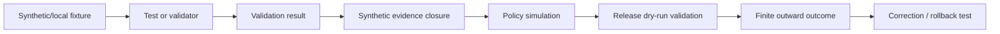

<!-- [KFM_META_BLOCK_V2]
doc_id: kfm://doc/tests/domains/atmosphere/no-network-fixtures/readme
title: tests/domains/atmosphere/no-network-fixtures/ — Atmosphere Offline Fixture Governance and Network-Independence Test Boundary
type: readme; directory-readme; domain-test-lane; atmosphere; fixture-governance; no-network; deterministic-tests; non-authoritative
version: v0.2
status: draft; repository-grounded; direct-lane-readme-only; direct-executable-tests-not-established; direct-manifest-not-established; broad-no-network-sibling-confirmed; reusable-atmosphere-fixture-root-confirmed; reusable-payload-inventory-unverified; test-local-atmosphere-wrapper-parent-not-found-at-named-path; no-network-runbook-draft; policy-scaffold; domain-workflow-todo-only; make-test-excludes-lane; no-network-enforcement-not-established; synthetic-only; public-safe; fail-closed; not-emergency-authority
owners: OWNER_TBD — Atmosphere steward · Test/QA steward · Fixture steward · Source steward · Security reviewer · Privacy/sensitivity reviewer · Contract steward · Schema steward · Policy steward · Evidence steward · Validator steward · Release steward · CI steward · Docs steward
created: 2026-07-05
updated: 2026-07-16
supersedes: v0.1 Atmosphere No-Network Fixture Test Lane README
policy_label: "public-review; tests; atmosphere; fixtures; no-network; deterministic; synthetic-only; public-safe; source-role-aware; knowledge-character-aware; evidence-aware; sensitivity-aware; deny-by-default; correction-aware; rollback-aware; no-source-authority; no-evidence-authority; no-policy-authority; no-release-authority; not-emergency-authority"
current_path: tests/domains/atmosphere/no-network-fixtures/README.md
truth_posture: >
  CONFIRMED target v0.1 README and prior blob; Directory Rules responsibility-root placement;
  Atmosphere domain-test parent; sibling no-network README and its broad egress-denial responsibility;
  reusable Atmosphere fixture parent and its documented child README lanes; Atmosphere no-network
  runbook; TODO-only domain-atmosphere workflow; Makefile test target excluding this lane; named-path
  probes showing no direct conftest.py, test_no_network_fixtures.py, manifest_expectations.json, or
  parent-level tests/domains/atmosphere/test_no_network_fixtures.py; named-path probe showing no
  tests/fixtures/domains/atmosphere/README.md; no matching task branch / PROPOSED this lane own
  fixture-specific routing, provenance, consumer backlinks, deterministic generation, public-safety,
  secret and remote-reference rejection, expected-outcome manifests, nonempty coverage, correction,
  rollback, and CI expectations while broad socket/HTTP/SDK denial remains with sibling no-network /
  CONFLICTED or drift-prone runbook claims that all upstream payloads come from hashed fixtures versus
  unverified payload inventory and manifest contracts; broad no-network versus fixture-specific lane
  overlap; fixture metadata fields without an accepted schema; Atmosphere/Air naming compatibility;
  proposed marker and CI names / UNKNOWN exhaustive recursive inventory, ignored/generated files,
  dynamic fixture generation, actual fixture payloads, fixture consumers, collected case count,
  accepted fixture manifest schema, network-blocking implementation, marker registration, retained
  reports, branch-protection significance, current pass rates, coverage, mutation score, flake rate,
  release dependency, and production use / NEEDS VERIFICATION accepted owners, CODEOWNERS, fixture
  identifiers and digests, consumer backlinks, nonempty fixture families, active secret scanning,
  remote-ref denial, deterministic generators, substantive tests, no-network enforcement, CI artifact
  retention, required-check status, correction cascade, and rollback rehearsal
evidence_snapshot:
  repository: bartytime4life/Kansas-Frontier-Matrix
  repository_id: "1059091169"
  visibility: public
  base_ref: main
  base_commit: d4da1d8bd25fac0255c87ea4d05e2e4c2f5a2fd3
  prior_blob: 8c2326f08755069124414ccecfa1dfc13c1e8fbe
  direct_lane_files_confirmed:
    - tests/domains/atmosphere/no-network-fixtures/README.md
  checked_absent_paths:
    - tests/domains/atmosphere/no-network-fixtures/conftest.py
    - tests/domains/atmosphere/no-network-fixtures/test_no_network_fixtures.py
    - tests/domains/atmosphere/no-network-fixtures/manifest_expectations.json
    - tests/domains/atmosphere/test_no_network_fixtures.py
    - tests/fixtures/domains/atmosphere/README.md
  related_repository_blobs:
    atmosphere_test_parent: 6474cc33c3bdd668fd8713e06e94f7dacda97b6b
    no_network_sibling: fd6e756370cee5eb6ec0a91773990e46d6c0083a
    atmosphere_fixture_parent: 3046c1246e4f6999a1c1eae0040a47b49012d52f
    no_network_runbook: b4ee495b8f99a6e6c760c272d91d5d976c04d892
    atmosphere_workflow: a3c6a21db798b02202c87f76bfba5f45c5f08c9b
    makefile: 4dc8cf633581893d83fba53219c6ea847992e6be
    directory_rules: 2affb080e6f0043867c64c7f06c1ca52030fbd55
  bounded_inventory_note: >
    Direct reads, named-path probes, and indexed search establish only the checked snapshot. They do
    not prove permanent absence from history, forks, ignored files, generated workspaces, dynamic test
    generation, Git LFS, external stores, differently named paths, or later commits.
related:
  - ../README.md
  - ../no-network/README.md
  - ../schema/README.md
  - ../source-role/README.md
  - ../knowledge-character/README.md
  - ../policy-deny/README.md
  - ../../../README.md
  - ../../../../fixtures/domains/atmosphere/README.md
  - ../../../../docs/runbooks/atmosphere/NO_NETWORK_TEST_RUNBOOK.md
  - ../../../../docs/doctrine/directory-rules.md
  - ../../../../docs/domains/atmosphere/README.md
  - ../../../../docs/domains/atmosphere/FILE_SYSTEM_PLAN.md
  - ../../../../contracts/domains/atmosphere/
  - ../../../../schemas/contracts/v1/domains/atmosphere/
  - ../../../../policy/domains/atmosphere/README.md
  - ../../../../tools/validators/domains/atmosphere/README.md
  - ../../../../.github/workflows/domain-atmosphere.yml
  - ../../../../Makefile
  - ../../../../schemas/contracts/v1/receipts/generated_receipt.schema.json
tags: [kfm, tests, atmosphere, fixtures, no-network, offline, deterministic, public-safe, fixture-manifest, source-role, knowledge-character, evidence, sensitivity, correction, rollback]
notes:
  - "This revision changes only this README; a generated provenance receipt is paired separately."
  - "The sibling no-network lane owns broad egress-denial behavior; this lane owns fixture-specific governance and proof expectations."
  - "The direct lane is README-only in bounded evidence; no direct executable test, conftest, or manifest was established."
  - "No fixture payload, test code, source record, schema, contract, policy, validator, workflow, lifecycle object, release object, alert, or public artifact is created or modified."
[/KFM_META_BLOCK_V2] -->

<a id="top"></a>

# Atmosphere Offline Fixture Governance and Network-Independence Test Boundary

`tests/domains/atmosphere/no-network-fixtures/`

> **One-line purpose.** Define the focused test boundary that proves Atmosphere fixtures are local, deterministic, public-safe, source-subordinate, consumer-traceable, and incapable of initiating live network access or silently becoming source, evidence, lifecycle, policy, release, alert, or publication authority.

<p>
  
  
  
  
  
  
  
</p>

> [!IMPORTANT]
> **This is a fixture-governance test lane, not a fixture warehouse.** Reusable Atmosphere payloads belong under [`fixtures/domains/atmosphere/`](../../../../fixtures/domains/atmosphere/README.md). This directory should contain executable tests and test-lane documentation that prove those payloads are safe, deterministic, correctly routed, and independent of live services.

> [!CAUTION]
> **Current executable enforcement is not established.** The checked direct lane contains this README only. Named probes did not find a direct test module, `conftest.py`, or fixture expectation manifest. A README, proposed command, fixture filename, TODO workflow, or zero-case collection is not proof that network access is blocked or fixtures are governed.

> [!WARNING]
> **KFM is not the official emergency, alerting, health, exposure, or life-safety authority.** Atmosphere fixtures may test advisory context and official-source redirects, but they must not encode current operational alerts as KFM instructions or produce outputs that appear to be official warnings.

**Quick links:** [Purpose](#purpose) · [Status](#current-evidence-and-maturity) · [Authority](#directory-rules-and-authority-split) · [Sibling split](#relationship-to-the-no-network-sibling) · [Inventory](#confirmed-and-checked-inventory) · [Scope](#test-scope) · [Fixture homes](#fixture-placement-and-routing) · [Manifest](#minimum-fixture-and-case-manifest) · [Matrix](#required-test-matrix) · [Network](#network-independence-contract) · [Safety](#public-safety-rights-and-sensitive-content) · [Determinism](#determinism-identity-and-replay) · [Consumers](#consumer-backlinks-orphans-and-nonempty-coverage) · [Outcomes](#finite-outcomes-and-reason-code-posture) · [Lifecycle](#lifecycle-evidence-and-release-boundary) · [Security](#untrusted-content-secrets-and-remote-references) · [Commands](#deterministic-inventory-collection-and-execution) · [Failures](#failure-interpretation) · [Passing](#what-a-passing-suite-does-not-prove) · [CI](#ci-and-promotion-boundary) · [Maintenance](#maintenance-generation-migration-and-deprecation) · [Implementation](#smallest-sound-implementation-sequence) · [Done](#definition-of-done) · [Open](#open-verification-register) · [Evidence](#evidence-ledger) · [Rollback](#changelog-correction-and-rollback)

---

## Purpose

This lane exists to prove **fixture-specific** no-network discipline for Atmosphere tests.

Its durable question is:

> Can every default Atmosphere test input be resolved locally, reproduced deterministically, reviewed safely, traced to an owning consumer, and rejected when it depends on live network state, secrets, uncontrolled source material, or an authority role it does not possess?

A mature suite should prove all of the following:

1. fixture bytes resolve from declared local paths;
2. no fixture requires HTTP, DNS, sockets, cloud SDKs, databases, message buses, map services, model runtimes, or source-client access;
3. fixture identity, version, digest, origin class, consumer, and expected outcome are explicit;
4. generated fixtures are reproducible from pinned inputs and parameters;
5. reusable fixture payloads and executable tests remain in separate responsibility surfaces;
6. source-shaped fixtures cannot activate a source or replace a `SourceDescriptor`;
7. evidence-shaped fixtures cannot become a production `EvidenceBundle`, proof, or receipt;
8. lifecycle-shaped fixtures cannot write or promote RAW, WORK, QUARANTINE, PROCESSED, CATALOG, TRIPLET, or PUBLISHED state;
9. policy-shaped fixtures cannot become real `PolicyDecision` records;
10. release-shaped fixtures cannot approve, sign, or publish a release;
11. exact sensitive details, secrets, living-person traces, restricted records, and current operational alerts are absent or represented only by conspicuous synthetic canaries;
12. missing fixtures, orphan fixtures, duplicate IDs, changed digests, undeclared consumers, remote references, and network attempts fail closed;
13. default results do not vary with upstream availability, current weather, current air quality, provider responses, developer caches, clock-sensitive URLs, or credentials;
14. correction, invalidation, deprecation, supersession, and rollback remain auditable;
15. test success remains bounded evidence of fixture behavior, not source or publication truth.

This lane does not own the broad network blocker, fixture payload authority, object meaning, schemas, policy, validators, evidence, release decisions, or public runtime.

[Back to top](#top)

---

## Current evidence and maturity

### Safe conclusion

The repository documents a clear offline-fixture posture, but focused executable enforcement is not established in the checked lane.

| Surface | Inspected status | Safe conclusion |
|---|---|---|
| This lane | **CONFIRMED README-only in bounded evidence** | Fixture-specific test intent exists; direct executable coverage is not established. |
| [`no-network/`](../no-network/README.md) | **CONFIRMED sibling README** | Owns broad network-denial behavior; implementation remains verification-bound. |
| [`fixtures/domains/atmosphere/`](../../../../fixtures/domains/atmosphere/README.md) | **CONFIRMED reusable fixture parent README** | Child README inventory exists; payload inventory and validity remain unverified. |
| [`NO_NETWORK_TEST_RUNBOOK.md`](../../../../docs/runbooks/atmosphere/NO_NETWORK_TEST_RUNBOOK.md) | **CONFIRMED draft runbook** | Defines an ambitious fixture-only proof slice; most implementation statements remain proposed. |
| Atmosphere policy | **Greenfield scaffold** | Policy execution for fixture safety is not established. |
| Atmosphere workflow | **TODO-only scaffold** | A green workflow cannot prove fixture governance. |
| Root `make test` | **Excludes this lane** | It currently invokes schema and contract test directories only. |
| Direct test module | **Not found at checked path** | No direct executable fixture-governance test was established. |
| Direct manifest | **Not found at checked path** | No accepted case or fixture expectation manifest was established. |
| Test-local Atmosphere fixture parent | **Not found at named path** | Do not assume a `tests/fixtures/domains/atmosphere/` wrapper authority exists. |

### Truth labels

| Label | Meaning here |
|---|---|
| `CONFIRMED` | Verified from repository files or bounded current-session readback. |
| `PROPOSED` | Recommended test, manifest, reason code, command, CI gate, or fixture rule not established as current implementation. |
| `UNKNOWN` | Not resolved by inspected evidence. |
| `NEEDS VERIFICATION` | Checkable, but not verified strongly enough to rely on. |
| `CONFLICTED` | Repository documents, paths, or maturity claims overlap or disagree. |

### Maturity ladder

| Level | Required evidence | Current posture |
|---|---|---|
| L0 — README | Lane contract exists. | **CONFIRMED** |
| L1 — Test object | At least one collected test function/class/case exists. | **NEEDS VERIFICATION** |
| L2 — Fixture inventory | Actual reusable payloads and IDs are enumerated. | **NEEDS VERIFICATION** |
| L3 — Consumer traceability | Every fixture has an owning test or validator backlink. | **NEEDS VERIFICATION** |
| L4 — Manifest validation | IDs, paths, digests, origin, safety, and outcomes are machine-checked. | **NEEDS VERIFICATION** |
| L5 — Network independence | Tests actively deny network and prove local-only resolution. | **NEEDS VERIFICATION** |
| L6 — Safety scanning | Secrets, remote refs, unsafe detail, and untrusted content are rejected. | **NEEDS VERIFICATION** |
| L7 — Nonempty coverage | Required fixture families and case counts cannot silently become zero. | **NEEDS VERIFICATION** |
| L8 — CI artifact | Safe collection/result reports are retained. | **NEEDS VERIFICATION** |
| L9 — Promotion significance | Material failures block relevant promotion. | **UNKNOWN** |
| L10 — Operational proof | Current pass, coverage, flake, mutation, correction, and rollback evidence exists. | **UNKNOWN** |

[Back to top](#top)

---

## Directory Rules and authority split

Directory Rules place enforceability proof under `tests/` and reusable fixture payloads under `fixtures/`. The Atmosphere domain remains a segment inside each responsibility root.

| Responsibility | Owning home | This lane's relationship |
|---|---|---|
| Fixture-governance tests | `tests/domains/atmosphere/no-network-fixtures/` | This lane. |
| Broad network-denial tests | [`tests/domains/atmosphere/no-network/`](../no-network/README.md) | Sibling; owns HTTP/socket/SDK/egress enforcement. |
| Reusable Atmosphere fixtures | [`fixtures/domains/atmosphere/`](../../../../fixtures/domains/atmosphere/README.md) | Payload authority; referenced, not copied here. |
| Small inline test cases | Owning test module | Allowed only when deliberately non-reusable and documented. |
| Test-local wrapper parent | `tests/fixtures/domains/atmosphere/` | **Not established at the checked path**; do not invent it silently. |
| Atmosphere object meaning | [`contracts/domains/atmosphere/`](../../../../contracts/domains/atmosphere/) | Tested; not defined here. |
| Machine shape | [`schemas/contracts/v1/domains/atmosphere/`](../../../../schemas/contracts/v1/domains/atmosphere/) | Tested; not authored here. |
| Policy authority | [`policy/domains/atmosphere/`](../../../../policy/domains/atmosphere/README.md) | Expected outcomes tested; rules not defined here. |
| Validator implementation | [`tools/validators/domains/atmosphere/`](../../../../tools/validators/domains/atmosphere/README.md) and accepted shared lanes | Invoked or mocked; not implemented here. |
| Source registry | accepted `data/registry/sources/atmosphere/` lane | Source-shaped fixtures are subordinate examples only. |
| Evidence and proof | accepted `data/proofs/` and `data/receipts/` lanes | Synthetic refs only; no production trust records. |
| Lifecycle data | accepted `data/` lifecycle roots | Simulated only; default tests must not write them. |
| Release, correction, rollback | `release/` | Simulated and validated; not decided here. |
| Operational instructions | [`docs/runbooks/atmosphere/NO_NETWORK_TEST_RUNBOOK.md`](../../../../docs/runbooks/atmosphere/NO_NETWORK_TEST_RUNBOOK.md) | Procedure guidance; not executable proof. |

> [!IMPORTANT]
> A fixture can resemble an object, source record, EvidenceBundle, release manifest, or public payload without becoming that authority. Shape resemblance is not authority transfer.

[Back to top](#top)

---

## Relationship to the `no-network` sibling

The two lanes should remain complementary.

| Lane | Owns | Does not own |
|---|---|---|
| [`no-network/`](../no-network/README.md) | Broad default egress denial across HTTP clients, sockets, DNS, SDKs, databases, tiles, geocoders, source clients, model runtimes, and integration markers. | Reusable fixture inventory, fixture digests, consumer backlinks, fixture safety metadata. |
| `no-network-fixtures/` | Local fixture routing, manifest shape, deterministic bytes, origin/safety posture, consumer traceability, remote-reference rejection, fixture non-authority, and fixture-family completeness. | General connector/runtime network hooks unrelated to fixture loading. |

A test may exercise both concerns, but one assertion should identify which invariant failed.

Examples:

- Fixture contains a remote URL that the loader tries to fetch:
  - fixture-governance failure: remote reference is forbidden;
  - broad no-network failure: outbound attempt must be blocked.
- Fixture references a missing local file:
  - fixture-governance failure: unresolved local dependency;
  - not necessarily a network-hook failure.
- Code calls a live API without consulting any fixture:
  - broad `no-network/` failure;
  - not a fixture manifest failure.
- Fixture bytes changed without a digest update:
  - fixture-governance failure;
  - no network attempt is required.

[Back to top](#top)

---

## Confirmed and checked inventory

### Direct lane

Bounded readback established:

```text
tests/domains/atmosphere/no-network-fixtures/
└── README.md
```

Named probes did not find:

```text
tests/domains/atmosphere/no-network-fixtures/conftest.py
tests/domains/atmosphere/no-network-fixtures/test_no_network_fixtures.py
tests/domains/atmosphere/no-network-fixtures/manifest_expectations.json
tests/domains/atmosphere/test_no_network_fixtures.py
tests/fixtures/domains/atmosphere/README.md
```

This is not a permanent-absence claim. It is the checked repository-facing snapshot.

### Reusable fixture parent

The reusable Atmosphere fixture README documents these broad child families:

- `bundles/`
- `golden/`
- `invalid/`
- `objects/`
- `sources/`
- `valid/`
- object-specific valid and invalid README lanes

That documentation does not establish actual payload presence, payload validity, fixture digests, consumer backlinks, or test coverage.

[Back to top](#top)

---

## Test scope

### In scope

- fixture-root allowlist tests;
- local-only path resolution;
- path traversal and symlink-escape rejection;
- remote URI and remote JSON-reference rejection;
- secret-pattern and private-endpoint rejection;
- deterministic serialization and digest checks;
- generated-fixture reproducibility;
- stable fixture IDs and versioning;
- duplicate ID detection;
- orphan fixture detection;
- missing consumer backlink detection;
- missing expected-outcome detection;
- valid/invalid/deny/abstain/error/correction/rollback fixture polarity;
- public-safe geometry and metadata checks;
- source-role and knowledge-character preservation;
- time-kind and vintage metadata checks;
- fixture size/resource budgets;
- no writes outside temporary test directories;
- no writes into lifecycle, catalog, proof, receipt, release, or published roots;
- safe diagnostics and retained artifact scanning;
- integration-only marker checks for live-source tests;
- fixture invalidation, supersession, migration, and rollback tests.

### Out of scope

- production connector, adapter, parser, pipeline, validator, policy, or API implementation;
- real source-system snapshots or scraped caches;
- live network or credentialed integration tests in the default tier;
- canonical schemas, contracts, policies, source descriptors, registries, EvidenceBundles, receipts, proofs, releases, or published artifacts;
- current official alerts, medical guidance, exposure determinations, emergency actions, or regulatory decisions;
- exact restricted locations or living-person/device-owner traces;
- accepting fixture validity merely because JSON parses;
- accepting source authority merely because a fixture carries attribution fields;
- publishing a fixture or test result.

[Back to top](#top)

---

## Fixture placement and routing

Use the smallest correct authority surface.

```text
Is the item executable test code?
├─ yes → tests/domains/atmosphere/no-network-fixtures/ or the owning test lane
└─ no
   Is it a reusable synthetic Atmosphere payload?
   ├─ yes → fixtures/domains/atmosphere/
   └─ no
      Is it a tiny non-reusable inline case owned by one test?
      ├─ yes → keep inline with an explicit reason
      └─ no → HOLD until ownership and placement are resolved
```

### Reusable fixture requirements

A reusable payload should:

- have a stable fixture ID;
- identify its object/source family and intended consumers;
- identify valid/invalid/deny/abstain/correction/rollback polarity;
- declare that default network access is forbidden;
- carry a content digest or be generated deterministically;
- identify synthetic, transformed-public, or other governed origin;
- carry source vintage and time basis when relevant;
- preserve source role and knowledge character when relevant;
- avoid unsupported authority claims;
- be compact and reviewable;
- include expected safe outcomes and reason codes;
- include correction/supersession lineage when changed materially.

### Inline fixture exception

Inline cases are appropriate only when they are:

- very small;
- owned by one test;
- not reused across modules;
- not source-shaped in a way likely to become canonical;
- free of sensitive or operational detail;
- explicit about why a reusable fixture is unnecessary.

[Back to top](#top)

---

## Minimum fixture and case manifest

No accepted machine manifest was established. The following contract is **PROPOSED**.

```yaml
fixture_id: atmo-fixture-...
fixture_version: 1
fixture_path: fixtures/domains/atmosphere/...
fixture_sha256: ...
domain: atmosphere
object_family: ...
source_family: null
knowledge_character: null
source_role: null

origin:
  class: synthetic | transformed_public | generated
  upstream_reference: null
  recording_time: null
  source_vintage: null
  rights_posture: public_safe
  sensitivity_posture: public_safe

execution:
  network_required: false
  credentials_required: false
  deterministic: true
  generator_ref: null
  generator_version: null
  seed: null
  clock_mode: fixed | not_applicable

case:
  case_id: atmo-case-...
  consumers:
    - tests/domains/atmosphere/...
  expected_outcome: PASS | INVALID | ABSTAIN | DENY | HOLD | ERROR
  expected_reason_codes:
    - ATMO_FIXTURE_...
  forbidden_outputs:
    - synthetic-secret-canary
  max_bytes: 65536

lifecycle:
  status: active | deprecated | superseded | withdrawn
  supersedes: null
  replacement_fixture_id: null
  correction_ref: null
  rollback_ref: null
```

### Manifest invariants

- `fixture_path` resolves within an accepted fixture root.
- Digest format and bytes match.
- `network_required` and `credentials_required` are `false` for the default tier.
- Every active fixture has at least one declared consumer.
- Every declared consumer exists and references the fixture or its manifest.
- Every case has one primary expected outcome.
- Negative fixtures fail for the intended reason, not an earlier unrelated error.
- Sensitive/public posture is explicit.
- Generated fixtures identify a reproducible generator and parameters.
- Deprecated or superseded fixtures identify migration expectations.
- No field grants source, evidence, policy, release, or alert authority.

[Back to top](#top)

---

## Required test matrix

### Placement and identity

| Case | Input condition | Expected result |
|---|---|---|
| Accepted reusable path | Fixture resolves under declared Atmosphere fixture root. | `PASS`. |
| Unknown fixture root | Path resolves outside accepted roots. | `DENY` / test failure. |
| Traversal attempt | `../`, symlink, archive member, or canonicalized path escapes root. | `DENY`. |
| Duplicate fixture ID | Two active fixtures claim one ID. | `INVALID`. |
| Digest mismatch | Manifest digest differs from bytes. | `INVALID`. |
| Missing version | Reusable fixture lacks version. | `HOLD` / validation failure. |
| Untracked mutation | Bytes change without version/digest/correction update. | `INVALID`. |
| Orphan fixture | Active fixture has no consumer. | `HOLD` / coverage failure. |
| Missing fixture | Consumer references absent path or ID. | `ERROR`. |

### Network and external state

| Case | Input condition | Expected result |
|---|---|---|
| Local-only fixture | All dependencies resolve in repository or temp test scope. | `PASS`. |
| HTTP(S) reference | Fixture or schema ref points to remote URL. | `DENY`. |
| DNS/socket attempt | Loader or generator opens network connection. | broad no-network failure plus fixture failure. |
| Cloud/database dependency | Fixture requires S3, GCS, database, queue, or vendor SDK. | `DENY`. |
| Remote schema reference | Validation tries to retrieve remote schema. | `ERROR` / `DENY`. |
| Current-service lookup | Expected value depends on current EPA/NOAA/NASA/vendor response. | `DENY`. |
| Developer cache dependency | Result changes with machine-local cache. | `INVALID`. |
| Credential dependency | Test reads token, cookie, service account, `.env`, or keychain. | security failure. |
| Opt-in live test | Explicit integration/manual marker and separate controls exist. | excluded from default suite. |
| Unmarked live test | Live dependency appears in default collection. | `FAIL`. |

### Determinism and generation

| Case | Input condition | Expected result |
|---|---|---|
| Stable bytes | Same fixture version yields same canonical bytes. | `PASS`. |
| Stable generated output | Same generator version, seed, and fixed time reproduce digest. | `PASS`. |
| Wall-clock dependency | Output changes with current time without declared clock fixture. | `INVALID`. |
| Random seed missing | Generator uses randomness without pinned seed. | `INVALID`. |
| Environment dependency | Output changes with locale, timezone, hostname, or user home. | `INVALID`. |
| Unpinned generator | Generated payload lacks generator/version reference. | `HOLD`. |
| Oversized fixture | Payload exceeds declared review/resource budget. | `HOLD` / `DENY`. |
| Nondeterministic serialization | Key/order/float/encoding varies across replay. | `INVALID`. |

### Source, evidence, and authority

| Case | Input condition | Expected result |
|---|---|---|
| Synthetic source-shaped fixture | Clearly labeled synthetic and test-only. | `PASS`. |
| Fixture treated as admitted source | Presence activates connector or source. | `DENY`. |
| Fixture treated as source truth | Attribution fields are accepted as authority. | `DENY`. |
| EvidenceRef-shaped fixture | Resolves only to synthetic test bundle or expected abstention. | `PASS`. |
| Fixture treated as EvidenceBundle | Test example is cited as production evidence. | `DENY`. |
| Generated prose as expected truth | Model text supplies expected answer without governed evidence. | `DENY`. |
| Missing evidence fixture | Evidence-dependent path lacks synthetic closure. | `ABSTAIN` / `INVALID`. |
| Withdrawn fixture | Consumer still accepts superseded/withdrawn fixture. | correction failure. |

### Atmosphere semantic boundaries

| Case | Input condition | Expected result |
|---|---|---|
| AQI report preserved | Fixture remains report/index context. | `PASS`. |
| AQI as concentration | Fixture presents index as pollutant measurement. | `DENY`. |
| AOD/mask preserved | Remote-sensing proxy remains proxy/context. | `PASS`. |
| AOD as PM2.5 | Fixture presents proxy as ground concentration. | `DENY`. |
| Model preserved | Forecast/reanalysis remains modeled. | `PASS`. |
| Model as observation | Fixture relabels model as direct measurement. | `DENY`. |
| Low-cost sensor caveats | Correction, confidence, limitations, and review posture present. | `PASS` for bounded use. |
| Low-cost sensor overclaim | Caveats absent for strong/public claim. | `RESTRICT` / `DENY`. |
| Climate aggregate preserved | Baseline/aggregate/time basis remain explicit. | `PASS`. |
| Aggregate as place event | Climate context presented as local observed event. | `DENY` / `ABSTAIN`. |
| Advisory context preserved | Official issuer/referral remains explicit. | `PASS`. |
| Advisory as KFM alert | Fixture makes KFM issuing authority. | `DENY`. |
| Site/network context preserved | Metadata does not become observation truth. | `PASS`. |
| Exact or sensitive site detail | Fixture exposes unsafe precise detail. | `DENY` / generalize. |

### Lifecycle and release

| Case | Input condition | Expected result |
|---|---|---|
| Lifecycle simulation | Fixture models a stage without writing canonical data. | `PASS`. |
| Lifecycle write | Test writes to RAW/WORK/QUARANTINE/PROCESSED/CATALOG/TRIPLET/PUBLISHED. | `ERROR`. |
| Fixture becomes catalog truth | Test output is indexed as canonical record. | `DENY`. |
| Release dry-run fixture | Synthetic manifest is validated without signing/publishing. | `PASS`. |
| Passing test treated as approval | Green result authorizes release. | `DENY`. |
| Missing rollback fixture | Consequential release-shaped case has no rollback target. | `HOLD`. |
| Correction fixture | New version preserves supersession and invalidation lineage. | `PASS`. |
| Withdrawn fixture still used | Consumer accepts withdrawn fixture. | `FAIL`. |

### Diagnostics and artifacts

| Case | Input condition | Expected result |
|---|---|---|
| Safe failure | Diagnostic contains fixture ID/path/reason code only. | `PASS`. |
| Secret echo | Token/cookie/private endpoint appears in log. | security failure. |
| Sensitive-value echo | Exact restricted detail appears in assertion/report. | security/policy failure. |
| Remote response body | Live provider body appears in artifact. | no-network failure. |
| Empty collection | No fixture-governance cases collected. | coverage failure. |
| Empty required family | Required valid/invalid/deny family has zero cases. | coverage failure. |
| TODO job green | Workflow echoes TODO. | scaffold success only. |

[Back to top](#top)

---

## Network independence contract

Fixture governance should reject network dependence before runtime where possible.

### Static checks

Inspect fixture text and manifests for:

- `http://`, `https://`, `ftp://`, `s3://`, `gs://`, database DSNs, and vendor-specific URI schemes;
- remote `$ref`, include, import, attachment, tile, style, sprite, glyph, imagery, elevation, or geocoding URLs;
- signed URL query parameters;
- credential, token, cookie, account, project, bucket, database, queue, or endpoint fields;
- shell commands or code snippets that fetch content;
- generator configurations that invoke remote clients;
- hidden indirection through environment variables.

### Runtime checks

The sibling [`no-network/`](../no-network/README.md) lane should actively block:

- DNS resolution;
- raw sockets;
- HTTP clients;
- cloud and source SDK transports;
- remote databases and queues;
- map/tile/geocoder clients;
- package and schema downloads;
- remote model or AI endpoints.

This lane should assert that fixture loaders and generators succeed under those blocks and fail with clear fixture-specific outcomes when they cannot.

### Integration tier

A live-source fixture recording workflow, if ever accepted, must be separate from default tests and should require:

- explicit manual/integration opt-in;
- source admission and rights review;
- approved credentials outside public CI;
- quarantine-first handling;
- sensitive-data review;
- immutable recording receipt;
- transform/redaction record;
- fixture steward review;
- no direct promotion from recording to reusable fixture;
- separate pull request and digest review.

[Back to top](#top)

---

## Public safety, rights, and sensitive content

### Prohibited default-fixture content

Do not store:

- real secrets, tokens, cookies, signed URLs, service-account files, or private endpoints;
- current official alerts or instructions copied as KFM guidance;
- exact restricted archaeology, burial, sacred, rare-species, habitat, infrastructure, or private-property details;
- living-person names, contact details, account IDs, device owners, household-level traces, or private sensor hosts;
- DNA/genomic data or consent-bearing records;
- embargoed or unpublished source material;
- proprietary source dumps without rights clearance;
- operational security details;
- production logs or request/response captures;
- data whose safe status cannot be established.

### Safe negative testing

Use conspicuous synthetic canaries such as:

```text
SYNTHETIC_SECRET_CANARY_DO_NOT_USE
SYNTHETIC_PRIVATE_ENDPOINT.invalid
SYNTHETIC_RESTRICTED_LOCATION_CANARY
SYNTHETIC_OFFICIAL_ALERT_CANARY
SYNTHETIC_LIVING_PERSON_CANARY
```

Assert that canaries:

- trigger the intended validator or policy path;
- never reach outward payloads;
- never appear in retained logs or reports except in a controlled scanner expectation;
- are not plausible real values;
- cannot be mistaken for current operational guidance.

### Rights and provenance

A transformed-public fixture should record:

- source family and public reference;
- acquisition/recording date;
- source vintage;
- rights/license posture;
- transformations;
- removed or generalized fields;
- sensitivity review;
- reason it is safe for public repository use;
- digest and reviewer.

These records are fixture provenance, not source admission or release approval.

[Back to top](#top)

---

## Determinism, identity, and replay

### Deterministic identity

A fixture ID should be stable and independent of local path alone. A proposed identity basis is:

```text
domain + object/source family + case purpose + fixture version
```

A content digest proves bytes; it should not replace semantic identity or versioning.

### Canonical bytes

Where practical:

- UTF-8 without BOM;
- final newline for text;
- normalized line endings;
- stable JSON canonicalization or declared serializer;
- explicit numeric precision;
- explicit timezone and time-kind fields;
- fixed clock values;
- sorted collections only when order is semantically irrelevant;
- no host-specific paths;
- no nondeterministic timestamps or UUIDv4 values.

### Generated fixtures

A deterministic generator should pin:

- generator path and version;
- source template digest;
- seed;
- fixed clock;
- locale/timezone;
- dependency versions;
- parameters;
- output schema/contract version;
- expected digest.

A generated fixture should not be accepted merely because the generator exits successfully.

### Replay receipt

A future replay report may include:

```json
{
  "fixture_id": "atmo-fixture-example-v1",
  "expected_sha256": "…",
  "actual_sha256": "…",
  "generator_ref": "tools/…",
  "generator_version": "…",
  "seed": 0,
  "clock": "2026-01-01T00:00:00Z",
  "outcome": "PASS"
}
```

This is a QA artifact, not a production `RunReceipt`.

[Back to top](#top)

---

## Consumer backlinks, orphans, and nonempty coverage

### Two-way traceability

Every reusable fixture should name at least one consumer. Every consumer should reference the fixture ID or manifest entry.

A mature validator should detect:

- active fixture with no consumer;
- consumer referencing missing fixture;
- manifest consumer path that no longer exists;
- duplicated fixture IDs;
- two divergent payloads claiming the same semantic version;
- required test family with zero fixtures;
- fixture used outside its declared domain/object/source scope;
- deprecated fixture used by a required test;
- superseded fixture with no migration expectation.

### Nonempty guarantees

At minimum, the focused suite should assert nonzero counts for:

- local-only valid fixtures;
- invalid shape fixtures;
- forbidden remote-reference fixtures;
- secret/private-endpoint fixtures;
- path traversal/symlink escape fixtures;
- semantic anti-collapse fixtures;
- missing evidence/abstention fixtures;
- policy deny/restrict fixtures;
- correction/supersession/rollback fixtures.

A green test with no collected cases or no fixture files is a coverage failure, not success.

### Coverage manifest

A proposed summary:

```yaml
required_families:
  local_valid: {minimum: 1}
  remote_reference_denied: {minimum: 1}
  credential_denied: {minimum: 1}
  path_escape_denied: {minimum: 1}
  semantic_collapse_denied: {minimum: 4}
  evidence_abstain: {minimum: 1}
  correction_or_rollback: {minimum: 1}
```

Thresholds are **PROPOSED** and require owner acceptance.

[Back to top](#top)

---

## Finite outcomes and reason-code posture

### Outcome layers

| Layer | Suggested outcomes | Meaning |
|---|---|---|
| Pytest | pass, fail, skip, error | Framework status only. |
| Fixture validation | `VALID`, `INVALID`, `HOLD`, `ERROR` | Fixture/manifest result. |
| Fixture routing | `ALLOW_LOCAL`, `REDIRECT`, `DENY`, `HOLD`, `ERROR` | Placement decision, not policy authority. |
| Policy simulation | `ALLOW`, `RESTRICT`, `QUARANTINE`, `HOLD`, `ABSTAIN`, `DENY`, `ERROR` | Synthetic expected decision. |
| Runtime envelope | `ANSWER`, `ABSTAIN`, `DENY`, `ERROR` | Governed outward-answer posture. |
| Lifecycle simulation | `PROPOSED`, `NEEDS_REVIEW`, `BLOCKED`, `WITHDRAWN`, `ROLLED_BACK`, `ERROR` | Synthetic workflow state. |

### Proposed safe reason codes

```text
ATMO_FIXTURE_ZERO_CASES
ATMO_FIXTURE_REQUIRED_FAMILY_EMPTY
ATMO_FIXTURE_MISSING
ATMO_FIXTURE_ORPHAN
ATMO_FIXTURE_CONSUMER_MISSING
ATMO_FIXTURE_DUPLICATE_ID
ATMO_FIXTURE_DIGEST_MISMATCH
ATMO_FIXTURE_VERSION_MISSING
ATMO_FIXTURE_UNTRACKED_MUTATION
ATMO_FIXTURE_ROOT_DENIED
ATMO_FIXTURE_PATH_ESCAPE
ATMO_FIXTURE_REMOTE_REFERENCE
ATMO_FIXTURE_NETWORK_ATTEMPT
ATMO_FIXTURE_CREDENTIAL_DEPENDENCY
ATMO_FIXTURE_SECRET_PATTERN
ATMO_FIXTURE_PRIVATE_ENDPOINT
ATMO_FIXTURE_NONDETERMINISTIC
ATMO_FIXTURE_GENERATOR_UNPINNED
ATMO_FIXTURE_OVERSIZED
ATMO_FIXTURE_PUBLIC_SAFETY_DENIED
ATMO_FIXTURE_SENSITIVE_DETAIL
ATMO_FIXTURE_SOURCE_AUTHORITY_COLLAPSE
ATMO_FIXTURE_EVIDENCE_AUTHORITY_COLLAPSE
ATMO_FIXTURE_LIFECYCLE_AUTHORITY_COLLAPSE
ATMO_FIXTURE_RELEASE_AUTHORITY_COLLAPSE
ATMO_FIXTURE_ALERT_AUTHORITY_COLLAPSE
ATMO_FIXTURE_KNOWLEDGE_CHARACTER_COLLAPSE
ATMO_FIXTURE_SOURCE_ROLE_COLLAPSE
ATMO_FIXTURE_EVIDENCE_MISSING
ATMO_FIXTURE_WITHDRAWN
ATMO_FIXTURE_ROLLBACK_TARGET_MISSING
ATMO_FIXTURE_DIAGNOSTIC_LEAK
```

These codes are **PROPOSED**. They must not contain secrets, provider response bodies, exact sensitive values, private identities, or current alert text.

[Back to top](#top)

---

## Lifecycle, evidence, and release boundary

Fixtures may simulate every trust-spine stage without owning any stage.



### Forbidden side effects

Default fixture tests must not:

- write to canonical RAW, WORK, QUARANTINE, PROCESSED, CATALOG, TRIPLET, or PUBLISHED roots;
- mutate source registries;
- emit production EvidenceBundles, proofs, or receipts;
- sign release manifests;
- publish layers, tiles, exports, APIs, UI state, alerts, or AI answers;
- invalidate production caches;
- contact release, registry, source, or evidence services.

### Passing limits

A passing fixture test means only:

> The configured code path behaved as expected for the pinned local sample under the tested controls.

It does not establish that:

- the live source is admitted or unchanged;
- the fixture accurately represents every upstream condition;
- source rights or cadence are current;
- a claim is true;
- evidence is production-complete;
- policy permits a real release;
- release review occurred;
- public deployment is correct.

[Back to top](#top)

---

## Untrusted content, secrets, and remote references

Treat every fixture field as untrusted, including:

- filenames and archive members;
- URLs and refs;
- Markdown/HTML;
- CSV formulas;
- JSON keys and strings;
- source metadata;
- citations;
- attachment names;
- nested properties;
- generated prose;
- exception messages.

Test:

- path traversal and symlink escape;
- archive bombs and unsafe extraction;
- remote schema/reference resolution;
- SSRF-like URLs;
- script, HTML, Markdown, and formula injection;
- control characters and misleading Unicode;
- oversized/nested payloads;
- prompt injection and instruction-like fixture text;
- secret-like patterns;
- private endpoints;
- dangerous serialization tags;
- diagnostic echo.

A negative fixture should trigger a safe reason code without reproducing the unsafe value in ordinary logs.

[Back to top](#top)

---

## Deterministic inventory, collection, and execution

The commands below are proposed review commands. They do not claim current test success.

### Inventory

```bash
find tests/domains/atmosphere/no-network-fixtures -maxdepth 5 -type f | sort
find fixtures/domains/atmosphere -maxdepth 6 -type f | sort
find tests/domains/atmosphere/no-network -maxdepth 5 -type f | sort
```

### Placeholder and test-object detection

```bash
python - <<'PY'
from pathlib import Path
import ast

roots = [
    Path("tests/domains/atmosphere/no-network-fixtures"),
    Path("tests/domains/atmosphere/no-network"),
]
for root in roots:
    for path in sorted(root.rglob("test_*.py")):
        tree = ast.parse(path.read_text(encoding="utf-8"), filename=str(path))
        objects = [
            node
            for node in tree.body
            if isinstance(node, (ast.FunctionDef, ast.AsyncFunctionDef, ast.ClassDef))
            and getattr(node, "name", "").startswith("test")
        ]
        print(f"{path}: test-object-candidates={len(objects)}")
PY
```

### Collection

```bash
python -m pytest --collect-only -q \
  tests/domains/atmosphere/no-network-fixtures \
  tests/domains/atmosphere/no-network
```

Zero cases in a required lane should be reported as a coverage failure.

### Focused execution

```bash
python -m pytest -q \
  tests/domains/atmosphere/no-network-fixtures \
  tests/domains/atmosphere/no-network
```

### Repository context

```bash
make test
make schemas
```

Current evidence says `make test` does not include this lane. Do not report fixture-governance coverage merely because it passes.

### Safe report

```bash
mkdir -p artifacts/qa
python -m pytest -q \
  --junitxml=artifacts/qa/atmosphere-no-network-fixtures.xml \
  tests/domains/atmosphere/no-network-fixtures
```

The report path and retention policy are **PROPOSED**. Any retained artifact must be scanned for secrets, remote response bodies, sensitive details, current alert text, and unsafe canaries.

[Back to top](#top)

---

## Failure interpretation

| Signal | Safe interpretation | Do not claim |
|---|---|---|
| README exists | Lane contract exists. | Fixture enforcement is implemented. |
| Fixture README exists | Planned or documented fixture family exists. | Payloads exist or are valid. |
| Fixture file exists | Sample bytes exist. | Source or evidence truth. |
| JSON parses | Syntax is valid. | Contract, policy, safety, or release validity. |
| Digest matches | Bytes match expected bytes. | Semantics or rights are correct. |
| No HTTP URL appears | One static check passed. | Runtime network is blocked. |
| Network hook passes | Tested egress surfaces were denied. | Every transport is blocked. |
| Zero cases collected | Coverage gap. | Green suite. |
| TODO workflow passes | Scaffold executed. | Fixture governance passed. |
| Policy simulation allows | Synthetic context passed supplied rules. | Real policy approval. |
| Release-shaped fixture passes | Shape/rules passed for sample. | Release approved. |
| No secret scanner finding | Scanner found no configured pattern. | Fixture is fully public-safe. |
| Fixture resembles source data | Test example models source shape. | Source is admitted. |

[Back to top](#top)

---

## What a passing suite does not prove

Even a mature green suite would not by itself prove:

- live upstream behavior matches fixtures;
- source terms, rights, cadence, or availability remain current;
- every transport path is blocked;
- every fixture is semantically representative;
- every unsafe field or encoding is covered;
- the machine registry, schema, policy, or validator is complete;
- evidence is production-complete;
- public release is authorized;
- official alerts or health guidance are accurate;
- production deployment uses the tested versions;
- operational rollback has occurred.

Fixture tests are bounded enforceability evidence, not sovereign truth.

[Back to top](#top)

---

## CI and promotion boundary

### Current evidence

- `.github/workflows/domain-atmosphere.yml` contains TODO echo jobs.
- `make test` runs schema and contract test directories, not this lane.
- No dedicated Atmosphere fixture-governance workflow, retained report, or required-check significance was established.
- No network blocker, marker registration, or manifest validator was established for this lane.

### Substantive future job

A meaningful job should:

1. install pinned dependencies;
2. run with egress denied or actively patched;
3. assert a nonzero focused collection count;
4. validate fixture manifests and digests;
5. reject orphans, missing consumers, duplicate IDs, remote refs, secrets, private endpoints, and unsafe detail;
6. replay deterministic generators;
7. run semantic anti-collapse cases;
8. prove no writes outside temporary/artifact paths;
9. scan stdout, stderr, JUnit, and summaries for forbidden canaries;
10. retain public-safe reports;
11. fail on missing required fixture families;
12. block relevant promotion when fixture-governance evidence is material.

A green job remains necessary but insufficient for release. Source admission, rights, evidence, policy, review, release state, correction, and rollback stay separate.

[Back to top](#top)

---

## Maintenance, generation, migration, and deprecation

### Adding a fixture

1. Identify the owning test or validator.
2. Decide reusable versus inline placement.
3. Assign stable fixture ID and version.
4. Record synthetic/transformed origin and public-safety posture.
5. Pin digest or deterministic generator.
6. Declare expected outcome and reason code.
7. Add consumer backlink.
8. Add valid and fail-closed polarity where appropriate.
9. Run network-independent replay.
10. Scan fixture and diagnostics.
11. Update indexes/manifests.
12. Record correction and rollback implications.

### Changing fixture bytes

A material change should:

- increment version or document why not;
- update digest;
- identify semantic effect;
- update expected outcomes;
- verify all consumers;
- preserve supersession history;
- avoid silent in-place reinterpretation;
- rerun focused tests and scanners.

### Moving a fixture

A move should include:

- owning-root confirmation;
- old/new path mapping;
- consumer updates;
- compatibility or deprecation window where needed;
- duplicate cleanup;
- digest verification;
- rollback path.

### Removing a fixture

Do not silently delete. Verify:

- no active consumer remains;
- replacement or retirement reason exists;
- expected coverage does not become empty;
- manifest/index is updated;
- retained reports and docs are corrected;
- rollback remains possible.

### Generator changes

Treat generator version changes as potentially material even when output digest is unchanged. Review code, dependencies, parameters, and provenance.

[Back to top](#top)

---

## Smallest sound implementation sequence

1. Inventory the direct lane and reusable Atmosphere fixture tree.
2. Decide whether this child lane or a parent-level test file owns executable fixture-governance tests.
3. Create an accepted case/fixture manifest or a minimal local equivalent.
4. Add one local valid fixture and one remote-reference denial fixture.
5. Add one credential/private-endpoint denial fixture.
6. Add path traversal and symlink-escape tests.
7. Add digest and duplicate-ID tests.
8. Add orphan and missing-consumer checks.
9. Integrate the sibling no-network blocker.
10. Add one Atmosphere semantic anti-collapse fixture.
11. Add correction/supersession/rollback coverage.
12. Assert nonzero case/family counts.
13. Emit and scan a safe QA report.
14. Wire a substantive CI job.
15. Promote maturity only from files, collection, runs, logs, and retained artifacts.

[Back to top](#top)

---

## Definition of done

Documentation is complete when placement, authority, sibling responsibility, current maturity, fixture routing, manifest expectations, network independence, public safety, determinism, consumer traceability, finite outcomes, lifecycle limits, commands, maintenance, correction, and rollback are explicit.

The lane is not implementation-complete until:

- [ ] executable fixture-governance tests exist;
- [ ] expected collection count is nonzero;
- [ ] reusable fixture inventory is machine-readable or otherwise governed;
- [ ] fixture IDs, versions, and digests are validated;
- [ ] every active fixture has a consumer backlink;
- [ ] orphan and duplicate fixtures fail;
- [ ] remote refs and network dependence fail;
- [ ] secrets, private endpoints, unsafe detail, and untrusted content fail safely;
- [ ] deterministic generators replay;
- [ ] required fixture families cannot become empty;
- [ ] sibling no-network enforcement is active;
- [ ] no canonical lifecycle or release path is mutated;
- [ ] safe reports are retained and scanned;
- [ ] substantive CI runs the lane;
- [ ] failures block relevant promotion;
- [ ] correction and rollback drills execute;
- [ ] owners and CODEOWNERS are accepted;
- [ ] current pass, coverage, flake, and mutation evidence is available.

[Back to top](#top)

---

## Open verification register

| ID | Question | Status | Evidence needed |
|---|---|---|---|
| ATMO-NNF-01 | Is this child lane retained as the executable home, or should tests live at the Atmosphere parent? | NEEDS VERIFICATION | Ownership decision and current test tree. |
| ATMO-NNF-02 | Are any direct executable tests or dynamically generated cases present? | NEEDS VERIFICATION | Full tree and pytest collection. |
| ATMO-NNF-03 | What reusable fixture payloads actually exist? | NEEDS VERIFICATION | Current fixture inventory. |
| ATMO-NNF-04 | Is there an accepted fixture manifest schema? | NEEDS VERIFICATION | Schema/contract/ADR evidence. |
| ATMO-NNF-05 | Are fixture IDs and digests governed? | NEEDS VERIFICATION | Manifest and validator. |
| ATMO-NNF-06 | Does every fixture have an active consumer backlink? | NEEDS VERIFICATION | Fixture-consumer graph. |
| ATMO-NNF-07 | What marker names distinguish offline, integration, and live-source tiers? | NEEDS VERIFICATION | Pytest config and tests. |
| ATMO-NNF-08 | Which network blocker surfaces are implemented? | NEEDS VERIFICATION | Shared hooks and negative tests. |
| ATMO-NNF-09 | Are remote JSON/schema refs denied? | NEEDS VERIFICATION | Resolver config and tests. |
| ATMO-NNF-10 | Are generators deterministic and versioned? | NEEDS VERIFICATION | Generator inventory and replay reports. |
| ATMO-NNF-11 | Are fixture families protected against zero cases? | NEEDS VERIFICATION | Coverage manifest and CI. |
| ATMO-NNF-12 | Are secrets, private endpoints, and unsafe content scanned? | NEEDS VERIFICATION | Scanner config and retained output. |
| ATMO-NNF-13 | Is the no-network runbook aligned with actual commands and paths? | NEEDS VERIFICATION | Runbook audit against implementation. |
| ATMO-NNF-14 | Does CI run substantive checks instead of TODO echoes? | NEEDS VERIFICATION | Workflow and successful logs. |
| ATMO-NNF-15 | Is the check required for relevant promotion? | UNKNOWN | Branch protection and promotion config. |
| ATMO-NNF-16 | Who owns fixture safety and review? | NEEDS VERIFICATION | CODEOWNERS and stewardship register. |
| ATMO-NNF-17 | What are current pass, coverage, mutation, and flake metrics? | UNKNOWN | Current QA reports. |
| ATMO-NNF-18 | Are correction, invalidation, supersession, and rollback operationally rehearsed? | NEEDS VERIFICATION | Drill artifacts and logs. |

[Back to top](#top)

---

## Evidence ledger

| Evidence | What it supports | Limits |
|---|---|---|
| Target prior blob `8c2326f08755069124414ccecfa1dfc13c1e8fbe` | Existing fixture/no-network intent. | Planning-oriented and maturity-incomplete. |
| [`tests/domains/atmosphere/README.md`](../README.md) | Parent Atmosphere test boundary and named child lanes. | Parent documentation does not prove child execution. |
| [`no-network/README.md`](../no-network/README.md) | Broad network-denial versus fixture-specific split. | Implementation remains verification-bound. |
| [`fixtures/domains/atmosphere/README.md`](../../../../fixtures/domains/atmosphere/README.md) | Reusable fixture root and documented child README families. | Payload inventory and validity are unverified. |
| [`NO_NETWORK_TEST_RUNBOOK.md`](../../../../docs/runbooks/atmosphere/NO_NETWORK_TEST_RUNBOOK.md) | Offline first-slice doctrine and proposed fixture flow. | Draft runbook; many concrete claims remain proposed. |
| Named-path probes | Direct test, conftest, manifest, parent-level test, and test-local wrapper parent were not found at checked paths. | Does not prove permanent or exhaustive absence. |
| [`domain-atmosphere.yml`](../../../../.github/workflows/domain-atmosphere.yml) | Current domain workflow is TODO-only. | Later commits may change it. |
| [`Makefile`](../../../../Makefile) | Current `make test` excludes this lane. | Recheck after later changes. |
| [`Directory Rules`](../../../../docs/doctrine/directory-rules.md) | Responsibility-root placement and anti-parallel-authority posture. | Does not prove implementation maturity. |

When docs and implementation disagree, record the conflict. Do not upgrade a plan, README, filename, or fixture example into executable or authority truth.

[Back to top](#top)

---

## Changelog, correction, and rollback

### v0.2 — 2026-07-16

- replaces the planning-oriented v0.1 README;
- records direct-lane README-only maturity;
- distinguishes fixture governance from broad no-network enforcement;
- separates reusable fixture payloads from executable tests;
- records checked absent test, conftest, manifest, and test-local wrapper paths;
- adds fixture routing, manifest, determinism, consumer-backlink, safety, outcome, lifecycle, CI, correction, and rollback contracts;
- changes no executable behavior.

### Correction path

When a claim here becomes wrong:

1. identify the exact statement;
2. inspect current files, manifests, test collection, workflow definitions, logs, and artifacts;
3. correct the truth label and maturity statement;
4. update parent/sibling/fixture indexes where material;
5. preserve prior text in Git history;
6. update the generated-work receipt;
7. request fixture, security, sensitivity, policy, or release review proportional to the change.

### Rollback

Restore prior README blob `8c2326f08755069124414ccecfa1dfc13c1e8fbe`, remove the paired generated receipt, verify no test, fixture payload, schema, contract, policy, validator, workflow, lifecycle, release, or public path changed, rerun Markdown/link/secret checks, and preserve the rollback commit as the audit record.

Rollback of future executable work must also restore:

- accepted test placement and expected collection count;
- fixture IDs, versions, digests, and consumers;
- network blocker and marker configuration;
- manifest/schema/validator versions;
- CI commands and report expectations;
- correction, invalidation, supersession, and rollback behavior.

---

## Maintainer summary

`tests/domains/atmosphere/no-network-fixtures/` should prove that local Atmosphere test inputs are deterministic, public-safe, traceable, and incapable of becoming live-source or publication authority. The repository has strong documentation for the intended split, but the checked lane remains README-only, the reusable fixture payload inventory is unverified, no accepted manifest or direct test was established, `make test` excludes the lane, and the domain workflow is TODO-only. The next sound change is one small executable proof slice: local allowlisted fixture, remote-reference denial, secret/private-endpoint denial, digest check, consumer backlink, nonzero collection assertion, and active integration with the sibling network blocker.

[Back to top](#top)
