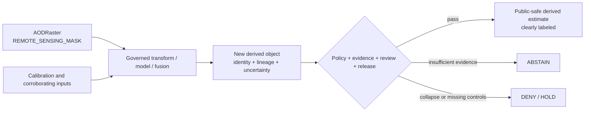

<!-- [KFM_META_BLOCK_V2]
doc_id: kfm://doc/tests/domains/atmosphere/policy-deny/aod-vs-pm25/readme
title: tests/domains/atmosphere/policy-deny/aod-vs-pm25/ — AOD-as-PM2.5 Denial Test Boundary
type: readme; directory-readme; domain-test-lane; atmosphere; policy-deny; aod; pm25; anti-collapse; non-authoritative
version: v0.2
status: draft; repository-grounded; direct-lane-readme-only; adjacent-parent-placeholder-test-confirmed; executable-policy-test-not-established; duplicate-rego-scaffolds-confirmed; policy-input-contract-unknown; canonical-contracts-confirmed; lowercase-compatibility-pointers-confirmed; paired-schemas-permissive-scaffolds; invalid-fixture-metadata-only; validator-not-established; workflow-todo-only; make-test-excludes-lane; fail-closed; cite-or-abstain; not-health-or-alert-authority
owners: OWNER_TBD — Atmosphere steward · Air-quality steward · Remote-sensing steward · Policy steward · Test/QA steward · Contract steward · Schema steward · Fixture steward · Evidence steward · Validator steward · API/UI/AI steward · Release steward · Security reviewer · CI steward · Docs steward
created: 2026-07-05
updated: 2026-07-16
supersedes: v0.1 Atmosphere Policy-Deny Test Lane — AOD vs PM2.5 README
policy_label: "public-review; tests; atmosphere; policy-deny; AOD-not-PM2.5; anti-collapse; remote-sensing-aware; concentration-aware; source-role-aware; knowledge-character-aware; evidence-aware; uncertainty-aware; no-network; deny-by-default; correction-aware; rollback-aware; no-policy-authority; no-evidence-authority; no-release-authority; not-health-authority; not-alert-authority"
current_path: tests/domains/atmosphere/policy-deny/aod-vs-pm25/README.md
truth_posture: >
  CONFIRMED target v0.1 README and prior blob; Directory Rules tests responsibility-root placement;
  tests root and Atmosphere policy-deny parent; Atmosphere policy doctrine stating AOD is not PM2.5;
  two competing default-deny Rego scaffolds with no substantive rules; canonical AODRaster and
  PM25Observation semantic contracts; lowercase compatibility pointers routing to the canonical
  CamelCase contracts; paired AODRaster and PM25Observation schemas with empty properties and
  additionalProperties true; metadata-only invalid fixture placeholder; parent-level
  test_aod_as_pm25_denied.py containing only a one-line PROPOSED placeholder docstring; named-path
  probes finding no direct conftest.py or child test module; TODO-only domain-atmosphere workflow;
  root Makefile test target excluding this lane / PROPOSED focused negative-path tests, policy input
  adapter, stable decision envelope, reason-code vocabulary, fixture manifest, derived-product
  admissibility tests, UI/API/map/search/AI carrier assertions, nonempty collection, CI artifacts,
  correction, rollback, and promotion significance / CONFLICTED or drift-prone policy filename and
  package duplication, docs-proposed test location versus current parent-level placeholder,
  lowercase compatibility paths versus canonical CamelCase contracts, and the unresolved object
  family / knowledge character for any governed AOD-derived PM2.5 estimate / UNKNOWN exhaustive
  recursive inventory, generated or ignored tests, active policy engine binding, actual validator,
  accepted policy input shape, collected case count, pass rate, coverage, mutation score, flake
  rate, release dependency, production consumers, and operational correction behavior / NEEDS
  VERIFICATION accepted owners, CODEOWNERS, canonical Rego file/package, policy adapter, schema
  closure, fixture payloads and digests, reason-code registry, substantive tests, CI retention,
  required-check status, derived-output contract, correction cascade, and rollback rehearsal
evidence_snapshot:
  repository: bartytime4life/Kansas-Frontier-Matrix
  repository_id: "1059091169"
  visibility: public
  base_ref: main
  base_commit: 44c4e5e1432f36efa2cbf9958458ba0c3c6c0e85
  prior_blob: 877bcb9b7b6c38dce4e5c9a1ba85f02ec51504a5
  direct_lane_files_confirmed:
    - tests/domains/atmosphere/policy-deny/aod-vs-pm25/README.md
  adjacent_test:
    path: tests/domains/atmosphere/test_aod_as_pm25_denied.py
    blob: 9e92038ed657de847224c47f23f62aa605615bee
    status: one-line PROPOSED placeholder docstring
  checked_absent_paths:
    - tests/domains/atmosphere/policy-deny/aod-vs-pm25/conftest.py
    - tests/domains/atmosphere/policy-deny/aod-vs-pm25/test_aod_vs_pm25.py
    - tests/domains/atmosphere/policy-deny/aod-vs-pm25/test_aod_as_pm25_denied.py
    - tests/domains/atmosphere/policy-deny/test_aod_vs_pm25.py
    - tests/domains/atmosphere/test_aod_not_pm25.py
  related_repository_blobs:
    tests_root: 2c03b844ab8007453e091c3b24160a209e5214ff
    policy_deny_parent: 4ed619ce5d9d68c24b8bf515adf1aee68869caf1
    atmosphere_policy_doctrine: 53480f8a9e7db4d863ed15cc96c708f0e8d40ef4
    rego_hyphenated: 11f296006175a7af95d53fd02f75ab608a346e26
    rego_underscored: 699ddf4e93084dbca2a64dca90e45d87eb4a7063
    aod_contract: a56bd70547f896aaf349e4c199ecbf665f9c3287
    pm25_contract: dabc318f6dcf4267858cb4953c3379ac2a60879d
    aod_compat_pointer: ddd0c86ba62d87289eb38048565cc2de04b615eb
    pm25_compat_pointer: f4fdad90db504010210bf428590caedc8451f207
    aod_schema: 52a812fe0d8a1e6e0f91c4a14c017a183095fc76
    pm25_schema: 4b04e1fc128f56345f4ab180c84c10f98a78e921
    invalid_fixture_placeholder: 94a45458b7ef055f5c157d0f34595695dca5e421
    atmosphere_workflow: a3c6a21db798b02202c87f76bfba5f45c5f08c9b
    makefile: 4dc8cf633581893d83fba53219c6ea847992e6be
    directory_rules: 2affb080e6f0043867c64c7f06c1ca52030fbd55
  bounded_inventory_note: >
    Direct reads, named-path probes, and indexed search establish only the checked snapshot. They do
    not prove permanent absence from history, forks, ignored files, generated workspaces, dynamic
    test generation, Git LFS, external policy stores, differently named paths, or later commits.
related:
  - ../README.md
  - ../../README.md
  - ../../test_aod_as_pm25_denied.py
  - ../../../README.md
  - ../../../../README.md
  - ../../../../../docs/doctrine/directory-rules.md
  - ../../../../../docs/domains/atmosphere/POLICY.md
  - ../../../../../docs/domains/atmosphere/KNOWLEDGE_CHARACTERS.md
  - ../../../../../docs/domains/atmosphere/OBJECT_FAMILY_MAP.md
  - ../../../../../contracts/domains/atmosphere/AODRaster.md
  - ../../../../../contracts/domains/atmosphere/PM25Observation.md
  - ../../../../../contracts/domains/atmosphere/aod-raster.md
  - ../../../../../contracts/domains/atmosphere/pm25-observation.md
  - ../../../../../schemas/contracts/v1/domains/atmosphere/AODRaster.schema.json
  - ../../../../../schemas/contracts/v1/domains/atmosphere/PM25Observation.schema.json
  - ../../../../../policy/domains/atmosphere/aod-not-pm25.rego
  - ../../../../../policy/domains/atmosphere/aod_is_not_pm25.rego
  - ../../../../../fixtures/domains/atmosphere/objects/AODRaster.invalid.tagged_as_pm25.json
  - ../../../../../tools/validators/domains/atmosphere/README.md
  - ../../../../../data/proofs/
  - ../../../../../release/
  - ../../../../../.github/workflows/domain-atmosphere.yml
  - ../../../../../Makefile
  - ../../../../../schemas/contracts/v1/receipts/generated_receipt.schema.json
tags: [kfm, tests, atmosphere, policy-deny, AOD, PM2.5, remote-sensing-mask, concentration, anti-collapse, evidence, uncertainty, derived-fusion, no-network, correction, rollback]
notes:
  - "This revision changes only this README; a generated provenance receipt is paired separately."
  - "AODRaster and PM25Observation canonical semantic authority lives in the CamelCase contract files; lowercase files are compatibility pointers."
  - "Neither default-deny Rego scaffold proves executable AOD-versus-PM2.5 policy behavior."
  - "No test code, policy bundle, fixture payload, schema, contract, validator, workflow, lifecycle object, release object, health guidance, alert, or public artifact is created or modified."
[/KFM_META_BLOCK_V2] -->

<a id="top"></a>

# AOD-as-PM2.5 Denial Test Boundary

`tests/domains/atmosphere/policy-deny/aod-vs-pm25/`

> **Purpose.** Define the focused negative-test boundary that proves an `AODRaster`, aerosol mask, smoke proxy, remote-sensing field, or AOD-derived estimate cannot be presented as a governed PM2.5 observation or concentration merely by renaming fields, units, layers, legends, routes, catalog entries, or generated language.

<p>
  
  
  
  
  
  
  
</p>

> [!IMPORTANT]
> **The denial concerns meaning and evidence, not only units.** AOD is a remote-sensing aerosol-opacity proxy or mask. PM2.5 is a pollutant-specific concentration/report object with different source-role, method, units, QA, time, evidence, and release obligations. A unit label or field rename cannot bridge that semantic gap.

> [!CAUTION]
> **Current executable enforcement is not established.** The checked child lane contains this README only. The adjacent parent-level test is a one-line `PROPOSED` placeholder. Both Rego files contain only a package declaration and `default allow := false`; both schemas accept arbitrary properties; and the named invalid fixture contains metadata rather than an AOD object.

> [!WARNING]
> **KFM is not a medical, exposure, emergency, or official air-quality authority.** This lane can prove that unsupported AOD-to-PM2.5 claims are denied or abstained. It cannot establish exposure, health effects, regulatory exceedance, protective action, or official warnings.

**Quick links:** [Purpose](#purpose-and-scope) · [Status](#current-evidence-and-maturity) · [Authority](#authority-and-directory-rules-basis) · [Rule](#governing-rule) · [Objects](#object-and-knowledge-character-boundaries) · [Policy](#policy-files-and-naming-drift) · [Transformation](#governed-transformation-boundary) · [Matrix](#required-test-matrix) · [Fixtures](#fixture-and-case-contract) · [Surfaces](#public-and-derived-surface-tests) · [Outcomes](#finite-outcomes-and-reason-code-posture) · [Evidence](#evidence-policy-release-and-correction-boundary) · [Security](#no-network-sensitivity-and-safe-diagnostics) · [Commands](#inventory-collection-and-execution) · [Failures](#failure-interpretation) · [CI](#ci-and-promotion-boundary) · [Plan](#smallest-sound-implementation-sequence) · [Done](#definition-of-done) · [Open](#open-verification-register) · [Ledger](#evidence-ledger) · [Rollback](#changelog-correction-and-rollback)

---

## Purpose and scope

This lane exists to prove one Atmosphere anti-collapse invariant:

```text
AODRaster / REMOTE_SENSING_MASK
    is not
PM25Observation / PM2.5 concentration
```

The durable question is:

> Can every ingest, transform, catalog, graph, map, API, export, search, AI, and release path preserve the distinction between AOD context and PM2.5 concentration—and fail closed when that distinction is missing, contradicted, or overstated?

A mature suite should prove that:

1. an AOD object cannot acquire `PM25Observation` meaning by field, slug, title, legend, route, or unit changes;
2. `REMOTE_SENSING_MASK` cannot be emitted as `OBSERVED_SENSOR`, `PUBLIC_AQI_REPORT`, or an uncaveated PM2.5 concentration;
3. AOD and PM2.5 identities, contracts, schemas, source roles, knowledge characters, time kinds, evidence, and release state remain separate;
4. an AOD-derived PM2.5 estimate, when allowed at all, is a new governed object with explicit method, inputs, calibration, uncertainty, caveats, evidence, review, and correction lineage;
5. an AOD-derived estimate does not impersonate a ground station observation or reference-grade concentration;
6. missing policy, ambiguous policy package selection, missing fixture payload, unresolved evidence, or missing derived-product contract fails visibly;
7. UI, map, API, export, search, graph, vector-index, and AI carriers preserve the actual knowledge character and caveats;
8. default tests are deterministic, local, public-safe, and no-network;
9. a green result remains bounded enforcement evidence, not source admission, scientific validation, exposure proof, health guidance, policy approval, or release approval.

This lane does not define AOD science, PM2.5 science, object contracts, schemas, policy bundles, transformation algorithms, source authority, EvidenceBundles, release decisions, or public products.

[Back to top](#top)

---

## Current evidence and maturity

### Safe conclusion

KFM has strong semantic documentation for the AOD-versus-PM2.5 distinction, but focused executable denial is not established in the checked lane.

| Surface | Inspected status | Safe conclusion |
|---|---|---|
| This child lane | **README-only** | Direct test implementation is not established. |
| Adjacent `test_aod_as_pm25_denied.py` | **One-line placeholder** | A filename is present, but no assertions or policy invocation exist. |
| `aod-not-pm25.rego` | **Default-deny scaffold** | Package exists; input shape, allow/deny rules, reasons, and tests are absent. |
| `aod_is_not_pm25.rego` | **Default-deny scaffold** | Competing package/path exists; canonical selection is unresolved. |
| `AODRaster.md` | **Expanded semantic contract** | Canonical AOD meaning is documented. |
| `PM25Observation.md` | **Expanded semantic contract** | Canonical PM2.5 meaning is documented. |
| Lowercase contract files | **Compatibility pointers** | They are not parallel semantic authorities. |
| Paired schemas | **Permissive scaffolds** | Empty `properties` plus `additionalProperties: true` cannot enforce anti-collapse. |
| Invalid fixture | **Metadata-only placeholder** | No invalid AOD payload or expected denial is present. |
| Atmosphere policy doctrine | **Human-facing rule confirmed** | AOD-as-PM2.5 denial is explicit; machine enforcement remains unproven. |
| Parent policy-deny README | **Scaffold/mixed maturity** | Child lanes are documented; executable depth remains bounded. |
| `domain-atmosphere` workflow | **TODO-only** | A green echo job is not policy evidence. |
| Root `make test` | **Excludes this lane** | It currently runs schema and contract test directories only. |

### Truth-label use

| Label | Meaning here |
|---|---|
| `CONFIRMED` | Verified from current repository files, named-path probes, or bounded search. |
| `PROPOSED` | Recommended test, policy adapter, fixture, reason code, report, or CI rule not implemented here. |
| `UNKNOWN` | Not resolved by the inspected evidence. |
| `NEEDS VERIFICATION` | Checkable, but not verified strongly enough for reliance or promotion. |
| `CONFLICTED` | Multiple current paths or statements compete and require an explicit decision. |

### Maturity ladder

| Level | Requirement | Current status |
|---|---|---|
| L0 | README exists | **CONFIRMED** |
| L1 | Canonical object meanings exist | **CONFIRMED** |
| L2 | Canonical policy path/package selected | **NOT MET** |
| L3 | Real positive and negative fixtures exist | **NOT MET** |
| L4 | Policy input/output adapter exists | **NOT ESTABLISHED** |
| L5 | Direct negative tests invoke the canonical policy | **NOT MET** |
| L6 | Derived-product boundary tests exist | **NOT MET** |
| L7 | API/UI/map/search/AI carrier tests exist | **NOT ESTABLISHED** |
| L8 | Substantive CI runs nonzero cases and retains reports | **NOT MET** |
| L9 | Promotion depends on reviewed, version-pinned denial evidence | **UNKNOWN** |
| L10 | Correction and rollback drills are exercised | **UNKNOWN** |

[Back to top](#top)

---

## Authority and Directory Rules basis

The path is appropriate because its responsibility is **enforceability proof**:

```text
tests/
└── domains/
    └── atmosphere/
        └── policy-deny/
            └── aod-vs-pm25/
                └── README.md
```

| Responsibility | Governing home |
|---|---|
| Focused AOD-as-PM2.5 negative tests | `tests/domains/atmosphere/policy-deny/aod-vs-pm25/` |
| Shared Atmosphere policy-deny tests | `tests/domains/atmosphere/policy-deny/` |
| Human policy doctrine | `docs/domains/atmosphere/POLICY.md` |
| Enforceable policy | `policy/domains/atmosphere/` after canonicalization |
| AOD semantic meaning | `contracts/domains/atmosphere/AODRaster.md` |
| PM2.5 semantic meaning | `contracts/domains/atmosphere/PM25Observation.md` |
| Compatibility links | lowercase contract pointer files |
| Machine shape | `schemas/contracts/v1/domains/atmosphere/` |
| Reusable fixtures | `fixtures/domains/atmosphere/` |
| Validator or policy adapter | accepted `tools/validators/` or policy-runtime home |
| Evidence/proofs | `data/proofs/` |
| Lifecycle data | dedicated `data/<phase>/atmosphere/` roots |
| Release, correction, rollback | `release/` |
| Public API/UI/map/AI code | governed application and adapter roots |

> [!WARNING]
> This directory must not become a second policy bundle, schema, contract, transformation package, fixture warehouse, evidence store, release register, or public runtime.

[Back to top](#top)

---

## Governing rule

The human-facing Atmosphere policy doctrine states:

```text
DENY when a REMOTE_SENSING_MASK (AODRaster)
is presented as a PM2.5 measurement.
```

The rule applies even when the mischaracterization is indirect.

### Direct collapse

- `object_family` is changed from `AODRaster` to `PM25Observation`;
- knowledge character is changed from `REMOTE_SENSING_MASK` to `OBSERVED_SENSOR`;
- AOD values are labeled as PM2.5 concentration;
- a raster is represented as a station observation;
- an AOD layer is assigned PM2.5 concentration units without an accepted transformation.

### Carrier collapse

- map layer title, legend, tooltip, filter, or download says “PM2.5” for an AOD product;
- API route or response field names an AOD product as PM2.5;
- search or vector metadata categorizes AOD as measured PM2.5;
- graph edges promote AOD context into observation truth;
- an AI answer states that AOD proves a ground-level PM2.5 value;
- a catalog or release manifest places AOD directly in a PM2.5 observation family.

### Derived-product collapse

- a derived estimate lacks a separate identity;
- input lineage is missing or incomplete;
- transformation method, calibration basis, validation range, uncertainty, or caveats are absent;
- the output is presented as observed or reference-grade when it is modeled, inferred, or fused;
- review, policy, evidence, correction, or rollback links are missing.

Renaming is never transformation. Packaging is never evidence. A release manifest cannot repair an unsupported scientific or semantic claim.

[Back to top](#top)

---

## Object and knowledge-character boundaries

### Canonical contracts

Use the CamelCase semantic contracts:

- [`AODRaster.md`](../../../../../contracts/domains/atmosphere/AODRaster.md)
- [`PM25Observation.md`](../../../../../contracts/domains/atmosphere/PM25Observation.md)

The lowercase files are compatibility pointers and must not be loaded as competing semantic authorities.

### Boundary matrix

| Dimension | `AODRaster` | `PM25Observation` | Denial trigger |
|---|---|---|---|
| Primary meaning | Remotely sensed aerosol-opacity raster/proxy | PM2.5-related concentration/report record | One is emitted as the other |
| Typical knowledge character | `REMOTE_SENSING_MASK` | Role-dependent `OBSERVED_SENSOR`, `PUBLIC_AQI_REPORT`, `LOW_COST_SENSOR`, or governed archive posture | Character is overwritten or omitted |
| Spatial support | Raster/grid/scene/coverage | Station, sensor, report, archive, or governed derived support | Raster treated as station truth |
| Measurement semantics | Aerosol optical depth / proxy semantics | PM2.5 particulate concentration or explicit PM2.5 report posture | AOD assigned concentration meaning |
| Units | AOD semantics must be explicit; commonly dimensionless/proxy | Concentration units or explicit report/index semantics | Unit label used to fake object conversion |
| Vertical meaning | Atmospheric column or product-specific retrieval support | Ground/sensor/report context when supported | Column proxy presented as ground concentration |
| Evidence | Product lineage, QA, retrieval, source role | Instrument/report/archive/low-cost lineage and QA | Evidence families collapse |
| Time | Observation/retrieval/valid/product time as applicable | Observed/report/archive/retrieval time as applicable | Time bases are flattened |
| Public claim | Aerosol/remote-sensing context | PM2.5 concentration/report with role-specific caveats | Public carrier overclaims |
| Health or exposure | Not established by object alone | Not established by object alone | Either is turned into health instruction |
| Release | Separate governed release | Separate governed release | Release state substitutes for meaning |

### Invariants

1. `AODRaster` never mutates in place into `PM25Observation`.
2. A compatibility pointer never outranks its canonical contract.
3. Schema acceptance does not establish object meaning.
4. AOD source role and knowledge character travel through every transform.
5. A derived estimate retains every input’s identity and evidence lineage.
6. A model or fusion result is not an observed sensor reading.
7. PM2.5 report/AQI posture is not raw concentration posture.
8. No public carrier may hide the derived or proxy nature of a result.
9. No test-local label may redefine the canonical contracts.
10. Correction creates explicit replacement/supersession lineage; it does not rewrite history.

[Back to top](#top)

---

## Policy files and naming drift

Two machine-policy scaffolds currently exist:

| Path | Package | Current body |
|---|---|---|
| `policy/domains/atmosphere/aod-not-pm25.rego` | `kfm.generated.policy.domains.atmosphere.aod_not_pm25` | package declaration plus `default allow := false` |
| `policy/domains/atmosphere/aod_is_not_pm25.rego` | `kfm.generated.policy.domains.atmosphere.aod_is_not_pm25` | package declaration plus `default allow := false` |

The policy doctrine proposes the underscored filename and the test name `test_aod_as_pm25_denied.py`, but both machine files remain scaffolds.

### Safe interpretation

- **CONFIRMED:** both files default deny.
- **NOT CONFIRMED:** either file receives the real policy input.
- **NOT CONFIRMED:** either file produces reason codes or a decision envelope.
- **NOT CONFIRMED:** either file distinguishes valid AOD context from invalid PM2.5 claims.
- **NOT CONFIRMED:** either file is loaded by CI, a validator, a pipeline, or runtime policy evaluation.
- **CONFLICTED:** two paths/packages appear to represent one policy intent.

### Required resolution

Before executable tests are authoritative:

1. select one canonical filename and package through an accepted migration or ADR;
2. deprecate or convert the other path into an explicit compatibility/migration surface;
3. define the policy input contract;
4. define finite output and reason-code semantics;
5. pin policy version/hash in tests and reports;
6. prove the selected bundle is actually loaded;
7. add negative and valid-context cases;
8. preserve rollback to the previous policy version.

Tests must fail setup when no canonical policy is selected. They must not silently test whichever file happens to sort first.

[Back to top](#top)

---

## Governed transformation boundary

AOD may contribute to a PM2.5 estimate only through a separately governed transformation or fusion process.

### Required distinction



### Minimum derived-product requirements

| Requirement | Why it is necessary | Status |
|---|---|---|
| New stable identity | Prevents relabeling AOD in place | `PROPOSED requirement` |
| Explicit output object family | Prevents accidental `PM25Observation` impersonation | `OPEN / NEEDS CONTRACT` |
| Explicit knowledge character | Distinguishes modeled, inferred, or fused output from observation | `OPEN / NEEDS CONTRACT` |
| Input identities and digests | Preserves per-input lineage | `PROPOSED` |
| Transformation/model identifier | Makes method inspectable | `PROPOSED` |
| Version and parameters | Supports reproducibility and rollback | `PROPOSED` |
| Calibration/corroboration basis | Shows how proxy relates to concentration | `PROPOSED` |
| Applicability domain | Prevents use outside validated conditions | `PROPOSED` |
| Validation metrics | Bounds performance claims | `PROPOSED` |
| Uncertainty/confidence | Prevents false precision | `PROPOSED` |
| Caveats and prohibited uses | Constrains public interpretation | `PROPOSED` |
| Time and spatial support | Prevents scale/time mismatch | `PROPOSED` |
| EvidenceRef → EvidenceBundle | Supports cite-or-abstain | `PROPOSED / implementation unverified` |
| Policy decision | Records allow/restrict/deny/hold posture | `PROPOSED / implementation unverified` |
| Human review where material | Preserves governance separation | `PROPOSED` |
| Release, correction, rollback refs | Supports reversible publication | `PROPOSED` |

> [!IMPORTANT]
> This README does not decide whether an allowed derived output is `DERIVED_FUSION`, `ATMOSPHERIC_MODEL_FIELD`, a future derived-PM2.5 family, or a role-qualified `PM25Observation`. That is contract/schema/policy work and remains **OPEN**.

### Automatic denial conditions

Deny or hold when:

- output identity equals the input AOD identity;
- output object family is chosen only by field rename;
- AOD is the only support but the output claims observed ground concentration;
- method, version, calibration, applicability range, uncertainty, or caveats are missing;
- source roles or knowledge characters are absent or overwritten;
- EvidenceRef cannot resolve;
- public labeling hides “derived,” “modeled,” “estimated,” or equivalent governed status;
- correction or rollback targets are absent for a release candidate.

[Back to top](#top)

---

## Required test matrix

### Policy selection and invocation

| Case | Assertion | Expected result |
|---|---|---|
| No canonical policy selected | Setup refuses to run a false-positive suite | `ERROR` / collection failure |
| Both policy files selected | Ambiguous authority is rejected | `ERROR` |
| Selected policy cannot load | Fail closed | `ERROR` |
| Policy hash differs from expectation | Drift is visible | `HOLD` / test failure |
| Policy returns no finite decision | Invalid policy output | test failure |
| Policy is never called | Spy/canary proves missing invocation | test failure |

### Direct object collapse

| Case | Assertion | Expected result |
|---|---|---|
| `AODRaster` labeled `PM25Observation` | Object-family collapse denied | `DENY` |
| `REMOTE_SENSING_MASK` labeled `OBSERVED_SENSOR` | Knowledge-character collapse denied | `DENY` |
| AOD raster given PM2.5 concentration units | Unit/meaning mismatch denied | `DENY` |
| AOD value placed in station-observation payload | Spatial/support mismatch denied | `DENY` |
| AOD product placed in PM2.5 archive/report role | Source-role mismatch denied | `DENY` |
| AOD title alone says “PM2.5” | Rename-only conversion denied | `DENY` |
| Valid AOD context remains AOD | Contextual use is not falsely denied | `ALLOW` only if other checks pass |

### Derived-output controls

| Case | Assertion | Expected result |
|---|---|---|
| Derived estimate reuses AOD ID | In-place mutation denied | `DENY` |
| Input lineage missing | Provenance gap denied | `DENY` |
| Method/version missing | Reproducibility gap denied | `DENY` |
| Calibration basis missing | Unsupported conversion denied | `DENY` / `ABSTAIN` |
| Applicability domain exceeded | Out-of-domain use denied | `DENY` / `HOLD` |
| Uncertainty missing | False precision denied | `DENY` / `RESTRICT` |
| Caveats missing | Public overclaim denied | `DENY` / `RESTRICT` |
| Time support mismatched | Temporal collapse denied | `DENY` |
| Spatial resolution/support mismatched | Scale collapse denied | `DENY` |
| Output labeled observed/reference-grade | Authority inflation denied | `DENY` |
| Evidence unresolved | Claim cannot be supported | `ABSTAIN` / `DENY` |
| Fully governed derived candidate | Evaluated under separate identity | finite policy decision; not automatic allow |

### Carrier and publication controls

| Case | Assertion | Expected result |
|---|---|---|
| Map legend calls AOD “PM2.5 concentration” | Trust-state failure | `DENY` |
| API response exposes AOD under PM2.5 field | Contract/carrier failure | `DENY` |
| Search index categorizes AOD as measured PM2.5 | Index admission failure | `DENY` |
| Graph edge promotes AOD into observation truth | Graph validation failure | `DENY` |
| Export drops knowledge character or caveats | Serialization failure | `DENY` |
| AI says “AOD proves PM2.5” | Generated overclaim corrected | `ABSTAIN` or bounded answer |
| Catalog candidate uses PM2.5 family for AOD | Catalog closure failure | `DENY` |
| Release manifest includes AOD as PM2.5 | Promotion blocked | `DENY` / `HOLD` |
| Release package has rollback but no evidence | Packaging cannot replace evidence | `DENY` |

### Correction and rollback controls

| Case | Assertion | Expected result |
|---|---|---|
| Mischaracterized public object is corrected | Supersession/correction ref required | pass only with governed correction |
| Old release remains discoverable as current | Withdrawal/invalidation failure | test failure |
| Correction changes historical bytes in place | Immutable-history violation | `DENY` |
| Rollback omits dependent catalog/index surfaces | Incomplete rollback | test failure |
| Policy rename drops historical reason mapping | Audit continuity failure | test failure |

[Back to top](#top)

---

## Fixture and case contract

### Current fixture posture

The named fixture:

```text
fixtures/domains/atmosphere/objects/AODRaster.invalid.tagged_as_pm25.json
```

contains only scaffold metadata. It is not yet an invalid `AODRaster` test object and cannot prove a denial.

### Proposed fixture families

| Fixture ID family | Purpose |
|---|---|
| `aod-valid-context-*` | Valid AOD/remote-sensing context |
| `aod-invalid-family-pm25-*` | Object-family relabeling |
| `aod-invalid-character-observed-*` | Knowledge-character inflation |
| `aod-invalid-units-pm25-*` | Unit/meaning mismatch |
| `aod-derived-missing-lineage-*` | Missing input provenance |
| `aod-derived-missing-method-*` | Missing transform identity/version |
| `aod-derived-missing-uncertainty-*` | Missing uncertainty/confidence |
| `aod-derived-out-of-domain-*` | Applicability-domain violation |
| `aod-public-label-overclaim-*` | UI/API/map/export/search overclaim |
| `aod-ai-overclaim-*` | Generated-language abstention/denial |
| `aod-release-collapse-*` | Catalog/release misclassification |
| `aod-correction-rollback-*` | Correction, withdrawal, and rollback |

### Minimum case metadata

```yaml
case_id: atmo-aod-pm25-...
status: proposed
input_fixture_ref: fixtures/domains/atmosphere/...
input_digest: sha256:...
object_family: AODRaster
knowledge_character: REMOTE_SENSING_MASK
policy_ref: policy/domains/atmosphere/<canonical>.rego
policy_hash: sha256:...
expected_outcome: DENY
expected_reason_codes:
  - ATMO_AOD_PM25_OBJECT_COLLAPSE
consumer_test_ref: tests/domains/atmosphere/...
public_safe: true
network_required: false
```

This is a proposed test manifest shape, not an accepted schema.

### Fixture requirements

Fixtures must be:

- synthetic, transformed-public, or otherwise explicitly public-safe;
- deterministic and locally resolvable;
- small enough for review;
- free of credentials, signed URLs, private endpoints, or hidden source dependencies;
- explicit about object family, source role, knowledge character, time, units, spatial support, evidence mode, and expected result;
- linked to at least one consumer test;
- immutable by digest within a released test version;
- superseded rather than silently rewritten when expected behavior changes.

No raw satellite product, live PM2.5 feed, operational alert, private station detail, or uncontrolled source dump belongs in this test lane.

[Back to top](#top)

---

## Public and derived surface tests

A denial that works only in a policy unit test is incomplete if downstream carriers can erase the result.

| Surface | Required preservation |
|---|---|
| Governed API | Correct object family, knowledge character, derived status, caveats, evidence/release refs, or finite abstention/denial |
| Explorer UI | Layer title, legend, tooltip, drawer, and units must not imply measured PM2.5 for AOD |
| Map/tile manifest | Product class and provenance remain AOD/remote-sensing or governed derived output |
| Export/download | Identity, input lineage, method, uncertainty, caveats, and release state survive serialization |
| Catalog | AOD and PM2.5 object families remain distinct |
| Graph/triplet projection | Proxy/context edges cannot become observation/assertion edges |
| Search/index | Snippets and filters cannot flatten AOD into measured PM2.5 |
| Vector/embedding index | Metadata carries actual character and public posture |
| AI/Focus Mode | Answer cites governed evidence and states proxy/derived limitations, or abstains/denies |
| Reports/logs | Safe identifiers and reason codes only; no sensitive payload leakage |

### Suggested assertion style

Prefer explicit semantic assertions:

```python
assert result.outcome == "DENY"
assert "ATMO_AOD_PM25_OBJECT_COLLAPSE" in result.reason_codes
assert result.public_payload is None
```

Avoid weak assertions:

```python
assert not result.allow
```

A Boolean alone does not prove why the decision occurred, whether the correct bundle ran, or whether downstream surfaces preserved the denial.

[Back to top](#top)

---

## Finite outcomes and reason-code posture

### Finite outcomes

| Outcome | Use |
|---|---|
| `ALLOW` | Valid AOD context or separately governed derived product passes all applicable checks |
| `RESTRICT` | Use is permitted only with explicit caveat, transform, generalization, or limited surface |
| `ABSTAIN` | Evidence is insufficient to answer a concentration question |
| `DENY` | AOD/PM2.5 collapse or prohibited public claim is present |
| `HOLD` | Review, contract, policy, evidence, or release prerequisites remain unresolved |
| `ERROR` | Policy, fixture, validator, dependency, or report execution failed |

### Proposed reason codes

These are **PROPOSED**, not a current canonical registry:

| Code | Meaning |
|---|---|
| `ATMO_AOD_PM25_POLICY_AMBIGUOUS` | Multiple policy files/packages compete |
| `ATMO_AOD_PM25_POLICY_MISSING` | Canonical bundle cannot be loaded |
| `ATMO_AOD_PM25_POLICY_NOT_INVOKED` | Test path bypassed policy evaluation |
| `ATMO_AOD_PM25_OBJECT_COLLAPSE` | AOD object presented as PM25Observation |
| `ATMO_AOD_PM25_CHARACTER_COLLAPSE` | Remote-sensing character presented as observed/report character |
| `ATMO_AOD_PM25_UNIT_SEMANTIC_MISMATCH` | Units imply concentration without governed transform |
| `ATMO_AOD_PM25_STATION_SUPPORT_FALSE` | Raster/proxy presented as station measurement |
| `ATMO_AOD_PM25_LINEAGE_MISSING` | Derived output lacks input lineage |
| `ATMO_AOD_PM25_METHOD_MISSING` | Method/version/parameters absent |
| `ATMO_AOD_PM25_CALIBRATION_MISSING` | Calibration/corroboration basis absent |
| `ATMO_AOD_PM25_APPLICABILITY_EXCEEDED` | Output used outside validated domain |
| `ATMO_AOD_PM25_UNCERTAINTY_MISSING` | Uncertainty/confidence absent |
| `ATMO_AOD_PM25_CAVEAT_MISSING` | Required limitation disclosure absent |
| `ATMO_AOD_PM25_EVIDENCE_UNRESOLVED` | EvidenceRef cannot resolve |
| `ATMO_AOD_PM25_PUBLIC_LABEL_OVERCLAIM` | UI/API/map/export/search label overstates meaning |
| `ATMO_AOD_PM25_AI_OVERCLAIM` | Generated language presents proxy as concentration |
| `ATMO_AOD_PM25_CATALOG_COLLAPSE` | Catalog/graph/index family is incorrect |
| `ATMO_AOD_PM25_RELEASE_BLOCKED` | Release candidate violates anti-collapse rule |
| `ATMO_AOD_PM25_FIXTURE_PLACEHOLDER` | Fixture has no executable object payload |
| `ATMO_AOD_PM25_CORRECTION_INCOMPLETE` | Correction/withdrawal dependencies are incomplete |

Reason codes must be versioned, safe for logs, and mapped to policy decisions, tests, documentation, and correction behavior.

[Back to top](#top)

---

## Evidence, policy, release, and correction boundary

### Evidence order

```text
scope
  → object identity and knowledge character
  → source role and time/spatial support
  → transformation lineage and uncertainty
  → EvidenceRef → EvidenceBundle
  → policy decision
  → review
  → release
  → public carrier
```

Skipping an earlier step cannot be repaired by a later label or manifest.

### Lifecycle posture

```text
RAW → WORK / QUARANTINE → PROCESSED → CATALOG / TRIPLET → PUBLISHED
```

| Stage | Required anti-collapse behavior |
|---|---|
| RAW | Preserve source payload and original product identity; do not call it PM2.5 |
| WORK / QUARANTINE | Hold ambiguous mappings and experimental transforms |
| PROCESSED | Emit a new derived identity with lineage; never overwrite AOD meaning |
| CATALOG / TRIPLET | Preserve proxy/derived/observed distinctions in metadata and edges |
| PUBLISHED | Require evidence, policy, review, release, correction, and rollback support |

### Test authority limits

A passing test does not:

- prove scientific validity of an AOD-to-PM2.5 model;
- admit a source;
- create an EvidenceBundle;
- approve policy;
- establish regulatory equivalence;
- establish exposure or health impact;
- approve a public layer;
- authorize release;
- certify production parity.

### Correction posture

When an AOD-derived object is mischaracterized:

1. identify affected object, catalog, graph, map, API, export, search, AI, and release surfaces;
2. issue governed correction/invalidation records;
3. supersede or withdraw the incorrect release;
4. preserve the original audit trail;
5. rebuild dependent derived/index surfaces;
6. verify the corrected character and caveats;
7. retain rollback targets and review records.

[Back to top](#top)

---

## No-network, sensitivity, and safe diagnostics

Default tests must not call:

- satellite or remote-sensing services;
- EPA, NOAA, NASA, state, local, vendor, or academic APIs;
- tile, style, sprite, glyph, geocoding, or reverse-geocoding services;
- cloud storage, remote databases, queues, or model endpoints;
- remote schema, policy, registry, or documentation URLs.

### Sensitive-content posture

Synthetic fixtures must avoid:

- private station identities or household sensor owners;
- exact sensitive infrastructure or private-land geometry;
- protected ecological, archaeological, sacred, or culturally restricted locations;
- living-person identifiers;
- current operational alert text;
- credentials, cookies, tokens, signed URLs, or service-account material.

### Safe diagnostic contract

Reports may contain:

- synthetic `case_id`;
- policy version/hash;
- object-family and knowledge-character labels;
- expected and actual outcome;
- safe reason codes;
- fixture digest;
- test path;
- timestamp and tool version.

Reports must not contain:

- full source payloads;
- credentials or private endpoints;
- protected coordinates;
- unredacted private IDs;
- current official alert content;
- raw model prompts or sensitive joined data.

[Back to top](#top)

---

## Inventory, collection, and execution

> [!NOTE]
> These commands are inspection and proposed execution patterns. They do not prove that executable tests or an accepted policy runner currently exist.

### Inspect the lane

```bash
find tests/domains/atmosphere/policy-deny/aod-vs-pm25 \
  -maxdepth 3 -type f -print | sort
```

### Inspect adjacent placeholders and policy files

```bash
sed -n '1,120p' tests/domains/atmosphere/test_aod_as_pm25_denied.py
sed -n '1,160p' policy/domains/atmosphere/aod-not-pm25.rego
sed -n '1,160p' policy/domains/atmosphere/aod_is_not_pm25.rego
```

### Inspect canonical contracts and schemas

```bash
sed -n '1,260p' contracts/domains/atmosphere/AODRaster.md
sed -n '1,260p' contracts/domains/atmosphere/PM25Observation.md
cat schemas/contracts/v1/domains/atmosphere/AODRaster.schema.json
cat schemas/contracts/v1/domains/atmosphere/PM25Observation.schema.json
```

### Detect placeholder-only files

```bash
python - <<'PY'
from pathlib import Path

paths = [
    Path("tests/domains/atmosphere/test_aod_as_pm25_denied.py"),
    Path("fixtures/domains/atmosphere/objects/AODRaster.invalid.tagged_as_pm25.json"),
]
for path in paths:
    text = path.read_text(encoding="utf-8")
    print(path, "PROPOSED placeholder" in text or '"status": "PROPOSED"' in text)
PY
```

### Collect focused tests when implemented

```bash
python -m pytest \
  tests/domains/atmosphere/policy-deny/aod-vs-pm25 \
  --collect-only -q
```

Collection must fail the governed gate when zero substantive cases are collected.

### Proposed focused execution

```bash
python -m pytest \
  tests/domains/atmosphere/policy-deny/aod-vs-pm25 \
  -q
```

### Proposed policy execution

```bash
opa test \
  policy/domains/atmosphere \
  tests/domains/atmosphere/policy-deny/aod-vs-pm25 \
  -v
```

Do not adopt this as authoritative until the canonical policy path, OPA conventions, and test placement are accepted.

[Back to top](#top)

---

## Failure interpretation

| Failure | Interpretation | Required response |
|---|---|---|
| Zero tests collected | Lane is not enforced | Fail governed gate |
| Placeholder test passes import | No assertion ran | Treat as incomplete |
| Default-deny scaffold returns false | Input-specific rule was not proven | Do not call this coverage |
| Both Rego packages load | Policy authority is ambiguous | Stop and resolve drift |
| Fixture is metadata-only | No invalid object was tested | Build a synthetic payload |
| Permissive schema accepts collapse | Shape scaffold cannot prove semantics | Add contract/policy/validator tests |
| Valid AOD context is denied | Policy may be overbroad | Fix rule and add positive control |
| AOD-as-PM2.5 is allowed | Critical anti-collapse failure | Block promotion |
| Derived estimate lacks uncertainty | Public overclaim risk | Deny/restrict |
| UI/API/AI drops reason/caveat | Carrier trust-state failure | Block affected surface |
| Logs expose payload/private data | Security/privacy failure | Redact and invalidate artifact |
| Release remains public after correction | Rollback/correction failure | Withdraw and rebuild dependencies |

A failure must be attributed to the correct authority surface. Do not “fix” a policy failure by weakening a test expectation or changing a fixture label.

[Back to top](#top)

---

## What a passing suite does not prove

A green focused suite does not prove:

- the policy bundle is loaded in production;
- schemas are semantically closed;
- an AOD-to-PM2.5 model is scientifically valid;
- a derived output is accurate across Kansas, seasons, sensors, or conditions;
- source rights are resolved;
- all public carriers preserve caveats;
- current upstream products match fixtures;
- release review occurred;
- correction and rollback work operationally;
- KFM can issue health, exposure, emergency, or regulatory guidance.

Those claims require their own evidence, review, and release state.

[Back to top](#top)

---

## CI and promotion boundary

A substantive CI gate should:

1. select and pin one canonical policy package;
2. validate policy syntax and input/output contract;
3. reject placeholder-only policy and fixture content;
4. collect a nonzero manifest-defined case count;
5. run negative and valid-context controls;
6. run derived-product and carrier tests where implemented;
7. prohibit live network access;
8. emit a safe structured report;
9. retain policy hash, fixture digests, test commit, and result;
10. fail when reason codes or decision shape drift unexpectedly;
11. remain separate from human review and release approval.

The current `domain-atmosphere` workflow contains TODO echo steps. Its success is not substantive evidence for this lane. The root `make test` target excludes this lane.

### Proposed report fields

```json
{
  "suite": "atmosphere-aod-vs-pm25",
  "policy_ref": "policy/domains/atmosphere/<canonical>.rego",
  "policy_hash": "sha256:...",
  "collected_cases": 0,
  "passed_cases": 0,
  "failed_cases": 0,
  "outcome": "ERROR",
  "reason_codes": ["ATMO_AOD_PM25_POLICY_MISSING"],
  "fixture_digests": {},
  "commit": "...",
  "generated_at": "..."
}
```

A report with `collected_cases: 0` must not be interpreted as success.

[Back to top](#top)

---

## Maintenance and change discipline

Update this README when:

- the canonical Rego file/package is selected;
- a policy compatibility path is created or retired;
- policy input/output contracts change;
- canonical object contracts or schemas change;
- the derived-product object family is decided;
- fixtures, reason codes, or test placement change;
- API/UI/map/search/AI carrier responsibility changes;
- CI commands or retained report formats change;
- correction or rollback behavior changes.

For policy-significant changes:

1. update doctrine, contract, schema, policy, fixtures, tests, and docs in their owning roots;
2. preserve backward compatibility or document a reviewed migration;
3. pin old and new policy versions;
4. run negative, positive-control, carrier, and rollback tests;
5. issue correction or release notes when public interpretation changes;
6. keep the change reversible.

Do not solve naming drift by deleting one policy file without a migration record and reference audit.

[Back to top](#top)

---

## Smallest sound implementation sequence

1. **Canonicalize policy authority.** Select one Rego path/package and document the migration.
2. **Define policy input/output.** Specify object identity, knowledge character, source role, claim type, evidence, transform, review, and release fields.
3. **Create real synthetic fixtures.** Replace metadata-only placeholders with valid AOD, invalid collapse, derived incomplete, and positive-control cases.
4. **Implement the focused policy adapter.** Load the canonical bundle and emit finite outcomes/reasons.
5. **Implement direct negative tests.** Cover object, character, unit, station-support, and label collapse.
6. **Add derived-product tests.** Cover lineage, method, calibration, applicability, uncertainty, caveats, and evidence.
7. **Add carrier tests.** Cover map, API, export, search, graph, vector, and AI preservation.
8. **Add nonzero collection and safe reports.**
9. **Wire substantive CI.**
10. **Exercise correction and rollback.**
11. **Update this README with verified commands and metrics.**

Each step should be a small, reviewable, reversible change.

[Back to top](#top)

---

## Definition of done

This lane is mature when all applicable items are checked:

- [ ] one canonical AOD-not-PM2.5 policy file/package is accepted;
- [ ] alternate policy path is migrated, deprecated, or converted into a compatibility surface;
- [ ] policy input/output and reason-code contracts are accepted;
- [ ] canonical contracts and schemas expose the fields tests need;
- [ ] real valid and invalid synthetic fixtures exist with stable IDs and digests;
- [ ] direct tests invoke the canonical policy and prove invocation;
- [ ] AOD object-family and knowledge-character collapse is denied;
- [ ] unit, station-support, report-role, and public-label collapse is denied;
- [ ] valid AOD context has a positive control;
- [ ] derived-product tests enforce separate identity, lineage, method, applicability, uncertainty, caveats, evidence, and review;
- [ ] the allowed derived object family/knowledge character is contractually resolved;
- [ ] API/UI/map/export/search/graph/vector/AI carriers preserve the decision and caveats;
- [ ] zero-case collection fails;
- [ ] default execution is no-network and credential-free;
- [ ] diagnostics are safe;
- [ ] CI runs substantive cases and retains a structured report;
- [ ] promotion consumes reviewed evidence rather than a green scaffold;
- [ ] correction, withdrawal, supersession, and rollback are tested;
- [ ] owners and CODEOWNERS are accepted;
- [ ] documentation links to current policy, contracts, schemas, fixtures, tests, and reports.

[Back to top](#top)

---

## Open verification register

| ID | Question | Status | What settles it |
|---|---|---|---|
| AOD-PM25-01 | Which Rego path/package is canonical? | `CONFLICTED` | ADR or reviewed migration |
| AOD-PM25-02 | What is the accepted policy input envelope? | `NEEDS VERIFICATION` | Contract/schema plus adapter |
| AOD-PM25-03 | What finite policy output/reason schema is canonical? | `OPEN` | Policy decision contract/registry |
| AOD-PM25-04 | Where should executable tests live: child lane or parent-level file? | `OPEN` | Test-placement decision and migration |
| AOD-PM25-05 | What object family represents a governed AOD-derived PM2.5 estimate? | `OPEN` | Atmosphere contract/ADR |
| AOD-PM25-06 | What knowledge character applies to that output? | `OPEN` | Knowledge-character registry/ADR |
| AOD-PM25-07 | What calibration, validation, applicability, and uncertainty fields are mandatory? | `NEEDS VERIFICATION` | Contract/schema/policy review |
| AOD-PM25-08 | Are schemas closing from permissive scaffolds? | `NEEDS VERIFICATION` | Schema implementation and tests |
| AOD-PM25-09 | What real fixture IDs/digests and consumers exist? | `UNKNOWN` | Fixture inventory and manifest |
| AOD-PM25-10 | What validator or policy runtime loads the bundle? | `UNKNOWN` | Executable adapter and reports |
| AOD-PM25-11 | Which UI/API/map/search/AI lanes own carrier assertions? | `OPEN` | Cross-lane test ownership decision |
| AOD-PM25-12 | What CI check and artifact retention are required? | `NEEDS VERIFICATION` | Workflow and branch protection evidence |
| AOD-PM25-13 | What release or production paths depend on this denial? | `UNKNOWN` | Runtime/release dependency trace |
| AOD-PM25-14 | Has correction/rollback been rehearsed? | `UNKNOWN` | Recorded drill and reviewed artifact |
| AOD-PM25-15 | Who owns and reviews policy-significant changes? | `NEEDS VERIFICATION` | CODEOWNERS and steward acceptance |

[Back to top](#top)

---

## Evidence ledger

| Evidence | Status | Supports | Limits |
|---|---|---|---|
| This lane’s prior README | `CONFIRMED` | Existing intent, path, and v0.1 boundary | Prospective implementation claims |
| Directory Rules | `CONFIRMED doctrine` | `tests/` placement and authority separation | Does not prove implementation |
| `tests/README.md` | `CONFIRMED` | Mixed-maturity test root and no-network posture | Full suite remains conflicted |
| Policy-deny parent README | `CONFIRMED scaffold` | Parent rule map and finite-outcome intent | Child execution unverified |
| Atmosphere `POLICY.md` | `CONFIRMED human doctrine` | Explicit AOD-as-PM2.5 denial and proposed crosswalk | Does not enforce policy |
| Two Rego files | `CONFIRMED scaffolds` | Both default deny and expose naming drift | No input-specific rules or reasons |
| `AODRaster.md` | `CONFIRMED semantic contract` | AOD is remote-sensing proxy/mask, not PM2.5 | Runtime enforcement unverified |
| `PM25Observation.md` | `CONFIRMED semantic contract` | PM2.5 object/source-role boundaries | Runtime enforcement unverified |
| Lowercase contract files | `CONFIRMED pointers` | Preserve compatibility without parallel authority | Naming migration remains open |
| AOD and PM2.5 schemas | `CONFIRMED permissive scaffolds` | Paths and contract pointers | Empty properties cannot enforce semantics |
| Invalid fixture file | `CONFIRMED metadata placeholder` | Intended negative-case path | No object payload |
| Parent-level test file | `CONFIRMED one-line placeholder` | Proposed test name/location | No executable assertions |
| `domain-atmosphere.yml` | `CONFIRMED TODO scaffold` | Workflow path exists | Green echo job is not proof |
| Makefile | `CONFIRMED` | Root `test` command scope | Excludes this lane |
| Named-path probes/search | `CONFIRMED bounded evidence` | Direct child tests not established | Not exhaustive of generated/external paths |

[Back to top](#top)

---

## Changelog, correction, and rollback

### Changelog

| Date | Version | Change |
|---|---:|---|
| 2026-07-05 | v0.1 | Initial AOD-versus-PM2.5 policy-deny README. |
| 2026-07-16 | v0.2 | Grounded the lane in current repository evidence; separated canonical contracts from compatibility pointers; documented duplicate policy scaffolds, permissive schemas, metadata-only fixture, adjacent placeholder test, required matrices, derived boundary, finite outcomes, CI, correction, and rollback. |

### Correction

Correct this README when verified implementation contradicts a stated status. A correction should identify:

- the inaccurate statement;
- the evidence that supersedes it;
- affected policy, contract, schema, fixture, test, validator, CI, carrier, release, and docs paths;
- whether public interpretation changed;
- the correction and rollback references.

### Rollback

To roll back this documentation revision:

1. restore prior README blob `877bcb9b7b6c38dce4e5c9a1ba85f02ec51504a5`;
2. remove the paired generated receipt;
3. verify that no policy, test, fixture, schema, contract, validator, workflow, release, or public path changed;
4. run Markdown, internal-link, and secret-pattern checks;
5. preserve the rollback commit and review record.

Rollback of future executable work must also restore:

- canonical policy path/package and hash;
- policy input/output and reason-code versions;
- fixture IDs, bytes, digests, and expected results;
- contract/schema versions;
- validator and test placement;
- CI command and retained artifacts;
- carrier behavior;
- correction, withdrawal, and release dependencies.

---

## Maintainer summary

`tests/domains/atmosphere/policy-deny/aod-vs-pm25/` is the focused proof boundary for the rule that AOD is not PM2.5. Current evidence is documentation-heavy and implementation-light: the child lane is README-only, the adjacent test is a one-line placeholder, two competing Rego files are default-deny scaffolds, schemas are permissive, and the invalid fixture is metadata-only. The next sound change is to canonicalize policy authority, define the policy envelope, create real synthetic fixtures, and implement a small negative/positive-control suite before adding derived and public-carrier coverage.

[Back to top](#top)
