<!-- [KFM_META_BLOCK_V2]
doc_id: kfm://doc/tests/domains/atmosphere/policy-deny/low-cost-sensor-caveat/readme
title: tests/domains/atmosphere/policy-deny/low-cost-sensor-caveat/ — Low-Cost Sensor Qualification Denial Test Boundary
type: readme; directory-readme; domain-test-lane; atmosphere; policy-deny; low-cost-sensor; caveat; correction; non-authoritative
version: v0.2
status: draft; repository-grounded; direct-lane-readme-only; adjacent-test-placeholder; executable-policy-test-not-established; rego-default-deny-scaffold; planning-name-drift; canonical-contracts-confirmed; schemas-permissive; fixture-inventory-unverified; purpleair-rights-needs-verification; barkjohn-runtime-unverified; workflow-todo-only; make-test-excludes-lane; fail-closed; cite-or-abstain
owners: OWNER_TBD — Atmosphere · air-quality · low-cost-sensor · source/rights · policy · test/QA · contract/schema · fixture/evidence · correction/model · API/UI/AI · release · CI/docs stewards
created: 2026-07-05
updated: 2026-07-16
supersedes: v0.1 Atmosphere Policy-Deny Test Lane — Low-Cost Sensor Caveat README
policy_label: "public-review; tests; atmosphere; policy-deny; low-cost-sensor; correction-required; caveat-required; confidence-required; limitations-required; rights-aware; no-network; restrict-or-deny; correction-aware; rollback-aware; no-policy-or-release-authority"
current_path: tests/domains/atmosphere/policy-deny/low-cost-sensor-caveat/README.md
truth_posture: >
  CONFIRMED target v0.1 README and prior blob; tests-root placement; parent policy-deny lane;
  low_cost_sensor_caveats_required.rego containing only package declaration and default deny;
  hyphenated planning policy path not found at the checked location; AirObservation and
  PM25Observation contracts requiring low-cost source-role, correction, caveat, confidence,
  limitations, policy, review, and release controls; permissive paired schemas; one-line adjacent
  placeholder test; no child conftest or direct test at named paths; fixture indexes with payload
  inventory unverified; draft source registry describing PurpleAir as community observed and never
  regulatory with rights needing verification; draft Barkjohn page describing versioned correction
  and corrected/uncorrected preservation while runtime/version remain unverified; draft map/UI
  requirements treating qualification as load-bearing; TODO-only workflow and root make test
  excluding this lane / PROPOSED substantive fixtures, policy adapter, reason codes, correction
  version/pair tests, rights and carrier tests, nonzero collection, CI, correction, and rollback /
  UNKNOWN active policy/validator/correction runtime, accepted mandatory fields, current Barkjohn
  version, source admission, consumers, metrics, promotion dependency, and operational rollback
evidence_snapshot:
  repository: bartytime4life/Kansas-Frontier-Matrix
  repository_id: "1059091169"
  base_commit: ebdf9332c096facff23ff4379b576b6ae01c72b4
  prior_blob: 799e505df14da05e3e52ffab29b1b904a4f8bd8a
  adjacent_test_blob: 7e4c52207b38686f00f22e05391a808813260b57
  policy_blob: 6981e5953b586372790322998cad08559d9c5024
  air_contract_blob: d2c1c36cb9c68584ded1bbe9a827d352b3e42311
  pm25_contract_blob: dabc318f6dcf4267858cb4953c3379ac2a60879d
  knowledge_character_blob: d38eb867122f5c36d1d8e004b99d856f3ef1f200
  air_schema_blob: 31e70d688dcc536f250eb17f37c2330e5f42f252
  pm25_schema_blob: 4b04e1fc128f56345f4ab180c84c10f98a78e921
  source_registry_blob: 55ce7ce85a5c48dcacb0b8c3763141321cbd3420
  barkjohn_doc_blob: 479d4131e04abee6b700124781bf4e701bc65b11
  map_ui_blob: 5f2a4b49f9b2e3350b10c3901f651dd98b61fcca
  workflow_blob: a3c6a21db798b02202c87f76bfba5f45c5f08c9b
  makefile_blob: 4dc8cf633581893d83fba53219c6ea847992e6be
  checked_absent:
    - tests/domains/atmosphere/policy-deny/low-cost-sensor-caveat/conftest.py
    - tests/domains/atmosphere/policy-deny/low-cost-sensor-caveat/test_low_cost_sensor_caveat.py
    - policy/domains/atmosphere/low-cost-sensor-caveat.rego
related:
  - ../README.md
  - ../../test_low_cost_sensor_caveat_required.py
  - ../../../../../docs/doctrine/directory-rules.md
  - ../../../../../docs/domains/atmosphere/SOURCE_REGISTRY.md
  - ../../../../../docs/domains/atmosphere/MAP_UI_CONTRACTS.md
  - ../../../../../contracts/domains/atmosphere/knowledge_character.md
  - ../../../../../contracts/domains/atmosphere/AirObservation.md
  - ../../../../../contracts/domains/atmosphere/PM25Observation.md
  - ../../../../../policy/domains/atmosphere/low_cost_sensor_caveats_required.rego
  - ../../../../../docs/sources/catalog/epa/barkjohn-correction.md
  - ../../../../../fixtures/domains/atmosphere/invalid/air-observation/README.md
  - ../../../../../.github/workflows/domain-atmosphere.yml
  - ../../../../../Makefile
tags: [kfm, tests, atmosphere, policy-deny, low-cost-sensor, PurpleAir, Barkjohn, correction, caveat, confidence, limitations, rights, evidence, no-network, rollback]
notes:
  - "This revision changes only this README; a generated provenance receipt is paired separately."
  - "Documentation is not proof of current source admission, correction runtime, regulatory equivalence, or publication authority."
[/KFM_META_BLOCK_V2] -->

<a id="top"></a>

# Low-Cost Sensor Qualification Denial Test Boundary

`tests/domains/atmosphere/policy-deny/low-cost-sensor-caveat/`

> **Purpose.** Define the focused negative-test boundary proving that a community or consumer-grade air sensor record cannot be promoted, rendered, cited, summarized, or generated as uncaveated, reference-grade, regulatory, or public-safe truth when required source-role, correction, confidence, limitation, evidence, rights, review, and release controls are absent.

<p>
  
  
  
  
  
  
  
</p>

> [!IMPORTANT]
> **Low-cost sensor qualification is part of the claim, not decoration.** The source role, knowledge character, correction method and version, caveat, confidence or uncertainty, limitations, QA state, time, rights, evidence, review, and release posture must travel with the value wherever policy requires them.

> [!CAUTION]
> **Current executable enforcement is not established.** The child lane contains this README only. The adjacent parent-level test is a one-line `PROPOSED` placeholder. The Rego file contains only a package declaration and `default allow := false`; the paired schemas accept arbitrary properties; and fixture indexes leave payload inventory unverified.

> [!WARNING]
> **KFM is not a regulatory monitor, health, exposure, medical, emergency, or protective-action authority.** This lane may prove that unsupported low-cost-sensor claims are restricted, denied, held, or abstained. It cannot establish regulatory equivalence, exposure, health effects, exceedance, protective action, or official warnings.

**Quick links:** [Purpose](#purpose-and-scope) · [Status](#current-evidence-and-maturity) · [Authority](#authority-and-directory-rules-basis) · [Rule](#governing-rule) · [Correction](#correction-calibration-and-version-boundary) · [Matrix](#required-test-matrix) · [Fixtures](#fixture-and-case-contract) · [Outcomes](#finite-outcomes-and-reason-code-posture) · [CI](#ci-and-promotion-boundary) · [Done](#definition-of-done) · [Open](#open-verification-register) · [Rollback](#changelog-correction-and-rollback)

---

## Purpose and scope

This lane exists to prove one Atmosphere anti-overclaim invariant:

```text
LOW_COST_SENSOR
    without required qualification
    is not
reference-grade, regulatory, uncaveated, or release-ready observation truth
```

The durable question is:

> Can every ingest, normalize, catalog, graph, map, API, export, search, AI, evidence, and release path preserve low-cost-sensor qualification—and fail closed when correction, caveats, confidence, limitations, rights, evidence, review, or release state is missing or stripped?

A mature suite should prove that:

1. `LOW_COST_SENSOR` remains explicit and cannot silently become `OBSERVED_SENSOR`, `REGULATORY_ARCHIVE`, or generic high-authority observation;
2. required caveat, correction, confidence or uncertainty, limitation, QA, source, time, and rights fields travel with the value;
3. uncorrected and corrected values remain distinguishable and auditable where correction policy requires both;
4. a correction model is separately identified, versioned, evidenced, and reviewable;
5. a correction does not transform a low-cost sensor into a regulatory monitor;
6. unknown rights, terms, correction version, policy, or evidence fail closed;
7. UI, API, map, export, search, graph, vector-index, and AI carriers preserve qualification and safe trust state;
8. default tests are deterministic, local, synthetic, public-safe, and no-network;
9. a green suite remains bounded enforcement evidence, not source admission, scientific validation, regulatory equivalence, health guidance, policy approval, or release approval.

This lane does not define sensor science, source admission, correction coefficients, schemas, policy bundles, validators, EvidenceBundles, release decisions, or public products.

[Back to top](#top)

---

## Current evidence and maturity

### Safe conclusion

KFM has detailed low-cost-sensor governance documentation, but substantive executable caveat enforcement is not established.

| Surface | Inspected status | Safe conclusion |
|---|---|---|
| This child lane | **README-only** | Intent exists; direct executable coverage is not established. |
| Child `conftest.py` | **Not found at checked path** | No child-local fixture or policy hook was established. |
| Child test module | **Not found at checked path** | No direct substantive test was established. |
| Parent-level test | **One-line placeholder** | File presence is planning evidence, not assertions or collection proof. |
| Rego file | **Default-deny scaffold** | Does not prove low-cost-sensor-specific decisions or obligations. |
| Hyphenated planning policy path | **Not found at checked path** | Naming drift remains visible. |
| `AirObservation` contract | **Expanded draft** | Requires caveat/correction/confidence/limitation and source-role controls for low-cost use. |
| `PM25Observation` contract | **Expanded draft** | Low-cost PM2.5 remains distinct from reference-grade and regulatory postures. |
| Paired schemas | **Permissive scaffolds** | Empty properties and `additionalProperties: true`; no qualification enforcement. |
| Object fixture index | **README present** | Payload inventory remains unverified. |
| Invalid-air-observation fixture index | **README present** | Describes source-role/caveat failures, but payload inventory remains unverified. |
| Atmosphere source registry | **Draft doctrine** | PurpleAir is community observed, never regulatory; rights/terms need verification. |
| Barkjohn product page | **Draft doctrine** | Describes required versioning and corrected/uncorrected preservation; runtime not established. |
| Map/UI contracts | **Draft doctrine** | Qualification labels and correction state are load-bearing; machine binding unverified. |
| Atmosphere workflow | **TODO-only** | Green execution cannot prove caveat enforcement. |
| Root `make test` | **Excludes this lane** | Runs schema and contract tests only. |

### Maturity ladder

| Level | Requirement | Current status |
|---|---|---|
| L0 | Directory exists | `CONFIRMED` |
| L1 | Governed README | `THIS REVISION` |
| L2 | Accepted owner, policy path/package, input/result profile | `NEEDS VERIFICATION` |
| L3 | Real synthetic fixtures with IDs, digests, consumers, outcomes | `NOT ESTABLISHED` |
| L4 | Substantive policy adapter and negative/positive tests | `NOT ESTABLISHED` |
| L5 | Correction/version, pair, rights, time, and source-role coverage | `PROPOSED` |
| L6 | API/UI/map/search/AI preservation coverage | `PROPOSED` |
| L7 | Nonzero collection and safe structured report | `PROPOSED` |
| L8 | Substantive required CI | `NOT ESTABLISHED` |
| L9 | Accepted promotion significance and correction cascade | `UNKNOWN` |
| L10 | Operational rollback rehearsal and production parity | `UNKNOWN` |

### Truth labels

| Label | Meaning |
|---|---|
| `CONFIRMED` | Verified from current repository files or named-path probes. |
| `PROPOSED` | Recommended test, fixture, field, reason code, or workflow not implemented here. |
| `UNKNOWN` | Not resolved by inspected evidence. |
| `NEEDS VERIFICATION` | Checkable, but not verified strongly enough for reliance. |
| `CONFLICTED` | Documents, names, or authority surfaces overlap or disagree. |

[Back to top](#top)

---

## Authority and Directory Rules basis

The existing path is correctly placed under the tests responsibility root:

```text
tests/domains/atmosphere/policy-deny/low-cost-sensor-caveat/
```

| Concern | Governing home | This lane may do |
|---|---|---|
| Human doctrine | `docs/domains/atmosphere/` | Cite it and test derived obligations. |
| Source admission, role, rights, terms | `data/registry/sources/atmosphere/` and source governance | Assert required state; never invent approval. |
| Object meaning | `contracts/domains/atmosphere/` | Test semantic boundaries. |
| Machine shape | `schemas/contracts/v1/domains/atmosphere/` | Validate shape once schemas close. |
| Policy logic | `policy/domains/atmosphere/` | Invoke canonical policy; never duplicate it. |
| Correction model/configuration | Accepted correction/model and pipeline roots | Test pinned identity, version, inputs, outputs, and obligations. |
| Reusable fixtures | `fixtures/domains/atmosphere/` | Consume hashed synthetic cases. |
| Validator implementation | `tools/validators/...` | Invoke it; do not reimplement it locally. |
| Evidence and proofs | `data/proofs/` and evidence contracts | Assert resolvability and claim scope. |
| Receipts | `data/receipts/` | Verify references; tests are not trust receipts. |
| Release/correction/rollback | `release/` and correction object families | Exercise dry-runs; never approve release. |
| Public carriers | Governed API/UI/map roots | Assert preservation and fail-closed behavior. |

> [!WARNING]
> This directory must not become a second policy, contract, schema, source registry, correction-model, fixture, evidence, receipt, or release home.

[Back to top](#top)

---

## Governing rule

### Core rule

A low-cost-sensor value may be used only under the source role, knowledge character, qualification, evidence, rights, review, and release posture supported by its governed object.

The lane should restrict, deny, hold, abstain, or fail validation when:

- `LOW_COST_SENSOR` is missing, replaced, or contradicted;
- the record is labeled regulatory, reference-grade, or authoritative without support;
- required correction or calibration state is missing;
- the correction method or version is missing, unresolved, stale, or inconsistent;
- caveat, confidence or uncertainty, limitations, QA, pollutant, units, time, source, or station/network context is missing where required;
- corrected and uncorrected values cannot be distinguished or audited;
- lineage from raw reading through correction to candidate output is missing;
- source rights or terms are unknown;
- a public carrier strips qualification;
- a generated answer states the value as uncaveated truth;
- a catalog or release candidate lacks evidence, review, correction, or rollback support.

### Rule does not imply

The rule does not mean:

- every low-cost-sensor record is always unusable;
- every corrected value is regulatory-grade;
- every source uses Barkjohn;
- a documentation statement chooses a current correction version;
- a correction badge is proof;
- a passing schema proves policy or science;
- a passing test approves public release.

### Allow/restrict posture

A qualified low-cost-sensor record may be eligible for contextual, restricted, or public-with-caveat use only when the governing policy and release process explicitly permit it.

[Back to top](#top)

---

## Object, source-role, and knowledge-character boundaries

| Boundary | Required distinction |
|---|---|
| Low-cost sensor vs. observed/reference sensor | Community/consumer-grade posture remains explicit; correction does not silently grant reference status. |
| Low-cost sensor vs. regulatory archive | Regulatory posture requires separate authority, QA/QC, vintage, and evidence. |
| Low-cost PM2.5 vs. generic AirObservation | PM2.5 specialization retains pollutant, units, method, QA, correction, and role. |
| Low-cost sensor vs. AQI report | Sensor concentration is not automatically an AQI/index/report object. |
| Low-cost sensor vs. model | Correction/model output is not the observation source. |
| Low-cost sensor vs. derived fusion | Fusion carries separate identity, inputs, uncertainty, and inherited limitations. |
| Low-cost sensor vs. station/site context | Observation value and station/network metadata remain distinct; public siting may require generalization. |
| Low-cost sensor vs. EvidenceBundle | The record may be evidence-backed; it is not the proof object. |
| Low-cost sensor vs. PolicyDecision | Qualification state may drive policy; it is not the decision. |
| Low-cost sensor vs. ReleaseManifest | A corrected record is not release approval. |
| Low-cost sensor vs. health or exposure claim | A concentration value alone does not prove exposure, effect, action, or medical significance. |

### Required role preservation

A mature suite should reject:

- `LOW_COST_SENSOR → OBSERVED_SENSOR` mutation without a governed new object and accepted policy;
- `LOW_COST_SENSOR → REGULATORY_ARCHIVE` mutation under any label-only transform;
- `LOW_COST_SENSOR → authority` source-role escalation without separate authoritative evidence;
- corrected value presented without its original low-cost source role;
- correction artifact presented as the observation source.

[Back to top](#top)

---

## Policy file and naming drift

### Confirmed current file

```text
policy/domains/atmosphere/low_cost_sensor_caveats_required.rego
package kfm.generated.policy.domains.atmosphere.low_cost_sensor_caveats_required
default allow := false
```

The checked file contains no low-cost-specific input rules, obligations, reason codes, or positive cases.

### Planning-name drift

The prior README and planning register reference:

```text
policy/domains/atmosphere/low-cost-sensor-caveat.rego
```

That path was not found at the checked commit.

### Required canonicalization

Before substantive tests depend on policy:

1. accept one canonical file and package;
2. define an input contract;
3. define decision and obligation fields;
4. define stable reason codes;
5. define fail-closed behavior for missing policy;
6. reject duplicate or stale packages;
7. document migration from planning names;
8. add positive controls so default deny cannot masquerade as correct logic;
9. bind CI and runtime to the same policy digest.

> [!IMPORTANT]
> `default allow := false` is a safe scaffold posture but not proof of the required restriction/allow logic.

[Back to top](#top)

---

## Correction, calibration, and version boundary

### Correction is a governed transform

A correction or calibration step should expose, where accepted contracts require it:

| Requirement | Purpose |
|---|---|
| `input_observation_ref` | Identifies the low-cost source reading. |
| `output_observation_id` | Prevents in-place mutation from hiding transform history. |
| `correction_method_id` | Names the method without relying on display text. |
| `correction_version` | Pins the exact method release. |
| `parameter_digest` or equivalent | Prevents silent coefficient drift. |
| `model_run_ref` / transform receipt | Records inputs, parameters, execution, and output. |
| `uncorrected_value` | Preserves original source value. |
| `corrected_value` | Carries the transformed value distinctly. |
| `applicability_state` | Shows whether the method is valid for pollutant, range, environment, and source. |
| `confidence` / `uncertainty` | Prevents false precision. |
| `limitations` | Carries known constraints and out-of-domain conditions. |
| `correction_time` | Distinguishes observation time from transform time. |
| `supersedes` / correction lineage | Supports reprocessing and withdrawal. |

These names are `PROPOSED`; accepted contracts and schemas must choose the actual fields.

### Barkjohn-specific posture

The repository’s Barkjohn page is a draft product/method document. It supports the intended governance that:

- Barkjohn is a modeled correction, not an observation source;
- PurpleAir publication requires a correction version pin under the documented doctrine;
- corrected and uncorrected values remain paired for audit and reversibility;
- exact current version, coefficients, smoke/high-value guards, meteorology-aware extensions, and runtime binding remain `NEEDS VERIFICATION`.

Tests must not paste or freeze regression coefficients from documentation.

### Required correction tests

A mature suite should cover:

- method missing;
- version missing;
- version mismatch between policy and runtime;
- parameter digest missing;
- output overwrites input identity;
- uncorrected value missing;
- corrected value missing;
- corrected/uncorrected values swapped;
- applicability unknown;
- correction applied to unsupported pollutant/source;
- correction result outside declared domain;
- uncertainty or limitation missing;
- correction receipt missing or unresolved;
- superseded method still treated as current;
- correction failure silently falls back to uncorrected public output.

[Back to top](#top)

---

## Source rights, credentials, and sensitivity

### PurpleAir/source posture

The Atmosphere source registry draft describes PurpleAir as:

- a low-cost/community sensor network;
- `observed` community posture, never regulatory;
- API terms requiring verification before bulk ingestion;
- credentials prohibited from catalog metadata.

This is draft governance evidence, not source admission.

### Fail-closed rights posture

The suite should deny or hold when:

- source terms are unknown or stale;
- redistribution/public-display permission is unresolved;
- attribution obligations are absent;
- bulk-ingestion rights are not recorded;
- a credential or signed URL appears in fixture, log, report, receipt, or public object;
- device-owner or private-site information is exposed;
- exact station placement requires generalization but no transform/review exists.

### Sensitivity and location

Low-cost-sensor observations may be public-safe only after source rights, station/site sensitivity, and public geometry posture are reviewed. A measurement value does not authorize disclosure of private-property, household, or device-owner context.

[Back to top](#top)

---

## Required test matrix

### Setup and false-green controls

| Scenario | Expected result |
|---|---|
| Canonical policy missing, ambiguous, or duplicated | Test setup `ERROR`; no silent skip. |
| Policy denies every input | Positive controls fail; deny-all is not success. |
| Policy allows every input | Negative controls fail. |
| Zero tests, zero cases, or placeholder-only fixtures | Test failure. |
| Accepted reason code or obligation missing | Test failure. |

### Classification and qualification

| Scenario | Expected result |
|---|---|
| Low-cost record labeled regulatory/reference-grade | `DENY`. |
| `LOW_COST_SENSOR` or source role missing/changed | `DENY` or validation failure. |
| Caveat, confidence/uncertainty, limitations, QA, pollutant, units, or source context missing where required | `RESTRICT`, `HOLD`, `DENY`, or validation failure. |
| Qualification exists only in UI prose, not governed fields | `DENY`. |
| Valid caveated low-cost record preserves role, character, evidence, and obligations | Eligible only for policy-approved qualified use. |

### Correction, rights, time, and lineage

| Scenario | Expected result |
|---|---|
| Required correction method/version/config digest missing | `DENY` or `HOLD`. |
| Policy/runtime correction digests disagree | `ERROR` or `DENY`. |
| Correction receipt or applicability unresolved | `ABSTAIN`, `HOLD`, or `DENY`. |
| Corrected output overwrites source identity or loses original/corrected pair | Test failure. |
| Correction fails and public output silently falls back to uncorrected value | `DENY` and test failure. |
| Rights/terms/attribution/public-display posture unresolved | `DENY` or `HOLD`. |
| Credential, signed URL, private owner/site detail, or protected location leaks | Test failure. |
| Observed, retrieval, correction, freshness, or supersession time is missing or collapsed | `RESTRICT`, `DENY`, or validation failure. |

### Evidence, carriers, release, and correction

| Scenario | Expected result |
|---|---|
| EvidenceRef missing or unresolved | `ABSTAIN`, `DENY`, or `ERROR`. |
| Evidence supports a value but not reference/regulatory or health claim | `DENY` or narrowed answer. |
| API/UI/map/export/search/graph/AI strips low-cost, correction, caveat, confidence, limitations, or freshness state | Test failure. |
| Release candidate omits qualification, evidence, review, correction, or rollback target | `DENY` or `HOLD`. |
| Correction notice cannot identify affected outputs, or withdrawn/superseded output remains public | Test failure. |
| Passing tests are presented as source, scientific, regulatory, health, policy, or release approval | Governance failure. |

[Back to top](#top)

---

## Fixture and case contract

### Current fixture boundary

The object and invalid-air-observation fixture indexes are present, but payload inventory and active consumers remain unverified. Do not count README rows as cases.

### Required fixture families

| Family | Purpose |
|---|---|
| Invalid missing caveat | Proves qualification cannot be omitted. |
| Invalid missing confidence/uncertainty | Proves false precision is blocked. |
| Invalid missing limitations | Proves interpretation boundary is required. |
| Invalid missing source role/character | Proves anti-collapse state is required. |
| Invalid uncorrected public claim | Proves correction obligation is enforced. |
| Invalid correction method/version | Proves transform identity is pinned. |
| Invalid missing original/corrected pair | Proves auditability and reversibility. |
| Invalid unresolved rights | Proves source admission/public use fails closed. |
| Invalid stripped carrier | Proves API/UI/map/AI preservation. |
| Valid caveated low-cost observation | Positive control for qualified contextual use. |
| Valid corrected low-cost PM2.5 candidate | Positive control with separate identity, pinned correction, uncertainty, caveats, evidence, review, and release posture. |
| Valid denial/abstention envelope | Proves safe runtime behavior when support is incomplete. |

### Proposed case manifest

```yaml
case_id: LCS-CASE-001
fixture_id: LCS-FIXTURE-001
fixture_version: 1
fixture_path: fixtures/domains/atmosphere/invalid/air-observation/example.json
fixture_sha256: "<sha256>"
scenario: missing_caveat
source_role: observed-community
knowledge_character: LOW_COST_SENSOR
correction_required: true
expected_outcome: RESTRICT
expected_reason_code: ATMO_LCS_CAVEAT_MISSING
consumers:
  - tests/domains/atmosphere/test_low_cost_sensor_caveat_required.py
rights_posture: synthetic-public-safe
sensitivity_posture: synthetic-no-owner-data
```

All names and fields above are `PROPOSED`.

### Manifest invariants

- unique stable case and fixture IDs;
- version and SHA-256 required;
- local relative paths only;
- no HTTP, cloud, database, cache, or developer-profile references;
- no credentials, owner data, private endpoints, or precise private-site details;
- explicit expected outcome and reason;
- at least one negative and one positive control;
- consumer backlink required;
- orphan and duplicate detection required;
- placeholder-only metadata fails;
- zero-case families fail.

[Back to top](#top)

---

## Public and derived surface tests

Qualification must survive every carrier.

| Surface | Required assertion |
|---|---|
| Governed API | Emits role, knowledge character, correction state, caveat, confidence/uncertainty, limitations, time, evidence, and decision obligations where required. |
| Evidence Drawer | Shows low-cost status, correction method/version, limitations, freshness, and evidence resolution without implying regulatory equivalence. |
| Map layer/tooltip | Keeps “low-cost sensor” and correction/limitation state visible; no generic observation label. |
| Search/index | Preserves qualification fields and does not rank a low-cost value as authority without policy. |
| Graph/triplet projection | Keeps source, observation, correction model/run, and release identities distinct. |
| Export/download | Includes qualification and provenance or refuses export. |
| AI/Focus Mode | Answers only within cited scope; otherwise narrows, abstains, or denies. |
| Summary/dashboard | Does not remove uncertainty, caveats, correction state, or source-role distinction. |
| Notification | Does not convert a low-cost value into health or protective-action instruction. |
| Correction view | Shows superseded/current relationship and affected releases. |

### Carrier anti-patterns

Reject:

- caveat visible only on hover while exported value is bare;
- “corrected” badge without method/version/evidence;
- low-cost marker removed in aggregation;
- map symbology identical to regulatory monitor without explicit qualification;
- AI text saying “official,” “regulatory,” “safe,” “unhealthy,” or equivalent beyond cited authority;
- vector/search metadata dropping correction state;
- dashboard averaging corrected and uncorrected variants as if equivalent;
- correction notice hidden from cached or derived outputs.

[Back to top](#top)

---

## Finite outcomes and reason-code posture

### Runtime envelope

```text
ANSWER | ABSTAIN | DENY | ERROR
```

### Policy/review envelope

```text
ALLOW | RESTRICT | DENY | HOLD | ERROR
```

### Proposed reason codes

| Code | Meaning |
|---|---|
| `ATMO_LCS_ROLE_MISSING` | Source role or low-cost character missing/contradictory. |
| `ATMO_LCS_CAVEAT_MISSING` | Required caveat absent. |
| `ATMO_LCS_CONFIDENCE_MISSING` | Confidence or uncertainty absent. |
| `ATMO_LCS_LIMITATIONS_MISSING` | Limitations absent. |
| `ATMO_LCS_CORRECTION_MISSING` | Required correction state absent. |
| `ATMO_LCS_CORRECTION_VERSION_MISSING` | Method version not pinned. |
| `ATMO_LCS_CORRECTION_DIGEST_MISMATCH` | Policy/runtime or receipt/config digest differs. |
| `ATMO_LCS_PAIR_MISSING` | Corrected/uncorrected pair incomplete. |
| `ATMO_LCS_LINEAGE_MISSING` | Source-to-correction-to-output lineage unresolved. |
| `ATMO_LCS_APPLICABILITY_UNKNOWN` | Correction domain not established. |
| `ATMO_LCS_RIGHTS_UNRESOLVED` | Rights/terms/public-display status unresolved. |
| `ATMO_LCS_REFERENCE_GRADE_OVERCLAIM` | Low-cost value presented as reference/regulatory truth. |
| `ATMO_LCS_CARRIER_STRIPPED` | Qualification lost on a downstream surface. |
| `ATMO_LCS_STALE` | Reading or correction version outside accepted freshness. |
| `ATMO_LCS_POLICY_UNAVAILABLE` | Canonical policy could not be evaluated. |
| `ATMO_LCS_FIXTURE_PLACEHOLDER` | Metadata-only or non-substantive fixture used as coverage. |
| `ATMO_LCS_ZERO_CASES` | Required family collected no cases. |

These codes are `PROPOSED`; they are not an accepted registry.

### Outcome discipline

- missing support must never become implicit `ALLOW`;
- policy/setup failure should be `ERROR`, not an empty green suite;
- evidence insufficiency should become `ABSTAIN` where a claim can safely be withheld;
- unresolved rights or public-release posture should become `DENY` or `HOLD`;
- `RESTRICT` must carry explicit obligations and cannot mean silent public allow.

[Back to top](#top)

---

## Evidence, policy, release, and correction boundary

### Required order

```mermaid
flowchart LR
    S["SourceDescriptor + rights + role"] --> O["Low-cost observation"]
    O --> C["Correction/model run if required"]
    C --> Q["Qualification + QA + uncertainty"]
    Q --> E["EvidenceRef → EvidenceBundle"]
    E --> P["PolicyDecision"]
    P --> R["Review / PromotionDecision"]
    R --> M["ReleaseManifest + rollback target"]
    M --> U["Governed API/UI/map/AI"]
    U --> X["Correction / supersession / withdrawal"]
```



### Authority separation

- A `SourceDescriptor` establishes identity, role, rights, cadence, and obligations; it does not prove a reading or authorize release.
- An observation carries a value under a governed role; it is not a PolicyDecision, EvidenceBundle, or ReleaseManifest.
- A correction/model receipt records method identity, version, inputs, parameters, and output; it does not establish regulatory equivalence.
- An EvidenceBundle supports bounded claims; policy and release remain separate.
- Tests prove checked behavior only. They do not admit sources, approve corrections, establish health effects, or publish artifacts.

[Back to top](#top)

---

## No-network, secrets, and safe diagnostics

Default tests must not:

- call PurpleAir, EPA, OpenAQ, or any live source;
- read real API keys, cookies, signed URLs, keychains, cloud profiles, or developer caches;
- depend on current sensor values, current weather, or provider uptime;
- reveal private endpoints, device-owner identity, precise private-property context, or raw source payloads;
- log full untrusted payloads;
- write lifecycle, proof, receipt, release, or public artifact state.

Safe diagnostics may include:

- synthetic case ID;
- fixture ID/version/digest;
- policy package/digest;
- expected and actual finite outcome;
- safe reason code;
- missing semantic category;
- sanitized relative path;
- test and tool versions;
- deterministic timestamp/seed profile if governed.

Do not print:

- secrets or credentials;
- full source payloads;
- private hostnames or URLs;
- owner/contact details;
- precise sensitive coordinates;
- unbounded model output;
- health or emergency instructions.

[Back to top](#top)

---

## Inventory, collection, and execution

> [!NOTE]
> Current commands expose inventory and scaffold status. They do not prove a substantive suite.

### Inventory

```bash
find tests/domains/atmosphere/policy-deny/low-cost-sensor-caveat \
  -maxdepth 3 -type f -print | sort

find fixtures/domains/atmosphere \
  -maxdepth 4 -type f -print | sort
```

### Placeholder detection

```bash
grep -RInE \
  'PROPOSED placeholder|placeholder created|TODO|pass$|NotImplemented|default allow := false' \
  tests/domains/atmosphere \
  fixtures/domains/atmosphere \
  policy/domains/atmosphere
```

### Collection

```bash
python -m pytest \
  tests/domains/atmosphere/policy-deny/low-cost-sensor-caveat \
  --collect-only -q
```

The current child lane is expected to collect no substantive tests; that is a maturity finding, not success.

### Adjacent placeholder probe

```bash
python -m pytest \
  tests/domains/atmosphere/test_low_cost_sensor_caveat_required.py \
  --collect-only -q
```

A file containing only a module docstring should not be counted as coverage.

### Proposed focused execution

```bash
python -m pytest \
  tests/domains/atmosphere/policy-deny/low-cost-sensor-caveat \
  -q
```

### Proposed policy check

```bash
opa test policy/domains/atmosphere -v
```

The current Rego scaffold’s default deny does not prove correct case behavior.

### Current root boundary

```bash
make test
```

Current `make test` runs `tests/schemas` and `tests/contracts`; it excludes this lane. Root policy, fixtures, and deny targets remain TODOs.

[Back to top](#top)

---

## Failure interpretation

| Failure | Likely meaning | Safe response |
|---|---|---|
| Policy file/package missing | Canonical policy unresolved. | `ERROR`; do not skip. |
| Every case denied | Default-deny scaffold or overbroad policy. | Fail positive controls. |
| Missing caveat/confidence/limitations accepted | Qualification gap. | Block promotion and correct policy/schema/adapter. |
| Uncorrected value reaches public carrier | Correction obligation bypass. | Deny, invalidate candidate, trace consumers. |
| Correction version/digest mismatch | Configuration drift. | Fail closed and reconcile pin. |
| Corrected/uncorrected pair lost | Audit/reversibility failure. | Block candidate and restore lineage. |
| Rights unresolved but allowed | Source admission failure. | Hold/deny and open rights review. |
| Carrier strips low-cost state | Trust-membrane failure. | Block carrier/release and add regression. |
| Health/regulatory claim emitted | Claim-scope violation. | Deny/abstain, correct output, inspect consumers. |
| Zero cases collected | False green. | Fail CI after lane activation. |
| Placeholder fixture used | Non-substantive coverage. | Fail fixture gate. |

### Passing tests do not establish

Source admission, current terms, current correction version, scientific or regulatory equivalence, exposure or health effects, evidence closure outside checked cases, release approval, production parity, or operational rollback success remain outside this suite.

[Back to top](#top)

---

## CI and promotion boundary

### Substantive CI requirements

A mature job should:

1. install pinned policy and test dependencies;
2. run no-network;
3. verify the canonical policy package and digest;
4. reject stale/duplicate packages and deny-all false greens;
5. validate fixture IDs, versions, digests, consumers, and non-placeholder payloads;
6. collect a nonzero minimum of negative and positive cases;
7. run role/character/qualification tests;
8. run correction/version/pair/applicability tests;
9. run rights, time, freshness, and source-obligation tests;
10. run API/UI/map/search/AI preservation tests;
11. emit a safe structured report;
12. retain it for review;
13. fail on missing reason codes or obligations after registry acceptance;
14. expose correction and rollback targets when release significance requires them.

### Current CI boundary

`domain-atmosphere.yml` contains TODO echo steps. A successful run does not prove caveat enforcement.

The root `make test` excludes this lane.

### Promotion significance

This suite may become a prerequisite for review, but it cannot itself:

- admit PurpleAir or another source;
- approve a correction method/version;
- establish regulatory equivalence;
- approve policy;
- approve release;
- issue health or protective-action guidance.

[Back to top](#top)

---

## Smallest sound implementation sequence

1. accept one canonical policy path/package;
2. define minimal input/result/obligation contracts;
3. define one synthetic invalid missing-caveat fixture;
4. add one valid caveated low-cost positive control;
5. add one valid corrected low-cost positive control;
6. implement the focused adapter/test;
7. add stable reason codes;
8. add correction version and pair preservation;
9. add rights/source-role/time cases;
10. add carrier preservation;
11. add nonzero collection and safe report;
12. add substantive CI;
13. add correction, supersession, withdrawal, and rollback tests.

Each step should be independently reviewable and reversible.

[Back to top](#top)

---

## Definition of done

- [ ] Owners, reviewers, canonical policy path/package, and CODEOWNERS are accepted.
- [ ] Policy input/result/obligation and reason-code contracts are accepted.
- [ ] Mandatory qualification categories are represented in contracts and closed schemas.
- [ ] Metadata-only or absent fixtures are replaced with hashed synthetic fixtures and consumer backlinks.
- [ ] Negative cases and positive caveated/corrected controls are substantive and nonzero.
- [ ] Tests invoke canonical policy/validator/correction bindings and run no-network.
- [ ] Role, character, caveat, confidence, limitations, correction, version, pair, rights, time, evidence, carrier, and release failures are covered.
- [ ] Safe QA artifacts expose case count, outcomes, reasons, policy digest, and fixture digests.
- [ ] CI is substantive and promotion significance is accepted.
- [ ] Correction, supersession, withdrawal, and rollback paths are tested.
- [ ] A green suite remains necessary but not sufficient for source, scientific, regulatory, health, policy, or release approval.

[Back to top](#top)

---

## Open verification register

| ID | Question | Status |
|---|---|---|
| LCS-CAVEAT-001 | Which policy file/package is canonical? | NEEDS VERIFICATION |
| LCS-CAVEAT-002 | What is the accepted policy input/result/obligation contract? | NEEDS VERIFICATION |
| LCS-CAVEAT-003 | Which qualification fields are mandatory by object/source role? | OPEN |
| LCS-CAVEAT-004 | Which sources are admitted as `LOW_COST_SENSOR`, with what rights? | NEEDS VERIFICATION |
| LCS-CAVEAT-005 | Is PurpleAir admitted, and under what current terms/public-display class? | NEEDS VERIFICATION |
| LCS-CAVEAT-006 | What correction methods and versions are accepted, and where are they pinned? | NEEDS VERIFICATION |
| LCS-CAVEAT-007 | Is corrected/uncorrected pair preservation mandatory for all corrections? | OPEN |
| LCS-CAVEAT-008 | What applicability, uncertainty, and limitation fields are required? | NEEDS VERIFICATION |
| LCS-CAVEAT-009 | Should executable tests live in the child or parent lane? | OPEN |
| LCS-CAVEAT-010 | What fixtures, validators, and carrier consumers are canonical? | UNKNOWN |
| LCS-CAVEAT-011 | Is this a required promotion check? | UNKNOWN |
| LCS-CAVEAT-012 | Who owns correction cascade and rollback rehearsal? | UNKNOWN |

[Back to top](#top)

---

## Evidence ledger

| Evidence | Status | Supports | Limit |
|---|---|---|---|
| Target README + Directory Rules | `CONFIRMED` | Existing lane and test-root placement. | Not executable proof. |
| Parent lane, policy scaffold, adjacent test | `CONFIRMED draft/scaffold` | Intended denial and planned test location. | No substantive rules or assertions. |
| AirObservation + PM25Observation contracts | `CONFIRMED draft` | Low-cost role, correction, caveat, confidence, limitations, and non-regulatory boundaries. | Runtime enforcement unverified. |
| KnowledgeCharacter contract | `CONFIRMED draft` | `LOW_COST_SENSOR` is distinct and load-bearing. | Machine registry binding unresolved. |
| Air/PM2.5 schemas | `CONFIRMED permissive scaffolds` | Paths and contract pointers. | Do not enforce qualification. |
| Fixture indexes | `CONFIRMED draft` | Governed homes and expected negative categories. | Payload inventory unverified. |
| Source registry + Barkjohn page | `CONFIRMED draft docs` | PurpleAir community/non-regulatory posture; rights uncertainty; correction version/pair intent. | No source admission or runtime proof. |
| Map/UI contracts | `CONFIRMED draft docs` | Qualification and correction state must survive carriers. | Machine binding unverified. |
| Workflow + Makefile | `CONFIRMED scaffolds` | Current execution limits. | No focused suite. |

[Back to top](#top)

---

## Changelog, correction, and rollback

### Changelog

| Date | Version | Change |
|---|---:|---|
| 2026-07-05 | v0.1 | Initial governed README for the low-cost-sensor caveat policy-deny lane. |
| 2026-07-16 | v0.2 | Repository-grounded maturity boundary; policy naming drift; observation/PM2.5/source-role distinction; correction/version/pair, rights, fixture, carrier, CI, correction, and rollback test contracts. |

### Correction triggers

Correct or supersede this README when:

- a claimed absent path is found;
- the policy path/package is accepted;
- a substantive test, fixture, schema, validator, source descriptor, or correction runtime lands;
- PurpleAir/source rights or public-display posture changes;
- the accepted correction method/version model changes;
- mandatory qualification fields or reason codes change;
- public carrier obligations change;
- CI becomes substantive;
- a statement conflicts with an accepted ADR or current implementation evidence.

### Rollback

Rollback this revision if it:

- is mistaken for executable policy;
- authorizes a source or correction method;
- treats corrected low-cost values as reference/regulatory truth;
- becomes a parallel contract/schema/source/policy/correction authority;
- weakens caveat, evidence, rights, review, correction, or rollback controls;
- is treated as health, regulatory, alert, or release authority.

Mechanical rollback target:

```text
README blob: 799e505df14da05e3e52ffab29b1b904a4f8bd8a
paired generated receipt: remove through reviewed Git history
```

No executable test, policy bundle, fixture payload, schema, contract, validator, source descriptor, workflow, lifecycle object, release object, health guidance, alert, or public artifact requires rollback for this documentation-only change.

[Back to top](#top)
