<!-- [KFM_META_BLOCK_V2]
doc_id: kfm://doc/tests/domains/atmosphere/policy-deny/model-vs-observed/readme
title: tests/domains/atmosphere/policy-deny/model-vs-observed/ — Model-versus-Observed Denial Test Boundary
type: readme; directory-readme; domain-test-lane; atmosphere; policy-deny; model-vs-observed; knowledge-character; temporal-discipline; non-authoritative
version: v0.2
status: draft; repository-grounded; direct-lane-readme-only; adjacent-test-placeholder; executable-policy-test-not-established; rego-default-deny-scaffold; policy-filename-package-drift; semantic-contracts-confirmed; schemas-permissive; fixture-payload-inventory-unverified; carrier-rules-draft; workflow-todo-only; make-test-excludes-lane; fail-closed; cite-or-abstain
owners: OWNER_TBD — Atmosphere · weather/air-quality · model/forecast/reanalysis · observation/station · source-role · policy · test/QA · contract/schema · fixture/evidence · API/UI/AI · release · CI/docs stewards
created: 2026-07-05
updated: 2026-07-16
supersedes: v0.1 Atmosphere Policy-Deny Test Lane — Model vs Observed README
policy_label: "public-review; tests; atmosphere; policy-deny; model-is-not-observation; source-role-required; knowledge-character-required; time-kind-aware; uncertainty-required; no-network; deny-or-abstain; correction-aware; rollback-aware; no-policy-or-release-authority"
current_path: tests/domains/atmosphere/policy-deny/model-vs-observed/README.md
truth_posture: >
  CONFIRMED target v0.1 README and prior blob; tests-root placement; parent policy-deny lane;
  model-as-observed-deny.rego containing only package declaration and default deny; package
  underscores inside a hyphenated filename; one-line adjacent parent-level placeholder test; no
  child conftest or direct child test at named paths; ForecastContext semantic contract defining
  ATMOSPHERIC_MODEL_FIELD and never-observed posture; WindField role-dependent observed/model
  posture; SmokeContext source-dependent remote-sensing/model posture; WeatherObservation
  observed/context posture excluding forecasts; AirObservation and pollutant observation boundaries;
  permissive paired schemas; fixture indexes with payload inventory unverified; Map/UI documentation
  treating model-field label, model run time, valid-time window, and source-role label as load-bearing;
  TODO-only Atmosphere workflow and root make test excluding this lane / PROPOSED canonical policy
  input/result/obligation contracts, reason codes, substantive fixtures, adapter tests, model-run and
  temporal matrices, positive controls, carrier regressions, nonzero collection, CI, correction,
  supersession, and rollback / UNKNOWN active policy/validator runtime, accepted model and observation
  field sets, source admission, current model products, consumers, metrics, promotion dependency, and
  operational rollback
evidence_snapshot:
  repository: bartytime4life/Kansas-Frontier-Matrix
  repository_id: "1059091169"
  base_commit: 524ec92059a367a1f1107a6d0eb781aeadecf948
  prior_blob: 5775836e659f75f52ed905a755db9035da2784f8
  parent_readme_blob: 4ed619ce5d9d68c24b8bf515adf1aee68869caf1
  adjacent_test_blob: 2b4929652b01c5240a5fda380d3e4d7fc4aecaed
  policy_blob: 6e600a02bfe596063b06d44358eace9843ea1bbb
  forecast_contract_blob: bca521253a1bf1ed5c429766069e8b6da066eb5c
  wind_contract_blob: fd782e69ab64467df680f1db9ff463aca3733ab4
  smoke_contract_blob: 3ce536cd9440df2d0c07da4170baf9d32a4cbb1a
  weather_contract_blob: d916d2527a8951bf3bebf21e8d245f0339639c71
  forecast_schema_blob: 4380e0505648c2730caa47a839de62560641407c
  map_ui_blob: 5f2a4b49f9b2e3350b10c3901f651dd98b61fcca
  workflow_blob: a3c6a21db798b02202c87f76bfba5f45c5f08c9b
  makefile_blob: 4dc8cf633581893d83fba53219c6ea847992e6be
  checked_absent:
    - tests/domains/atmosphere/policy-deny/model-vs-observed/conftest.py
    - tests/domains/atmosphere/policy-deny/model-vs-observed/test_model_vs_observed.py
    - policy/domains/atmosphere/model_as_observed_deny.rego
related:
  - ../README.md
  - ../../test_model_as_observed_denied.py
  - ../../../../../docs/doctrine/directory-rules.md
  - ../../../../../docs/domains/atmosphere/POLICY.md
  - ../../../../../docs/domains/atmosphere/MAP_UI_CONTRACTS.md
  - ../../../../../contracts/domains/atmosphere/knowledge_character.md
  - ../../../../../contracts/domains/atmosphere/ForecastContext.md
  - ../../../../../contracts/domains/atmosphere/WindField.md
  - ../../../../../contracts/domains/atmosphere/SmokeContext.md
  - ../../../../../contracts/domains/atmosphere/WeatherObservation.md
  - ../../../../../contracts/domains/atmosphere/AirObservation.md
  - ../../../../../policy/domains/atmosphere/model-as-observed-deny.rego
  - ../../../../../fixtures/domains/atmosphere/invalid/README.md
  - ../../../../../.github/workflows/domain-atmosphere.yml
  - ../../../../../Makefile
tags: [kfm, tests, atmosphere, policy-deny, model, forecast, reanalysis, observed, sensor, source-role, knowledge-character, time-kind, uncertainty, evidence, no-network, rollback]
notes:
  - "This revision changes only this README; a generated provenance receipt is paired separately."
  - "Documentation is not proof of policy execution, model quality, observation truth, source admission, regulatory status, health guidance, or release approval."
[/KFM_META_BLOCK_V2] -->

<a id="top"></a>

# Model-versus-Observed Denial Test Boundary

`tests/domains/atmosphere/policy-deny/model-vs-observed/`

> **Purpose.** Define the focused negative-test boundary proving that forecasts, simulations, analyses, reanalyses, gridded model fields, smoke forecasts, modeled wind, ensemble products, downscaled fields, and other modeled context cannot be promoted, rendered, cited, summarized, or generated as observed sensor truth by relabeling, time-field substitution, point sampling, calibration, assimilation, interpolation, or carrier loss.

<p>
  
  
  
  
  
  
  
</p>

> [!IMPORTANT]
> **Knowledge character, source role, and time kind are claim-bearing state.** A model valid time is not an observed time; a model grid sampled at a station is not a station reading; an analysis or reanalysis that assimilates observations remains a model/analysis product unless a separate governed observation object is supported.

> [!CAUTION]
> **Current executable enforcement is not established.** This child lane contains this README only. The adjacent parent-level test is a one-line `PROPOSED` placeholder. The Rego file contains only a package declaration and `default allow := false`; the paired schemas accept arbitrary properties; and reusable fixture payload inventory remains unverified.

> [!WARNING]
> **KFM is not an official forecast, regulatory-monitor, emergency, health, exposure, medical, or protective-action authority.** This lane can prove that unsupported model-as-observation claims are denied or narrowed. It cannot establish forecast skill, observation truth, regulatory equivalence, exposure, health effect, exceedance, or official action guidance.

**Quick links:** [Purpose](#purpose-and-scope) · [Status](#current-evidence-and-maturity) · [Authority](#authority-and-directory-rules-basis) · [Rule](#governing-rule) · [Objects](#object-source-role-and-knowledge-character-boundaries) · [Time](#time-kind-and-run-identity-discipline) · [Matrix](#required-test-matrix) · [Fixtures](#fixture-and-case-contract) · [Outcomes](#finite-outcomes-and-reason-code-posture) · [CI](#ci-and-promotion-boundary) · [Done](#definition-of-done) · [Open](#open-verification-register) · [Rollback](#changelog-correction-and-rollback)

---

## Purpose and scope

This lane exists to prove one Atmosphere anti-collapse invariant:

```text
ATMOSPHERIC_MODEL_FIELD
    is not
OBSERVED_SENSOR
```

The durable question is:

> Can every ingest, normalize, catalog, graph, map, API, export, search, AI, evidence, and release path preserve modeled-versus-observed identity—and fail closed when source role, knowledge character, model-run lineage, time-kind, uncertainty, evidence, review, or release state is missing, contradicted, or stripped?

A mature suite should prove that:

1. forecast, simulation, analysis, reanalysis, ensemble, hindcast, nowcast, downscaled, interpolated, assimilated, and gridded model products remain modeled or derived products;
2. observed objects require an actual observed-source posture, observation identity, observed time, method, units, platform/station context where material, QA, evidence, and review state;
3. role-dependent objects such as `WindField` preserve whether each instance is observed or modeled;
4. source-dependent objects such as `SmokeContext` preserve whether each instance is remote-sensing context or model context;
5. `ForecastContext` never becomes an observation by field mapping, legend text, point extraction, or generated prose;
6. run, initialization, valid, lead, observed, retrieval, release, and correction times remain distinct where material;
7. uncertainty, ensemble/member, method, domain, resolution, and applicability disclosures survive downstream carriers;
8. derived or fusion products use separate identity and retain all input roles and inherited limitations;
9. default tests are deterministic, local, synthetic, public-safe, and no-network;
10. a green suite remains bounded enforcement evidence, not model validation, observation proof, source admission, policy approval, regulatory equivalence, health guidance, or release approval.

This lane does not define model science, observation networks, source admission, schemas, policy bundles, validators, EvidenceBundles, model-run receipts, release decisions, public products, or alerting.

[Back to top](#top)

---

## Current evidence and maturity

### Safe conclusion

KFM has expanded semantic contracts and trust-visible model-label doctrine, but substantive executable model-versus-observed enforcement is not established.

| Surface | Inspected status | Safe conclusion |
|---|---|---|
| This child lane | **README-only** | Direct executable coverage is not established. |
| Child `conftest.py` | **Not found at checked path** | No child-local setup or policy adapter was established. |
| Child test module | **Not found at checked path** | No direct substantive child test was established. |
| Parent-level test | **One-line placeholder** | File presence is planning evidence, not assertions or collection proof. |
| Rego file | **Default-deny scaffold** | Does not prove model-specific deny/allow logic, obligations, or reason codes. |
| Filename/package convention | **Hyphenated file; underscored package** | Valid Rego may use this form, but canonical naming/migration remain unaccepted. |
| `ForecastContext` contract | **Expanded draft** | Defines modeled context as `ATMOSPHERIC_MODEL_FIELD`, never observed by default. |
| `WindField` contract | **Expanded draft** | Instance character is role-dependent: observed sensor or model field. |
| `SmokeContext` contract | **Expanded draft** | Instance character is source-dependent: remote-sensing mask or model field. |
| `WeatherObservation` contract | **Expanded draft** | Supports observed/context posture and explicitly excludes forecasts/model fields. |
| Air/pollutant observation contracts | **Expanded drafts** | Observation families remain separate from model context. |
| Paired schemas | **Permissive scaffolds** | Empty properties and `additionalProperties: true`; no anti-collapse enforcement. |
| Fixture indexes | **README-only indexes inspected** | Payload inventory and consumers remain unverified. |
| Map/UI contracts | **Draft doctrine** | Model-field label, model run time, valid-time window, source role, and limitations are load-bearing. |
| Atmosphere workflow | **TODO-only** | Green execution cannot prove model-versus-observed enforcement. |
| Root `make test` | **Excludes this lane** | Runs schema and contract tests only. |

### Maturity ladder

| Level | Requirement | Current status |
|---|---|---|
| L0 | Directory exists | `CONFIRMED` |
| L1 | Governed README | `THIS REVISION` |
| L2 | Accepted owner, policy path/package, input/result profile | `NEEDS VERIFICATION` |
| L3 | Real synthetic fixtures with IDs, digests, consumers, outcomes | `NOT ESTABLISHED` |
| L4 | Substantive policy adapter plus negative and positive controls | `NOT ESTABLISHED` |
| L5 | Model-run, time-kind, uncertainty, and role matrices | `PROPOSED` |
| L6 | Derived/fusion, assimilation, point-sampling, and correction coverage | `PROPOSED` |
| L7 | API/UI/map/search/AI carrier preservation | `PROPOSED` |
| L8 | Nonzero collection and safe structured report | `PROPOSED` |
| L9 | Substantive required CI and accepted promotion significance | `NOT ESTABLISHED / UNKNOWN` |
| L10 | Production parity, correction cascade, and rollback rehearsal | `UNKNOWN` |

### Truth labels

| Label | Meaning |
|---|---|
| `CONFIRMED` | Verified from current repository files or named-path probes. |
| `PROPOSED` | Recommended test, fixture, field, reason code, or workflow not implemented here. |
| `UNKNOWN` | Not resolved by inspected evidence. |
| `NEEDS VERIFICATION` | Checkable, but not verified strongly enough for reliance. |
| `CONFLICTED` | Documents, names, or authority surfaces overlap or disagree. |

[Back to top](#top)

---

## Authority and Directory Rules basis

The existing path is correctly placed under the tests responsibility root:

```text
tests/domains/atmosphere/policy-deny/model-vs-observed/
```

| Concern | Governing home | This lane may do |
|---|---|---|
| Human doctrine | `docs/domains/atmosphere/` | Cite it and test derived obligations. |
| Source admission, role, rights, cadence | `data/registry/sources/atmosphere/` and source governance | Assert required state; never invent approval. |
| Object meaning | `contracts/domains/atmosphere/` | Test model/observation semantic boundaries. |
| Machine shape | `schemas/contracts/v1/domains/atmosphere/` | Validate shape once schemas close. |
| Policy logic | `policy/domains/atmosphere/` | Invoke canonical policy; never duplicate it. |
| Reusable fixtures | `fixtures/domains/atmosphere/` | Consume hashed synthetic cases. |
| Validator implementation | `tools/validators/...` | Invoke it; do not reimplement it locally. |
| Model-run/evidence receipts | Governed receipt/proof homes and accepted contracts | Assert references and fields; tests are not receipts. |
| Release/correction/rollback | `release/` and correction object families | Exercise dry-runs; never approve release. |
| Public carriers | Governed API/UI/map/search/AI roots | Assert preservation and fail-closed behavior. |

> [!WARNING]
> This directory must not become a second policy, contract, schema, source registry, fixture, model-run, evidence, receipt, release, or public-carrier implementation home.

[Back to top](#top)

---

## Governing rule

### Core rule

A modeled Atmosphere value may be used only under the source role, knowledge character, model-run identity, time-kind, uncertainty, evidence, review, and release posture supported by its governed object.

Deny, abstain, hold, or fail validation when:

- a model, forecast, analysis, reanalysis, hindcast, ensemble, nowcast, simulation, or gridded field is labeled as observed;
- a model valid time, initialization time, or analysis time is mapped to `observed_time`;
- point sampling a model grid at a station creates an `OBSERVED_SENSOR` claim;
- data assimilation or calibration is treated as conversion into an observation;
- interpolation between observations is presented as a direct sensor reading;
- a derived/fusion result inherits only the strongest input role and loses model or proxy lineage;
- model identity, run ID, initialization, valid time, lead time, ensemble/member state, method, resolution, uncertainty, domain, or input lineage is missing where required;
- an observed object lacks observed source, observation identity, method, units, QA, time, platform/station context, and evidence where required;
- a public carrier strips model/observed labels, uncertainty, run/valid time, or source role;
- a generated answer asserts that modeled output “was measured,” “was observed,” or is “official” without support;
- a catalog or release candidate lacks evidence, policy, review, correction, or rollback support.

### Rule does not imply

The rule does not mean:

- model output is unusable;
- observations are automatically authoritative or release-ready;
- a model cannot assimilate observations;
- an analysis/reanalysis cannot be compared with observations;
- a derived or fusion object cannot be published;
- a point-extracted model value is invalid;
- every variable has one object family;
- a default deny proves the required behavior;
- a passing test proves model skill, observation accuracy, or release approval.

### Allowed posture

Modeled context may be allowed as modeled context. Observed values may be allowed as observed objects. Derived/fusion products may be allowed under separate identity. Each must preserve its own evidence and limitations.

[Back to top](#top)

---

## Object, source-role, and knowledge-character boundaries

| Object or posture | Character / role boundary | Denial-bearing distinction |
|---|---|---|
| `ForecastContext` | `ATMOSPHERIC_MODEL_FIELD` | Never an observed sensor reading by default. |
| `WindField` | `OBSERVED_SENSOR` or `ATMOSPHERIC_MODEL_FIELD` by source role | Same object family cannot erase instance role. |
| `SmokeContext` | `REMOTE_SENSING_MASK` or `ATMOSPHERIC_MODEL_FIELD` by source | Smoke mask/forecast is not observation or PM2.5. |
| `WeatherObservation` | `OBSERVED_SENSOR` or `METEOROLOGICAL_CONTEXT` | Forecast/model weather remains separate. |
| `AirObservation` | Observed/general air-quality posture when admitted | Not forecast/model context by relabeling. |
| `PM25Observation` / `OzoneObservation` | Pollutant-specific observed/report/archive/low-cost role | Modeled pollutant field is not a measurement. |
| `WeatherStation` / `AirStation` | Network/site context | A grid cell or model node is not a station record. |
| `DERIVED_FUSION` | Separate derived identity | Must retain all inputs, methods, uncertainty, and limitations. |
| Model run / receipt | Execution and provenance object | Not an observation or release decision. |
| `EvidenceBundle` | Claim support | Not a PolicyDecision or ReleaseManifest. |
| `PolicyDecision` | Allow/restrict/deny/hold obligations | Does not create evidence or observation truth. |
| `ReleaseManifest` | Governed public state | Does not convert model to observed. |

### Required anti-mutation assertions

Reject:

- `ATMOSPHERIC_MODEL_FIELD → OBSERVED_SENSOR` through label change;
- `model` source role → `observation` without a new supported object;
- model grid cell → station observation through coordinate coincidence;
- forecast `valid_time` → observation `observed_time`;
- analysis/reanalysis → observed record because observations were assimilated;
- corrected/bias-adjusted model → observation because residuals improved;
- interpolation/kriging/downscaling → sensor reading;
- ensemble mean/median/member → measured value;
- probability/exceedance field → observed event;
- derived fusion → strongest-source role without inherited limitations.

[Back to top](#top)

---

## Policy file and naming posture

### Confirmed current file

```text
policy/domains/atmosphere/model-as-observed-deny.rego
package kfm.generated.policy.domains.atmosphere.model_as_observed_deny
default allow := false
```

The checked file contains no model-specific input rules, obligations, reason codes, positive cases, or tests.

### Checked missing variant

```text
policy/domains/atmosphere/model_as_observed_deny.rego
```

The underscore filename variant was not found at the checked commit.

### Required canonicalization

Before substantive tests depend on policy:

1. accept one canonical file and package;
2. define the input profile and version;
3. define finite decision and obligation fields;
4. define stable reason codes;
5. define missing-policy behavior;
6. reject duplicate or stale policy packages;
7. add positive controls so default deny cannot masquerade as correctness;
8. bind CI and runtime to the same policy/spec digest;
9. document filename/package migration expectations.

> [!IMPORTANT]
> `default allow := false` is a safe scaffold posture but not evidence that modeled and observed cases are classified correctly.

[Back to top](#top)

---

## Time-kind and run-identity discipline

### Time fields must not collapse

| Time kind | Meaning | Anti-collapse test |
|---|---|---|
| Source time | Timestamp assigned by source system or file. | Must not silently substitute for observation or run time. |
| Observation time | Time an instrument/platform reading represents. | Required only for actual observed posture where applicable. |
| Model initialization/run time | Time the forecast/model run began or was initialized. | Must remain model-run state. |
| Analysis time | Time an analysis product represents. | Does not imply direct observation. |
| Valid time/window | Time or window for which model output is valid. | Must not become `observed_time`. |
| Forecast lead | Difference between run/init and valid time. | Must be consistent and nonnegative where applicable. |
| Retrieval time | Time KFM obtained the source or artifact. | Not source, observed, run, or valid time. |
| Processing time | Time KFM transformed or derived the object. | Not evidence that phenomenon occurred then. |
| Release time | Time governed public state was approved. | Not observed or valid time. |
| Correction time | Time a correction/supersession was issued. | Must preserve original temporal identity. |

### Model-run identity

A mature model-context object should expose, where accepted contracts require it:

| Requirement | Purpose |
|---|---|
| model/source ID | Names the source system or product family. |
| model/product version | Prevents silent product drift. |
| run ID / initialization time | Identifies the run. |
| valid time or valid window | Defines intended temporal support. |
| lead time | Distinguishes forecast horizon. |
| member/ensemble/statistic | Distinguishes member, mean, percentile, probability, or deterministic product. |
| variable and level/height/depth | Prevents semantic and vertical-support collapse. |
| grid/resolution/CRS/domain | Defines spatial support. |
| method/config/spec digest | Pins processing and policy parity. |
| input/source references | Supports provenance and assimilation disclosure. |
| uncertainty/confidence/quality state | Prevents false precision. |
| limitations/applicability | Bounds use. |
| model-run receipt / EvidenceRef | Supports traceability. |

These field names are `PROPOSED`; accepted contracts and schemas choose the actual representation.

[Back to top](#top)

---

## Derived, fusion, assimilation, and calibration boundary

A model-derived output may be useful and publishable without becoming an observation.

### Separate identity required

A governed derived/fusion product should make visible:

- stable output identity distinct from every input;
- all input IDs, roles, characters, times, and evidence;
- transformation/fusion method and version;
- observation-assimilation or calibration posture;
- model-run and configuration identity;
- uncertainty and inherited limitations;
- spatial and temporal support;
- correction/supersession lineage;
- policy and release state.

### Critical non-conversions

| Operation | Safe resulting posture |
|---|---|
| Sampling a model at a station coordinate | Point-extracted model value, not station observation. |
| Interpolating station observations | Derived/interpolated field, not direct observation at unsampled points. |
| Assimilating observations into a model | Analysis/model product, not a collection of observations. |
| Bias-correcting or calibrating a model | Corrected model/derived product, not observed value. |
| Fusing model and observations | `DERIVED_FUSION` or accepted separate derived family. |
| Downscaling a model | Downscaled modeled/derived field. |
| Reanalysis/hindcast | Model/analysis context with source and method lineage. |
| Converting model variable/units | Modeled value with transformed units; role unchanged. |
| Using model to fill missing observations | Imputed/derived value, never silently observed. |

### Positive-control requirement

The suite must include:

1. at least one valid observed object;
2. at least one valid modeled object;
3. at least one valid role-dependent object in observed posture;
4. the same role-dependent family in modeled posture;
5. one valid derived/fusion object if that posture is accepted.

Without positive controls, a deny-all policy can pass every negative case.

[Back to top](#top)

---

## Required test matrix

### Setup and false-green controls

| Scenario | Expected result |
|---|---|
| Canonical policy missing, ambiguous, duplicated, or stale | Test setup `ERROR`; no silent skip. |
| Policy denies every input | Positive controls fail. |
| Policy allows every input | Negative controls fail. |
| Zero tests, zero cases, or placeholder-only fixtures | Test failure. |
| Accepted reason code, obligation, or policy digest missing | Test failure. |

### Direct classification

| Scenario | Expected result |
|---|---|
| `ForecastContext` labeled `OBSERVED_SENSOR` | `DENY` or validation failure. |
| Modeled `WindField` labeled observed | `DENY`. |
| Observed `WindField` labeled model without evidence | `DENY` or validation failure. |
| HRRR-Smoke-like `SmokeContext` labeled observed | `DENY`. |
| Remote-sensing smoke mask labeled observed sensor | `DENY`. |
| `WeatherObservation` populated from forecast output without model role | `DENY`. |
| Model field assigned station observation ID | `DENY`. |
| Valid forecast/model object preserves model character and disclosures | Eligible only for modeled-context use. |
| Valid observed object preserves observation support | Eligible only for policy-approved observed use. |

### Time and provenance

| Scenario | Expected result |
|---|---|
| Model valid time mapped to observed time | `DENY` or validation failure. |
| Run/init time missing on model field | `DENY`, `HOLD`, or validation failure. |
| Valid time/window missing | `DENY`, `HOLD`, or validation failure. |
| Lead time inconsistent with run/valid time | Validation failure. |
| Ensemble/member/statistic missing where material | `RESTRICT`, `HOLD`, or validation failure. |
| Model source/version/config digest missing | `DENY` or `HOLD`. |
| Model-run receipt or EvidenceRef unresolved | `ABSTAIN`, `DENY`, or `ERROR`. |
| Retrieval/release/correction time substituted for phenomenon time | `DENY` or validation failure. |

### Transformation and fusion

| Scenario | Expected result |
|---|---|
| Model sampled at station becomes observed point | `DENY`. |
| Interpolated value becomes direct sensor reading | `DENY`. |
| Assimilated analysis becomes observation | `DENY`. |
| Bias-corrected model becomes observed | `DENY`. |
| Fusion loses input roles or inherited limitations | `DENY`. |
| Imputed value fills observation without imputation marker | `DENY`. |
| Derived product lacks separate ID/method/version/uncertainty | `DENY` or `HOLD`. |
| Valid derived product preserves roles, lineage, method, and uncertainty | Eligible only for accepted derived posture. |

### Evidence, carriers, release, and correction

| Scenario | Expected result |
|---|---|
| Evidence supports model value but answer claims measurement | `DENY` or narrowed `ABSTAIN`. |
| API/UI/map/export/search/graph/AI strips model label, run/valid time, uncertainty, or role | Test failure. |
| Model layer title/legend/tooltip says “observed” | Test failure or `DENY`. |
| Observed layer displays model styling/label that changes meaning | Test failure. |
| Release candidate lacks model-run receipt, uncertainty, evidence, review, correction, or rollback target | `DENY` or `HOLD`. |
| Superseded run remains presented as current without stale/correction state | Test failure. |
| Correction cannot identify affected layers/answers/exports | Test failure. |
| Passing tests are presented as model-skill, observation-truth, policy, health, or release approval | Governance failure. |

[Back to top](#top)

---

## Fixture and case contract

### Current fixture boundary

Fixture README lanes describe synthetic object and invalid-case homes, but actual payload inventory, digests, and active consumers remain unverified. README rows are not executable cases.

### Required fixture families

| Family | Purpose |
|---|---|
| Invalid forecast tagged observed | Direct character collapse. |
| Invalid modeled wind tagged observed | Role-dependent family misuse. |
| Invalid smoke forecast tagged observed | Source-dependent family misuse. |
| Invalid model valid time as observed time | Time-kind collapse. |
| Invalid point-extracted model as station observation | Spatial coincidence collapse. |
| Invalid assimilated analysis as observation | Assimilation collapse. |
| Invalid interpolated/imputed value as direct observation | Derived-to-observed collapse. |
| Invalid fusion losing model input role | Inherited limitation loss. |
| Invalid model missing run/version/uncertainty | Model disclosure failure. |
| Invalid UI/API/AI carrier stripping model state | Trust-membrane regression. |
| Valid `ForecastContext` | Positive modeled-context control. |
| Valid observed `WeatherObservation` | Positive observed control. |
| Valid observed and modeled `WindField` pair | Role-dependent positive controls. |
| Valid derived/fusion product | Separate identity and lineage control. |
| Valid denial/abstention envelope | Safe runtime behavior. |

### Proposed case manifest

```yaml
case_id: MODEL-OBS-CASE-001
fixture_id: MODEL-OBS-FIXTURE-001
fixture_version: 1
fixture_path: fixtures/domains/atmosphere/invalid/model-vs-observed/example.json
fixture_sha256: "<sha256>"
scenario: forecast_context_labeled_observed
input_object_family: ForecastContext
input_knowledge_character: ATMOSPHERIC_MODEL_FIELD
claimed_knowledge_character: OBSERVED_SENSOR
expected_outcome: DENY
expected_reason_code: ATMO_MODEL_OBS_CHARACTER_COLLAPSE
consumers:
  - tests/domains/atmosphere/test_model_as_observed_denied.py
rights_posture: synthetic-public-safe
sensitivity_posture: synthetic-no-station-owner-data
```

All names and fields above are `PROPOSED`.

### Manifest invariants

- unique stable case and fixture IDs;
- version and SHA-256 required;
- local relative paths only;
- no HTTP, cloud, database, tile, cache, or developer-profile references;
- no credentials, private endpoints, station-owner data, or sensitive coordinates;
- explicit expected outcome and reason;
- negative and positive controls required;
- consumer backlink required;
- orphan and duplicate detection required;
- placeholder-only metadata fails;
- zero-case families fail;
- model/observed paired cases use comparable variables without pretending equivalence.

[Back to top](#top)

---

## Public and derived surface tests

| Surface | Required assertion |
|---|---|
| Governed API | Emits object family, source role, character, run/observed/valid times, uncertainty, evidence, and obligations where required. |
| Evidence Drawer | Shows “model field — not an observation,” run identity, valid time, uncertainty, limitations, and evidence. |
| Map layer/legend/tooltip | Keeps model/observed distinction visible; no generic measurement wording. |
| Search/index | Preserves role and character; does not rank model output as observed authority. |
| Graph/triplet projection | Keeps source, model run, forecast/field, observation, derived product, and release identities distinct. |
| Export/download | Includes role, character, time kinds, model-run lineage, uncertainty, and release metadata or refuses export. |
| AI/Focus Mode | Says modeled, forecast, analysis, or observed accurately; narrows or abstains when evidence cannot support requested posture. |
| Dashboard/summary | Does not average or compare model and observed values without explicit role, support, method, and caveats. |
| Notification | Does not convert model probability or modeled concentration into official alert or protective action. |
| Correction/stale view | Shows superseded run, affected artifacts, and current replacement without erasing prior lineage. |

### Carrier anti-patterns

Reject:

- model label visible only in a tooltip while exported data is bare;
- “analysis” presented as measured because observations were assimilated;
- point sampling a model at station coordinates and calling it station data;
- model and observed values sharing a series without source-role legend;
- run time displayed as observed time;
- ensemble probability displayed as observed occurrence;
- AI language changing “modeled” to “measured”;
- vector/search metadata dropping uncertainty or run ID;
- graph projection merging model run and observation nodes;
- screenshots or stories omitting model character and release ID.

[Back to top](#top)

---

## Finite outcomes and reason-code posture

### Runtime envelope

```text
ANSWER | ABSTAIN | DENY | ERROR
```

### Policy/review envelope

```text
ALLOW | RESTRICT | DENY | HOLD | ERROR
```

### Proposed reason codes

| Code | Meaning |
|---|---|
| `ATMO_MODEL_OBS_ROLE_MISSING` | Source role missing or contradictory. |
| `ATMO_MODEL_OBS_CHARACTER_COLLAPSE` | Model character presented as observed. |
| `ATMO_MODEL_OBS_OBJECT_COLLAPSE` | Model object mapped to observation family. |
| `ATMO_MODEL_OBS_TIME_COLLAPSE` | Run/valid/analysis/retrieval time presented as observed time. |
| `ATMO_MODEL_OBS_RUN_ID_MISSING` | Model-run identity absent. |
| `ATMO_MODEL_OBS_VERSION_MISSING` | Model/product/config version absent. |
| `ATMO_MODEL_OBS_VALID_TIME_MISSING` | Valid time/window absent. |
| `ATMO_MODEL_OBS_UNCERTAINTY_MISSING` | Required uncertainty/limitations absent. |
| `ATMO_MODEL_OBS_LINEAGE_MISSING` | Input/model-run/evidence lineage unresolved. |
| `ATMO_MODEL_OBS_POINT_SAMPLE_COLLAPSE` | Model sample presented as station observation. |
| `ATMO_MODEL_OBS_ASSIMILATION_COLLAPSE` | Analysis/reanalysis presented as observation. |
| `ATMO_MODEL_OBS_INTERPOLATION_COLLAPSE` | Derived/interpolated/imputed value presented as direct observation. |
| `ATMO_MODEL_OBS_FUSION_ROLE_LOSS` | Fusion loses input roles or limitations. |
| `ATMO_MODEL_OBS_CARRIER_STRIPPED` | Downstream carrier loses model/observed state. |
| `ATMO_MODEL_OBS_STALE_RUN` | Superseded/stale run presented as current. |
| `ATMO_MODEL_OBS_POLICY_UNAVAILABLE` | Canonical policy could not be evaluated. |
| `ATMO_MODEL_OBS_FIXTURE_PLACEHOLDER` | Metadata-only/non-substantive fixture used as coverage. |
| `ATMO_MODEL_OBS_ZERO_CASES` | Required family collected no cases. |

These codes are `PROPOSED`; they are not an accepted registry.

### Outcome discipline

- missing support must never become implicit `ALLOW`;
- policy/setup failure should be `ERROR`, not an empty green suite;
- evidence insufficiency should become `ABSTAIN` where a claim can safely be withheld or narrowed;
- unsupported role conversion should become `DENY`;
- `RESTRICT` and `HOLD` must carry explicit obligations;
- valid model context may produce `ANSWER` only with modeled wording and citations;
- valid observed context may produce `ANSWER` only within observation evidence scope.

[Back to top](#top)

---

## Evidence, policy, release, and correction boundary

### Required order

```mermaid
flowchart LR
    S["SourceDescriptor + role + rights"] --> I["Model input or observation input"]
    I --> M["ModelRun / observation capture"]
    M --> O["ForecastContext / Observation / DerivedFusion"]
    O --> E["EvidenceRef → EvidenceBundle"]
    E --> P["PolicyDecision"]
    P --> R["Review / PromotionDecision"]
    R --> L["ReleaseManifest + rollback target"]
    L --> U["Governed API/UI/map/search/AI"]
    U --> C["Correction / supersession / withdrawal"]
```



### Authority separation

- A `SourceDescriptor` establishes source identity, role, rights, cadence, and obligations; it does not prove a value or authorize release.
- A model run records execution context; it does not create observation truth.
- An observation object carries a value under an observed/context role; it is not an EvidenceBundle, PolicyDecision, or ReleaseManifest.
- A derived/fusion object records transformation; it must not silently inherit observation authority.
- An EvidenceBundle supports bounded claims; policy and release remain separate.
- Tests prove checked behavior only. They do not validate model skill, certify monitors, admit sources, establish regulatory or health claims, or publish artifacts.

[Back to top](#top)

---

## No-network, secrets, and safe diagnostics

Default tests must not:

- call NOAA, EPA, NASA, model APIs, observation feeds, tile services, or other live sources;
- download GRIB, NetCDF, Zarr, COG, PMTiles, station, forecast, or model-run payloads;
- read real API keys, cookies, signed URLs, cloud profiles, model caches, or developer credentials;
- depend on current forecast cycles, current observations, current advisories, provider uptime, or internet DNS;
- reveal private endpoints, station-owner data, precise sensitive sites, or raw source payloads;
- log unbounded model arrays, prompt content, or source bodies;
- write lifecycle, proof, receipt, release, catalog, or public artifact state.

Safe diagnostics may include:

- synthetic case and fixture ID/version/digest;
- policy package/spec digest;
- model/source ID and synthetic run ID;
- expected and actual finite outcome;
- safe reason code;
- missing semantic category;
- sanitized relative path;
- test/tool version;
- deterministic seed/clock profile if governed.

Do not print secrets, private hostnames, precise sensitive coordinates, full model arrays, current official warnings, medical guidance, or protective-action instructions.

[Back to top](#top)

---

## Inventory, collection, and execution

> [!NOTE]
> Current commands expose inventory and scaffold status. They do not prove substantive enforcement.

### Inventory

```bash
find tests/domains/atmosphere/policy-deny/model-vs-observed \
  -maxdepth 3 -type f -print | sort

find fixtures/domains/atmosphere \
  -maxdepth 5 -type f -print | sort
```

### Placeholder detection

```bash
grep -RInE \
  'PROPOSED placeholder|placeholder created|TODO|pass$|NotImplemented|default allow := false' \
  tests/domains/atmosphere \
  fixtures/domains/atmosphere \
  policy/domains/atmosphere
```

### Child collection

```bash
python -m pytest \
  tests/domains/atmosphere/policy-deny/model-vs-observed \
  --collect-only -q
```

The current child lane is expected to collect no substantive tests; that is a maturity finding, not success.

### Adjacent placeholder probe

```bash
python -m pytest \
  tests/domains/atmosphere/test_model_as_observed_denied.py \
  --collect-only -q
```

A file containing only a module docstring must not count as coverage.

### Proposed focused execution

```bash
python -m pytest \
  tests/domains/atmosphere/policy-deny/model-vs-observed \
  -q
```

### Proposed policy check

```bash
opa test policy/domains/atmosphere -v
```

The current Rego scaffold’s default deny does not prove correct model/observation classification.

### Current root boundary

```bash
make test
```

Current `make test` runs `tests/schemas` and `tests/contracts`; it excludes this lane. Root policy, fixtures, release dry-run, publish-check, and deny targets remain TODOs.

[Back to top](#top)

---

## Failure interpretation

| Failure | Likely meaning | Safe response |
|---|---|---|
| Policy file/package missing | Canonical policy unresolved. | `ERROR`; do not skip. |
| Every case denied | Default-deny scaffold or overbroad policy. | Fail positive controls. |
| Model labeled observed passes | Character/source-role enforcement gap. | Block candidate and correct policy/schema/adapter. |
| Model valid time becomes observed time | Time-kind collapse. | Deny and correct mapping. |
| Point-sampled model becomes station reading | Spatial/identity collapse. | Deny and preserve model identity. |
| Analysis/reanalysis becomes observation | Assimilation semantic collapse. | Deny and correct object role. |
| Fusion loses input role/uncertainty | Provenance and limitation failure. | Block candidate and restore lineage. |
| Carrier strips model state | Trust-membrane failure. | Block carrier/release and add regression. |
| Superseded run remains current | Stale/correction failure. | Withdraw or mark stale; trace affected outputs. |
| Health/regulatory/official claim emitted | Claim-scope violation. | Deny/abstain, correct output, inspect consumers. |
| Zero cases collected | False green. | Fail CI after activation. |
| Placeholder fixture used | Non-substantive coverage. | Fail fixture gate. |

### Passing tests do not establish

Model skill, observation accuracy, regulatory status, source admission, current model version, evidence closure outside checked cases, policy approval, release approval, production parity, official guidance, or operational rollback success remain outside this suite.

[Back to top](#top)

---

## CI and promotion boundary

### Substantive CI requirements

A mature required job should:

1. install pinned policy and test dependencies;
2. run no-network;
3. verify the canonical policy package/spec digest;
4. reject stale/duplicate packages and deny-all false greens;
5. validate fixture IDs, versions, digests, consumers, and non-placeholder payloads;
6. collect a nonzero minimum of negative and positive cases;
7. run direct character/object/source-role tests;
8. run model-run and time-kind tests;
9. run point-sampling, assimilation, interpolation, correction, and fusion tests;
10. run uncertainty, evidence, rights, freshness, and supersession tests;
11. run API/UI/map/search/graph/export/AI preservation tests;
12. emit a safe structured report;
13. retain it for review;
14. fail on unexpected allow, unexpected deny, missing reasons/obligations, or zero cases;
15. expose correction and rollback targets when release significance requires them.

### Current CI boundary

`domain-atmosphere.yml` contains TODO echo steps. A successful run is not substantive evidence for this lane.

The root `make test` excludes this lane.

### Promotion significance

This suite may become a prerequisite for release review, but it cannot itself:

- admit a model or observation source;
- validate model skill or observation accuracy;
- establish regulatory equivalence;
- approve policy;
- approve release;
- issue health, alert, emergency, or protective-action guidance.

[Back to top](#top)

---

## Smallest sound implementation sequence

1. accept one canonical policy file/package;
2. define minimal input/result/obligation contracts;
3. add one synthetic invalid forecast-as-observed fixture;
4. add one valid `ForecastContext` positive control;
5. add one valid observed `WeatherObservation` positive control;
6. add observed/modeled `WindField` paired controls;
7. implement the focused policy adapter/test;
8. add stable reason codes;
9. add time-kind and model-run identity cases;
10. add point-sampling, assimilation, interpolation, and fusion cases;
11. add carrier preservation;
12. add nonzero collection and safe report;
13. add substantive CI;
14. add correction, supersession, withdrawal, and rollback tests.

Each step should be independently reviewable and reversible.

[Back to top](#top)

---

## Definition of done

- [ ] Owners, reviewers, canonical policy file/package, and CODEOWNERS are accepted.
- [ ] Policy input/result/obligation and reason-code contracts are accepted.
- [ ] Model and observation field requirements are represented in contracts and closed schemas.
- [ ] Metadata-only or absent fixtures are replaced with hashed synthetic fixtures and consumer backlinks.
- [ ] Negative cases and positive model/observed/role-dependent controls are substantive and nonzero.
- [ ] Tests invoke canonical policy/validator/model-run bindings and run no-network.
- [ ] Character, source-role, object, run identity, time kind, uncertainty, lineage, point-sampling, assimilation, interpolation, fusion, carrier, stale, correction, and release failures are covered.
- [ ] Safe QA artifacts expose case count, outcomes, reasons, policy/spec digest, and fixture digests.
- [ ] CI is substantive and promotion significance is accepted.
- [ ] Correction, supersession, withdrawal, and rollback paths are tested.
- [ ] A green suite remains necessary but not sufficient for model, observation, source, regulatory, health, policy, or release approval.

[Back to top](#top)

---

## Open verification register

| ID | Question | Status |
|---|---|---|
| MODEL-OBS-001 | Which policy filename/package is canonical? | NEEDS VERIFICATION |
| MODEL-OBS-002 | What is the accepted policy input/result/obligation contract? | NEEDS VERIFICATION |
| MODEL-OBS-003 | Which model and observation fields are mandatory by object/source role? | OPEN |
| MODEL-OBS-004 | How are analysis, reanalysis, hindcast, nowcast, and data-assimilated products classified? | OPEN |
| MODEL-OBS-005 | What is the accepted `DERIVED_FUSION` contract and inherited-limitation rule? | NEEDS VERIFICATION |
| MODEL-OBS-006 | Which model sources/products and observation networks are admitted, with what rights/cadence? | NEEDS VERIFICATION |
| MODEL-OBS-007 | Which model-run receipt/config/spec objects are canonical? | UNKNOWN |
| MODEL-OBS-008 | What run/init/valid/lead/member/uncertainty fields are mandatory? | NEEDS VERIFICATION |
| MODEL-OBS-009 | Should executable tests live in the child or parent lane? | OPEN |
| MODEL-OBS-010 | What fixtures, validators, and carrier consumers are canonical? | UNKNOWN |
| MODEL-OBS-011 | Is this a required promotion check? | UNKNOWN |
| MODEL-OBS-012 | Who owns stale-run correction cascade and rollback rehearsal? | UNKNOWN |

[Back to top](#top)

---

## Evidence ledger

| Evidence | Status | Supports | Limit |
|---|---|---|---|
| Target README + Directory Rules | `CONFIRMED` | Existing lane and test-root placement. | Not executable proof. |
| Parent policy-deny README | `CONFIRMED draft` | Negative-case spine and authority separation. | Child implementation not proven. |
| Rego file + adjacent test | `CONFIRMED scaffolds` | Intended package and planned test location. | No substantive logic or assertions. |
| `ForecastContext` contract | `CONFIRMED draft` | Model field is not observation; run/valid/uncertainty/release posture. | Runtime enforcement unverified. |
| `WindField` contract | `CONFIRMED draft` | Role-dependent observed/model instances. | Runtime enforcement unverified. |
| `SmokeContext` contract | `CONFIRMED draft` | Source-dependent remote-sensing/model context. | Runtime enforcement unverified. |
| `WeatherObservation` + air/pollutant contracts | `CONFIRMED drafts` | Observation/context meaning and forecast exclusion. | Runtime enforcement unverified. |
| Forecast and adjacent schemas | `CONFIRMED permissive scaffolds` | Paths and contract pointers. | Do not enforce anti-collapse. |
| Fixture indexes | `CONFIRMED draft` | Governed homes and negative categories. | Payload inventory/consumers unverified. |
| Map/UI contracts | `CONFIRMED draft docs` | Model labels, run time, valid window, source role, and uncertainty are load-bearing. | Machine binding unverified. |
| Workflow + Makefile | `CONFIRMED scaffolds` | Current execution limits. | No focused suite. |

[Back to top](#top)

---

## Changelog, correction, and rollback

### Changelog

| Date | Version | Change |
|---|---:|---|
| 2026-07-05 | v0.1 | Initial governed README for the model-versus-observed policy-deny lane. |
| 2026-07-16 | v0.2 | Repository-grounded maturity boundary; direct policy/test/schema evidence; role-dependent object semantics; time-kind/model-run, derived/fusion, fixture, carrier, CI, correction, and rollback contracts. |

### Correction triggers

Correct or supersede this README when:

- a claimed absent path is found;
- the policy filename/package is accepted;
- a substantive test, fixture, schema, validator, source descriptor, model-run receipt, or runtime lands;
- model/observation/analysis/reanalysis/fusion classification changes;
- mandatory run/time/uncertainty fields or reason codes change;
- public carrier obligations change;
- CI becomes substantive;
- a statement conflicts with an accepted ADR or current implementation evidence.

### Rollback

Rollback this revision if it:

- is mistaken for executable policy;
- authorizes a model or observation source;
- treats model context as observation or observed data as automatically authoritative;
- becomes a parallel contract/schema/source/policy/model-run authority;
- weakens evidence, uncertainty, time, source-role, review, correction, or rollback controls;
- is treated as model-skill, regulatory, health, alert, emergency, or release authority.

Mechanical rollback target:

```text
README blob: 5775836e659f75f52ed905a755db9035da2784f8
paired generated receipt: remove through reviewed Git history
```

No executable test, policy bundle, fixture payload, schema, contract, validator, source descriptor, model algorithm, workflow, lifecycle object, evidence object, release object, health guidance, alert, or public artifact requires rollback for this documentation-only change.

[Back to top](#top)
