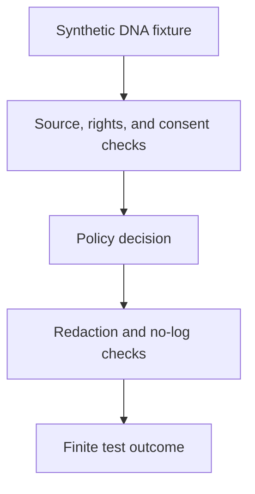

<!-- [KFM_META_BLOCK_V2]
doc_id: kfm://doc/tests-domains-people-dna-land-dna-readme
title: People DNA Land DNA Tests README
type: test-index-readme
version: v0.1
status: draft; directory-created-in-scratch; dna-test-index; PROPOSED / NEEDS VERIFICATION before promotion
owners:
  - OWNER_TBD - People DNA Land domain steward
  - OWNER_TBD - DNA privacy steward
  - OWNER_TBD - Consent steward
  - OWNER_TBD - Evidence steward
  - OWNER_TBD - Policy steward
  - OWNER_TBD - Security steward
  - OWNER_TBD - Release steward
  - OWNER_TBD - QA steward
created: 2026-07-05
updated: 2026-07-05
policy_label: public-doc; tests; people-dna-land; dna; parent-index; living-person-sensitive; dna-sensitive; no-network; evidence-bound; consent-gated; policy-gated; release-gated; correction-aware; withdrawal-aware; rollback-aware
tags: [kfm, tests, people-dna-land, dna, genomics, genealogy, living-person, consent, privacy, security, no-log, source-role, EvidenceBundle, PolicyDecision, ConsentRecord, RedactionReceipt, ReleaseManifest, CorrectionNotice, WithdrawalNotice, RollbackCard, ABSTAIN, DENY, ERROR]
related:
  - ../../../README.md
  - ../../README.md
  - ../README.md
  - no-log/README.md
  - ../consent/README.md
  - ../contracts/README.md
  - ../connectors/README.md
  - ../assessor_as_title_denial_test/README.md
  - ../chain_of_title_gap_test/README.md
  - ../../../../docs/domains/people-dna-land/
  - ../../../../contracts/domains/people-dna-land/
  - ../../../../schemas/contracts/v1/domains/people-dna-land/
  - ../../../../policy/domains/people-dna-land/
  - ../../../../fixtures/domains/people-dna-land/dna/
  - ../../../../data/registry/sources/people-dna-land/
  - ../../../../release/manifests/people-dna-land/
notes:
  - "This README replaces the placeholder content at tests/domains/people-dna-land/dna/README.md."
  - "Directory Rules place enforceability proof under tests/ and identify people-dna-land as a domain lane pattern."
  - "This is a DNA test index only. It does not define People DNA Land doctrine, DNA policy, DNA source admission, consent-record storage, contracts, schemas, fixtures, EvidenceBundles, release decisions, pipeline code, public API material, public map material, public tiles, or published artifacts."
  - "The confirmed child lane at authoring time is no-log/README.md. Other child lanes listed here are PROPOSED until corresponding files and executable tests are verified."
  - "The tested parent invariant is that DNA and DNA-derived material are sensitive assertion inputs, not public truth, public map labels, logging payloads, AI context, or release authority."
  - "Default posture is deterministic and no-network. Live DNA services, genealogy providers, source exports, real people records, real DNA data, consent records with real subject data, credentials, runtime telemetry, production logs, and public release artifacts do not belong in default DNA tests."
[/KFM_META_BLOCK_V2] -->

<a id="top"></a>

# People DNA Land DNA tests

> Parent index for deterministic, no-network DNA guardrail tests in the People DNA Land domain. These tests should prove DNA sensitivity, consent, evidence, policy, no-log, AI, review, release, correction, withdrawal, and rollback boundaries without becoming DNA policy, DNA storage, or public truth authority.

<p>
  
  
  
  
  
  
</p>

**Path:** `tests/domains/people-dna-land/dna/README.md`  
**Status:** draft / directory-created-in-scratch / DNA test parent index / PROPOSED until executable tests are verified  
**Owning root:** `tests/`  
**Domain segment:** `people-dna-land`  
**Test lane family:** `dna`  
**Default execution posture:** deterministic, synthetic, no-network, public-safe fixtures only  
**Truth posture:** CONFIRMED by Directory Rules that `tests/` is the canonical root for enforceability proof and that `people-dna-land` is a domain lane pattern; CONFIRMED by attached doctrine that living-person data, genealogy, DNA/genomics, rights, consent, source role, review state, release state, correction, withdrawal, and rollback can block public exposure; CONFIRMED current child lane exists at `tests/domains/people-dna-land/dna/no-log/README.md`; NEEDS VERIFICATION for executable DNA tests, accepted DNA fixture shape, policy runtime, consent integration, logging capture, AI envelope tests, release integration, CI coverage, and pass rates.

---

## Purpose

`tests/domains/people-dna-land/dna/` is the parent test index for DNA-related guardrails in the People DNA Land domain.

This subtree should prove that DNA and DNA-derived material remain sensitive, evidence-bound, consent-aware, policy-gated, reviewable, and release-gated. DNA-sensitive assertions may involve raw genomic data, genotype-like payloads, match lists, inferred relationships, family links, living-person identity, private land associations, source exports, AI context, logs, receipts, or public carriers.

A passing DNA test should **not** mean that a DNA assertion is true, a relationship is proven, a consent record is valid, a source is admitted, a living-person assertion is publishable, a land relationship is safe to display, a log sink is production-ready, or a release is approved. It should mean only that the scoped DNA guardrail behaved as expected against bounded synthetic fixtures and local files.

[Back to top](#top)

---

## Placement Basis

Directory Rules classify `tests/` as the root that proves rules are enforceable. They also require domain-specific material to appear as a segment inside the responsibility root, such as `tests/domains/<domain>/`, and list `people-dna-land` in the domain lane pattern.

This directory is therefore a **test lane family** for DNA behavior only. DNA policy belongs under `policy/`; semantic meaning belongs under `contracts/`; machine shape belongs under `schemas/`; source descriptors belong under `data/registry/sources/`; reusable synthetic fixtures belong under the accepted fixture home; and release authority belongs under `release/`.

| Responsibility | Correct home | This lane family's relationship |
|---|---|---|
| DNA guardrail tests | `tests/domains/people-dna-land/dna/` | This directory. |
| DNA no-log tests | `tests/domains/people-dna-land/dna/no-log/` | Confirmed child lane. |
| Reusable synthetic DNA fixtures | `fixtures/domains/people-dna-land/dna/` | Preferred fixture home if populated. |
| Consent behavior tests | `tests/domains/people-dna-land/consent/` | Adjacent consent exposure gates. |
| Contract behavior tests | `tests/domains/people-dna-land/contracts/` | Adjacent assertion/envelope guardrails. |
| Semantic contracts | `contracts/domains/people-dna-land/` | Defines object meaning, not owned here. |
| Machine schemas | `schemas/contracts/v1/domains/people-dna-land/` | Defines accepted shapes where available. |
| Policy rules | `policy/domains/people-dna-land/` | Decides allow, deny, restrict, abstain, redact, withdraw, and release behavior. |
| Source descriptors | `data/registry/sources/people-dna-land/` | Source identity, rights, role, caveats, consent obligations, and permitted claim types. |
| Evidence and proofs | `data/proofs/` or accepted proof home | EvidenceBundle support, not stored here. |
| Release decisions | `release/` | Publication, correction, withdrawal, rollback, and cache invalidation authority. |

[Back to top](#top)

---

## Parent Invariant

> **DNA is a sensitive assertion input, not public truth.** DNA-related material can support tightly scoped, evidence-bound assertions only after source role, rights, consent, living-person sensitivity, policy, review, release, correction, withdrawal, and rollback requirements are satisfied. DNA material must not silently become map labels, AI context, logs, public summaries, or canonical person truth.

Core checks:

| Check | Required behavior | Failure outcome |
|---|---|---|
| Synthetic-only default | Default tests use fake local fixtures, not real DNA or real people data. | validation failure / `ERROR`. |
| Source-role support | DNA-like input preserves source identity, rights posture, role, caveats, and permitted claim type where material. | validation failure / `ABSTAIN`. |
| Consent gate | Missing, revoked, expired, disputed, or mismatched consent blocks public or semi-public exposure. | `DENY` / `ABSTAIN`. |
| Living-person posture | Living-person or possibly-living assertions fail closed without accepted policy and consent support. | `DENY` / `ABSTAIN`. |
| Relationship caution | DNA-derived kinship, match, identity, or parentage signals remain assertions or hypotheses until evidence and review support a narrower claim. | `ABSTAIN` / `DENY`. |
| No-log posture | Raw DNA, living-person, consent, source-payload, secret, private reasoning, and unrestricted evidence payloads do not enter logs. | validation failure / security review. |
| AI boundary | AI prompts, traces, summaries, and answers receive only governed, policy-safe context and cannot authorize release. | `DENY` / `ABSTAIN` / `ERROR`. |
| Evidence boundary | EvidenceRef must resolve to appropriate EvidenceBundle support before consequential claims are answered or rendered as authoritative. | `ABSTAIN`. |
| Release boundary | Test success never becomes release approval, publication, public API payload, map layer, tile, screenshot, correction, withdrawal, or rollback. | promotion block. |

---

## Lane Index

| Lane | Status | Purpose | Boundary |
|---|---|---|---|
| [`no-log/`](no-log/README.md) | CONFIRMED README / executable tests NEEDS VERIFICATION | Proves DNA-sensitive and living-person payloads do not leak into logs, traces, diagnostics, AI prompts, receipts, errors, or public/debug surfaces. | Does not define logging policy or runtime logging implementation. |
| `consent-scope/` | PROPOSED | Would prove DNA exposure honors explicit consent purpose, audience, role, data class, derivation, geography, and time. | Consent policy and records do not live here. |
| `source-role/` | PROPOSED | Would prove DNA-like source material cannot support claims outside its accepted source role and rights posture. | Source descriptors do not live here. |
| `relationship-assertion/` | PROPOSED | Would prove match, kinship, parentage, or family-link material remains assertion-first and evidence-bound. | Relationship truth and canonical person records do not live here. |
| `ai-boundary/` | PROPOSED | Would prove AI context and answers cannot receive or expose raw DNA payloads or unrestricted evidence. | AI runtime, model provider, and prompt implementation do not live here. |
| `release-denial/` | PROPOSED | Would prove DNA-sensitive material cannot become public artifacts without evidence, consent, policy, review, release, and rollback support. | Release manifests and publication authority do not live here. |

Only `no-log/` was confirmed as an authored child README when this index was created. The other lanes are backlog signposts, not claims of implementation.

[Back to top](#top)

---

## Guardrail Flow



The diagram shows the expected responsibility order for tests in this directory. It does not prove that runtime pipelines, policies, schemas, or validators currently exist.

---

## Accepted Inputs

Only bounded, synthetic, reviewable inputs belong in this lane family:

- Synthetic DNA-like records designed for guardrail testing.
- Synthetic DNA-derived relationship or match examples that are clearly fake.
- Synthetic living-person identifiers that are public-safe and marked as fake.
- Synthetic ConsentRecord-like references with fake subject IDs and fake scope/withdrawal states.
- Synthetic EvidenceRef, EvidenceBundle stub, PolicyDecision, RedactionReceipt, ReleaseManifest, CorrectionNotice, WithdrawalNotice, and RollbackCard references.
- Static deny/abstain/error examples that prove finite outcomes.
- Canary strings that make accidental logging, AI exposure, source-payload echoing, or release leakage obvious.
- Local captured envelopes from test helpers, provided they contain no real telemetry or sensitive payloads.

The lane family may assert that safe outputs contain only public-safe references, finite outcomes, redaction reason codes, validator names, fixture IDs, policy decision IDs, receipt references, and release IDs only when already public-safe.

> [!IMPORTANT]
> DNA tests may use synthetic references to evidence, consent, policy, release, correction, withdrawal, and rollback objects. They must not inline real sensitive payloads or treat references as authorization to expose the underlying material.

---

## Exclusions

Do **not** place these materials in this lane family:

| Excluded material | Why it does not belong here | Correct direction |
|---|---|---|
| Real DNA data, genotype data, sample IDs, kit exports, match lists, segment data, or provider exports | Sensitive, potentially identifying, and unnecessary for deterministic tests. | Keep out of default tests; use synthetic fixtures only. |
| Real living-person records, addresses, contacts, family links, or private land associations | Living-person-sensitive. | Use fake fixtures with explicit redaction canaries. |
| Real consent records, signatures, subject identifiers, or withdrawal details | Consent payloads are not test-index content. | Accepted consent-record home after verification. |
| Source-provider credentials, tokens, cookies, secrets, API keys, or live endpoints | Security and rights exposure. | Secret manager or fake local test values only. |
| Live genealogy or DNA provider calls | Network and rights/consent uncertainty. | No-network fixtures or connector tests with explicit gating elsewhere. |
| Runtime/production logs, traces, telemetry, or diagnostics | This lane proves patterns; it is not a telemetry store. | Runtime/logging home plus reviewed sampling/redaction process. |
| Logging, DNA, consent, or release policy | Policy authority does not live in tests. | `policy/` or accepted policy home. |
| Semantic contract definitions | Meaning does not live in tests. | `contracts/domains/people-dna-land/`. |
| Machine schemas | Shape does not live in tests. | `schemas/contracts/v1/domains/people-dna-land/`. |
| Public API payloads, public map artifacts, tiles, screenshots, or release manifests | Publication requires governed release. | `release/`, governed APIs, and accepted map artifact homes. |

[Back to top](#top)

---

## Suggested Layout

```text
tests/domains/people-dna-land/dna/
|-- README.md
|-- no-log/
|   `-- README.md
|-- consent-scope/
|-- source-role/
|-- relationship-assertion/
|-- ai-boundary/
`-- release-denial/
```

Only `README.md` and `no-log/README.md` are confirmed in this lane family at authoring time. The remaining child directories are **PROPOSED** until created with executable tests or their own README files.

---

## Run Posture

No executable runner was verified while authoring this README. Once tests exist, the expected local command should be documented and verified here.

```bash
: "PROPOSED / NEEDS VERIFICATION"
pytest tests/domains/people-dna-land/dna
```

Required run posture:

- no network access
- no real DNA data
- no real living-person data
- no real consent payloads
- no credentials
- no production logs or telemetry
- no live genealogy or DNA providers
- no public artifact writes
- deterministic fixture inputs
- finite outcomes only: `PASS`, `DENY`, `ABSTAIN`, or `ERROR`

---

## Evidence Ledger

| Source | Status | Supports | Limits |
|---|---|---|---|
| `Directory Rules.pdf` | CONFIRMED | `tests/` is the canonical enforceability root; domain-specific materials appear as segments under responsibility roots; `people-dna-land` is a domain lane pattern. | Does not prove this DNA lane has executable tests or accepted fixture shapes. |
| `Unified Implementation Architecture Build Manual.md` | CONFIRMED doctrine | Security posture includes deny-by-default deployment rules and log exclusions for secrets, private reasoning, raw sensitive evidence, and unrestricted source dumps. | Does not prove current runtime logging implementation, policy runtime, CI, or pass rates. |
| `KFM_Pass_20_Part_2_Idea_Index_Category_Atlas_and_Expansion_Dossier.md` | CONFIRMED synthesis / PROPOSED implementation pressure | Reiterates evidence-first, cite-or-abstain, fail-closed, policy-aware, assertion-first, living-person/DNA restriction, release, correction, and rollback posture. | Static synthesis does not prove current repository implementation. |
| `tests/domains/people-dna-land/dna/no-log/README.md` | CONFIRMED child README | Defines the authored no-log child lane and its boundary against logging payload leakage. | Does not prove executable no-log tests or parent DNA coverage. |
| `tests/domains/people-dna-land/consent/README.md` | CONFIRMED adjacent pattern | Shows current consent-test index style and consent exposure-gate posture. | Consent lane does not define DNA policy. |
| `tests/domains/people-dna-land/contracts/README.md` | CONFIRMED adjacent pattern | Shows responsibility-root separation for contracts, schemas, policy, tests, fixtures, source descriptors, evidence, and release. | Contract lane does not define DNA policy or fixture shape. |
| GitHub target file before update | CONFIRMED | `tests/domains/people-dna-land/dna/README.md` existed as placeholder content `y` before replacement. | Placeholder proves path existence only. |

---

## Validation Checklist

- [ ] Confirm or create executable DNA test files under this lane family.
- [ ] Confirm accepted synthetic DNA fixture home and canary naming convention.
- [ ] Confirm accepted DNA-related contract and schema names before asserting field-level requirements.
- [ ] Confirm policy runtime outcomes for DNA, living-person, consent, source-role, AI, no-log, release, withdrawal, and rollback cases.
- [ ] Confirm tests assert no network access, no credentials, no real DNA data, no real living-person data, no production logs, and no public artifact writes.
- [ ] Confirm `no-log/` tests cover logs, traces, diagnostics, prompts, errors, receipts, and public/debug summaries.
- [ ] Confirm consent tests and DNA tests do not create parallel consent authority.
- [ ] Confirm EvidenceRef-to-EvidenceBundle resolution is required before consequential claims are answered or rendered as authoritative.
- [ ] Confirm public or semi-public outputs still require evidence, policy, consent where applicable, review, release, correction, withdrawal, and rollback support.
- [ ] Wire the lane family into CI only after executable tests and safe fixtures exist.

---

## Rollback

Rollback is required if this lane family starts to:

- store real DNA, living-person, consent, source, credential, or production-log payloads
- define DNA, logging, consent, source, AI, or release policy instead of testing it
- define semantic contracts or machine schemas
- admit live DNA or genealogy provider data into default tests
- treat tests, logs, AI output, screenshots, map labels, tiles, or public API payloads as sovereign truth
- bypass EvidenceBundle resolution, consent checks, policy decisions, review state, release state, correction, withdrawal, or rollback controls
- weaken fail-closed behavior for living-person or DNA-sensitive material

Rollback target: restore the previous safe README revision or remove the lane family until policy, fixtures, runtime behavior, source-role handling, and CI integration are reverified.

[Back to top](#top)