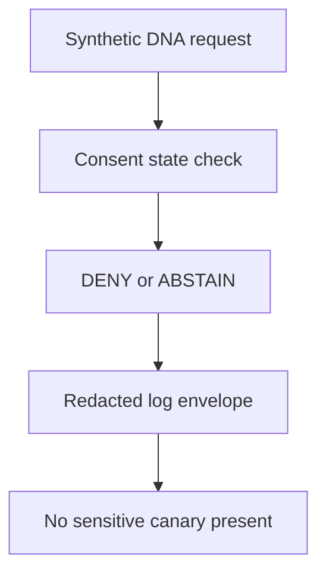

<!-- [KFM_META_BLOCK_V2]
doc_id: kfm://doc/tests-domains-people-dna-land-dna-consent-no-log-test-readme
title: People DNA Land DNA Consent No-Log Test README
type: test-lane-readme
version: v0.1
status: draft; directory-created-in-scratch; flat-regression-test-lane; PROPOSED / NEEDS VERIFICATION before promotion
owners:
  - OWNER_TBD - People DNA Land domain steward
  - OWNER_TBD - DNA privacy steward
  - OWNER_TBD - Consent steward
  - OWNER_TBD - Evidence steward
  - OWNER_TBD - Policy steward
  - OWNER_TBD - Security steward
  - OWNER_TBD - Release steward
  - OWNER_TBD - QA steward
created: 2026-07-06
updated: 2026-07-06
policy_label: public-doc; tests; people-dna-land; dna-consent-no-log; flat-regression-lane; living-person-sensitive; dna-sensitive; consent-gated; no-log; no-network; evidence-bound; policy-gated; release-gated; rollback-aware
tags: [kfm, tests, people-dna-land, dna, consent, no-log, flat-regression, privacy, security, living-person, genealogy, EvidenceBundle, PolicyDecision, ConsentRecord, RedactionReceipt, ReleaseManifest, CorrectionNotice, WithdrawalNotice, RollbackCard, ABSTAIN, DENY, ERROR]
related:
  - ../../../README.md
  - ../../README.md
  - ../README.md
  - ../dna/README.md
  - ../dna/no-log/README.md
  - ../consent/README.md
  - ../consent/revocation/README.md
  - ../contracts/README.md
  - ../connectors/README.md
  - ../assessor_as_title_denial_test/README.md
  - ../chain_of_title_gap_test/README.md
  - ../../../../docs/domains/people-dna-land/
  - ../../../../contracts/domains/people-dna-land/
  - ../../../../schemas/contracts/v1/domains/people-dna-land/
  - ../../../../policy/domains/people-dna-land/
  - ../../../../fixtures/domains/people-dna-land/dna_consent_no_log_test/
  - ../../../../fixtures/domains/people-dna-land/dna/
  - ../../../../fixtures/domains/people-dna-land/consent/
  - ../../../../data/registry/sources/people-dna-land/
  - ../../../../release/manifests/people-dna-land/
notes:
  - "This README replaces the placeholder content at tests/domains/people-dna-land/dna_consent_no_log_test/README.md."
  - "Directory Rules place enforceability proof under tests/ and identify people-dna-land as a domain lane pattern."
  - "This is a flat regression test lane that cross-checks DNA consent and no-log behavior. It does not replace the authored parent lanes at tests/domains/people-dna-land/dna/ or tests/domains/people-dna-land/consent/."
  - "This README does not define DNA policy, consent policy, logging policy, runtime logging implementation, consent-record storage, contracts, schemas, source descriptors, EvidenceBundles, release decisions, public API material, public map material, public tiles, or published artifacts."
  - "The tested invariant is that missing, revoked, expired, disputed, or scope-mismatched consent blocks DNA exposure and still must not leak DNA, living-person, consent, source-payload, secret, private-reasoning, or unrestricted evidence payloads into logs."
  - "Default posture is deterministic and no-network. Real DNA data, real people records, live genealogy or DNA services, real consent records, credentials, production logs, runtime telemetry, and public release artifacts do not belong in default tests."
[/KFM_META_BLOCK_V2] -->

<a id="top"></a>

# People DNA Land DNA consent no-log test

> Flat regression lane for proving that DNA-sensitive exposure fails closed when consent is absent or invalid, while logs, traces, diagnostics, prompts, errors, receipts, and debug summaries still remain payload-free.

<p>
  
  
  
  
  
  
</p>

**Path:** `tests/domains/people-dna-land/dna_consent_no_log_test/README.md`  
**Status:** draft / directory-created-in-scratch / flat DNA-consent-no-log regression lane / PROPOSED until executable tests are verified  
**Owning root:** `tests/`  
**Domain segment:** `people-dna-land`  
**Test lane family:** `dna_consent_no_log_test`  
**Default execution posture:** deterministic, synthetic, no-network, public-safe fixtures only  
**Truth posture:** CONFIRMED by Directory Rules that `tests/` is the canonical root for enforceability proof and that `people-dna-land` is a domain lane pattern; CONFIRMED current adjacent parent indexes exist at `tests/domains/people-dna-land/dna/README.md`, `tests/domains/people-dna-land/dna/no-log/README.md`, and `tests/domains/people-dna-land/consent/README.md`; CONFIRMED by attached doctrine that living-person data, genealogy, DNA/genomics, rights, consent, source role, logs, review state, release state, correction, withdrawal, and rollback can block or constrain exposure; NEEDS VERIFICATION for executable tests, accepted fixture shape, consent-record shape, logging envelope shape, policy runtime, CI coverage, and pass rates.

---

## Purpose

`tests/domains/people-dna-land/dna_consent_no_log_test/` is a focused regression lane for the intersection of two guardrails:

1. DNA-sensitive exposure requires valid, in-scope consent where policy requires consent.
2. Consent failure, denial, abstention, validation error, or runtime error must not leak sensitive payloads into logs or adjacent operational surfaces.

This lane should prove that the system can say "no" or "not enough support" without echoing the very DNA, living-person, consent, source, or evidence material it is refusing to expose.

A passing test in this lane should **not** mean that a DNA assertion is true, a consent record is valid, a source is admitted, a logging stack is production-ready, a person relationship is proven, a land association is publishable, or a release is approved. It should mean only that the scoped consent/no-log guardrail behaved as expected against bounded synthetic fixtures and local files.

[Back to top](#top)

---

## Placement Basis

Directory Rules classify `tests/` as the root that proves rules are enforceable. They also require domain-specific material to appear as a segment inside the responsibility root, such as `tests/domains/<domain>/`, and list `people-dna-land` in the domain lane pattern.

This path is a **flat regression lane**. It can exercise a cross-lane case, but it must not become a second home for DNA doctrine, consent policy, logging policy, schema definitions, source admission, EvidenceBundle storage, release authority, or public output.

| Responsibility | Correct home | This lane's relationship |
|---|---|---|
| Cross-lane DNA consent no-log regression | `tests/domains/people-dna-land/dna_consent_no_log_test/` | This directory. |
| Parent DNA test index | `tests/domains/people-dna-land/dna/` | Owns broader DNA test-family orientation. |
| DNA no-log tests | `tests/domains/people-dna-land/dna/no-log/` | Owns the narrower no-log lane. |
| Consent tests | `tests/domains/people-dna-land/consent/` | Owns broader consent guardrail tests. |
| Consent revocation tests | `tests/domains/people-dna-land/consent/revocation/` | Adjacent revocation-specific lane. |
| Semantic contracts | `contracts/domains/people-dna-land/` | Defines meaning, not owned here. |
| Machine schemas | `schemas/contracts/v1/domains/people-dna-land/` | Defines accepted shapes where available. |
| Policy rules | `policy/domains/people-dna-land/` | Decides allow, deny, restrict, abstain, redact, withdraw, and release behavior. |
| Reusable synthetic fixtures | `fixtures/domains/people-dna-land/dna_consent_no_log_test/` | Preferred flat fixture home if populated. |
| Source descriptors | `data/registry/sources/people-dna-land/` | Source identity, rights, role, caveats, consent obligations, and permitted claim types. |
| Release decisions | `release/` | Publication, correction, withdrawal, rollback, and cache invalidation authority. |

[Back to top](#top)

---

## Invariant Under Test

> **Consent failure must fail closed and stay quiet.** When DNA-sensitive material lacks valid consent or has only revoked, expired, disputed, stale, or mismatched consent, the result must deny or abstain from exposure while logs and operational surfaces retain only public-safe references and finite outcomes.

Core checks:

| Check | Required behavior | Failure outcome |
|---|---|---|
| Missing consent | DNA-sensitive exposure is blocked when required consent is absent. | `DENY` / `ABSTAIN`. |
| Scope mismatch | Consent for one purpose, audience, role, data class, derivation, geography, or time window cannot authorize another. | `DENY` / `ABSTAIN`. |
| Revoked consent | Revoked consent blocks exposure and may require withdrawal behavior without deleting audit lineage. | `DENY` / withdrawal-required failure. |
| Expired or stale consent | Expired, stale, disputed, or superseded consent fails closed. | `DENY` / `ABSTAIN`. |
| No raw DNA in logs | Raw DNA, genotype-like payloads, match lists, kinship payloads, and source exports do not enter logs. | test failure / security review. |
| No consent payload in logs | Consent form text, subject identifiers, signatures, withdrawal reasons, and private consent metadata are absent from logs. | test failure / security review. |
| No living-person leak | Names, direct identifiers, private contact data, family links, and private land associations are absent unless already governed as public-safe references. | test failure / `DENY` recommendation. |
| Error path redaction | Validation, denial, abstention, and exception paths do not echo input payloads. | test failure / `ERROR` review. |
| Evidence boundary | Logs may reference EvidenceBundle or receipt objects; they must not inline sensitive EvidenceBundle contents. | test failure / `ABSTAIN` or `DENY`. |
| Release boundary | Test success never becomes release approval, public API payload, map label, tile, screenshot, correction, withdrawal, or rollback. | promotion block. |

---

## Regression Flow



This diagram describes the intended regression shape only. It does not prove that runtime pipelines, policy engines, schema validators, log collectors, or CI jobs currently exist.

---

## Accepted Inputs

Only bounded, synthetic, reviewable inputs belong in this lane:

- Synthetic DNA-like records designed for consent and no-log testing.
- Synthetic consent states: missing, revoked, expired, disputed, stale, superseded, and scope-mismatched.
- Synthetic living-person identifiers that are clearly fake and public-safe.
- Synthetic DNA-derived relationship or match examples that are clearly fake.
- Synthetic EvidenceRef, EvidenceBundle stub, PolicyDecision, ConsentRecord, RedactionReceipt, ReleaseManifest, CorrectionNotice, WithdrawalNotice, and RollbackCard references.
- Captured local log envelopes emitted by test helpers.
- Canary strings that should cause a test failure if they appear in logs, traces, diagnostics, prompts, errors, receipts, or public/debug summaries.

Safe outputs may include only public-safe references and operational fields such as fixture ID, request ID, policy decision ID, redaction reason code, validator name, finite outcome, schema/spec hash, and receipt reference.

> [!IMPORTANT]
> A safe reference is not permission to dereference sensitive material in a public surface. EvidenceBundle resolution, consent state, policy decision, review state, release state, correction state, withdrawal state, and rollback support still control exposure.

---

## Exclusions

Do **not** place these materials in this lane:

| Excluded material | Why it does not belong here | Correct direction |
|---|---|---|
| Real DNA data, genotype data, kit exports, match lists, segment data, or provider exports | Sensitive, identifying, and unnecessary for deterministic tests. | Use synthetic fixtures only. |
| Real people records, addresses, contacts, family links, or private land associations | Living-person-sensitive. | Use fake fixtures with explicit redaction canaries. |
| Real consent records, signatures, subject identifiers, or withdrawal details | Consent payloads are not regression fixtures. | Accepted consent-record home after verification. |
| Live genealogy or DNA provider calls | Network, rights, and consent uncertainty. | No-network fixtures or separately gated connector tests. |
| Production logs, runtime telemetry, traces, or diagnostics | This lane proves redaction patterns; it is not a telemetry store. | Runtime/logging home plus reviewed sampling/redaction process. |
| Secrets, credentials, tokens, cookies, provider keys, or auth headers | Security exposure. | Secret manager or fake local test values only. |
| DNA, consent, logging, or release policy | Policy authority does not live in tests. | `policy/` or accepted policy home. |
| Semantic contracts or machine schemas | Meaning and shape do not live here. | `contracts/` and `schemas/`. |
| Public API payloads, public map artifacts, tiles, screenshots, or release manifests | Publication requires governed release. | `release/`, governed APIs, and accepted map artifact homes. |

[Back to top](#top)

---

## Suggested Layout

```text
tests/domains/people-dna-land/dna_consent_no_log_test/
|-- README.md
|-- test_missing_consent_denies_without_logging_dna.py
|-- test_revoked_consent_denies_without_logging_consent_payload.py
|-- test_scope_mismatch_denies_without_logging_living_person_data.py
|-- test_expired_consent_abstains_without_echoing_source_payload.py
|-- test_policy_error_redacts_dna_and_consent_canaries.py
|-- test_evidence_refs_logged_without_evidence_payloads.py
|-- test_ai_prompt_trace_excludes_denied_dna_context.py
`-- test_no_network_dna_consent_no_log.py
```

This layout is **PROPOSED** until executable files exist in the repository.

---

## Run Posture

No executable runner was verified while authoring this README. Once tests exist, the expected local command should be documented and verified here.

```bash
: "PROPOSED / NEEDS VERIFICATION"
pytest tests/domains/people-dna-land/dna_consent_no_log_test
```

Required run posture:

- no network access
- no real DNA data
- no real living-person data
- no real consent payloads
- no credentials
- no production logs or telemetry
- no live genealogy or DNA providers
- no public artifact writes
- deterministic fixture inputs
- finite outcomes only: `PASS`, `DENY`, `ABSTAIN`, or `ERROR`

---

## Minimal Canary Contract

Synthetic fixtures should include canary values that make leakage obvious. A test should fail if any `must_not_log` value appears in logs, traces, diagnostics, prompts, errors, receipts, or public/debug summaries.

```json
{
  "fixture_id": "people-dna-land-dna-consent-no-log-example",
  "consent_state": "revoked",
  "expected_outcome": "DENY",
  "safe_log_fields": {
    "request_id": "request-fixture-001",
    "policy_decision_id": "policy-decision-fixture-001",
    "reason_code": "DNA_CONSENT_NOT_VALID",
    "redaction_receipt_ref": "redaction-receipt-fixture-001"
  },
  "must_not_log": [
    "RAW_DNA_CANARY",
    "LIVING_PERSON_CANARY",
    "CONSENT_PAYLOAD_CANARY",
    "WITHDRAWAL_REASON_CANARY",
    "DNA_MATCH_LIST_CANARY",
    "UNRESTRICTED_EVIDENCE_CANARY",
    "SOURCE_DUMP_CANARY",
    "SECRET_CANARY"
  ]
}
```

The JSON above is illustrative. Accepted schema, field names, and fixture homes remain **NEEDS VERIFICATION**.

---

## Evidence Ledger

| Source | Status | Supports | Limits |
|---|---|---|---|
| `Directory Rules.pdf` | CONFIRMED | `tests/` is the canonical enforceability root; domain-specific materials appear as segments under responsibility roots; `people-dna-land` is a domain lane pattern. | Does not prove this flat regression lane has executable tests or accepted fixture shapes. |
| `Unified Implementation Architecture Build Manual.md` | CONFIRMED doctrine | Logs may include request IDs, policy decisions, adapter metadata, citation report IDs, and receipt IDs; logs exclude secrets, private reasoning, raw sensitive evidence, and unrestricted source dumps. | Does not prove current runtime logging implementation, policy runtime, CI, or pass rates. |
| `KFM_Pass_20_Part_2_Idea_Index_Category_Atlas_and_Expansion_Dossier.md` | CONFIRMED synthesis / PROPOSED implementation pressure | Reiterates evidence-first, cite-or-abstain, fail-closed, policy-aware, assertion-first, living-person/DNA restriction, release, correction, and rollback posture. | Static synthesis does not prove current repository implementation. |
| `tests/domains/people-dna-land/dna/README.md` | CONFIRMED adjacent parent index | Defines the authored DNA test parent index and confirms `dna/no-log/` as a child lane. | Does not prove executable DNA tests. |
| `tests/domains/people-dna-land/dna/no-log/README.md` | CONFIRMED adjacent child lane | Defines the authored DNA no-log lane and its boundary against logging payload leakage. | Does not prove executable no-log tests. |
| `tests/domains/people-dna-land/consent/README.md` | CONFIRMED adjacent parent index | Defines the consent test parent index and consent-as-exposure-gate posture. | Does not prove executable consent tests. |
| GitHub target file before update | CONFIRMED | `tests/domains/people-dna-land/dna_consent_no_log_test/README.md` existed as placeholder content `y` before replacement. | Placeholder proves path existence only. |

---

## Validation Checklist

- [ ] Confirm whether this flat lane should remain long-term or be migrated under `dna/` and `consent/` after tests mature.
- [ ] Confirm accepted fixture home and canary naming convention.
- [ ] Confirm accepted consent-state vocabulary and ConsentRecord-like shape.
- [ ] Confirm accepted logging envelope fields and redaction helper names.
- [ ] Add executable tests for missing, revoked, expired, disputed, stale, superseded, and scope-mismatched consent.
- [ ] Ensure every failure path asserts absence of DNA, living-person, consent, source, evidence, secret, and private-reasoning canaries.
- [ ] Confirm tests require no network access, credentials, real DNA data, real living-person data, production logs, live providers, or public artifact writes.
- [ ] Confirm EvidenceRef-to-EvidenceBundle resolution is required before consequential claims are answered or rendered as authoritative.
- [ ] Confirm public or semi-public outputs still require evidence, policy, consent where applicable, review, release, correction, withdrawal, and rollback support.
- [ ] Wire the lane into CI only after executable tests and safe fixtures exist.

---

## Rollback

Rollback is required if this lane starts to:

- store real DNA, living-person, consent, source, credential, or production-log payloads
- define DNA, consent, logging, source, AI, or release policy instead of testing it
- define semantic contracts or machine schemas
- duplicate or override the `dna/`, `dna/no-log/`, or `consent/` lane authority
- admit live DNA or genealogy provider data into default tests
- treat logs, AI output, screenshots, map labels, tiles, public API payloads, or tests as sovereign truth
- bypass EvidenceBundle resolution, consent checks, policy decisions, review state, release state, correction, withdrawal, or rollback controls
- weaken fail-closed behavior for living-person or DNA-sensitive material

Rollback target: restore the previous safe README revision or remove the flat regression lane until policy, fixtures, runtime behavior, consent handling, no-log behavior, and CI integration are reverified.

[Back to top](#top)