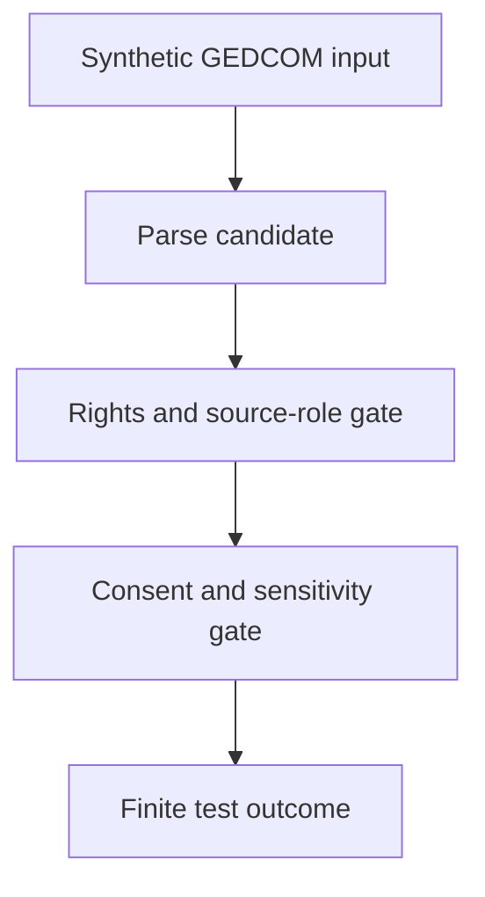

<!-- [KFM_META_BLOCK_V2]
doc_id: kfm://doc/tests-domains-people-dna-land-gedcom-import-rights-test-readme
title: People DNA Land GEDCOM Import Rights Test README
type: test-lane-readme
version: v0.1
status: draft; directory-created-in-scratch; flat-regression-test-lane; PROPOSED / NEEDS VERIFICATION before promotion
owners:
  - OWNER_TBD - People DNA Land domain steward
  - OWNER_TBD - GEDCOM connector steward
  - OWNER_TBD - Source rights steward
  - OWNER_TBD - Genealogy steward
  - OWNER_TBD - Privacy steward
  - OWNER_TBD - Evidence steward
  - OWNER_TBD - Policy steward
  - OWNER_TBD - Release steward
  - OWNER_TBD - QA steward
created: 2026-07-06
updated: 2026-07-06
policy_label: public-doc; tests; people-dna-land; gedcom-import-rights; flat-regression-lane; genealogy; living-person-sensitive; dna-sensitive; rights-gated; consent-gated; source-role-gated; no-network; evidence-bound; policy-gated; release-gated; rollback-aware
tags: [kfm, tests, people-dna-land, gedcom, genealogy, import-rights, source-rights, source-role, attribution, redistribution, consent, living-person, dna, EvidenceBundle, PolicyDecision, SourceIntakeRecord, ConsentRecord, ReleaseManifest, CorrectionNotice, WithdrawalNotice, RollbackCard, ABSTAIN, DENY, ERROR]
related:
  - ../../../README.md
  - ../../README.md
  - ../README.md
  - ../connectors/README.md
  - ../connectors/gedcom/README.md
  - ../consent/README.md
  - ../dna/README.md
  - ../dna/no-log/README.md
  - ../contracts/README.md
  - ../dna_consent_no_log_test/README.md
  - ../assessor_as_title_denial_test/README.md
  - ../chain_of_title_gap_test/README.md
  - ../../../../docs/domains/people-dna-land/
  - ../../../../contracts/domains/people-dna-land/
  - ../../../../schemas/contracts/v1/domains/people-dna-land/
  - ../../../../policy/domains/people-dna-land/
  - ../../../../fixtures/domains/people-dna-land/gedcom_import_rights_test/
  - ../../../../fixtures/domains/people-dna-land/connectors/gedcom/
  - ../../../../connectors/people-dna-land/gedcom/
  - ../../../../data/registry/sources/people-dna-land/
  - ../../../../release/manifests/people-dna-land/
notes:
  - "This README replaces the placeholder content at tests/domains/people-dna-land/gedcom_import_rights_test/README.md."
  - "Directory Rules place enforceability proof under tests/, source-specific fetcher/admitter implementation under connectors/, source identity/rights metadata under data/registry/sources/, and people-dna-land as a domain lane pattern."
  - "This is a flat GEDCOM import rights regression lane. It does not replace the authored connector lane at tests/domains/people-dna-land/connectors/gedcom/README.md."
  - "This README does not define GEDCOM connector implementation, source-rights policy, source descriptors, consent storage, contracts, schemas, EvidenceBundles, release decisions, public API material, public map material, public tiles, or published artifacts."
  - "The tested invariant is that GEDCOM parse/import success is blocked or quarantined when source rights, redistribution permission, attribution duties, submitter authority, living-person sensitivity, DNA sensitivity, consent, or source-role support is missing or unsafe."
  - "Default posture is deterministic and no-network. Real GEDCOM exports, live genealogy services, real people records, real consent records, DNA data, credentials, production logs, and public release artifacts do not belong in default tests."
[/KFM_META_BLOCK_V2] -->

<a id="top"></a>

# People DNA Land GEDCOM import rights test

> Flat regression lane for proving that GEDCOM-style imports remain blocked, quarantined, or abstained when rights, source terms, attribution, redistribution permission, consent, living-person sensitivity, DNA sensitivity, or source-role support is incomplete.

<p>
  
  
  
  
  
  
</p>

**Path:** `tests/domains/people-dna-land/gedcom_import_rights_test/README.md`  
**Status:** draft / directory-created-in-scratch / flat GEDCOM import rights regression lane / PROPOSED until executable tests are verified  
**Owning root:** `tests/`  
**Domain segment:** `people-dna-land`  
**Test lane family:** `gedcom_import_rights_test`  
**Default execution posture:** deterministic, synthetic, no-network, public-safe fixtures only  
**Truth posture:** CONFIRMED by Directory Rules that `tests/` is the canonical root for enforceability proof, `connectors/` is the canonical root for source-specific fetcher/admitter implementation, and `people-dna-land` is a domain lane pattern; CONFIRMED current adjacent GEDCOM connector test lane exists at `tests/domains/people-dna-land/connectors/gedcom/README.md`; CONFIRMED by attached doctrine that rights, source terms, consent, living-person data, DNA/genomics, source role, review state, release state, correction, withdrawal, and rollback can block public exposure; NEEDS VERIFICATION for executable tests, accepted rights fields, source descriptor shape, GEDCOM parser behavior, policy runtime, fixture shape, CI coverage, and pass rates.

---

## Purpose

`tests/domains/people-dna-land/gedcom_import_rights_test/` is a focused regression lane for rights-aware GEDCOM-style import behavior.

This lane should prove that a GEDCOM-like file cannot be treated as admitted source material merely because it parses. KFM needs explicit support for source identity, source role, rights, license or terms, attribution duties, redistribution limits, submitter authority, consent obligations, living-person sensitivity, DNA/genomic sensitivity, evidence posture, review state, release state, correction, withdrawal, and rollback before imported material can move toward public or semi-public exposure.

A passing test in this lane should **not** mean that a GEDCOM source is admitted, a family relationship is true, a submitter had authority to share data, rights are cleared, living-person exposure is allowed, DNA-derived exposure is allowed, a connector is production-ready, or a release is approved. It should mean only that the scoped import-rights guardrail behaved as expected against bounded synthetic fixtures and local files.

[Back to top](#top)

---

## Placement Basis

Directory Rules classify `tests/` as the root that proves rules are enforceable and `connectors/` as the root for source-specific fetchers or admitters. They also place source identity, rights, role, caveats, and permitted claim types under registry/source-control surfaces rather than ad hoc test files.

This path is a **flat regression lane**. It can exercise a rights gate for GEDCOM-style imports, but it must not become a second home for GEDCOM connector implementation, source-rights policy, source descriptors, consent policy, contract meaning, schema shape, EvidenceBundle storage, release authority, or public output.

| Responsibility | Correct home | This lane's relationship |
|---|---|---|
| GEDCOM import rights regression | `tests/domains/people-dna-land/gedcom_import_rights_test/` | This directory. |
| GEDCOM connector tests | `tests/domains/people-dna-land/connectors/gedcom/` | Adjacent connector behavior lane. |
| GEDCOM connector implementation | `connectors/people-dna-land/gedcom/` or accepted connector home | Referenced by tests if implementation exists; not owned here. |
| Reusable GEDCOM fixtures | `fixtures/domains/people-dna-land/gedcom_import_rights_test/` or accepted fixture home | Preferred flat fixture home if populated. |
| Source descriptors and rights metadata | `data/registry/sources/people-dna-land/` | Source identity, rights, role, caveats, consent obligations, and permitted claim types. |
| Consent behavior tests | `tests/domains/people-dna-land/consent/` | Adjacent consent guardrail tests. |
| DNA guardrail tests | `tests/domains/people-dna-land/dna/` | Adjacent DNA-sensitive guardrail tests. |
| Semantic contracts | `contracts/domains/people-dna-land/` | Defines object meaning, not owned here. |
| Machine schemas | `schemas/contracts/v1/domains/people-dna-land/` | Defines accepted shapes where available. |
| Policy rules | `policy/domains/people-dna-land/` | Decides allow, deny, restrict, abstain, redact, withdraw, and release behavior. |
| Release decisions | `release/` | Publication, correction, withdrawal, rollback, and cache invalidation authority. |

[Back to top](#top)

---

## Invariant Under Test

> **GEDCOM import is rights-gated candidate intake.** A GEDCOM-style file may parse into candidate assertions, but it cannot progress toward source admission, evidence closure, public API payloads, public maps, AI context, or release artifacts unless rights, consent, source role, sensitivity, review, and release conditions are satisfied.

Core checks:

| Check | Required behavior | Failure outcome |
|---|---|---|
| Missing source descriptor | Import is blocked or abstained when source identity and role are missing. | `ABSTAIN` / `DENY`. |
| Unknown rights | Import fails closed when rights, license, source terms, or redistribution permission are unknown. | `ABSTAIN` / `DENY`. |
| Attribution duty | Required attribution metadata is preserved or import cannot advance. | validation failure / `ABSTAIN`. |
| Submitter authority | Submitter-supplied material does not imply the submitter had authority to share all people, notes, sources, or relationships. | `ABSTAIN` / `DENY`. |
| Living-person sensitivity | Living-person or possibly-living material fails closed without accepted policy and consent support. | `DENY` / `ABSTAIN`. |
| DNA sensitivity | DNA-linked or DNA-derived relationship material denies or restricts by default unless policy supports a narrower outcome. | `DENY`. |
| Consent obligations | Required consent must be present, valid, in-scope, current, and not revoked before exposure. | `DENY` / `ABSTAIN`. |
| Free-text notes | Notes, submitter comments, and embedded source text are not promoted to claims or public snippets without rights, evidence, and review support. | validation failure / `ABSTAIN`. |
| Source-role limits | A GEDCOM-like source may support only the claim types allowed by its accepted source role. | `ABSTAIN` / validation failure. |
| Release boundary | Import success never becomes release approval, public API output, map output, tile, screenshot, correction, withdrawal, or rollback. | promotion block. |
| No network | Default tests do not call genealogy providers, DNA services, people-search services, geocoders, deed/title systems, or live source systems. | validation failure / `ERROR`. |

---

## Regression Flow



The diagram describes the intended regression shape only. It does not prove that a parser, source registry, policy engine, validator, or CI job currently exists.

---

## Accepted Inputs

Only bounded, synthetic, reviewable inputs belong in this lane:

- Synthetic GEDCOM-like snippets or files designed for import-rights testing.
- Synthetic source descriptor stubs with rights, license, attribution, redistribution, and source-role fields.
- Synthetic rights states: missing, unknown, denied, restricted, attribution-required, non-redistributable, private-use-only, and public-safe.
- Synthetic submitter metadata that is clearly fake and public-safe.
- Synthetic living-person and DNA-sensitive canaries designed to fail if exposed.
- Synthetic ConsentRecord-like references for required consent cases.
- Synthetic EvidenceRef, EvidenceBundle stub, PolicyDecision, SourceIntakeRecord, ReleaseManifest, CorrectionNotice, WithdrawalNotice, and RollbackCard references.
- Local validation envelopes emitted by test helpers.

Safe outputs may include only public-safe references and operational fields such as fixture ID, source descriptor ID, rights outcome, policy decision ID, validator name, finite outcome, reason code, schema/spec hash, and receipt reference.

> [!IMPORTANT]
> A parsed GEDCOM-like file is not a source-rights clearance. The import path must still resolve source role, rights, consent, sensitivity, evidence, policy, review, release, correction, withdrawal, and rollback requirements before any public or semi-public exposure.

---

## Exclusions

Do **not** place these materials in this lane:

| Excluded material | Why it does not belong here | Correct direction |
|---|---|---|
| Real GEDCOM exports or real genealogy files | May contain living-person, family, source, rights, consent, and private-note data. | Use synthetic fixtures only. |
| Real people records, addresses, contacts, family links, notes, or private land associations | Living-person-sensitive and not needed for deterministic tests. | Use fake fixtures with explicit canaries. |
| Real DNA data, match lists, kit identifiers, segment data, or provider exports | DNA-sensitive and rights-sensitive. | Keep out of default tests. |
| Real consent records, signatures, subject identifiers, or withdrawal details | Consent payloads are not import-rights fixtures. | Accepted consent-record home after verification. |
| Live genealogy providers, DNA providers, people-search services, geocoders, or title/deed systems | Network, rights, and consent uncertainty. | No-network fixtures or separately gated connector tests. |
| Credentials, tokens, cookies, API keys, or auth headers | Security exposure. | Secret manager or fake local test values only. |
| Source-rights policy or source descriptors | Authority does not live in tests. | `policy/` and `data/registry/sources/people-dna-land/`. |
| GEDCOM connector implementation | Implementation does not live in this flat test lane. | `connectors/people-dna-land/gedcom/` or accepted connector home. |
| Semantic contracts or machine schemas | Meaning and shape do not live here. | `contracts/` and `schemas/`. |
| Public API payloads, public map artifacts, tiles, screenshots, release manifests, or published records | Publication requires governed release. | `release/`, governed APIs, and accepted map artifact homes. |

[Back to top](#top)

---

## Suggested Layout

```text
tests/domains/people-dna-land/gedcom_import_rights_test/
|-- README.md
|-- test_missing_source_descriptor_blocks_import.py
|-- test_unknown_rights_abstains_import.py
|-- test_no_redistribution_denies_public_exposure.py
|-- test_attribution_required_metadata_is_preserved.py
|-- test_submitter_authority_gap_blocks_living_person_output.py
|-- test_dna_sensitive_gedcom_material_denies_by_default.py
|-- test_free_text_notes_do_not_become_public_claims.py
|-- test_source_role_limits_claim_types.py
`-- test_no_network_gedcom_import_rights.py
```

This layout is **PROPOSED** until executable files exist in the repository.

---

## Run Posture

No executable runner was verified while authoring this README. Once tests exist, the expected local command should be documented and verified here.

```bash
: "PROPOSED / NEEDS VERIFICATION"
pytest tests/domains/people-dna-land/gedcom_import_rights_test
```

Required run posture:

- no network access
- no real GEDCOM exports
- no real genealogy provider data
- no real living-person data
- no real DNA data
- no real consent payloads
- no credentials
- no production logs or telemetry
- no public artifact writes
- deterministic fixture inputs
- finite outcomes only: `PASS`, `DENY`, `ABSTAIN`, or `ERROR`

---

## Minimal Rights Fixture

Synthetic fixtures should make the rights decision inspectable without carrying real genealogy data.

```json
{
  "fixture_id": "people-dna-land-gedcom-import-rights-example",
  "source_descriptor_id": "source-descriptor-fixture-gedcom-001",
  "rights_state": "redistribution_unknown",
  "submitter_authority": "UNKNOWN",
  "expected_outcome": "ABSTAIN",
  "safe_result_fields": {
    "policy_decision_id": "policy-decision-fixture-001",
    "reason_code": "GEDCOM_IMPORT_RIGHTS_NOT_CLEARED",
    "source_role": "genealogy_candidate",
    "redaction_receipt_ref": "redaction-receipt-fixture-001"
  },
  "must_not_publish": [
    "REAL_PERSON_CANARY",
    "LIVING_PERSON_CANARY",
    "GEDCOM_NOTE_CANARY",
    "SOURCE_TEXT_CANARY",
    "DNA_MATCH_CANARY",
    "CONSENT_PAYLOAD_CANARY"
  ]
}
```

The JSON above is illustrative. Accepted schema, field names, rights vocabulary, and fixture homes remain **NEEDS VERIFICATION**.

---

## Evidence Ledger

| Source | Status | Supports | Limits |
|---|---|---|---|
| `Directory Rules.pdf` | CONFIRMED | `tests/` is the canonical enforceability root; `connectors/` is the source-specific fetcher/admitter implementation root; domain-specific materials appear as segments under responsibility roots; `people-dna-land` is a domain lane pattern. | Does not prove this flat regression lane has executable tests or accepted fixture shapes. |
| `KFM_Pass_20_Part_2_Idea_Index_Category_Atlas_and_Expansion_Dossier.md` | CONFIRMED synthesis / PROPOSED implementation pressure | Reiterates evidence-first, cite-or-abstain, fail-closed, source rights, consent, assertion-first, living-person/DNA restriction, release, correction, and rollback posture. | Static synthesis does not prove current repository implementation. |
| `Unified Implementation Architecture Build Manual.md` | CONFIRMED doctrine | Supports security and validation posture, including deny-by-default deployment and log exclusion of secrets, private reasoning, raw sensitive evidence, and unrestricted source dumps. | Does not prove current GEDCOM parser behavior, source registry, policy runtime, CI, or pass rates. |
| `tests/domains/people-dna-land/connectors/README.md` | CONFIRMED adjacent parent index | Defines connector tests as candidate-intake guardrails, not source truth or release authority. | Does not prove this flat rights lane has executable tests. |
| `tests/domains/people-dna-land/connectors/gedcom/README.md` | CONFIRMED adjacent GEDCOM lane | Defines GEDCOM connector tests and the parse-success-is-not-truth boundary. | Does not prove rights-specific regression coverage. |
| `tests/domains/people-dna-land/consent/README.md` | CONFIRMED adjacent parent index | Defines consent as an exposure gate, not truth, evidence closure, source admission, release approval, or publication. | Does not prove GEDCOM rights behavior. |
| GitHub target file before update | CONFIRMED | `tests/domains/people-dna-land/gedcom_import_rights_test/README.md` existed as placeholder content `y` before replacement. | Placeholder proves path existence only. |

---

## Validation Checklist

- [ ] Confirm whether this flat lane should remain long-term or be migrated under `connectors/gedcom/` after tests mature.
- [ ] Confirm accepted synthetic GEDCOM fixture home and fixture naming convention.
- [ ] Confirm accepted source descriptor shape, rights vocabulary, attribution fields, redistribution fields, and source-role vocabulary.
- [ ] Confirm accepted consent-state vocabulary and ConsentRecord-like shape for GEDCOM imports that include living-person or DNA-sensitive material.
- [ ] Add executable tests for missing source descriptor, unknown rights, denied redistribution, attribution-required material, submitter authority gaps, living-person exposure, DNA-sensitive material, and free-text notes.
- [ ] Confirm tests assert no network access, credentials, real GEDCOM exports, real people data, real DNA data, real consent data, production logs, or public artifact writes.
- [ ] Confirm parser success cannot bypass source admission, rights, consent, policy, review, release, correction, withdrawal, or rollback controls.
- [ ] Confirm EvidenceRef-to-EvidenceBundle resolution is required before consequential claims are answered or rendered as authoritative.
- [ ] Wire the lane into CI only after executable tests and safe fixtures exist.

---

## Rollback

Rollback is required if this lane starts to:

- store real GEDCOM exports, living-person data, DNA data, consent payloads, credentials, or production logs
- define source-rights policy or source descriptors instead of testing them
- implement the GEDCOM connector inside this README or flat test lane
- define semantic contracts or machine schemas
- duplicate or override the `connectors/` or `connectors/gedcom/` lane authority
- treat parse success, tests, logs, AI output, public API payloads, map labels, tiles, or screenshots as sovereign truth
- bypass source admission, rights, consent, EvidenceBundle resolution, policy decisions, review state, release state, correction, withdrawal, or rollback controls
- weaken fail-closed behavior for living-person, DNA-sensitive, rights-uncertain, or source-role-uncertain material

Rollback target: restore the previous safe README revision or remove the flat regression lane until rights policy, source descriptors, fixtures, parser behavior, consent handling, and CI integration are reverified.

[Back to top](#top)