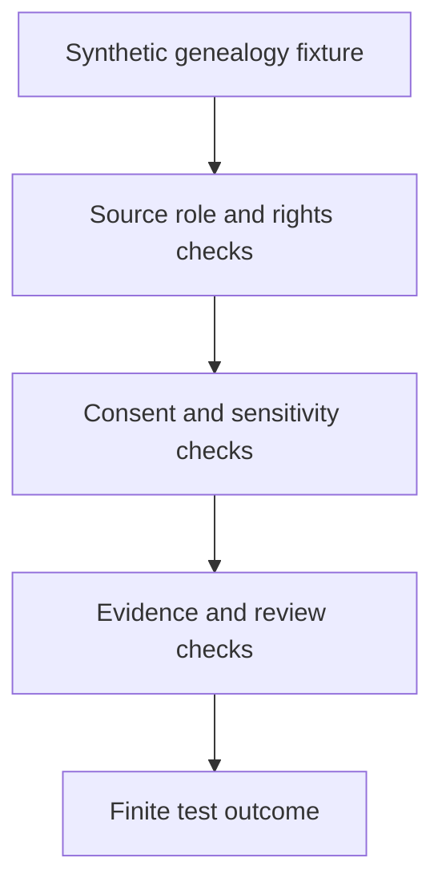

<!-- [KFM_META_BLOCK_V2]
doc_id: kfm://doc/tests-domains-people-dna-land-genealogy-readme
title: People DNA Land Genealogy Tests README
type: test-index-readme
version: v0.1
status: draft; directory-created-in-scratch; genealogy-test-index; PROPOSED / NEEDS VERIFICATION before promotion
owners:
  - OWNER_TBD - People DNA Land domain steward
  - OWNER_TBD - Genealogy steward
  - OWNER_TBD - Source steward
  - OWNER_TBD - Privacy steward
  - OWNER_TBD - Evidence steward
  - OWNER_TBD - Policy steward
  - OWNER_TBD - Release steward
  - OWNER_TBD - QA steward
created: 2026-07-06
updated: 2026-07-06
policy_label: public-doc; tests; people-dna-land; genealogy; parent-index; living-person-sensitive; dna-sensitive; source-role-gated; consent-gated; no-network; evidence-bound; policy-gated; release-gated; correction-aware; withdrawal-aware; rollback-aware
tags: [kfm, tests, people-dna-land, genealogy, person-assertion, family-relationship, relationship-hypothesis, gedcom, source-role, source-rights, consent, living-person, dna, land-relationship, EvidenceBundle, PolicyDecision, SourceIntakeRecord, ConsentRecord, ReleaseManifest, CorrectionNotice, WithdrawalNotice, RollbackCard, ABSTAIN, DENY, ERROR]
related:
  - ../../../README.md
  - ../../README.md
  - ../README.md
  - ../connectors/README.md
  - ../connectors/gedcom/README.md
  - ../gedcom_import_rights_test/README.md
  - ../contracts/README.md
  - ../contracts/person-assertion/README.md
  - ../consent/README.md
  - ../dna/README.md
  - ../dna/no-log/README.md
  - ../dna_consent_no_log_test/README.md
  - ../assessor_as_title_denial_test/README.md
  - ../chain_of_title_gap_test/README.md
  - ../../../../docs/domains/people-dna-land/
  - ../../../../contracts/domains/people-dna-land/
  - ../../../../schemas/contracts/v1/domains/people-dna-land/
  - ../../../../policy/domains/people-dna-land/
  - ../../../../fixtures/domains/people-dna-land/genealogy/
  - ../../../../fixtures/domains/people-dna-land/connectors/gedcom/
  - ../../../../data/registry/sources/people-dna-land/
  - ../../../../release/manifests/people-dna-land/
notes:
  - "This README replaces the placeholder content at tests/domains/people-dna-land/genealogy/README.md."
  - "Directory Rules place enforceability proof under tests/ and identify people-dna-land as a domain lane pattern."
  - "This is a genealogy test index only. It does not define genealogy doctrine, source descriptors, source-rights policy, consent policy, contracts, schemas, fixtures, EvidenceBundles, person registries, family graphs, release decisions, pipeline code, public API material, public map material, public tiles, or published artifacts."
  - "The tested parent invariant is that genealogy material remains source-scoped, evidence-bound, policy-gated assertion material; it is not canonical person truth, family relationship truth, living-person clearance, DNA clearance, land relationship truth, release approval, or publication."
  - "Default posture is deterministic and no-network. Real family trees, GEDCOM exports, genealogy provider records, living-person records, DNA data, consent records with real subject data, credentials, production logs, and public release artifacts do not belong in default genealogy tests."
[/KFM_META_BLOCK_V2] -->

<a id="top"></a>

# People DNA Land genealogy tests

> Parent index for deterministic, no-network genealogy guardrail tests in the People DNA Land domain. These tests should prove source-scoped person and relationship assertions without becoming genealogy truth, person registry authority, public family graph authority, or release authority.

<p>
  
  
  
  
  
  
</p>

**Path:** `tests/domains/people-dna-land/genealogy/README.md`  
**Status:** draft / directory-created-in-scratch / genealogy test parent index / PROPOSED until executable tests are verified  
**Owning root:** `tests/`  
**Domain segment:** `people-dna-land`  
**Test lane family:** `genealogy`  
**Default execution posture:** deterministic, synthetic, no-network, public-safe fixtures only  
**Truth posture:** CONFIRMED by Directory Rules that `tests/` is the canonical root for enforceability proof and that `people-dna-land` is a domain lane pattern; CONFIRMED current adjacent lanes exist at `tests/domains/people-dna-land/connectors/gedcom/README.md`, `tests/domains/people-dna-land/gedcom_import_rights_test/README.md`, `tests/domains/people-dna-land/contracts/person-assertion/README.md`, `tests/domains/people-dna-land/consent/README.md`, and `tests/domains/people-dna-land/dna/README.md`; CONFIRMED by attached doctrine that person assertions, genealogy, family relationships, DNA/genomics, living-person posture, rights, consent, source roles, evidence closure, review state, release state, correction, withdrawal, and rollback can block public exposure; NEEDS VERIFICATION for executable genealogy tests, accepted fixtures, contracts, schemas, source-role vocabulary, policy runtime, release integration, CI coverage, and pass rates.

---

## Purpose

`tests/domains/people-dna-land/genealogy/` is the parent test index for genealogy-related guardrails in the People DNA Land domain.

This subtree should prove that genealogy material stays source-scoped, evidence-bound, time-aware, rights-aware, consent-aware, policy-gated, reviewable, and release-gated. Person names, dates, places, family relationships, household groupings, GEDCOM imports, source notes, submitter claims, inferred relationships, DNA-adjacent assertions, and land-adjacent family claims must remain inspectable assertions until evidence, source role, policy, sensitivity, consent, review, release, correction, withdrawal, and rollback requirements support a narrower outcome.

A passing genealogy test should **not** mean that a person existed, a family relationship is true, a person is deceased, a living-person assertion is publishable, a DNA-derived relationship is allowed, a land association is title truth, a source is admitted, a consent record is valid, or a release is approved. It should mean only that the scoped genealogy guardrail behaved as expected against bounded synthetic fixtures and local files.

[Back to top](#top)

---

## Placement Basis

Directory Rules classify `tests/` as the root that proves rules are enforceable. They also require domain-specific material to appear as a segment inside the responsibility root, such as `tests/domains/<domain>/`, and list `people-dna-land` in the domain lane pattern.

This directory is therefore a **test lane family** for genealogy behavior only. Genealogy contracts belong under `contracts/`; machine shapes belong under `schemas/`; source identity and rights belong under `data/registry/sources/`; consent and exposure policy belong under `policy/`; reusable synthetic fixtures belong under the accepted fixture home; connector implementation belongs under `connectors/`; and release authority belongs under `release/`.

| Responsibility | Correct home | This lane family's relationship |
|---|---|---|
| Genealogy guardrail tests | `tests/domains/people-dna-land/genealogy/` | This directory. |
| GEDCOM connector tests | `tests/domains/people-dna-land/connectors/gedcom/` | Adjacent source-intake test lane. |
| GEDCOM import rights regression | `tests/domains/people-dna-land/gedcom_import_rights_test/` | Adjacent rights-specific regression lane. |
| Person assertion contract tests | `tests/domains/people-dna-land/contracts/person-assertion/` | Adjacent assertion-shape guardrail lane. |
| Consent tests | `tests/domains/people-dna-land/consent/` | Adjacent exposure-gate lane. |
| DNA tests | `tests/domains/people-dna-land/dna/` | Adjacent DNA-sensitive guardrail lane. |
| Reusable synthetic genealogy fixtures | `fixtures/domains/people-dna-land/genealogy/` | Preferred fixture home if populated. |
| Semantic contracts | `contracts/domains/people-dna-land/` | Defines object meaning, not owned here. |
| Machine schemas | `schemas/contracts/v1/domains/people-dna-land/` | Defines accepted shapes where available. |
| Policy rules | `policy/domains/people-dna-land/` | Decides allow, deny, restrict, abstain, redact, withdraw, and release behavior. |
| Source descriptors | `data/registry/sources/people-dna-land/` | Source identity, rights, role, caveats, consent obligations, and permitted claim types. |
| Release decisions | `release/` | Publication, correction, withdrawal, rollback, and cache invalidation authority. |

[Back to top](#top)

---

## Parent Invariant

> **Genealogy is assertion-first, not truth-first.** A genealogy source, import, family tree, relationship hint, note, or derived graph can support inspectable candidate assertions only within its source role, evidence, rights, consent, sensitivity, temporal, review, and release limits.

Core checks:

| Check | Required behavior | Failure outcome |
|---|---|---|
| Assertion-first posture | Person and relationship material remains source-scoped assertion material until evidence and review support a narrower claim. | validation failure / `ABSTAIN`. |
| Source-role support | Each genealogy fixture preserves source identity, source role, rights, caveats, and permitted claim type. | validation failure / `ABSTAIN`. |
| Rights and terms | Unknown, restricted, non-redistributable, attribution-required, or private-use-only material fails closed or preserves required metadata. | `ABSTAIN` / `DENY`. |
| Living-person posture | Living-person or possibly-living material fails closed without accepted policy and consent support. | `DENY` / `ABSTAIN`. |
| DNA boundary | DNA-linked or DNA-derived genealogy assertions deny or restrict by default unless policy supports a narrower outcome. | `DENY`. |
| Consent boundary | Required consent must be present, valid, in-scope, current, and not revoked before exposure. | `DENY` / `ABSTAIN`. |
| Relationship hypotheses | Parent, spouse, sibling, child, household, and kinship assertions remain hypotheses where evidence is incomplete or conflicted. | `ABSTAIN` / validation failure. |
| Place and land caution | Genealogy places do not become authoritative geocodes, landownership, title, parcel, or private-location claims. | validation failure / `ABSTAIN`. |
| Evidence boundary | EvidenceRef must resolve to appropriate EvidenceBundle support before consequential claims are answered or rendered as authoritative. | `ABSTAIN`. |
| Release boundary | Test success never becomes release approval, public family graph, public API payload, map label, tile, screenshot, correction, withdrawal, or rollback. | promotion block. |
| No network | Default tests do not call genealogy providers, DNA services, people-search services, geocoders, deed/title systems, or live source systems. | validation failure / `ERROR`. |

---

## Lane Index

| Lane | Status | Purpose | Boundary |
|---|---|---|---|
| `person-identity/` | PROPOSED | Would prove names, aliases, dates, and identity hints remain source-scoped assertions. | Does not define canonical person records. |
| `family-relationship/` | PROPOSED | Would prove parent, spouse, child, sibling, household, and kinship claims remain evidence-bound hypotheses unless supported. | Does not define relationship truth. |
| `source-role/` | PROPOSED | Would prove each genealogy source supports only its accepted claim types. | Source descriptors do not live here. |
| `living-person/` | PROPOSED | Would prove living-person or possibly-living genealogy material fails closed without policy and consent support. | Living-person policy does not live here. |
| `place-claim/` | PROPOSED | Would prove genealogy places do not become authoritative geocodes, parcel claims, or title claims. | GIS/geocoding and title authority do not live here. |
| `gedcom-crosswalk/` | PROPOSED | Would prove GEDCOM-like input maps to candidate assertions without bypassing rights, consent, or source-role gates. | GEDCOM connector implementation does not live here. |

The lanes above are backlog signposts, not claims of implementation. Confirmed adjacent coverage currently lives in `connectors/gedcom/`, `gedcom_import_rights_test/`, `contracts/person-assertion/`, `consent/`, and `dna/`.

[Back to top](#top)

---

## Genealogy Guardrail Flow



The diagram shows the expected responsibility order for tests in this directory. It does not prove that runtime pipelines, source registries, policies, schemas, validators, or CI jobs currently exist.

---

## Accepted Inputs

Only bounded, synthetic, reviewable inputs belong in this lane family:

- Synthetic person assertion fixtures with fake names, dates, places, and source references.
- Synthetic family relationship fixtures for parent, spouse, child, sibling, household, and kinship hypothesis cases.
- Synthetic source descriptor stubs with source role, rights, attribution, redistribution, and caveat fields.
- Synthetic consent states for living-person, DNA-adjacent, or private-family exposure cases.
- Synthetic GEDCOM-like snippets only when they are clearly fake and local.
- Synthetic EvidenceRef, EvidenceBundle stub, PolicyDecision, SourceIntakeRecord, ConsentRecord, ReleaseManifest, CorrectionNotice, WithdrawalNotice, and RollbackCard references.
- Canary strings that make accidental publication, logging, AI exposure, or source-payload echoing obvious.
- Local validation envelopes emitted by test helpers.

Safe outputs may include public-safe references and operational fields such as fixture ID, source descriptor ID, policy decision ID, relationship assertion ID, redaction reason code, validator name, finite outcome, schema/spec hash, and receipt reference.

> [!IMPORTANT]
> A genealogy fixture can carry a fake name or relationship for testing, but it must not normalize the idea that family-tree material is public truth. EvidenceBundle support, source role, consent, policy, review, release, correction, withdrawal, and rollback still control exposure.

---

## Exclusions

Do **not** place these materials in this lane family:

| Excluded material | Why it does not belong here | Correct direction |
|---|---|---|
| Real family trees, real GEDCOM exports, or real genealogy provider records | May contain living-person, family, source, rights, consent, and private-note data. | Use synthetic fixtures only. |
| Real people records, addresses, contacts, family links, notes, or private land associations | Living-person-sensitive and not needed for deterministic tests. | Use fake fixtures with explicit canaries. |
| Real DNA data, match lists, kit identifiers, segment data, or provider exports | DNA-sensitive and rights-sensitive. | Keep out of default tests. |
| Real consent records, signatures, subject identifiers, or withdrawal details | Consent payloads are not genealogy fixtures. | Accepted consent-record home after verification. |
| Live genealogy providers, DNA providers, people-search services, geocoders, deed systems, title systems, or assessor systems | Network, rights, consent, and authority uncertainty. | No-network fixtures or separately gated connector tests. |
| Credentials, tokens, cookies, API keys, or auth headers | Security exposure. | Secret manager or fake local test values only. |
| Source descriptors, source-rights policy, or consent policy | Authority does not live in tests. | `data/registry/sources/people-dna-land/` and `policy/`. |
| Genealogy connector implementation | Implementation does not live in this test index. | `connectors/people-dna-land/` or accepted connector home. |
| Semantic contracts or machine schemas | Meaning and shape do not live here. | `contracts/` and `schemas/`. |
| Public family graphs, public API payloads, public map artifacts, tiles, screenshots, release manifests, or published records | Publication requires governed release. | `release/`, governed APIs, and accepted map artifact homes. |

[Back to top](#top)

---

## Suggested Layout

```text
tests/domains/people-dna-land/genealogy/
|-- README.md
|-- person-identity/
|-- family-relationship/
|-- source-role/
|-- living-person/
|-- place-claim/
`-- gedcom-crosswalk/
```

This layout is **PROPOSED** until executable files or child README files exist in the repository.

---

## Run Posture

No executable runner was verified while authoring this README. Once tests exist, the expected local command should be documented and verified here.

```bash
: "PROPOSED / NEEDS VERIFICATION"
pytest tests/domains/people-dna-land/genealogy
```

Required run posture:

- no network access
- no real family trees or GEDCOM exports
- no real genealogy provider data
- no real living-person data
- no real DNA data
- no real consent payloads
- no credentials
- no production logs or telemetry
- no public artifact writes
- deterministic fixture inputs
- finite outcomes only: `PASS`, `DENY`, `ABSTAIN`, or `ERROR`

---

## Minimal Genealogy Fixture

Synthetic fixtures should make assertion boundaries inspectable without carrying real genealogy data.

```json
{
  "fixture_id": "people-dna-land-genealogy-example",
  "assertion_type": "parent_child_relationship",
  "source_descriptor_id": "source-descriptor-fixture-genealogy-001",
  "source_role": "genealogy_candidate",
  "living_person_state": "possibly_living",
  "rights_state": "redistribution_unknown",
  "expected_outcome": "ABSTAIN",
  "safe_result_fields": {
    "policy_decision_id": "policy-decision-fixture-001",
    "reason_code": "GENEALOGY_ASSERTION_NOT_PUBLICLY_SUPPORTABLE",
    "evidence_ref": "evidence-ref-fixture-001"
  },
  "must_not_publish": [
    "REAL_PERSON_CANARY",
    "LIVING_PERSON_CANARY",
    "PRIVATE_FAMILY_LINK_CANARY",
    "GEDCOM_NOTE_CANARY",
    "DNA_MATCH_CANARY",
    "CONSENT_PAYLOAD_CANARY"
  ]
}
```

The JSON above is illustrative. Accepted schema, field names, source-role vocabulary, relationship vocabulary, and fixture homes remain **NEEDS VERIFICATION**.

---

## Evidence Ledger

| Source | Status | Supports | Limits |
|---|---|---|---|
| `Directory Rules.pdf` | CONFIRMED | `tests/` is the canonical enforceability root; domain-specific materials appear as segments under responsibility roots; `people-dna-land` is a domain lane pattern. | Does not prove this genealogy lane has executable tests or accepted fixture shapes. |
| `KFM_Pass_20_Part_2_Idea_Index_Category_Atlas_and_Expansion_Dossier.md` | CONFIRMED synthesis / PROPOSED implementation pressure | Reiterates evidence-first, cite-or-abstain, fail-closed, source rights, assertion-first, living-person/DNA restriction, release, correction, and rollback posture. | Static synthesis does not prove current repository implementation. |
| `tests/domains/people-dna-land/connectors/gedcom/README.md` | CONFIRMED adjacent GEDCOM lane | Defines GEDCOM connector tests and the parse-success-is-not-truth boundary. | Does not prove executable genealogy tests. |
| `tests/domains/people-dna-land/gedcom_import_rights_test/README.md` | CONFIRMED adjacent rights regression | Defines a GEDCOM import rights gate and related source-role/rights boundaries. | Does not prove broader genealogy parent coverage. |
| `tests/domains/people-dna-land/contracts/person-assertion/README.md` | CONFIRMED adjacent contract lane | Defines PersonAssertion test posture as source-scoped, evidence-bound, time-aware, consent-aware, policy-gated, and release-gated. | Does not define genealogy lane fixtures or executable tests. |
| `tests/domains/people-dna-land/consent/README.md` | CONFIRMED adjacent parent index | Defines consent as an exposure gate, not truth, evidence closure, source admission, release approval, or publication. | Does not prove genealogy tests exist. |
| `tests/domains/people-dna-land/dna/README.md` | CONFIRMED adjacent parent index | Defines DNA-sensitive test posture and no-log adjacency. | Does not define genealogy relationship truth. |
| GitHub target file before update | CONFIRMED | `tests/domains/people-dna-land/genealogy/README.md` existed as placeholder content `y` before replacement. | Placeholder proves path existence only. |

---

## Validation Checklist

- [ ] Confirm or create executable genealogy test files under this lane family.
- [ ] Confirm accepted synthetic genealogy fixture home and fixture naming convention.
- [ ] Confirm accepted relationship assertion vocabulary and PersonAssertion/RelationshipAssertion-like contract names.
- [ ] Confirm accepted source descriptor shape, rights vocabulary, source-role vocabulary, and attribution fields.
- [ ] Confirm accepted consent-state vocabulary for living-person, DNA-adjacent, and private-family exposure cases.
- [ ] Add executable tests for person identity hints, family relationships, source-role limits, living-person status, DNA adjacency, place claims, and GEDCOM crosswalk behavior.
- [ ] Confirm tests assert no network access, credentials, real genealogy data, real GEDCOM exports, real people data, real DNA data, real consent data, production logs, or public artifact writes.
- [ ] Confirm genealogy outputs cannot bypass EvidenceBundle resolution, source admission, rights, consent, policy, review, release, correction, withdrawal, or rollback controls.
- [ ] Wire the lane family into CI only after executable tests and safe fixtures exist.

---

## Rollback

Rollback is required if this lane family starts to:

- store real family trees, GEDCOM exports, living-person data, DNA data, consent payloads, credentials, or production logs
- define genealogy truth, source-rights policy, consent policy, source descriptors, contracts, or schemas instead of testing them
- implement genealogy or GEDCOM connector behavior inside this README
- duplicate or override the `connectors/gedcom/`, `gedcom_import_rights_test/`, `contracts/person-assertion/`, `consent/`, or `dna/` lane authority
- treat family-tree material, relationship hints, parse success, tests, logs, AI output, public API payloads, map labels, tiles, or screenshots as sovereign truth
- bypass source admission, rights, consent, EvidenceBundle resolution, policy decisions, review state, release state, correction, withdrawal, or rollback controls
- weaken fail-closed behavior for living-person, DNA-sensitive, rights-uncertain, source-role-uncertain, or private-family material

Rollback target: restore the previous safe README revision or remove the genealogy parent lane until fixtures, contracts, source-role handling, consent behavior, policy behavior, and CI integration are reverified.

[Back to top](#top)