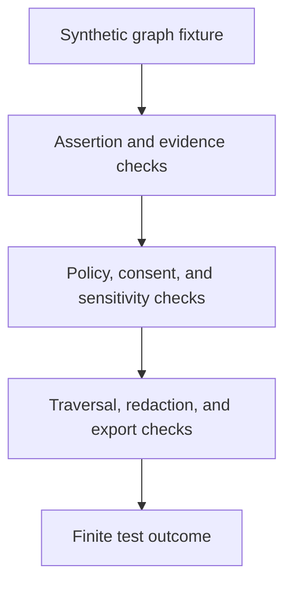

<!-- [KFM_META_BLOCK_V2]
doc_id: kfm://doc/tests-domains-people-dna-land-graph-readme
title: People DNA Land Graph Tests README
type: test-index-readme
version: v0.1
status: draft; directory-created-in-scratch; graph-test-index; PROPOSED / NEEDS VERIFICATION before promotion
owners:
  - OWNER_TBD - People DNA Land domain steward
  - OWNER_TBD - Graph steward
  - OWNER_TBD - Genealogy steward
  - OWNER_TBD - Privacy steward
  - OWNER_TBD - Evidence steward
  - OWNER_TBD - Policy steward
  - OWNER_TBD - Release steward
  - OWNER_TBD - QA steward
created: 2026-07-06
updated: 2026-07-06
policy_label: public-doc; tests; people-dna-land; graph; parent-index; relationship-graph; living-person-sensitive; dna-sensitive; land-sensitive; inference-risk; no-network; evidence-bound; policy-gated; release-gated; rollback-aware
tags: [kfm, tests, people-dna-land, graph, graph-projection, relationship-graph, genealogy, person-assertion, family-relationship, dna, consent, living-person, land-relationship, inference-risk, EvidenceBundle, PolicyDecision, ReleaseManifest, RedactionReceipt, CorrectionNotice, WithdrawalNotice, RollbackCard, ABSTAIN, DENY, ERROR]
related:
  - ../../../README.md
  - ../../README.md
  - ../README.md
  - safety/README.md
  - ../genealogy/README.md
  - ../contracts/README.md
  - ../contracts/person-assertion/README.md
  - ../consent/README.md
  - ../dna/README.md
  - ../dna/no-log/README.md
  - ../dna_consent_no_log_test/README.md
  - ../gedcom_import_rights_test/README.md
  - ../connectors/gedcom/README.md
  - ../../../../docs/domains/people-dna-land/
  - ../../../../contracts/domains/people-dna-land/
  - ../../../../schemas/contracts/v1/domains/people-dna-land/
  - ../../../../policy/domains/people-dna-land/
  - ../../../../fixtures/domains/people-dna-land/graph/
  - ../../../../data/registry/sources/people-dna-land/
  - ../../../../release/manifests/people-dna-land/
notes:
  - "This README replaces the placeholder content at tests/domains/people-dna-land/graph/README.md."
  - "Directory Rules place enforceability proof under tests/ and identify people-dna-land as a domain lane pattern."
  - "This is a graph test index only. It does not define graph storage, graph schema, graph algorithms, graph API contracts, genealogy doctrine, source descriptors, consent policy, EvidenceBundles, release decisions, public API material, public map material, public tiles, or published artifacts."
  - "The confirmed child lane at authoring time is safety/README.md. Other child lanes listed here are PROPOSED until corresponding files and executable tests are verified."
  - "The tested parent invariant is that graph projections remain downstream carriers of governed assertions; they are not identity truth, family truth, DNA truth, land/title truth, source authority, policy approval, release approval, or AI truth."
  - "Default posture is deterministic and no-network. Real people graphs, family trees, GEDCOM exports, DNA graphs, landowner graphs, social graphs, source exports, credentials, production logs, and public release artifacts do not belong in default graph tests."
[/KFM_META_BLOCK_V2] -->

<a id="top"></a>

# People DNA Land graph tests

> Parent index for deterministic, no-network graph guardrail tests in the People DNA Land domain. These tests should prove that graph projections, nodes, edges, paths, neighborhoods, exports, summaries, and AI context stay downstream of evidence, consent, policy, review, release, correction, withdrawal, and rollback controls.

<p>
  
  
  
  
  
  
</p>

**Path:** `tests/domains/people-dna-land/graph/README.md`  
**Status:** draft / directory-created-in-scratch / graph test parent index / PROPOSED until executable tests are verified  
**Owning root:** `tests/`  
**Domain segment:** `people-dna-land`  
**Test lane family:** `graph`  
**Default execution posture:** deterministic, synthetic, no-network, public-safe fixtures only  
**Truth posture:** CONFIRMED by Directory Rules that `tests/` is the canonical root for enforceability proof and that `people-dna-land` is a domain lane pattern; CONFIRMED by attached doctrine that maps, tiles, graphs, AI answers, summaries, scenes, dashboards, indexes, and planning views are downstream carriers of evidence, not sovereign truth; CONFIRMED current child lane exists at `tests/domains/people-dna-land/graph/safety/README.md`; NEEDS VERIFICATION for executable graph tests, accepted graph fixture shape, graph projection contracts, traversal envelopes, redaction transforms, policy runtime, release integration, CI coverage, and pass rates.

---

## Purpose

`tests/domains/people-dna-land/graph/` is the parent test index for graph-related guardrails in the People DNA Land domain.

This subtree should prove that graph material remains a derivative representation of governed assertions, not a root authority. Person nodes, relationship edges, family paths, DNA-adjacent links, consent-linked exposure states, source-role connections, land-adjacent associations, clusters, ranks, graph exports, graph-derived AI context, and graph summaries must remain evidence-bound, policy-gated, reviewable, redaction-aware, release-gated, correction-aware, withdrawal-aware, and rollback-aware.

A passing graph test should **not** mean that a graph is complete, a person exists, a family relationship is true, a person is deceased, a DNA-derived link is allowed, a consent record is valid, a land relationship is title truth, a source is admitted, an AI summary is authoritative, or a release is approved. It should mean only that the scoped graph guardrail behaved as expected against bounded synthetic fixtures and local files.

[Back to top](#top)

---

## Placement Basis

Directory Rules classify `tests/` as the root that proves rules are enforceable. They also require domain-specific material to appear as a segment inside the responsibility root, such as `tests/domains/<domain>/`, and list `people-dna-land` in the domain lane pattern.

This directory is therefore a **test lane family** for graph behavior only. Graph storage, graph algorithms, graph contracts, graph schemas, source descriptors, policy rules, reusable fixtures, and release authority belong in their own responsibility roots.

| Responsibility | Correct home | This lane family's relationship |
|---|---|---|
| People DNA Land graph guardrail tests | `tests/domains/people-dna-land/graph/` | This directory. |
| Graph safety tests | `tests/domains/people-dna-land/graph/safety/` | Confirmed child lane. |
| Genealogy tests | `tests/domains/people-dna-land/genealogy/` | Adjacent assertion-first relationship guardrails. |
| Person assertion tests | `tests/domains/people-dna-land/contracts/person-assertion/` | Adjacent assertion-shape guardrails. |
| Consent tests | `tests/domains/people-dna-land/consent/` | Adjacent exposure-gate guardrails. |
| DNA tests | `tests/domains/people-dna-land/dna/` | Adjacent DNA-sensitive guardrails. |
| Reusable synthetic graph fixtures | `fixtures/domains/people-dna-land/graph/` | Preferred fixture home if populated. |
| Semantic contracts | `contracts/domains/people-dna-land/` | Defines object meaning, not owned here. |
| Machine schemas | `schemas/contracts/v1/domains/people-dna-land/` | Defines accepted shapes where available. |
| Policy rules | `policy/domains/people-dna-land/` | Decides allow, deny, restrict, abstain, redact, withdraw, and release behavior. |
| Source descriptors | `data/registry/sources/people-dna-land/` | Source identity, rights, role, caveats, consent obligations, and permitted claim types. |
| Release decisions | `release/` | Publication, correction, withdrawal, rollback, and cache invalidation authority. |

[Back to top](#top)

---

## Parent Invariant

> **Graph projections are downstream carriers, not truth.** A node, edge, path, cluster, traversal, embedding, export, map label, AI context packet, or summary can only carry governed assertion material within evidence, source-role, sensitivity, consent, policy, review, release, correction, withdrawal, and rollback limits.

Core checks:

| Check | Required behavior | Failure outcome |
|---|---|---|
| Projection boundary | Graph nodes and edges remain projections of governed assertions, not canonical person or relationship records. | validation failure / `ABSTAIN`. |
| Evidence boundary | Consequential graph output requires EvidenceRef-to-EvidenceBundle support before authoritative display or export. | `ABSTAIN`. |
| Source-role boundary | Edges, labels, ranks, and summaries express only what the source role permits. | validation failure / `ABSTAIN`. |
| Living-person boundary | Living-person or possibly-living nodes, edges, paths, and neighborhoods fail closed without policy and consent support. | `DENY` / `ABSTAIN`. |
| DNA boundary | DNA-linked or DNA-derived graph material denies or restricts by default unless policy supports a narrower outcome. | `DENY`. |
| Consent boundary | Missing, revoked, expired, disputed, stale, or scope-mismatched consent blocks affected graph exposure. | `DENY` / `ABSTAIN`. |
| Inference boundary | Paths, neighborhoods, counts, ordering, ranks, clusters, recommendations, and embeddings do not reveal sensitive relationships by implication. | `DENY` / validation failure. |
| Land/title boundary | Person-to-land and family-to-land graph links do not become owner, parcel, deed, title, residence, or private-location truth. | validation failure / `ABSTAIN`. |
| Redaction boundary | Redacted nodes and edges do not leak through IDs, counts, debug fields, labels, exports, screenshots, prompts, or summaries. | test failure / security review. |
| Release boundary | Test success never becomes release approval, public graph, public API payload, map layer, tile, screenshot, correction, withdrawal, or rollback. | promotion block. |
| No-network boundary | Default graph tests do not call graph databases, genealogy providers, DNA services, people-search services, geocoders, deed/title systems, or live source systems. | validation failure / `ERROR`. |

---

## Lane Index

| Lane | Status | Purpose | Boundary |
|---|---|---|---|
| [`safety/`](safety/README.md) | CONFIRMED README / executable tests NEEDS VERIFICATION | Proves graph-specific safety checks for downstream posture, evidence, source role, living-person/DNA/consent sensitivity, inference leakage, redaction integrity, AI context, export, and release boundaries. | Does not define graph storage, graph API contracts, graph schemas, graph algorithms, policy, or release authority. |
| `projection/` | PROPOSED | Would prove graph projections are rebuilt from governed assertions and do not become canonical records. | Projection recipes and manifests do not live here. |
| `traversal/` | PROPOSED | Would prove path, neighborhood, rank, cluster, and recommendation outputs do not infer or expose sensitive relationships. | Graph algorithms do not live here. |
| `redaction/` | PROPOSED | Would prove withheld graph material cannot leak through labels, IDs, counts, ordering, screenshots, exports, or debug fields. | Redaction policy and runtime transforms do not live here. |
| `export/` | PROPOSED | Would prove graph exports require evidence, policy, review, release, correction, withdrawal, and rollback support. | Public export authority does not live here. |
| `ai-boundary/` | PROPOSED | Would prove graph-derived prompts, embeddings, summaries, and Focus Mode context stay policy-safe and evidence-bound. | AI runtime and prompt contracts do not live here. |
| `rollback/` | PROPOSED | Would prove graph projections and caches are invalidated or withdrawn when source, evidence, policy, consent, correction, withdrawal, or release state changes. | Release and rollback manifests do not live here. |

Only `safety/` was confirmed as an authored child README when this parent index was created. The other lanes are backlog signposts, not claims of implementation.

[Back to top](#top)

---

## Graph Guardrail Flow



The diagram shows the expected responsibility order for tests in this directory. It does not prove that runtime graph storage, graph APIs, graph schemas, projection manifests, policies, validators, redaction transforms, release jobs, or CI jobs currently exist.

---

## Accepted Inputs

Only bounded, synthetic, reviewable inputs belong in this lane family:

- Synthetic graph fixtures with fake node IDs, edge IDs, path IDs, labels, relationship types, and source references.
- Synthetic person assertion, relationship assertion, genealogy, DNA-adjacent, consent, source-role, evidence, and land-adjacent assertion stubs.
- Synthetic graph projection manifests, traversal requests, neighborhood queries, ranking outputs, cluster outputs, export requests, and AI-context envelopes.
- Synthetic redaction receipts and policy decisions for withheld nodes, edges, labels, tooltips, paths, neighborhoods, embeddings, screenshots, and exports.
- Synthetic EvidenceRef, EvidenceBundle stub, PolicyDecision, ConsentRecord, RedactionReceipt, ReleaseManifest, CorrectionNotice, WithdrawalNotice, and RollbackCard references.
- Canary values that make accidental leakage through labels, IDs, counts, ordering, prompts, embeddings, screenshots, exports, summaries, logs, or debug fields obvious.
- Local validation envelopes emitted by test helpers.

Safe outputs may include public-safe references and operational fields such as fixture ID, graph fixture ID, graph projection ID, node class, edge class, policy decision ID, redaction reason code, validator name, finite outcome, schema/spec hash, and receipt reference.

> [!IMPORTANT]
> Graph tests are especially sensitive because graphs can expose relationships without naming them directly. Tests should check direct payloads and indirect leakage through structure, traversal, counts, ordering, identifiers, neighborhoods, embeddings, screenshots, exports, and summaries.

---

## Exclusions

Do **not** place these materials in this lane family:

| Excluded material | Why it does not belong here | Correct direction |
|---|---|---|
| Real family graphs, people graphs, social graphs, GEDCOM exports, DNA graphs, or landowner graphs | May expose living-person, DNA, consent, source, family, and land-sensitive relationships. | Use synthetic fixtures only. |
| Real people records, family links, household links, addresses, contacts, residences, or private land associations | Living-person-sensitive and not needed for deterministic tests. | Use fake fixtures with explicit canaries. |
| Real DNA data, match lists, kit identifiers, segment data, or provider exports | DNA-sensitive and graph-inference-sensitive. | Keep out of default tests. |
| Real consent records, signatures, subject identifiers, or withdrawal details | Consent payloads are not graph test fixtures. | Accepted consent-record home after verification. |
| Graph databases, graph migrations, graph algorithms, or projection implementation code | Implementation and migration authority do not live in this README. | Accepted package, data, migration, runtime, or graph implementation homes. |
| Live graph APIs, genealogy providers, DNA providers, people-search services, geocoders, deed systems, title systems, or assessor systems | Network, rights, consent, and authority uncertainty. | No-network fixtures or separately gated connector/API tests. |
| Credentials, tokens, cookies, API keys, or auth headers | Security exposure. | Secret manager or fake local test values only. |
| Public graph exports, public API payloads, map artifacts, tiles, screenshots, release manifests, or published records | Publication requires governed release. | `release/`, governed APIs, and accepted artifact homes. |
| Graph contracts, graph schemas, source descriptors, consent policy, graph policy, or release policy | Authority does not live in tests. | `contracts/`, `schemas/`, `data/registry/sources/`, `policy/`, and `release/`. |

[Back to top](#top)

---

## Suggested Layout

```text
tests/domains/people-dna-land/graph/
|-- README.md
|-- safety/
|   `-- README.md
|-- projection/
|-- traversal/
|-- redaction/
|-- export/
|-- ai-boundary/
`-- rollback/
```

Only `safety/` is confirmed as an authored child lane at the time this README was created. Other directories are **PROPOSED** until files and executable tests exist.

---

## Run Posture

No executable runner was verified while authoring this README. Once tests exist, the expected local command should be documented and verified here.

```bash
: "PROPOSED / NEEDS VERIFICATION"
pytest tests/domains/people-dna-land/graph
```

Required run posture:

- no network access
- no real family graphs or people graphs
- no real living-person data
- no real DNA data
- no real consent payloads
- no credentials
- no production logs or telemetry
- no public graph exports or artifact writes
- deterministic fixture inputs
- finite outcomes only: `PASS`, `DENY`, `ABSTAIN`, or `ERROR`

---

## Minimal Graph Fixture

Synthetic fixtures should make graph behavior inspectable without carrying real relationship data.

```json
{
  "fixture_id": "people-dna-land-graph-parent-example",
  "graph_fixture_id": "graph-fixture-parent-001",
  "projection_role": "derived_relationship_carrier",
  "node_classes": ["person_assertion"],
  "edge_classes": ["relationship_hypothesis"],
  "sensitivity": ["possibly_living", "private_family_link"],
  "expected_outcome": "ABSTAIN",
  "safe_result_fields": {
    "policy_decision_id": "policy-decision-fixture-graph-parent-001",
    "reason_code": "GRAPH_PROJECTION_NOT_PUBLIC_AUTHORITY",
    "redaction_receipt_ref": "redaction-receipt-fixture-graph-parent-001"
  },
  "must_not_expose": [
    "REAL_PERSON_NODE_CANARY",
    "PRIVATE_EDGE_CANARY",
    "SENSITIVE_PATH_CANARY",
    "DNA_RELATIONSHIP_CANARY",
    "CONSENT_PAYLOAD_CANARY",
    "LAND_ASSOCIATION_CANARY"
  ]
}
```

The JSON above is illustrative. Accepted schema, field names, graph vocabulary, sensitivity labels, projection labels, and fixture homes remain **NEEDS VERIFICATION**.

---

## Evidence Ledger

| Source | Status | Supports | Limits |
|---|---|---|---|
| `Directory Rules.pdf` | CONFIRMED | `tests/` is the canonical enforceability root; domain-specific materials appear as segments under responsibility roots; `people-dna-land` is a domain lane pattern. | Does not prove this graph lane has executable tests or accepted fixture shapes. |
| `KFM_Pass_20_Part_2_Idea_Index_Category_Atlas_and_Expansion_Dossier.md` | CONFIRMED synthesis / PROPOSED implementation pressure | States that maps, tiles, graphs, AI answers, summaries, scenes, dashboards, indexes, and planning views are downstream carriers of evidence, not sovereign truth; reiterates EvidenceBundle, source-role, policy, living-person/DNA restriction, release, correction, and rollback posture. | Static synthesis does not prove current repository implementation. |
| `Unified Implementation Architecture Build Manual.md` | CONFIRMED doctrine | Supports evidence hierarchy, downstream graph posture, governed public routes, deny-by-default deployment, and exclusion of raw sensitive evidence from logs. | Does not prove current graph implementation, graph APIs, policy runtime, CI, or pass rates. |
| `tests/domains/people-dna-land/graph/safety/README.md` | CONFIRMED child lane README | Defines graph safety guardrails for downstream posture, inference, redaction, AI/export boundary, and release boundary. | Does not prove executable graph safety tests exist. |
| `tests/domains/people-dna-land/genealogy/README.md` | CONFIRMED adjacent parent index | Defines genealogy as assertion-first, source-scoped, evidence-bound, rights-aware, consent-aware, policy-gated, and release-gated. | Does not define graph projection behavior. |
| `tests/domains/people-dna-land/contracts/person-assertion/README.md` | CONFIRMED adjacent contract lane | Defines PersonAssertion test posture as source-scoped, evidence-bound, time-aware, consent-aware, policy-gated, and release-gated. | Does not define graph envelopes or traversal behavior. |
| `tests/domains/people-dna-land/dna/README.md` | CONFIRMED adjacent parent index | Defines DNA-sensitive test posture and no-log adjacency. | Does not define graph tests. |
| GitHub target file before update | CONFIRMED | `tests/domains/people-dna-land/graph/README.md` existed as placeholder content `y` before replacement. | Placeholder proves path existence only. |

---

## Validation Checklist

- [ ] Confirm accepted synthetic graph fixture home and fixture naming convention.
- [ ] Confirm accepted graph projection, node, edge, path, neighborhood, export, embedding, screenshot, and summary envelope shapes.
- [ ] Confirm accepted graph safety policy outcomes for living-person, DNA, consent, private-family, source-role, land-association, traversal, export, and AI-context cases.
- [ ] Add executable tests under `safety/` before promoting the lane from documentation to enforceability proof.
- [ ] Add future graph lanes only after their semantic contract, schema, fixture posture, policy expectations, evidence expectations, release relationship, correction path, withdrawal path, and rollback target are explicit.
- [ ] Confirm tests assert no network access, credentials, real graph data, real people data, real DNA data, real consent data, production logs, or public artifact writes.
- [ ] Confirm graph outputs cannot bypass EvidenceBundle resolution, source admission, rights, consent, policy, review, release, correction, withdrawal, or rollback controls.
- [ ] Wire the lane into CI only after executable tests and safe fixtures exist.

---

## Rollback

Rollback is required if this lane starts to:

- store real people graphs, family graphs, DNA graphs, landowner graphs, consent payloads, credentials, or production logs
- define graph truth, graph storage, graph schemas, graph algorithms, graph policy, source descriptors, consent policy, contracts, or release authority instead of testing them
- implement graph APIs, graph databases, graph migrations, graph projections, or graph exports inside this README
- treat graph nodes, edges, paths, clusters, embeddings, screenshots, map labels, AI output, public API payloads, exports, or tests as sovereign truth
- bypass source admission, rights, consent, EvidenceBundle resolution, policy decisions, review state, release state, correction, withdrawal, or rollback controls
- weaken fail-closed behavior for living-person, DNA-sensitive, consent-sensitive, rights-uncertain, source-role-uncertain, private-family, inference-sensitive, or land-sensitive material

Rollback target: restore the previous safe README revision or remove the graph parent lane until fixtures, graph envelopes, source-role handling, consent behavior, policy behavior, redaction behavior, export behavior, rollback behavior, and CI integration are reverified.

[Back to top](#top)