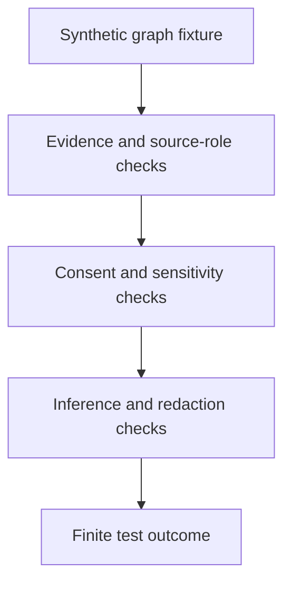

<!-- [KFM_META_BLOCK_V2]
doc_id: kfm://doc/tests-domains-people-dna-land-graph-safety-readme
title: People DNA Land Graph Safety Tests README
type: test-lane-readme
version: v0.1
status: draft; directory-created-in-scratch; graph-safety-test-lane; PROPOSED / NEEDS VERIFICATION before promotion
owners:
  - OWNER_TBD - People DNA Land domain steward
  - OWNER_TBD - Graph steward
  - OWNER_TBD - Genealogy steward
  - OWNER_TBD - Privacy steward
  - OWNER_TBD - Evidence steward
  - OWNER_TBD - Policy steward
  - OWNER_TBD - Security steward
  - OWNER_TBD - Release steward
  - OWNER_TBD - QA steward
created: 2026-07-06
updated: 2026-07-06
policy_label: public-doc; tests; people-dna-land; graph; safety; relationship-graph; living-person-sensitive; dna-sensitive; land-sensitive; inference-risk; no-network; evidence-bound; policy-gated; release-gated; rollback-aware
tags: [kfm, tests, people-dna-land, graph, safety, relationship-graph, person-assertion, family-relationship, genealogy, dna, consent, living-person, land-relationship, inference-risk, EvidenceBundle, PolicyDecision, ReleaseManifest, RedactionReceipt, CorrectionNotice, WithdrawalNotice, RollbackCard, ABSTAIN, DENY, ERROR]
related:
  - ../../../../README.md
  - ../../../README.md
  - ../../README.md
  - ../README.md
  - ../../genealogy/README.md
  - ../../contracts/README.md
  - ../../contracts/person-assertion/README.md
  - ../../consent/README.md
  - ../../dna/README.md
  - ../../dna/no-log/README.md
  - ../../dna_consent_no_log_test/README.md
  - ../../gedcom_import_rights_test/README.md
  - ../../connectors/gedcom/README.md
  - ../../../../../docs/domains/people-dna-land/
  - ../../../../../contracts/domains/people-dna-land/
  - ../../../../../schemas/contracts/v1/domains/people-dna-land/
  - ../../../../../policy/domains/people-dna-land/
  - ../../../../../fixtures/domains/people-dna-land/graph/safety/
  - ../../../../../data/registry/sources/people-dna-land/
  - ../../../../../release/manifests/people-dna-land/
notes:
  - "This README replaces the placeholder content at tests/domains/people-dna-land/graph/safety/README.md."
  - "The parent file at tests/domains/people-dna-land/graph/README.md was observed as placeholder content in GitHub when this README was authored; parent graph-lane guidance remains NEEDS VERIFICATION."
  - "Directory Rules place enforceability proof under tests/ and identify people-dna-land as a domain lane pattern."
  - "This is a graph safety test lane only. It does not define graph storage, graph schema, graph algorithms, graph API contracts, genealogy doctrine, source descriptors, consent policy, EvidenceBundles, release decisions, public API material, public map material, public tiles, or published artifacts."
  - "The tested invariant is that graph projections remain downstream, evidence-bound, policy-gated carriers; nodes, edges, neighborhoods, traversals, exports, embeddings, and summaries must not become root truth or leak living-person, DNA, consent, private-family, source-payload, or land-sensitive relationships."
  - "Default posture is deterministic and no-network. Real people graphs, family trees, GEDCOM exports, DNA graphs, landowner graphs, social graphs, source exports, credentials, production logs, and public release artifacts do not belong in default graph safety tests."
[/KFM_META_BLOCK_V2] -->

<a id="top"></a>

# People DNA Land graph safety tests

> Test lane for proving that People DNA Land graph projections stay downstream, evidence-bound, policy-gated, redaction-aware, and inference-safe instead of becoming person truth, family truth, DNA truth, land truth, or public relationship authority.

<p>
  
  
  
  
  
  
</p>

**Path:** `tests/domains/people-dna-land/graph/safety/README.md`  
**Status:** draft / directory-created-in-scratch / graph safety test lane / PROPOSED until executable tests are verified  
**Owning root:** `tests/`  
**Domain segment:** `people-dna-land`  
**Test lane family:** `graph/safety`  
**Default execution posture:** deterministic, synthetic, no-network, public-safe fixtures only  
**Truth posture:** CONFIRMED by Directory Rules that `tests/` is the canonical root for enforceability proof and that `people-dna-land` is a domain lane pattern; CONFIRMED by attached doctrine that maps, tiles, graphs, AI answers, summaries, scenes, dashboards, indexes, and planning views are downstream carriers of evidence, not sovereign truth; CONFIRMED by adjacent People DNA Land READMEs that genealogy, person assertions, DNA, consent, GEDCOM import rights, and no-log behavior are sensitive guardrail families; CONFIRMED current target and parent graph README existed in GitHub as placeholder content before this README; NEEDS VERIFICATION for executable graph safety tests, accepted graph fixture shape, graph API/envelope contracts, policy runtime, redaction transforms, release integration, CI coverage, and pass rates.

---

## Purpose

`tests/domains/people-dna-land/graph/safety/` is the test lane for graph-specific safety checks in the People DNA Land domain.

This lane should prove that graph representations of people, genealogy, DNA-adjacent relationships, consent state, source-role connections, land-adjacent assertions, and evidence references stay downstream of the KFM trust membrane. A graph can help inspect relationships, but it must not become the authority for identity, kinship, household membership, DNA relationship, land association, source admission, policy approval, or public release.

A passing graph safety test should **not** mean that a graph is complete, a person exists, a family relationship is true, a person is deceased, a DNA-derived edge is allowed, a living-person node is publishable, a private land association is safe to show, a source is admitted, or a release is approved. It should mean only that the scoped graph guardrail behaved as expected against bounded synthetic fixtures and local files.

[Back to top](#top)

---

## Placement Basis

Directory Rules classify `tests/` as the root that proves rules are enforceable. They also require domain-specific material to appear as a segment inside the responsibility root, such as `tests/domains/<domain>/`, and list `people-dna-land` in the domain lane pattern.

This directory is therefore a **test lane** for graph safety only. Graph storage, graph schemas, graph algorithms, graph projections, graph API contracts, source descriptors, consent policy, semantic contracts, machine schemas, reusable fixtures, and release authority belong in their own responsibility roots.

| Responsibility | Correct home | This lane's relationship |
|---|---|---|
| People DNA Land graph safety tests | `tests/domains/people-dna-land/graph/safety/` | This directory. |
| Parent graph test index | `tests/domains/people-dna-land/graph/` | Placeholder observed; NEEDS VERIFICATION before relying on parent guidance. |
| Reusable synthetic graph fixtures | `fixtures/domains/people-dna-land/graph/safety/` | Preferred fixture home if populated. |
| Genealogy tests | `tests/domains/people-dna-land/genealogy/` | Adjacent assertion-first relationship guardrails. |
| Person assertion tests | `tests/domains/people-dna-land/contracts/person-assertion/` | Adjacent assertion-shape guardrails. |
| Consent tests | `tests/domains/people-dna-land/consent/` | Adjacent exposure-gate guardrails. |
| DNA tests | `tests/domains/people-dna-land/dna/` | Adjacent DNA-sensitive guardrails. |
| Source descriptors | `data/registry/sources/people-dna-land/` | Source identity, rights, role, caveats, consent obligations, and permitted claim types. |
| Semantic contracts | `contracts/domains/people-dna-land/` | Defines object meaning, not owned here. |
| Machine schemas | `schemas/contracts/v1/domains/people-dna-land/` | Defines accepted shapes where available. |
| Policy rules | `policy/domains/people-dna-land/` | Decides allow, deny, restrict, abstain, redact, withdraw, and release behavior. |
| Release decisions | `release/` | Publication, correction, withdrawal, rollback, and cache invalidation authority. |

[Back to top](#top)

---

## Invariant Under Test

> **A graph edge is not a claim until evidence, policy, review, and release say so.** Nodes, edges, paths, neighborhoods, ranks, clusters, embeddings, exports, and summaries are derivative carriers. They must preserve evidence, source role, sensitivity, consent, review, release, correction, withdrawal, and rollback constraints before any public or semi-public exposure.

Core checks:

| Check | Required behavior | Failure outcome |
|---|---|---|
| Downstream graph posture | Graph nodes and edges are projections of governed assertions, not canonical truth. | validation failure / `ABSTAIN`. |
| Evidence support | Consequential graph edges require EvidenceRef-to-EvidenceBundle support before authoritative display. | `ABSTAIN`. |
| Source-role limits | Edges and labels only express what the source role permits. | validation failure / `ABSTAIN`. |
| Living-person safety | Living-person or possibly-living nodes and neighborhoods fail closed without policy and consent support. | `DENY` / `ABSTAIN`. |
| DNA edge safety | DNA-linked or DNA-derived edges deny or restrict by default unless policy supports a narrower outcome. | `DENY`. |
| Consent safety | Missing, revoked, expired, disputed, stale, or scope-mismatched consent blocks exposure of affected graph material. | `DENY` / `ABSTAIN`. |
| Inference safety | Path, neighborhood, degree, cluster, rank, centrality, and recommendation outputs do not reveal sensitive relationships by implication. | `DENY` / validation failure. |
| Land association safety | Family-land, owner-like, parcel-like, title-like, or private-location graph edges do not become land or title truth. | validation failure / `ABSTAIN`. |
| Redaction integrity | Redacted nodes, edges, labels, tooltips, exports, and summaries do not leak through counts, IDs, ordering, paths, or debug fields. | test failure / security review. |
| AI and export boundary | Graph-derived AI context, embeddings, vector indexes, downloads, screenshots, and summaries remain policy-safe and evidence-bound. | `DENY` / `ABSTAIN` / `ERROR`. |
| Release boundary | Test success never becomes release approval, public graph, public API payload, map label, tile, screenshot, correction, withdrawal, or rollback. | promotion block. |

---

## Graph Safety Flow



The diagram describes the intended safety flow only. It does not prove that graph storage, graph APIs, graph projections, policies, schemas, validators, redaction transforms, or CI jobs currently exist.

---

## Accepted Inputs

Only bounded, synthetic, reviewable inputs belong in this lane:

- Synthetic graph fixtures with fake node IDs, edge IDs, labels, relationship types, and source references.
- Synthetic person, relationship, genealogy, DNA-adjacent, consent, source-role, evidence, and land-adjacent assertion stubs.
- Synthetic redaction receipts and policy decisions for withheld nodes, edges, neighborhoods, labels, and exports.
- Synthetic graph traversal requests, neighborhood queries, ranking outputs, cluster outputs, and export requests.
- Synthetic EvidenceRef, EvidenceBundle stub, PolicyDecision, ConsentRecord, RedactionReceipt, ReleaseManifest, CorrectionNotice, WithdrawalNotice, and RollbackCard references.
- Canary values that make leakage through labels, IDs, debug fields, prompts, embeddings, exports, screenshots, or summaries obvious.
- Local validation envelopes emitted by test helpers.

Safe outputs may include public-safe references and operational fields such as fixture ID, graph fixture ID, node class, edge class, policy decision ID, redaction reason code, validator name, finite outcome, schema/spec hash, and receipt reference.

> [!IMPORTANT]
> A graph can make hidden relationships easy to infer. Graph safety tests should check direct payloads and indirect leakage through traversal, counts, ordering, identifiers, neighborhoods, embeddings, screenshots, summaries, and exports.

---

## Exclusions

Do **not** place these materials in this lane:

| Excluded material | Why it does not belong here | Correct direction |
|---|---|---|
| Real family graphs, social graphs, GEDCOM exports, people graphs, DNA graphs, or landowner graphs | May expose living-person, DNA, consent, source, family, and land-sensitive relationships. | Use synthetic fixtures only. |
| Real people records, family links, household links, addresses, contacts, or private land associations | Living-person-sensitive and not needed for deterministic tests. | Use fake fixtures with explicit canaries. |
| Real DNA data, match lists, kit identifiers, segment data, or provider exports | DNA-sensitive and graph-inference-sensitive. | Keep out of default tests. |
| Real consent records, signatures, subject identifiers, or withdrawal details | Consent payloads are not graph safety fixtures. | Accepted consent-record home after verification. |
| Graph storage, graph databases, graph migrations, or graph algorithms | Implementation and migration authority do not live in this README. | Accepted package, data, migration, runtime, or graph implementation homes. |
| Live graph APIs, genealogy providers, DNA providers, people-search services, geocoders, deed systems, title systems, or assessor systems | Network, rights, consent, and authority uncertainty. | No-network fixtures or separately gated connector/API tests. |
| Credentials, tokens, cookies, API keys, or auth headers | Security exposure. | Secret manager or fake local test values only. |
| Public API payloads, graph exports, map artifacts, tiles, screenshots, release manifests, or published records | Publication requires governed release. | `release/`, governed APIs, and accepted artifact homes. |
| Source descriptors, graph policy, consent policy, semantic contracts, or machine schemas | Authority does not live in tests. | `data/registry/sources/`, `policy/`, `contracts/`, and `schemas/`. |

[Back to top](#top)

---

## Suggested Layout

```text
tests/domains/people-dna-land/graph/safety/
|-- README.md
|-- test_graph_edges_are_not_truth.py
|-- test_living_person_nodes_fail_closed.py
|-- test_dna_edges_deny_by_default.py
|-- test_consent_scope_blocks_graph_exposure.py
|-- test_neighborhood_queries_do_not_infer_private_links.py
|-- test_redacted_nodes_do_not_leak_through_counts_or_ids.py
|-- test_graph_exports_require_release_support.py
|-- test_ai_and_embedding_context_excludes_sensitive_graph_payloads.py
`-- test_no_network_graph_safety.py
```

This layout is **PROPOSED** until executable files exist in the repository.

---

## Run Posture

No executable runner was verified while authoring this README. Once tests exist, the expected local command should be documented and verified here.

```bash
: "PROPOSED / NEEDS VERIFICATION"
pytest tests/domains/people-dna-land/graph/safety
```

Required run posture:

- no network access
- no real family graphs or people graphs
- no real living-person data
- no real DNA data
- no real consent payloads
- no credentials
- no production logs or telemetry
- no public graph exports or artifact writes
- deterministic fixture inputs
- finite outcomes only: `PASS`, `DENY`, `ABSTAIN`, or `ERROR`

---

## Minimal Graph Fixture

Synthetic fixtures should make graph safety decisions inspectable without carrying real relationship data.

```json
{
  "fixture_id": "people-dna-land-graph-safety-example",
  "graph_fixture_id": "graph-fixture-001",
  "node_class": "person_assertion",
  "edge_class": "relationship_hypothesis",
  "sensitivity": ["possibly_living", "private_family_link"],
  "expected_outcome": "ABSTAIN",
  "safe_result_fields": {
    "policy_decision_id": "policy-decision-fixture-001",
    "reason_code": "GRAPH_RELATIONSHIP_NOT_PUBLICLY_SUPPORTABLE",
    "redaction_receipt_ref": "redaction-receipt-fixture-001"
  },
  "must_not_expose": [
    "REAL_PERSON_NODE_CANARY",
    "LIVING_PERSON_EDGE_CANARY",
    "PRIVATE_FAMILY_PATH_CANARY",
    "DNA_EDGE_CANARY",
    "CONSENT_PAYLOAD_CANARY",
    "LAND_ASSOCIATION_CANARY"
  ]
}
```

The JSON above is illustrative. Accepted schema, field names, graph vocabulary, sensitivity labels, and fixture homes remain **NEEDS VERIFICATION**.

---

## Evidence Ledger

| Source | Status | Supports | Limits |
|---|---|---|---|
| `Directory Rules.pdf` | CONFIRMED | `tests/` is the canonical enforceability root; domain-specific materials appear as segments under responsibility roots; `people-dna-land` is a domain lane pattern. | Does not prove this graph safety lane has executable tests or accepted fixture shapes. |
| `KFM_Pass_20_Part_2_Idea_Index_Category_Atlas_and_Expansion_Dossier.md` | CONFIRMED synthesis / PROPOSED implementation pressure | States that maps, tiles, graphs, AI answers, summaries, scenes, dashboards, indexes, and planning views are downstream carriers of evidence, not sovereign truth; reiterates EvidenceBundle, source-role, policy, living-person/DNA restriction, release, correction, and rollback posture. | Static synthesis does not prove current repository implementation. |
| `Unified Implementation Architecture Build Manual.md` | CONFIRMED doctrine | Supports threat modeling for source/API/UI/proof boundaries, deny-by-default deployment, governed public routes, and exclusion of raw sensitive evidence from logs. | Does not prove current graph implementation, graph APIs, policy runtime, CI, or pass rates. |
| `tests/domains/people-dna-land/genealogy/README.md` | CONFIRMED adjacent parent index | Defines genealogy as assertion-first, source-scoped, evidence-bound, rights-aware, consent-aware, policy-gated, and release-gated. | Does not define graph safety fixtures or executable tests. |
| `tests/domains/people-dna-land/contracts/person-assertion/README.md` | CONFIRMED adjacent contract lane | Defines PersonAssertion test posture as source-scoped, evidence-bound, time-aware, consent-aware, policy-gated, and release-gated. | Does not define graph projections or graph safety tests. |
| `tests/domains/people-dna-land/dna/README.md` | CONFIRMED adjacent parent index | Defines DNA-sensitive test posture and no-log adjacency. | Does not define graph safety behavior. |
| `tests/domains/people-dna-land/graph/README.md` | CONFIRMED placeholder | Parent graph README existed as placeholder content when this file was authored. | Parent graph lane guidance remains NEEDS VERIFICATION. |
| GitHub target file before update | CONFIRMED | `tests/domains/people-dna-land/graph/safety/README.md` existed as placeholder content `y` before replacement. | Placeholder proves path existence only. |

---

## Validation Checklist

- [ ] Replace or confirm parent graph test index at `tests/domains/people-dna-land/graph/README.md`.
- [ ] Confirm accepted synthetic graph fixture home and fixture naming convention.
- [ ] Confirm accepted graph node, edge, path, neighborhood, export, embedding, and summary envelope shapes.
- [ ] Confirm accepted graph safety policy outcomes for living-person, DNA, consent, private-family, source-role, land-association, and export cases.
- [ ] Add executable tests for node exposure, edge exposure, path exposure, neighborhood inference, count/ID leakage, redaction integrity, AI/embedding context, and graph export behavior.
- [ ] Confirm tests assert no network access, credentials, real graph data, real people data, real DNA data, real consent data, production logs, or public artifact writes.
- [ ] Confirm graph outputs cannot bypass EvidenceBundle resolution, source admission, rights, consent, policy, review, release, correction, withdrawal, or rollback controls.
- [ ] Wire the lane into CI only after executable tests and safe fixtures exist.

---

## Rollback

Rollback is required if this lane starts to:

- store real people graphs, family graphs, DNA graphs, landowner graphs, consent payloads, credentials, or production logs
- define graph truth, graph storage, graph schemas, graph policy, source descriptors, consent policy, contracts, or release authority instead of testing them
- implement graph APIs, graph algorithms, graph databases, graph migrations, or graph exports inside this README
- treat graph nodes, edges, paths, clusters, embeddings, screenshots, map labels, AI output, public API payloads, exports, or tests as sovereign truth
- bypass source admission, rights, consent, EvidenceBundle resolution, policy decisions, review state, release state, correction, withdrawal, or rollback controls
- weaken fail-closed behavior for living-person, DNA-sensitive, consent-sensitive, rights-uncertain, source-role-uncertain, private-family, or land-sensitive material

Rollback target: restore the previous safe README revision or remove the graph safety lane until fixtures, graph envelopes, source-role handling, consent behavior, policy behavior, redaction behavior, and CI integration are reverified.

[Back to top](#top)