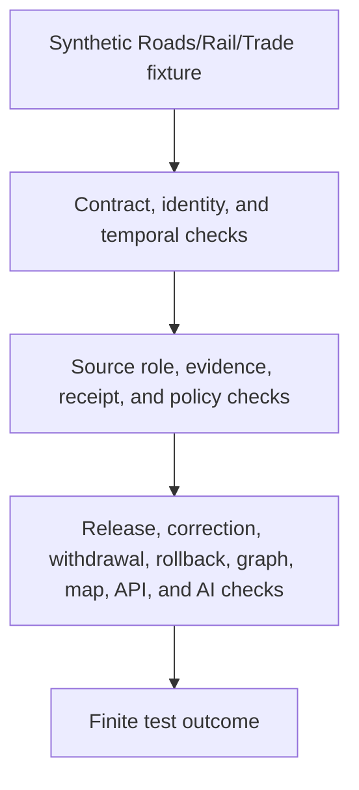

<!-- [KFM_META_BLOCK_V2]
doc_id: kfm://doc/tests-domains-roads-rail-trade-readme
title: Roads Rail Trade Domain Tests README
type: test-domain-readme
version: v0.1
status: draft; greenfield-stub-replaced; domain-test-parent-index; PROPOSED / NEEDS VERIFICATION before promotion
owners:
  - OWNER_TBD - Roads/Rail/Trade Routes domain steward
  - OWNER_TBD - QA steward
  - OWNER_TBD - Contracts steward
  - OWNER_TBD - Evidence steward
  - OWNER_TBD - Policy steward
  - OWNER_TBD - Release steward
  - OWNER_TBD - Source steward
created: 2026-07-06
updated: 2026-07-06
policy_label: public-doc; tests; roads-rail-trade; domain-test-parent-index; no-network; source-role-aware; temporal-scope-aware; evidence-bound; policy-gated; release-gated; rollback-aware
tags: [kfm, tests, roads-rail-trade, domain-tests, contracts, evidence, policy, release, source-role, temporal, redaction, legal-status-denial, historic-precision, rollback, EvidenceBundle, EvidenceRef, PolicyDecision, ReviewRecord, ReleaseManifest, RollbackCard, CorrectionNotice, WithdrawalNotice, ABSTAIN, DENY, ERROR]
related:
  - ../README.md
  - ../../README.md
  - contracts/README.md
  - contracts/route_membership_test/README.md
  - contracts/temporal_test/README.md
  - evidence/README.md
  - evidence/redaction_receipt_test/README.md
  - policy/README.md
  - policy/historic_precision_test/README.md
  - policy/legal_status_denial_test/README.md
  - release/README.md
  - release/rollback_test/README.md
  - ../../../docs/domains/roads-rail-trade/DATA_LIFECYCLE.md
  - ../../../docs/domains/roads-rail-trade/IDENTITY_MODEL.md
  - ../../../docs/domains/roads-rail-trade/OBJECT_FAMILIES.md
  - ../../../docs/domains/roads-rail-trade/HISTORIC_ROUTES.md
  - ../../../docs/domains/roads-rail-trade/RELEASE_INDEX.md
  - ../../../docs/runbooks/roads-rail-trade/ROLLBACK_RUNBOOK.md
  - ../../../data/registry/sources/roads-rail-trade/README.md
  - ../../../data/receipts/roads-rail-trade/redaction/README.md
  - ../../../data/rollback/roads-rail-trade/README.md
  - ../../../contracts/domains/roads-rail-trade/
  - ../../../schemas/contracts/v1/domains/roads-rail-trade/
  - ../../../fixtures/domains/roads-rail-trade/
  - ../../../policy/domains/roads-rail-trade/
  - ../../../release/candidates/roads-rail-trade/
notes:
  - "This README replaces the greenfield stub at tests/domains/roads-rail-trade/README.md."
  - "Directory Rules place enforceability proof under tests/. This directory is the domain-level test parent for Roads/Rail/Trade; it is not source, contract, schema, policy, proof, receipt, release, graph, map, API, or AI authority."
  - "Confirmed child README families at authoring time are contracts/, evidence/, policy/, and release/. Confirmed child leaf lanes include route_membership_test/, temporal_test/, redaction_receipt_test/, historic_precision_test/, legal_status_denial_test/, and rollback_test/."
  - "Executable tests, fixture shapes, schema bindings, CI jobs, release integration, public-surface invalidation, and pass rates remain NEEDS VERIFICATION."
  - "Default posture is deterministic and no-network with synthetic fixtures only."
[/KFM_META_BLOCK_V2] -->

<a id="top"></a>

# Roads Rail Trade domain tests

> Domain-level index for deterministic, no-network Roads/Rail/Trade test lanes. This tree should prove that transport claims remain source-role-aware, time-aware, evidence-bound, policy-gated, release-gated, and rollback-aware without turning tests into source truth, legal authority, graph truth, map truth, AI truth, or publication approval.

<p>
  
  
  
  
  
  
</p>

**Path:** `tests/domains/roads-rail-trade/README.md`  
**Status:** draft / greenfield stub replaced / domain test parent index / PROPOSED until executable tests are verified  
**Owning root:** `tests/`  
**Domain segment:** `roads-rail-trade`  
**Default execution posture:** deterministic, synthetic, no-network, public-safe fixtures only  
**Truth posture:** CONFIRMED target file existed as a greenfield stub before replacement; CONFIRMED parent `tests/domains/README.md` exists as a per-domain test-package index; CONFIRMED child README families exist for `contracts/`, `evidence/`, `policy/`, and `release/`; CONFIRMED Roads/Rail/Trade lifecycle docs describe source-role discipline, quarantine, evidence refs, derived graph posture, governed public surfaces, release gates, correction path, and rollback target; NEEDS VERIFICATION for executable tests, fixtures, schemas, validators, policy runtime, CI coverage, release integration, and pass rates.

---

## Purpose

`tests/domains/roads-rail-trade/` is the domain-level test parent for Roads/Rail/Trade.

This subtree should prove that Roads/Rail/Trade behavior is enforceable across contract shape, evidence support, policy denial, release gating, correction, withdrawal, rollback, graph derivation, public-surface exposure, and AI boundaries. It is a test root, not a source of truth.

A passing test in this domain should **not** mean that a road, rail line, crossing, route, corridor, restriction, operator assignment, legal designation, access rule, current status, historic alignment, graph projection, map layer, API response, Focus Mode carrier, AI answer, or release is true or public. It should mean only that a scoped guardrail behaved as expected against bounded synthetic fixtures and local files.

[Back to top](#top)

---

## Placement Basis

Directory Rules classify `tests/` as the root that proves rules are enforceable. The parent `tests/domains/` README identifies per-domain test packages. This directory is therefore the Roads/Rail/Trade domain test package.

| Responsibility | Correct home | This directory's relationship |
|---|---|---|
| Roads/Rail/Trade domain tests | `tests/domains/roads-rail-trade/` | This directory. |
| Cross-domain test index | `tests/domains/README.md` | Parent index for per-domain test packages. |
| Contract tests | `tests/domains/roads-rail-trade/contracts/` | Confirmed child README family. |
| Evidence tests | `tests/domains/roads-rail-trade/evidence/` | Confirmed child README family. |
| Policy tests | `tests/domains/roads-rail-trade/policy/` | Confirmed child README family. |
| Release tests | `tests/domains/roads-rail-trade/release/` | Confirmed child README family. |
| Source descriptors, evidence, policy, and release decisions | Their governed responsibility roots | Not owned here. |
| Contracts, schemas, fixtures, graph work, and public artifacts | Their governed responsibility roots | Not owned here. |

> [!IMPORTANT]
> This README documents a test index. It cannot create source authority, contract authority, schema authority, proof closure, policy approval, release approval, public artifacts, graph truth, map truth, live status, operational guidance, or AI truth.

---

## Parent Invariant

> **Domain tests prove guardrails; they do not become transport truth.**

Core checks that all child lanes should preserve:

| Check | Required behavior | Failure outcome |
|---|---|---|
| Source-role boundary | Source roles stay fixed and cannot be upcast by normalization, graph projection, display, generated wording, or release assembly. | `DENY` / `ABSTAIN`. |
| Temporal boundary | Source, observed, valid, retrieval, release, and correction times remain distinct where material. | validation failure / `ABSTAIN`. |
| Contract boundary | Contracts and schemas are cited and tested; tests do not define semantic authority. | validation failure / promotion block. |
| Evidence boundary | Consequential outputs require EvidenceRef-to-EvidenceBundle support or fail closed. | `ABSTAIN`. |
| Policy boundary | Rights, sensitivity, legal status, access, historic precision, review, and release blockers fail closed. | `DENY` / `ABSTAIN`. |
| Receipt boundary | Redaction, aggregation, validation, correction, withdrawal, and rollback transforms remain auditable. | validation failure. |
| Graph boundary | Network nodes, edges, route memberships, and movement story nodes are derived and invalidatable, not canonical truth. | validation failure. |
| Public-surface boundary | Public API, map, tile, screenshot, Focus Mode, export, and AI carriers cannot bypass release state. | `DENY` / `ABSTAIN`. |
| Release boundary | Test success does not become release approval, correction approval, withdrawal approval, rollback approval, or public artifact publication. | promotion block. |
| No-network boundary | Default domain tests do not call live services or external endpoints. | validation failure / `ERROR`. |

---

## Confirmed Test Families

| Family | Status | Current confirmed child lanes | Boundary |
|---|---|---|---|
| [`contracts/`](contracts/README.md) | CONFIRMED README / executable tests NEEDS VERIFICATION | `route_membership_test/`, `temporal_test/` | Tests contract guardrails; does not define contracts or schemas. |
| [`evidence/`](evidence/README.md) | CONFIRMED README / executable tests NEEDS VERIFICATION | `redaction_receipt_test/` | Tests evidence and receipt guardrails; does not become evidence, proof, or receipt storage. |
| [`policy/`](policy/README.md) | CONFIRMED README / executable tests NEEDS VERIFICATION | `historic_precision_test/`, `legal_status_denial_test/` | Tests fail-closed policy behavior; does not define binding policy. |
| [`release/`](release/README.md) | CONFIRMED README / executable tests NEEDS VERIFICATION | `rollback_test/` | Tests release and rollback guardrails; does not approve publication or rollback. |

---

## Proposed Future Families

These are backlog signposts only. They are not implementation claims.

| Family | Status | Purpose |
|---|---|---|
| `sources/` | PROPOSED | Would test source admission, rights, role preservation, cadence, and no upcast behavior. |
| `identity/` | PROPOSED | Would test deterministic identity envelopes, spec-hash inputs, and identity/display/release separation. |
| `graph/` | PROPOSED | Would test graph projections, route memberships, network edges, rollback, and graph-not-truth behavior. |
| `map_api/` | PROPOSED | Would test governed public API, map, tile, screenshot, export, and Focus Mode release boundaries. |
| `ai_boundary/` | PROPOSED | Would test that generated summaries cite released evidence and abstain when evidence, policy, or release state is missing. |
| `no_network/` | PROPOSED | Would test that default domain test execution is local and deterministic. |

---

## Domain-Test Flow



The diagram describes intended test responsibility only. It does not prove that executable tests, validators, fixtures, policy runtime, release jobs, graph projections, public invalidation hooks, map behavior, AI behavior, or CI jobs currently exist.

---

## Accepted Inputs

Only bounded, synthetic, reviewable inputs belong in this domain test package:

- synthetic fixtures with fake source refs, object refs, route refs, segment refs, membership refs, event refs, evidence refs, policy refs, review refs, receipt refs, release refs, correction refs, withdrawal refs, and rollback refs
- synthetic object-family stubs for Road Segment, Rail Segment, CorridorRoute, RouteMembership, HistoricRouteClaim, TradeRouteCorridor, RestrictionEvent, StatusEvent, OperatorAssignment, AccessRestriction, NetworkNode, NetworkEdge, and MovementStoryNode behavior
- synthetic source-role and time-kind cases where accepted vocabulary supports those roles
- synthetic policy cases for legal-status denial, access denial, historic overprecision denial, sensitive corridor review, redaction/generalization, release block, correction, withdrawal, rollback, and quarantine
- canary values that make source-role collapse, legal-status overclaiming, precision laundering, sensitive-geometry exposure, graph-truth leakage, map-truth leakage, AI leakage, logging, or public export obvious
- local validation envelopes emitted by test helpers

Safe outputs may include public-safe references and operational fields such as fixture ID, lane ID, object family, source role, time kind, validator name, finite outcome, reason code, evidence ref, policy decision ID, review record ID, receipt ref, release ref, correction ref, withdrawal ref, and rollback ref.

---

## Exclusions

Do **not** place these materials in this domain test package:

| Excluded material | Why it does not belong here |
|---|---|
| Real source exports, live feeds, legal-status records, access records, or public payloads | Rights, authority, freshness, safety, and release status cannot be assumed in default tests. |
| Real historic route coordinates, precise cultural corridor traces, private review notes, or restricted infrastructure detail | Direct exposure defeats policy and sensitivity guardrails. |
| Secrets, private endpoint details, or production logs | Security exposure. |
| Real EvidenceBundles, ProofPacks, production receipts, release manifests, rollback cards, correction notices, withdrawal notices, public artifacts, or audit ledgers | These are governed trust records or release artifacts. |
| Binding policy rules, schema definitions, contract prose, release procedures, graph implementation, map implementation, API implementation, or AI runtime implementation | Authority and implementation do not live in this README. |

---

## Suggested Layout

```text
tests/domains/roads-rail-trade/
|-- README.md
|-- contracts/
|   |-- README.md
|   |-- route_membership_test/
|   |   `-- README.md
|   `-- temporal_test/
|       `-- README.md
|-- evidence/
|   |-- README.md
|   `-- redaction_receipt_test/
|       `-- README.md
|-- policy/
|   |-- README.md
|   |-- historic_precision_test/
|   |   `-- README.md
|   `-- legal_status_denial_test/
|       `-- README.md
|-- release/
|   |-- README.md
|   `-- rollback_test/
|       `-- README.md
|-- sources/
|-- identity/
|-- graph/
|-- map_api/
|-- ai_boundary/
`-- no_network/
```

The four parent families and six child leaf README lanes listed above are confirmed as README files at authoring time. Proposed directories are **PROPOSED** until files and executable tests exist.

---

## Run Posture

No executable runner was verified while authoring this README. Once tests exist, the expected local command should be documented and verified here.

```bash
: "PROPOSED / NEEDS VERIFICATION"
pytest tests/domains/roads-rail-trade
```

Required run posture: no network access, no live service calls, no real secrets, no production logs, no production trust artifacts, no public artifact writes, deterministic fixture inputs, and finite outcomes only: `PASS`, `DENY`, `ABSTAIN`, or `ERROR`.

---

## Evidence Ledger

| Source | Status | Supports | Limits |
|---|---|---|---|
| `Directory Rules.pdf` | CONFIRMED doctrine | `tests/` is the enforceability root; domain tests belong under `tests/domains/<domain>/`; authority roots remain separate. | Does not prove executable tests, fixtures, CI, schema bindings, runtime behavior, or pass rates. |
| `tests/domains/README.md` | CONFIRMED repo evidence | Identifies `tests/domains/` as per-domain test packages. | Does not define mature Roads/Rail/Trade lane coverage. |
| `tests/domains/roads-rail-trade/contracts/README.md` | CONFIRMED child family README | Contract-test parent index exists. | Does not prove executable tests exist. |
| `tests/domains/roads-rail-trade/evidence/README.md` | CONFIRMED child family README | Evidence-test parent index exists. | Does not prove executable tests exist. |
| `tests/domains/roads-rail-trade/policy/README.md` | CONFIRMED child family README | Policy-test parent index exists. | Does not prove executable tests exist. |
| `tests/domains/roads-rail-trade/release/README.md` | CONFIRMED child family README | Release-test parent index exists. | Does not prove executable tests exist. |
| `docs/domains/roads-rail-trade/DATA_LIFECYCLE.md` | CONFIRMED repo evidence | Defines lifecycle, source-role discipline, quarantine posture, public-safe candidates, EvidenceRefs, receipts, derived graph posture, governed public surfaces, correction path, and rollback target. | Implementation-layer paths and artifact IDs remain PROPOSED in that doc. |
| GitHub target file before update | CONFIRMED repo evidence | `tests/domains/roads-rail-trade/README.md` existed as a greenfield stub before replacement. | Stub did not provide lane guidance or executable coverage. |

---

## Validation Checklist

- [ ] Confirm accepted domain-test indexing convention for `tests/domains/roads-rail-trade/`.
- [ ] Confirm accepted fixture homes and naming conventions for Roads/Rail/Trade domain fixtures.
- [ ] Confirm accepted schema and contract homes, including unresolved slug posture where docs distinguish `roads-rail-trade` and `transport` segments.
- [ ] Confirm source-role, time-kind, evidence, receipt, policy, review, release, correction, withdrawal, rollback, finite outcome, and reason-code vocabularies.
- [ ] Add executable tests under confirmed child lanes before claiming runtime coverage.
- [ ] Confirm tests do not use real source feeds, live systems, secrets, production logs, production trust artifacts, or public artifact writes.
- [ ] Wire the domain lane into CI only after executable tests and safe fixtures exist.

---

## Rollback

Rollback is required if this domain test index starts to store real source data, trust-bearing records, production release records, public artifacts, secrets, production logs, binding policy, contract/schema authority, graph implementation, map implementation, API implementation, or AI runtime behavior instead of documenting test boundaries.

Rollback is also required if this lane treats a test pass as source truth, legal status, public access, current-status proof, graph truth, map truth, AI truth, release approval, correction approval, withdrawal approval, or rollback approval.

Rollback target: restore the previous safe README revision or remove this parent index until child lane placement, fixtures, schemas, source-role handling, evidence expectations, policy expectations, release relationship, correction behavior, rollback behavior, and CI integration are reverified.

[Back to top](#top)