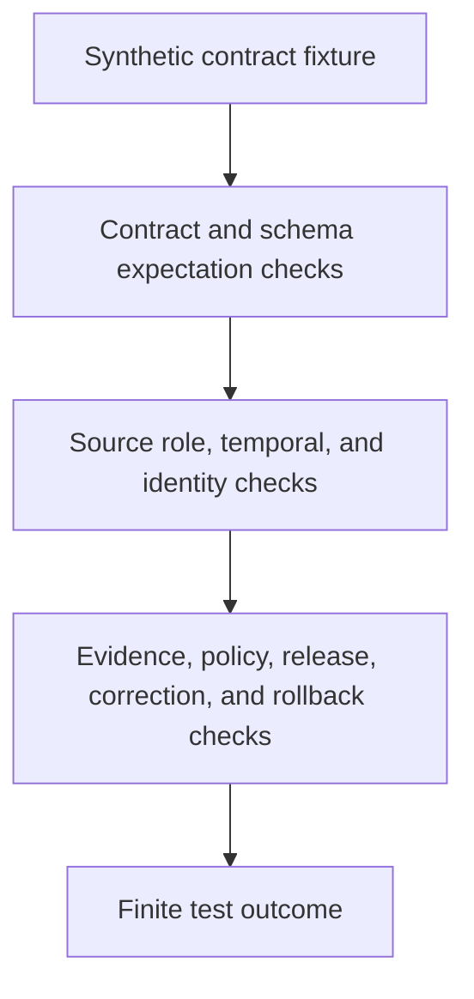

<!-- [KFM_META_BLOCK_V2]
doc_id: kfm://doc/tests-domains-roads-rail-trade-contracts-readme
title: Roads Rail Trade Contract Tests README
type: test-index-readme
version: v0.1
status: draft; empty-placeholder-replaced; contract-test-parent-index; PROPOSED / NEEDS VERIFICATION before promotion
owners:
  - OWNER_TBD - Roads/Rail/Trade Routes domain steward
  - OWNER_TBD - Contracts steward
  - OWNER_TBD - Roads steward
  - OWNER_TBD - Rail steward
  - OWNER_TBD - Historic/trade-routes steward
  - OWNER_TBD - Temporal model steward
  - OWNER_TBD - Evidence steward
  - OWNER_TBD - Policy steward
  - OWNER_TBD - Release steward
  - OWNER_TBD - QA steward
created: 2026-07-06
updated: 2026-07-06
policy_label: public-doc; tests; roads-rail-trade; contracts; parent-index; route-membership; temporal; source-role-aware; temporal-scope-aware; no-network; evidence-bound; policy-gated; release-gated; rollback-aware
tags: [kfm, tests, roads-rail-trade, contracts, contract-tests, route-membership, temporal, source-role, valid-time, identity, corridor-route, road-segment, rail-segment, route-event, status-event, restriction-event, operator-assignment, historic-route-claim, trade-route-corridor, graph-derived, EvidenceBundle, PolicyDecision, ReviewRecord, ReleaseManifest, CorrectionNotice, RollbackCard, ABSTAIN, DENY, ERROR]
related:
  - ../../../README.md
  - ../../README.md
  - ../README.md
  - route_membership_test/README.md
  - temporal_test/README.md
  - ../../../../contracts/domains/roads-rail-trade/README.md
  - ../../../../contracts/domains/roads-rail-trade/route_membership.md
  - ../../../../contracts/domains/roads-rail-trade/route_event.md
  - ../../../../contracts/domains/roads-rail-trade/status_event.md
  - ../../../../contracts/domains/roads-rail-trade/restriction_event.md
  - ../../../../contracts/domains/roads-rail-trade/operator_assignment.md
  - ../../../../contracts/domains/roads-rail-trade/operator_status.md
  - ../../../../contracts/domains/roads-rail-trade/domain_feature_identity.md
  - ../../../../docs/domains/roads-rail-trade/README.md
  - ../../../../docs/domains/roads-rail-trade/OBJECT_FAMILIES.md
  - ../../../../docs/domains/roads-rail-trade/IDENTITY_MODEL.md
  - ../../../../docs/domains/roads-rail-trade/DATA_LIFECYCLE.md
  - ../../../../docs/domains/roads-rail-trade/GRAPH_PROJECTIONS.md
  - ../../../../docs/domains/roads-rail-trade/MAP_UI_CONTRACTS.md
  - ../../../../schemas/contracts/v1/domains/roads-rail-trade/
  - ../../../../fixtures/domains/roads-rail-trade/contracts/
  - ../../../../policy/domains/roads-rail-trade/
  - ../../../../release/candidates/roads-rail-trade/
notes:
  - "This README replaces the empty placeholder content at tests/domains/roads-rail-trade/contracts/README.md."
  - "Directory Rules place enforceability proof under tests/. This directory is a parent index for contract-focused tests; it is not the semantic contract home."
  - "Confirmed child README lanes at authoring time are route_membership_test/README.md and temporal_test/README.md. Other child lanes listed here are PROPOSED until files and executable tests are verified."
  - "Semantic contract authority remains under contracts/domains/roads-rail-trade/ or an ADR-selected alternate. Machine shape remains under schemas/contracts/v1/... or an ADR-selected alternate."
  - "Roads/Rail/Trade docs record a slug conflict around roads-rail-trade versus transport for schema/contract roots. This README preserves the requested tests path and does not resolve the ADR question."
  - "Default posture is deterministic and no-network. Real source feeds, legal-status endpoints, live routing services, graph services, credentials, production logs, and release artifacts do not belong in default contract tests."
[/KFM_META_BLOCK_V2] -->

<a id="top"></a>

# Roads Rail Trade contract tests

> Parent index for deterministic, no-network contract guardrail tests in the Roads/Rail/Trade domain. These tests should prove that contracts remain evidence-bound, source-role-aware, time-aware, policy-gated, release-gated, and rollback-aware without becoming contract authority, schema authority, legal-status authority, live-routing authority, graph truth, map truth, or publication approval.

<p>
  
  
  
  
  
  
</p>

**Path:** `tests/domains/roads-rail-trade/contracts/README.md`  
**Status:** draft / empty placeholder replaced / contract test parent index / PROPOSED until executable tests are verified  
**Owning root:** `tests/`  
**Domain segment:** `roads-rail-trade`  
**Test lane family:** `contracts`  
**Default execution posture:** deterministic, synthetic, no-network, public-safe fixtures only  
**Truth posture:** CONFIRMED by current GitHub evidence that this target file existed as an empty placeholder before replacement; CONFIRMED child READMEs exist for `route_membership_test/` and `temporal_test/`; CONFIRMED Roads/Rail/Trade contract and domain docs exist for route membership, temporal identity posture, object families, and lifecycle posture; NEEDS VERIFICATION for executable contract tests, accepted fixture homes, schema shapes, validator implementations, policy runtime, CI coverage, release integration, and pass rates.

---

## Purpose

`tests/domains/roads-rail-trade/contracts/` is the parent test index for contract-focused guardrails in the Roads/Rail/Trade domain.

This subtree should prove that Roads/Rail/Trade contract behavior is enforceable without relocating authority into tests. Tests can verify whether a `RouteMembership`, temporal envelope, route event, restriction event, status event, operator assignment, domain feature identity, graph projection, public map carrier, or release candidate respects contract boundaries. Tests do **not** define those contracts.

A passing test in this directory should **not** mean that a route exists, a segment exists, a legal designation is proven, an access rule is current, a routing path is safe, a graph edge is canonical, a map label is authoritative, an AI summary is true, or a release is approved. It should mean only that the scoped contract guardrail behaved as expected against bounded synthetic fixtures and local files.

[Back to top](#top)

---

## Placement Basis

Directory Rules classify `tests/` as the root that proves rules are enforceable. This directory is therefore a **contract-test parent index** inside a domain lane. Semantic contracts, schemas, source descriptors, policies, fixtures, runtime packages, public APIs, release manifests, and published artifacts remain in their own responsibility roots.

| Responsibility | Correct home | This directory's relationship |
|---|---|---|
| Roads/Rail/Trade contract tests | `tests/domains/roads-rail-trade/contracts/` | This directory. |
| Domain test root | `tests/domains/roads-rail-trade/` | Parent domain lane; currently observed as a greenfield stub. |
| Route membership contract tests | `tests/domains/roads-rail-trade/contracts/route_membership_test/` | Confirmed child README lane. |
| Temporal contract tests | `tests/domains/roads-rail-trade/contracts/temporal_test/` | Confirmed child README lane. |
| Semantic contracts | `contracts/domains/roads-rail-trade/` or ADR-selected alternate | Defines object meaning; not owned here. |
| Machine schemas | `schemas/contracts/v1/domains/roads-rail-trade/` or ADR-selected alternate | Defines accepted shapes; not owned here. |
| Reusable synthetic fixtures | `fixtures/domains/roads-rail-trade/contracts/` or narrower accepted fixture homes | Preferred fixture home if populated. |
| Source descriptors and rights | `data/registry/sources/roads-rail-trade/` or accepted source catalog homes | Source identity, role, rights, cadence, and caveats; not owned here. |
| Policy rules | `policy/domains/roads-rail-trade/` or ADR-selected alternate | Allow, deny, restrict, abstain, redaction, release, and legal/safety boundaries. |
| Release decisions | `release/` roots | Publication, correction, withdrawal, rollback, cache invalidation, and derivative invalidation authority. |

> [!IMPORTANT]
> This README preserves the requested `tests/domains/roads-rail-trade/contracts/` path. It does not resolve the documented slug conflict between `roads-rail-trade` and `transport` for some schema/contract homes.

[Back to top](#top)

---

## Parent Invariant

> **Contract tests prove guardrails; they do not define authority.** A contract test can demonstrate that a Roads/Rail/Trade object respects semantic, temporal, source-role, evidence, policy, release, correction, and rollback boundaries. It cannot create contract meaning, schema shape, source authority, legal designation, public access, live routing, graph truth, map truth, AI truth, or publication approval.

Core checks:

| Check | Required behavior | Failure outcome |
|---|---|---|
| Contract/test separation | Tests cite semantic contracts and schemas; tests do not become contract prose or schema definitions. | validation failure / promotion block. |
| Source-role boundary | Tests preserve source role and deny upcasting context, candidate, administrative, modeled, or aggregate sources into authority without governance. | `DENY` / `ABSTAIN`. |
| Temporal boundary | Tests keep source, observed, valid, retrieval, release, and correction times distinct when material. | validation failure / `ABSTAIN`. |
| Identity boundary | Tests verify deterministic identity posture without deriving identity from raw geometry, display labels, release time, graph topology, or AI wording alone. | validation failure. |
| Route/segment separation | Tests keep route, segment, membership, event, restriction, operator, graph edge, and map carrier identities separate. | validation failure. |
| Evidence boundary | Consequential test outputs require EvidenceRef-to-EvidenceBundle support or abstain. | `ABSTAIN`. |
| Policy boundary | Legal-status, public-access, safety, sensitivity, rights, historic/cultural uncertainty, infrastructure-adjacent detail, and release uncertainty fail closed. | `DENY` / `ABSTAIN`. |
| Graph boundary | Network nodes, edges, route graphs, route memberships, and movement story nodes remain derived and rollbackable. | validation failure. |
| Public-surface boundary | Public API, map, tile, screenshot, Focus Mode, AI, and export carriers cannot treat test success as publication. | promotion block / `DENY`. |
| No-network boundary | Default contract tests do not call live feeds, source APIs, routing engines, legal-status systems, graph databases, map services, or public APIs. | validation failure / `ERROR`. |

---

## Lane Index

| Lane | Status | Purpose | Boundary |
|---|---|---|---|
| [`route_membership_test/`](route_membership_test/README.md) | CONFIRMED README / executable tests NEEDS VERIFICATION | Proves `RouteMembership` remains a source-scoped, time-aware associative claim connecting member objects to route/corridor entities. | Does not prove route identity, segment identity, legal designation, public access, live routing, graph truth, map truth, or release approval. |
| [`temporal_test/`](temporal_test/README.md) | CONFIRMED README / executable tests NEEDS VERIFICATION | Proves Roads/Rail/Trade time kinds remain separate across identity, events, retrieval, release, correction, rollback, graph, map, API, and AI carriers. | Does not define temporal doctrine or schema shape. |
| `source_role_test/` | PROPOSED | Would prove source roles remain explicit and cannot be upcast by promotion, display, graph projection, or AI wording. | SourceDescriptor schema and source registry do not live here. |
| `identity_hash_test/` | PROPOSED | Would prove deterministic identity envelopes and `spec_hash` inputs remain stable and do not collapse geometry, labels, source role, time, or release state. | Identity doctrine and canonicalization standards do not live here. |
| `legal_status_denial_test/` | PROPOSED | Would prove OSM, GNIS, generic context, or ambiguous source material cannot prove legal designation, jurisdiction, operator authority, access, closure, or safe routing. | Legal policy does not live here. |
| `event_contracts_test/` | PROPOSED | Would prove route, status, restriction, operator, and access events remain time-bound claims rather than object replacements. | Event contract prose does not live here. |
| `graph_projection_contract_test/` | PROPOSED | Would prove graph nodes, edges, route memberships, and movement story nodes are derived, evidence-subordinate, and rollbackable. | Graph implementation does not live here. |
| `release_gate_test/` | PROPOSED | Would prove public carriers require EvidenceBundle, PolicyDecision, ReviewRecord, ReleaseManifest, correction path, and RollbackCard before exposure. | Release authority does not live here. |
| `no_network_test/` | PROPOSED | Would prove default contract tests are local and deterministic. | Connector and integration tests require separate gates. |

Only `route_membership_test/` and `temporal_test/` were confirmed as authored child README lanes when this parent index was created. Other lanes are backlog signposts, not claims of implementation.

[Back to top](#top)

---

## Contract-Test Flow



The diagram describes the expected test responsibility order only. It does not prove that schemas, validators, fixtures, policy runtime, release jobs, graph projections, map behavior, AI behavior, or CI jobs currently exist.

---

## Accepted Inputs

Only bounded, synthetic, reviewable inputs belong in this lane family:

- Synthetic contract fixtures with fake route, segment, event, operator, restriction, source, evidence, policy, review, release, correction, withdrawal, and rollback refs.
- Synthetic companion records for `Road Segment`, `Rail Segment`, `CorridorRoute`, `RouteMembership`, `RouteEvent`, `StatusEvent`, `RestrictionEvent`, `OperatorAssignment`, `OperatorStatus`, `AccessRestriction`, `HistoricRouteClaim`, `TradeRouteCorridor`, `NetworkNode`, `NetworkEdge`, and `MovementStoryNode` behavior.
- Synthetic source-role cases for observed, regulatory, modeled, aggregate, administrative, candidate, and synthetic source posture where accepted vocabulary supports those roles.
- Synthetic temporal cases for source time, observed time, valid time, retrieval time, release time, correction time, stale feeds, conflicting dates, approximate historic ranges, supersession, correction, withdrawal, and rollback.
- Synthetic EvidenceRef, EvidenceBundle stub, PolicyDecision, ReviewRecord, ReleaseManifest, CorrectionNotice, WithdrawalNotice, RedactionReceipt, AggregationReceipt, and RollbackCard references.
- Canary values that make accidental source-payload echoing, legal-status overclaiming, public-access overclaiming, current-tense overclaiming, graph-truth leakage, map-truth leakage, AI leakage, logging, or public export obvious.
- Local validation envelopes emitted by test helpers.

Safe outputs may include public-safe references and operational fields such as fixture ID, object family, contract name, schema/spec hash, source role, time kind, validator name, finite outcome, policy decision ID, reason code, evidence ref, and receipt reference.

---

## Exclusions

Do **not** place these materials in this lane family:

| Excluded material | Why it does not belong here | Correct direction |
|---|---|---|
| Real source exports, live feeds, legal-status records, routing responses, or public API payloads | Rights, authority, sensitivity, freshness, and release status cannot be assumed inside default tests. | Use synthetic fixtures or separately gated source/connector tests. |
| Real closure, restriction, route designation, operator, bridge, crossing, rail, facility, or historic alignment data | May be operationally sensitive, stale, rights-limited, culturally sensitive, or critical-infrastructure-adjacent. | Use fake fixtures with canaries. |
| Credentials, tokens, API keys, cookies, auth headers, or private endpoint URLs | Security exposure. | Secret manager or fake local values only. |
| Contract prose or schema definitions | Authority does not live in tests. | `contracts/` and `schemas/`. |
| Source descriptors, source-rights policy, legal-status policy, or sensitivity policy | Authority does not live in this lane. | Source registry and `policy/` roots. |
| Release manifests, correction notices, rollback cards, public graph exports, vector tiles, screenshots, map layers, or Focus Mode outputs | Publication and rollback require governed release roots. | `release/`, governed API, and accepted artifact homes. |
| Graph databases, graph algorithms, graph migrations, projection implementation, or routing engines | Implementation and migration authority do not live in this README. | Accepted graph/data/package/runtime homes. |

[Back to top](#top)

---

## Suggested Layout

```text
tests/domains/roads-rail-trade/contracts/
|-- README.md
|-- route_membership_test/
|   `-- README.md
|-- temporal_test/
|   `-- README.md
|-- source_role_test/
|-- identity_hash_test/
|-- legal_status_denial_test/
|-- event_contracts_test/
|-- graph_projection_contract_test/
|-- release_gate_test/
`-- no_network_test/
```

Only `route_membership_test/` and `temporal_test/` are confirmed as authored child README lanes at the time this README was created. Other directories are **PROPOSED** until files and executable tests exist.

---

## Run Posture

No executable runner was verified while authoring this README. Once tests exist, the expected local command should be documented and verified here.

```bash
: "PROPOSED / NEEDS VERIFICATION"
pytest tests/domains/roads-rail-trade/contracts
```

Required run posture:

- no network access
- no real source feeds or live status feeds
- no real legal-status or routing endpoints
- no real credentials
- no production logs or telemetry
- no public artifact writes
- no public API, map, tile, screenshot, graph export, release, correction, rollback, or AI-context writes
- deterministic fixture inputs
- finite outcomes only: `PASS`, `DENY`, `ABSTAIN`, or `ERROR`

---

## Minimal Parent Fixture

Synthetic parent fixtures should make the contract boundary inspectable without carrying real transport data.

```json
{
  "fixture_id": "roads-rail-trade-contract-parent-example",
  "contract_family": "roads_rail_trade_contract_guardrail",
  "object_family": "RouteMembership",
  "source_descriptor_id": "source-descriptor-fixture-contract-parent-001",
  "source_role": "candidate",
  "time_kind_under_test": "valid_time",
  "evidence_ref": "evidence-ref-fixture-contract-parent-001",
  "policy_decision_id": "policy-decision-fixture-contract-parent-001",
  "expected_outcome": "ABSTAIN",
  "safe_result_fields": {
    "validator_name": "route_membership_contract_boundary",
    "reason_code": "CONTRACT_TEST_DOES_NOT_AUTHORIZE_PUBLICATION",
    "rollback_card_ref": "rollback-card-fixture-contract-parent-001"
  },
  "must_not_claim": [
    "LEGAL_DESIGNATION_CANARY",
    "PUBLIC_ACCESS_CANARY",
    "SAFE_ROUTING_CANARY",
    "CURRENT_STATUS_CANARY",
    "GRAPH_TRUTH_CANARY",
    "MAP_TRUTH_CANARY",
    "AI_TRUTH_CANARY",
    "RELEASE_APPROVAL_CANARY"
  ]
}
```

The JSON above is illustrative. Accepted schema, field names, contract vocabulary, time-kind vocabulary, source-role vocabulary, reason codes, identity rules, and fixture homes remain **NEEDS VERIFICATION**.

---

## Evidence Ledger

| Source | Status | Supports | Limits |
|---|---|---|---|
| `Directory Rules.pdf` | CONFIRMED doctrine | `tests/` is the canonical enforceability root; file placement follows responsibility root rather than topic. | Does not prove executable tests, fixtures, CI, schema, or runtime behavior. |
| `tests/domains/roads-rail-trade/contracts/route_membership_test/README.md` | CONFIRMED child lane README | Defines route-membership contract-test posture and source-scoped association boundary. | Does not prove executable route-membership tests exist. |
| `tests/domains/roads-rail-trade/contracts/temporal_test/README.md` | CONFIRMED child lane README | Defines temporal contract-test posture and six time-kind separation boundary. | Does not prove executable temporal tests exist. |
| `contracts/domains/roads-rail-trade/route_membership.md` | CONFIRMED repo evidence | Defines route membership as a source-scoped, time-aware associative claim, not route, segment, legal designation, access, routing, graph, map, or release authority. | Contract is draft, PROPOSED, schema-missing, slug-CONFLICTED, and NEEDS VERIFICATION before promotion. |
| `docs/domains/roads-rail-trade/OBJECT_FAMILIES.md` | CONFIRMED repo evidence | Names Roads/Rail/Trade object families including route membership, events, operators, historic claims, trade corridors, graph families, and identity discipline. | Field realization is PROPOSED / NEEDS VERIFICATION. |
| `docs/domains/roads-rail-trade/IDENTITY_MODEL.md` | CONFIRMED repo evidence | Supports identity envelope, `spec_hash`, source-role anti-collapse, temporal kind separation, and release/correction identity boundaries. | Does not prove implementation. |
| `docs/domains/roads-rail-trade/DATA_LIFECYCLE.md` | CONFIRMED repo evidence | Defines RAW to PUBLISHED lifecycle, trust membrane, graph as derived, release gate, correction path, rollback path, and promotion as governed state transition. | Implementation-layer paths and artifact IDs remain PROPOSED in that doc. |
| `tests/domains/roads-rail-trade/README.md` | CONFIRMED repo evidence | Domain test root exists as a greenfield stub. | Does not provide mature parent guidance or executable coverage. |
| GitHub target file before update | CONFIRMED repo evidence | `tests/domains/roads-rail-trade/contracts/README.md` existed as empty placeholder content before replacement. | Placeholder proves path existence only. |

---

## Validation Checklist

- [ ] Confirm accepted parent contract-test indexing convention for `tests/domains/roads-rail-trade/contracts/`.
- [ ] Confirm accepted fixture home and naming convention for Roads/Rail/Trade contract-test fixtures.
- [ ] Confirm accepted schema locations, including unresolved slug conflict with possible alternate `transport` segment.
- [ ] Confirm accepted source-role vocabulary, time-kind vocabulary, identity envelope fields, evidence refs, policy outcomes, release refs, correction refs, and rollback refs.
- [ ] Add executable tests for route/member separation, temporal separation, source-role preservation, deterministic identity, legal-status denial, access/safe-routing abstention, graph-derived posture, map/API release gating, AI boundary, and no-network behavior.
- [ ] Confirm tests do not use real source feeds, legal-status endpoints, routing services, graph databases, credentials, production logs, or public artifact writes.
- [ ] Confirm graph, map, API, tile, screenshot, Focus Mode, AI context, and export outputs cannot bypass EvidenceBundle resolution, source role, temporal scope, policy, review, release, correction, withdrawal, or rollback controls.
- [ ] Wire the lane into CI only after executable tests and safe fixtures exist.

---

## Rollback

Rollback is required if this lane starts to:

- store real transport source exports, live status feeds, legal-status records, route data, restriction data, routing responses, credentials, production logs, or public artifacts
- define contract semantics, schema shape, policy, source descriptors, release authority, graph implementation, map implementation, AI behavior, or API behavior instead of testing them
- treat a contract-test pass as legal-status proof, public-access proof, route availability proof, live-routing proof, graph truth, map truth, AI truth, or release approval
- bypass source admission, EvidenceBundle resolution, source role, temporal scope, rights, sensitivity, policy decisions, review state, release state, correction, withdrawal, or rollback controls
- weaken fail-closed behavior for stale feeds, approximate historic dates, conflicting temporal evidence, source-role uncertainty, unresolved corrections, unreleased artifacts, legal-status uncertainty, access uncertainty, or derived graph/map outputs

Rollback target: restore the previous safe README revision or remove this parent index until child lane placement, fixtures, schemas, source-role handling, temporal vocabulary, policy expectations, release relationship, correction behavior, rollback behavior, and CI integration are reverified.

[Back to top](#top)