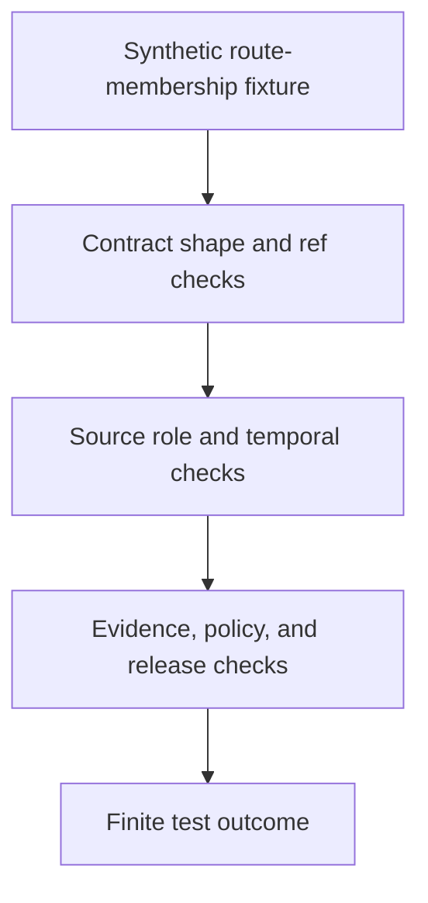

<!-- [KFM_META_BLOCK_V2]
doc_id: kfm://doc/tests-domains-roads-rail-trade-contracts-route-membership-test-readme
title: Roads Rail Trade Route Membership Contract Test README
type: test-lane-readme
version: v0.1
status: draft; empty-placeholder-replaced; contract-test-lane; PROPOSED / NEEDS VERIFICATION before promotion
owners:
  - OWNER_TBD - Roads/Rail/Trade Routes domain steward
  - OWNER_TBD - Contracts steward
  - OWNER_TBD - Roads steward
  - OWNER_TBD - Rail steward
  - OWNER_TBD - Historic/trade-routes steward
  - OWNER_TBD - Evidence steward
  - OWNER_TBD - Policy steward
  - OWNER_TBD - Release steward
  - OWNER_TBD - QA steward
created: 2026-07-06
updated: 2026-07-06
policy_label: public-doc; tests; roads-rail-trade; contracts; route-membership; associative-claim; route-segment-separation; source-role-aware; temporal-scope-aware; no-network; evidence-bound; policy-gated; release-gated; rollback-aware
tags: [kfm, tests, roads-rail-trade, contracts, route-membership, corridor-route, road-segment, rail-segment, historic-route-claim, trade-route-corridor, route-event, source-role, valid-time, EvidenceBundle, PolicyDecision, ReviewRecord, ReleaseManifest, RollbackCard, ABSTAIN, DENY, ERROR]
related:
  - ../../../../README.md
  - ../../../README.md
  - ../../README.md
  - ../README.md
  - ../../../../../contracts/domains/roads-rail-trade/route_membership.md
  - ../../../../../contracts/domains/roads-rail-trade/corridor_route.md
  - ../../../../../contracts/domains/roads-rail-trade/road_segment.md
  - ../../../../../contracts/domains/roads-rail-trade/rail_segment.md
  - ../../../../../contracts/domains/roads-rail-trade/historic_route_claim.md
  - ../../../../../contracts/domains/roads-rail-trade/trade_route_corridor.md
  - ../../../../../contracts/domains/roads-rail-trade/route_event.md
  - ../../../../../docs/domains/roads-rail-trade/README.md
  - ../../../../../docs/domains/roads-rail-trade/OBJECT_FAMILIES.md
  - ../../../../../docs/domains/roads-rail-trade/IDENTITY_MODEL.md
  - ../../../../../docs/domains/roads-rail-trade/DATA_LIFECYCLE.md
  - ../../../../../docs/domains/roads-rail-trade/GRAPH_PROJECTIONS.md
  - ../../../../../docs/domains/roads-rail-trade/MAP_UI_CONTRACTS.md
  - ../../../../../schemas/contracts/v1/domains/roads-rail-trade/route_membership.schema.json
  - ../../../../../fixtures/domains/roads-rail-trade/route_membership/
  - ../../../../../policy/domains/roads-rail-trade/
  - ../../../../../release/candidates/roads-rail-trade/
notes:
  - "This README replaces the empty placeholder content at tests/domains/roads-rail-trade/contracts/route_membership_test/README.md."
  - "Directory Rules place enforceability proof under tests/. This lane tests route-membership contract behavior; it does not define contract semantics or schema shape."
  - "The semantic contract is confirmed at contracts/domains/roads-rail-trade/route_membership.md. That contract is draft, PROPOSED, schema-missing, slug-CONFLICTED, and NEEDS VERIFICATION before promotion."
  - "The paired schema path schemas/contracts/v1/domains/roads-rail-trade/route_membership.schema.json was checked during this task and was not found."
  - "The tested invariant is that RouteMembership remains a source-scoped, time-aware associative claim connecting member objects to CorridorRoute-like route entities; it is not segment identity, route identity, legal designation, public access, live routing, graph truth, map truth, or release approval."
  - "Default posture is deterministic and no-network. Real source feeds, live routing services, legal-status endpoints, graph services, credentials, production logs, and release artifacts do not belong in default tests."
[/KFM_META_BLOCK_V2] -->

<a id="top"></a>

# Roads Rail Trade route membership contract tests

> Deterministic, no-network test documentation for proving that `RouteMembership` stays a source-scoped, time-aware relationship claim instead of becoming a route, a segment, a legal designation, an access decision, graph truth, map truth, or publication approval.

<p>
  
  
  
  
  
  
</p>

**Path:** `tests/domains/roads-rail-trade/contracts/route_membership_test/README.md`  
**Status:** draft / empty placeholder replaced / contract test lane / PROPOSED until executable tests are verified  
**Owning root:** `tests/`  
**Domain segment:** `roads-rail-trade`  
**Test lane:** `contracts/route_membership_test`  
**Default execution posture:** deterministic, synthetic, no-network, public-safe fixtures only  
**Truth posture:** CONFIRMED by current GitHub evidence that the target file existed as an empty placeholder before replacement; CONFIRMED semantic contract exists at `contracts/domains/roads-rail-trade/route_membership.md`; CONFIRMED current contract posture is draft, PROPOSED, schema-missing, slug-CONFLICTED, and NEEDS VERIFICATION before promotion; CONFIRMED object-family docs name `RouteMembership` as membership of a segment in a corridor/route; CONFIRMED lifecycle docs state graph projections are derived and never canonical; NEEDS VERIFICATION for executable tests, fixture shape, schema shape, validators, policy runtime, CI coverage, release integration, and pass rates.

---

## Purpose

`tests/domains/roads-rail-trade/contracts/route_membership_test/` is the requested contract test lane for `RouteMembership` behavior in Roads/Rail/Trade.

This lane should prove that route membership is an **associative claim**: a source-scoped, time-aware relationship connecting a member object, such as a road segment, rail segment, crossing, facility, historic route claim, or trade-route component, to a CorridorRoute-like route or corridor entity. It must preserve references, evidence, source role, temporal scope, policy posture, review state, release state, and rollback target.

A passing test here should **not** mean that a route exists, a segment exists, a segment belongs to a route as canonical truth, a legal route designation is proven, public access is allowed, live routing is safe, graph topology is authoritative, map rendering is approved, or a release is published. It should mean only that the scoped contract guardrail behaved as expected against bounded synthetic fixtures and local files.

[Back to top](#top)

---

## Placement Basis

Directory Rules classify `tests/` as the root that proves rules are enforceable. This path is therefore a **test lane** for a contract family. Semantic meaning belongs under `contracts/`; machine shape belongs under `schemas/`; source identity and rights belong under source registries; policy decisions belong under `policy/`; reusable synthetic fixtures belong under accepted fixture homes; and release authority belongs under release roots.

| Responsibility | Correct home | This lane's relationship |
|---|---|---|
| Route membership contract tests | `tests/domains/roads-rail-trade/contracts/route_membership_test/` | This directory. |
| Parent domain tests | `tests/domains/roads-rail-trade/` | Confirmed greenfield stub; parent guidance remains thin. |
| Parent contract test index | `tests/domains/roads-rail-trade/contracts/README.md` | Not found during authoring; NEEDS VERIFICATION. |
| Semantic contract | `contracts/domains/roads-rail-trade/route_membership.md` | Defines meaning and invariants; not owned here. |
| Paired schema | `schemas/contracts/v1/domains/roads-rail-trade/route_membership.schema.json` | Not found during authoring; NEEDS VERIFICATION. |
| Reusable synthetic fixtures | `fixtures/domains/roads-rail-trade/route_membership/` | Preferred fixture home if populated. |
| Policy rules | `policy/domains/roads-rail-trade/` or ADR-selected alternate | Decides allow, deny, restrict, abstain, redact, and release behavior. |
| Release decisions | `release/` roots | Publication, correction, withdrawal, rollback, and derivative invalidation authority. |

> [!IMPORTANT]
> This README does not resolve the slug conflict recorded in Roads/Rail/Trade docs. It honors the requested `tests/domains/roads-rail-trade/...` path and keeps contract/schema authority in their existing or proposed responsibility roots until an ADR settles the canonical segment.

[Back to top](#top)

---

## Invariant Under Test

> **RouteMembership is a relationship claim, not a route, not a segment, not legal status, and not release.** The object must attach a member reference to a route reference under source role, time, evidence, policy, review, release, and rollback constraints without collapsing those object families together.

Core checks:

| Check | Required behavior | Failure outcome |
|---|---|---|
| Relationship-not-object boundary | Membership records association only; route and member identity remain separate refs. | validation failure / `ABSTAIN`. |
| Route ref boundary | `route_ref` or equivalent points to a route/corridor entity; membership does not define the route itself. | validation failure. |
| Member ref boundary | `member_ref` or equivalent points to a segment, crossing, facility, claim, or other allowed member; membership does not embed member geometry as canonical truth. | validation failure. |
| Source-role boundary | Membership means only what the source role permits and cannot upcast context or observation into authority. | `ABSTAIN` / validation failure. |
| Temporal boundary | Membership has valid time, observed time, source time, or other accepted temporal scope; stale and conflicted memberships do not silently overwrite earlier claims. | `ABSTAIN` / validation failure. |
| Evidence boundary | Consequential membership output requires EvidenceRef-to-EvidenceBundle support before authoritative display or export. | `ABSTAIN`. |
| Event boundary | Route events, status events, restriction events, and operator events may cite or change membership but do not become membership by implication. | validation failure. |
| Legal-status boundary | Membership does not prove statutory designation, jurisdiction, right-of-way, ownership, public/private access, closure, or safe routing. | `ABSTAIN` / `DENY`. |
| Graph boundary | Network nodes, edges, route graphs, and movement story nodes are derived projections and remain rollbackable. | validation failure / `ABSTAIN`. |
| Map and AI boundary | Map labels, Focus Mode context, AI summaries, screenshots, tiles, and exports cannot treat membership as sovereign truth. | `DENY` / `ABSTAIN`. |
| Release boundary | Test success never becomes release approval, public API approval, map layer approval, correction, withdrawal, or rollback. | promotion block. |
| No-network boundary | Default tests do not call live source feeds, legal-status systems, routing engines, graph databases, map services, or public APIs. | validation failure / `ERROR`. |

---

## Contract Guardrail Flow



The diagram describes the intended test flow only. It does not prove that schema validators, policy runtime, route-membership fixtures, graph projections, release jobs, or CI jobs currently exist.

---

## Accepted Inputs

Only bounded, synthetic, reviewable inputs belong in this lane:

- Synthetic route-membership fixtures with fake route refs, member refs, source refs, temporal scopes, and evidence refs.
- Synthetic companion refs for `CorridorRoute`, `Road Segment`, `Rail Segment`, `HistoricRouteClaim`, `TradeRouteCorridor`, `RouteEvent`, `StatusEvent`, `RestrictionEvent`, `NetworkEdge`, and `NetworkNode` behavior.
- Synthetic source-role stubs that separate authority, observation, context, model, and derived projection roles where the accepted vocabulary supports them.
- Synthetic time-scope cases for historical membership, current membership, ambiguous membership, superseded membership, and conflicted membership.
- Synthetic EvidenceRef, EvidenceBundle stub, PolicyDecision, ReviewRecord, ReleaseManifest, CorrectionNotice, WithdrawalNotice, and RollbackCard references.
- Canary values that make accidental source-payload echoing, legal-status overclaiming, graph-truth leakage, map-truth leakage, AI exposure, logging, or public export obvious.
- Local validation envelopes emitted by test helpers.

Safe outputs may include public-safe references and operational fields such as fixture ID, membership ID, route ref, member ref, source descriptor ID, source role, validator name, finite outcome, policy decision ID, reason code, schema/spec hash, evidence ref, and receipt reference.

> [!IMPORTANT]
> A route membership can support inspection, but it must not silently become legal route designation, access permission, routing advice, title/right-of-way evidence, or public map authority.

---

## Exclusions

Do **not** place these materials in this lane:

| Excluded material | Why it does not belong here | Correct direction |
|---|---|---|
| Real source exports, live feeds, legal-status records, routing responses, or public API payloads | Rights, authority, sensitivity, and freshness cannot be assumed inside default tests. | Use synthetic fixtures or separately gated source/connector tests. |
| Real road, rail, bridge, ferry, depot, yard, crossing, access, closure, restriction, or operator data | May be source-sensitive, critical-infrastructure-adjacent, rights-limited, or stale. | Use fake fixtures with canaries. |
| Credentials, tokens, API keys, cookies, auth headers, or private endpoint URLs | Security exposure. | Secret manager or fake local values only. |
| Contract prose or schema definitions | Authority does not live in tests. | `contracts/` and `schemas/`. |
| Source descriptors, source-rights policy, or legal-status policy | Authority does not live in this lane. | Source registry and `policy/` roots. |
| Graph database files, graph algorithms, migrations, or projection implementation | Implementation and migration authority do not live in this README. | Accepted graph/data/package/runtime homes. |
| Public map layers, vector tiles, screenshots, Focus Mode outputs, AI context packets, or release manifests | Publication requires governed release. | Governed API/artifact/release roots. |

[Back to top](#top)

---

## Suggested Layout

```text
tests/domains/roads-rail-trade/contracts/route_membership_test/
|-- README.md
|-- test_route_membership_is_relationship_not_segment.py
|-- test_route_membership_requires_route_and_member_refs.py
|-- test_route_membership_preserves_source_role.py
|-- test_route_membership_requires_temporal_scope.py
|-- test_route_membership_requires_evidence_support.py
|-- test_route_membership_does_not_prove_legal_designation.py
|-- test_route_membership_does_not_prove_access_or_safe_routing.py
|-- test_route_membership_graph_projection_is_derived.py
|-- test_route_membership_release_gate_blocks_public_output.py
`-- test_route_membership_no_network.py
```

This layout is **PROPOSED** until executable files exist in the repository.

---

## Run Posture

No executable runner was verified while authoring this README. Once tests exist, the expected local command should be documented and verified here.

```bash
: "PROPOSED / NEEDS VERIFICATION"
pytest tests/domains/roads-rail-trade/contracts/route_membership_test
```

Required run posture:

- no network access
- no real transport source exports or live feeds
- no real legal-status or routing endpoints
- no real credentials
- no production logs or telemetry
- no public artifact writes
- no public API, map, tile, screenshot, graph export, or AI-context writes
- deterministic fixture inputs
- finite outcomes only: `PASS`, `DENY`, `ABSTAIN`, or `ERROR`

---

## Minimal Route Membership Fixture

Synthetic fixtures should make the relationship boundary inspectable without carrying real route data.

```json
{
  "fixture_id": "roads-rail-trade-route-membership-example",
  "route_membership_id": "route-membership-fixture-001",
  "route_ref": "corridor-route-fixture-001",
  "member_ref": "road-segment-fixture-001",
  "member_role": "segment_member",
  "source_descriptor_id": "source-descriptor-fixture-roads-001",
  "source_role": "context",
  "valid_time": {
    "kind": "valid_time",
    "start": "1870-01-01",
    "end": "1880-12-31"
  },
  "evidence_ref": "evidence-ref-fixture-001",
  "expected_outcome": "ABSTAIN",
  "safe_result_fields": {
    "policy_decision_id": "policy-decision-fixture-001",
    "reason_code": "ROUTE_MEMBERSHIP_NOT_AUTHORITY_FOR_LEGAL_STATUS",
    "rollback_card_ref": "rollback-card-fixture-001"
  },
  "must_not_claim": [
    "LEGAL_DESIGNATION_CANARY",
    "PUBLIC_ACCESS_CANARY",
    "SAFE_ROUTING_CANARY",
    "GRAPH_TRUTH_CANARY",
    "MAP_TRUTH_CANARY",
    "RELEASE_APPROVAL_CANARY"
  ]
}
```

The JSON above is illustrative. Accepted schema, field names, route/member vocabularies, source-role vocabulary, time-kind vocabulary, reason codes, and fixture homes remain **NEEDS VERIFICATION**.

---

## Evidence Ledger

| Source | Status | Supports | Limits |
|---|---|---|---|
| `Directory Rules.pdf` | CONFIRMED doctrine | `tests/` is the canonical enforceability root; file placement follows responsibility root rather than topic. | Does not prove executable tests, fixtures, CI, schema, or runtime behavior. |
| `contracts/domains/roads-rail-trade/route_membership.md` | CONFIRMED repo evidence | Defines RouteMembership as a source-scoped, time-aware relationship attaching member objects to CorridorRoute-like route entities; states it is not segment, route, legal designation, public access, live routing, graph truth, map truth, or release approval. | Contract is draft, PROPOSED, schema-missing, slug-CONFLICTED, and NEEDS VERIFICATION before promotion. |
| `docs/domains/roads-rail-trade/OBJECT_FAMILIES.md` | CONFIRMED repo evidence | Names `RouteMembership` as membership of a segment in a corridor/route and records object-family identity discipline. | Field realization is PROPOSED / NEEDS VERIFICATION. |
| `docs/domains/roads-rail-trade/DATA_LIFECYCLE.md` | CONFIRMED repo evidence | Confirms Roads/Rail/Trade lifecycle posture, trust membrane, graph as derived, release gates, and promotion as governed state transition. | Implementation-layer paths and artifact IDs remain PROPOSED in that doc. |
| `schemas/contracts/v1/domains/roads-rail-trade/route_membership.schema.json` | CONFIRMED absent in GitHub fetch | Paired schema was checked and not found during authoring. | Absence from this path does not prove no schema exists under a conflicted alternate slug. |
| `tests/domains/roads-rail-trade/README.md` | CONFIRMED repo evidence | Domain test root exists as a greenfield stub. | Does not provide contract-lane guidance or executable coverage. |
| `tests/domains/roads-rail-trade/contracts/README.md` | CONFIRMED not found in GitHub fetch | Parent contract test index is missing at authoring time. | Does not block this child README, but parent index remains a validation item. |
| GitHub target file before update | CONFIRMED repo evidence | `tests/domains/roads-rail-trade/contracts/route_membership_test/README.md` existed as empty placeholder content before replacement. | Placeholder proves path existence only. |

---

## Validation Checklist

- [ ] Confirm or create parent contract test index at `tests/domains/roads-rail-trade/contracts/README.md`.
- [ ] Confirm accepted fixture home and naming convention for route-membership test fixtures.
- [ ] Confirm accepted `RouteMembership` schema location, including unresolved slug conflict with possible alternate schema/contract segment.
- [ ] Confirm accepted fields for route refs, member refs, source roles, temporal scopes, evidence refs, policy outcomes, release refs, and rollback refs.
- [ ] Add executable tests for route/member separation, source-role preservation, temporal scope, evidence support, legal-status abstention, access abstention, graph-derived posture, map/API release gating, AI boundary, and no-network behavior.
- [ ] Confirm tests do not use real source feeds, legal-status endpoints, routing services, graph databases, credentials, production logs, or public artifact writes.
- [ ] Confirm graph, map, API, tile, screenshot, Focus Mode, AI context, and export outputs cannot bypass EvidenceBundle resolution, source role, policy, review, release, correction, withdrawal, or rollback controls.
- [ ] Wire the lane into CI only after executable tests and safe fixtures exist.

---

## Rollback

Rollback is required if this lane starts to:

- store real transport source exports, legal-status records, route data, access data, routing responses, credentials, production logs, or public artifacts
- define contract semantics, schema shape, policy, source descriptors, release authority, graph implementation, map implementation, or API behavior instead of testing them
- treat a route membership as route truth, segment truth, legal designation, public access proof, current-status proof, safe-routing proof, graph truth, map truth, AI truth, or release approval
- bypass source admission, EvidenceBundle resolution, source role, temporal scope, rights, sensitivity, policy decisions, review state, release state, correction, withdrawal, or rollback controls
- weaken fail-closed behavior for legal-status uncertainty, access uncertainty, source-role uncertainty, historic-route uncertainty, graph-derived projections, or public display

Rollback target: restore the previous safe README revision or remove this test lane until parent index placement, fixtures, schema posture, source-role handling, policy expectations, release relationship, and CI integration are reverified.

[Back to top](#top)