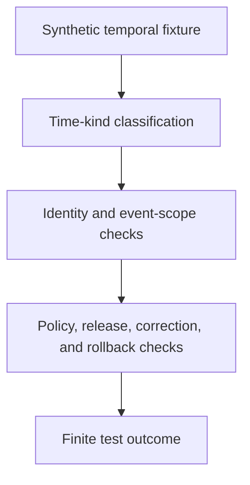

<!-- [KFM_META_BLOCK_V2]
doc_id: kfm://doc/tests-domains-roads-rail-trade-contracts-temporal-test-readme
title: Roads Rail Trade Temporal Contract Test README
type: test-lane-readme
version: v0.1
status: draft; empty-placeholder-replaced; contract-test-lane; temporal-guardrail; PROPOSED / NEEDS VERIFICATION before promotion
owners:
  - OWNER_TBD - Roads/Rail/Trade Routes domain steward
  - OWNER_TBD - Contracts steward
  - OWNER_TBD - Temporal model steward
  - OWNER_TBD - Roads steward
  - OWNER_TBD - Rail steward
  - OWNER_TBD - Historic/trade-routes steward
  - OWNER_TBD - Evidence steward
  - OWNER_TBD - Policy steward
  - OWNER_TBD - Release steward
  - OWNER_TBD - QA steward
created: 2026-07-06
updated: 2026-07-06
policy_label: public-doc; tests; roads-rail-trade; contracts; temporal; temporal-scope; source-time; observed-time; valid-time; retrieval-time; release-time; correction-time; no-network; evidence-bound; policy-gated; release-gated; rollback-aware
tags: [kfm, tests, roads-rail-trade, contracts, temporal, temporal-scope, source-time, observed-time, valid-time, retrieval-time, release-time, correction-time, route-membership, status-event, restriction-event, operator-assignment, historic-route-claim, trade-route-corridor, EvidenceBundle, PolicyDecision, ReviewRecord, ReleaseManifest, CorrectionNotice, RollbackCard, ABSTAIN, DENY, ERROR]
related:
  - ../../../../README.md
  - ../../../README.md
  - ../../README.md
  - ../README.md
  - ../route_membership_test/README.md
  - ../../../../../contracts/domains/roads-rail-trade/route_membership.md
  - ../../../../../contracts/domains/roads-rail-trade/route_event.md
  - ../../../../../contracts/domains/roads-rail-trade/status_event.md
  - ../../../../../contracts/domains/roads-rail-trade/restriction_event.md
  - ../../../../../contracts/domains/roads-rail-trade/operator_assignment.md
  - ../../../../../contracts/domains/roads-rail-trade/operator_status.md
  - ../../../../../contracts/domains/roads-rail-trade/historic_route_claim.md
  - ../../../../../contracts/domains/roads-rail-trade/trade_route_corridor.md
  - ../../../../../docs/domains/roads-rail-trade/README.md
  - ../../../../../docs/domains/roads-rail-trade/IDENTITY_MODEL.md
  - ../../../../../docs/domains/roads-rail-trade/DATA_LIFECYCLE.md
  - ../../../../../docs/domains/roads-rail-trade/OBJECT_FAMILIES.md
  - ../../../../../docs/domains/roads-rail-trade/GRAPH_PROJECTIONS.md
  - ../../../../../schemas/contracts/v1/domains/roads-rail-trade/temporal.schema.json
  - ../../../../../fixtures/domains/roads-rail-trade/temporal/
  - ../../../../../policy/domains/roads-rail-trade/
  - ../../../../../release/candidates/roads-rail-trade/
notes:
  - "This README replaces the empty placeholder content at tests/domains/roads-rail-trade/contracts/temporal_test/README.md."
  - "Directory Rules place enforceability proof under tests/. This lane tests temporal contract behavior; it does not define temporal doctrine, contract semantics, schema shape, source descriptors, policy decisions, release decisions, or runtime behavior."
  - "The Roads/Rail/Trade identity model confirms six temporal kinds: source_time, observed_time, valid_time, retrieval_time, release_time, and correction_time. It states that identity uses only identity-relevant temporal scope and that release_time and correction_time do not enter identity."
  - "The paired schema path schemas/contracts/v1/domains/roads-rail-trade/temporal.schema.json was checked during this task and was not found."
  - "The tested invariant is that temporal facts remain separated by kind and by lifecycle state; publication, correction, retrieval, observation, source authorship, and valid-time claims must not collapse into one another."
  - "Default posture is deterministic and no-network. Real source feeds, live road-status feeds, routing services, legal-status endpoints, graph services, credentials, production logs, and release artifacts do not belong in default tests."
[/KFM_META_BLOCK_V2] -->

<a id="top"></a>

# Roads Rail Trade temporal contract tests

> Deterministic, no-network test documentation for proving that Roads/Rail/Trade objects keep source time, observed time, valid time, retrieval time, release time, and correction time distinct instead of collapsing history, freshness, release state, or correction state into one misleading claim.

<p>
  
  
  
  
  
  
</p>

**Path:** `tests/domains/roads-rail-trade/contracts/temporal_test/README.md`  
**Status:** draft / empty placeholder replaced / contract test lane / PROPOSED until executable tests are verified  
**Owning root:** `tests/`  
**Domain segment:** `roads-rail-trade`  
**Test lane:** `contracts/temporal_test`  
**Default execution posture:** deterministic, synthetic, no-network, public-safe fixtures only  
**Truth posture:** CONFIRMED by current GitHub evidence that the target file existed as an empty placeholder before replacement; CONFIRMED Roads/Rail/Trade identity documentation separates source, observed, valid, retrieval, release, and correction times; CONFIRMED current identity documentation says release and correction times are not identity components; CONFIRMED adjacent `route_membership_test` README exists; NEEDS VERIFICATION for executable tests, accepted fixture shape, schema shape, temporal vocabulary, validators, policy runtime, CI coverage, release integration, and pass rates.

---

## Purpose

`tests/domains/roads-rail-trade/contracts/temporal_test/` is the requested temporal contract test lane for Roads/Rail/Trade.

This lane should prove that temporal fields and temporal scopes remain explicit, bounded, and non-interchangeable across road segments, rail segments, corridor routes, route memberships, route events, restriction events, status events, operator assignments, historic route claims, trade route corridors, network projections, map layers, and release artifacts.

A passing test here should **not** mean that a road is currently open, a rail segment is active, a route designation is legally current, a historic alignment is precise, a closure is still in force, a released map is fresh, or a correction rewrote history. It should mean only that the scoped temporal guardrail behaved as expected against bounded synthetic fixtures and local files.

[Back to top](#top)

---

## Placement Basis

Directory Rules classify `tests/` as the root that proves rules are enforceable. This path is therefore a **test lane** for temporal contract behavior. Semantic meaning belongs under `contracts/`; machine shape belongs under `schemas/`; source identity and rights belong under source registries; policy decisions belong under `policy/`; reusable synthetic fixtures belong under accepted fixture homes; and release authority belongs under release roots.

| Responsibility | Correct home | This lane's relationship |
|---|---|---|
| Roads/Rail/Trade temporal contract tests | `tests/domains/roads-rail-trade/contracts/temporal_test/` | This directory. |
| Parent domain tests | `tests/domains/roads-rail-trade/` | Confirmed greenfield stub; parent guidance remains thin. |
| Parent contract test index | `tests/domains/roads-rail-trade/contracts/README.md` | Not found during authoring; NEEDS VERIFICATION. |
| Adjacent route-membership test lane | `tests/domains/roads-rail-trade/contracts/route_membership_test/` | Confirmed README; complementary association/time guardrail. |
| Temporal doctrine and identity posture | `docs/domains/roads-rail-trade/IDENTITY_MODEL.md` | Defines time-kind separation and identity relationship; not owned here. |
| Lifecycle posture | `docs/domains/roads-rail-trade/DATA_LIFECYCLE.md` | Defines RAW to PUBLISHED path and release/correction/rollback posture; not owned here. |
| Semantic contracts | `contracts/domains/roads-rail-trade/` or ADR-selected alternate | Defines object meaning; not owned here. |
| Paired temporal schema | `schemas/contracts/v1/domains/roads-rail-trade/temporal.schema.json` | Not found during authoring; NEEDS VERIFICATION. |
| Reusable synthetic fixtures | `fixtures/domains/roads-rail-trade/temporal/` | Preferred fixture home if populated. |
| Policy rules | `policy/domains/roads-rail-trade/` or ADR-selected alternate | Decides allow, deny, restrict, abstain, redact, and release behavior. |
| Release decisions | `release/` roots | Publication, correction, withdrawal, rollback, and derivative invalidation authority. |

> [!IMPORTANT]
> This README does not resolve the Roads/Rail/Trade slug conflict recorded in domain docs. It honors the requested `tests/domains/roads-rail-trade/...` path and keeps contract/schema authority in their existing or proposed responsibility roots until an ADR settles the canonical segment.

[Back to top](#top)

---

## Invariant Under Test

> **Time kind is part of meaning.** `source_time`, `observed_time`, `valid_time`, `retrieval_time`, `release_time`, and `correction_time` must remain distinct when material. A test must fail if any object, validator, fixture, graph projection, map output, or release candidate treats one temporal kind as another.

Core checks:

| Check | Required behavior | Failure outcome |
|---|---|---|
| Source-time boundary | Source authorship or publication time stays separate from observed event time and KFM retrieval time. | validation failure / `ABSTAIN`. |
| Observed-time boundary | Field observation or event observation time does not become valid interval, source authorship, release freshness, or correction time. | validation failure / `ABSTAIN`. |
| Valid-time boundary | The interval during which an assertion is claimed to hold is explicit when material and cannot be inferred from release time. | validation failure / `ABSTAIN`. |
| Retrieval-time boundary | KFM fetch time is a receipt/run fact, not evidence that the real-world condition is current. | validation failure. |
| Release-time boundary | Publication time never becomes object identity, observed time, source time, valid time, current status, legal status, or route availability. | promotion block / `ABSTAIN`. |
| Correction-time boundary | Correction time records audit and correction posture; it does not mutate history in place. | promotion block / validation failure. |
| Identity temporal scope | Identity uses only identity-relevant temporal scope; release and correction times do not enter identity. | validation failure. |
| Event temporal scope | `RouteEvent`, `StatusEvent`, `RestrictionEvent`, and `OperatorAssignment` preserve their own event windows and do not overwrite segment or route identity. | validation failure / `ABSTAIN`. |
| Historic route uncertainty | Historic and trade-route temporal claims preserve uncertainty and do not over-precisely assert exact dates without evidence. | `ABSTAIN` / `DENY`. |
| Graph temporal projection | Derived graph edges and route memberships preserve temporal scope and remain rebuildable or rollbackable. | validation failure. |
| Map and AI temporal wording | Map labels, Focus Mode summaries, and AI answers avoid current-tense or definitive wording when temporal evidence is stale, ambiguous, or unreleased. | `DENY` / `ABSTAIN`. |
| No-network boundary | Default tests do not call live status feeds, routing engines, source APIs, graph databases, legal-status systems, or public APIs. | validation failure / `ERROR`. |

---

## Temporal Guardrail Flow



The diagram describes the intended test flow only. It does not prove that temporal schemas, validators, fixtures, policy runtime, release jobs, graph projections, map behavior, AI behavior, or CI jobs currently exist.

---

## Expected Test Families

| Family | Purpose | Required boundary |
|---|---|---|
| Source publication tests | Ensure source-authored dates are preserved and not treated as observation dates. | Source time is source metadata, not observed condition. |
| Observation tests | Ensure inspection, closure, incident, crossing, or event observations keep their own time field. | Observation time is not publication or retrieval time. |
| Valid-time tests | Ensure route membership, corridor designation, restriction, status, and operator intervals are explicit when material. | Valid time is not inferred from release date. |
| Retrieval receipt tests | Ensure fetch/run time is carried in receipts and does not imply currency. | Retrieval time is not real-world truth. |
| Release tests | Ensure public release time does not alter identity or claim content. | Release is governed state transition, not new evidence. |
| Correction tests | Ensure corrections link prior and replacement envelopes without mutating history in place. | Correction time is audit metadata. |
| Rollback tests | Ensure derived graph, map, API, AI, and cache outputs can be invalidated when temporal scope changes. | Derived outputs are not canonical truth. |
| Historic uncertainty tests | Ensure historic and trade-route dates preserve uncertainty, ranges, and source caveats. | Do not overstate exactness. |

---

## Accepted Inputs

Only bounded, synthetic, reviewable inputs belong in this lane:

- Synthetic temporal fixtures with fake source IDs, object IDs, route refs, member refs, event refs, evidence refs, time kinds, intervals, and uncertainty markers.
- Synthetic companion records for `RouteMembership`, `CorridorRoute`, `Road Segment`, `Rail Segment`, `RouteEvent`, `StatusEvent`, `RestrictionEvent`, `OperatorAssignment`, `HistoricRouteClaim`, `TradeRouteCorridor`, `NetworkEdge`, and `NetworkNode` behavior.
- Synthetic time cases for source publication, observation, valid interval, retrieval/run receipt, public release, correction, withdrawal, rollback, stale source, conflicting source, missing date, approximate date, and historic date range.
- Synthetic EvidenceRef, EvidenceBundle stub, PolicyDecision, ReviewRecord, ReleaseManifest, CorrectionNotice, WithdrawalNotice, and RollbackCard references.
- Canary values that make accidental time-kind collapse, current-tense overclaiming, stale-data publication, identity mutation, release-as-evidence, correction-as-deletion, or graph/map/AI leakage obvious.
- Local validation envelopes emitted by test helpers.

Safe outputs may include public-safe references and operational fields such as fixture ID, temporal case ID, object family, time kind, validator name, finite outcome, policy decision ID, reason code, schema/spec hash, evidence ref, and receipt reference.

> [!IMPORTANT]
> A published artifact can be recent while its source evidence is old, and an old source can describe a valid historic interval. Temporal tests must check meaning, not just date ordering.

---

## Exclusions

Do **not** place these materials in this lane:

| Excluded material | Why it does not belong here | Correct direction |
|---|---|---|
| Real source exports, live status feeds, routing responses, legal-status records, or public API payloads | Rights, authority, sensitivity, freshness, and release status cannot be assumed inside default tests. | Use synthetic fixtures or separately gated source/connector tests. |
| Real closure, restriction, incident, route designation, operator, bridge, crossing, rail, or facility data | May be operationally sensitive, stale, rights-limited, or critical-infrastructure-adjacent. | Use fake fixtures with canaries. |
| Credentials, tokens, API keys, cookies, auth headers, or private endpoint URLs | Security exposure. | Secret manager or fake local values only. |
| Temporal contract prose or schema definitions | Authority does not live in tests. | `contracts/` and `schemas/`. |
| Source descriptors, source-rights policy, or legal-status policy | Authority does not live in this lane. | Source registry and `policy/` roots. |
| Release manifests, correction notices, rollback cards, public graph exports, vector tiles, screenshots, map layers, or Focus Mode outputs | Publication and rollback require governed release roots. | `release/`, governed API, and accepted artifact homes. |
| Graph databases, graph algorithms, graph migrations, or projection implementation code | Implementation and migration authority do not live in this README. | Accepted graph/data/package/runtime homes. |

[Back to top](#top)

---

## Suggested Layout

```text
tests/domains/roads-rail-trade/contracts/temporal_test/
|-- README.md
|-- test_source_time_is_not_observed_time.py
|-- test_observed_time_is_not_valid_time.py
|-- test_valid_time_required_when_membership_or_status_depends_on_time.py
|-- test_retrieval_time_is_receipt_not_currency.py
|-- test_release_time_does_not_enter_identity.py
|-- test_correction_time_links_history_without_mutating_in_place.py
|-- test_historic_temporal_uncertainty_does_not_overstate_exact_dates.py
|-- test_graph_projection_preserves_temporal_scope.py
|-- test_map_and_ai_temporal_wording_fails_closed.py
`-- test_temporal_contract_no_network.py
```

This layout is **PROPOSED** until executable files exist in the repository.

---

## Run Posture

No executable runner was verified while authoring this README. Once tests exist, the expected local command should be documented and verified here.

```bash
: "PROPOSED / NEEDS VERIFICATION"
pytest tests/domains/roads-rail-trade/contracts/temporal_test
```

Required run posture:

- no network access
- no real source feeds or live status feeds
- no real legal-status or routing endpoints
- no real credentials
- no production logs or telemetry
- no public artifact writes
- no public API, map, tile, screenshot, graph export, release, correction, rollback, or AI-context writes
- deterministic fixture inputs
- finite outcomes only: `PASS`, `DENY`, `ABSTAIN`, or `ERROR`

---

## Minimal Temporal Fixture

Synthetic fixtures should make time-kind separation inspectable without carrying real route or status data.

```json
{
  "fixture_id": "roads-rail-trade-temporal-example",
  "temporal_case_id": "temporal-fixture-001",
  "object_family": "RouteMembership",
  "source_descriptor_id": "source-descriptor-fixture-roads-temporal-001",
  "source_time": "2024-01-15T12:00:00Z",
  "observed_time": null,
  "valid_time": {
    "start": "1920-01-01",
    "end": "1935-12-31",
    "certainty": "approximate"
  },
  "retrieval_time": "2026-07-06T00:00:00Z",
  "release_time": null,
  "correction_time": null,
  "identity_relevant_temporal_scope": "valid_time",
  "expected_outcome": "ABSTAIN",
  "safe_result_fields": {
    "policy_decision_id": "policy-decision-fixture-temporal-001",
    "reason_code": "TEMPORAL_SCOPE_APPROXIMATE_NOT_CURRENT_STATUS",
    "rollback_card_ref": "rollback-card-fixture-temporal-001"
  },
  "must_not_claim": [
    "CURRENT_STATUS_CANARY",
    "LEGAL_DESIGNATION_CURRENT_CANARY",
    "RELEASE_AS_EVIDENCE_CANARY",
    "CORRECTION_AS_DELETION_CANARY",
    "OBSERVED_TIME_FROM_RETRIEVAL_CANARY",
    "VALID_TIME_FROM_RELEASE_CANARY"
  ]
}
```

The JSON above is illustrative. Accepted schema, field names, time-kind vocabulary, certainty vocabulary, reason codes, identity rules, and fixture homes remain **NEEDS VERIFICATION**.

---

## Evidence Ledger

| Source | Status | Supports | Limits |
|---|---|---|---|
| `Directory Rules.pdf` | CONFIRMED doctrine | `tests/` is the canonical enforceability root; file placement follows responsibility root rather than topic. | Does not prove executable tests, fixtures, CI, schema, or runtime behavior. |
| `docs/domains/roads-rail-trade/IDENTITY_MODEL.md` | CONFIRMED repo evidence | Separates source, observed, valid, retrieval, release, and correction times; says identity uses identity-relevant temporal scope and not release/correction time. | Does not prove executable temporal tests or schema implementation. |
| `docs/domains/roads-rail-trade/DATA_LIFECYCLE.md` | CONFIRMED repo evidence | Defines RAW to PUBLISHED lifecycle, trust membrane, graph derivation, release gate, correction path, rollback path, and promotion as governed state transition. | Implementation-layer paths and artifact IDs remain PROPOSED in that doc. |
| `docs/domains/roads-rail-trade/OBJECT_FAMILIES.md` | CONFIRMED repo evidence | Names time-bound events and route membership object families with temporal identity discipline. | Field realization is PROPOSED / NEEDS VERIFICATION. |
| `tests/domains/roads-rail-trade/contracts/route_membership_test/README.md` | CONFIRMED adjacent test lane README | Provides adjacent association/time-aware guardrail pattern under `tests/`. | Does not prove executable route-membership tests exist. |
| `tests/domains/roads-rail-trade/contracts/README.md` | CONFIRMED not found in GitHub fetch | Parent contract test index is missing at authoring time. | Does not block this child README, but parent index remains a validation item. |
| `schemas/contracts/v1/domains/roads-rail-trade/temporal.schema.json` | CONFIRMED absent in GitHub fetch | Paired temporal schema was checked and not found during authoring. | Absence from this path does not prove no schema exists under a conflicted alternate slug. |
| GitHub target file before update | CONFIRMED repo evidence | `tests/domains/roads-rail-trade/contracts/temporal_test/README.md` existed as empty placeholder content before replacement. | Placeholder proves path existence only. |

---

## Validation Checklist

- [ ] Confirm or create parent contract test index at `tests/domains/roads-rail-trade/contracts/README.md`.
- [ ] Confirm accepted fixture home and naming convention for temporal test fixtures.
- [ ] Confirm accepted temporal schema location, including unresolved slug conflict with possible alternate schema/contract segment.
- [ ] Confirm accepted names and semantics for `source_time`, `observed_time`, `valid_time`, `retrieval_time`, `release_time`, and `correction_time`.
- [ ] Confirm accepted fields for uncertain, approximate, open-ended, conflicting, superseded, corrected, and withdrawn temporal scopes.
- [ ] Add executable tests for source/observed/valid/retrieval/release/correction separation, identity invariance, event windows, graph projection, map/API wording, AI boundary, correction/rollback behavior, and no-network behavior.
- [ ] Confirm tests do not use real source feeds, legal-status endpoints, routing services, graph databases, credentials, production logs, or public artifact writes.
- [ ] Confirm graph, map, API, tile, screenshot, Focus Mode, AI context, and export outputs cannot bypass EvidenceBundle resolution, source role, temporal scope, policy, review, release, correction, withdrawal, or rollback controls.
- [ ] Wire the lane into CI only after executable tests and safe fixtures exist.

---

## Rollback

Rollback is required if this lane starts to:

- store real transport source exports, live status feeds, legal-status records, route data, restriction data, routing responses, credentials, production logs, or public artifacts
- define temporal doctrine, contract semantics, schema shape, policy, source descriptors, release authority, graph implementation, map implementation, AI behavior, or API behavior instead of testing them
- treat retrieval time as observation time, release time as evidence, correction time as mutation, valid time as current status, or source time as observed event time
- treat a temporal test as legal-status proof, public-access proof, route availability proof, live-routing proof, graph truth, map truth, AI truth, or release approval
- bypass source admission, EvidenceBundle resolution, source role, temporal scope, rights, sensitivity, policy decisions, review state, release state, correction, withdrawal, or rollback controls
- weaken fail-closed behavior for stale feeds, approximate historic dates, conflicting temporal evidence, unresolved corrections, unreleased artifacts, or derived graph/map outputs

Rollback target: restore the previous safe README revision or remove this test lane until parent index placement, fixtures, schema posture, time-kind vocabulary, policy expectations, release relationship, correction behavior, rollback behavior, and CI integration are reverified.

[Back to top](#top)