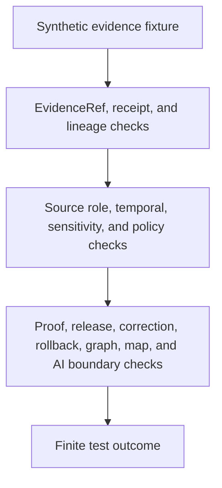

<!-- [KFM_META_BLOCK_V2]
doc_id: kfm://doc/tests-domains-roads-rail-trade-evidence-readme
title: Roads Rail Trade Evidence Tests README
type: test-index-readme
version: v0.1
status: draft; empty-placeholder-replaced; evidence-test-parent-index; PROPOSED / NEEDS VERIFICATION before promotion
owners:
  - OWNER_TBD - Roads/Rail/Trade Routes domain steward
  - OWNER_TBD - Evidence steward
  - OWNER_TBD - Receipt steward
  - OWNER_TBD - Redaction steward
  - OWNER_TBD - Proof steward
  - OWNER_TBD - Sensitivity reviewer
  - OWNER_TBD - Policy steward
  - OWNER_TBD - Release steward
  - OWNER_TBD - QA steward
created: 2026-07-06
updated: 2026-07-06
policy_label: public-doc; tests; roads-rail-trade; evidence; parent-index; redaction-receipt; evidence-ref; EvidenceBundle; proof-boundary; receipt-boundary; catalog-boundary; no-network; evidence-bound; policy-gated; release-gated; rollback-aware
tags: [kfm, tests, roads-rail-trade, evidence, evidence-tests, EvidenceRef, EvidenceBundle, ProofPack, RedactionReceipt, AggregationReceipt, ValidationReport, PolicyDecision, ReviewRecord, ReleaseManifest, CorrectionNotice, RollbackCard, source-role, valid-time, redaction, public-generalization, graph-derived, ABSTAIN, DENY, ERROR]
related:
  - ../../../README.md
  - ../../README.md
  - ../README.md
  - redaction_receipt_test/README.md
  - ../../../../data/receipts/roads-rail-trade/redaction/README.md
  - ../../../../data/proofs/roads-rail-trade/README.md
  - ../../../../docs/domains/roads-rail-trade/README.md
  - ../../../../docs/domains/roads-rail-trade/DATA_LIFECYCLE.md
  - ../../../../docs/domains/roads-rail-trade/IDENTITY_MODEL.md
  - ../../../../docs/domains/roads-rail-trade/OBJECT_FAMILIES.md
  - ../../../../docs/domains/roads-rail-trade/GRAPH_PROJECTIONS.md
  - ../../../../docs/domains/roads-rail-trade/MAP_UI_CONTRACTS.md
  - ../../../../docs/domains/roads-rail-trade/RELEASE_INDEX.md
  - ../../../../contracts/domains/roads-rail-trade/route_membership.md
  - ../../../../contracts/domains/roads-rail-trade/route_uncertainty_profile.md
  - ../../../../contracts/domains/roads-rail-trade/trade_route_corridor.md
  - ../../../../contracts/domains/roads-rail-trade/network_edge.md
  - ../../../../schemas/contracts/v1/domains/roads-rail-trade/
  - ../../../../fixtures/domains/roads-rail-trade/evidence/
  - ../../../../policy/domains/roads-rail-trade/
  - ../../../../release/candidates/roads-rail-trade/
notes:
  - "This README replaces the empty placeholder content at tests/domains/roads-rail-trade/evidence/README.md."
  - "Directory Rules place enforceability proof under tests/. This directory is a parent index for evidence-focused tests; it is not evidence, proof, receipt, catalog, policy, or release authority."
  - "Confirmed child README lane at authoring time is redaction_receipt_test/README.md. Other child lanes listed here are PROPOSED until files and executable tests are verified."
  - "A receipt lane is confirmed at data/receipts/roads-rail-trade/redaction/README.md; it is process memory, not proof, not policy, not release, and not a public path."
  - "Roads/Rail/Trade lifecycle docs state that public-safe candidates may require generalized historic geometry, redacted critical-facility detail, and corresponding RedactionReceipt / AggregationReceipt references that persist as EvidenceRef targets."
  - "Default posture is deterministic and no-network. Real source feeds, restricted coordinates, critical-facility details, sensitive historic/cultural route detail, credentials, production logs, proof payloads, and release artifacts do not belong in default evidence tests."
[/KFM_META_BLOCK_V2] -->

<a id="top"></a>

# Roads Rail Trade evidence tests

> Parent index for deterministic, no-network evidence guardrail tests in the Roads/Rail/Trade domain. These tests should prove that evidence references, receipts, redaction/generalization records, proof handoffs, policy checks, release gates, corrections, and rollback targets remain inspectable without turning tests into evidence authority, proof authority, receipt storage, catalog closure, public map truth, graph truth, or release approval.

<p>
  
  
  
  
  
  
</p>

**Path:** `tests/domains/roads-rail-trade/evidence/README.md`  
**Status:** draft / empty placeholder replaced / evidence test parent index / PROPOSED until executable tests are verified  
**Owning root:** `tests/`  
**Domain segment:** `roads-rail-trade`  
**Test lane family:** `evidence`  
**Default execution posture:** deterministic, synthetic, no-network, public-safe fixtures only  
**Truth posture:** CONFIRMED by current GitHub evidence that this target file existed as an empty placeholder before replacement; CONFIRMED child README exists for `redaction_receipt_test/`; CONFIRMED Roads/Rail/Trade receipt and lifecycle docs exist for redaction receipts, public-safe candidates, redaction/generalization, EvidenceRef persistence, graph-derived posture, and release gates; NEEDS VERIFICATION for executable evidence tests, accepted fixture homes, schema shapes, emitted receipts, proof integration, policy runtime, CI coverage, release integration, and pass rates.

---

## Purpose

`tests/domains/roads-rail-trade/evidence/` is the parent test index for evidence-focused guardrails in the Roads/Rail/Trade domain.

This subtree should prove that Roads/Rail/Trade evidence behavior remains governed across source refs, EvidenceRefs, EvidenceBundles, receipts, redaction/generalization records, proof handoffs, graph projections, public map carriers, AI summaries, release candidates, corrections, withdrawals, and rollback targets.

A passing test in this directory should **not** mean that source evidence is true, a route alignment is precise, a public layer is approved, a graph projection is canonical, a policy decision is authored, a proof is complete, a release manifest exists, or sensitive content may be exposed. It should mean only that the scoped evidence guardrail behaved as expected against bounded synthetic fixtures and local files.

[Back to top](#top)

---

## Placement Basis

Directory Rules classify `tests/` as the root that proves rules are enforceable. This directory is therefore an **evidence-test parent index** inside a domain lane. It does not own source payloads, proof records, receipt records, catalog records, policies, release manifests, public artifacts, graph exports, map outputs, or AI context.

| Responsibility | Correct home | This directory's relationship |
|---|---|---|
| Roads/Rail/Trade evidence tests | `tests/domains/roads-rail-trade/evidence/` | This directory. |
| Domain test root | `tests/domains/roads-rail-trade/` | Parent domain lane; currently observed as a greenfield stub. |
| Redaction receipt tests | `tests/domains/roads-rail-trade/evidence/redaction_receipt_test/` | Confirmed child README lane. |
| Receipt process memory | `data/receipts/roads-rail-trade/redaction/` | Confirmed README; process memory, not proof or release. |
| Proof authority | `data/proofs/` or accepted proof roots | EvidenceBundle, ProofPack, CatalogMatrix, and integrity proof authority; not owned here. |
| Catalog authority | `data/catalog/` or accepted catalog roots | Discovery and catalog authority; not owned here. |
| Semantic contracts | `contracts/domains/roads-rail-trade/` or ADR-selected alternate | Defines object meaning; not owned here. |
| Machine schemas | `schemas/contracts/v1/domains/roads-rail-trade/` or ADR-selected alternate | Defines accepted shapes; not owned here. |
| Reusable synthetic fixtures | `fixtures/domains/roads-rail-trade/evidence/` | Preferred fixture home if populated. |
| Policy rules | `policy/domains/roads-rail-trade/` or ADR-selected alternate | Sensitivity, rights, source-role, redaction, publication, and release decisions. |
| Release decisions | `release/` roots | ReleaseManifest, correction, withdrawal, rollback, signatures, cache invalidation, and derivative invalidation authority. |

> [!IMPORTANT]
> This README preserves the requested `tests/domains/roads-rail-trade/evidence/` path. It does not resolve the documented Roads/Rail/Trade slug conflict, define receipt layout, define proof closure, define public API behavior, or authorize publication.

[Back to top](#top)

---

## Parent Invariant

> **Evidence tests prove traceability guardrails; they do not become evidence.** A test can demonstrate that a Roads/Rail/Trade claim, receipt, redaction transform, graph projection, map carrier, or release candidate preserves evidence, source role, policy, review, release, correction, and rollback boundaries. It cannot create EvidenceBundle truth, proof closure, catalog closure, policy approval, public map authority, AI truth, or release approval.

Core checks:

| Check | Required behavior | Failure outcome |
|---|---|---|
| EvidenceRef resolution | Consequential outputs require EvidenceRef-to-EvidenceBundle support or fail closed. | `ABSTAIN` / validation failure. |
| Receipt boundary | Receipts record process memory and transform history; they do not prove source truth or approve release. | promotion block. |
| Proof boundary | Proof closure remains in proof roots and must not be replaced by README text, tests, receipts, logs, graph views, map labels, or AI summaries. | validation failure. |
| Source-role boundary | Evidence retains source role and cannot upcast context, candidate, administrative, modeled, or aggregate sources into authority. | `DENY` / `ABSTAIN`. |
| Temporal boundary | Evidence keeps source, observed, valid, retrieval, release, and correction times distinct where material. | validation failure / `ABSTAIN`. |
| Redaction boundary | Redacted/generalized outputs carry receipt refs and do not expose restricted input payloads, precise sensitive geometry, or private review notes. | validation failure / `ERROR`. |
| Policy boundary | Rights, sensitivity, legal status, access, safety, historic/cultural uncertainty, and infrastructure-adjacent exposure fail closed without policy and review support. | `DENY` / `ABSTAIN`. |
| Graph boundary | Network nodes, edges, route memberships, and movement story nodes remain derived evidence carriers, not canonical truth. | validation failure. |
| Public-surface boundary | Public API, map, tile, screenshot, Focus Mode, AI, and export carriers cannot treat evidence-test success as publication. | promotion block / `DENY`. |
| Correction/rollback boundary | Evidence-dependent outputs preserve correction, withdrawal, and rollback paths. | promotion block. |
| No-network boundary | Default evidence tests do not call live feeds, source APIs, routing engines, legal-status systems, graph databases, map services, or public APIs. | validation failure / `ERROR`. |

---

## Lane Index

| Lane | Status | Purpose | Boundary |
|---|---|---|---|
| [`redaction_receipt_test/`](redaction_receipt_test/README.md) | CONFIRMED README / executable tests NEEDS VERIFICATION | Proves `RedactionReceipt` behavior records redaction/generalization and sensitive-detail removal with lineage, policy, review, correction, and rollback refs. | Does not prove evidence truth, policy approval, proof closure, catalog closure, release approval, graph truth, map truth, or AI truth. |
| `evidence_ref_resolution_test/` | PROPOSED | Would prove EvidenceRefs resolve to EvidenceBundles before public-safe claim, graph, map, Focus Mode, or AI carriers answer. | EvidenceBundle records do not live here. |
| `proof_closure_test/` | PROPOSED | Would prove proof closure is required before catalog/release use and cannot be replaced by receipts, tests, or generated language. | Proof authority remains in proof roots. |
| `source_role_evidence_test/` | PROPOSED | Would prove source-role tags remain visible and prevent administrative/candidate/context/model/aggregate sources from being treated as authority. | SourceDescriptor schema and source registry do not live here. |
| `citation_visibility_test/` | PROPOSED | Would prove public outputs preserve citation, caveat, uncertainty, and evidence drawer visibility where permitted. | Public UI and API implementation do not live here. |
| `receipt_lineage_test/` | PROPOSED | Would prove redaction, aggregation, validation, correction, withdrawal, and rollback receipts retain lineage without exposing sensitive payloads. | Receipt storage does not live here. |
| `graph_evidence_projection_test/` | PROPOSED | Would prove graph projections cite evidence and remain rebuildable or rollbackable without replacing canonical records. | Graph implementation does not live here. |
| `release_evidence_gate_test/` | PROPOSED | Would prove release candidates require evidence, proof, policy, review, correction path, and rollback target before public exposure. | Release authority does not live here. |
| `no_network_test/` | PROPOSED | Would prove default evidence tests are local and deterministic. | Connector and integration tests require separate gates. |

Only `redaction_receipt_test/` was confirmed as an authored child README lane at the time this parent index was created. Other lanes are backlog signposts, not claims of implementation.

[Back to top](#top)

---

## Evidence-Test Flow



The diagram describes the expected test responsibility order only. It does not prove that EvidenceBundles, proofs, receipt schemas, validators, fixtures, policy runtime, release jobs, graph projections, map behavior, AI behavior, or CI jobs currently exist.

---

## Accepted Inputs

Only bounded, synthetic, reviewable inputs belong in this lane family:

- Synthetic evidence fixtures with fake source refs, object refs, EvidenceRefs, EvidenceBundle refs, receipt refs, proof refs, policy refs, review refs, release refs, correction refs, withdrawal refs, rollback refs, and finite outcomes.
- Synthetic companion records for `RouteMembership`, `RouteUncertaintyProfile`, `TradeRouteCorridor`, `HistoricRouteClaim`, `NetworkEdge`, `NetworkNode`, `StatusEvent`, `RestrictionEvent`, `TransportFacility`, and public-safe derivative behavior.
- Synthetic source-role cases for observed, regulatory, modeled, aggregate, administrative, candidate, and synthetic source posture where accepted vocabulary supports those roles.
- Synthetic temporal cases for source time, observed time, valid time, retrieval time, release time, correction time, stale evidence, conflicting evidence, approximate historic ranges, supersession, correction, withdrawal, and rollback.
- Synthetic RedactionReceipt, AggregationReceipt, ValidationReport, PolicyDecision, ReviewRecord, EvidenceBundle stub, ProofPack stub, ReleaseManifest, CorrectionNotice, WithdrawalNotice, and RollbackCard references.
- Canary values that make accidental source-payload echoing, sensitive-geometry exposure, legal-status overclaiming, public-access overclaiming, graph-truth leakage, map-truth leakage, AI leakage, logging, or public export obvious.
- Local validation envelopes emitted by test helpers.

Safe outputs may include public-safe references and operational fields such as fixture ID, object family, evidence ref, proof ref, receipt ID, source role, time kind, validator name, finite outcome, policy decision ID, reason code, correction ref, and rollback ref.

---

## Exclusions

Do **not** place these materials in this lane family:

| Excluded material | Why it does not belong here | Correct direction |
|---|---|---|
| Real source exports, source APIs, live feeds, legal-status records, routing responses, or public API payloads | Rights, authority, sensitivity, freshness, and release status cannot be assumed inside default tests. | Use synthetic fixtures or separately gated source/connector tests. |
| Restricted coordinates, facility condition details, precise cultural/historic route traces, private review notes, or sensitive route geometry | Direct exposure defeats evidence and redaction guardrails. | Use canaries, fake coordinates, or generalized synthetic geometry. |
| Credentials, tokens, API keys, cookies, auth headers, or private endpoint URLs | Security exposure. | Secret manager or fake local values only. |
| Real EvidenceBundle records, ProofPacks, production receipts, catalog records, release manifests, or correction/rollback records | These may carry controlled evidence, internal refs, policy state, or release metadata. | Their governed roots with access controls. |
| EvidenceBundle/proof schema definitions, receipt schemas, policy rules, or release policy | Authority does not live in tests. | `schemas/`, `contracts/`, `policy/`, `data/proofs/`, `data/receipts/`, and `release/`. |
| Public graph exports, vector tiles, screenshots, map layers, Focus Mode outputs, AI context packets, or public API payloads | Publication and public exposure require governed release. | Governed API, release, and accepted artifact homes. |
| Pipeline code, graph implementation, map implementation, AI prompt/runtime implementation, or API implementation | Implementation authority does not live in this README. | Accepted package, pipeline, runtime, graph, and API homes. |

[Back to top](#top)

---

## Suggested Layout

```text
tests/domains/roads-rail-trade/evidence/
|-- README.md
|-- redaction_receipt_test/
|   `-- README.md
|-- evidence_ref_resolution_test/
|-- proof_closure_test/
|-- source_role_evidence_test/
|-- citation_visibility_test/
|-- receipt_lineage_test/
|-- graph_evidence_projection_test/
|-- release_evidence_gate_test/
`-- no_network_test/
```

Only `redaction_receipt_test/` is confirmed as an authored child README lane at the time this README was created. Other directories are **PROPOSED** until files and executable tests exist.

---

## Run Posture

No executable runner was verified while authoring this README. Once tests exist, the expected local command should be documented and verified here.

```bash
: "PROPOSED / NEEDS VERIFICATION"
pytest tests/domains/roads-rail-trade/evidence
```

Required run posture:

- no network access
- no real source feeds or live status feeds
- no real legal-status or routing endpoints
- no real credentials
- no production logs or telemetry
- no restricted coordinates, facility details, precise sensitive route traces, private review notes, production EvidenceBundles, production receipts, proof payloads, or release artifacts
- no public artifact writes
- no public API, map, tile, screenshot, graph export, release, correction, rollback, or AI-context writes
- deterministic fixture inputs
- finite outcomes only: `PASS`, `DENY`, `ABSTAIN`, or `ERROR`

---

## Minimal Parent Evidence Fixture

Synthetic parent fixtures should make evidence boundaries inspectable without carrying real transport data.

```json
{
  "fixture_id": "roads-rail-trade-evidence-parent-example",
  "object_family": "TradeRouteCorridor",
  "source_descriptor_id": "source-descriptor-fixture-evidence-parent-001",
  "source_role": "administrative",
  "evidence_ref": "evidence-ref-fixture-parent-001",
  "evidence_bundle_ref": "evidence-bundle-fixture-parent-001",
  "redaction_receipt_ref": "redaction-receipt-fixture-parent-001",
  "proof_pack_ref": null,
  "policy_decision_ref": "policy-decision-fixture-parent-001",
  "review_record_ref": "review-record-fixture-parent-001",
  "release_manifest_ref": null,
  "correction_notice_ref": null,
  "rollback_card_ref": "rollback-card-fixture-parent-001",
  "expected_outcome": "ABSTAIN",
  "safe_result_fields": {
    "validator_name": "evidence_boundary_parent_guardrail",
    "reason_code": "EVIDENCE_TEST_DOES_NOT_AUTHORIZE_PUBLICATION"
  },
  "must_not_claim": [
    "SOURCE_TRUTH_CANARY",
    "LEGAL_DESIGNATION_CANARY",
    "PUBLIC_ACCESS_CANARY",
    "RAW_COORDINATE_CANARY",
    "GRAPH_TRUTH_CANARY",
    "MAP_TRUTH_CANARY",
    "AI_TRUTH_CANARY",
    "RELEASE_APPROVAL_CANARY"
  ]
}
```

The JSON above is illustrative. Accepted schema, field names, evidence vocabulary, proof vocabulary, receipt vocabulary, source-role vocabulary, reason codes, and fixture homes remain **NEEDS VERIFICATION**.

---

## Evidence Ledger

| Source | Status | Supports | Limits |
|---|---|---|---|
| `Directory Rules.pdf` | CONFIRMED doctrine | `tests/` is the canonical enforceability root; file placement follows responsibility root rather than topic. | Does not prove executable tests, fixtures, CI, schema, receipt emission, proof closure, or runtime behavior. |
| `tests/domains/roads-rail-trade/evidence/redaction_receipt_test/README.md` | CONFIRMED child lane README | Defines redaction receipt evidence-test posture and receipt-not-release / receipt-not-proof boundaries. | Does not prove executable redaction receipt tests exist. |
| `data/receipts/roads-rail-trade/redaction/README.md` | CONFIRMED repo evidence | Defines the redaction receipt lane as process memory; says receipts are not proof, policy, release, or public path. | README presence does not prove emitted receipts, validators, signing, policy enforcement, review workflow, correction hooks, rollback hooks, or release integration. |
| `docs/domains/roads-rail-trade/DATA_LIFECYCLE.md` | CONFIRMED repo evidence | States public-safe candidates may require generalized historic geometry, redacted critical-facility detail, corresponding RedactionReceipt/AggregationReceipt references, EvidenceRef persistence, graph-derived posture, governed APIs, and release gates. | Implementation-layer paths and artifact IDs remain PROPOSED in that doc. |
| `docs/domains/roads-rail-trade/IDENTITY_MODEL.md` | CONFIRMED repo evidence | Supports source-role anti-collapse, temporal kind separation, identity envelope, and release/correction identity boundaries. | Does not prove implementation. |
| `tests/domains/roads-rail-trade/README.md` | CONFIRMED repo evidence | Domain test root exists as a greenfield stub. | Does not provide mature evidence-test guidance or executable coverage. |
| GitHub target file before update | CONFIRMED repo evidence | `tests/domains/roads-rail-trade/evidence/README.md` existed as empty placeholder content before replacement. | Placeholder proves path existence only. |

---

## Validation Checklist

- [ ] Confirm accepted parent evidence-test indexing convention for `tests/domains/roads-rail-trade/evidence/`.
- [ ] Confirm accepted fixture home and naming convention for Roads/Rail/Trade evidence-test fixtures.
- [ ] Confirm accepted EvidenceRef, EvidenceBundle, ProofPack, RedactionReceipt, AggregationReceipt, ValidationReport, PolicyDecision, ReviewRecord, ReleaseManifest, CorrectionNotice, WithdrawalNotice, and RollbackCard schema locations.
- [ ] Confirm accepted source-role vocabulary, time-kind vocabulary, evidence refs, proof refs, receipt refs, policy outcomes, release refs, correction refs, rollback refs, and finite outcome reason codes.
- [ ] Add executable tests for EvidenceRef resolution, proof closure, receipt lineage, redaction receipt guardrails, source-role preservation, temporal separation, policy/review refs, graph-derived posture, public-surface release gates, AI boundary, correction/rollback behavior, and no-network behavior.
- [ ] Confirm tests do not use real source feeds, legal-status endpoints, routing services, graph databases, credentials, production logs, restricted coordinates, precise sensitive route traces, private review notes, production EvidenceBundles, production receipts, proof payloads, or public artifact writes.
- [ ] Confirm graph, map, API, tile, screenshot, Focus Mode, AI context, and export outputs cannot bypass EvidenceBundle resolution, source role, temporal scope, receipt checks, proof closure, policy, review, release, correction, withdrawal, or rollback controls.
- [ ] Wire the lane into CI only after executable tests and safe fixtures exist.

---

## Rollback

Rollback is required if this lane starts to:

- store real transport source exports, live status feeds, legal-status records, route data, restriction data, routing responses, credentials, production logs, restricted coordinates, precise sensitive route traces, private review notes, production EvidenceBundles, production receipts, proof payloads, or public artifacts
- define EvidenceBundle schema, proof closure, receipt schema, policy, catalog authority, release authority, graph implementation, map implementation, AI behavior, or API behavior instead of testing them
- treat an evidence-test pass as source truth, proof closure, policy approval, public-access proof, route availability proof, live-routing proof, graph truth, map truth, AI truth, or release approval
- allow sensitive content to leak through fixtures, snapshots, README text, logs, graph exports, map outputs, screenshots, API payloads, Focus Mode carriers, or AI context
- bypass source admission, EvidenceBundle resolution, source role, temporal scope, rights, sensitivity, policy decisions, review state, release state, correction, withdrawal, or rollback controls
- weaken fail-closed behavior for missing evidence, missing proof, missing receipts, missing policy refs, missing review refs, stale evidence, historic overprecision, critical-facility exposure, unresolved release state, or derived graph/map outputs

Rollback target: restore the previous safe README revision or remove this parent index until child lane placement, fixtures, schemas, evidence vocabulary, proof vocabulary, receipt vocabulary, source-role handling, policy expectations, release relationship, correction behavior, rollback behavior, and CI integration are reverified.

[Back to top](#top)