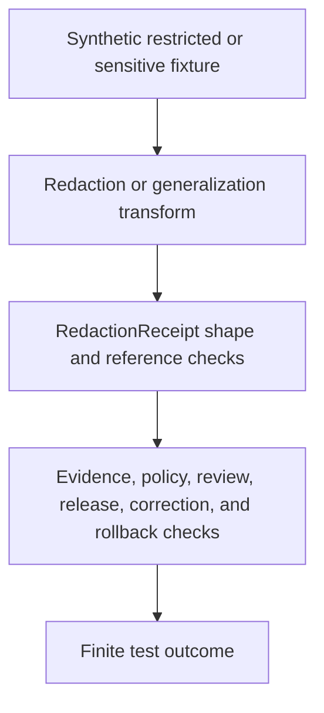

<!-- [KFM_META_BLOCK_V2]
doc_id: kfm://doc/tests-domains-roads-rail-trade-evidence-redaction-receipt-test-readme
title: Roads Rail Trade Redaction Receipt Evidence Test README
type: test-lane-readme
version: v0.1
status: draft; empty-placeholder-replaced; evidence-test-lane; redaction-receipt-guardrail; PROPOSED / NEEDS VERIFICATION before promotion
owners:
  - OWNER_TBD - Roads/Rail/Trade Routes domain steward
  - OWNER_TBD - Evidence steward
  - OWNER_TBD - Receipt steward
  - OWNER_TBD - Redaction steward
  - OWNER_TBD - Sensitivity reviewer
  - OWNER_TBD - Policy steward
  - OWNER_TBD - Release steward
  - OWNER_TBD - QA steward
created: 2026-07-06
updated: 2026-07-06
policy_label: public-doc; tests; roads-rail-trade; evidence; redaction-receipt; receipt-process-memory; public-generalization; sensitive-route-review; critical-facility-redaction; no-network; evidence-bound; policy-gated; release-gated; rollback-aware
tags: [kfm, tests, roads-rail-trade, evidence, redaction, redaction-receipt, public-generalization, receipt, EvidenceRef, EvidenceBundle, RedactionReceipt, AggregationReceipt, ValidationReport, PolicyDecision, ReviewRecord, ReleaseManifest, CorrectionNotice, RollbackCard, ABSTAIN, DENY, ERROR]
related:
  - ../README.md
  - ../../README.md
  - ../../../README.md
  - ../../../../README.md
  - ../../../../../data/receipts/roads-rail-trade/redaction/README.md
  - ../../../../../docs/domains/roads-rail-trade/DATA_LIFECYCLE.md
  - ../../../../../docs/domains/roads-rail-trade/RELEASE_INDEX.md
  - ../../../../../docs/domains/roads-rail-trade/GRAPH_PROJECTIONS.md
  - ../../../../../docs/domains/roads-rail-trade/MAP_UI_CONTRACTS.md
  - ../../../../../contracts/domains/roads-rail-trade/route_uncertainty_profile.md
  - ../../../../../contracts/domains/roads-rail-trade/trade_route_corridor.md
  - ../../../../../contracts/domains/roads-rail-trade/network_edge.md
  - ../../../../../schemas/contracts/v1/domains/roads-rail-trade/redaction_receipt.schema.json
  - ../../../../../fixtures/domains/roads-rail-trade/evidence/redaction_receipt/
  - ../../../../../policy/domains/roads-rail-trade/
  - ../../../../../release/candidates/roads-rail-trade/
notes:
  - "This README replaces the empty placeholder content at tests/domains/roads-rail-trade/evidence/redaction_receipt_test/README.md."
  - "Directory Rules place enforceability proof under tests/. This lane tests redaction receipt behavior; it does not define receipt storage, policy, proof, catalog, or release authority."
  - "The parent tests/domains/roads-rail-trade/evidence/README.md was checked during authoring and was not found. This child lane is self-contained until a parent evidence-test index is authored."
  - "A receipt lane is confirmed at data/receipts/roads-rail-trade/redaction/README.md. That lane is process memory, not proof, not policy, not release, and not a public path."
  - "Roads/Rail/Trade lifecycle docs state that public-safe candidates may require generalized historic geometry, redacted critical-facility detail, and corresponding RedactionReceipt / AggregationReceipt references that persist as EvidenceRef targets."
  - "Default posture is deterministic and no-network. Real source feeds, restricted coordinates, critical-facility details, sensitive historic/cultural route detail, credentials, production logs, and release artifacts do not belong in default tests."
[/KFM_META_BLOCK_V2] -->

<a id="top"></a>

# Roads Rail Trade redaction receipt evidence tests

> Deterministic, no-network test documentation for proving that Roads/Rail/Trade `RedactionReceipt` behavior records public generalization and sensitive-detail removal without becoming proof, policy, catalog authority, release approval, route truth, graph truth, map truth, or generated-answer truth.

<p>
  
  
  
  
  
  
</p>

**Path:** `tests/domains/roads-rail-trade/evidence/redaction_receipt_test/README.md`  
**Status:** draft / empty placeholder replaced / evidence test lane / PROPOSED until executable tests are verified  
**Owning root:** `tests/`  
**Domain segment:** `roads-rail-trade`  
**Test lane:** `evidence/redaction_receipt_test`  
**Default execution posture:** deterministic, synthetic, no-network, public-safe fixtures only  
**Truth posture:** CONFIRMED by current GitHub evidence that this target file existed as an empty placeholder before replacement; CONFIRMED receipt documentation exists at `data/receipts/roads-rail-trade/redaction/README.md`; CONFIRMED parent `tests/domains/roads-rail-trade/evidence/README.md` was not found during authoring; CONFIRMED Roads/Rail/Trade lifecycle docs describe redaction/generalization and RedactionReceipt references as part of public-safe candidate handling; NEEDS VERIFICATION for executable tests, accepted fixture shape, schema shape, emitted receipts, validators, policy runtime, CI coverage, release integration, and pass rates.

---

## Purpose

`tests/domains/roads-rail-trade/evidence/redaction_receipt_test/` is the requested evidence test lane for Roads/Rail/Trade `RedactionReceipt` behavior.

This lane should prove that a redaction receipt is present, bounded, inspectable, and policy-linked when transport evidence has been redacted, generalized, withheld, or transformed for public-safe use. It should verify the receipt references the input, output, transform, policy, review, evidence, validation, correction, rollback, and release-candidate context needed for audit.

A passing test here should **not** mean that source evidence is true, a route alignment is precise, a public layer is approved, a graph projection is canonical, a policy decision is authored, a release manifest exists, or sensitive content may be exposed. It should mean only that the scoped receipt guardrail behaved as expected against bounded synthetic fixtures and local files.

[Back to top](#top)

---

## Placement Basis

Directory Rules classify `tests/` as the root that proves rules are enforceable. This path is therefore an evidence-focused test lane. It does not own the receipt records, redaction policy, proof objects, catalog objects, release decisions, map artifacts, graph exports, or source payloads.

| Responsibility | Correct home | This lane's relationship |
|---|---|---|
| Redaction receipt tests | `tests/domains/roads-rail-trade/evidence/redaction_receipt_test/` | This directory. |
| Parent evidence test index | `tests/domains/roads-rail-trade/evidence/README.md` | Not found during authoring; NEEDS VERIFICATION. |
| Domain test root | `tests/domains/roads-rail-trade/README.md` | Confirmed greenfield stub. |
| Redaction receipt storage | `data/receipts/roads-rail-trade/redaction/` | Confirmed README; process memory, not proof or release. |
| Lifecycle and evidence posture | `docs/domains/roads-rail-trade/DATA_LIFECYCLE.md` | Explains redaction/generalization and EvidenceRef persistence. |
| Proof authority | `data/proofs/` | EvidenceBundle, ProofPack, and integrity proof authority; not owned here. |
| Catalog authority | `data/catalog/` | Discovery and catalog authority; not owned here. |
| Policy authority | `policy/` or accepted policy roots | Redaction, sensitivity, rights, and publication policy; not owned here. |
| Release authority | `release/` roots | ReleaseManifest, correction, withdrawal, rollback, and signatures; not owned here. |
| Reusable synthetic fixtures | `fixtures/domains/roads-rail-trade/evidence/redaction_receipt/` | Preferred fixture home if populated. |

> [!IMPORTANT]
> This README documents a test lane. It cannot authorize publication, create a public-safe artifact, define policy, define receipt schema, define proof closure, or settle the Roads/Rail/Trade slug conflict.

[Back to top](#top)

---

## Invariant Under Test

> **A redaction receipt records a governed transform; it is not the truth source and not release approval.** The receipt must preserve enough lineage to audit what changed, why it changed, who or what authorized the transform, what was produced, and how to correct or roll it back, while keeping sensitive payloads out of test logs, README text, public outputs, graph exports, map carriers, and AI context.

Core checks:

| Check | Required behavior | Failure outcome |
|---|---|---|
| Receipt presence | A public-safe derivative that required redaction/generalization has a RedactionReceipt or an explicit abstain/deny reason. | `ABSTAIN` / validation failure. |
| Receipt-not-proof boundary | Receipt records process memory; proof closure remains separate and EvidenceBundle support is still required. | promotion block. |
| Receipt-not-release boundary | Receipt may support release review; it never approves publication by itself. | promotion block / `DENY`. |
| Input/output hash boundary | Receipt records input and output hash refs without embedding restricted input payload. | validation failure. |
| Transform boundary | Receipt identifies the redaction, generalization, aggregation, suppression, masking, or withholding transform applied. | validation failure. |
| Policy and review boundary | Receipt cites PolicyDecision and ReviewRecord refs where sensitivity, rights, historic/cultural uncertainty, infrastructure-adjacent detail, or public release is involved. | `DENY` / `ABSTAIN`. |
| Sensitive-content boundary | Tests must not expose restricted coordinates, facility details, culturally sensitive route detail, restricted source text, private notes, secrets, or raw payloads. | validation failure / `ERROR`. |
| EvidenceRef boundary | Receipt references can persist as EvidenceRef targets, but any public claim must still resolve evidence and policy before answering. | `ABSTAIN`. |
| Graph boundary | Redacted/generalized graph projections remain derived and rollbackable. | validation failure. |
| Map and AI boundary | Map labels, Focus Mode summaries, screenshots, tiles, exports, and AI answers cannot treat redaction as truth or release. | `DENY` / `ABSTAIN`. |
| Correction and rollback boundary | Receipt links correction, withdrawal, and rollback targets when public-safe outputs or release candidates depend on the transform. | promotion block. |
| No-network boundary | Default tests do not call live feeds, source APIs, map services, graph databases, routing engines, legal-status systems, or public APIs. | validation failure / `ERROR`. |

---

## Receipt Guardrail Flow



The diagram describes the intended test flow only. It does not prove that receipt schemas, emitted receipts, validators, fixtures, policy runtime, release jobs, graph projections, map behavior, AI behavior, or CI jobs currently exist.

---

## Expected Test Families

| Family | Purpose | Required boundary |
|---|---|---|
| Receipt presence tests | Ensure redacted or generalized public-safe candidates carry receipt references or fail closed. | Redaction cannot be invisible. |
| Sensitive payload tests | Ensure restricted detail is not echoed in receipts, logs, README files, snapshots, graph exports, map carriers, or AI context. | Receipt records refs and hashes, not restricted payload. |
| Input/output digest tests | Ensure receipt links input and output digests and transform refs. | Output must be auditable without exposing source content. |
| Policy/reference tests | Ensure PolicyDecision and ReviewRecord refs are required for sensitivity or release-candidate handoffs. | Receipt does not author policy. |
| EvidenceRef tests | Ensure receipt refs can support EvidenceRef lineage without becoming proof. | EvidenceBundle still outranks receipt text. |
| Generalized geometry tests | Ensure historic, cultural, sensitive, or infrastructure-adjacent location data is generalized before public candidates. | Public geometry is not raw geometry. |
| Graph projection tests | Ensure redacted/generalized graph views remain derived and rollbackable. | Graph is not canonical truth. |
| Release gate tests | Ensure receipt presence does not become ReleaseManifest, public API, map, tile, Focus Mode, or AI approval. | Redaction is not release. |
| Correction and rollback tests | Ensure receipt-dependent outputs can be corrected, withdrawn, or invalidated. | Redaction history remains auditable. |
| No-network tests | Ensure default lane execution is local and deterministic. | No live systems in default tests. |

---

## Accepted Inputs

Only bounded, synthetic, reviewable inputs belong in this lane:

- Synthetic redaction receipt fixtures with fake run IDs, source refs, object refs, transform refs, evidence refs, policy refs, reviewer refs, input hashes, output hashes, validation refs, correction refs, rollback refs, and finite outcomes.
- Synthetic sensitive-detail canaries for modern route detail, historic route precision, cultural corridor overprecision, infrastructure-adjacent detail, restriction/status detail, facility detail, source-text echo, private notes, secrets, and public-output leakage.
- Synthetic companion records for `RouteMembership`, `TradeRouteCorridor`, `HistoricRouteClaim`, `NetworkEdge`, `RouteUncertaintyProfile`, `StatusEvent`, `RestrictionEvent`, `TransportFacility`, and public-safe derivative behavior.
- Synthetic EvidenceRef, EvidenceBundle stub, ValidationReport, PolicyDecision, ReviewRecord, ReleaseManifest, CorrectionNotice, WithdrawalNotice, RedactionReceipt, AggregationReceipt, and RollbackCard references.
- Local validation envelopes emitted by test helpers.

Safe outputs may include public-safe references and operational fields such as fixture ID, receipt ID, run ID, transform name, input digest, output digest, policy decision ID, review record ID, validator name, finite outcome, reason code, evidence ref, and rollback ref.

> [!IMPORTANT]
> A receipt can make a transform auditable. It must not make hidden sensitive details recoverable from logs, fixtures, generated summaries, public maps, graph exports, or AI context packets.

---

## Exclusions

Do **not** place these materials in this lane:

| Excluded material | Why it does not belong here | Correct direction |
|---|---|---|
| Real source exports, source APIs, live feeds, legal-status records, or public API payloads | Rights, authority, sensitivity, freshness, and release status cannot be assumed inside default tests. | Use synthetic fixtures or separately gated source/connector tests. |
| Restricted coordinates, facility condition details, precise cultural/historic route traces, private review notes, or sensitive route geometry | Direct exposure defeats the redaction test purpose. | Use canaries, fake coordinates, or generalized synthetic geometry. |
| Credentials, tokens, API keys, cookies, auth headers, or private endpoint URLs | Security exposure. | Secret manager or fake local values only. |
| Real RedactionReceipt records or production receipt logs | These may contain process memory, source refs, reviewer refs, or restricted operational detail. | `data/receipts/roads-rail-trade/redaction/` with access controls. |
| EvidenceBundle, ProofPack, CatalogMatrix, or integrity proof | Authority does not live in tests. | `data/proofs/` and accepted proof roots. |
| Policy rules or sensitivity registers | Authority does not live in this lane. | `policy/` and governed policy roots. |
| Release manifests, correction notices, rollback cards, public graph exports, vector tiles, screenshots, map layers, or Focus Mode outputs | Publication and rollback require governed release roots. | `release/`, governed API, and accepted artifact homes. |
| Pipeline code, graph implementation, map implementation, AI prompt/runtime implementation, or API implementation | Implementation authority does not live in this README. | Accepted package, pipeline, runtime, graph, and API homes. |

[Back to top](#top)

---

## Suggested Layout

```text
tests/domains/roads-rail-trade/evidence/redaction_receipt_test/
|-- README.md
|-- test_redaction_receipt_required_for_public_safe_derivative.py
|-- test_redaction_receipt_does_not_embed_sensitive_payload.py
|-- test_redaction_receipt_records_input_output_hashes.py
|-- test_redaction_receipt_requires_policy_and_review_refs.py
|-- test_redaction_receipt_is_evidence_ref_not_proof.py
|-- test_generalized_geometry_does_not_reveal_raw_geometry.py
|-- test_graph_projection_uses_redacted_output_only.py
|-- test_receipt_presence_does_not_authorize_release.py
|-- test_correction_and_rollback_refs_required.py
`-- test_redaction_receipt_no_network.py
```

This layout is **PROPOSED** until executable files exist in the repository.

---

## Run Posture

No executable runner was verified while authoring this README. Once tests exist, the expected local command should be documented and verified here.

```bash
: "PROPOSED / NEEDS VERIFICATION"
pytest tests/domains/roads-rail-trade/evidence/redaction_receipt_test
```

Required run posture:

- no network access
- no real source feeds or live status feeds
- no real legal-status or routing endpoints
- no real credentials
- no production logs or telemetry
- no restricted coordinates, facility details, precise sensitive route traces, or private review notes
- no public artifact writes
- no public API, map, tile, screenshot, graph export, release, correction, rollback, or AI-context writes
- deterministic fixture inputs
- finite outcomes only: `PASS`, `DENY`, `ABSTAIN`, or `ERROR`

---

## Minimal Redaction Receipt Fixture

Synthetic fixtures should make receipt boundaries inspectable without carrying real transport data.

```json
{
  "fixture_id": "roads-rail-trade-redaction-receipt-example",
  "receipt_id": "redaction-receipt-fixture-001",
  "domain": "roads-rail-trade",
  "object_ref": "trade-route-corridor-fixture-001",
  "source_descriptor_id": "source-descriptor-fixture-redaction-001",
  "source_role": "administrative",
  "transform": {
    "kind": "generalize_geometry",
    "reason_code": "SENSITIVE_ROUTE_PRECISION_REDACTED_FOR_PUBLIC_CANDIDATE"
  },
  "input_digest_ref": "digest-fixture-input-redacted-away-001",
  "output_digest_ref": "digest-fixture-output-public-safe-001",
  "evidence_ref": "evidence-ref-fixture-redaction-001",
  "validation_report_ref": "validation-report-fixture-redaction-001",
  "policy_decision_ref": "policy-decision-fixture-redaction-001",
  "review_record_ref": "review-record-fixture-redaction-001",
  "release_manifest_ref": null,
  "correction_notice_ref": null,
  "rollback_card_ref": "rollback-card-fixture-redaction-001",
  "expected_outcome": "ABSTAIN",
  "must_not_expose": [
    "RAW_COORDINATE_CANARY",
    "CRITICAL_FACILITY_DETAIL_CANARY",
    "CULTURAL_ROUTE_PRECISION_CANARY",
    "PRIVATE_REVIEW_NOTE_CANARY",
    "SOURCE_PAYLOAD_ECHO_CANARY",
    "RELEASE_APPROVAL_CANARY"
  ]
}
```

The JSON above is illustrative. Accepted schema, field names, transform names, reason codes, source-role vocabulary, receipt shape, digest vocabulary, and fixture homes remain **NEEDS VERIFICATION**.

---

## Evidence Ledger

| Source | Status | Supports | Limits |
|---|---|---|---|
| `Directory Rules.pdf` | CONFIRMED doctrine | `tests/` is the canonical enforceability root; file placement follows responsibility root rather than topic. | Does not prove executable tests, fixtures, CI, schema, receipt emission, or runtime behavior. |
| `data/receipts/roads-rail-trade/redaction/README.md` | CONFIRMED repo evidence | Defines the redaction receipt lane as process memory; says redaction is not release, receipts are not proof, public clients do not read receipts directly, and accepted material includes RedactionReceipt references. | README presence does not prove emitted receipts, validators, signing, policy enforcement, review workflow, correction hooks, rollback hooks, or release integration. |
| `docs/domains/roads-rail-trade/DATA_LIFECYCLE.md` | CONFIRMED repo evidence | States public-safe candidates may require generalized historic geometry, redacted critical-facility detail, corresponding RedactionReceipt/AggregationReceipt references, EvidenceRef persistence, derived graphs, governed APIs, and release gates. | Implementation-layer paths and artifact IDs remain PROPOSED in that doc. |
| `tests/domains/roads-rail-trade/README.md` | CONFIRMED repo evidence | Domain test root exists as a greenfield stub. | Does not provide mature evidence-test guidance or executable coverage. |
| `tests/domains/roads-rail-trade/evidence/README.md` | CONFIRMED not found in GitHub fetch | Parent evidence test index is missing at authoring time. | Does not block this child README, but parent index remains a validation item. |
| `schemas/contracts/v1/domains/roads-rail-trade/redaction_receipt.schema.json` | NEEDS VERIFICATION | Potential paired schema path for receipt shape. | Was not confirmed during this authoring pass. |
| GitHub target file before update | CONFIRMED repo evidence | `tests/domains/roads-rail-trade/evidence/redaction_receipt_test/README.md` existed as empty placeholder content before replacement. | Placeholder proves path existence only. |

---

## Validation Checklist

- [ ] Confirm or create parent evidence test index at `tests/domains/roads-rail-trade/evidence/README.md`.
- [ ] Confirm accepted fixture home and naming convention for redaction receipt test fixtures.
- [ ] Confirm accepted RedactionReceipt schema location, including unresolved slug conflict with possible alternate schema/contract segment.
- [ ] Confirm accepted fields for receipt ID, run ID, transform refs, input/output hashes, policy refs, reviewer refs, evidence refs, validation refs, release refs, correction refs, rollback refs, and finite outcomes.
- [ ] Add executable tests for receipt presence, no sensitive payload echo, input/output digest refs, policy/review refs, EvidenceRef-not-proof boundary, generalized geometry, graph-derived posture, release gate, correction/rollback refs, and no-network behavior.
- [ ] Confirm tests do not use real source feeds, legal-status endpoints, routing services, graph databases, credentials, production logs, restricted coordinates, precise sensitive route traces, private review notes, or public artifact writes.
- [ ] Confirm graph, map, API, tile, screenshot, Focus Mode, AI context, and export outputs cannot bypass EvidenceBundle resolution, source role, temporal scope, redaction receipt checks, policy, review, release, correction, withdrawal, or rollback controls.
- [ ] Wire the lane into CI only after executable tests and safe fixtures exist.

---

## Rollback

Rollback is required if this lane starts to:

- store real transport source exports, live status feeds, legal-status records, route data, restriction data, routing responses, credentials, production logs, restricted coordinates, precise sensitive route traces, private review notes, or public artifacts
- define receipt schema, policy, proof, catalog, release authority, graph implementation, map implementation, AI behavior, or API behavior instead of testing them
- treat a RedactionReceipt as proof closure, policy approval, public-safe approval, ReleaseManifest, route truth, graph truth, map truth, AI truth, or publication approval
- allow sensitive content to leak through fixtures, snapshots, README text, logs, graph exports, map outputs, screenshots, API payloads, Focus Mode carriers, or AI context
- bypass source admission, EvidenceBundle resolution, source role, temporal scope, rights, sensitivity, policy decisions, review state, release state, correction, withdrawal, or rollback controls
- weaken fail-closed behavior for missing receipts, missing hashes, missing policy refs, missing review refs, stale evidence, historic overprecision, critical-facility exposure, unresolved release state, or derived graph/map outputs

Rollback target: restore the previous safe README revision or remove this test lane until parent index placement, fixtures, schema posture, receipt vocabulary, source-role handling, policy expectations, release relationship, correction behavior, rollback behavior, and CI integration are reverified.

[Back to top](#top)