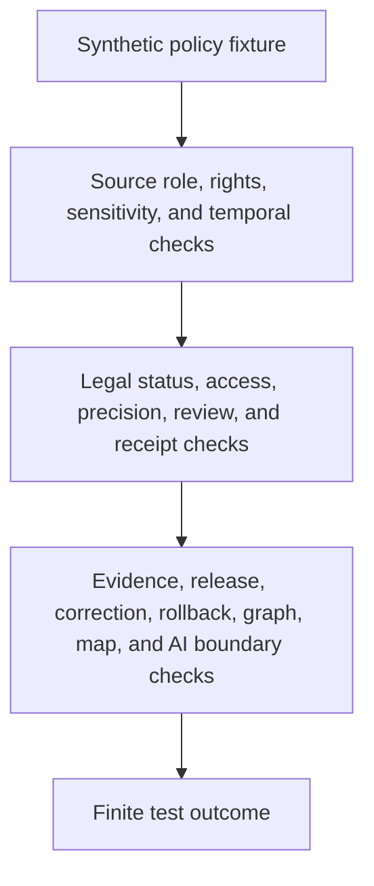

<!-- [KFM_META_BLOCK_V2]
doc_id: kfm://doc/tests-domains-roads-rail-trade-policy-readme
title: Roads Rail Trade Policy Tests README
type: test-index-readme
version: v0.1
status: draft; empty-placeholder-replaced; policy-test-parent-index; PROPOSED / NEEDS VERIFICATION before promotion
owners:
  - OWNER_TBD - Roads/Rail/Trade Routes domain steward
  - OWNER_TBD - Policy steward
  - OWNER_TBD - Source steward
  - OWNER_TBD - Historic/trade-routes steward
  - OWNER_TBD - Evidence steward
  - OWNER_TBD - Redaction steward
  - OWNER_TBD - Release steward
  - OWNER_TBD - QA steward
created: 2026-07-06
updated: 2026-07-06
policy_label: public-doc; tests; roads-rail-trade; policy; parent-index; legal-status-denial; historic-precision; source-role-anti-collapse; no-network; evidence-bound; review-gated; release-gated; rollback-aware
tags: [kfm, tests, roads-rail-trade, policy, policy-tests, legal-status-denial, historic-precision, source-role, OSM, GNIS, historic-route-claim, trade-route-corridor, route-membership, EvidenceBundle, PolicyDecision, ReviewRecord, RedactionReceipt, ReleaseManifest, CorrectionNotice, RollbackCard, ABSTAIN, DENY, ERROR]
related:
  - ../../../README.md
  - ../../README.md
  - ../README.md
  - historic_precision_test/README.md
  - legal_status_denial_test/README.md
  - ../../../../docs/domains/roads-rail-trade/HISTORIC_ROUTES.md
  - ../../../../docs/domains/roads-rail-trade/DATA_LIFECYCLE.md
  - ../../../../docs/domains/roads-rail-trade/sublanes/roads.md
  - ../../../../data/registry/sources/roads-rail-trade/README.md
  - ../../../../data/receipts/roads-rail-trade/redaction/README.md
  - ../../../../tests/domains/roads-rail-trade/evidence/README.md
  - ../../../../tests/domains/roads-rail-trade/contracts/README.md
  - ../../../../policy/domains/roads-rail-trade/
  - ../../../../policy/domains/archaeology/
  - ../../../../fixtures/domains/roads-rail-trade/policy/
  - ../../../../release/candidates/roads-rail-trade/
notes:
  - "This README replaces the empty placeholder content at tests/domains/roads-rail-trade/policy/README.md."
  - "Directory Rules place enforceability proof under tests/. This directory is a parent index for policy-focused tests; it is not the binding policy home."
  - "Confirmed child README lanes at authoring time are historic_precision_test/README.md and legal_status_denial_test/README.md. Other child lanes are PROPOSED until files and executable tests are verified."
  - "Binding policy remains under policy/ or an ADR-selected alternate; tests only prove expected fail-closed behavior."
  - "Default posture is deterministic and no-network with synthetic fixtures only."
[/KFM_META_BLOCK_V2] -->

<a id="top"></a>

# Roads Rail Trade policy tests

> Parent index for deterministic, no-network policy guardrail tests in the Roads/Rail/Trade domain.

<p>
  
  
  
  
  
  
</p>

**Path:** `tests/domains/roads-rail-trade/policy/README.md`  
**Status:** draft / empty placeholder replaced / policy test parent index / PROPOSED until executable tests are verified  
**Owning root:** `tests/`  
**Domain segment:** `roads-rail-trade`  
**Default execution posture:** deterministic, synthetic, no-network, public-safe fixtures only  
**Truth posture:** CONFIRMED target placeholder and two child README lanes; NEEDS VERIFICATION for executable tests, fixtures, policy runtime, schemas, CI coverage, release integration, and pass rates.

---

## Purpose

`tests/domains/roads-rail-trade/policy/` is the parent test index for policy-focused guardrails in Roads/Rail/Trade.

This subtree should prove that policy behavior is enforceable without relocating policy authority into tests. Tests can verify whether a source, route, segment, route membership, status event, historic route claim, trade corridor, graph projection, map carrier, API response, AI summary, or release candidate respects policy boundaries. Tests do **not** define those policies.

A passing test here should **not** mean that a transport claim is legally designated, public, current, culturally cleared, precisely known, or approved for release. It should mean only that the scoped policy guardrail behaved as expected against bounded synthetic fixtures and local files.

[Back to top](#top)

---

## Placement Basis

Directory Rules classify `tests/` as the root that proves rules are enforceable. This directory is therefore a policy-test parent index inside a domain lane. Binding policy, contracts, schemas, source descriptors, fixtures, proof records, receipts, release manifests, public APIs, graph exports, map outputs, and AI runtime behavior remain in their own responsibility roots.

| Responsibility | Correct home | This directory's relationship |
|---|---|---|
| Policy tests | `tests/domains/roads-rail-trade/policy/` | This directory. |
| Domain test root | `tests/domains/roads-rail-trade/` | Parent domain lane; currently observed as a greenfield stub. |
| Historic precision tests | `historic_precision_test/` | Confirmed child README lane. |
| Legal-status denial tests | `legal_status_denial_test/` | Confirmed child README lane. |
| Binding policy | `policy/domains/roads-rail-trade/` or ADR-selected alternate | Not owned here. |
| Cultural/sensitivity policy | `policy/domains/archaeology/` or ADR-selected alternate | Not owned here. |
| Fixtures | `fixtures/domains/roads-rail-trade/policy/` | Preferred fixture home if populated. |
| Release decisions | `release/` roots | Not owned here. |

---

## Parent Invariant

> **Policy tests prove fail-closed behavior; they do not become policy.**

Core checks:

| Check | Required behavior | Failure outcome |
|---|---|---|
| Test/policy separation | Tests cite policy expectations; tests do not author binding rules. | validation failure / promotion block. |
| Source-role boundary | Source roles stay fixed and cannot be upcast by normalization, graph projection, map display, AI wording, or release assembly. | `DENY` / `ABSTAIN`. |
| Legal-status boundary | Names, geometry, labels, route membership, source presence, graph topology, or AI language cannot prove legal designation, jurisdiction, operator identity, public access, or current status. | `DENY` / quarantine. |
| Historic precision boundary | Historic and trade-route claims cannot be sharpened beyond evidence, uncertainty, review state, receipts, and release posture. | `DENY` / quarantine. |
| Sensitivity boundary | Cultural, treaty, oral-history, infrastructure-adjacent, and restricted-access signals default to restrictive review posture. | `DENY` / `HOLD` / `ABSTAIN`. |
| Evidence boundary | Consequential policy outcomes require EvidenceRef-to-EvidenceBundle support or fail closed. | `ABSTAIN`. |
| Receipt boundary | Redaction, aggregation, generalization, correction, withdrawal, and rollback transforms cite receipt refs where material. | promotion block. |
| Public-surface boundary | Public API, map, tile, screenshot, Focus Mode, AI, and export carriers cannot treat policy-test success as publication. | promotion block / `DENY`. |
| No-network boundary | Default policy tests do not call live feeds, source APIs, legal-status systems, routing engines, graph databases, map services, public APIs, or AI runtimes. | validation failure / `ERROR`. |

---

## Lane Index

| Lane | Status | Purpose | Boundary |
|---|---|---|---|
| [`historic_precision_test/`](historic_precision_test/README.md) | CONFIRMED README / executable tests NEEDS VERIFICATION | Proves historic-route and trade-corridor claims fail closed when precision exceeds evidence, source role, uncertainty carrier, review state, receipt support, or release posture. | Does not prove alignment truth, cultural clearance, public geometry approval, legal status, graph truth, map truth, AI truth, or release approval. |
| [`legal_status_denial_test/`](legal_status_denial_test/README.md) | CONFIRMED README / executable tests NEEDS VERIFICATION | Proves context, name, geometry, candidate, compilation, and graph sources cannot become legal designation, jurisdiction, operator identity, public/private access, current status, or release approval. | Does not decide legal status, access, current conditions, operator authority, or public release. |
| `source_role_policy_test/` | PROPOSED | Would prove source-role anti-collapse across admission, normalization, graph projection, map carriers, AI wording, and release candidates. | SourceDescriptor authority does not live here. |
| `access_restriction_policy_test/` | PROPOSED | Would prove access, closure, restriction, and public-route claims require authority evidence and policy decisions. | Legal/access policy authority does not live here. |
| `sensitivity_tier_policy_test/` | PROPOSED | Would prove cultural review, sensitive geometry, infrastructure-adjacent exposure, and public generalization fail closed without required refs. | Sensitivity policy does not live here. |
| `release_policy_gate_test/` | PROPOSED | Would prove release candidates require evidence, proof, policy, review, correction path, and rollback target before public exposure. | Release authority does not live here. |
| `no_network_test/` | PROPOSED | Would prove default policy tests are local and deterministic. | Connector and integration tests require separate gates. |

---

## Policy-Test Flow



The diagram describes intended test responsibility only. It does not prove that policy schemas, validators, fixtures, runtime, release jobs, map behavior, AI behavior, or CI jobs currently exist.

---

## Accepted Inputs

Only bounded, synthetic, reviewable inputs belong in this lane family:

- synthetic policy fixtures with fake refs for sources, routes, segments, memberships, evidence, receipts, policy decisions, review records, release manifests, correction notices, withdrawals, and rollback cards
- synthetic source-role cases for observed, regulatory, modeled, aggregate, administrative, candidate, context, and synthetic posture where accepted vocabulary supports those roles
- synthetic policy cases for legal-status denial, access denial, historic overprecision denial, sensitive corridor review, public generalization, release block, correction, withdrawal, rollback, and quarantine
- canary values that make legal-status overclaiming, access overclaiming, precision laundering, sensitive-geometry exposure, graph-truth leakage, map-truth leakage, AI leakage, logging, or public export obvious
- local validation envelopes emitted by test helpers

Safe outputs may include public-safe references and operational fields such as fixture ID, policy case ID, source role, object family, validator name, finite outcome, reason code, policy decision ID, review record ID, evidence ref, receipt ref, correction ref, and rollback ref.

---

## Exclusions

Do **not** place these materials in this lane family:

| Excluded material | Why it does not belong here |
|---|---|
| Real source exports, live feeds, legal-status records, access records, routing responses, or public API payloads | Rights, authority, freshness, and release status cannot be assumed inside default tests. |
| Real historic route coordinates, precise cultural corridor traces, private review notes, or restricted infrastructure detail | Direct exposure defeats policy and sensitivity guardrails. |
| Credentials, tokens, API keys, cookies, auth headers, private endpoint URLs, or production logs | Security exposure. |
| Binding policy rules, legal decisions, access determinations, source admission decisions, sensitivity registers, cultural-review outcomes, or official route designations | Authority does not live in this lane. |
| Real EvidenceBundle records, ProofPacks, production receipts, catalog records, release manifests, or correction/rollback records | Governed trust artifacts belong in their own roots. |
| Contract prose, schema definitions, graph implementation, route snapping logic, map implementation, AI prompt/runtime implementation, or API implementation | Implementation and authority do not live in this README. |
| Public graph exports, vector tiles, screenshots, map layers, Focus Mode outputs, AI context packets, or public API payloads | Publication requires governed release. |

---

## Suggested Layout

```text
tests/domains/roads-rail-trade/policy/
|-- README.md
|-- historic_precision_test/
|   `-- README.md
|-- legal_status_denial_test/
|   `-- README.md
|-- source_role_policy_test/
|-- access_restriction_policy_test/
|-- sensitivity_tier_policy_test/
|-- release_policy_gate_test/
`-- no_network_test/
```

Only `historic_precision_test/` and `legal_status_denial_test/` are confirmed as authored child README lanes at the time this README was created. Other directories are **PROPOSED** until files and executable tests exist.

---

## Run Posture

No executable runner was verified while authoring this README. Once tests exist, the expected local command should be documented and verified here.

```bash
: "PROPOSED / NEEDS VERIFICATION"
pytest tests/domains/roads-rail-trade/policy
```

Required run posture: no network, no live source APIs, no real credentials, no production logs, no restricted coordinates, no production trust artifacts, no public artifact writes, deterministic fixture inputs, and finite outcomes only: `PASS`, `DENY`, `ABSTAIN`, or `ERROR`.

---

## Evidence Ledger

| Source | Status | Supports | Limits |
|---|---|---|---|
| `Directory Rules.pdf` | CONFIRMED doctrine | `tests/` is the enforceability root; policy authority remains separate. | Does not prove executable tests, fixtures, CI, schema, policy runtime, proof closure, or release behavior. |
| `tests/domains/roads-rail-trade/policy/historic_precision_test/README.md` | CONFIRMED child lane README | Historic precision policy-test posture and fail-closed boundary. | Does not prove executable tests exist. |
| `tests/domains/roads-rail-trade/policy/legal_status_denial_test/README.md` | CONFIRMED child lane README | Legal-status denial policy-test posture and source-role boundary. | Does not prove executable tests exist. |
| `docs/domains/roads-rail-trade/HISTORIC_ROUTES.md` | CONFIRMED repo evidence | Historic route claims, overprecision denial, public generalization, and receipt/review posture. | Implementation paths and validator IDs remain NEEDS VERIFICATION. |
| `docs/domains/roads-rail-trade/sublanes/roads.md` | CONFIRMED repo evidence | OSM and GNIS context cannot confer legal route designation, jurisdiction, or operator identity. | Does not prove runtime behavior. |
| `docs/domains/roads-rail-trade/DATA_LIFECYCLE.md` | CONFIRMED repo evidence | Source-role fixed at admission; quarantine for legal-status and historic-precision failures; release-gated public surfaces. | Implementation-layer paths remain PROPOSED. |
| GitHub target file before update | CONFIRMED repo evidence | `tests/domains/roads-rail-trade/policy/README.md` existed as empty placeholder content before replacement. | Placeholder proves path existence only. |

---

## Validation Checklist

- [ ] Confirm accepted parent policy-test indexing convention.
- [ ] Confirm accepted fixture home and naming convention.
- [ ] Confirm accepted policy schema locations and unresolved slug posture.
- [ ] Confirm source-role, sensitivity, legal-status, access, precision, review, finite outcome, and reason-code vocabularies.
- [ ] Add executable tests for historic precision denial, legal-status denial, source-role preservation, access denial, sensitivity tiers, evidence resolution, policy/review refs, map/API/AI wording, correction/rollback behavior, and no-network behavior.
- [ ] Wire the lane into CI only after executable tests and safe fixtures exist.

---

## Rollback

Rollback is required if this lane starts to store real trust-bearing data, define binding policy instead of testing it, treat a test pass as release approval, expose sensitive material, or bypass source admission, EvidenceBundle resolution, source role, temporal scope, rights, sensitivity, policy decisions, review state, receipts, release state, correction, withdrawal, or rollback controls.

Rollback target: restore the previous safe README revision or remove this parent index until child lane placement, fixtures, schemas, policy vocabulary, evidence expectations, receipt expectations, release relationship, correction behavior, rollback behavior, and CI integration are reverified.

[Back to top](#top)