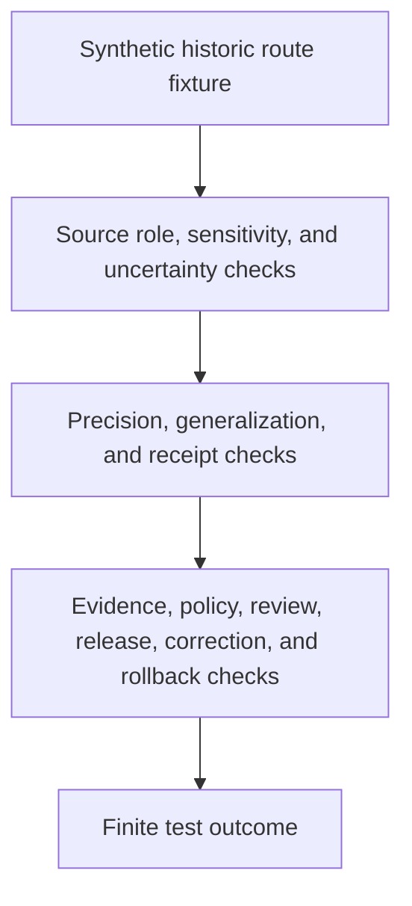

<!-- [KFM_META_BLOCK_V2]
doc_id: kfm://doc/tests-domains-roads-rail-trade-policy-historic-precision-test-readme
title: Roads Rail Trade Historic Precision Policy Test README
type: test-lane-readme
version: v0.1
status: draft; empty-placeholder-replaced; policy-test-lane; historic-precision-guardrail; PROPOSED / NEEDS VERIFICATION before promotion
owners:
  - OWNER_TBD - Roads/Rail/Trade Routes domain steward
  - OWNER_TBD - Policy steward
  - OWNER_TBD - Historic/trade-routes steward
  - OWNER_TBD - Archaeology/Cultural-Heritage steward
  - OWNER_TBD - Sovereignty/cultural reviewer
  - OWNER_TBD - Evidence steward
  - OWNER_TBD - Redaction steward
  - OWNER_TBD - Release steward
  - OWNER_TBD - QA steward
created: 2026-07-06
updated: 2026-07-06
policy_label: public-doc; tests; roads-rail-trade; policy; historic-precision; historic-overprecision-denial; no-precision-laundering; generalized-public-geometry; uncertainty-surface; sensitive-corridors; cultural-review; no-network; evidence-bound; policy-gated; release-gated; rollback-aware
tags: [kfm, tests, roads-rail-trade, policy, historic-precision, historic-overprecision, historic-route-claim, trade-route-corridor, indigenous-corridor, cultural-sensitivity, source-role, UncertaintySurface, RouteUncertaintyProfile, RedactionReceipt, AggregationReceipt, EvidenceBundle, PolicyDecision, ReviewRecord, ReleaseManifest, CorrectionNotice, RollbackCard, ABSTAIN, DENY, ERROR]
related:
  - ../README.md
  - ../../README.md
  - ../../../README.md
  - ../../../../README.md
  - ../../../../../docs/domains/roads-rail-trade/HISTORIC_ROUTES.md
  - ../../../../../docs/domains/roads-rail-trade/DATA_LIFECYCLE.md
  - ../../../../../docs/domains/roads-rail-trade/SENSITIVITY.md
  - ../../../../../docs/domains/roads-rail-trade/IDENTITY_MODEL.md
  - ../../../../../docs/domains/roads-rail-trade/GRAPH_PROJECTIONS.md
  - ../../../../../docs/domains/roads-rail-trade/MAP_UI_CONTRACTS.md
  - ../../../../../docs/domains/roads-rail-trade/RELEASE_INDEX.md
  - ../../../../../docs/domains/roads-rail-trade/sublanes/trade-routes.md
  - ../../../../../contracts/domains/roads-rail-trade/historic_route_claim.md
  - ../../../../../contracts/domains/roads-rail-trade/trade_route_corridor.md
  - ../../../../../contracts/domains/roads-rail-trade/route_uncertainty_profile.md
  - ../../../../../data/receipts/roads-rail-trade/redaction/README.md
  - ../../../../../tests/domains/roads-rail-trade/evidence/redaction_receipt_test/README.md
  - ../../../../../schemas/contracts/v1/domains/roads-rail-trade/historic_precision_policy.schema.json
  - ../../../../../fixtures/domains/roads-rail-trade/policy/historic_precision/
  - ../../../../../policy/domains/roads-rail-trade/
  - ../../../../../policy/domains/archaeology/
  - ../../../../../release/candidates/roads-rail-trade/
notes:
  - "This README replaces the empty placeholder content at tests/domains/roads-rail-trade/policy/historic_precision_test/README.md."
  - "Directory Rules place enforceability proof under tests/. This lane tests policy behavior; it does not define policy, sensitivity tiers, contract meaning, schema shape, evidence, receipt storage, or release authority."
  - "The parent tests/domains/roads-rail-trade/policy/README.md was checked during authoring and was not found. This child lane is self-contained until a parent policy-test index is authored."
  - "Roads/Rail/Trade historic-route docs confirm historic overprecision denial as a validator target and state that historic route claims are claims, not survey-grade lines."
  - "Roads/Rail/Trade lifecycle docs confirm unresolved historic alignment precision can hold material in WORK / QUARANTINE and that public-safe candidates require generalization, redaction receipts, evidence refs, release gates, correction paths, and rollback targets."
  - "Default posture is deterministic and no-network. Real historic coordinates, restricted cultural-route detail, precise Indigenous corridor geometry, source exports, credentials, production logs, and release artifacts do not belong in default tests."
[/KFM_META_BLOCK_V2] -->

<a id="top"></a>

# Roads Rail Trade historic precision policy tests

> Deterministic, no-network test documentation for proving that historic route and trade corridor claims fail closed when claimed precision exceeds the evidence, source role, uncertainty carrier, review state, redaction/generalization receipts, or release posture.

<p>
  
  
  
  
  
  
</p>

**Path:** `tests/domains/roads-rail-trade/policy/historic_precision_test/README.md`  
**Status:** draft / empty placeholder replaced / policy test lane / PROPOSED until executable tests are verified  
**Owning root:** `tests/`  
**Domain segment:** `roads-rail-trade`  
**Test lane:** `policy/historic_precision_test`  
**Default execution posture:** deterministic, synthetic, no-network, public-safe fixtures only  
**Truth posture:** CONFIRMED by current GitHub evidence that this target file existed as an empty placeholder before replacement; CONFIRMED parent `tests/domains/roads-rail-trade/policy/README.md` was not found during authoring; CONFIRMED Roads/Rail/Trade historic-route docs state that historic route claims are claims, not survey-grade lines, and that historic overprecision denial fails closed when geometry exceeds evidence support; NEEDS VERIFICATION for executable tests, accepted fixture shape, policy runtime, schema shape, emitted receipts, CI coverage, release integration, and pass rates.

---

## Purpose

`tests/domains/roads-rail-trade/policy/historic_precision_test/` is the requested policy test lane for historic precision behavior in Roads/Rail/Trade.

This lane should prove that historic route claims, trade-route corridors, Indigenous trade and mobility corridors, oral-history-informed routes, cultural corridors, and generalized historic movement surfaces cannot be published or exported at a precision the evidence does not support. The lane should also prove that generalization is governed: uncertainty remains visible, source role remains explicit, policy and review refs are required where sensitivity is present, redaction or aggregation receipts are recorded where public geometry is transformed, and release remains a separate governed state transition.

A passing test here should **not** mean that a historic route alignment is true, precise, public, culturally cleared, legally designated, safe to traverse, or approved for release. It should mean only that the scoped historic-precision policy guardrail behaved as expected against bounded synthetic fixtures and local files.

[Back to top](#top)

---

## Placement Basis

Directory Rules classify `tests/` as the root that proves rules are enforceable. This path is therefore a policy-focused test lane. It does not own policy rules, sensitivity tiers, source descriptors, EvidenceBundles, receipts, schemas, contracts, graph projections, map layers, public APIs, or release decisions.

| Responsibility | Correct home | This lane's relationship |
|---|---|---|
| Historic precision policy tests | `tests/domains/roads-rail-trade/policy/historic_precision_test/` | This directory. |
| Parent policy test index | `tests/domains/roads-rail-trade/policy/README.md` | Not found during authoring; NEEDS VERIFICATION. |
| Domain test root | `tests/domains/roads-rail-trade/README.md` | Confirmed greenfield stub. |
| Historic-route doctrine | `docs/domains/roads-rail-trade/HISTORIC_ROUTES.md` | Defines historic-route claim posture, overprecision denial, cultural review, and public generalization posture. |
| Lifecycle posture | `docs/domains/roads-rail-trade/DATA_LIFECYCLE.md` | Defines quarantine, public-safe candidates, receipts, evidence refs, graph-derived posture, governed APIs, and release gates. |
| Semantic contracts | `contracts/domains/roads-rail-trade/` or ADR-selected alternate | Defines object meaning; not owned here. |
| Machine schemas | `schemas/contracts/v1/domains/roads-rail-trade/` or ADR-selected alternate | Defines accepted shapes; not owned here. |
| Redaction receipt process memory | `data/receipts/roads-rail-trade/redaction/` | Process memory only; not proof, policy, release, or public path. |
| Policy authority | `policy/domains/roads-rail-trade/`, `policy/domains/archaeology/`, or ADR-selected alternates | Binding sensitivity, cultural, sovereignty, rights, redaction, publication, and release policy. |
| Reusable synthetic fixtures | `fixtures/domains/roads-rail-trade/policy/historic_precision/` | Preferred fixture home if populated. |
| Release decisions | `release/` roots | ReleaseManifest, correction, withdrawal, rollback, signatures, cache invalidation, and derivative invalidation authority. |

> [!IMPORTANT]
> This README documents a test lane. It cannot authorize publication, define policy, define sensitivity tiers, define cultural-review disposition, define exact geometry thresholds, define receipt schemas, or settle Roads/Rail/Trade slug conflicts.

[Back to top](#top)

---

## Invariant Under Test

> **Historic evidence may not be sharpened beyond what it supports.** If a historic route or trade corridor has uncertain evidence, context/model source role, sensitive cultural posture, unresolved review state, missing uncertainty carrier, missing receipt, or missing release gate, the expected outcome is `DENY`, `ABSTAIN`, `HOLD`, or `QUARANTINE`, not a precise public line.

Core checks:

| Check | Required behavior | Failure outcome |
|---|---|---|
| Claim-not-survey boundary | `HistoricRouteClaim` remains a claim and cannot become a survey-grade `Road Segment` or precise route line without supporting evidence. | `DENY` / validation failure. |
| Overprecision denial | Geometry precision that exceeds source role and uncertainty support fails closed. | `HISTORIC_OVERPRECISION_DENY`. |
| No precision laundering | A context-role historic source cannot borrow precision from a modern survey layer, road segment, map tile, graph edge, AI summary, or snapped route. | `ROLE_COLLAPSE` / `DENY`. |
| Source-role boundary | OSM, GNIS, administrative compilations, secondary summaries, oral history, and modeled corridors cannot become authority by normalization or display. | `ABSTAIN` / `DENY`. |
| Uncertainty carrier boundary | Public-safe historic claims carry an uncertainty surface or route uncertainty profile where material. | validation failure / `ABSTAIN`. |
| Cultural sensitivity boundary | Indigenous, treaty, oral-history, sacred, burial-associated, cultural, or sovereignty-sensitive corridor signals default to most-restrictive review posture. | `DENY` / `HOLD`. |
| Generalization boundary | Public geometry is generalized to the approved public-safe band and never exposes raw precise geometry. | validation failure / `ERROR`. |
| Receipt boundary | Redaction or aggregation transforms cite RedactionReceipt or AggregationReceipt refs where public-safe geometry depends on transform. | promotion block. |
| Policy and review boundary | PolicyDecision and ReviewRecord refs are required when sensitivity, cultural review, rights, public release, or tier change is involved. | `DENY` / `ABSTAIN`. |
| Evidence boundary | EvidenceRef must resolve to EvidenceBundle before public claim, graph, map, Focus Mode, AI, or export output. | `ABSTAIN`. |
| Graph boundary | Graph edges, route memberships, and movement story nodes remain derived and rollbackable; they cannot sharpen route precision. | validation failure. |
| Map and AI boundary | Map labels, tiles, screenshots, Focus Mode summaries, exports, and AI answers cannot present uncertain historic routes as precise, current, legal, or public by default. | `DENY` / `ABSTAIN`. |
| Release boundary | Test success, policy check success, and receipt presence do not become ReleaseManifest approval. | promotion block. |
| No-network boundary | Default tests do not call live source APIs, routing engines, legal-status systems, graph databases, map services, public APIs, or AI runtimes. | validation failure / `ERROR`. |

---

## Policy Guardrail Flow



The diagram describes the intended test flow only. It does not prove that policy schemas, validators, fixtures, receipt emitters, policy runtime, release jobs, graph projections, map behavior, AI behavior, or CI jobs currently exist.

---

## Expected Test Families

| Family | Purpose | Required boundary |
|---|---|---|
| Historic overprecision tests | Ensure high-precision geometry fails when evidence supports only a corridor, band, or uncertain route. | Precision cannot exceed evidence. |
| Claim/segment separation tests | Ensure `HistoricRouteClaim` does not become `Road Segment` or modern route truth. | Historic claim is not a survey line. |
| Precision laundering tests | Ensure joins to modern segments, basemaps, graph edges, or snapped routes cannot borrow authority or precision. | Modern geometry cannot launder historic uncertainty. |
| Source-role tests | Ensure context, administrative, candidate, model, or synthetic evidence cannot be promoted into authority by policy tests. | Source role stays fixed. |
| Cultural review tests | Ensure cultural, Indigenous, treaty, oral-history, sacred, burial-associated, or sovereignty-sensitive signals default to review, restriction, or denial. | Most-restrictive applicable posture wins. |
| Uncertainty carrier tests | Ensure `UncertaintySurface` or `RouteUncertaintyProfile` refs exist where historic geometry is uncertain. | Uncertainty is first-class. |
| Redaction/generalization tests | Ensure generalized public geometry has RedactionReceipt or AggregationReceipt refs where transform is required. | Generalization is governed. |
| Evidence and proof tests | Ensure EvidenceRef and proof requirements are not replaced by policy-test success or generated summaries. | EvidenceBundle outranks tests and AI text. |
| Graph/map/API/AI tests | Ensure derived graph, map, tile, Focus Mode, API, export, and AI carriers cannot sharpen or overstate precision. | Public carriers stay release-gated. |
| Correction and rollback tests | Ensure precision corrections, tier downgrades, withdrawals, and derivative invalidation are preserved. | Change is auditable and reversible. |
| No-network tests | Ensure default lane execution is local and deterministic. | No live systems in default tests. |

---

## Accepted Inputs

Only bounded, synthetic, reviewable inputs belong in this lane:

- Synthetic historic precision fixtures with fake route refs, source refs, evidence refs, uncertainty refs, policy refs, review refs, redaction refs, aggregation refs, release refs, correction refs, withdrawal refs, rollback refs, and finite outcomes.
- Synthetic cases for wagon roads, military trails, stage routes, mail routes, cattle trails, emigrant trails, trade corridors, Indigenous mobility corridors, oral-history corridors, and cultural/sacred route associations.
- Synthetic source-role cases for context, administrative, candidate, modeled, synthetic, observed, and regulatory posture where the accepted vocabulary supports those roles.
- Synthetic precision cases for raw point/line, snapped modern segment, generalized corridor band, uncertainty surface, H3-like bucket, buffered geometry, withheld geometry, approximate date range, and conflicting source geometry.
- Synthetic EvidenceRef, EvidenceBundle stub, PolicyDecision, ReviewRecord, RedactionReceipt, AggregationReceipt, ValidationReport, ReleaseManifest, CorrectionNotice, WithdrawalNotice, and RollbackCard references.
- Canary values that make accidental raw-coordinate exposure, precision laundering, cultural sensitivity leakage, legal-status overclaiming, graph-truth leakage, map-truth leakage, AI leakage, logging, or public export obvious.
- Local validation envelopes emitted by test helpers.

Safe outputs may include public-safe references and operational fields such as fixture ID, object family, precision case ID, source role, uncertainty profile ref, policy decision ID, review record ID, receipt ref, validator name, finite outcome, reason code, evidence ref, correction ref, and rollback ref.

> [!IMPORTANT]
> A historic route may be meaningful and still not be publishable as a precise line. Policy tests must protect that distinction.

---

## Exclusions

Do **not** place these materials in this lane:

| Excluded material | Why it does not belong here | Correct direction |
|---|---|---|
| Real historic route coordinates, precise Indigenous/cultural corridor traces, restricted-source-derived details, sacred/burial-associated locations, or private review notes | Direct exposure defeats the policy test purpose and may violate sensitivity posture. | Use canaries, fake geometry, generalized synthetic bands, or withheld synthetic values. |
| Real source exports, source APIs, live feeds, legal-status records, routing responses, or public API payloads | Rights, authority, sensitivity, freshness, and release status cannot be assumed inside default tests. | Use synthetic fixtures or separately gated source/connector tests. |
| Credentials, tokens, API keys, cookies, auth headers, private endpoint URLs, or production logs | Security exposure. | Secret manager or fake local values only. |
| Binding policy rules, sensitivity registers, cultural-review decisions, or sovereignty review records | Authority does not live in this lane. | `policy/` and governed review roots. |
| Real EvidenceBundle records, ProofPacks, production receipts, catalog records, release manifests, or correction/rollback records | These may carry controlled evidence, internal refs, policy state, or release metadata. | Their governed roots with access controls. |
| Contract prose, schema definitions, graph implementation, route snapping logic, map implementation, AI prompt/runtime implementation, or API implementation | Implementation and authority do not live in this README. | Accepted contract, schema, package, pipeline, runtime, graph, and API homes. |
| Public graph exports, vector tiles, screenshots, map layers, Focus Mode outputs, AI context packets, or public API payloads | Publication and public exposure require governed release. | Governed API, release, and accepted artifact homes. |

[Back to top](#top)

---

## Suggested Layout

```text
tests/domains/roads-rail-trade/policy/historic_precision_test/
|-- README.md
|-- test_historic_route_claim_is_not_survey_line.py
|-- test_historic_overprecision_denies_precise_geometry.py
|-- test_context_source_cannot_borrow_modern_segment_precision.py
|-- test_uncertainty_surface_required_for_public_candidate.py
|-- test_sensitive_cultural_corridor_defaults_to_review_or_denial.py
|-- test_generalized_public_geometry_requires_receipt_refs.py
|-- test_map_api_ai_cannot_overstate_precision.py
|-- test_graph_projection_cannot_sharpen_historic_alignment.py
|-- test_correction_and_rollback_required_for_precision_change.py
`-- test_historic_precision_policy_no_network.py
```

This layout is **PROPOSED** until executable files exist in the repository.

---

## Run Posture

No executable runner was verified while authoring this README. Once tests exist, the expected local command should be documented and verified here.

```bash
: "PROPOSED / NEEDS VERIFICATION"
pytest tests/domains/roads-rail-trade/policy/historic_precision_test
```

Required run posture:

- no network access
- no real source feeds or live source APIs
- no real legal-status or routing endpoints
- no real credentials
- no production logs or telemetry
- no real historic route coordinates, restricted cultural corridor detail, precise Indigenous route geometry, sacred/burial-associated locations, private review notes, production EvidenceBundles, production receipts, proof payloads, or release artifacts
- no public artifact writes
- no public API, map, tile, screenshot, graph export, release, correction, rollback, or AI-context writes
- deterministic fixture inputs
- finite outcomes only: `PASS`, `DENY`, `ABSTAIN`, or `ERROR`

---

## Minimal Historic Precision Fixture

Synthetic fixtures should make the policy boundary inspectable without carrying real historic or cultural route data.

```json
{
  "fixture_id": "roads-rail-trade-historic-precision-example",
  "object_family": "HistoricRouteClaim",
  "route_claim_ref": "historic-route-claim-fixture-001",
  "source_descriptor_id": "source-descriptor-fixture-historic-precision-001",
  "source_role": "context",
  "sensitivity_signal": "historic_uncertain_route",
  "requested_public_precision": "survey_grade_line",
  "supported_precision": "generalized_corridor_band",
  "uncertainty_profile_ref": "route-uncertainty-profile-fixture-001",
  "evidence_ref": "evidence-ref-fixture-historic-precision-001",
  "policy_decision_ref": "policy-decision-fixture-historic-precision-001",
  "review_record_ref": "review-record-fixture-historic-precision-001",
  "redaction_receipt_ref": "redaction-receipt-fixture-historic-precision-001",
  "aggregation_receipt_ref": null,
  "release_manifest_ref": null,
  "correction_notice_ref": null,
  "rollback_card_ref": "rollback-card-fixture-historic-precision-001",
  "expected_outcome": "DENY",
  "reason_code": "HISTORIC_OVERPRECISION_DENY",
  "must_not_expose": [
    "RAW_COORDINATE_CANARY",
    "CULTURAL_ROUTE_PRECISION_CANARY",
    "MODERN_SEGMENT_BORROWED_PRECISION_CANARY",
    "LEGAL_DESIGNATION_CANARY",
    "MAP_TRUTH_CANARY",
    "AI_TRUTH_CANARY",
    "RELEASE_APPROVAL_CANARY"
  ]
}
```

The JSON above is illustrative. Accepted schema, field names, sensitivity vocabulary, precision vocabulary, source-role vocabulary, review vocabulary, reason codes, and fixture homes remain **NEEDS VERIFICATION**.

---

## Evidence Ledger

| Source | Status | Supports | Limits |
|---|---|---|---|
| `Directory Rules.pdf` | CONFIRMED doctrine | `tests/` is the canonical enforceability root; file placement follows responsibility root rather than topic. | Does not prove executable tests, fixtures, CI, schema, policy runtime, receipt emission, proof closure, or release behavior. |
| `docs/domains/roads-rail-trade/HISTORIC_ROUTES.md` | CONFIRMED repo evidence | Defines historic route claims as uncertain claims, not survey-grade lines; confirms overprecision denial, no precision laundering, steward review, generalized public geometry, and required receipts/review for sensitive corridors. | Implementation paths, schema names, validator IDs, and parameters are PROPOSED / NEEDS VERIFICATION in that doc. |
| `docs/domains/roads-rail-trade/DATA_LIFECYCLE.md` | CONFIRMED repo evidence | States unresolved historic alignment precision can hold material in WORK / QUARANTINE; public-safe candidates require generalization, receipts, EvidenceRefs, graph-derived posture, governed APIs, release gates, correction path, and rollback target. | Implementation-layer paths and artifact IDs remain PROPOSED in that doc. |
| `data/receipts/roads-rail-trade/redaction/README.md` | CONFIRMED repo evidence | Defines redaction receipt lane as process memory; receipts are not proof, policy, release, or public path. | README presence does not prove emitted receipts or policy/runtime enforcement. |
| `tests/domains/roads-rail-trade/evidence/redaction_receipt_test/README.md` | CONFIRMED adjacent test lane README | Defines redaction receipt evidence-test posture that this policy lane may cite for receipt expectations. | Does not prove executable redaction receipt tests exist. |
| `tests/domains/roads-rail-trade/policy/README.md` | CONFIRMED not found in GitHub fetch | Parent policy test index is missing at authoring time. | Does not block this child README, but parent index remains a validation item. |
| GitHub target file before update | CONFIRMED repo evidence | `tests/domains/roads-rail-trade/policy/historic_precision_test/README.md` existed as empty placeholder content before replacement. | Placeholder proves path existence only. |

---

## Validation Checklist

- [ ] Confirm or create parent policy test index at `tests/domains/roads-rail-trade/policy/README.md`.
- [ ] Confirm accepted fixture home and naming convention for historic precision policy fixtures.
- [ ] Confirm accepted historic precision policy schema location, including unresolved slug conflict with possible alternate schema/contract segment.
- [ ] Confirm accepted names and semantics for `HistoricRouteClaim`, `TradeRouteCorridor`, `UncertaintySurface`, `RouteUncertaintyProfile`, precision tiers, sensitivity tiers, reason codes, source roles, and review states.
- [ ] Add executable tests for historic-overprecision denial, claim/segment separation, precision laundering denial, source-role preservation, uncertainty carrier requirement, cultural review default, generalized geometry receipts, evidence resolution, graph-derived posture, map/API/AI public wording, correction/rollback behavior, and no-network behavior.
- [ ] Confirm tests do not use real source feeds, legal-status endpoints, routing services, graph databases, credentials, production logs, restricted coordinates, precise sensitive route traces, private review notes, production EvidenceBundles, production receipts, proof payloads, or public artifact writes.
- [ ] Confirm graph, map, API, tile, screenshot, Focus Mode, AI context, and export outputs cannot bypass EvidenceBundle resolution, source role, temporal scope, precision policy, uncertainty carrier, redaction/generalization receipts, policy, review, release, correction, withdrawal, or rollback controls.
- [ ] Wire the lane into CI only after executable tests and safe fixtures exist.

---

## Rollback

Rollback is required if this lane starts to:

- store real historic route coordinates, precise Indigenous/cultural corridor traces, restricted-source-derived details, sacred/burial-associated locations, private review notes, live source data, credentials, production logs, production EvidenceBundles, production receipts, proof payloads, or public artifacts
- define binding policy, sensitivity tiers, cultural-review outcomes, receipt schema, proof closure, release authority, graph implementation, map implementation, AI behavior, or API behavior instead of testing them
- treat a policy-test pass as source truth, precision proof, policy approval, cultural clearance, public-access proof, legal route designation, graph truth, map truth, AI truth, or release approval
- allow sensitive content to leak through fixtures, snapshots, README text, logs, graph exports, map outputs, screenshots, API payloads, Focus Mode carriers, or AI context
- bypass source admission, EvidenceBundle resolution, source role, temporal scope, uncertainty carrier, rights, sensitivity, policy decisions, review state, redaction/generalization receipts, release state, correction, withdrawal, or rollback controls
- weaken fail-closed behavior for overprecise geometry, missing uncertainty surface, missing review, missing policy decision, missing receipt, stale evidence, source-role collapse, precision laundering, unresolved release state, or derived graph/map outputs

Rollback target: restore the previous safe README revision or remove this test lane until parent index placement, fixtures, schemas, policy vocabulary, sensitivity vocabulary, source-role handling, evidence expectations, receipt expectations, release relationship, correction behavior, rollback behavior, and CI integration are reverified.

[Back to top](#top)