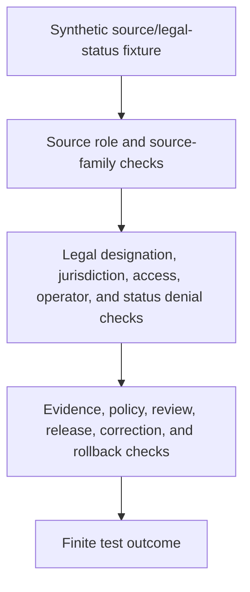

<!-- [KFM_META_BLOCK_V2]
doc_id: kfm://doc/tests-domains-roads-rail-trade-policy-legal-status-denial-test-readme
title: Roads Rail Trade Legal Status Denial Policy Test README
type: test-lane-readme
version: v0.1
status: draft; empty-placeholder-replaced; policy-test-lane; legal-status-denial-guardrail; PROPOSED / NEEDS VERIFICATION before promotion
owners:
  - OWNER_TBD - Roads/Rail/Trade Routes domain steward
  - OWNER_TBD - Policy steward
  - OWNER_TBD - Source steward
  - OWNER_TBD - Roads steward
  - OWNER_TBD - Rail steward
  - OWNER_TBD - Historic/trade-routes steward
  - OWNER_TBD - Evidence steward
  - OWNER_TBD - Release steward
  - OWNER_TBD - QA steward
created: 2026-07-06
updated: 2026-07-06
policy_label: public-doc; tests; roads-rail-trade; policy; legal-status-denial; source-role-anti-collapse; osm-gnis-denial; access-denial; jurisdiction-denial; operator-denial; no-network; evidence-bound; policy-gated; release-gated; rollback-aware
tags: [kfm, tests, roads-rail-trade, policy, legal-status-denial, source-role, OSM, GNIS, route-designation, jurisdiction, operator-identity, access-restriction, public-access, safe-routing, route-membership, corridor-route, road-segment, rail-segment, EvidenceBundle, PolicyDecision, ReviewRecord, ReleaseManifest, CorrectionNotice, RollbackCard, ABSTAIN, DENY, ERROR]
related:
  - ../README.md
  - ../../README.md
  - ../../../README.md
  - ../../../../README.md
  - ../historic_precision_test/README.md
  - ../../../../../docs/domains/roads-rail-trade/sublanes/roads.md
  - ../../../../../docs/domains/roads-rail-trade/DATA_LIFECYCLE.md
  - ../../../../../docs/domains/roads-rail-trade/IDENTITY_MODEL.md
  - ../../../../../docs/domains/roads-rail-trade/OBJECT_FAMILIES.md
  - ../../../../../docs/domains/roads-rail-trade/SENSITIVITY.md
  - ../../../../../docs/domains/roads-rail-trade/GRAPH_PROJECTIONS.md
  - ../../../../../docs/domains/roads-rail-trade/MAP_UI_CONTRACTS.md
  - ../../../../../docs/domains/roads-rail-trade/RELEASE_INDEX.md
  - ../../../../../data/registry/sources/roads-rail-trade/README.md
  - ../../../../../contracts/domains/roads-rail-trade/access_restriction.md
  - ../../../../../contracts/domains/roads-rail-trade/restriction_event.md
  - ../../../../../contracts/domains/roads-rail-trade/status_event.md
  - ../../../../../contracts/domains/roads-rail-trade/operator_assignment.md
  - ../../../../../contracts/domains/roads-rail-trade/operator_status.md
  - ../../../../../contracts/domains/roads-rail-trade/route_membership.md
  - ../../../../../contracts/domains/roads-rail-trade/corridor_route.md
  - ../../../../../contracts/domains/roads-rail-trade/road_segment.md
  - ../../../../../contracts/domains/roads-rail-trade/rail_segment.md
  - ../../../../../schemas/contracts/v1/domains/roads-rail-trade/legal_status_denial_policy.schema.json
  - ../../../../../fixtures/domains/roads-rail-trade/policy/legal_status_denial/
  - ../../../../../policy/domains/roads-rail-trade/
  - ../../../../../release/candidates/roads-rail-trade/
notes:
  - "This README replaces the empty placeholder content at tests/domains/roads-rail-trade/policy/legal_status_denial_test/README.md."
  - "Directory Rules place enforceability proof under tests/. This lane tests policy behavior; it does not define policy, sensitivity tiers, legal authority, source authority, contract meaning, schema shape, evidence, receipt storage, or release authority."
  - "The parent tests/domains/roads-rail-trade/policy/README.md was checked during authoring and was not found. This child lane is self-contained until a parent policy-test index is authored."
  - "Roads sublane docs state that OpenStreetMap and GNIS must not confer legal route designation, jurisdiction, or operator identity; they can supply geometry, names, and context only."
  - "Roads/Rail/Trade lifecycle docs confirm OSM/GNIS legal-status denial as a validator target and state that quarantine is expected when legal-status drift or source-role uncertainty blocks promotion."
  - "Default posture is deterministic and no-network. Real source exports, live legal-status systems, road-status feeds, routing services, credentials, production logs, and release artifacts do not belong in default tests."
[/KFM_META_BLOCK_V2] -->

<a id="top"></a>

# Roads Rail Trade legal status denial policy tests

> Deterministic, no-network test documentation for proving that Roads/Rail/Trade sources that provide names, geometry, context, candidates, compilations, or derived graph hints cannot be promoted into legal designation, jurisdiction, operator identity, access authority, public/private road status, safe routing, or release approval.

<p>
  
  
  
  
  
  
</p>

**Path:** `tests/domains/roads-rail-trade/policy/legal_status_denial_test/README.md`  
**Status:** draft / empty placeholder replaced / policy test lane / PROPOSED until executable tests are verified  
**Owning root:** `tests/`  
**Domain segment:** `roads-rail-trade`  
**Test lane:** `policy/legal_status_denial_test`  
**Default execution posture:** deterministic, synthetic, no-network, public-safe fixtures only  
**Truth posture:** CONFIRMED by current GitHub evidence that this target file existed as an empty placeholder before replacement; CONFIRMED parent `tests/domains/roads-rail-trade/policy/README.md` was not found during authoring; CONFIRMED adjacent `historic_precision_test/README.md` exists; CONFIRMED Roads/Rail/Trade docs state that OSM/GNIS and generic geographic sources cannot confer legal route designation, jurisdiction, or operator identity; NEEDS VERIFICATION for executable tests, accepted fixture shape, policy runtime, schema shape, CI coverage, release integration, and pass rates.

---

## Purpose

`tests/domains/roads-rail-trade/policy/legal_status_denial_test/` is the requested policy test lane for legal-status denial behavior in Roads/Rail/Trade.

This lane should prove that sources admitted for geometry, names, context, candidates, community-contributed data, administrative compilations, graph hints, or model outputs cannot silently become legal-status authority. Legal route designation, jurisdiction, public/private access, right-of-way, current closure status, operator identity, railroad operating status, safe routing, emergency guidance, and release approval require their own evidence, policy, review, and release posture.

A passing test here should **not** mean that a road or rail route is legally designated, open, public, private, safe, current, navigable, operated by a specific entity, or approved for publication. It should mean only that the scoped legal-status denial guardrail behaved as expected against bounded synthetic fixtures and local files.

[Back to top](#top)

---

## Placement Basis

Directory Rules classify `tests/` as the root that proves rules are enforceable. This path is therefore a policy-focused test lane. It does not own policy rules, legal authority, source descriptors, EvidenceBundles, contracts, schemas, graph projections, map layers, public APIs, current-status feeds, routing services, or release decisions.

| Responsibility | Correct home | This lane's relationship |
|---|---|---|
| Legal status denial policy tests | `tests/domains/roads-rail-trade/policy/legal_status_denial_test/` | This directory. |
| Parent policy test index | `tests/domains/roads-rail-trade/policy/README.md` | Not found during authoring; NEEDS VERIFICATION. |
| Adjacent historic precision policy tests | `tests/domains/roads-rail-trade/policy/historic_precision_test/` | Confirmed sibling README lane. |
| Domain test root | `tests/domains/roads-rail-trade/README.md` | Confirmed greenfield stub. |
| Roads sublane legal-status posture | `docs/domains/roads-rail-trade/sublanes/roads.md` | Confirms OSM/GNIS legal-status anti-collapse boundary. |
| Lifecycle posture | `docs/domains/roads-rail-trade/DATA_LIFECYCLE.md` | Defines source roles, quarantine, legal-status denial, public-safe candidates, graph-derived posture, and release gates. |
| Source registry | `data/registry/sources/roads-rail-trade/` | Source admission and authority-control records; not legal truth or public authority. |
| Semantic contracts | `contracts/domains/roads-rail-trade/` or ADR-selected alternate | Defines object meaning; not owned here. |
| Machine schemas | `schemas/contracts/v1/domains/roads-rail-trade/` or ADR-selected alternate | Defines accepted shapes; not owned here. |
| Policy authority | `policy/domains/roads-rail-trade/` or ADR-selected alternate | Binding legal-status, rights, access, sensitivity, redaction, publication, and release policy. |
| Reusable synthetic fixtures | `fixtures/domains/roads-rail-trade/policy/legal_status_denial/` | Preferred fixture home if populated. |
| Release decisions | `release/` roots | ReleaseManifest, correction, withdrawal, rollback, signatures, cache invalidation, and derivative invalidation authority. |

> [!IMPORTANT]
> This README documents a test lane. It cannot authorize publication, define policy, decide legal status, define public access, define right-of-way, define operator authority, provide navigation guidance, or settle Roads/Rail/Trade slug conflicts.

[Back to top](#top)

---

## Invariant Under Test

> **Context is not legal authority.** A source may support names, geometry, historical context, candidate evidence, route membership hints, or graph context without proving legal designation, jurisdiction, access, right-of-way, operator identity, current status, or safe routing.

Core checks:

| Check | Required behavior | Failure outcome |
|---|---|---|
| OSM/GNIS legal-status denial | OSM, GNIS, community, generic gazetteer, or context-only sources cannot confer legal designation, jurisdiction, operator identity, access, or right-of-way. | `DENY` / `ABSTAIN` / quarantine. |
| Source-role boundary | Source role is fixed at admission and cannot be upcast by normalization, promotion, graph projection, map display, AI wording, or release candidate assembly. | `ROLE_COLLAPSE` / `DENY`. |
| Route designation boundary | Route labels, names, refs, shields, route memberships, or map labels cannot prove legal designation without authority evidence. | `LEGAL_STATUS_DENY`. |
| Segment boundary | `Road Segment` and `Rail Segment` identity do not imply legal route designation, jurisdiction, access, operator, or safe routing. | validation failure / `ABSTAIN`. |
| Membership boundary | `RouteMembership` is a source-scoped association and cannot become legal designation or current route status. | validation failure / `DENY`. |
| Operator boundary | Operator names or compilations cannot prove operator assignment or operator status without authority evidence and time scope. | `ABSTAIN` / `DENY`. |
| Access boundary | Legal public/private access, right-of-way, closures, restrictions, railroad access, and dispatch/operating instructions require separate evidence and policy. | `DENY` / `ABSTAIN`. |
| Current-status boundary | Retrieval time, map freshness, API freshness, graph update time, or release time cannot prove current road or rail status. | `ABSTAIN`. |
| Evidence boundary | EvidenceRef must resolve to EvidenceBundle before any consequential claim can answer. | `ABSTAIN`. |
| Policy and review boundary | Legal-status, access, rights, safety, sensitivity, and publication claims require PolicyDecision and review state where material. | promotion block / `DENY`. |
| Graph boundary | Network nodes, edges, route memberships, and movement story nodes remain derived; graph connectivity is not legal access or routability. | validation failure. |
| Map and AI boundary | Map labels, tiles, screenshots, Focus Mode summaries, exports, and AI answers cannot phrase context evidence as legal/current/official status. | `DENY` / `ABSTAIN`. |
| Release boundary | Test success and source presence do not become ReleaseManifest approval or public client authority. | promotion block. |
| No-network boundary | Default tests do not call live source APIs, legal-status endpoints, routing engines, dispatch systems, graph databases, map services, public APIs, or AI runtimes. | validation failure / `ERROR`. |

---

## Policy Guardrail Flow



The diagram describes the intended test flow only. It does not prove that policy schemas, validators, fixtures, policy runtime, release jobs, graph projections, map behavior, AI behavior, or CI jobs currently exist.

---

## Expected Test Families

| Family | Purpose | Required boundary |
|---|---|---|
| OSM/GNIS denial tests | Ensure OSM, GNIS, and generic geographic sources cannot prove legal status, jurisdiction, operator identity, access, or official designation. | Context is not authority. |
| Candidate-source tests | Ensure candidate, community, inferred, synthetic, or model sources fail closed until source role and review support promotion. | Candidate is not legal truth. |
| Administrative-compilation tests | Ensure administrative compilations cannot become observed status timelines or authority records by normalization. | Compilation is not observation. |
| Route-label tests | Ensure names, shields, refs, signs, labels, or route strings do not prove legal designation alone. | Label is not designation. |
| Membership tests | Ensure `RouteMembership` stays association evidence and does not become legal route authority. | Membership is not legal status. |
| Access and restriction tests | Ensure public/private access, right-of-way, closures, restrictions, safe routing, and railroad operations require separate evidence and policy. | Access requires authority. |
| Operator tests | Ensure operator references do not become operator assignment or status without authoritative source role and time scope. | Operator text is not operator authority. |
| Current-status tests | Ensure release time, retrieval time, API freshness, graph freshness, or map tile freshness cannot prove current open/closed status. | Freshness is not status truth. |
| Graph/map/API/AI tests | Ensure derived graph, map, tile, Focus Mode, API, export, and AI carriers cannot phrase context evidence as legal/current/official. | Public carriers stay release-gated. |
| Correction and rollback tests | Ensure legal-status corrections, withdrawals, source-role corrections, release blocks, and derivative invalidation are preserved. | Change is auditable and reversible. |
| No-network tests | Ensure default lane execution is local and deterministic. | No live systems in default tests. |

---

## Accepted Inputs

Only bounded, synthetic, reviewable inputs belong in this lane:

- Synthetic legal-status denial fixtures with fake source refs, route refs, segment refs, membership refs, operator refs, access refs, evidence refs, policy refs, review refs, release refs, correction refs, withdrawal refs, rollback refs, and finite outcomes.
- Synthetic source families representing OSM-like context, GNIS-like naming, administrative compilations, candidate geometry, modeled graph outputs, regulatory records, observed status feeds, and authority records without using real source payloads.
- Synthetic source-role cases for context, administrative, candidate, modeled, synthetic, observed, regulatory, and aggregate posture where accepted vocabulary supports those roles.
- Synthetic legal-status cases for official route designation, jurisdiction, route classification, operator assignment, operator status, public/private access, right-of-way, restriction, closure, safe-routing claim, railroad operating instruction, and current-status claim.
- Synthetic EvidenceRef, EvidenceBundle stub, PolicyDecision, ReviewRecord, ValidationReport, ReleaseManifest, CorrectionNotice, WithdrawalNotice, and RollbackCard references.
- Canary values that make accidental legal-status overclaiming, access overclaiming, operator overclaiming, current-status overclaiming, graph-truth leakage, map-truth leakage, AI leakage, logging, or public export obvious.
- Local validation envelopes emitted by test helpers.

Safe outputs may include public-safe references and operational fields such as fixture ID, source role, source family, object family, legal-status case ID, policy decision ID, review record ID, validator name, finite outcome, reason code, evidence ref, correction ref, and rollback ref.

> [!IMPORTANT]
> A source can be useful for context and still be unsafe for legal-status claims. Policy tests must protect that distinction.

---

## Exclusions

Do **not** place these materials in this lane:

| Excluded material | Why it does not belong here | Correct direction |
|---|---|---|
| Real source exports, source APIs, live road-status feeds, legal-status records, routing responses, railroad operating records, or public API payloads | Rights, authority, sensitivity, freshness, and release status cannot be assumed inside default tests. | Use synthetic fixtures or separately gated source/connector tests. |
| Real public/private access records, right-of-way records, operator agreements, closure feeds, restriction data, or legal designations | These may be stale, rights-limited, operationally sensitive, or legally significant. | Governed source, policy, evidence, and release roots. |
| Credentials, tokens, API keys, cookies, auth headers, private endpoint URLs, or production logs | Security exposure. | Secret manager or fake local values only. |
| Binding policy rules, legal decisions, access determinations, source admission decisions, or official route designations | Authority does not live in this lane. | `policy/`, source registry, evidence/proof roots, and release roots. |
| Real EvidenceBundle records, ProofPacks, production receipts, catalog records, release manifests, or correction/rollback records | These may carry controlled evidence, internal refs, policy state, or release metadata. | Their governed roots with access controls. |
| Contract prose, schema definitions, graph implementation, route snapping logic, map implementation, AI prompt/runtime implementation, or API implementation | Implementation and authority do not live in this README. | Accepted contract, schema, package, pipeline, runtime, graph, and API homes. |
| Public graph exports, vector tiles, screenshots, map layers, Focus Mode outputs, AI context packets, or public API payloads | Publication and public exposure require governed release. | Governed API, release, and accepted artifact homes. |

[Back to top](#top)

---

## Suggested Layout

```text
tests/domains/roads-rail-trade/policy/legal_status_denial_test/
|-- README.md
|-- test_osm_gnis_cannot_confer_legal_status.py
|-- test_context_source_cannot_become_authority.py
|-- test_candidate_geometry_fails_closed_for_legal_status.py
|-- test_route_label_is_not_legal_designation.py
|-- test_route_membership_is_not_legal_designation.py
|-- test_access_and_safe_routing_require_authority.py
|-- test_operator_identity_requires_authority_and_time_scope.py
|-- test_current_status_not_inferred_from_retrieval_or_release_time.py
|-- test_map_api_ai_cannot_overstate_legal_status.py
`-- test_legal_status_denial_no_network.py
```

This layout is **PROPOSED** until executable files exist in the repository.

---

## Run Posture

No executable runner was verified while authoring this README. Once tests exist, the expected local command should be documented and verified here.

```bash
: "PROPOSED / NEEDS VERIFICATION"
pytest tests/domains/roads-rail-trade/policy/legal_status_denial_test
```

Required run posture:

- no network access
- no real source feeds or live source APIs
- no real legal-status, access, routing, railroad operating, or dispatch endpoints
- no real credentials
- no production logs or telemetry
- no real access records, legal designations, right-of-way records, closure feeds, restriction data, operator agreements, production EvidenceBundles, production receipts, proof payloads, or release artifacts
- no public artifact writes
- no public API, map, tile, screenshot, graph export, release, correction, rollback, or AI-context writes
- deterministic fixture inputs
- finite outcomes only: `PASS`, `DENY`, `ABSTAIN`, or `ERROR`

---

## Minimal Legal Status Denial Fixture

Synthetic fixtures should make the policy boundary inspectable without carrying real transport or legal-status data.

```json
{
  "fixture_id": "roads-rail-trade-legal-status-denial-example",
  "object_family": "RoadSegment",
  "object_ref": "road-segment-fixture-legal-denial-001",
  "source_descriptor_id": "source-descriptor-fixture-legal-denial-001",
  "source_family": "osm_like_context_source",
  "source_role": "candidate",
  "claimed_status": "official_route_designation",
  "claimed_access": "public_access",
  "claimed_operator": "operator-authority-fixture-canary",
  "evidence_ref": "evidence-ref-fixture-legal-denial-001",
  "policy_decision_ref": "policy-decision-fixture-legal-denial-001",
  "review_record_ref": null,
  "release_manifest_ref": null,
  "correction_notice_ref": null,
  "rollback_card_ref": "rollback-card-fixture-legal-denial-001",
  "expected_outcome": "DENY",
  "reason_code": "LEGAL_STATUS_SOURCE_ROLE_DENY",
  "must_not_claim": [
    "LEGAL_DESIGNATION_CANARY",
    "JURISDICTION_CANARY",
    "PUBLIC_ACCESS_CANARY",
    "RIGHT_OF_WAY_CANARY",
    "OPERATOR_AUTHORITY_CANARY",
    "SAFE_ROUTING_CANARY",
    "CURRENT_STATUS_CANARY",
    "RELEASE_APPROVAL_CANARY"
  ]
}
```

The JSON above is illustrative. Accepted schema, field names, source-family vocabulary, source-role vocabulary, legal-status vocabulary, access vocabulary, reason codes, and fixture homes remain **NEEDS VERIFICATION**.

---

## Evidence Ledger

| Source | Status | Supports | Limits |
|---|---|---|
| `Directory Rules.pdf` | CONFIRMED doctrine | `tests/` is the canonical enforceability root; file placement follows responsibility root rather than topic. | Does not prove executable tests, fixtures, CI, schema, policy runtime, proof closure, or release behavior. |
| `docs/domains/roads-rail-trade/sublanes/roads.md` | CONFIRMED repo evidence | States that OpenStreetMap and GNIS must not confer legal route designation, jurisdiction, or operator identity; they can supply geometry, names, and context only. | Does not prove executable legal-status denial tests exist. |
| `docs/domains/roads-rail-trade/DATA_LIFECYCLE.md` | CONFIRMED repo evidence | States source role is fixed at admission, later upcasts are forbidden without reviewed source-role change, and OSM/GNIS legal-status denial is a domain validator target producing quarantine outcomes. | Implementation-layer paths and artifact IDs remain PROPOSED in that doc. |
| `data/registry/sources/roads-rail-trade/README.md` | CONFIRMED repo evidence | Defines source registry records as admission and authority-control records that do not prove route/current-status/access/navigation claims. | Registry topology remains NEEDS VERIFICATION in that doc. |
| `tests/domains/roads-rail-trade/policy/historic_precision_test/README.md` | CONFIRMED adjacent test lane README | Provides sibling policy-test posture and fail-closed pattern for source-role and evidence-bound precision behavior. | Does not prove executable historic precision tests exist. |
| `tests/domains/roads-rail-trade/policy/README.md` | CONFIRMED not found in GitHub fetch | Parent policy test index is missing at authoring time. | Does not block this child README, but parent index remains a validation item. |
| GitHub target file before update | CONFIRMED repo evidence | `tests/domains/roads-rail-trade/policy/legal_status_denial_test/README.md` existed as empty placeholder content before replacement. | Placeholder proves path existence only. |

---

## Validation Checklist

- [ ] Confirm or create parent policy test index at `tests/domains/roads-rail-trade/policy/README.md`.
- [ ] Confirm accepted fixture home and naming convention for legal-status denial policy fixtures.
- [ ] Confirm accepted legal-status denial policy schema location, including unresolved slug conflict with possible alternate schema/contract segment.
- [ ] Confirm accepted names and semantics for source roles, source families, legal route designation, jurisdiction, operator assignment, access restriction, public/private access, right-of-way, current status, safe routing, reason codes, and review states.
- [ ] Add executable tests for OSM/GNIS denial, candidate/context/admin/model role denial, route-label denial, membership-not-designation, access/safe-routing denial, operator identity denial, current-status denial, evidence resolution, graph-derived posture, map/API/AI public wording, correction/rollback behavior, and no-network behavior.
- [ ] Confirm tests do not use real source feeds, legal-status endpoints, routing services, railroad operating systems, graph databases, credentials, production logs, production EvidenceBundles, production receipts, proof payloads, or public artifact writes.
- [ ] Confirm graph, map, API, tile, screenshot, Focus Mode, AI context, and export outputs cannot bypass EvidenceBundle resolution, source role, temporal scope, legal-status policy, policy decision, review, release, correction, withdrawal, or rollback controls.
- [ ] Wire the lane into CI only after executable tests and safe fixtures exist.

---

## Rollback

Rollback is required if this lane starts to:

- store real legal-status records, public/private access records, right-of-way records, route designations, operator agreements, live source data, routing responses, dispatch records, credentials, production logs, production EvidenceBundles, production receipts, proof payloads, or public artifacts
- define binding policy, legal decisions, access determinations, source admission outcomes, official route designations, receipt schema, proof closure, release authority, graph implementation, map implementation, AI behavior, or API behavior instead of testing them
- treat a policy-test pass as legal route designation, jurisdiction proof, public-access proof, right-of-way proof, current-status proof, operator authority, safe-routing proof, graph truth, map truth, AI truth, or release approval
- allow legal-status overclaims to leak through fixtures, snapshots, README text, logs, graph exports, map outputs, screenshots, API payloads, Focus Mode carriers, or AI context
- bypass source admission, EvidenceBundle resolution, source role, temporal scope, rights, sensitivity, policy decisions, review state, release state, correction, withdrawal, or rollback controls
- weaken fail-closed behavior for OSM/GNIS context, candidate sources, administrative compilations, missing authority evidence, missing policy decision, missing review state, stale evidence, source-role collapse, unresolved release state, or derived graph/map outputs

Rollback target: restore the previous safe README revision or remove this test lane until parent index placement, fixtures, schemas, policy vocabulary, source-role handling, evidence expectations, release relationship, correction behavior, rollback behavior, and CI integration are reverified.

[Back to top](#top)