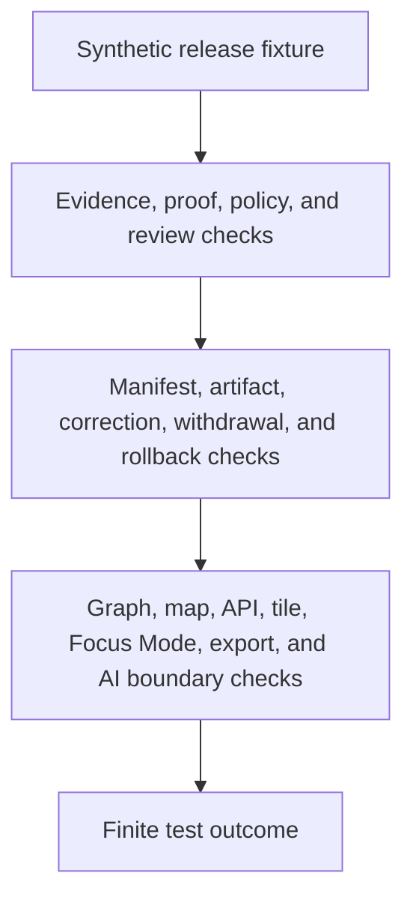

<!-- [KFM_META_BLOCK_V2]
doc_id: kfm://doc/tests-domains-roads-rail-trade-release-readme
title: Roads Rail Trade Release Tests README
type: test-index-readme
version: v0.1
status: draft; empty-placeholder-replaced; release-test-parent-index; PROPOSED / NEEDS VERIFICATION before promotion
owners:
  - OWNER_TBD - Roads/Rail/Trade Routes domain steward
  - OWNER_TBD - Release steward
  - OWNER_TBD - Rollback steward
  - OWNER_TBD - Evidence steward
  - OWNER_TBD - Policy steward
  - OWNER_TBD - Graph projection steward
  - OWNER_TBD - Map/API steward
  - OWNER_TBD - QA steward
created: 2026-07-06
updated: 2026-07-06
policy_label: public-doc; tests; roads-rail-trade; release; parent-index; ReleaseManifest; RollbackCard; CorrectionNotice; WithdrawalNotice; release-gate; public-surface-invalidation; no-network; evidence-bound; policy-gated; release-gated; rollback-aware
tags: [kfm, tests, roads-rail-trade, release, release-tests, ReleaseManifest, RollbackCard, CorrectionNotice, WithdrawalNotice, PromotionDecision, RunReceipt, ValidationReport, PolicyDecision, ReviewRecord, EvidenceBundle, RedactionReceipt, VerifyReceipt, graph-derived, map-surface, tile-cache, public-api, ABSTAIN, DENY, ERROR]
related:
  - ../../../README.md
  - ../../README.md
  - ../README.md
  - rollback_test/README.md
  - ../../../../docs/runbooks/roads-rail-trade/ROLLBACK_RUNBOOK.md
  - ../../../../data/rollback/roads-rail-trade/README.md
  - ../../../../docs/domains/roads-rail-trade/RELEASE_INDEX.md
  - ../../../../docs/domains/roads-rail-trade/DATA_LIFECYCLE.md
  - ../../../../docs/domains/roads-rail-trade/GRAPH_PROJECTIONS.md
  - ../../../../docs/domains/roads-rail-trade/MAP_UI_CONTRACTS.md
  - ../../../../tests/domains/roads-rail-trade/evidence/README.md
  - ../../../../tests/domains/roads-rail-trade/policy/README.md
  - ../../../../tests/domains/roads-rail-trade/contracts/README.md
  - ../../../../data/receipts/roads-rail-trade/redaction/README.md
  - ../../../../release/manifests/README.md
  - ../../../../release/promotion_decisions/
  - ../../../../release/rollback_cards/
  - ../../../../release/correction_notices/
  - ../../../../release/withdrawal_notices/
  - ../../../../fixtures/domains/roads-rail-trade/release/
  - ../../../../policy/domains/roads-rail-trade/
  - ../../../../schemas/contracts/v1/release/
notes:
  - "This README replaces the empty placeholder content at tests/domains/roads-rail-trade/release/README.md."
  - "Directory Rules place enforceability proof under tests/. This directory is a parent index for release-focused tests; it is not release authority, manifest storage, rollback-card storage, correction storage, withdrawal storage, public artifact storage, policy, proof, or catalog authority."
  - "Confirmed child README lane at authoring time is rollback_test/README.md. Other child lanes listed here are PROPOSED until files and executable tests are verified."
  - "Roads/Rail/Trade release docs confirm release decisions belong under release/ roots while published artifacts belong under data/published/ or governed artifact homes."
  - "The Roads/Rail/Trade rollback runbook confirms rollback is a governed state transition, pointer shift, and audit-preserving action, not a file delete, silent edit, or memory-hole."
  - "Default posture is deterministic and no-network. Real release records, credentials, production logs, production evidence, production receipts, public artifacts, and live public surfaces do not belong in default tests."
[/KFM_META_BLOCK_V2] -->

<a id="top"></a>

# Roads Rail Trade release tests

> Parent index for deterministic, no-network release guardrail tests in the Roads/Rail/Trade domain. These tests should prove that release candidates, manifests, public surfaces, corrections, withdrawals, rollbacks, and derivative invalidation stay governed without turning tests into release authority.

<p>
  
  
  
  
  
  
</p>

**Path:** `tests/domains/roads-rail-trade/release/README.md`  
**Status:** draft / empty placeholder replaced / release test parent index / PROPOSED until executable tests are verified  
**Owning root:** `tests/`  
**Domain segment:** `roads-rail-trade`  
**Test lane family:** `release`  
**Default execution posture:** deterministic, synthetic, no-network, public-safe fixtures only  
**Truth posture:** CONFIRMED target placeholder and `rollback_test/` child README; CONFIRMED release index, rollback runbook, data rollback README, and lifecycle docs provide release/rollback posture; NEEDS VERIFICATION for executable release tests, fixture homes, release schema shape, public-surface invalidation hooks, CI coverage, release integration, and pass rates.

---

## Purpose

`tests/domains/roads-rail-trade/release/` is the parent test index for release-focused guardrails in Roads/Rail/Trade.

This subtree should prove that release behavior is enforceable without relocating release authority into tests. Tests can verify whether a release candidate, ReleaseManifest, PromotionDecision, RollbackCard, CorrectionNotice, WithdrawalNotice, public API envelope, map layer, tile artifact, graph projection, Focus Mode carrier, export, or AI citation respects release boundaries. Tests do **not** approve those releases.

A passing test in this directory should **not** mean that a release is published, a rollback is approved, a public artifact is safe, a cache was purged, a graph projection is canonical, a map label is authoritative, or an AI answer is true. It should mean only that the scoped release guardrail behaved as expected against bounded synthetic fixtures and local files.

[Back to top](#top)

---

## Placement Basis

Directory Rules classify `tests/` as the root that proves rules are enforceable. This directory is therefore a release-test parent index inside a domain lane. Release decisions, published artifacts, rollback support records, proof records, receipts, policies, schemas, contracts, public APIs, map layers, graph exports, and AI runtime behavior remain in their own responsibility roots.

| Responsibility | Correct home | This directory's relationship |
|---|---|---|
| Roads/Rail/Trade release tests | `tests/domains/roads-rail-trade/release/` | This directory. |
| Domain test root | `tests/domains/roads-rail-trade/` | Parent domain lane; currently observed as a greenfield stub. |
| Rollback release tests | `tests/domains/roads-rail-trade/release/rollback_test/` | Confirmed child README lane. |
| Release decisions | `release/` roots | ReleaseManifest, PromotionDecision, RollbackCard, CorrectionNotice, WithdrawalNotice, signatures, and release changelog authority. |
| Published artifacts | `data/published/` and governed artifact homes | Public-safe artifacts; not owned here. |
| Data-plane rollback support | `data/rollback/roads-rail-trade/` | Data-plane support and alias-revert receipts; not release authority. |
| Evidence and proof | `data/proofs/` and accepted proof roots | EvidenceBundle, ProofPack, and integrity proof authority; not owned here. |
| Receipts | `data/receipts/` and accepted receipt roots | Process memory and transform receipts; not owned here. |
| Policy authority | `policy/domains/roads-rail-trade/` or ADR-selected alternate | Allow, deny, restrict, abstain, redaction, release, and rollback policy. |
| Reusable synthetic fixtures | `fixtures/domains/roads-rail-trade/release/` | Preferred fixture home if populated. |

> [!IMPORTANT]
> This README documents a test index. It cannot authorize publication, create a ReleaseManifest, approve a rollback, withdraw a release, write a public artifact, purge a production cache, or define release policy.

---

## Parent Invariant

> **Release tests prove publication boundaries; they do not publish.** A release test may demonstrate that a Roads/Rail/Trade release envelope respects evidence, proof, policy, review, manifest, correction, withdrawal, rollback, and public-surface invalidation rules. It cannot create release authority, public artifact authority, graph truth, map truth, AI truth, or publication approval.

Core checks:

| Check | Required behavior | Failure outcome |
|---|---|---|
| Test/release separation | Tests cite release expectations; tests do not author ReleaseManifests, PromotionDecisions, RollbackCards, CorrectionNotices, or WithdrawalNotices. | validation failure / promotion block. |
| Release manifest boundary | Public exposure requires a governed release envelope with evidence, policy, review, artifact refs, hashes, correction path, and rollback target where required. | `DENY` / `ABSTAIN`. |
| Candidate boundary | Release candidates remain non-public until governed release state changes. | promotion block. |
| Evidence boundary | Consequential release output requires EvidenceRef-to-EvidenceBundle support or fail-closed behavior. | `ABSTAIN`. |
| Policy and review boundary | Rights, sensitivity, legal-status, source-role, historic precision, and review blockers fail closed before public exposure. | `DENY` / `ABSTAIN`. |
| Published-artifact separation | Tests must not confuse release decisions with data/published artifacts. | validation failure. |
| Rollback boundary | Rollback target is verified and audit-preserving; rollback is not delete, file move, or silent edit. | validation failure. |
| Correction and withdrawal boundary | Corrections and withdrawals remain explicit, inspectable, and linked to affected surfaces. | promotion block. |
| Graph boundary | Network edges, route memberships, and movement story nodes remain derived and invalidatable. | validation failure. |
| Public-surface boundary | Public API, map, tile, screenshot, Focus Mode, AI, and export carriers cannot bypass release state. | `DENY` / `ABSTAIN`. |
| No-network boundary | Default release tests do not call live release services, source APIs, graph databases, map services, tile servers, public APIs, or AI runtimes. | validation failure / `ERROR`. |

---

## Lane Index

| Lane | Status | Purpose | Boundary |
|---|---|---|---|
| [`rollback_test/`](rollback_test/README.md) | CONFIRMED README / executable tests NEEDS VERIFICATION | Proves release-class defects can be handled by verified rollback targets, audit preservation, derivative invalidation, and fail-closed public surfaces. | Does not approve rollback, change production release state, delete artifacts, or purge production caches. |
| `manifest_gate_test/` | PROPOSED | Would prove ReleaseManifest-shaped candidates require evidence, policy, review, artifact hash, correction path, and rollback target before public exposure. | Release manifests do not live here. |
| `promotion_decision_test/` | PROPOSED | Would prove promotion is a governed state transition and not a file move or artifact copy. | Promotion authority remains under release roots. |
| `correction_notice_test/` | PROPOSED | Would prove corrections are explicit, linked to affected claims and surfaces, and do not mutate history in place. | Correction authority does not live here. |
| `withdrawal_notice_test/` | PROPOSED | Would prove withdrawn releases stop serving public carriers while retaining audit lineage. | Withdrawal authority does not live here. |
| `public_surface_gate_test/` | PROPOSED | Would prove map, tile, API, Focus Mode, export, and AI carriers require released artifacts and safe policy state. | Public API and UI implementation do not live here. |
| `graph_release_gate_test/` | PROPOSED | Would prove graph projections are derived release carriers that can be rebuilt or invalidated without replacing canonical evidence. | Graph implementation does not live here. |
| `no_network_test/` | PROPOSED | Would prove default release tests are local and deterministic. | Connector and integration tests require separate gates. |

Only `rollback_test/` is confirmed as an authored child README lane at the time this parent index was created. Other lanes are backlog signposts, not claims of implementation.

---

## Release-Test Flow



The diagram describes the expected test responsibility order only. It does not prove that release schemas, validators, fixtures, policy runtime, release jobs, public invalidation hooks, map behavior, AI behavior, or CI jobs currently exist.

---

## Accepted Inputs

Only bounded, synthetic, reviewable inputs belong in this lane family:

- Synthetic release fixtures with fake release IDs, candidate IDs, artifact refs, source refs, evidence refs, receipt refs, policy refs, review refs, correction refs, withdrawal refs, rollback refs, graph refs, map refs, API refs, and finite outcomes.
- Synthetic companion records for ReleaseManifest, PromotionDecision, RollbackCard, CorrectionNotice, WithdrawalNotice, RunReceipt, ValidationReport, PolicyDecision, ReviewRecord, VerifyReceipt, EvidenceBundle stub, RedactionReceipt, LayerManifest, TileArtifactManifest, graph projection, API envelope, Focus Mode carrier, export carrier, and AI citation behavior.
- Synthetic defect cases for evidence gap, source-role error, rights block, sensitivity block, historic precision block, legal-status block, temporal defect, rendering defect, graph defect, API defect, and AI citation defect.
- Canary values that make accidental public exposure, stale tile serving, graph-truth leakage, map-truth leakage, AI leakage, audit deletion, release approval, or production mutation obvious.
- Local validation envelopes emitted by test helpers.

Safe outputs may include public-safe references and operational fields such as fixture ID, release ID, release state, artifact family, validator name, finite outcome, reason code, evidence ref, policy decision ID, review record ID, receipt ref, correction ref, withdrawal ref, and rollback card ref.

---

## Exclusions

Do **not** place these materials in this lane family:

| Excluded material | Why it does not belong here | Correct direction |
|---|---|---|
| Real ReleaseManifests, PromotionDecisions, RollbackCards, CorrectionNotices, WithdrawalNotices, signatures, or release changelogs | These are release authority records. | `release/` roots. |
| Real published artifacts, tile archives, map layers, screenshots, API payloads, Focus Mode outputs, graph exports, or AI context packets | Public exposure and publication require governed release. | Governed API, release, and accepted artifact homes. |
| Real source exports, live source APIs, map services, tile services, graph databases, release services, public APIs, or AI runtime calls | Default tests must be deterministic and no-network. | Separately gated integration tests if approved. |
| Real EvidenceBundles, ProofPacks, production receipts, production logs, or audit ledgers | These may carry controlled trust state. | Their governed roots with access controls. |
| Credentials, tokens, API keys, auth headers, private endpoint URLs, or production telemetry | Security exposure. | Secret manager or fake local values only. |
| Binding policy, schema definitions, contract prose, release procedures, or rollback runbook authority | Authority does not live in this README. | `policy/`, `schemas/`, `contracts/`, `docs/runbooks/`, and `release/`. |

---

## Suggested Layout

```text
tests/domains/roads-rail-trade/release/
|-- README.md
|-- rollback_test/
|   `-- README.md
|-- manifest_gate_test/
|-- promotion_decision_test/
|-- correction_notice_test/
|-- withdrawal_notice_test/
|-- public_surface_gate_test/
|-- graph_release_gate_test/
`-- no_network_test/
```

Only `rollback_test/` is confirmed as an authored child README lane at the time this README was created. Other directories are **PROPOSED** until files and executable tests exist.

---

## Run Posture

No executable runner was verified while authoring this README. Once tests exist, the expected local command should be documented and verified here.

```bash
: "PROPOSED / NEEDS VERIFICATION"
pytest tests/domains/roads-rail-trade/release
```

Required run posture: no network access, no live release/source/graph/map/tile/public API/AI runtime calls, no real credentials, no production logs, no production release records, no production trust artifacts, no public artifact writes, deterministic fixture inputs, and finite outcomes only: `PASS`, `DENY`, `ABSTAIN`, or `ERROR`.

---

## Minimal Parent Release Fixture

Synthetic parent fixtures should make release boundaries inspectable without carrying real release or artifact data.

```json
{
  "fixture_id": "roads-rail-trade-release-parent-example",
  "release_case_id": "release-parent-fixture-001",
  "release_state": "DRAFT",
  "candidate_release_id": "release-fixture-roads-rail-trade-candidate-001",
  "artifact_refs": [
    "layer-manifest-fixture-001",
    "tile-artifact-manifest-fixture-001",
    "api-envelope-fixture-001"
  ],
  "evidence_ref": "evidence-ref-fixture-release-parent-001",
  "validation_report_ref": "validation-report-fixture-release-parent-001",
  "policy_decision_ref": "policy-decision-fixture-release-parent-001",
  "review_record_ref": null,
  "release_manifest_ref": null,
  "correction_notice_ref": null,
  "withdrawal_notice_ref": null,
  "rollback_card_ref": "rollback-card-fixture-release-parent-001",
  "expected_outcome": "ABSTAIN",
  "reason_code": "RELEASE_TEST_DOES_NOT_AUTHORIZE_PUBLICATION",
  "must_not_claim": [
    "PRODUCTION_RELEASE_CREATED_CANARY",
    "PUBLIC_ARTIFACT_WRITTEN_CANARY",
    "FLOATING_LATEST_APPROVED_CANARY",
    "GRAPH_TRUTH_CANARY",
    "MAP_TRUTH_CANARY",
    "AI_TRUTH_CANARY",
    "RELEASE_APPROVAL_CANARY"
  ]
}
```

The JSON above is illustrative. Accepted schema, field names, release-state vocabulary, manifest shape, reason codes, fixture homes, and CI wiring remain **NEEDS VERIFICATION**.

---

## Evidence Ledger

| Source | Status | Supports | Limits |
|---|---|---|---|
| `Directory Rules.pdf` | CONFIRMED doctrine | `tests/` is the canonical enforceability root; release authority remains separate. | Does not prove executable tests, fixtures, CI, schemas, release runtime, or public invalidation behavior. |
| `tests/domains/roads-rail-trade/release/rollback_test/README.md` | CONFIRMED child lane README | Defines rollback release-test posture and rollback-not-delete / release-authority boundaries. | Does not prove executable rollback tests exist. |
| `docs/runbooks/roads-rail-trade/ROLLBACK_RUNBOOK.md` | CONFIRMED repo evidence | Defines rollback as pointer-shift, audit-preserving, governed release action with target validation, receipts, preconditions, and public runtime checks. | Runbook marks exact commands, schema homes, route names, and deployed behavior as NEEDS VERIFICATION. |
| `data/rollback/roads-rail-trade/README.md` | CONFIRMED repo evidence | Defines data-plane rollback support and says it is not release authority, not public path, not deletion, and not a file-move shortcut. | Does not prove emitted rollback receipts, alias-revert implementation, or release integration. |
| `docs/domains/roads-rail-trade/RELEASE_INDEX.md` | CONFIRMED repo evidence | Defines release index posture, release-state vocabulary conflict, release root decision authority, rollback requirement, and release vs published artifact separation. | Register entries are template form and per-domain release presence remains NEEDS VERIFICATION. |
| `docs/domains/roads-rail-trade/DATA_LIFECYCLE.md` | CONFIRMED repo evidence | Defines RAW to PUBLISHED lifecycle, public-safe candidates, derived graph posture, governed APIs, release gates, correction path, and rollback target. | Implementation-layer paths and artifact IDs remain PROPOSED in that doc. |
| GitHub target file before update | CONFIRMED repo evidence | `tests/domains/roads-rail-trade/release/README.md` existed as empty placeholder content before replacement. | Placeholder proves path existence only. |

---

## Validation Checklist

- [ ] Confirm accepted parent release-test indexing convention for `tests/domains/roads-rail-trade/release/`.
- [ ] Confirm accepted fixture home and naming convention for release test fixtures.
- [ ] Confirm accepted release schema locations for ReleaseManifest, PromotionDecision, RollbackCard, CorrectionNotice, WithdrawalNotice, and runtime release envelopes.
- [ ] Confirm accepted fields for release state, artifact refs, public-surface refs, evidence refs, receipt refs, policy refs, review refs, correction refs, withdrawal refs, rollback refs, finite outcomes, and reason codes.
- [ ] Add executable tests for release manifest gates, promotion state transition, correction notice behavior, withdrawal notice behavior, rollback target verification, graph invalidation, map/API/tile/Focus Mode invalidation, AI boundary, and no-network behavior.
- [ ] Confirm tests do not use real release services, source feeds, graph databases, map services, tile services, public APIs, AI runtimes, credentials, production logs, production EvidenceBundles, production receipts, proof payloads, or public artifact writes.
- [ ] Wire the lane into CI only after executable tests and safe fixtures exist.

---

## Rollback

Rollback is required if this parent index starts to store real release records, define release authority instead of testing it, treat a test pass as release approval, delete audit history, allow withdrawn release context to remain active in public carriers, or bypass EvidenceBundle resolution, source role, temporal scope, rights, sensitivity, policy decisions, review state, release state, correction, withdrawal, or rollback controls.

Rollback target: restore the previous safe README revision or remove this parent index until child lane placement, fixtures, schemas, release vocabulary, policy expectations, invalidation behavior, correction behavior, rollback behavior, and CI integration are reverified.

[Back to top](#top)