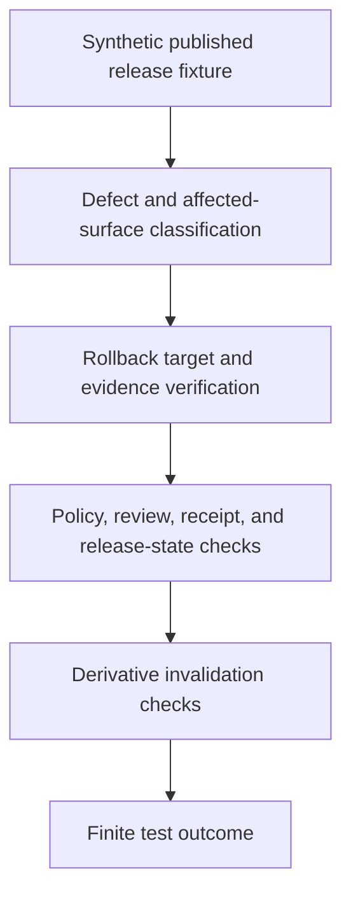

<!-- [KFM_META_BLOCK_V2]
doc_id: kfm://doc/tests-domains-roads-rail-trade-release-rollback-test-readme
title: Roads Rail Trade Release Rollback Test README
type: test-lane-readme
version: v0.1
status: draft; empty-placeholder-replaced; release-test-lane; rollback-guardrail; PROPOSED / NEEDS VERIFICATION before promotion
owners:
  - OWNER_TBD - Roads/Rail/Trade Routes domain steward
  - OWNER_TBD - Release steward
  - OWNER_TBD - Rollback steward
  - OWNER_TBD - Evidence steward
  - OWNER_TBD - Policy steward
  - OWNER_TBD - Graph projection steward
  - OWNER_TBD - Map/API steward
  - OWNER_TBD - QA steward
created: 2026-07-06
updated: 2026-07-06
policy_label: public-doc; tests; roads-rail-trade; release; rollback; rollback-target; ReleaseManifest; RollbackCard; CorrectionNotice; WithdrawalNotice; derivative-invalidation; no-network; evidence-bound; policy-gated; release-gated; rollback-aware
tags: [kfm, tests, roads-rail-trade, release, rollback, rollback-test, ReleaseManifest, RollbackCard, CorrectionNotice, WithdrawalNotice, RunReceipt, ValidationReport, PolicyDecision, ReviewRecord, EvidenceBundle, RedactionReceipt, VerifyReceipt, graph-derived, map-surface, tile-cache, public-api, ABSTAIN, DENY, ERROR]
related:
  - ../README.md
  - ../../README.md
  - ../../../README.md
  - ../../../../README.md
  - ../../../../../docs/runbooks/roads-rail-trade/ROLLBACK_RUNBOOK.md
  - ../../../../../data/rollback/roads-rail-trade/README.md
  - ../../../../../docs/domains/roads-rail-trade/RELEASE_INDEX.md
  - ../../../../../docs/domains/roads-rail-trade/DATA_LIFECYCLE.md
  - ../../../../../docs/domains/roads-rail-trade/GRAPH_PROJECTIONS.md
  - ../../../../../docs/domains/roads-rail-trade/MAP_UI_CONTRACTS.md
  - ../../../../../tests/domains/roads-rail-trade/evidence/README.md
  - ../../../../../tests/domains/roads-rail-trade/policy/README.md
  - ../../../../../tests/domains/roads-rail-trade/contracts/README.md
  - ../../../../../data/receipts/roads-rail-trade/redaction/README.md
  - ../../../../../release/manifests/README.md
  - ../../../../../release/rollback_cards/
  - ../../../../../release/correction_notices/
  - ../../../../../release/withdrawal_notices/
  - ../../../../../fixtures/domains/roads-rail-trade/release/rollback/
  - ../../../../../policy/domains/roads-rail-trade/
  - ../../../../../schemas/contracts/v1/release/
notes:
  - "This README replaces the empty placeholder content at tests/domains/roads-rail-trade/release/rollback_test/README.md."
  - "Directory Rules place enforceability proof under tests/. This lane tests rollback behavior; it does not define release authority, rollback decisions, release manifests, rollback cards, correction notices, withdrawal notices, policy, proof, or public artifact storage."
  - "The parent tests/domains/roads-rail-trade/release/README.md was checked during authoring and was not found. This child lane is self-contained until a parent release-test index is authored."
  - "The Roads/Rail/Trade rollback runbook confirms rollback is a governed state transition, pointer shift, audit-preserving action, not a file delete or memory-hole."
  - "The data rollback lane confirms data/rollback/roads-rail-trade/ is data-plane rollback support, not release authority and not a public path."
  - "Default posture is deterministic and no-network. Real release records, credentials, production logs, production evidence, and public artifacts do not belong in default tests."
[/KFM_META_BLOCK_V2] -->

<a id="top"></a>

# Roads Rail Trade rollback release tests

> Deterministic, no-network test documentation for proving that Roads/Rail/Trade public releases can be withdrawn, corrected, invalidated, or shifted back to a verified rollback target without deleting audit history, bypassing release authority, or re-serving unsafe derived outputs.

<p>
  
  
  
  
  
  
</p>

**Path:** `tests/domains/roads-rail-trade/release/rollback_test/README.md`  
**Status:** draft / empty placeholder replaced / release test lane / PROPOSED until executable tests are verified  
**Owning root:** `tests/`  
**Domain segment:** `roads-rail-trade`  
**Test lane:** `release/rollback_test`  
**Default execution posture:** deterministic, synthetic, no-network, public-safe fixtures only  
**Truth posture:** CONFIRMED target placeholder, rollback runbook, data rollback README, and release index evidence; CONFIRMED parent `tests/domains/roads-rail-trade/release/README.md` was not found during authoring; NEEDS VERIFICATION for executable tests, fixture shape, release schema shape, rollback card shape, policy runtime, CI coverage, public-surface invalidation, and pass rates.

---

## Purpose

`tests/domains/roads-rail-trade/release/rollback_test/` is the requested release test lane for rollback behavior in Roads/Rail/Trade.

This lane should prove that a release-class defect discovered after publication can be handled by a governed rollback flow: affected release identified, rollback target verified, required evidence and receipts checked, public surfaces withdrawn or re-pointed, derived graph/map/API/AI carriers invalidated, correction or withdrawal state recorded, and audit history preserved.

A passing test here should **not** mean that a rollback was approved, a release is valid, a public artifact is safe, a tile cache was actually purged, a graph projection is canonical, or a production release was changed. It should mean only that the scoped rollback guardrail behaved as expected against bounded synthetic fixtures and local files.

[Back to top](#top)

---

## Placement Basis

Directory Rules classify `tests/` as the root that proves rules are enforceable. This path is therefore a release-focused test lane. It does not own release decisions, rollback cards, correction notices, withdrawal notices, published artifacts, data-plane rollback receipts, evidence/proof records, policies, source descriptors, contracts, schemas, public APIs, map layers, graph exports, or AI runtime behavior.

| Responsibility | Correct home | This lane's relationship |
|---|---|---|
| Rollback release tests | `tests/domains/roads-rail-trade/release/rollback_test/` | This directory. |
| Parent release test index | `tests/domains/roads-rail-trade/release/README.md` | Not found during authoring; NEEDS VERIFICATION. |
| Rollback runbook | `docs/runbooks/roads-rail-trade/ROLLBACK_RUNBOOK.md` | Defines rollback procedure and doctrine posture; not owned here. |
| Data-plane rollback support | `data/rollback/roads-rail-trade/` | Confirmed README; data-plane support, not release authority. |
| Release decisions | `release/` roots | ReleaseManifest, RollbackCard, CorrectionNotice, WithdrawalNotice, signatures, and changelog authority. |
| Evidence and proof | `data/proofs/` and accepted proof roots | EvidenceBundle, ProofPack, and integrity proof authority; not owned here. |
| Receipts | `data/receipts/` and accepted receipt roots | Process memory and transform receipts; not owned here. |
| Policy authority | `policy/domains/roads-rail-trade/` or ADR-selected alternate | Allow, deny, restrict, abstain, release, rollback, and exposure policy. |
| Reusable synthetic fixtures | `fixtures/domains/roads-rail-trade/release/rollback/` | Preferred fixture home if populated. |

> [!IMPORTANT]
> This README documents a test lane. It cannot authorize a rollback, define a release decision, delete a release, edit published artifacts, purge caches, or approve public exposure.

---

## Invariant Under Test

> **Rollback is a governed state transition, not a delete, not a file move, and not a silent edit.** A rollback test must prove that released Roads/Rail/Trade carriers can return to a verified safe target or move to a withdrawn state while preserving lineage, receipts, correction state, public-surface invalidation, and auditability.

| Check | Required behavior | Failure outcome |
|---|---|---|
| Release identification | Test fixture names the affected release, artifact refs, public surfaces, and defect class. | `ABSTAIN` / validation failure. |
| Rollback target boundary | Rollback target points to a verified prior release envelope, not an unverified file path or floating latest pointer. | promotion block. |
| Rollback-not-delete boundary | Prior and withdrawn artifacts remain inspectable through governed audit paths; rollback does not erase history. | validation failure. |
| Release authority boundary | RollbackCard, CorrectionNotice, WithdrawalNotice, and ReleaseManifest authority remain under release roots. | promotion block. |
| Evidence boundary | Affected release and rollback target carry EvidenceRef / EvidenceBundle support or the test fails closed. | `ABSTAIN`. |
| Policy and review boundary | Rights, sensitivity, legal status, source role, review state, and release state are checked before any restored target is considered public-safe. | `DENY` / `ABSTAIN`. |
| Receipt boundary | RunReceipt, ValidationReport, PolicyDecision, VerifyReceipt, and redaction receipt refs remain visible where material. | validation failure. |
| Graph invalidation boundary | Network edges, route memberships, and graph-derived outputs are invalidated or rebuilt without replacing canonical evidence. | validation failure. |
| Map/API invalidation boundary | API responses, layer manifests, tile manifests, map labels, screenshots, exports, and Focus Mode surfaces do not keep serving the withdrawn release. | promotion block / `DENY`. |
| AI boundary | Generated summaries that cited a withdrawn release must abstain or cite the new release posture; AI text never authorizes rollback. | `DENY` / `ABSTAIN`. |
| No-network boundary | Default tests do not call live release services, public APIs, map services, tile servers, graph databases, source APIs, or AI runtimes. | validation failure / `ERROR`. |

---

## Rollback Guardrail Flow



The diagram describes the intended test flow only. It does not prove that release schemas, rollback cards, validators, fixtures, policy runtime, public invalidation hooks, map behavior, AI behavior, or CI jobs currently exist.

---

## Expected Test Families

| Family | Purpose | Required boundary |
|---|---|---|
| Release identification tests | Ensure affected releases and public surfaces are named before rollback assertions run. | Do not roll back unnamed state. |
| Target verification tests | Ensure rollback target is a verified prior release envelope with evidence, policy, hashes, and rollback support. | Target is not a floating pointer. |
| Audit preservation tests | Ensure rollback appends state and receipts rather than deleting or silently editing artifacts. | Rollback is not erasure. |
| Release authority tests | Ensure test code cannot create release authority or approve rollback by itself. | Release root owns decisions. |
| Evidence and proof tests | Ensure EvidenceBundle and proof requirements are not replaced by rollback-test success. | Evidence outranks test text. |
| Policy and review tests | Ensure rights, sensitivity, legal-status, source-role, and review blockers fail closed before restored exposure. | Restore only safe targets. |
| Graph invalidation tests | Ensure graph projections and route memberships depending on withdrawn artifacts are invalidated or rebuilt. | Graph is derived. |
| Map/API/AI invalidation tests | Ensure public carriers stop serving withdrawn release context and do not overstate current release state. | Public surfaces stay release-gated. |
| No-network tests | Ensure default lane execution is local and deterministic. | No live systems in default tests. |

---

## Accepted Inputs

Only bounded, synthetic, reviewable inputs belong in this lane:

- Synthetic rollback fixtures with fake release IDs, artifact refs, source refs, evidence refs, policy refs, review refs, receipt refs, public-surface refs, correction refs, withdrawal refs, rollback card refs, and finite outcomes.
- Synthetic companion records for ReleaseManifest, RollbackCard, CorrectionNotice, WithdrawalNotice, RunReceipt, ValidationReport, PolicyDecision, ReviewRecord, VerifyReceipt, EvidenceBundle stub, RedactionReceipt, LayerManifest, TileArtifactManifest, graph projection, API envelope, and Focus Mode carrier behavior.
- Synthetic defect cases for evidence gap, source-role error, rights block, sensitivity block, historic precision block, legal-status block, temporal defect, rendering defect, graph defect, API defect, and AI citation defect.
- Canary values that make accidental public re-serving, stale tile exposure, graph-truth leakage, map-truth leakage, AI leakage, audit deletion, or release approval obvious.
- Local validation envelopes emitted by test helpers.

Safe outputs may include public-safe references and operational fields such as fixture ID, affected release ID, rollback target ID, artifact family, validator name, finite outcome, reason code, evidence ref, policy decision ID, receipt ref, correction ref, withdrawal ref, and rollback card ref.

---

## Exclusions

Do **not** place these materials in this lane:

| Excluded material | Why it does not belong here | Correct direction |
|---|---|---|
| Real ReleaseManifests, RollbackCards, CorrectionNotices, WithdrawalNotices, signatures, or release changelogs | These are release authority records. | `release/` roots. |
| Real published artifacts, tile archives, map layers, screenshots, API payloads, Focus Mode outputs, graph exports, or AI context packets | Public exposure and publication require governed release. | Governed API, release, and accepted artifact homes. |
| Real source exports, live source APIs, map services, tile services, graph databases, release services, public APIs, or AI runtime calls | Default tests must be deterministic and no-network. | Separately gated integration tests if approved. |
| Real EvidenceBundles, ProofPacks, production receipts, production logs, or audit ledgers | These may carry controlled trust state. | Their governed roots with access controls. |
| Credentials, tokens, API keys, auth headers, private endpoint URLs, or production telemetry | Security exposure. | Secret manager or fake local values only. |
| Binding policy, schema definitions, contract prose, release procedures, or rollback runbook authority | Authority does not live in this README. | `policy/`, `schemas/`, `contracts/`, `docs/runbooks/`, and `release/`. |

---

## Suggested Layout

```text
tests/domains/roads-rail-trade/release/rollback_test/
|-- README.md
|-- test_rollback_requires_named_affected_release.py
|-- test_rollback_target_must_be_verified_release_manifest.py
|-- test_rollback_is_not_delete_or_silent_edit.py
|-- test_rollback_requires_evidence_policy_review_and_receipts.py
|-- test_rollback_invalidates_graph_derivatives.py
|-- test_rollback_invalidates_map_api_tile_and_focus_outputs.py
|-- test_rollback_blocks_ai_answers_from_withdrawn_release.py
`-- test_rollback_release_no_network.py
```

This layout is **PROPOSED** until executable files exist in the repository.

---

## Run Posture

No executable runner was verified while authoring this README. Once tests exist, the expected local command should be documented and verified here.

```bash
: "PROPOSED / NEEDS VERIFICATION"
pytest tests/domains/roads-rail-trade/release/rollback_test
```

Required run posture: no network access, no live release/source/graph/map/tile/public API/AI runtime calls, no real credentials, no production logs, no production release records, no production trust artifacts, no public artifact writes, deterministic fixture inputs, and finite outcomes only: `PASS`, `DENY`, `ABSTAIN`, or `ERROR`.

---

## Minimal Rollback Fixture

Synthetic fixtures should make rollback boundaries inspectable without carrying real release or artifact data.

```json
{
  "fixture_id": "roads-rail-trade-rollback-example",
  "affected_release_id": "release-fixture-roads-rail-trade-002",
  "rollback_target_release_id": "release-fixture-roads-rail-trade-001",
  "defect_class": "graph_projection_stale_after_policy_block",
  "affected_surfaces": [
    "layer-manifest-fixture-002",
    "tile-artifact-manifest-fixture-002",
    "api-envelope-fixture-002",
    "focus-mode-carrier-fixture-002"
  ],
  "evidence_ref": "evidence-ref-fixture-rollback-001",
  "validation_report_ref": "validation-report-fixture-rollback-001",
  "policy_decision_ref": "policy-decision-fixture-rollback-001",
  "review_record_ref": "review-record-fixture-rollback-001",
  "rollback_card_ref": "rollback-card-fixture-001",
  "correction_notice_ref": "correction-notice-fixture-001",
  "withdrawal_notice_ref": "withdrawal-notice-fixture-001",
  "expected_outcome": "ABSTAIN",
  "reason_code": "ROLLBACK_TARGET_NEEDS_VERIFICATION_BEFORE_PUBLIC_RESTORE",
  "must_not_claim": [
    "PRODUCTION_ROLLBACK_PERFORMED_CANARY",
    "AUDIT_HISTORY_DELETED_CANARY",
    "FLOATING_LATEST_TARGET_CANARY",
    "GRAPH_TRUTH_CANARY",
    "MAP_TRUTH_CANARY",
    "AI_TRUTH_CANARY",
    "PUBLIC_SURFACE_STILL_ACTIVE_CANARY"
  ]
}
```

The JSON above is illustrative. Accepted schema, field names, release-state vocabulary, rollback-card shape, reason codes, fixture homes, and CI wiring remain **NEEDS VERIFICATION**.

---

## Evidence Ledger

| Source | Status | Supports | Limits |
|---|---|---|---|
| `Directory Rules.pdf` | CONFIRMED doctrine | `tests/` is the canonical enforceability root; release authority remains separate. | Does not prove executable tests, fixtures, CI, schemas, release runtime, or public invalidation behavior. |
| `docs/runbooks/roads-rail-trade/ROLLBACK_RUNBOOK.md` | CONFIRMED repo evidence | Defines Roads/Rail/Trade rollback as pointer-shift, audit-preserving, governed release action; names defect classes, preconditions, target validation, receipts, separation of duties, and public runtime checks. | Runbook marks exact commands, schema homes, route names, and deployed behavior as NEEDS VERIFICATION. |
| `data/rollback/roads-rail-trade/README.md` | CONFIRMED repo evidence | Defines data-plane rollback support lane and says it is not release authority, not public path, not deletion, and not a file-move shortcut. | Does not prove emitted rollback receipts, alias-revert implementation, or release integration. |
| `docs/domains/roads-rail-trade/RELEASE_INDEX.md` | CONFIRMED repo evidence | Defines release index posture, release-state vocabulary conflict, release root decision authority, rollback requirement, and release vs published artifact separation. | Register entries are template form and per-domain release presence remains NEEDS VERIFICATION. |
| `docs/domains/roads-rail-trade/DATA_LIFECYCLE.md` | CONFIRMED repo evidence | Defines RAW to PUBLISHED lifecycle, public-safe candidates, derived graph posture, governed APIs, release gates, correction path, and rollback target. | Implementation-layer paths and artifact IDs remain PROPOSED in that doc. |
| `tests/domains/roads-rail-trade/release/README.md` | CONFIRMED not found in GitHub fetch | Parent release test index is missing at authoring time. | Does not block this child README, but parent index remains a validation item. |
| GitHub target file before update | CONFIRMED repo evidence | `tests/domains/roads-rail-trade/release/rollback_test/README.md` existed as empty placeholder content before replacement. | Placeholder proves path existence only. |

---

## Validation Checklist

- [ ] Confirm or create parent release test index at `tests/domains/roads-rail-trade/release/README.md`.
- [ ] Confirm accepted fixture home and naming convention for rollback release fixtures.
- [ ] Confirm accepted release schema locations for ReleaseManifest, RollbackCard, CorrectionNotice, WithdrawalNotice, and runtime release envelopes.
- [ ] Confirm accepted fields for affected release ID, rollback target ID, artifact refs, public-surface refs, evidence refs, receipt refs, policy refs, review refs, correction refs, withdrawal refs, rollback refs, finite outcomes, and reason codes.
- [ ] Add executable tests for affected-release naming, rollback target verification, audit preservation, evidence/policy/review/receipt requirements, graph invalidation, map/API/tile/Focus Mode invalidation, AI boundary, correction/withdrawal/rollback refs, and no-network behavior.
- [ ] Confirm tests do not use real release services, source feeds, graph databases, map services, tile services, public APIs, AI runtimes, credentials, production logs, production EvidenceBundles, production receipts, proof payloads, or public artifact writes.
- [ ] Wire the lane into CI only after executable tests and safe fixtures exist.

---

## Rollback

Rollback is required if this lane starts to store real release records, define release authority instead of testing it, treat a test pass as rollback approval, delete audit history, allow withdrawn release context to remain active in public carriers, or bypass EvidenceBundle resolution, source role, temporal scope, rights, sensitivity, policy decisions, review state, release state, correction, withdrawal, or rollback controls.

Rollback target: restore the previous safe README revision or remove this test lane until parent index placement, fixtures, schemas, release vocabulary, policy expectations, invalidation behavior, correction behavior, rollback behavior, and CI integration are reverified.

[Back to top](#top)