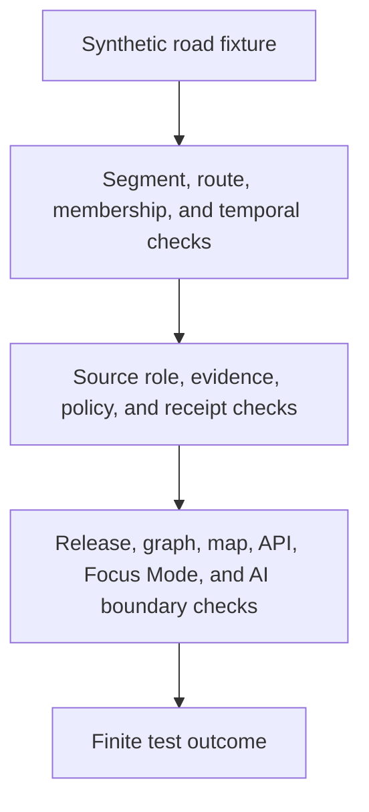

<!-- [KFM_META_BLOCK_V2]
doc_id: kfm://doc/tests-domains-roads-readme
title: Roads Domain Tests README
type: test-domain-readme
version: v0.1
status: draft; empty-placeholder-replaced; compatibility-road-slice-test-index; PROPOSED / NEEDS VERIFICATION before promotion
owners:
  - OWNER_TBD - Roads/Rail/Trade Routes domain steward
  - OWNER_TBD - Roads slice steward
  - OWNER_TBD - QA steward
  - OWNER_TBD - Contracts steward
  - OWNER_TBD - Evidence steward
  - OWNER_TBD - Policy steward
  - OWNER_TBD - Release steward
created: 2026-07-06
updated: 2026-07-06
policy_label: public-doc; tests; roads; compatibility-slice; roads-rail-trade; no-network; source-role-aware; temporal-scope-aware; evidence-bound; policy-gated; release-gated; rollback-aware
tags: [kfm, tests, roads, roads-rail-trade, road-segment, corridor-route, route-membership, restriction-event, status-event, operator-assignment, access-restriction, bridge, crossing, ferry, network-edge, EvidenceBundle, EvidenceRef, PolicyDecision, ReviewRecord, ReleaseManifest, RollbackCard, ABSTAIN, DENY, ERROR]
related:
  - ../README.md
  - ../../README.md
  - ../roads-rail-trade/README.md
  - ../roads-rail-trade/contracts/README.md
  - ../roads-rail-trade/evidence/README.md
  - ../roads-rail-trade/policy/README.md
  - ../roads-rail-trade/release/README.md
  - ../../../contracts/domains/roads/README.md
  - ../../../contracts/domains/roads-rail-trade/README.md
  - ../../../docs/domains/roads-rail-trade/README.md
  - ../../../docs/domains/roads-rail-trade/sublanes/roads.md
  - ../../../docs/domains/roads-rail-trade/DATA_LIFECYCLE.md
  - ../../../docs/domains/roads-rail-trade/IDENTITY_MODEL.md
  - ../../../docs/domains/roads-rail-trade/OBJECT_FAMILIES.md
  - ../../../docs/domains/roads-rail-trade/RELEASE_INDEX.md
  - ../../../data/registry/sources/roads-rail-trade/README.md
  - ../../../fixtures/domains/roads/
  - ../../../fixtures/domains/roads-rail-trade/
  - ../../../policy/domains/roads-rail-trade/
  - ../../../release/candidates/roads-rail-trade/
notes:
  - "This README replaces the empty placeholder content at tests/domains/roads/README.md."
  - "Directory Rules place enforceability proof under tests/ and domain-specific test lanes under tests/domains/<domain>/."
  - "Current repo evidence also contains tests/domains/roads-rail-trade/README.md and contracts/domains/roads/README.md. The roads path is therefore treated here as a PROPOSED road-specific compatibility slice, not a new canonical domain split."
  - "The roads sublane documentation says the sublane term and subdirectory pattern are PROPOSED / NEEDS VERIFICATION. This README preserves that boundary."
  - "Executable tests, child lanes, fixtures, validators, schemas, CI jobs, release integration, and pass rates remain NEEDS VERIFICATION."
[/KFM_META_BLOCK_V2] -->

<a id="top"></a>

# Roads domain tests

> Road-specific test index for deterministic, no-network guardrails inside the broader Roads/Rail/Trade domain. This directory should test road-mode behavior without creating a parallel source of domain authority.

<p>
  
  
  
  
  
  
</p>

**Path:** `tests/domains/roads/README.md`  
**Status:** draft / empty placeholder replaced / compatibility road-slice test index / PROPOSED until executable tests are verified  
**Owning root:** `tests/`  
**Slice segment:** `roads`  
**Parent domain context:** `roads-rail-trade`  
**Default execution posture:** deterministic, synthetic, no-network, public-safe fixtures only  
**Truth posture:** CONFIRMED target file existed as an empty placeholder before replacement; CONFIRMED `contracts/domains/roads/README.md` treats `roads/` as a PROPOSED compatibility/orientation slice; CONFIRMED `docs/domains/roads-rail-trade/sublanes/roads.md` treats the roads sublane pattern as PROPOSED / NEEDS VERIFICATION; CONFIRMED broader domain test parent exists at `tests/domains/roads-rail-trade/README.md`; NEEDS VERIFICATION for executable roads tests, child lanes, fixtures, schemas, CI coverage, and pass rates.

---

## Purpose

`tests/domains/roads/` is a road-specific test index for the roads slice of the broader Roads/Rail/Trade domain.

This directory may host or point to tests that focus on road-mode behavior: road segments, corridor routes, route memberships, road-side crossings, bridge/ferry relations, restriction events, status events, operator assignments, access restrictions, road-aligned network projections, public map carriers, release gates, corrections, and rollback behavior.

A passing test here should not mean that a road is legally designated, public, open, current, safe for travel, precisely surveyed, or approved for release. It should mean only that the scoped road guardrail behaved as expected against bounded synthetic fixtures and local files.

[Back to top](#top)

---

## Placement Basis

Directory Rules say file placement encodes ownership, lifecycle, and governance. They also place rule-enforceability proof under `tests/` and domain-specific test lanes under `tests/domains/<domain>/`.

The path is acceptable as a test lane because it is under `tests/`. The slug is more cautious: current Roads/Rail/Trade doctrine and adjacent tests use `roads-rail-trade`, while `contracts/domains/roads/README.md` documents `roads/` as a compatibility or orientation slice. This README follows that posture and does not create a new canonical domain.

| Responsibility | Correct home | This directory's relationship |
|---|---|---|
| Road-slice tests | `tests/domains/roads/` | This directory, PROPOSED compatibility slice. |
| Broader Roads/Rail/Trade tests | `tests/domains/roads-rail-trade/` | Confirmed parent domain test lane. |
| Road-slice contracts | `contracts/domains/roads/` | Confirmed compatibility/orientation contract README. |
| Broad domain contracts | `contracts/domains/roads-rail-trade/` | Confirmed broader contract lane. |
| Road-slice doctrine | `docs/domains/roads-rail-trade/sublanes/roads.md` | Draft and PROPOSED sublane guidance. |
| Fixtures | `fixtures/domains/roads/` or `fixtures/domains/roads-rail-trade/` | NEEDS VERIFICATION. |
| Binding policy | `policy/domains/roads-rail-trade/` or ADR-selected alternate | Not owned here. |
| Release decisions | `release/` roots | Not owned here. |

> [!IMPORTANT]
> This directory is not a new canonical Roads domain authority unless an ADR or governing README later says so. Until then, treat it as a road-specific test compatibility slice under Roads/Rail/Trade.

---

## Invariant Under Test

> **Road tests prove road-mode guardrails; they do not prove road truth.**

Core checks:

| Check | Required behavior | Failure outcome |
|---|---|---|
| Slice boundary | Road tests stay aligned to `roads-rail-trade` doctrine and do not split authority. | promotion block. |
| Source-role boundary | Source roles remain fixed and cannot be upcast by normalization, map display, graph projection, generated wording, or release assembly. | `DENY` / `ABSTAIN`. |
| Legal-status boundary | Names, geometry, route labels, or context sources cannot prove legal designation, jurisdiction, access, operator identity, current status, or travel safety. | `DENY` / `ABSTAIN`. |
| Segment/route boundary | Road Segment, CorridorRoute, and RouteMembership remain separate object families. | validation failure. |
| Temporal boundary | Source, observed, valid, retrieval, release, and correction times remain distinct where material. | validation failure / `ABSTAIN`. |
| Evidence boundary | Consequential outputs require EvidenceRef-to-EvidenceBundle support or fail closed. | `ABSTAIN`. |
| Policy boundary | Rights, sensitivity, access, legal status, and release uncertainty fail closed. | `DENY` / `ABSTAIN`. |
| Graph boundary | Network nodes, edges, and movement carriers are derived and invalidatable, not canonical truth. | validation failure. |
| Public-surface boundary | Public API, map, tile, export, Focus Mode, and AI carriers cannot bypass release state. | `DENY` / `ABSTAIN`. |
| No-network boundary | Default road tests do not call live source feeds, routing services, legal-status systems, map services, public APIs, or AI runtimes. | validation failure / `ERROR`. |

---

## Confirmed and Proposed Lanes

| Lane | Status | Purpose | Boundary |
|---|---|---|---|
| `README.md` | CONFIRMED README | Domain-slice index for road-specific tests. | Does not claim executable coverage. |
| `contracts/` | PROPOSED | Would test road-segment, route-membership, corridor-route, event, and access contract guardrails. | Contract authority does not live here. |
| `evidence/` | PROPOSED | Would test EvidenceRef, redaction/generalization receipt, and proof boundaries for road claims. | Evidence/proof authority does not live here. |
| `policy/` | PROPOSED | Would test legal-status denial, access denial, sensitivity, and source-role fail-closed behavior. | Binding policy does not live here. |
| `release/` | PROPOSED | Would test release gates, correction, withdrawal, rollback, and public-surface invalidation for road outputs. | Release authority does not live here. |
| `graph/` | PROPOSED | Would test road-mode graph projections as derived and rollbackable carriers. | Graph projection does not become truth. |
| `no_network/` | PROPOSED | Would test deterministic local execution posture. | Integration tests require separate gates. |

At authoring time, no child README lanes under `tests/domains/roads/` were confirmed. Use `tests/domains/roads-rail-trade/` as the mature sibling index until this slice is explicitly adopted or migrated.

---

## Road-Test Flow



The diagram describes intended test responsibility only. It does not prove that executable tests, fixtures, validators, policy runtime, release jobs, graph projections, public invalidation hooks, map behavior, AI behavior, or CI jobs currently exist.

---

## Accepted Inputs

Only bounded, synthetic, reviewable inputs belong in this directory:

- synthetic road fixtures with fake source refs, road segment refs, route refs, membership refs, event refs, evidence refs, policy refs, receipt refs, release refs, correction refs, withdrawal refs, and rollback refs
- synthetic object-family stubs for Road Segment, CorridorRoute, RouteMembership, Crossing, Bridge, Ferry, River Crossing, RestrictionEvent, StatusEvent, OperatorAssignment, AccessRestriction, NetworkNode, NetworkEdge, and MovementStoryNode behavior
- synthetic source-role cases for observed, regulatory, modeled, aggregate, administrative, candidate, context, and synthetic posture where accepted vocabulary supports those roles
- synthetic policy cases for legal-status denial, access denial, source-role denial, redaction/generalization, release block, correction, withdrawal, rollback, and quarantine
- canary values that make source-role collapse, legal-status overclaiming, access overclaiming, graph-truth leakage, map-truth leakage, AI leakage, logging, or public export obvious
- local validation envelopes emitted by test helpers

Safe outputs may include public-safe references and operational fields such as fixture ID, lane ID, object family, source role, time kind, validator name, finite outcome, reason code, evidence ref, policy decision ID, review record ID, receipt ref, release ref, correction ref, withdrawal ref, and rollback ref.

---

## Exclusions

Do not place these materials in this road test slice:

| Excluded material | Why it does not belong here |
|---|---|
| Real source exports, live feeds, legal-status records, access records, routing responses, or public payloads | Default tests must stay synthetic, deterministic, and no-network. |
| Secrets, credentials, private endpoints, or production logs | Security and exposure risk. |
| Real EvidenceBundles, ProofPacks, production receipts, release manifests, rollback cards, correction notices, withdrawal notices, public artifacts, or audit ledgers | These are governed trust records or release artifacts. |
| Binding policy rules, schema definitions, contract prose, source descriptors, release procedures, graph implementation, map implementation, API implementation, or AI runtime implementation | Authority and implementation belong in their own responsibility roots. |
| Public map layers, tiles, screenshots, exports, Focus Mode outputs, AI context packets, or public API payloads | Publication requires governed release. |

---

## Suggested Layout

```text
tests/domains/roads/
|-- README.md
|-- contracts/
|-- evidence/
|-- policy/
|-- release/
|-- graph/
`-- no_network/
```

This layout is PROPOSED. Do not create child lanes here if they duplicate mature `tests/domains/roads-rail-trade/` lanes without an ADR, migration note, or explicit compatibility purpose.

---

## Run Posture

No executable runner was verified while authoring this README. Once tests exist, the expected local command should be documented and verified here.

```bash
: "PROPOSED / NEEDS VERIFICATION"
pytest tests/domains/roads
```

Required run posture: no network access, no live service calls, no real secrets, no production logs, no production trust artifacts, no public artifact writes, deterministic fixture inputs, and finite outcomes only: `PASS`, `DENY`, `ABSTAIN`, or `ERROR`.

---

## Evidence Ledger

| Source | Status | Supports | Limits |
|---|---|---|---|
| `Directory Rules.pdf` | CONFIRMED doctrine | `tests/` is the enforceability root; domain tests belong under `tests/domains/<domain>/`; authority roots remain separate. | Does not make `roads/` the canonical domain slug. |
| `tests/domains/roads-rail-trade/README.md` | CONFIRMED repo evidence | Broader Roads/Rail/Trade domain test parent exists. | Does not prove executable tests exist. |
| `contracts/domains/roads/README.md` | CONFIRMED repo evidence | Treats `roads/` as a PROPOSED compatibility/orientation slice, not canonical domain authority. | Contract README does not authorize tests, schemas, policy, or releases. |
| `docs/domains/roads-rail-trade/sublanes/roads.md` | CONFIRMED repo evidence | Defines roads scope and warns the sublane pattern and term are PROPOSED / NEEDS VERIFICATION. | Does not prove implementation or CI coverage. |
| `docs/domains/roads-rail-trade/DATA_LIFECYCLE.md` | CONFIRMED repo evidence | Supports source-role discipline, quarantine, evidence refs, derived graph posture, governed public surfaces, release gates, correction path, and rollback target. | Implementation-layer paths and artifact IDs remain PROPOSED. |
| GitHub target file before update | CONFIRMED repo evidence | `tests/domains/roads/README.md` existed as an empty placeholder before replacement. | Placeholder proves path existence only. |

---

## Validation Checklist

- [ ] Confirm whether `tests/domains/roads/` is retained as a compatibility slice or migrated into `tests/domains/roads-rail-trade/`.
- [ ] Confirm accepted child lane names before adding executable road tests here.
- [ ] Confirm accepted fixture homes and naming conventions for road-specific fixtures.
- [ ] Confirm accepted schema and contract homes, including unresolved `roads`, `roads-rail-trade`, and `transport` slug posture.
- [ ] Confirm source-role, time-kind, evidence, receipt, policy, review, release, correction, withdrawal, rollback, finite outcome, and reason-code vocabularies.
- [ ] Add executable tests only after the placement question is settled or a compatibility purpose is documented.
- [ ] Wire this slice into CI only after executable tests and safe fixtures exist.

---

## Rollback

Rollback is required if this road test slice starts to store real source data, trust-bearing records, release records, public artifacts, secrets, production logs, binding policy, contract/schema authority, graph implementation, map implementation, API implementation, or AI runtime behavior.

Rollback is also required if this lane treats a test pass as road truth, legal status, public access, current-status proof, graph truth, map truth, AI truth, release approval, correction approval, withdrawal approval, or rollback approval.

Rollback target: restore the previous safe README revision or remove this compatibility index until the roads slice placement, fixtures, schemas, source-role handling, evidence expectations, policy expectations, release relationship, correction behavior, rollback behavior, and CI integration are reverified.

[Back to top](#top)