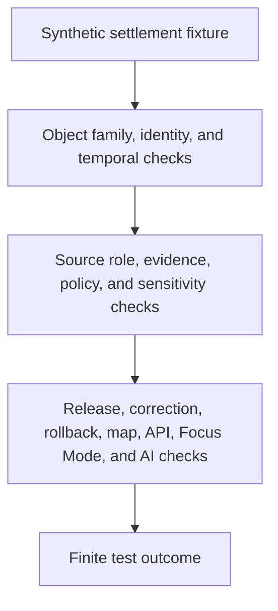

<!-- [KFM_META_BLOCK_V2]
doc_id: kfm://doc/tests-domains-settlement-readme
title: Settlement Domain Tests README
type: test-domain-readme
version: v0.1
status: draft; empty-placeholder-replaced; compatibility-settlement-test-index; CONFLICTED / PROPOSED / NEEDS VERIFICATION before promotion
owners:
  - OWNER_TBD - Settlements/Infrastructure domain steward
  - OWNER_TBD - Settlement slice steward
  - OWNER_TBD - QA steward
  - OWNER_TBD - Contracts steward
  - OWNER_TBD - Evidence steward
  - OWNER_TBD - Policy steward
  - OWNER_TBD - Release steward
created: 2026-07-06
updated: 2026-07-06
policy_label: public-doc; tests; settlement; compatibility-slice; settlements-infrastructure; conflicted-slug; no-parallel-authority; no-network; source-role-aware; temporal-scope-aware; evidence-bound; policy-gated; release-gated; rollback-aware
tags: [kfm, tests, settlement, settlements-infrastructure, compatibility, conflicted-slug, settlement-place, municipality, census-place, townsite, ghost-town, fort, mission, reservation-community, infrastructure-boundary, EvidenceBundle, EvidenceRef, PolicyDecision, ReviewRecord, ReleaseManifest, RollbackCard, ABSTAIN, DENY, ERROR]
related:
  - ../README.md
  - ../../README.md
  - ../settlements-infrastructure/README.md
  - ../../../contracts/domains/settlement/README.md
  - ../../../contracts/domains/settlements-infrastructure/README.md
  - ../../../schemas/contracts/v1/domains/settlement/README.md
  - ../../../schemas/contracts/v1/domains/settlements-infrastructure/
  - ../../../docs/domains/settlements-infrastructure/README.md
  - ../../../docs/domains/settlements-infrastructure/CANONICAL_PATHS.md
  - ../../../docs/domains/settlements-infrastructure/sublanes/settlements.md
  - ../../../data/catalog/domain/settlement/README.md
  - ../../../data/catalog/domain/settlements-infrastructure/README.md
  - ../../../data/registry/sources/settlements-infrastructure/README.md
  - ../../../fixtures/domains/settlement/
  - ../../../fixtures/domains/settlements-infrastructure/
  - ../../../policy/domains/settlements-infrastructure/
  - ../../../release/candidates/settlements-infrastructure/
notes:
  - "This README replaces the empty placeholder content at tests/domains/settlement/README.md."
  - "Directory Rules place enforceability proof under tests/ and domain-specific test lanes under tests/domains/<domain>/."
  - "Current repo evidence also contains tests/domains/settlements-infrastructure/README.md and contracts/domains/settlement/README.md. The settlement path is therefore treated here as a CONFLICTED compatibility slice, not a new canonical domain split."
  - "Canonical-path docs identify settlements-infrastructure as the working domain slug and record settlement as a path variance requiring ADR-class resolution."
  - "Executable tests, child lanes, fixtures, validators, schemas, CI jobs, release integration, and pass rates remain NEEDS VERIFICATION."
[/KFM_META_BLOCK_V2] -->

<a id="top"></a>

# Settlement domain tests

> Settlement-specific test index for deterministic, no-network guardrails inside the broader Settlements/Infrastructure domain. This directory should test place/community behavior without creating a parallel source of domain authority.

<p>
  
  
  
  
  
  
</p>

**Path:** `tests/domains/settlement/README.md`  
**Status:** draft / empty placeholder replaced / compatibility settlement test index / CONFLICTED until slug posture is resolved  
**Owning root:** `tests/`  
**Slice segment:** `settlement`  
**Parent domain context:** `settlements-infrastructure`  
**Default execution posture:** deterministic, synthetic, no-network, public-safe fixtures only  
**Truth posture:** CONFIRMED target file existed as an empty placeholder before replacement; CONFIRMED `contracts/domains/settlement/README.md` treats `settlement/` as a conflicted compatibility surface; CONFIRMED `docs/domains/settlements-infrastructure/CANONICAL_PATHS.md` identifies `settlements-infrastructure` as the working domain slug and records `settlement` as variance; CONFIRMED broader domain test parent exists at `tests/domains/settlements-infrastructure/README.md` as a greenfield stub; NEEDS VERIFICATION for executable settlement tests, child lanes, fixtures, validators, schemas, CI coverage, and pass rates.

---

## Purpose

`tests/domains/settlement/` is a settlement-specific test index for the settlement/place/community slice of the broader Settlements/Infrastructure domain.

This directory may host or point to tests that focus on settlement-mode behavior: settlement identity, municipality identity, census place identity, townsite and ghost town claims, fort and mission claims, reservation-community claims, source-role preservation, temporal scope, evidence support, policy gates, public-safe representation, correction, withdrawal, release, and rollback behavior.

A passing test here should not mean that a settlement boundary is legally current, a municipality is incorporated, a census place is official, a townsite location is precise, a ghost town claim is verified, a reservation-community claim is culturally cleared, an infrastructure asset is safe to expose, or a public release is approved. It should mean only that the scoped settlement guardrail behaved as expected against bounded synthetic fixtures and local files.

[Back to top](#top)

---

## Placement Basis

Directory Rules place rule-enforceability proof under `tests/` and use domain segments under responsibility roots. The requested path is therefore acceptable as a test lane, but its slug is not settled.

Current repo evidence treats `settlement/` as a compatibility or variance surface, while `settlements-infrastructure` is the documented working domain segment. This README preserves that posture: it documents a test compatibility slice and does not create a second canonical domain.

| Responsibility | Correct home | This directory's relationship |
|---|---|---|
| Settlement-slice tests | `tests/domains/settlement/` | This directory, CONFLICTED compatibility slice. |
| Broad Settlements/Infrastructure tests | `tests/domains/settlements-infrastructure/` | Confirmed sibling domain test lane; currently greenfield stub. |
| Settlement compatibility contracts | `contracts/domains/settlement/` | Confirmed compatibility / variance contract README. |
| Broad domain contracts | `contracts/domains/settlements-infrastructure/` | Current working contract lane per domain docs; maturity NEEDS VERIFICATION. |
| Human domain doctrine | `docs/domains/settlements-infrastructure/` | Canonical doctrine home for the broader domain. |
| Canonical path registry | `docs/domains/settlements-infrastructure/CANONICAL_PATHS.md` | Documents slug variance and ADR-class conflict. |
| Fixtures | `fixtures/domains/settlement/` or `fixtures/domains/settlements-infrastructure/` | NEEDS VERIFICATION. |
| Binding policy | `policy/domains/settlements-infrastructure/` or ADR-selected alternate | Not owned here. |
| Release decisions | `release/` roots | Not owned here. |

> [!IMPORTANT]
> This directory is not a new canonical Settlement domain authority unless an ADR or governing README later says so. Until then, treat it as a guarded compatibility test slice under Settlements/Infrastructure.

---

## Invariant Under Test

> **Settlement tests prove settlement-mode guardrails; they do not prove settlement truth.**

Core checks:

| Check | Required behavior | Failure outcome |
|---|---|---|
| Slug boundary | Tests under `settlement/` stay aligned to `settlements-infrastructure` doctrine and do not split authority. | promotion block. |
| Object boundary | Settlement, Municipality, CensusPlace, Townsite, GhostTown, Fort, Mission, and ReservationCommunity remain distinct object families where material. | validation failure. |
| Infrastructure boundary | Settlement/place claims do not silently become infrastructure asset, facility, utility, operator, dependency, or condition-observation truth. | `ABSTAIN` / validation failure. |
| Source-role boundary | Source roles remain fixed and cannot be upcast by normalization, graph projection, display, generated wording, or release assembly. | `DENY` / `ABSTAIN`. |
| Temporal boundary | Source, observed, valid, retrieval, release, and correction times remain distinct where material. | validation failure / `ABSTAIN`. |
| Evidence boundary | Consequential outputs require EvidenceRef-to-EvidenceBundle support or fail closed. | `ABSTAIN`. |
| Policy boundary | Rights, sensitivity, critical-infrastructure exposure, cultural sensitivity, living-person proximity, land/ownership confusion, archaeology joins, and release uncertainty fail closed. | `DENY` / `ABSTAIN`. |
| Geometry boundary | Public-safe settlement geometry is generalized or redacted when precision creates sensitivity or authority risk. | validation failure / `DENY`. |
| Public-surface boundary | Public API, map, tile, export, Focus Mode, and AI carriers cannot bypass release state. | `DENY` / `ABSTAIN`. |
| No-network boundary | Default settlement tests do not call live source feeds, geocoders, census APIs, cadastral systems, public APIs, map services, or AI runtimes. | validation failure / `ERROR`. |

---

## Confirmed and Proposed Lanes

| Lane | Status | Purpose | Boundary |
|---|---|---|---|
| `README.md` | CONFIRMED README | Domain-slice index for settlement-specific tests. | Does not claim executable coverage. |
| `contracts/` | PROPOSED | Would test settlement, municipality, census place, townsite, ghost town, fort, mission, and reservation-community contract guardrails. | Contract authority does not live here. |
| `evidence/` | PROPOSED | Would test EvidenceRef resolution, citation visibility, redaction/generalization receipts, and proof boundaries for settlement claims. | Evidence/proof authority does not live here. |
| `policy/` | PROPOSED | Would test sensitivity, cultural review, critical infrastructure exposure, living-person proximity, and land/ownership separation. | Binding policy does not live here. |
| `release/` | PROPOSED | Would test release gates, correction, withdrawal, rollback, and public-surface invalidation for settlement outputs. | Release authority does not live here. |
| `identity/` | PROPOSED | Would test deterministic identity envelopes and separation of name, geometry, jurisdiction, census status, and release state. | Identity doctrine does not live here. |
| `no_network/` | PROPOSED | Would test deterministic local execution posture. | Integration tests require separate gates. |

At authoring time, no child README lanes under `tests/domains/settlement/` were confirmed. Use `tests/domains/settlements-infrastructure/` as the broader sibling index until this compatibility slice is adopted, migrated, or removed.

---

## Settlement-Test Flow



The diagram describes intended test responsibility only. It does not prove that executable tests, fixtures, validators, policy runtime, release jobs, public invalidation hooks, map behavior, AI behavior, or CI jobs currently exist.

---

## Accepted Inputs

Only bounded, synthetic, reviewable inputs belong in this directory:

- synthetic settlement fixtures with fake source refs, object refs, evidence refs, policy refs, review refs, receipt refs, release refs, correction refs, withdrawal refs, and rollback refs
- synthetic object-family stubs for Settlement, Municipality, CensusPlace, Townsite, GhostTown, Fort, Mission, ReservationCommunity, Facility, ServiceArea, Operator, ConditionObservation, and Dependency boundaries where relevant
- synthetic source-role cases for authoritative, observed, administrative, candidate, modeled, aggregate, context, and synthetic posture where accepted vocabulary supports those roles
- synthetic temporal cases for source time, observed time, valid time, retrieval time, release time, correction time, historic status, supersession, correction, withdrawal, and rollback
- synthetic policy cases for sensitive facility exposure, cultural/community review, place-name ambiguity, census-vs-legal-status separation, infrastructure join denial, release block, correction, withdrawal, rollback, and quarantine
- canary values that make source-role collapse, jurisdiction overclaiming, infrastructure exposure, land/ownership confusion, cultural sensitivity leakage, map-truth leakage, AI leakage, logging, or public export obvious
- local validation envelopes emitted by test helpers

Safe outputs may include public-safe references and operational fields such as fixture ID, lane ID, object family, source role, time kind, validator name, finite outcome, reason code, evidence ref, policy decision ID, review record ID, receipt ref, release ref, correction ref, withdrawal ref, and rollback ref.

---

## Exclusions

Do not place these materials in this settlement test slice:

| Excluded material | Why it does not belong here |
|---|---|
| Real source exports, live geocoding responses, census payloads, cadastral records, utility records, critical-facility records, or public payloads | Default tests must stay synthetic, deterministic, and no-network. |
| Secrets, credentials, private endpoints, or production logs | Security and exposure risk. |
| Real EvidenceBundles, ProofPacks, production receipts, release manifests, rollback cards, correction notices, withdrawal notices, public artifacts, or audit ledgers | These are governed trust records or release artifacts. |
| Binding policy rules, schema definitions, contract prose, source descriptors, release procedures, graph implementation, map implementation, API implementation, or AI runtime implementation | Authority and implementation belong in their own responsibility roots. |
| Precise sensitive facility geometry, private service-area dependencies, living-person details, property/title/ownership assertions, burial/sacred-site associations, or culturally sensitive community details | Sensitive joins require governed policy, review, redaction, generalization, and release controls. |
| Public map layers, tiles, screenshots, exports, Focus Mode outputs, AI context packets, or public API payloads | Publication requires governed release. |

---

## Suggested Layout

```text
tests/domains/settlement/
|-- README.md
|-- contracts/
|-- evidence/
|-- policy/
|-- release/
|-- identity/
`-- no_network/
```

This layout is PROPOSED. Do not create child lanes here if they duplicate `tests/domains/settlements-infrastructure/` without an ADR, migration note, or explicit compatibility purpose.

---

## Run Posture

No executable runner was verified while authoring this README. Once tests exist, the expected local command should be documented and verified here.

```bash
: "PROPOSED / NEEDS VERIFICATION"
pytest tests/domains/settlement
```

Required run posture: no network access, no live service calls, no real secrets, no production logs, no production trust artifacts, no public artifact writes, deterministic fixture inputs, and finite outcomes only: `PASS`, `DENY`, `ABSTAIN`, or `ERROR`.

---

## Minimal Settlement Fixture

Synthetic parent fixtures should make settlement boundaries inspectable without carrying real location, infrastructure, land, cultural, or release data.

```json
{
  "fixture_id": "settlement-domain-parent-example",
  "domain_slice": "settlement",
  "parent_domain": "settlements-infrastructure",
  "object_family": "Settlement",
  "source_descriptor_id": "source-descriptor-fixture-settlement-001",
  "source_role": "candidate",
  "time_kind_under_test": "valid_time",
  "evidence_ref": "evidence-ref-fixture-settlement-001",
  "policy_decision_ref": "policy-decision-fixture-settlement-001",
  "review_record_ref": null,
  "release_manifest_ref": null,
  "rollback_card_ref": "rollback-card-fixture-settlement-001",
  "expected_outcome": "ABSTAIN",
  "safe_result_fields": {
    "validator_name": "settlement_compatibility_slice_guardrail",
    "reason_code": "SETTLEMENT_TEST_DOES_NOT_AUTHORIZE_PUBLICATION"
  },
  "must_not_claim": [
    "LEGAL_STATUS_CANARY",
    "CURRENT_BOUNDARY_CANARY",
    "OWNERSHIP_CANARY",
    "CRITICAL_INFRASTRUCTURE_CANARY",
    "CULTURAL_CLEARANCE_CANARY",
    "MAP_TRUTH_CANARY",
    "AI_TRUTH_CANARY",
    "RELEASE_APPROVAL_CANARY"
  ]
}
```

The JSON above is illustrative. Accepted schema, field names, fixture homes, source-role vocabulary, time-kind vocabulary, reason codes, and CI wiring remain NEEDS VERIFICATION.

---

## Evidence Ledger

| Source | Status | Supports | Limits |
|---|---|---|---|
| `Directory Rules.pdf` | CONFIRMED doctrine | `tests/` is the enforceability root; domain tests belong under `tests/domains/<domain>/`; authority roots remain separate. | Does not make `settlement/` the canonical domain slug. |
| `tests/domains/README.md` | CONFIRMED repo evidence | Identifies `tests/domains/` as per-domain test packages. | Does not define mature Settlement lane coverage. |
| `tests/domains/settlements-infrastructure/README.md` | CONFIRMED repo evidence | Broader domain test lane exists as a greenfield stub. | Does not prove executable tests exist. |
| `contracts/domains/settlement/README.md` | CONFIRMED repo evidence | Treats `settlement/` as a conflicted compatibility / variance surface, not canonical authority. | Contract README does not authorize tests, schemas, policy, or releases. |
| `docs/domains/settlements-infrastructure/README.md` | CONFIRMED repo evidence | Defines the domain scope and object families including Settlement, Municipality, CensusPlace, Townsite, GhostTown, Fort, Mission, ReservationCommunity, and infrastructure-related families. | Some implementation maturity claims in that doc remain PROPOSED / NEEDS VERIFICATION. |
| `docs/domains/settlements-infrastructure/CANONICAL_PATHS.md` | CONFIRMED repo evidence | Identifies `settlements-infrastructure` as the working domain slug and records singular `settlement` as conflicted variance. | Does not prove every path exists or is implemented. |
| GitHub target file before update | CONFIRMED repo evidence | `tests/domains/settlement/README.md` existed as an empty placeholder before replacement. | Placeholder proves path existence only. |

---

## Validation Checklist

- [ ] Confirm whether `tests/domains/settlement/` is retained as a compatibility slice or migrated into `tests/domains/settlements-infrastructure/`.
- [ ] Confirm accepted child lane names before adding executable settlement tests here.
- [ ] Confirm accepted fixture homes and naming conventions for settlement-specific fixtures.
- [ ] Confirm accepted schema and contract homes, including unresolved `settlement` and `settlements-infrastructure` slug posture.
- [ ] Confirm source-role, time-kind, evidence, receipt, policy, review, release, correction, withdrawal, rollback, finite outcome, and reason-code vocabularies.
- [ ] Add executable tests only after the placement question is settled or a compatibility purpose is documented.
- [ ] Confirm tests do not use real source feeds, live systems, secrets, production logs, production trust artifacts, or public artifact writes.
- [ ] Wire this slice into CI only after executable tests and safe fixtures exist.

---

## Rollback

Rollback is required if this settlement test slice starts to store real source data, trust-bearing records, release records, public artifacts, secrets, production logs, binding policy, contract/schema authority, graph implementation, map implementation, API implementation, or AI runtime behavior.

Rollback is also required if this lane treats a test pass as settlement truth, legal status, current boundary proof, ownership proof, cultural clearance, infrastructure exposure approval, map truth, AI truth, release approval, correction approval, withdrawal approval, or rollback approval.

Rollback target: restore the previous safe README revision or remove this compatibility index until the settlement slice placement, fixtures, schemas, source-role handling, evidence expectations, policy expectations, release relationship, correction behavior, rollback behavior, and CI integration are reverified.

[Back to top](#top)