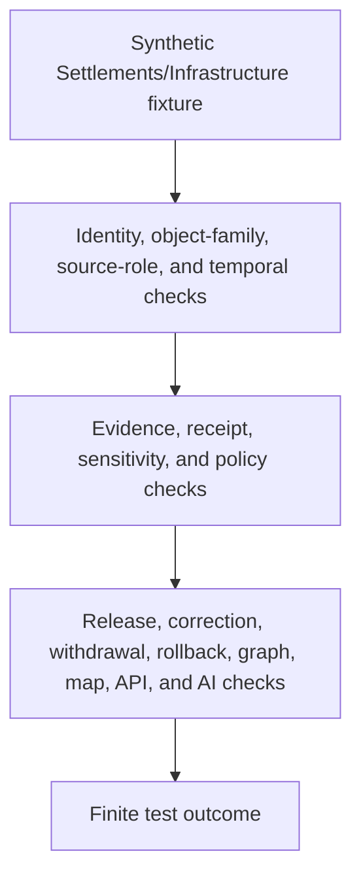

<!-- [KFM_META_BLOCK_V2]
doc_id: kfm://doc/tests-domains-settlements-infrastructure-readme
title: Settlements Infrastructure Domain Tests README
type: test-domain-readme
version: v0.1
status: draft; greenfield-stub-replaced; domain-test-parent-index; PROPOSED / NEEDS VERIFICATION before promotion
owners:
  - OWNER_TBD - Settlements/Infrastructure domain steward
  - OWNER_TBD - QA steward
  - OWNER_TBD - Identity steward
  - OWNER_TBD - Contracts steward
  - OWNER_TBD - Evidence steward
  - OWNER_TBD - Policy steward
  - OWNER_TBD - Release steward
  - OWNER_TBD - Source steward
created: 2026-07-06
updated: 2026-07-06
policy_label: public-doc; tests; settlements-infrastructure; domain-test-parent-index; canonical-domain-segment; conflicted-settlement-variant; no-network; source-role-aware; temporal-scope-aware; evidence-bound; policy-gated; release-gated; rollback-aware
tags: [kfm, tests, settlements-infrastructure, domain-tests, identity, contracts, evidence, policy, release, source-role, temporal-scope, deterministic-id, Settlement, Municipality, CensusPlace, Townsite, GhostTown, Fort, Mission, ReservationCommunity, InfrastructureAsset, NetworkNode, NetworkSegment, Facility, ServiceArea, Operator, ConditionObservation, Dependency, EvidenceBundle, EvidenceRef, PolicyDecision, ReviewRecord, ReleaseManifest, RollbackCard, ABSTAIN, DENY, ERROR]
related:
  - ../README.md
  - ../../README.md
  - identity/README.md
  - ../settlement/README.md
  - ../../../docs/domains/settlements-infrastructure/README.md
  - ../../../docs/domains/settlements-infrastructure/CANONICAL_PATHS.md
  - ../../../docs/domains/settlements-infrastructure/IDENTITY_MODEL.md
  - ../../../docs/domains/settlements-infrastructure/DATA_LIFECYCLE.md
  - ../../../docs/domains/settlements-infrastructure/sublanes/settlements.md
  - ../../../docs/domains/settlements-infrastructure/VERIFICATION_BACKLOG.md
  - ../../../contracts/domains/settlements-infrastructure/README.md
  - ../../../contracts/domains/settlement/README.md
  - ../../../schemas/contracts/v1/domains/settlements-infrastructure/
  - ../../../schemas/contracts/v1/domains/settlement/README.md
  - ../../../data/registry/sources/settlements-infrastructure/README.md
  - ../../../data/receipts/settlements-infrastructure/README.md
  - ../../../data/rollback/settlements-infrastructure/
  - ../../../fixtures/domains/settlements-infrastructure/
  - ../../../policy/domains/settlements-infrastructure/
  - ../../../release/candidates/settlements-infrastructure/
notes:
  - "This README replaces the greenfield stub at tests/domains/settlements-infrastructure/README.md."
  - "Directory Rules place enforceability proof under tests/. This directory is the domain-level test parent for Settlements/Infrastructure; it is not source, contract, schema, policy, proof, receipt, release, graph, map, API, or AI authority."
  - "Confirmed child README lane at authoring time is identity/README.md. Other child lanes listed here are PROPOSED until files and executable tests are verified."
  - "Canonical-path docs identify settlements-infrastructure as the working domain slug and record settlement as a path variance requiring ADR-class resolution. This README uses the canonical hyphenated domain segment and links the singular test lane only as a compatibility surface."
  - "Executable tests, fixture shapes, schema bindings, validators, CI jobs, release integration, public-surface invalidation, and pass rates remain NEEDS VERIFICATION."
[/KFM_META_BLOCK_V2] -->

<a id="top"></a>

# Settlements Infrastructure domain tests

> Domain-level index for deterministic, no-network Settlements/Infrastructure test lanes. This tree should prove that settlement, community, place, and infrastructure claims remain source-role-aware, time-aware, evidence-bound, policy-gated, release-gated, and rollback-aware without turning tests into source truth, legal status, critical-infrastructure disclosure, map truth, AI truth, or publication approval.

<p>
  
  
  
  
  
  
</p>

**Path:** `tests/domains/settlements-infrastructure/README.md`  
**Status:** draft / greenfield stub replaced / domain test parent index / PROPOSED until executable tests are verified  
**Owning root:** `tests/`  
**Domain segment:** `settlements-infrastructure`  
**Compatibility variant:** `tests/domains/settlement/` exists separately as a conflicted compatibility slice  
**Default execution posture:** deterministic, synthetic, no-network, public-safe fixtures only  
**Truth posture:** CONFIRMED target file existed as a greenfield stub before replacement; CONFIRMED `identity/README.md` exists as a child test lane; CONFIRMED canonical-path docs identify `settlements-infrastructure` as the working domain slug and singular `settlement` as conflicted variance; CONFIRMED identity docs define deterministic identity as `source_id + object_role + temporal_scope + normalized_digest`; NEEDS VERIFICATION for executable tests, fixtures, schemas, validators, policy runtime, CI coverage, release integration, and pass rates.

---

## Purpose

`tests/domains/settlements-infrastructure/` is the canonical domain-level test parent for Settlements/Infrastructure.

This subtree should prove that Settlements/Infrastructure behavior is enforceable across identity, source admission, contract shape, evidence support, sensitivity and policy denial, release gating, correction, withdrawal, rollback, graph or map derivation, public-surface exposure, and governed AI boundaries. It is a test root, not a source of truth.

A passing test in this domain should not mean that a settlement boundary is legally current, a municipality is incorporated, a census place is official, a townsite location is precise, a fort or mission claim is public, a reservation-community claim is culturally cleared, a facility or dependency is safe to expose, a public map layer is approved, or a release is published. It should mean only that a scoped guardrail behaved as expected against bounded synthetic fixtures and local files.

[Back to top](#top)

---

## Placement Basis

Directory Rules classify `tests/` as the root that proves rules are enforceable. The parent `tests/domains/` README identifies per-domain test packages. This directory is therefore the Settlements/Infrastructure domain test package.

| Responsibility | Correct home | This directory's relationship |
|---|---|---|
| Settlements/Infrastructure domain tests | `tests/domains/settlements-infrastructure/` | This directory. |
| Cross-domain test index | `tests/domains/README.md` | Parent index for per-domain test packages. |
| Identity tests | `tests/domains/settlements-infrastructure/identity/` | Confirmed child README lane. |
| Singular settlement test slice | `tests/domains/settlement/` | CONFLICTED compatibility surface, not canonicalized here. |
| Human domain doctrine | `docs/domains/settlements-infrastructure/` | Explains domain scope; not owned here. |
| Semantic contracts | `contracts/domains/settlements-infrastructure/` or ADR-selected alternate | Defines object meaning; not owned here. |
| Machine schemas | `schemas/contracts/v1/domains/settlements-infrastructure/` or ADR-selected alternate | Defines accepted shape; not owned here. |
| Source descriptors and registry | `data/registry/sources/settlements-infrastructure/` or accepted source catalog homes | Not owned here. |
| Evidence, proofs, receipts, rollback records | `data/proofs/`, `data/receipts/`, `data/rollback/`, and accepted roots | Not owned here. |
| Binding policy | `policy/domains/settlements-infrastructure/` and related policy roots | Not owned here. |
| Release decisions | `release/` roots | Not owned here. |
| Public artifacts | `data/published/` and governed artifact homes | Not owned here. |

> [!IMPORTANT]
> This README documents a test index. It cannot create source authority, contract authority, schema authority, proof closure, policy approval, release approval, public artifacts, graph truth, map truth, critical-infrastructure clearance, cultural clearance, live status, operational guidance, or AI truth.

---

## Parent Invariant

> **Domain tests prove guardrails; they do not become settlement or infrastructure truth.**

Core checks that all child lanes should preserve:

| Check | Required behavior | Failure outcome |
|---|---|---|
| Slug boundary | `settlements-infrastructure` remains the working canonical domain segment unless an ADR says otherwise; singular `settlement` stays compatibility-only. | promotion block. |
| Object-family boundary | Settlement, Municipality, CensusPlace, Townsite, GhostTown, Fort, Mission, ReservationCommunity, InfrastructureAsset, NetworkNode, NetworkSegment, Facility, ServiceArea, Operator, ConditionObservation, and Dependency do not silently merge. | validation failure. |
| Source-role boundary | Source roles stay fixed and cannot be upcast by normalization, map display, graph projection, generated wording, or release assembly. | `DENY` / `ABSTAIN`. |
| Temporal boundary | Source, observed, valid, retrieval, release, and correction times remain distinct where material. | validation failure / `ABSTAIN`. |
| Identity boundary | Deterministic identity uses source id, object role, temporal scope, and normalized digest; display name or geometry alone is not identity. | validation failure. |
| Evidence boundary | Consequential outputs require EvidenceRef-to-EvidenceBundle support or fail closed. | `ABSTAIN`. |
| Policy boundary | Rights, sensitivity, critical-infrastructure exposure, cultural review, sovereignty review, living-person proximity, archaeology joins, land/ownership confusion, and release uncertainty fail closed. | `DENY` / `ABSTAIN`. |
| Receipt boundary | Redaction, aggregation, validation, correction, withdrawal, and rollback transforms remain auditable without exposing restricted payloads. | validation failure. |
| Cross-lane boundary | Roads/rail, hydrology, hazards, people/land, archaeology, and frontier-matrix claims are cited through evidence, not reauthored here. | validation failure. |
| Public-surface boundary | Public API, map, tile, screenshot, Focus Mode, export, and AI carriers cannot bypass release state. | `DENY` / `ABSTAIN`. |
| Release boundary | Test success does not become release approval, correction approval, withdrawal approval, rollback approval, or public artifact publication. | promotion block. |
| No-network boundary | Default domain tests do not call live feeds, geocoders, census APIs, cadastral systems, utility systems, graph databases, map services, public APIs, release services, or AI runtimes. | validation failure / `ERROR`. |

---

## Confirmed Test Families

| Family | Status | Current confirmed child lanes | Boundary |
|---|---|---|---|
| [`identity/`](identity/README.md) | CONFIRMED README / executable tests NEEDS VERIFICATION | Parent identity lane README only | Tests deterministic identity guardrails; does not define identity doctrine, contracts, schemas, policy, evidence, or release. |

At authoring time, `identity/` is the only confirmed child README lane under `tests/domains/settlements-infrastructure/`.

---

## Proposed Future Families

These are backlog signposts only. They are not implementation claims.

| Family | Status | Purpose |
|---|---|---|
| `contracts/` | PROPOSED | Would test object-family contract guardrails for settlements, infrastructure assets, facilities, operators, observations, dependencies, and cross-lane relations. |
| `sources/` | PROPOSED | Would test SourceDescriptor admission, rights, source-role preservation, cadence, and no-upcast behavior. |
| `evidence/` | PROPOSED | Would test EvidenceRef resolution, citation visibility, redaction/generalization receipts, aggregation receipts, and proof boundaries. |
| `policy/` | PROPOSED | Would test sensitivity, critical-infrastructure denial, cultural review, sovereignty review, living-person proximity, land/ownership separation, and fail-closed release behavior. |
| `release/` | PROPOSED | Would test release gates, correction, withdrawal, rollback, public-surface invalidation, and derivative invalidation. |
| `graph/` | PROPOSED | Would test graph projections as derived, evidence-subordinate, release-gated, and rollbackable carriers. |
| `map_api/` | PROPOSED | Would test governed public API, map, tile, screenshot, export, and Focus Mode release boundaries. |
| `ai_boundary/` | PROPOSED | Would test that generated summaries cite released evidence and abstain when evidence, policy, or release state is missing. |
| `no_network/` | PROPOSED | Would test that default domain test execution is local and deterministic. |

---

## Domain-Test Flow



The diagram describes intended test responsibility only. It does not prove that executable tests, validators, fixtures, policy runtime, release jobs, graph projections, public invalidation hooks, map behavior, AI behavior, or CI jobs currently exist.

---

## Accepted Inputs

Only bounded, synthetic, reviewable inputs belong in this domain test package:

- synthetic fixtures with fake source refs, object refs, evidence refs, policy refs, review refs, receipt refs, release refs, correction refs, withdrawal refs, and rollback refs
- synthetic object-family stubs for Settlement, Municipality, CensusPlace, Townsite, GhostTown, Fort, Mission, ReservationCommunity, InfrastructureAsset, NetworkNode, NetworkSegment, Facility, ServiceArea, Operator, ConditionObservation, and Dependency behavior
- synthetic source-role cases for observed, regulatory, modeled, aggregate, administrative, candidate, context, and synthetic posture where accepted vocabulary supports those roles
- synthetic temporal cases for source time, observed time, valid time, retrieval time, release time, correction time, supersession, tombstone, withdrawal, and rollback
- synthetic policy cases for critical-infrastructure exposure, sensitive facility geometry, cultural/community review, sovereignty review, archaeology adjacency, living-person proximity, place-name ambiguity, census-vs-legal-status separation, release block, correction, withdrawal, rollback, and quarantine
- canary values that make source-role collapse, object-role collapse, legal-status overclaiming, current-boundary overclaiming, infrastructure exposure, land/ownership confusion, cultural sensitivity leakage, graph-truth leakage, map-truth leakage, AI leakage, logging, or public export obvious
- local validation envelopes emitted by test helpers

Safe outputs may include public-safe references and operational fields such as fixture ID, lane ID, object family, source role, time kind, validator name, finite outcome, reason code, evidence ref, policy decision ID, review record ID, receipt ref, release ref, correction ref, withdrawal ref, and rollback ref.

---

## Exclusions

Do not place these materials in this domain test package:

| Excluded material | Why it does not belong here |
|---|---|
| Real source exports, live feeds, geocoding responses, census payloads, utility records, cadastral records, critical-facility records, dependency graphs, or public payloads | Rights, authority, freshness, safety, sensitivity, and release status cannot be assumed in default tests. |
| Secrets, credentials, private endpoint details, or production logs | Security and exposure risk. |
| Real EvidenceBundles, ProofPacks, production receipts, release manifests, rollback cards, correction notices, withdrawal notices, public artifacts, or audit ledgers | These are governed trust records or release artifacts. |
| Binding policy rules, schema definitions, contract prose, release procedures, graph implementation, map implementation, API implementation, or AI runtime implementation | Authority and implementation do not live in this README. |
| Precise sensitive facility geometry, private service-area dependencies, living-person details, property/title/ownership assertions, burial/sacred-site associations, or culturally sensitive community details | Sensitive joins require governed policy, review, redaction, generalization, and release controls. |
| Public map layers, tiles, screenshots, exports, Focus Mode outputs, AI context packets, or public API payloads | Publication requires governed release. |

---

## Suggested Layout

```text
tests/domains/settlements-infrastructure/
|-- README.md
|-- identity/
|   `-- README.md
|-- contracts/
|-- sources/
|-- evidence/
|-- policy/
|-- release/
|-- graph/
|-- map_api/
|-- ai_boundary/
`-- no_network/
```

Only `identity/` is confirmed as an authored child README lane at the time this README was created. Other directories are PROPOSED until files and executable tests exist.

---

## Run Posture

No executable runner was verified while authoring this README. Once tests exist, the expected local command should be documented and verified here.

```bash
: "PROPOSED / NEEDS VERIFICATION"
pytest tests/domains/settlements-infrastructure
```

Required run posture: no network access, no live service calls, no real secrets, no production logs, no production trust artifacts, no sensitive geometry, no public artifact writes, deterministic fixture inputs, and finite outcomes only: `PASS`, `DENY`, `ABSTAIN`, or `ERROR`.

---

## Minimal Domain Fixture

Synthetic parent fixtures should make domain boundaries inspectable without carrying real settlement, infrastructure, cultural, land, utility, or release data.

```json
{
  "fixture_id": "settlements-infrastructure-domain-parent-example",
  "domain": "settlements-infrastructure",
  "test_family": "domain_guardrail",
  "object_family": "Settlement",
  "source_descriptor_id": "source-descriptor-fixture-si-domain-001",
  "source_role": "candidate",
  "time_kind_under_test": "valid_time",
  "identity_ref": "identity-fixture-si-domain-001",
  "evidence_ref": "evidence-ref-fixture-si-domain-001",
  "policy_decision_ref": "policy-decision-fixture-si-domain-001",
  "review_record_ref": null,
  "redaction_receipt_ref": null,
  "release_manifest_ref": null,
  "rollback_card_ref": "rollback-card-fixture-si-domain-001",
  "expected_outcome": "ABSTAIN",
  "safe_result_fields": {
    "validator_name": "settlements_infrastructure_domain_parent_guardrail",
    "reason_code": "DOMAIN_TEST_DOES_NOT_AUTHORIZE_PUBLICATION"
  },
  "must_not_claim": [
    "LEGAL_STATUS_CURRENT_CANARY",
    "CURRENT_BOUNDARY_CANARY",
    "OWNERSHIP_CANARY",
    "CRITICAL_INFRASTRUCTURE_CANARY",
    "DEPENDENCY_GRAPH_CANARY",
    "CULTURAL_CLEARANCE_CANARY",
    "MAP_TRUTH_CANARY",
    "AI_TRUTH_CANARY",
    "RELEASE_APPROVAL_CANARY"
  ]
}
```

The JSON above is illustrative. Accepted schema, field names, fixture homes, source-role vocabulary, time-kind vocabulary, reason codes, and CI wiring remain NEEDS VERIFICATION.

---

## Evidence Ledger

| Source | Status | Supports | Limits |
|---|---|---|---|
| `Directory Rules.pdf` | CONFIRMED doctrine | `tests/` is the enforceability root; domain tests belong under `tests/domains/<domain>/`; authority roots remain separate. | Does not prove executable tests, fixtures, CI, schema bindings, runtime behavior, or pass rates. |
| `tests/domains/README.md` | CONFIRMED repo evidence | Identifies `tests/domains/` as per-domain test packages. | Does not define mature Settlements/Infrastructure lane coverage. |
| `tests/domains/settlements-infrastructure/identity/README.md` | CONFIRMED child lane README | Identity-test lane exists and documents deterministic identity guardrails. | Does not prove executable identity tests exist. |
| `tests/domains/settlement/README.md` | CONFIRMED compatibility README | Singular settlement test lane exists as conflicted compatibility surface. | Does not make `settlement` canonical. |
| `docs/domains/settlements-infrastructure/CANONICAL_PATHS.md` | CONFIRMED repo evidence | Identifies `settlements-infrastructure` as working canonical segment and singular `settlement` as conflicted variance. | Does not prove every path exists or is implemented. |
| `docs/domains/settlements-infrastructure/IDENTITY_MODEL.md` | CONFIRMED repo evidence | Defines identity composition and time/source-role separation. | Field names and schema bindings remain PROPOSED where the doc says so. |
| `docs/domains/settlements-infrastructure/DATA_LIFECYCLE.md` | CONFIRMED repo evidence | Defines RAW to PUBLISHED lifecycle, quarantine, public-safe candidates, EvidenceRefs, receipts, release gates, correction path, and rollback target. | Implementation-layer paths and artifact IDs remain PROPOSED. |
| GitHub target file before update | CONFIRMED repo evidence | `tests/domains/settlements-infrastructure/README.md` existed as a greenfield stub before replacement. | Stub did not provide lane guidance or executable coverage. |

---

## Validation Checklist

- [ ] Confirm accepted domain-test indexing convention for `tests/domains/settlements-infrastructure/`.
- [ ] Confirm accepted fixture homes and naming conventions for Settlements/Infrastructure domain fixtures.
- [ ] Confirm accepted schema and contract homes, including unresolved `settlement` versus `settlements-infrastructure` variance.
- [ ] Confirm source-role, time-kind, identity, evidence, receipt, policy, review, release, correction, withdrawal, rollback, finite outcome, and reason-code vocabularies.
- [ ] Add executable tests under confirmed or proposed child lanes before claiming runtime coverage.
- [ ] Confirm tests do not use real source feeds, live systems, secrets, production logs, production trust artifacts, sensitive geometry, or public artifact writes.
- [ ] Confirm graph, map, API, tile, screenshot, Focus Mode, export, and AI outputs cannot bypass EvidenceBundle resolution, source role, temporal scope, policy, review, release, correction, withdrawal, or rollback controls.
- [ ] Wire the domain lane into CI only after executable tests and safe fixtures exist.

---

## Rollback

Rollback is required if this domain test index starts to store real source data, trust-bearing records, production release records, public artifacts, secrets, production logs, binding policy, contract/schema authority, graph implementation, map implementation, API implementation, or AI runtime behavior instead of documenting test boundaries.

Rollback is also required if this lane treats a test pass as settlement truth, legal status, current boundary proof, ownership proof, cultural clearance, critical-infrastructure exposure approval, dependency disclosure approval, map truth, AI truth, release approval, correction approval, withdrawal approval, or rollback approval.

Rollback target: restore the previous safe README revision or remove this parent index until child lane placement, fixtures, schemas, source-role handling, evidence expectations, policy expectations, release relationship, correction behavior, rollback behavior, and CI integration are reverified.

[Back to top](#top)