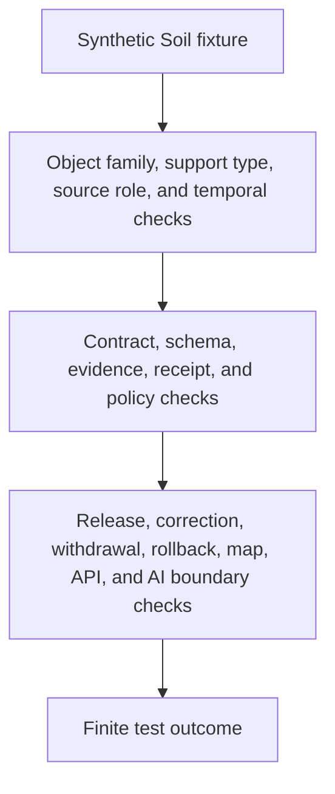

<!-- [KFM_META_BLOCK_V2]
doc_id: kfm://doc/tests-domains-soil-readme
title: Soil Domain Tests README
type: test-domain-readme
version: v0.1
status: draft; greenfield-stub-replaced; domain-test-parent-index; PROPOSED / NEEDS VERIFICATION before promotion
owners:
  - OWNER_TBD - Soil domain steward
  - OWNER_TBD - QA steward
  - OWNER_TBD - Contracts steward
  - OWNER_TBD - Schema steward
  - OWNER_TBD - Evidence steward
  - OWNER_TBD - Policy steward
  - OWNER_TBD - Release steward
  - OWNER_TBD - Source steward
created: 2026-07-06
updated: 2026-07-06
policy_label: public-doc; tests; soil; domain-test-parent-index; no-network; source-role-aware; support-type-aware; temporal-scope-aware; evidence-bound; policy-gated; release-gated; rollback-aware
tags: [kfm, tests, soil, domain-tests, source-role, support-type, temporal-scope, SoilMapUnit, SoilComponent, Horizon, SoilProperty, HydrologicSoilGroup, SoilMoistureObservation, Pedon, SoilProfileView, ErosionRisk, SuitabilityRating, SoilTimeCaveat, EvidenceBundle, EvidenceRef, PolicyDecision, ReviewRecord, ReleaseManifest, RollbackCard, ABSTAIN, DENY, ERROR]
related:
  - ../README.md
  - ../../README.md
  - ../../../docs/domains/soil/README.md
  - ../../../docs/domains/soil/DATA_LIFECYCLE.md
  - ../../../docs/domains/soil/API_CONTRACTS.md
  - ../../../contracts/domains/soil/README.md
  - ../../../contracts/domains/soil/domain_feature_identity.md
  - ../../../contracts/domains/soil/domain_layer_descriptor.md
  - ../../../contracts/domains/soil/domain_observation.md
  - ../../../contracts/domains/soil/domain_validation_report.md
  - ../../../schemas/contracts/v1/domains/soil/README.md
  - ../../../data/registry/domains/soil/README.md
  - ../../../data/registry/sources/soil/
  - ../../../data/receipts/soil/README.md
  - ../../../data/work/soil/README.md
  - ../../../data/catalog/domain/soil/README.md
  - ../../../fixtures/domains/soil/
  - ../../../pipelines/domains/soil/README.md
  - ../../../pipelines/domains/soil/ssurgo_ingest/README.md
  - ../../../pipelines/domains/soil/gssurgo_ingest/README.md
  - ../../../pipelines/domains/soil/smap_ingest/README.md
  - ../../../pipelines/domains/soil/scan_awdb_ingest/README.md
  - ../../../pipelines/domains/soil/uscrn_ingest/README.md
  - ../../../pipelines/domains/soil/moisture_validator/README.md
  - ../../../packages/domains/soil/README.md
  - ../../../policy/domains/soil/README.md
  - ../../../release/candidates/soil/
notes:
  - "This README replaces the greenfield stub at tests/domains/soil/README.md."
  - "Directory Rules place enforceability proof under tests/. This directory is the domain-level test parent for Soil; it is not source, contract, schema, policy, proof, receipt, release, map, API, package, pipeline, or AI authority."
  - "Search and fetch evidence confirmed mature adjacent Soil lanes under contracts, schemas, data registry, docs, packages, pipelines, and data lifecycle surfaces; executable test coverage remains NEEDS VERIFICATION."
  - "No child README lanes under tests/domains/soil/ were confirmed during authoring. Child lanes listed here are PROPOSED until files and executable tests are verified."
  - "Default posture is deterministic and no-network with synthetic fixtures only."
[/KFM_META_BLOCK_V2] -->

<a id="top"></a>

# Soil domain tests

> Domain-level index for deterministic, no-network Soil test lanes. This tree should prove that soil survey, component, horizon, property, observation, gridded, interpretation, suitability, erosion, and public-layer claims remain source-role-aware, support-type-aware, time-aware, evidence-bound, policy-gated, release-gated, and rollback-aware.

<p>
  
  
  
  
  
  
</p>

**Path:** `tests/domains/soil/README.md`  
**Status:** draft / greenfield stub replaced / domain test parent index / PROPOSED until executable tests are verified  
**Owning root:** `tests/`  
**Domain segment:** `soil`  
**Default execution posture:** deterministic, synthetic, no-network, public-safe fixtures only  
**Truth posture:** CONFIRMED target file existed as a greenfield stub before replacement; CONFIRMED `tests/domains/README.md` exists as a per-domain test-package index; CONFIRMED adjacent Soil docs, contract, schema, registry, package, pipeline, and lifecycle READMEs exist; NEEDS VERIFICATION for executable tests, child lanes, fixtures, validators, schema maturity, policy runtime, CI coverage, release integration, and pass rates.

---

## Purpose

`tests/domains/soil/` is the domain-level test parent for Soil.

This subtree should prove that Soil behavior is enforceable across object identity, support-type separation, source admission, contract shape, schema shape, evidence support, policy denial, public-safe generalization, release gating, correction, withdrawal, rollback, map/API surfaces, and governed AI boundaries. It is a test root, not a source of truth.

A passing test in this domain should not mean that a soil map unit is current, a component percentage is authoritative, a horizon value is verified, a moisture observation is fresh, a satellite grid is ground truth, an erosion or suitability interpretation is decision-ready, a field/farm condition is known, a public map layer is approved, or a release is published. It should mean only that a scoped guardrail behaved as expected against bounded synthetic fixtures and local files.

[Back to top](#top)

---

## Placement Basis

Directory Rules classify `tests/` as the root that proves rules are enforceable. The parent `tests/domains/` README identifies per-domain test packages. This directory is therefore the Soil domain test package.

| Responsibility | Correct home | This directory's relationship |
|---|---|---|
| Soil domain tests | `tests/domains/soil/` | This directory. |
| Cross-domain test index | `tests/domains/README.md` | Parent index for per-domain test packages. |
| Human domain doctrine | `docs/domains/soil/` | Explains domain scope; not owned here. |
| Semantic contracts | `contracts/domains/soil/` or ADR-selected alternate | Defines object meaning; not owned here. |
| Machine schemas | `schemas/contracts/v1/domains/soil/` or ADR-selected alternate | Defines accepted shape; not owned here. |
| Source and domain registry | `data/registry/domains/soil/`, `data/registry/sources/soil/`, or accepted registry homes | Not owned here. |
| Evidence, proofs, receipts, rollback records | `data/proofs/`, `data/receipts/`, `data/rollback/`, and accepted roots | Not owned here. |
| Pipelines and packages | `pipelines/domains/soil/`, `pipeline_specs/soil/`, `packages/domains/soil/` | Not owned here. |
| Binding policy | `policy/domains/soil/` and related policy roots | Not owned here. |
| Release decisions | `release/` roots | Not owned here. |
| Public artifacts | `data/published/` and governed artifact homes | Not owned here. |

> [!IMPORTANT]
> This README documents a test index. It cannot create source authority, contract authority, schema authority, proof closure, policy approval, release approval, public artifacts, map truth, agricultural decision authority, hydrology truth, geology truth, habitat truth, or AI truth.

---

## Parent Invariant

> **Soil tests prove guardrails; they do not become soil truth.**

Core checks that all child lanes should preserve:

| Check | Required behavior | Failure outcome |
|---|---|---|
| Source-role boundary | Source roles stay fixed and cannot be upcast by normalization, interpolation, gridding, map display, generated wording, or release assembly. | `DENY` / `ABSTAIN`. |
| Support-type boundary | Static survey, gridded derivative, station observation, satellite grid, pedon/profile, and interpretation surfaces do not collapse. | validation failure. |
| Object-family boundary | SoilMapUnit, SoilComponent, Horizon, SoilProperty, HydrologicSoilGroup, SoilMoistureObservation, Pedon, SoilProfileView, ErosionRisk, SuitabilityRating, and SoilTimeCaveat remain distinct where material. | validation failure. |
| Temporal boundary | Source, observed, valid, retrieval, release, and correction times remain distinct where material. | validation failure / `ABSTAIN`. |
| Evidence boundary | Consequential outputs require EvidenceRef-to-EvidenceBundle support or fail closed. | `ABSTAIN`. |
| Policy boundary | Rights, scale, farm/owner specificity, sensor-source sensitivity, operational detail, and release uncertainty fail closed. | `DENY` / `ABSTAIN`. |
| Geometry and scale boundary | Public-safe soil geometry is generalized or withheld when precision, source rights, or sensitivity requires it. | validation failure / `DENY`. |
| Cross-lane boundary | Agriculture, Hydrology, Habitat, Flora, Fauna, Geology, Hazards, and People/Land claims are cited through evidence, not reauthored here. | validation failure. |
| Public-surface boundary | Public API, map, tile, screenshot, Focus Mode, export, and AI carriers cannot bypass release state. | `DENY` / `ABSTAIN`. |
| Release boundary | Test success does not become release approval, correction approval, withdrawal approval, rollback approval, or public artifact publication. | promotion block. |
| No-network boundary | Default domain tests do not call live source APIs, NRCS services, Mesonet feeds, SCAN/AWDB, USCRN, SMAP, map services, public APIs, release services, or AI runtimes. | validation failure / `ERROR`. |

---

## Confirmed Test Families

At authoring time, no child README lanes under `tests/domains/soil/` were confirmed. This README is therefore the domain parent and backlog anchor only.

| Family | Status | Current confirmed child lanes | Boundary |
|---|---|---|---|
| `README.md` | CONFIRMED README | Domain test parent only | Does not claim executable coverage. |

---

## Proposed Future Families

These are backlog signposts only. They are not implementation claims.

| Family | Status | Purpose |
|---|---|---|
| `contracts/` | PROPOSED | Would test semantic contract guardrails for map units, components, horizons, properties, observations, pedons, interpretations, and time caveats. |
| `schemas/` | PROPOSED | Would test Soil JSON Schema shape, required refs, enums, support type, finite outcomes, and schema drift behavior. |
| `sources/` | PROPOSED | Would test source admission, source-role preservation, rights, cadence, source family, and no-upcast behavior. |
| `evidence/` | PROPOSED | Would test EvidenceRef resolution, citation visibility, redaction/generalization receipts, aggregation receipts, and proof boundaries. |
| `policy/` | PROPOSED | Would test rights, source-license restrictions, scale/generalization, farm/owner specificity, operational sensor detail, and fail-closed public behavior. |
| `release/` | PROPOSED | Would test release gates, correction, withdrawal, rollback, public-surface invalidation, and derivative invalidation. |
| `pipelines/` | PROPOSED | Would test deterministic pipeline envelopes for SSURGO, gSSURGO, gNATSGO, SDA, Mesonet, SCAN/AWDB, USCRN, SMAP, and validators. |
| `map_api/` | PROPOSED | Would test governed public API, map, tile, layer manifest, screenshot, export, and Focus Mode release boundaries. |
| `ai_boundary/` | PROPOSED | Would test that generated summaries cite released evidence and abstain when evidence, policy, or release state is missing. |
| `no_network/` | PROPOSED | Would test that default domain test execution is local and deterministic. |

---

## Domain-Test Flow



The diagram describes intended test responsibility only. It does not prove that executable tests, validators, fixtures, policy runtime, release jobs, public invalidation hooks, map behavior, AI behavior, or CI jobs currently exist.

---

## Accepted Inputs

Only bounded, synthetic, reviewable inputs belong in this domain test package:

- synthetic fixtures with fake source refs, object refs, geometry refs, depth refs, station refs, grid refs, evidence refs, policy refs, review refs, receipt refs, release refs, correction refs, withdrawal refs, and rollback refs
- synthetic object-family stubs for SoilMapUnit, SoilComponent, Horizon, SoilProperty, HydrologicSoilGroup, SoilMoistureObservation, Pedon, SoilProfileView, ComponentHorizonJoin, ErosionRisk, SuitabilityRating, and SoilTimeCaveat behavior
- synthetic source-family cases for NRCS SSURGO, USDA NRCS Soil Data Access, gSSURGO, gNATSGO, Kansas Mesonet, NRCS SCAN, NOAA USCRN, NASA SMAP, and ISRIC SoilGrids where accepted vocabulary supports those roles
- synthetic support-type cases for static survey, gridded derivative, station observation, satellite grid, pedon/profile, interpretation, suitability rating, and time caveat posture
- synthetic temporal cases for source time, observed time, valid time, retrieval time, release time, correction time, supersession, stale-state warning, withdrawal, and rollback
- canary values that make source-role collapse, support-type collapse, property overclaiming, farm-specific exposure, sensor-specific exposure, scale overprecision, cross-lane truth leakage, map-truth leakage, AI leakage, logging, or public export obvious
- local validation envelopes emitted by test helpers

Safe outputs may include public-safe references and operational fields such as fixture ID, lane ID, object family, source family, source role, support type, time kind, validator name, finite outcome, reason code, evidence ref, policy decision ID, review record ID, receipt ref, release ref, correction ref, withdrawal ref, and rollback ref.

---

## Exclusions

Do not place these materials in this domain test package:

| Excluded material | Why it does not belong here |
|---|---|
| Real source exports, live NRCS/SDA requests, Mesonet feeds, SCAN/AWDB responses, USCRN payloads, SMAP grids, source credentials, or public payloads | Rights, authority, freshness, sensitivity, and release status cannot be assumed in default tests. |
| Real farm/field/owner-specific data, private station detail, operational sensor detail, precise restricted geometry, or sensitive land-use joins | Public exposure requires governed policy, review, redaction, generalization, and release controls. |
| Secrets, credentials, private endpoint details, or production logs | Security and exposure risk. |
| Real EvidenceBundles, ProofPacks, production receipts, release manifests, rollback cards, correction notices, withdrawal notices, public artifacts, or audit ledgers | These are governed trust records or release artifacts. |
| Binding policy rules, schema definitions, contract prose, release procedures, package implementation, pipeline implementation, map implementation, API implementation, or AI runtime implementation | Authority and implementation do not live in this README. |
| Public map layers, tiles, screenshots, exports, Focus Mode outputs, AI context packets, or public API payloads | Publication requires governed release. |

---

## Suggested Layout

```text
tests/domains/soil/
|-- README.md
|-- contracts/
|-- schemas/
|-- sources/
|-- evidence/
|-- policy/
|-- release/
|-- pipelines/
|-- map_api/
|-- ai_boundary/
`-- no_network/
```

All child directories are PROPOSED until files and executable tests exist.

---

## Run Posture

No executable runner was verified while authoring this README. Once tests exist, the expected local command should be documented and verified here.

```bash
: "PROPOSED / NEEDS VERIFICATION"
pytest tests/domains/soil
```

Required run posture: no network access, no live service calls, no real secrets, no production logs, no production trust artifacts, no sensitive farm/field/station geometry, no public artifact writes, deterministic fixture inputs, and finite outcomes only: `PASS`, `DENY`, `ABSTAIN`, or `ERROR`.

---

## Minimal Domain Fixture

Synthetic parent fixtures should make Soil boundaries inspectable without carrying real source payloads, farm data, station details, gridded data, private land context, or release data.

```json
{
  "fixture_id": "soil-domain-parent-example",
  "domain": "soil",
  "test_family": "domain_guardrail",
  "object_family": "SoilMapUnit",
  "source_descriptor_id": "source-descriptor-fixture-soil-001",
  "source_family": "ssurgo_like_static_survey",
  "source_role": "administrative",
  "support_type": "static_survey",
  "time_kind_under_test": "valid_time",
  "evidence_ref": "evidence-ref-fixture-soil-domain-001",
  "policy_decision_ref": "policy-decision-fixture-soil-domain-001",
  "review_record_ref": null,
  "redaction_receipt_ref": null,
  "release_manifest_ref": null,
  "rollback_card_ref": "rollback-card-fixture-soil-domain-001",
  "expected_outcome": "ABSTAIN",
  "safe_result_fields": {
    "validator_name": "soil_domain_parent_guardrail",
    "reason_code": "SOIL_TEST_DOES_NOT_AUTHORIZE_PUBLICATION"
  },
  "must_not_claim": [
    "CURRENT_FIELD_CONDITION_CANARY",
    "OWNER_SPECIFIC_SOIL_CANARY",
    "FARM_OPERATION_CANARY",
    "SENSOR_EXPOSURE_CANARY",
    "HYDROLOGY_TRUTH_CANARY",
    "AGRICULTURE_TRUTH_CANARY",
    "MAP_TRUTH_CANARY",
    "AI_TRUTH_CANARY",
    "RELEASE_APPROVAL_CANARY"
  ]
}
```

The JSON above is illustrative. Accepted schema, field names, fixture homes, source-role vocabulary, support-type vocabulary, time-kind vocabulary, reason codes, and CI wiring remain NEEDS VERIFICATION.

---

## Evidence Ledger

| Source | Status | Supports | Limits |
|---|---|---|---|
| `Directory Rules.pdf` | CONFIRMED doctrine | `tests/` is the enforceability root; domain tests belong under `tests/domains/<domain>/`; authority roots remain separate. | Does not prove executable tests, fixtures, CI, schema bindings, runtime behavior, or pass rates. |
| `tests/domains/README.md` | CONFIRMED repo evidence | Identifies `tests/domains/` as per-domain test packages. | Does not define mature Soil lane coverage. |
| `docs/domains/soil/README.md` | CONFIRMED repo evidence | Soil docs README exists. | It is a greenfield placeholder and does not provide mature test guidance. |
| `docs/domains/soil/DATA_LIFECYCLE.md` | CONFIRMED repo evidence | Defines Soil continuity inventory, owned object families, source families, cross-lane relations, support-type posture, lifecycle lane map, and RAW to PUBLISHED promotion model. | It describes many paths as PROPOSED / NEEDS VERIFICATION and is not implementation proof. |
| `contracts/domains/soil/README.md` | CONFIRMED repo evidence | Defines contracts as the semantic meaning lane for Soil objects and preserves support-type separation, lifecycle, policy, release, and rollback boundaries. | Object-level contract maturity and runtime behavior remain NEEDS VERIFICATION. |
| `schemas/contracts/v1/domains/soil/README.md` | CONFIRMED repo evidence | Defines Soil schema lane as machine-shape home and separates schemas from contracts, policy, tests, fixtures, data, receipts, proofs, and release. | Schema completeness and production readiness remain NEEDS VERIFICATION. |
| `data/registry/domains/soil/README.md` | CONFIRMED repo evidence | Defines Soil domain registry records as governance handles for object-family coverage, source-family posture, support-type boundaries, lifecycle refs, evidence requirements, policy posture, release blockers, correction, and rollback. | Registry records are not source data, proof, receipt storage, or release authority. |
| GitHub target file before update | CONFIRMED repo evidence | `tests/domains/soil/README.md` existed as a greenfield stub before replacement. | Stub did not provide lane guidance or executable coverage. |

---

## Validation Checklist

- [ ] Confirm accepted domain-test indexing convention for `tests/domains/soil/`.
- [ ] Confirm accepted fixture homes and naming conventions for Soil domain fixtures.
- [ ] Confirm accepted schema and contract homes, including any unresolved flat-path or historical schema-home variance.
- [ ] Confirm source-family, source-role, support-type, object-family, time-kind, evidence, receipt, policy, review, release, correction, withdrawal, rollback, finite outcome, and reason-code vocabularies.
- [ ] Add executable tests under confirmed or proposed child lanes before claiming runtime coverage.
- [ ] Confirm tests do not use real source feeds, live systems, secrets, production logs, production trust artifacts, sensitive geometry, private farm/field detail, or public artifact writes.
- [ ] Confirm map, API, tile, screenshot, Focus Mode, export, and AI outputs cannot bypass EvidenceBundle resolution, source role, support type, temporal scope, policy, review, release, correction, withdrawal, or rollback controls.
- [ ] Wire the domain lane into CI only after executable tests and safe fixtures exist.

---

## Rollback

Rollback is required if this domain test index starts to store real source data, trust-bearing records, production release records, public artifacts, secrets, production logs, binding policy, contract/schema authority, package implementation, pipeline implementation, map implementation, API implementation, or AI runtime behavior instead of documenting test boundaries.

Rollback is also required if this lane treats a test pass as soil truth, current field condition, crop/yield truth, hydrology truth, geology truth, habitat truth, owner/farm-specific truth, map truth, AI truth, release approval, correction approval, withdrawal approval, or rollback approval.

Rollback target: restore the previous safe README revision or remove this parent index until child lane placement, fixtures, schemas, source-role handling, support-type handling, evidence expectations, policy expectations, release relationship, correction behavior, rollback behavior, and CI integration are reverified.

[Back to top](#top)