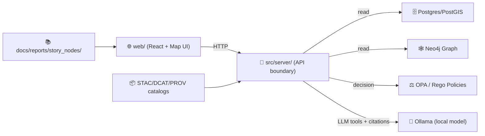

<!--
path: tests/e2e/README.md
note: According to a document from 2026-01-29, KFM’s architecture is “pipeline-first” + “policy-as-code”.
-->

# 🧪 End-to-End Tests (E2E) — KFM


E2E tests validate **KFM’s core promise**: users experience a trusted, governed, provenance-linked system—**from UI → API → policy → data**—without bypassing the canonical pipeline. 🧭

---

## 🔎 What E2E Covers (and why)

KFM is designed around a **non-negotiable pipeline** that ensures traceability and governance. E2E tests exist to catch regressions that unit/integration tests cannot—things like:

- 🗺️ The web UI correctly loads map + layers and renders data-driven interactions.
- 🔐 The API enforces **policy decisions** (deny / redact / sanitize).
- 🧾 Provenance and metadata are surfaced (licenses, citations, dataset records).
- 📚 Story Nodes render with the right evidence links and map/timeline coupling.
- 🤖 Focus Mode AI returns answers with citations and is blocked/redacted when policy says so.

> [!IMPORTANT]
> E2E tests must **never** “cheat” by reaching into databases directly from the UI layer, hard-coding hidden data, or bypassing policy gates. If a user can’t do it legitimately through KFM’s contracts, your test shouldn’t either.

---

## 🧱 System Under Test (high-level)



---

## 📁 Directory Layout

Suggested (and recommended) structure:

```text
📁 tests/
└── 📁 e2e/
    ├── 📄 README.md                 👈 you are here
    ├── 📁 specs/                    ✅ test specs (grouped by feature)
    │   ├── 📄 smoke.spec.ts
    │   ├── 📄 map.spec.ts
    │   ├── 📄 catalog.spec.ts
    │   ├── 📄 storynodes.spec.ts
    │   ├── 📄 policy.spec.ts
    │   └── 📄 focus-mode-ai.spec.ts
    ├── 📁 fixtures/                 🧰 small, governed test fixtures only
    │   ├── 📁 users/
    │   ├── 📁 datasets/
    │   └── 📁 story_nodes/
    ├── 📁 helpers/                  🛠️ shared helpers (API clients, waits, etc.)
    ├── 📁 pages/                    🧩 page objects (optional, but helpful)
    ├── 📁 artifacts/                📎 screenshots/videos/reports (gitignored)
    └── 📄 e2e.env.example           🔐 env vars for local runs
```

> [!TIP]
> Keep fixtures tiny. If you need “real” scale, add a **separate perf load test**. E2E should stay deterministic and fast.

---

## ✅ Prerequisites

- 🐳 **Docker + Docker Compose v2**
- 🟩 **Node.js** (LTS recommended)
- 🐍 **Python tooling** only if your workflow seeds fixtures via pipeline scripts
- 🤖 **Ollama** (only if running Focus Mode AI tests locally)

---

## 🚀 Quick Start (Local)

### 1) Bring up the dev stack 🐳

From the repo root:

```bash
# Option A (modern)
docker compose up -d --build

# Option B (legacy)
docker-compose up -d --build
```

Sanity checks (expected defaults):

- API: `http://localhost:8000/docs` (Swagger UI)
- Web: `http://localhost:3000`
- Neo4j: `http://localhost:7474` (if enabled)
- Postgres: `localhost:5432` (if exposed)

### 2) Configure E2E env 🔐

Copy the example and tweak if needed:

```bash
cp tests/e2e/e2e.env.example tests/e2e/.env
```

Example `tests/e2e/e2e.env.example`:

```dotenv
# 🌐 targets
E2E_BASE_URL=http://localhost:3000
E2E_API_URL=http://localhost:8000

# 🧪 toggles
E2E_HEADLESS=1
E2E_TRACE=0
E2E_VIDEO=0

# 🤖 AI (optional)
E2E_AI=0
E2E_AI_MODEL=llama2
```

### 3) Install and run the E2E runner 🧪

This repo may use **Playwright** (recommended) or another runner.
Below is the Playwright flow (adjust if your repo standardizes on something else):

```bash
cd tests/e2e
npm ci

# first time only
npx playwright install --with-deps

# run everything
npx playwright test

# run smoke only
npx playwright test --grep "@smoke"

# view report
npx playwright show-report
```

> [!NOTE]
> If your monorepo keeps test deps at the root, run the equivalent root scripts (e.g. `npm run e2e` / `pnpm e2e`).

---

## 🧬 Test Data & Determinism

KFM’s data philosophy is **deterministic + reproducible**: given the same inputs/config, pipelines should produce the same outputs—no manual steps. ✅

For E2E, that means:

- Use a **small fixture dataset** that already conforms to the pipeline (catalog + provenance included).
- Prefer “seed once then reuse” patterns in local dev.
- Keep E2E fixtures:
  - ✅ safe to publish
  - ✅ properly licensed
  - ✅ metadata-complete
  - ✅ governance-compliant

### Recommended E2E fixture strategy (pick one)

**A) Pre-seeded volumes (fastest)**
- Docker volumes include a minimal “known-good” dataset.

**B) Seed script inside API container (most explicit)**
- A script loads a minimal dataset + graph fixture + users.
- Example pattern:
  ```bash
  docker compose exec api python -m tools.seed_e2e
  ```

**C) Pipeline-driven seed (most faithful, slowest)**
- Run a minimal ETL pipeline to generate processed output + catalogs before boot.
- Great for nightly CI, not ideal for “every PR”.

---

## 🧭 What We Assert: KFM Invariants as E2E Checks

### 🧱 Pipeline invariants
- UI consumes data **only** via API contracts.
- API reads from governed stores (DB/graph/catalogs), not ad-hoc files.
- Story Nodes are rendered as governed artifacts (no “mystery content”).
- Focus Mode uses policy + citations, not unchecked model output.

### ⚖ Governance invariants
- Restricted/sensitive datasets are **denied or sanitized** (not leaked).
- Classification doesn’t “downgrade” accidentally across outputs.
- Provenance artifacts exist (and are visible where appropriate).

### 🤖 AI invariants (Focus Mode)
- AI answers include citations and/or references.
- AI output is checked against policy; disallowed content is blocked/redacted.
- AI uses **approved tools/APIs** (no direct DB fetches from UI).

---

## 🧪 Test Suites (Suggested)

Tagging convention (example):

- `@smoke` — minimal “is it alive?” suite
- `@map` — map rendering + layers + popups
- `@catalog` — dataset discovery + metadata visibility
- `@policy` — access control + redaction + denial behavior
- `@story` — Story Node rendering + deep links + map coupling
- `@ai` — Focus Mode AI + citation checks (optional in PRs)

Example mapping:

- ✅ **Smoke**: homepage loads, API health ok, basic dataset list returns.
- ✅ **Policy**: restricted dataset request yields 403 (or redacted response).
- ✅ **Provenance**: dataset detail page shows license/citation fields.
- ✅ **Story Nodes**: citations resolve; links aren’t broken.
- ✅ **Focus Mode**: `/ai/query` returns citations and refuses disallowed prompts.

---

## 🧩 Authoring Guidelines (to avoid flaky tests)

### ✅ Prefer stable selectors
- Use `data-testid="..."` for UI targeting.
- Avoid brittle CSS selectors, DOM order assumptions, and pixel-perfect assertions.

### ✅ Prefer contract-level expectations
- Assert “what user sees” + “what API promises”, not internal implementation.

### ✅ Make waits explicit
- Wait for network idle, known UI markers, or deterministic API responses.
- Avoid arbitrary `sleep()` unless you’re documenting a real async dependency.

### ✅ Keep tests readable
- Use helpers for:
  - auth/login
  - dataset creation/seed checks
  - policy expectation assertions (deny vs sanitize)
  - screenshot capture on failures

---

## 🧯 Troubleshooting

<details>
<summary><strong>🚪 Port conflicts (5432 / 7474 / 8000 / 3000)</strong></summary>

If you already have Postgres/Neo4j running locally, Docker may fail to bind.

- Stop local services, **or**
- Change port mappings in `docker-compose.yml`.

</details>

<details>
<summary><strong>🧠 Docker memory / performance issues</strong></summary>

If containers are slow or killed, raise Docker Desktop memory limits.
This matters more when loading geospatial fixtures or running graph checks.

</details>

<details>
<summary><strong>🪟 Windows/Mac volume quirks</strong></summary>

If mounted code doesn’t update or containers can’t write to `data/`, verify:
- volumes are configured correctly
- paths resolve properly
- permissions allow writes where needed

</details>

---

## 🧷 CI Notes (Recommended defaults)

For CI stability:

- Run `@smoke` on every PR ✅
- Run `@policy` + `@story` on PRs touching governance/docs ✅
- Run full suite nightly 🌙
- Run `@ai` only when Ollama is available + stable 🤖

Artifacts to upload on failure:
- screenshots
- videos (optional)
- traces (optional)
- HTML report

---

## 🧭 Definition of Done for a New E2E Test

A new E2E spec is considered “done” when it:

- ✅ Validates a user-visible behavior tied to a real KFM invariant
- ✅ Uses stable selectors (or adds them)
- ✅ Uses governed fixtures (no untracked mystery data)
- ✅ Includes a clear reason *why this matters* (comment at top of test)
- ✅ Is deterministic locally and in CI

---

## 🤝 Contributing

- Keep tests small and focused ✂️
- Prefer adding one great E2E test that protects a core invariant over many shallow ones 🎯
- If your change touches:
  - 🔐 policy
  - 📚 Story Nodes
  - 📦 STAC/DCAT/PROV metadata
  - 🧠 Focus Mode AI
  - 🗺️ map layers
…add/adjust E2E coverage accordingly.

Happy breaking regressions before they break trust 🧡

