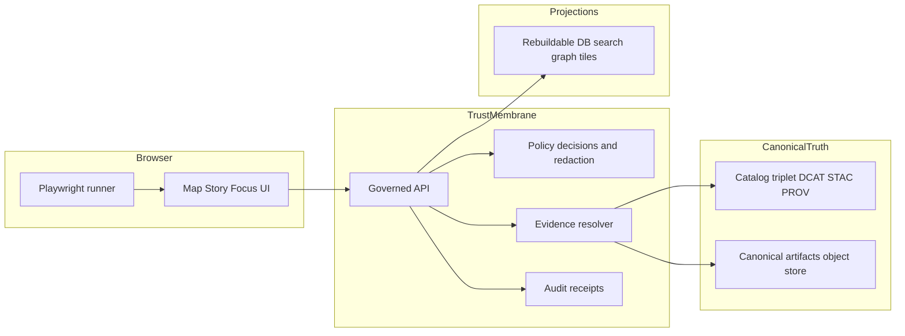

<!-- [KFM_META_BLOCK_V2]
doc_id: kfm://doc/4e1a6b25-9b50-4a4a-9ae3-9f5e46a7e6bd
title: End to end tests
type: standard
version: v1
status: draft
owners: KFM Engineering, KFM Governance
created: 2026-02-22
updated: 2026-02-22
policy_label: restricted
related:
  - ../../docs/architecture/
  - ../../docs/governance/
  - ../../docs/policy/
tags: [kfm, tests, e2e, trust-membrane, evidence-first, focus-mode]
notes:
  - Defines end to end test scope, contracts, and local and CI running guidance.
  - Update repo wiring placeholders once actual ports, scripts, and auth are confirmed.
[/KFM_META_BLOCK_V2] -->

# End to end tests
Validate KFM’s governed user journeys across Map, Story, and Focus surfaces without breaking the trust membrane.


- **Owners:** KFM Engineering + KFM Governance
- **Policy label:** `restricted` (do not embed secrets, tokens, or restricted coordinates in this directory)
- **Audience:** Maintainers and contributors modifying UI, governed APIs, evidence resolver, and policy enforcement

---

## Quick navigation
- [Purpose](#purpose)
- [Contracts we enforce](#contracts-we-enforce)
- [Test structure](#test-structure)
- [Repo wiring](#repo-wiring)
- [Environment contract](#environment-contract)
- [Local run](#local-run)
- [CI run](#ci-run)
- [Writing tests](#writing-tests)
- [Snapshots and visual diffs](#snapshots-and-visual-diffs)
- [Debugging](#debugging)
- [Security and data hygiene](#security-and-data-hygiene)
- [Definition of done for new e2e specs](#definition-of-done-for-new-e2e-specs)
- [References](#references)

---

## Purpose
KFM credibility depends on *enforced* invariants, not only written ones. These end to end tests:

- exercise real user flows across **Map**, **Story**, and **Focus** surfaces
- prove the **trust membrane** holds during real usage
- verify **evidence-first UX** surfaces are present and correct
- verify **cite-or-abstain Focus** behavior is enforced for AI answers
- validate runtime behavior aligns with policy decisions and redaction obligations



[Back to top](#end-to-end-tests)

---

## Contracts we enforce
These are the behaviors that e2e tests must make hard to regress.

### Trust membrane
The trust membrane means:

- UI and external clients **do not** read from storage or databases directly
- backend logic **does not** bypass repository interfaces to reach storage
- access flows through governed APIs that apply policy, redaction, and logging consistently

**E2E implication:** tests must fail if the browser attempts to talk to storage/DB origins directly.

### Evidence-first UX
Every map layer and story claim must open into an evidence view that includes at minimum:

- dataset version immutable ID
- license and rights holder
- policy label and redactions or generalizations applied
- provenance chain and run receipt link
- artifact links and checksums if policy allows

**E2E implication:** tests must prove the evidence drawer or evidence view is reachable and populated for representative selections.

### Cite-or-abstain Focus
Focus is a governed workflow:

- retrieves admissible evidence
- bundles it
- answers by citing evidence bundles
- verifies citations
- emits an audit receipt

If citations cannot be verified or policy denies, the system abstains or reduces scope.

**E2E implication:** tests must cover:
- a supported question that returns citations that resolve
- a restricted or unsupported question that results in abstention or scoped response with policy safe messaging

### Published surfaces serve promoted versions only
Production UIs and APIs must serve only dataset versions that are promoted and have:
- processed artifacts
- validated catalogs
- run receipts
- policy labels assigned

**E2E implication:** tests must not depend on unpromoted or ad hoc runtime-only data.

[Back to top](#end-to-end-tests)

---

## Test structure
Recommended directory layout for this folder. Adjust if your repo uses different conventions.

```text
tests/
└─ e2e/
   ├─ README.md
   ├─ playwright.config.ts                  # runner config
   ├─ specs/
   │  ├─ map/
   │  │  ├─ evidence_drawer.spec.ts
   │  │  ├─ overlays_visual.spec.ts
   │  │  └─ trust_membrane_network.spec.ts
   │  ├─ story/
   │  │  ├─ story_node_citations.spec.ts
   │  │  └─ story_map_state_sidecar.spec.ts
   │  └─ focus/
   │     ├─ cite_or_abstain_happy.spec.ts
   │     └─ cite_or_abstain_denied.spec.ts
   ├─ fixtures/
   │  ├─ datasets/                          # tiny promoted-safe fixtures used by the local stack
   │  ├─ users/                             # test identities and roles, never store real credentials
   │  └─ responses/                         # optional recorded API responses for deterministic tests
   ├─ utils/
   │  ├─ auth.ts
   │  ├─ network_guard.ts
   │  ├─ evidence_assertions.ts
   │  └─ focus_assertions.ts
   └─ artifacts/
      └─ .gitkeep                           # local-only outputs, should be gitignored
```

[Back to top](#end-to-end-tests)

---

## Repo wiring
This README intentionally does **not** assume the actual repo ports or scripts.

Fill these in when confirmed:

- UI base URL for Map, Story, and Focus surfaces
- Governed API base URL
- Auth mechanism for policy contexts
- How the local stack is started
- Which demo datasets exist in local fixture mode

Suggested wiring approach:

1. Local stack can boot with a deterministic “demo fixture” dataset set
2. Tests call the UI as a user would, and only observe behavior through the browser plus governed APIs
3. Network guard blocks any attempt to reach storage or DB endpoints directly

---

## Environment contract
These environment variables are the contract between the test harness and your local or CI environment.

| Variable | Required | Example | Purpose |
|---|---:|---|---|
| `KFM_E2E_BASE_URL` | yes | `http://localhost:3000` | UI root for browser navigation |
| `KFM_E2E_API_URL` | yes | `http://localhost:8080` | Governed API base URL |
| `KFM_E2E_TEST_ROLE` | yes | `public` | Policy context used by the test user |
| `KFM_E2E_AUTH_TOKEN` | sometimes | `...` | Token or credential for the test role |
| `KFM_E2E_NOW_ISO` | recommended | `2026-01-01T00:00:00Z` | Freeze “now” for time-aware UI determinism |
| `KFM_E2E_UPDATE_SNAPSHOTS` | no | `1` | Update visual snapshots intentionally |
| `KFM_E2E_TRACE` | no | `1` | Collect Playwright trace artifacts on failure |

---

## Local run
### Prerequisites
- A local KFM stack running with:
  - UI accessible at `KFM_E2E_BASE_URL`
  - governed API accessible at `KFM_E2E_API_URL`
  - deterministic demo data seeded, using only policy-safe fixtures

### Example Playwright commands
Run from repo root:

```bash
# Install browser deps once
npx playwright install --with-deps

# Run all e2e tests
npx playwright test -c tests/e2e/playwright.config.ts

# Run one spec
npx playwright test -c tests/e2e/playwright.config.ts tests/e2e/specs/map/evidence_drawer.spec.ts

# Run headed for debugging
npx playwright test -c tests/e2e/playwright.config.ts --headed --project=chromium

# Open the HTML report
npx playwright show-report
```

> TIP: Always set `KFM_E2E_NOW_ISO` for time-aware UI tests to avoid flakiness from “current date” behavior.

[Back to top](#end-to-end-tests)

---

## CI run
E2E tests are intended to be a merge-blocking gate for changes that can break the trust membrane or evidence behavior.

Recommended triggers:
- UI changes that affect Map, Story, Focus
- Governed API changes
- Evidence resolver changes
- Policy changes that affect enforcement or redaction obligations
- Catalog or receipt schema changes

Recommended CI artifacts to upload:
- Playwright HTML report
- traces and screenshots for failed tests
- video recordings for flaky reproduction

---

## Writing tests
### Golden rule
E2E tests assert **observable contracts**, not implementation details. If a behavior is safety- or governance-critical, it must be observable in a user flow.

### What to assert for each surface
| Surface | Must prove | Examples |
|---|---|---|
| Map | evidence view exists for layers and selections | evidence drawer opens and shows dataset version, license, policy label, run receipt link |
| Story | citations exist and resolve for claims | story node shows citations and links to evidence bundles |
| Focus | cite-or-abstain behavior is enforced | supported question yields resolvable citations and audit ref; denied question abstains safely |
| Governance | trust membrane is not violated | browser never requests storage or DB endpoints directly |

### Determinism checklist
- freeze time with `KFM_E2E_NOW_ISO`
- fixed viewport size and device scale factor
- disable animations where possible
- avoid external networks, or hard-block them at the runner level
- only use fixture datasets that are stable and policy-safe

---

## Snapshots and visual diffs
KFM map behavior includes overlays and camera state, which can regress subtly.

Recommended pattern:
- run **camera-path snapshots** for key scenes
- compare screenshots or rendered tiles within tolerance
- store snapshots under `tests/e2e/specs/**/__snapshots__/`

Snapshot hygiene:
- only update snapshots in a PR dedicated to an intentional visual change
- require reviewer sign-off, because snapshots are part of the trust surface
- never snapshot content that could be sensitive or restricted

---

## Debugging
Playwright supports traces, screenshots, and video.

Common workflows:

```bash
# Run only failed tests from last run
npx playwright test -c tests/e2e/playwright.config.ts --last-failed

# Record traces
KFM_E2E_TRACE=1 npx playwright test -c tests/e2e/playwright.config.ts

# Open a trace file
npx playwright show-trace tests/e2e/artifacts/trace.zip
```

If a test fails:
1. confirm the local stack is serving only promoted fixture data
2. check whether policy denies a request and the UI is rendering the expected denial or abstention UX
3. check whether a citation failed to resolve and should correctly force abstention

[Back to top](#end-to-end-tests)

---

## Security and data hygiene
### Default deny mindset
- If you are unsure whether test data contains sensitive locations, **do not** include it
- Prefer synthetic or generalized fixtures
- Never commit real tokens, credentials, or restricted coordinates

### Block external leakage
E2E tests should:
- block all outbound network calls except the UI origin and governed API origin
- fail if any request attempts to reach storage, DB ports, or unknown hosts

### Policy-safe failures
When a request is denied:
- UI should show what is missing in policy-safe terms
- UI should not reveal restricted dataset existence via error strings or timing clues

---

## Definition of done for new e2e specs
Use this checklist for every new E2E spec:

- [ ] Covers a real user flow, not only an API call
- [ ] Has a happy-path assertion for evidence and receipts
- [ ] Has a denial or abstention assertion when policy should block
- [ ] Uses deterministic time and stable fixtures
- [ ] Does not embed secrets or sensitive coordinates
- [ ] Stores reproducible debug artifacts on failure in CI

---

## References
- KFM Definitive Design and Governance Guide vNext
- KFM Source Snapshots and integration idea packs
- Policy pack and Promotion Contract documentation
