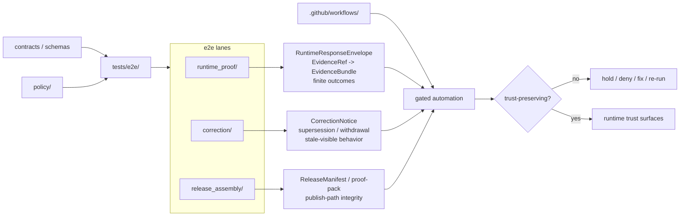

<!-- [KFM_META_BLOCK_V2]
doc_id: kfm://doc/<NEEDS_VERIFICATION_UUID>
title: e2e
type: standard
version: v1
status: review
owners: @bartytime4life
created: YYYY-MM-DD
updated: YYYY-MM-DD
policy_label: public
related: [tests/README.md, .github/workflows/README.md, contracts/README.md, policy/README.md, tests/e2e/runtime_proof/README.md, tests/e2e/correction/README.md, tests/e2e/release_assembly/README.md]
tags: [kfm, tests, e2e, verification]
notes: [Current public main shows this file and its child lanes as scaffold surfaces; exact doc_id and calendar metadata need verification before merge]
[/KFM_META_BLOCK_V2] -->

# e2e

End-to-end governed verification for runtime proof, correction propagation, and release-assembly integrity in KFM.

> Status: experimental  
> Owners: `@bartytime4life`  
> Path: `tests/e2e/README.md`  
> Repo fit: end-to-end verification lane for release-backed runtime behavior, correction lineage, and publish-path proof  
> Quick jump: [Scope](#scope) · [Repo fit](#repo-fit) · [Accepted inputs](#accepted-inputs) · [Exclusions](#exclusions) · [Current verified snapshot](#current-verified-snapshot) · [Directory tree](#directory-tree) · [Quickstart](#quickstart) · [Usage](#usage) · [Diagram](#diagram) · [Tables](#tables) · [Task list](#task-list) · [FAQ](#faq) · [Appendix](#appendix)


> [!IMPORTANT]
> Current public `main` proves that `tests/e2e/` exists and that it currently exposes `correction/`, `release_assembly/`, `runtime_proof/`, and this `README.md`. That does **not** by itself prove executable depth, merge-blocking automation, fixture richness, or runner wiring. Treat directory presence as a governed boundary, not as earned coverage.

---

## Scope

`tests/e2e/` is the narrowest repo-facing verification surface that should prove KFM behavior across real trust-bearing seams rather than isolated units.

That means this directory is not about “did the page load?” or “did one API route return 200?” in the abstract. It exists for the harder questions:

- can a request resolve evidence and end in a finite, explainable outcome?
- can release, correction, rollback, and stale visibility remain inspectable under pressure?
- can publish-path proof stay attached to the thing being shown?
- can negative outcomes stay governed instead of being polished away?

### Evidence boundary used here

| Evidence layer | What this README treats as settled |
|---|---|
| **CONFIRMED — current public repo** | `tests/e2e/` exists as a real branch-visible directory, with `README.md`, `correction/`, `release_assembly/`, and `runtime_proof/` present on public `main`. |
| **CONFIRMED — current public repo governance** | `/tests/` is owned by `@bartytime4life` in `CODEOWNERS`. |
| **CONFIRMED — current public workflow lane** | `.github/workflows/` is visible, but the public branch currently shows `README.md` only there. |
| **CONFIRMED — March 2026 KFM doctrine** | End-to-end verification must prove trust, not only code paths; finite runtime outcomes, correction lineage, release proof, citation-negative behavior, and visible failure states are all load-bearing. |
| **UNKNOWN / NEEDS VERIFICATION** | Exact runner/toolchain, actual executable suite depth, required checks, branch-protection settings, fixture density, screenshot baseline inventory, and whether drills have been exercised beyond scaffold level. |

[Back to top](#e2e)

## Repo fit

This README should complement `tests/README.md`, not compete with it.

| Direction | Path | Role |
|---|---|---|
| Upstream | [`tests/README.md`](../README.md) | taxonomy owner for the broader verification lane |
| Upstream | [`../../contracts/README.md`](../../contracts/README.md) | contract-law boundary; e2e should consume, not redefine |
| Upstream | [`../../policy/README.md`](../../policy/README.md) | deny-by-default, reasons/obligations, finite outcomes |
| Upstream | [`../../.github/workflows/README.md`](../../.github/workflows/README.md) | CI / gate lane; currently visible as documentary control surface |
| Downstream | [`runtime_proof/README.md`](./runtime_proof/README.md) | request-time evidence, citations, and finite runtime outcomes |
| Downstream | [`correction/README.md`](./correction/README.md) | supersession, withdrawal, rollback, stale visibility, correction propagation |
| Downstream | [`release_assembly/README.md`](./release_assembly/README.md) | promotion, release evidence, manifest/proof-pack, publish-path integrity |

### Boundary rule

This directory is for **execution-facing proof**, not for creating a third source of contract or policy authority.

If `contracts/` and `schemas/` still require an authority decision elsewhere in the repo, do not silently resolve that split here by inventing e2e-local schema law. End-to-end cases should consume the authoritative contract source declared by the repo, not create parallel governance.

[Back to top](#e2e)

## Accepted inputs

Content that belongs in `tests/e2e/` includes:

- executable request-time proof cases for `ANSWER`, `ABSTAIN`, `DENY`, and `ERROR`
- end-to-end evidence resolution checks where `EvidenceRef` must resolve to an inspectable support object
- correction, supersession, withdrawal, rollback, and stale-visibility drills
- release / promotion / publish-path proof checks that follow manifests, review decisions, and correction posture
- thin, public-safe fixtures that exercise real trust seams without becoming canonical data stores
- expectations about visible trust cues when a case reaches Focus, export, dossier, or other trust-visible surfaces
- query packs, golden examples, or archived drill outputs where repeatability matters
- inspection-first notes that help reviewers verify what is actually wired on the checked-out branch

## Exclusions

The following do **not** belong here as authoritative source of truth:

- unit, integration, contract-only, policy-only, or accessibility-only work that does not need end-to-end scope  
  → keep it in the smallest fitting existing test family
- canonical schema files, OpenAPI descriptions, vocabularies, or standards profiles  
  → keep them in `../../contracts/` or the authoritative schema surface
- executable policy bundles, reviewer-role maps, or obligation registries  
  → keep them in `../../policy/`
- runtime/service implementation code, ingestion workers, API handlers, or shell components  
  → keep them in apps/packages/infra surfaces
- promoted release artifacts as the primary record  
  → verify them here, but do not relocate their source of truth here
- branch-local scratch captures, local dumps, or oversized fixture payloads  
  → keep them out of `tests/e2e/`

## Current verified snapshot

The current public branch proves this much without overclaiming:

- `tests/e2e/README.md` exists.
- `tests/e2e/correction/` exists.
- `tests/e2e/release_assembly/` exists.
- `tests/e2e/runtime_proof/` exists.
- each visible child lane currently presents as scaffold-first rather than richly described executable documentation.
- `.github/workflows/` is visible on public `main`, but no checked-in workflow YAML files are claimed here.
- `/tests/` ownership is assigned to `@bartytime4life`.

> [!CAUTION]
> A visible directory tree is valuable, but it is not the same thing as runner coverage, fixture maturity, or merge-blocking proof. Keep the distinction explicit.

[Back to top](#e2e)

## Directory tree

### Current confirmed snapshot

```text
tests/e2e/
├── README.md
├── correction/
│   └── README.md
├── release_assembly/
│   └── README.md
└── runtime_proof/
    └── README.md
```

### Working rule

Keep the current three-lane split unless the checked-out branch proves a stronger, simpler, or already-executable pattern.

Do not add top-level siblings here for aesthetic reasons. Add a new lane only when existing folders cannot truthfully own the burden.

## Quickstart

### Safe inspection commands

These commands are inspection-first and do not assume a particular runner.

```bash
# inspect the visible e2e surface
find tests/e2e -maxdepth 3 -type d | sort
find tests/e2e -maxdepth 3 -type f | sort

# inspect adjacent governance and trust-boundary surfaces
sed -n '1,220p' tests/README.md 2>/dev/null || true
sed -n '1,220p' .github/workflows/README.md 2>/dev/null || true
sed -n '1,220p' contracts/README.md 2>/dev/null || true
sed -n '1,220p' policy/README.md 2>/dev/null || true

# inspect likely trust-bearing vocabulary without assuming a runner
grep -RIn "EvidenceRef\|EvidenceBundle\|RuntimeResponseEnvelope\|CorrectionNotice\|ABSTAIN\|DENY\|ERROR" \
  tests/e2e contracts policy schemas docs 2>/dev/null || true
```

### First local review pass

1. Verify which child lanes contain executable suites rather than placeholder README files.
2. Verify whether the checked-out branch still matches the current public `main` tree.
3. Verify which checks actually block merges on the active branch.
4. Verify whether contract, policy, docs, and e2e changes move together in the same change stream.
5. Verify whether negative paths exist, not only happy-path confirmation.
6. Verify whether release, runtime, and correction proof are exercised end to end.

> [!TIP]
> Prefer repo-native commands discovered from the checked-out branch over README-invented runner commands. Inspection-first is safer than guessing a toolchain.

[Back to top](#e2e)

## Usage

### What `tests/e2e/` is

`tests/e2e/` is:

- the proof surface for request-time governed behavior
- the lane where release-backed trust claims are exercised across real boundaries
- the place where correction lineage must remain visible under change
- the home for suites that prove finite outcomes instead of polished ambiguity

### What `tests/e2e/` is not

`tests/e2e/` is not:

- a generic smoke-test bucket
- a substitute for authoritative contracts or policy bundles
- a place to hide uncertainty behind broad “coverage” language
- a badge generator for CI theater
- a reason to bypass smaller, more precise test families when they are enough

### Where a new e2e case should live

| Lane | Put work here when… | Example burden |
|---|---|---|
| `runtime_proof/` | request-time evidence resolution, citations, or finite answer outcomes are the question | prove `ANSWER / ABSTAIN / DENY / ERROR` behavior with visible support or visible refusal |
| `correction/` | supersession, rollback, stale visibility, withdrawal, or correction propagation must be exercised | prove that released material changes visibly without erasing lineage |
| `release_assembly/` | promotion, release evidence, or publish-path integrity is the question | prove that manifest, review/policy context, and downstream trust cues stay attached |

### Working rule for scaffolded lanes

A present directory is not the same thing as an active suite.

If a child lane currently contains only a placeholder README or thin scaffold, treat it as a documented proof boundary waiting for executable cases, not as maturity already earned.

## Diagram


```mermaid
flowchart LR
    C["contracts / schemas"] --> E["tests/e2e/"]
    P["policy/"] --> E
    W[".github/workflows/"] --> G["gated automation"]

    subgraph L["e2e lanes"]
      RP["runtime_proof/"]
      CO["correction/"]
      RA["release_assembly/"]
    end

    E --> L
    RP --> RR["RuntimeResponseEnvelope<br/>EvidenceRef -> EvidenceBundle<br/>finite outcomes"]
    CO --> CN["CorrectionNotice<br/>supersession / withdrawal<br/>stale-visible behavior"]
    RA --> RM["ReleaseManifest / proof-pack<br/>publish-path integrity"]

    RR --> G
    CN --> G
    RM --> G

    G --> Q{"trust-preserving?"}
    Q -->|no| H["hold / deny / fix / re-run"]
    Q -->|yes| S["runtime trust surfaces"]
```

[Back to top](#e2e)

## Tables

### Lane map

| Lane | Primary proof burden | Core artifacts / signals | Current branch visibility |
|---|---|---|---|
| `runtime_proof/` | request-time evidence and finite outcomes | `EvidenceBundle`, `RuntimeResponseEnvelope`, citations check, governed negative outcomes | visible |
| `correction/` | change lineage under release pressure | `CorrectionNotice`, supersession, withdrawal, stale-visible state, rollback notes | visible |
| `release_assembly/` | promotion and publish-path integrity | `ReleaseManifest`, proof-pack, decision/review linkage, audit join expectations | visible |

### Outcome expectations

| Situation under pressure | Expected visible outcome | Why it matters |
|---|---|---|
| evidence cannot be resolved | governed negative outcome, not confident prose | cite-or-abstain / fail-closed posture |
| policy or rights block the action | `DENY` or equivalent governed refusal | deny-by-default is load-bearing |
| runtime support is partial or stale | visible narrowed / stale / partial state | trust requires visible incompleteness |
| published material is corrected | superseded / withdrawn / replaced state remains visible | correction is part of release discipline |
| publish-path proof is incomplete | hold, fail, or non-promoted state | publication law is stronger than deployment success |

## Task list

- [ ] Confirm the checked-out branch still matches the visible public `main` tree for `tests/e2e/`.
- [ ] Confirm whether each child lane contains executable suites or README-only scaffolds.
- [ ] Add at least one executable `runtime_proof` case for each finite outcome used by the runtime.
- [ ] Add at least one executable `correction` drill covering visible lineage change.
- [ ] Add at least one executable `release_assembly` proof covering manifest/publish-path integrity.
- [ ] Keep fixtures public-safe, thin, and execution-oriented.
- [ ] Link every e2e addition back to the contract/policy/docs surfaces it depends on.
- [ ] Replace any guessed runner language with repo-native invocation once verified.
- [ ] Refuse merge-ready language if the lane is still scaffold-only.

### Definition of done

This directory is in a healthier state when all of the following are true:

1. the three child lanes still reflect the smallest meaningful end-to-end split,
2. at least one executable case exists in each lane,
3. finite runtime outcomes are proven rather than merely described,
4. correction behavior is visible and lineage-preserving,
5. release-assembly proof does not outrun actual governed release evidence,
6. this README documents what the branch can truly prove right now.

[Back to top](#e2e)

## FAQ

### Why is this separate from `tests/contracts/` and `tests/policy/`?

Because end-to-end proof is where isolated truths meet each other. A contract can validate, and a policy can evaluate, while the full request path still fails to stay inspectable, finite, or correction-aware. This directory exists for that seam.

### Why are there no runner commands here?

Because the current branch-visible evidence proves the directory structure more strongly than it proves a particular runner or merge gate. This README should stay inspection-first until the checked-out branch confirms the actual invocation path.

### Why public-safe fixtures first?

Because KFM doctrine repeatedly favors small, governable, public-safe thin slices before broad expansion. End-to-end proof is more trustworthy when the fixture burden is realistic but safe to execute and review.

### Why keep three child lanes instead of one large e2e bucket?

Because the failure modes are different. Runtime proof, correction propagation, and release assembly each answer a different trust question. Keeping them separate helps reviewers see what is proven, what is missing, and where a regression belongs.

## Appendix

<details>
<summary id="appendix">Verification backlog and merge-time checks</summary>

### Merge-time checks

Before treating this lane as mature, verify:

- the checked-out branch contains real executable suites where expected
- e2e cases are linked to real contracts and policy sources rather than free-floating examples
- negative outcomes are asserted explicitly
- correction drills preserve lineage instead of silently rewriting history
- any publish-path proof matches actual release evidence, not only README claims
- workflow automation, if added, is reviewable and not a detached CI theater layer

### Placeholders still requiring verification

The following remain intentionally unresolved here:

- exact `doc_id`
- created / updated calendar metadata
- exact runner / toolchain
- exact required checks on the active branch
- exact suite density inside each child lane
- exact screenshot / golden-baseline inventory
- exact branch-protection or ruleset behavior

### Illustrative starter specimen names (`PROPOSED`)

```text
tests/e2e/runtime_proof/
  answer_public_safe.*
  abstain_missing_evidence.*
  deny_policy_block.*
  error_internal_guarded.*

tests/e2e/correction/
  supersede_visible_lineage.*
  withdraw_visible_state.*
  stale_projection_propagates.*

tests/e2e/release_assembly/
  publish_path_manifest_complete.*
  proof_pack_incomplete_holds.*
  review_and_policy_refs_attached.*
```

These names are illustrative only. Keep the current branch’s naming if executable suites already exist there.

</details>

[Back to top](#e2e)
