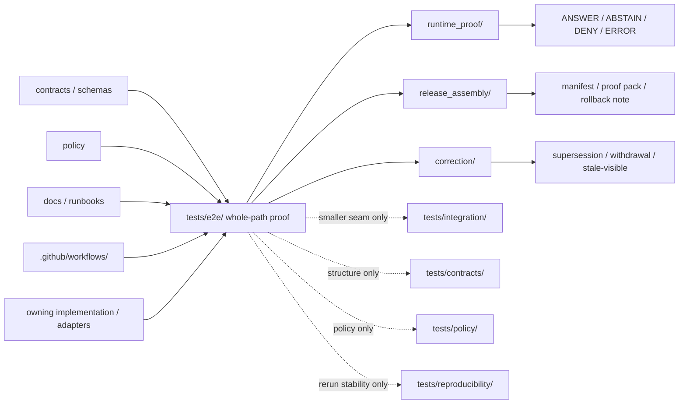

<!-- [KFM_META_BLOCK_V2]
doc_id: kfm://doc/NEEDS-VERIFICATION
title: tests/e2e
type: standard
version: v1
status: draft
owners: @bartytime4life
created: YYYY-MM-DD
updated: 2026-04-14
policy_label: NEEDS_VERIFICATION
related: [
  ../README.md,
  ../contracts/README.md,
  ../integration/README.md,
  ../policy/README.md,
  ../reproducibility/README.md,
  ../accessibility/README.md,
  ./runtime_proof/README.md,
  ./release_assembly/README.md,
  ./correction/README.md,
  ../../README.md,
  ../../contracts/README.md,
  ../../policy/README.md,
  ../../schemas/README.md,
  ../../docs/README.md,
  ../../.github/CODEOWNERS,
  ../../.github/workflows/README.md,
  ../../CONTRIBUTING.md
]
tags: [kfm, tests, e2e, verification, runtime, release, correction]
notes: [
  "doc_id, created, updated-at-merge, and policy_label remain placeholders pending git-history or governance-record verification.",
  "Updated to align with the stronger top-level tests family map and the explicit three-leaf e2e structure.",
  "Current public evidence proves the three documented leaf families and their README presence, but not executable suite depth or merge-blocking automation."
]
[/KFM_META_BLOCK_V2] -->

<a id="top"></a>

# `tests/e2e/`

End-to-end proof surface for **KFM runtime outcomes**, **release assembly**, and **correction lineage**.

> [!NOTE]
> The KFM meta block above keeps reviewable placeholders for `doc_id`, `created`, `updated`, and `policy_label` until git history or governance records are reverified.

> **Status:** experimental  
> **Owners:** `@bartytime4life`  
> **Path:** `tests/e2e/README.md`  
> **Repo fit:** downstream of [`../README.md`](../README.md), [`../../contracts/README.md`](../../contracts/README.md), [`../../policy/README.md`](../../policy/README.md), [`../../schemas/README.md`](../../schemas/README.md), [`../../docs/README.md`](../../docs/README.md), [`../../.github/workflows/README.md`](../../.github/workflows/README.md), and [`../../CONTRIBUTING.md`](../../CONTRIBUTING.md); upstream of the visible leaf families [`./runtime_proof/`](./runtime_proof/), [`./release_assembly/`](./release_assembly/), and [`./correction/`](./correction/)  
> **Quick jump:** [Scope](#scope) · [Repo fit](#repo-fit) · [Accepted inputs](#accepted-inputs) · [Exclusions](#exclusions) · [Current verified snapshot](#current-verified-snapshot) · [Directory tree](#directory-tree) · [Quickstart](#quickstart) · [Usage](#usage) · [Diagram](#diagram) · [Reference tables](#reference-tables) · [Task list / definition of done](#task-list--definition-of-done) · [FAQ](#faq) · [Appendix](#appendix)  
>      

> [!IMPORTANT]
> Current public `main` proves that `tests/e2e/` exists and currently exposes `correction/`, `release_assembly/`, `runtime_proof/`, and `README.md`, and that each visible leaf family currently publishes its own checked-in `README.md`.

> [!WARNING]
> This does **not** yet prove executable suite depth, a mounted runner/toolchain, merge-blocking automation, or exercised release/correction drills.
> Treat directory presence and README-bearing leaf inventories as **family-boundary evidence**, not already-earned operational proof.

> [!TIP]
> Keep the KFM burden split visible here:
>
> **whole-path proof ≠ contract-only proof ≠ policy-only proof ≠ reproducibility-only proof**
>
> Use `tests/e2e/` only when the case is honestly whole-path and trust-bearing.

---

## Scope

`tests/e2e/` is where KFM should prove **whole-path trust-bearing behavior**.

This directory is not the place for generic smoke tests, oversized demos, or coverage theater. It exists for the narrower and more consequential question:

> **Does the governed system still hold together when a real runtime outcome, release-bearing assembly, or correction path is exercised end to end?**

That burden is broader than `tests/integration/`, and stricter than “the UI loaded.” Good end-to-end cases are **thin but whole**:

- one accountable scenario
- one visible result
- the proof objects needed to explain why that result is trustworthy

### Status markers used here

| Marker | Meaning in this README |
|---|---|
| **CONFIRMED** | Visible on the current public branch or directly grounded in stable adjacent repo documentation |
| **INFERRED** | Strongly supported by repo doctrine and neighboring docs, but not re-proven from executable branch evidence in this revision |
| **PROPOSED** | Buildable guidance that fits KFM doctrine without claiming current implementation |
| **UNKNOWN** | Not verified strongly enough to describe as current repo reality |
| **NEEDS VERIFICATION** | A path, command, workflow, or implementation detail that should be checked against the checked-out branch before merge |

### Evidence boundary used here

| Evidence layer | What this README treats as settled |
|---|---|
| **CONFIRMED — current public repo** | `tests/e2e/` exists and the public directory listing currently shows `correction/`, `release_assembly/`, `runtime_proof/`, and `README.md` |
| **CONFIRMED — parent tests contract** | [`../README.md`](../README.md) defines `e2e/` as the end-to-end verification family and assigns the three visible leaf burdens |
| **CONFIRMED — ownership** | [`../../.github/CODEOWNERS`](../../.github/CODEOWNERS) assigns `/tests/` to `@bartytime4life` |
| **CONFIRMED — leaf directory state** | Public `main` now exposes checked-in `README.md` files under `./correction/`, `./release_assembly/`, and `./runtime_proof/`; the three visible leaf directories are still `README.md`-only in the public tree |
| **CONFIRMED — workflow adjacency** | Public `main` currently shows [`../../.github/workflows/README.md`](../../.github/workflows/README.md) but no checked-in workflow YAML files in `.github/workflows/`, so merge-blocking automation is not proven from visible repo files alone |
| **CONFIRMED — historical workflow signal** | [`../../.github/workflows/README.md`](../../.github/workflows/README.md) records deleted workflow-lane names visible through public Actions history, but explicitly treats them as reconstruction clues rather than current checked-in inventory |
| **NEEDS VERIFICATION** | Actual runner/toolchain, executable case depth, required checks, screenshot baseline inventory, proof-pack emitters, and whether runtime/release/correction drills are exercised on the checked-out branch |

[Back to top](#top)

---

## Repo fit

**Path:** `tests/e2e/README.md`  
**Role:** directory README for whole-path proof and leaf placement under `tests/e2e/`.

### Upstream anchors

| Relation | Path | Why it matters | Status |
|---|---|---|---|
| Parent family map | [`../README.md`](../README.md) | defines the test-family lattice and names `e2e/` as the end-to-end family | **CONFIRMED** |
| Repo root posture | [`../../README.md`](../../README.md) | keeps this directory aligned with the repo’s governed, evidence-first posture | **CONFIRMED** |
| Contribution contract | [`../../CONTRIBUTING.md`](../../CONTRIBUTING.md) | keeps claims, commands, and workflow references evidence-bounded | **CONFIRMED** |
| Workflow adjacency | [`../../.github/workflows/README.md`](../../.github/workflows/README.md) | shows current public automation visibility and its limits | **CONFIRMED** |
| Ownership boundary | [`../../.github/CODEOWNERS`](../../.github/CODEOWNERS) | establishes review ownership for `/tests/` | **CONFIRMED** |
| Contract source | [`../../contracts/README.md`](../../contracts/README.md) | end-to-end cases should consume authoritative contracts, not invent them | **CONFIRMED** |
| Policy source | [`../../policy/README.md`](../../policy/README.md) | allow / deny / abstain posture belongs there when policy is the main question | **CONFIRMED** |
| Schema source | [`../../schemas/README.md`](../../schemas/README.md) | schema authority should stay out of e2e drift | **CONFIRMED** |
| Runbooks and doctrine-adjacent docs | [`../../docs/README.md`](../../docs/README.md) | release, rollback, correction, and operator guidance should stay synchronized | **CONFIRMED** |
| Smaller governed boundary slices | [`../integration/README.md`](../integration/README.md) | use integration when the proof is real-boundary but not full end to end | **CONFIRMED** |
| Deterministic rerun proof | [`../reproducibility/README.md`](../reproducibility/README.md) | keep replay stability separate from broader whole-path proof | **CONFIRMED** |
| Contract drift family | [`../contracts/README.md`](../contracts/README.md) | structure-only checks should stay there | **CONFIRMED** |
| Policy grammar family | [`../policy/README.md`](../policy/README.md) | policy-only burden should stay there | **CONFIRMED** |
| Accessibility family | [`../accessibility/README.md`](../accessibility/README.md) | accessibility-only burden should stay there | **CONFIRMED** |

### Confirmed local leaf families

| Leaf | Meaning | Current visible state |
|---|---|---|
| [`./runtime_proof/`](./runtime_proof/) | request-time runtime and outcome proof | visible + `README.md` only on public `main` |
| [`./release_assembly/`](./release_assembly/) | release / promotion / publish-path proof | visible + `README.md` only on public `main` |
| [`./correction/`](./correction/) | correction, supersession, replacement, and stale-visible proof | visible + `README.md` only on public `main` |

> [!NOTE]
> Public `main` proves all three leaf directories and their `README.md` files, but it still does **not** prove equal executable maturity across those leaves.

[Back to top](#top)

---

## Accepted inputs

Accepted inputs for this directory are the **smallest artifacts needed to prove a whole path honestly**.

| Accepted input | What belongs here | Status posture |
|---|---|---|
| Whole-path scenario definitions | one narrow but complete scenario that crosses real runtime, release, or correction boundaries | **CONFIRMED** as burden / local file layout **NEEDS VERIFICATION** |
| Reused authoritative fixtures | contract examples, policy examples, and representative inputs reused from their owning homes | **CONFIRMED** as direction |
| Runtime outcome traces | cases for `ANSWER`, `ABSTAIN`, `DENY`, `ERROR`, citation-negative, or evidence-resolution-negative behavior | **CONFIRMED** as burden / mounted inventory **NEEDS VERIFICATION** |
| Release proof objects | manifests, proof packs, promotion refs, rollback notes, and publish-path evidence | **INFERRED / PROPOSED** local inventory |
| Correction drills | supersession, withdrawal, replacement, and stale-visible behavior | **CONFIRMED** as burden / mounted inventory **NEEDS VERIFICATION** |
| Surface-state evidence | screenshots, snapshots, or equivalent outward cues when a trust state must remain visible | **PROPOSED / NEEDS VERIFICATION** |
| Comparison and audit output | reports that explain pass, fail-closed behavior, or lineage changes | **INFERRED / PROPOSED** |

[Back to top](#top)

---

## Exclusions

What does **not** belong here, and where it should go instead:

| Exclusion | Keep it out of `tests/e2e/` | Put it here instead |
|---|---|---|
| Pure local logic | no real whole-path burden | [`../unit/README.md`](../unit/README.md) |
| Real-boundary slices that are still smaller than full end to end | not every seam needs full-system proof | [`../integration/README.md`](../integration/README.md) |
| Schema-shape-only validation | contract structure without runtime/release/correction burden | [`../contracts/README.md`](../contracts/README.md) |
| Policy grammar or reason/obligation logic by itself | decision grammar with no broader whole-path slice | [`../policy/README.md`](../policy/README.md) |
| Accessibility-only behavior | keyboard, motion, contrast, or inspectability checks without broader end-to-end burden | [`../accessibility/README.md`](../accessibility/README.md) |
| Reproducibility-only checks | stable digests, counts, or rerun sameness without broader whole-path behavior | [`../reproducibility/README.md`](../reproducibility/README.md) |
| Runbooks, release notes, or operator prose | documentation is not executable proof | [`../../docs/README.md`](../../docs/README.md) |
| Canonical schemas, policy bundles, or heavyweight release artifacts | this directory proves behavior; it should not replace authority or artifact storage | owning contract/policy/release surfaces |

[Back to top](#top)

---

## Current verified snapshot

The current public `main` branch proves the following:

- `tests/e2e/` exists and currently contains `correction/`, `release_assembly/`, `runtime_proof/`, and `README.md`
- `tests/e2e/README.md` is **not** a one-line scaffold on public `main`; it is already a multi-section directory guide
- [`./correction/`](./correction/), [`./release_assembly/`](./release_assembly/), and [`./runtime_proof/`](./runtime_proof/) each currently expose `README.md` only in the public tree
- those leaf READMEs are not identical in emphasis: `runtime_proof/` is request-time outcome focused, `release_assembly/` is promotion and publish-path focused, and `correction/` is correction-lineage focused
- the parent [`../README.md`](../README.md) already assigns those three visible leaf families clear meanings
- public `.github/workflows/` currently exposes `README.md` only; no checked-in workflow YAML files are visible there from the public tree
- public `.github/workflows/README.md` explicitly separates current `README.md`-only tree state from historically visible deleted workflow lanes in the Actions UI; treat those lane names as reconstruction clues, not current inventory
- `/tests/` ownership currently resolves to `@bartytime4life`

> [!CAUTION]
> What is still **not** proven here:
> the actual runner, suite depth, required checks, screenshot baseline inventory, proof-pack emitters, correction drill history, or whether any of these end-to-end families are exercised automatically.

[Back to top](#top)

---

## Directory tree

### Current confirmed snapshot

```text
tests/
└── e2e/
    ├── correction/
    │   └── README.md
    ├── release_assembly/
    │   └── README.md
    ├── runtime_proof/
    │   └── README.md
    └── README.md
```

### Design rule

Keep `tests/e2e/` **leaf-led**.

When real executable cases arrive, prefer adding them inside the existing visible families before inventing a second taxonomy at the same level.

### `PROPOSED` maturity direction

```text
tests/e2e/
├── correction/
│   ├── README.md
│   ├── cases/
│   └── fixtures/
├── release_assembly/
│   ├── README.md
│   ├── cases/
│   └── fixtures/
├── runtime_proof/
│   ├── README.md
│   ├── cases/
│   └── fixtures/
└── README.md
```

Use that as a **growth direction**, not as a claim about the current branch.

[Back to top](#top)

---

## Quickstart

### Safe inspection commands

These commands are safe because they inspect the current branch shape without assuming Playwright, Cypress, pytest, Vitest, Jest, or any other unverified runner.

```bash
# inspect the current local e2e inventory
find tests/e2e -maxdepth 4 -type d 2>/dev/null | sort
find tests/e2e -maxdepth 4 -type f 2>/dev/null | sort

# re-read the family map before moving or adding tests
sed -n '1,260p' tests/README.md 2>/dev/null || true
sed -n '1,220p' tests/contracts/README.md 2>/dev/null || true
sed -n '1,220p' tests/integration/README.md 2>/dev/null || true
sed -n '1,220p' tests/policy/README.md 2>/dev/null || true
sed -n '1,220p' tests/reproducibility/README.md 2>/dev/null || true
sed -n '1,220p' tests/unit/README.md 2>/dev/null || true

# inspect visible e2e leaf docs
sed -n '1,220p' tests/e2e/runtime_proof/README.md 2>/dev/null || true
sed -n '1,220p' tests/e2e/release_assembly/README.md 2>/dev/null || true
sed -n '1,220p' tests/e2e/correction/README.md 2>/dev/null || true

# inspect ownership and workflow adjacency
sed -n '1,260p' .github/README.md 2>/dev/null || true
sed -n '1,220p' .github/CODEOWNERS 2>/dev/null || true
find .github/workflows -maxdepth 2 -type f 2>/dev/null | sort
sed -n '1,260p' .github/workflows/README.md 2>/dev/null || true
git log --name-status -- .github/workflows 2>/dev/null | sed -n '1,120p' || true

# search for KFM runtime/release/correction vocabulary before inventing new names
grep -RIn \
  -e 'EvidenceBundle' \
  -e 'RuntimeResponseEnvelope' \
  -e 'ReleaseManifest' \
  -e 'ReleaseProofPack' \
  -e 'CorrectionNotice' \
  -e 'ABSTAIN' \
  -e 'DENY' \
  -e 'ERROR' \
  -e 'stale' \
  tests contracts policy schemas docs .github 2>/dev/null || true
```

### First local review pass

1. Confirm whether the checked-out branch still matches the current public `tests/e2e/` shape.
2. Confirm which visible leaf families contain executable cases versus README-only scaffolding.
3. Confirm the actual runner/toolchain before documenting any command.
4. Confirm whether the case is honestly whole-path proof or belongs in `integration/`, `contracts/`, `policy/`, `accessibility/`, or `reproducibility/`.
5. Confirm whether fail-closed behavior is asserted, not just happy-path success.
6. Confirm whether release and correction cases preserve lineage and outward trust state.

> [!TIP]
> Inspection-first is safer than guessing a toolchain. Do not document `npm test`, `pytest`, `cargo test`, browser harness commands, or GitHub required checks here until the checked-out branch proves them.

[Back to top](#top)

---

## Usage

### What `tests/e2e/` is

`tests/e2e/` is:

- the whole-path proof surface for trust-bearing KFM behavior
- the family where request-time runtime outcomes, release assembly, and correction lineage should remain inspectable
- the place where fail-closed behavior must stay visible instead of being polished away
- the outer verification boundary before a case becomes release evidence or operator-facing doctrine

### What `tests/e2e/` is not

`tests/e2e/` is **not**:

- a generic browser smoke folder
- a substitute home for contract law, policy bundles, or canonical schemas
- proof that merge-blocking automation exists
- a catch-all for any test that “feels important”
- a place to hide broad uncertainty behind a single green status

### Where a new case belongs

| If the main question is… | Best home | Why |
|---|---|---|
| “Does request-time evidence resolution still produce the right outward outcome?” | [`./runtime_proof/`](./runtime_proof/) | runtime outcome is the primary burden |
| “Does promotion / release assembly still produce complete, reviewable proof?” | [`./release_assembly/`](./release_assembly/) | release-bearing completeness is the primary burden |
| “Does correction / supersession / withdrawal still preserve lineage and visible state?” | [`./correction/`](./correction/) | correction is the primary burden |
| “Does a real seam hold, but without full runtime/release/correction sweep?” | [`../integration/README.md`](../integration/README.md) | smaller honest proof beats inflated e2e scope |
| “Is the main risk contract or schema drift?” | [`../contracts/README.md`](../contracts/README.md) | structure validation should stay explicit |
| “Is the main risk allow / deny / abstain logic?” | [`../policy/README.md`](../policy/README.md) | policy should remain reviewable as policy |
| “Is the main risk accessibility of the trust surface?” | [`../accessibility/README.md`](../accessibility/README.md) | accessibility is a first-class family |
| “Is the main risk rerun sameness or bounded rebuild drift?” | [`../reproducibility/README.md`](../reproducibility/README.md) | reproducibility is its own proof burden |

### Naming guidance

Prefer **burden-led** names over tool-led names.

```text
runtime_proof.citation_negative.abstain.test.*
runtime_proof.evidence_missing.error.test.*
release_assembly.proof_pack.complete.test.*
release_assembly.publish_path.rollback_ready.test.*
correction.supersession.stale_visible.test.*
correction.withdrawal.public_notice.test.*
```

### De-escalation rule

A case does **not** become better just because it sits under `e2e/`.

If the smallest honest proof is a local helper, a contract example, a policy fixture, or a real-boundary slice that stops short of full runtime/release/correction proof, move it outward to the family that owns that burden.

[Back to top](#top)

---

## Diagram


```mermaid
flowchart LR
  C["contracts / schemas"] --> E["tests/e2e/ whole-path proof"]
  P["policy"] --> E
  D["docs / runbooks"] --> E
  W[".github/workflows/"] --> E
  I["owning implementation / adapters"] --> E

  E --> RP["runtime_proof/"]
  E --> RA["release_assembly/"]
  E --> CO["correction/"]

  RP --> OUT["ANSWER / ABSTAIN / DENY / ERROR"]
  RA --> REL["manifest / proof pack / rollback note"]
  CO --> CORR["supersession / withdrawal / stale-visible"]

  E -. smaller seam only .-> INT["tests/integration/"]
  E -. structure only .-> CON["tests/contracts/"]
  E -. policy only .-> POL["tests/policy/"]
  E -. rerun stability only .-> REP["tests/reproducibility/"]
```

[Back to top](#top)

---

## Reference tables

### Visible leaf burden matrix

| Leaf family | Primary burden | Typical KFM objects / cues | Status note |
|---|---|---|---|
| `runtime_proof/` | request-time runtime and outward outcome proof | `EvidenceBundle`, `RuntimeResponseEnvelope`, citation checks, `ANSWER` / `ABSTAIN` / `DENY` / `ERROR` | visible family **CONFIRMED**; current public tree is `README.md`-only; executable depth **NEEDS VERIFICATION** |
| `release_assembly/` | release / promotion / publish-path proof | `ReleaseManifest`, `ReleaseProofPack`, docs/accessibility gate refs, rollback note, review linkage | visible family **CONFIRMED**; current public tree is `README.md`-only; proof-pack emitter and automation **NEEDS VERIFICATION** |
| `correction/` | supersession, withdrawal, replacement, and stale-visible proof | `CorrectionNotice`, affected release refs, public note, visible state change, lineage continuity | visible family **CONFIRMED**; current public tree is `README.md`-only; drill history and fixtures **NEEDS VERIFICATION** |

### Placement matrix

| If you need to prove… | Best home | Why |
|---|---|---|
| pure local deterministic logic | `tests/unit/` | smallest honest proof wins |
| schema validity or example drift | `tests/contracts/` | contract law is the primary burden |
| policy grammar, reason codes, obligation codes, or allow / deny rules | `tests/policy/` | policy should stay explicit |
| a governed slice across real boundaries | `tests/integration/` | cross-boundary does not automatically mean end to end |
| full runtime / release / correction proof | `tests/e2e/` | whole-path trust-bearing proof belongs here |
| accessibility-only trust-surface behavior | `tests/accessibility/` | keep accessibility first-class |
| rerun sameness, stable digests, or bounded rebuild drift | `tests/reproducibility/` | repeatability is its own burden |

### Candidate first proofs

| Candidate slice | Why it matters | Status |
|---|---|---|
| runtime citation-negative abstention case | proves fail-closed outward behavior instead of fluent bluffing | **PROPOSED** |
| release-assembly completeness case | proves publish-path proof is more than deploy success | **PROPOSED** |
| correction stale-visible supersession case | proves lineage remains visible after change | **PROPOSED** |
| one public-safe thin slice spanning all three leaves | establishes a narrow but durable first anchor | **PROPOSED / NEEDS VERIFICATION** |

[Back to top](#top)

---

## Task list / definition of done

- [ ] The checked-out branch was re-inspected before documenting files, commands, or runner details.
- [ ] One real case exists before broad subtree growth is added under a leaf family.
- [ ] Each case names its owning burden: runtime proof, release assembly, or correction.
- [ ] Cases reuse authoritative contract and policy surfaces instead of cloning them locally.
- [ ] Negative paths are explicit where a case can abstain, deny, error, go stale-visible, supersede, or withdraw.
- [ ] Runtime-proof cases assert outward result class, not just internal helper behavior.
- [ ] Release-assembly cases prove proof completeness and rollback posture, not merely successful publication.
- [ ] Correction cases preserve lineage and visible state changes.
- [ ] Any screenshot or outward cue is paired with explicit state assertions where relevant.
- [ ] No claim of merge-blocking automation, required checks, or mature suite depth is made without direct evidence.
- [ ] Adjacent docs are updated when case placement or family boundaries change.
- [ ] This file’s current snapshot is updated whenever a leaf directory stops being `README.md`-only, a leaf README materially changes emphasis, or workflow-history reconstruction rules materially change in [`../../.github/workflows/README.md`](../../.github/workflows/README.md).

[Back to top](#top)

---

## FAQ

### Is `tests/e2e/` the same thing as browser automation?

No.

Browser playback can be one implementation technique, but KFM end-to-end proof is broader: request-time outcomes, release assembly, and correction lineage all belong here when the proof burden is whole-path and trust-bearing.

### Does the current public repo prove runnable end-to-end suites?

No.

The current public tree proves the directory and its visible leaf families, not a mounted runner, executable suite depth, or checked-in workflow YAML.

### Are the visible leaf families still scaffold-only?

No.

The public tree still shows each leaf directory as `README.md`-only, but all three leaf pages now read as burden-specific guides with different emphases. `runtime_proof/` is request-time focused, `release_assembly/` is publish-path focused, and `correction/` is correction-lineage focused. What remains unproven is executable case depth, not the documented burden of the leafs themselves.

### Can public Actions run names prove current checked-in e2e automation?

No.

Use the current directory listing and [`../../.github/workflows/README.md`](../../.github/workflows/README.md) for current-tree truth. Public Actions history can help reconstruct deleted lanes, but it is historical or platform signal rather than proof that those workflow YAML files are checked in on current `main`.

### Can `ABSTAIN`, `DENY`, or `ERROR` be passing outcomes?

Yes.

In KFM, fail-closed behavior is part of the trust contract. If a case is expected to abstain, deny, or error visibly and correctly, reproducing that result is a pass.

### Should this directory own canonical schemas or policy bundles?

No.

This directory should prove how the governed system behaves **using** those authoritative surfaces, not replace them.

### What is the safest first real addition here?

One narrow, public-safe scenario per visible leaf family is safer than a sprawling “platform proof.” If the repo adopts a single thin slice as its first serious lane, keep that slice small enough that runtime, release, and correction evidence all stay reviewable.

[Back to top](#top)

---

## Appendix

<details>
<summary><strong>Maintainer notes and term reminders</strong></summary>

### Terms to keep stable

- **EvidenceBundle** — inspectable supporting evidence object
- **RuntimeResponseEnvelope** — outward runtime outcome object
- **ReleaseManifest / ReleaseProofPack** — release-bearing proof objects
- **CorrectionNotice** — correction-lineage object
- **ANSWER / ABSTAIN / DENY / ERROR** — finite runtime outcome family

### Writing rule

- Keep **current branch truth** separate from **doctrinal burden**.
- Prefer one narrow end-to-end proof over many decorative pseudo-e2e cases.
- When a case shrinks honestly into `integration/`, `contracts/`, `policy/`, or `reproducibility/`, move it.

### Sync rule

If a future refactor renames or expands the visible e2e leaf families — or if a leaf directory stops being `README.md`-only, a leaf README materially shifts emphasis, or workflow-history handling changes materially — update [`../README.md`](../README.md) and this file in the same change so parent and child placement rules do not drift.

</details>

[Back to top](#top)
