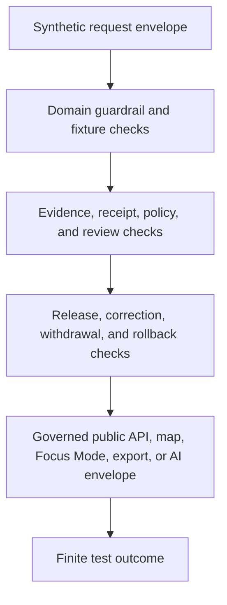

<!-- [KFM_META_BLOCK_V2]
doc_id: kfm://doc/tests-e2e-readme
title: End-to-End Tests README
type: test-root-readme
version: v0.1
status: draft; greenfield-stub-replaced; e2e-test-parent-index; PROPOSED / NEEDS VERIFICATION before promotion
owners:
  - OWNER_TBD - QA steward
  - OWNER_TBD - E2E test steward
  - OWNER_TBD - Governed API steward
  - OWNER_TBD - Domain stewards
  - OWNER_TBD - Evidence steward
  - OWNER_TBD - Policy steward
  - OWNER_TBD - Release steward
  - OWNER_TBD - Map/UI steward
created: NEEDS VERIFICATION - greenfield stub existed before v0.1 expansion
updated: 2026-07-06
policy_label: public-doc; tests; e2e; parent-index; no-network-default; governed-composition; trust-membrane; public-surface-boundary; evidence-bound; policy-gated; release-gated; rollback-aware
tags: [kfm, tests, e2e, end-to-end, governed-api, map-ui, focus-mode, release-gate, correction, withdrawal, rollback, no-network, EvidenceBundle, EvidenceRef, PolicyDecision, ReviewRecord, ReleaseManifest, RollbackCard, ABSTAIN, DENY, ERROR]
related:
  - ../README.md
  - ../domains/README.md
  - agriculture/README.md
  - ../domains/agriculture/README.md
  - ../../docs/runbooks/agriculture/NO_NETWORK_TEST_RUNBOOK.md
  - ../../docs/domains/agriculture/DATA_LIFECYCLE.md
  - ../../docs/domains/agriculture/API_CONTRACTS.md
  - ../../docs/doctrine/directory-rules.md
  - ../../fixtures/domains/
  - ../../contracts/domains/
  - ../../schemas/contracts/v1/domains/
  - ../../policy/domains/
  - ../../release/
notes:
  - "This README replaces the greenfield stub at tests/e2e/README.md."
  - "This directory is the parent index for end-to-end tests; it is not source, contract, schema, fixture, policy, evidence, proof, receipt, release, public artifact, map, API, package, pipeline, or AI authority."
  - "Confirmed child README lane at authoring time is agriculture/README.md. Other lanes are PROPOSED until files and executable tests are verified."
  - "E2E tests verify governed composition across released or synthetic envelopes; they must not bypass the trust membrane."
  - "Executable E2E tests, service harnesses, fixtures, validators, CI jobs, pass rates, and public-surface invalidation remain NEEDS VERIFICATION."
[/KFM_META_BLOCK_V2] -->

<a id="top"></a>

# End-to-end tests

> Parent index for KFM end-to-end test lanes under `tests/e2e/`. E2E tests should prove governed composition across request envelopes, domain guardrails, evidence, policy, release state, public surfaces, correction, withdrawal, and rollback without becoming publication approval or source truth.

<p>
  
  
  
  
  
</p>

**Path:** `tests/e2e/README.md`  
**Status:** draft / greenfield stub replaced / E2E test parent index / PROPOSED until executable coverage is verified  
**Owning root:** `tests/`  
**Lane family:** `e2e`  
**Default execution posture:** deterministic, synthetic, no-network, public-safe fixtures only  
**Truth posture:** CONFIRMED target file existed as a greenfield stub before replacement; CONFIRMED `tests/README.md` defines `tests/` as enforceability proof for the KFM trust spine; CONFIRMED `tests/e2e/agriculture/README.md` exists as a child E2E lane; NEEDS VERIFICATION for full E2E child inventory, executable tests, service harnesses, fixtures, CI coverage, pass rates, and public-surface invalidation.

---

## Purpose

`tests/e2e/` is the parent lane for composed end-to-end tests.

E2E tests should verify that a complete governed flow behaves as expected across multiple roots: request envelope, domain expectations, source-role preservation, schema and contract checks, EvidenceRef resolution, policy decision, review state, release manifest, public API or map envelope, correction state, withdrawal state, rollback target, and final finite outcome.

A passing E2E test should not mean that a claim is true, current, public, legally authoritative, operationally safe, or released. It should mean only that the scoped end-to-end guardrail behaved as expected against bounded synthetic fixtures and local files.

---

## Placement Basis

Directory Rules and the root `tests/` README place enforceability proof under `tests/`. End-to-end tests belong here only when they test governed composition across responsibility roots. They must not become a shortcut around the trust membrane.

| Responsibility | Correct home | This directory's relationship |
|---|---|---|
| E2E test parent index | `tests/e2e/README.md` | This file. |
| Domain E2E lanes | `tests/e2e/<domain>/` | Child lanes indexed here. |
| Domain tests | `tests/domains/<domain>/` | Upstream guardrails; E2E should compose, not duplicate. |
| Fixtures | `fixtures/domains/<domain>/` or approved synthetic fixture homes | Referenced by E2E tests; not copied here by default. |
| Contracts and schemas | `contracts/`, `schemas/` | Tested through expectations; not authored here. |
| Evidence, receipts, policy, release | `data/proofs/`, `data/receipts/`, `policy/`, `release/` | Referenced through safe fixture refs; not stored or decided here. |
| Public surfaces | Governed API, map, tile, artifact, and UI roots | Exercised only through safe mocked or released envelopes. |

> [!IMPORTANT]
> E2E tests may exercise a governed path. They may not use direct source side effects, internal stores, unpublished candidates, production public stores, or runtime output as authority.

---

## Parent Invariant

> **E2E tests prove governed composition; they do not publish, approve, or create truth.**

All child E2E lanes should preserve these checks:

| Check | Required behavior | Failure outcome |
|---|---|---|
| Trust membrane boundary | Flow does not read pre-public lifecycle stores, internal stores, unpublished candidates, or runtime outputs as public truth. | validation failure / `ERROR`. |
| Governed interface boundary | Flow uses governed envelopes, release-safe fixtures, or mocks that preserve public API and runtime contracts. | validation failure. |
| Domain boundary | E2E tests compose domain guardrails and do not redefine contracts, schemas, source roles, policy, evidence, release, or object meaning. | promotion block. |
| Evidence boundary | Claims that depend on evidence require EvidenceRef-to-EvidenceBundle support or fail closed. | `ABSTAIN`. |
| Policy boundary | Rights, sensitivity, legal status, review, and release uncertainty fail closed. | `DENY` / `ABSTAIN`. |
| Release boundary | E2E success does not become ReleaseManifest approval, publication, correction approval, withdrawal approval, or rollback approval. | promotion block. |
| Public-surface boundary | Public API, map, tile, Focus Mode, export, and AI carriers return finite governed outcomes and do not overstate confidence. | `DENY` / `ABSTAIN` / `ERROR`. |
| Correction and rollback boundary | Corrections, withdrawals, invalidations, and rollback targets stay explicit and auditable. | validation failure. |
| No-network boundary | Default E2E tests do not call live feeds, graph databases, geocoders, map services, public APIs, release services, or AI runtimes. | validation failure / `ERROR`. |

---

## Confirmed E2E Lane Index

| E2E lane | Status observed | Purpose | Boundary |
|---|---|---|---|
| [`agriculture/`](agriculture/README.md) | CONFIRMED README / executable tests NEEDS VERIFICATION | Verifies public-safe Agriculture flows across request envelopes, aggregation, evidence, policy, release, correction, rollback, governed API, map, Focus Mode, and AI boundaries. | Does not publish Agriculture data, approve release, prove field/operator truth, or make aggregate cells per-place truth. |

At authoring time, `agriculture/` is the only confirmed child README lane under `tests/e2e/`.

---

## Proposed Future E2E Lanes

These are backlog signposts only. They are not implementation claims.

| Lane | Status | Purpose |
|---|---|---|
| `archaeology/` | PROPOSED | Would test public-safe archaeology request flows with review-gated detail handling. |
| `atmosphere/` | PROPOSED | Would test atmosphere/air governed API, unit, time, evidence, and policy outcomes. |
| `fauna/` | PROPOSED | Would test fauna observation, release, map, and public UI boundaries. |
| `flora/` | PROPOSED | Would test botanical source, sensitivity, temporal, release, map, and AI boundaries. |
| `geology/` | PROPOSED | Would test public-safe geology, wells, rights, catalog, Focus Mode, and map/API boundaries. |
| `habitat/` | PROPOSED | Would test habitat, land cover, ecoregions, restoration, release, and map/API boundaries. |
| `hydrology/` | PROPOSED | Would test hydrology source-role, temporal, redaction, policy, release, public API, and map boundaries. |
| `people-dna-land/` | PROPOSED | Would test consent, privacy, genealogy, land, graph, redaction, and release fail-closed flows. |
| `roads-rail-trade/` | PROPOSED | Would test transport public surfaces, legal-status denial, historic precision, evidence, release, and rollback. |
| `settlements-infrastructure/` | PROPOSED | Would test settlement/infrastructure identity, sensitivity, public-surface, release, correction, and rollback flows. |
| `soil/` | PROPOSED | Would test soil public-safe layer/API flows, support-type boundaries, evidence, policy, release, and rollback. |
| `cross-domain/` | PROPOSED | Would test explicitly governed cross-domain flows only when each participating domain has a mature local lane. |

---

## E2E Flow


```mermaid
flowchart TD
  A["Synthetic request envelope"] --> B["Domain guardrail and fixture checks"]
  B --> C["Evidence, receipt, policy, and review checks"]
  C --> D["Release, correction, withdrawal, and rollback checks"]
  D --> E["Governed public API, map, Focus Mode, export, or AI envelope"]
  E --> F["Finite test outcome"]
```

The diagram describes intended test responsibility only. It does not prove that executable tests, validators, fixtures, service harnesses, policy runtime, release jobs, public invalidation hooks, map behavior, AI behavior, or CI jobs currently exist.

---

## Accepted Inputs

Only bounded, synthetic, reviewable inputs belong in default E2E tests:

- synthetic request and response envelopes with fake refs and finite outcomes
- synthetic fixture refs from approved domain fixture homes
- synthetic SourceDescriptor, EvidenceRef, EvidenceBundle stub, receipt, PolicyDecision, ReviewRecord, ReleaseManifest, CorrectionNotice, WithdrawalNotice, and RollbackCard refs
- synthetic public-safe API, layer, feature, tile, map, Focus Mode, export, and AI citation envelopes
- canary values that make trust-membrane bypass, source-role collapse, identity collapse, time collapse, legal-status overclaiming, restricted-detail exposure, graph-truth leakage, map-truth leakage, AI leakage, public export leakage, or release approval obvious
- local validation reports emitted by test helpers

---

## Exclusions

Do not place these materials in `tests/e2e/` or its default child lanes:

| Excluded material | Why it does not belong here |
|---|---|
| Real source exports, live feeds, geocoder responses, legal-status records, private datasets, or public payloads | Default E2E tests must stay synthetic, deterministic, and no-network. |
| Direct reads from pre-public lifecycle stores, internal stores, unpublished candidates, runtime outputs, or production public stores | Bypasses the trust membrane and public release gates. |
| Secrets, credentials, private endpoint details, production logs, or production telemetry | Security and exposure risk. |
| Real EvidenceBundles, ProofPacks, production receipts, release manifests, rollback cards, correction notices, withdrawal notices, public artifacts, or audit ledgers | Governed trust records and release artifacts belong in their own roots. |
| Binding policy rules, schema definitions, contract prose, source descriptors, release procedures, graph implementation, map implementation, API implementation, or AI runtime implementation | Authority and implementation belong in their own responsibility roots. |
| Public map layers, tiles, screenshots, exports, Focus Mode outputs, AI context packets, or public API payloads | Publication requires governed release. |

---

## Suggested Layout

```text
tests/e2e/
|-- README.md
|-- agriculture/
|   `-- README.md
|-- archaeology/
|-- atmosphere/
|-- fauna/
|-- flora/
|-- geology/
|-- habitat/
|-- hydrology/
|-- people-dna-land/
|-- roads-rail-trade/
|-- settlements-infrastructure/
|-- soil/
`-- cross-domain/
```

Only `agriculture/` is confirmed as an authored child README lane at the time this README was created. Other directories are PROPOSED until files and executable tests exist.

---

## Run Posture

No repository-wide E2E runner was verified while authoring this README. Once E2E tests exist and are wired into CI, expected commands should be documented by this file and by each child lane.

```bash
: "PROPOSED / NEEDS VERIFICATION"
pytest tests/e2e
```

Required run posture: no network access, no live service calls, no direct lifecycle-store reads, no real secrets, no production logs, no production trust artifacts, no sensitive geometry, no public artifact writes, deterministic fixture inputs, and finite outcomes only: `PASS`, `DENY`, `ABSTAIN`, or `ERROR`.

---

## Evidence Ledger

| Source | Status | Supports | Limits |
|---|---|---|---|
| `Directory Rules.pdf` and repo directory-rule docs | CONFIRMED doctrine | `tests/` is the enforceability root; E2E tests belong under a test responsibility lane, not as authority roots. | Does not prove executable E2E tests, fixtures, CI, or pass rates. |
| `tests/README.md` | CONFIRMED repo evidence | Defines `tests/` as enforceability proof for the trust spine from source admission through release, correction, and rollback. | The README marks implementation, runners, workflows, and coverage as PROPOSED / NEEDS VERIFICATION. |
| `tests/e2e/agriculture/README.md` | CONFIRMED child lane README | Agriculture E2E lane exists and defines no-network, aggregate-only, evidence, policy, release, correction, rollback, governed API, map, Focus Mode, and AI boundaries. | Does not prove executable E2E tests exist. |
| `tests/domains/README.md` | CONFIRMED repo evidence | Domain tests parent index exists and separates domain guardrails from authority roots. | Domain tests are upstream to E2E but do not prove E2E composition. |
| GitHub target file before update | CONFIRMED repo evidence | `tests/e2e/README.md` existed as a greenfield stub before replacement. | Stub did not provide lane guidance or executable coverage. |

---

## Validation Checklist

- [ ] Confirm full child-directory inventory for `tests/e2e/` with a mounted repo or repository tree listing.
- [ ] Confirm accepted E2E harness pattern and fixture homes.
- [ ] Confirm schemas for request envelope, response envelope, EvidenceRef, EvidenceBundle stub, receipts, PolicyDecision, ReviewRecord, ReleaseManifest, CorrectionNotice, WithdrawalNotice, and RollbackCard refs.
- [ ] Confirm source-role, identity, time-kind, evidence, receipt, policy, review, release, correction, withdrawal, rollback, public-surface, finite outcome, and reason-code vocabularies.
- [ ] Add executable tests only after child lanes have safe fixtures and no-network harnesses.
- [ ] Confirm tests do not use real source feeds, live systems, secrets, production logs, production trust artifacts, sensitive geometry, direct lifecycle-store reads, or public artifact writes.
- [ ] Wire the E2E lane into CI only after executable tests and safe fixtures exist.

---

## Rollback

Rollback is required if this E2E parent index starts to store real source data, trust-bearing records, production release records, public artifacts, secrets, production logs, binding policy, contract/schema authority, graph implementation, map implementation, API implementation, AI runtime behavior, or direct public outputs instead of documenting and testing boundaries.

Rollback is also required if this lane treats an E2E pass as source truth, legal status, public access, current-status proof, graph truth, map truth, AI truth, release approval, correction approval, withdrawal approval, or rollback approval.

Rollback target: restore the previous safe README revision or remove this parent index until child lane inventory, fixtures, schemas, source-role handling, evidence expectations, policy expectations, release relationship, correction behavior, rollback behavior, public-surface invalidation, and CI integration are reverified.

[Back to top](#top)