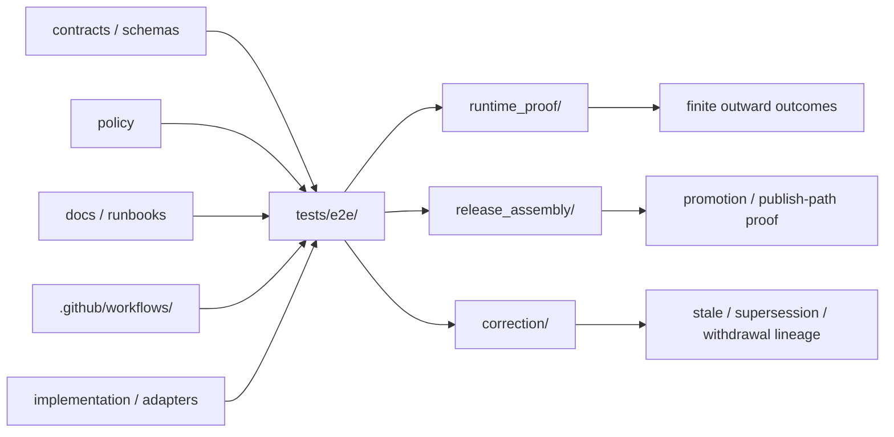

<!-- [KFM_META_BLOCK_V2]
doc_id: kfm://doc/NEEDS-VERIFICATION
title: tests/e2e
type: standard
version: v1
status: draft
owners: @bartytime4life
created: NEEDS-VERIFICATION
updated: NEEDS-VERIFICATION
policy_label: NEEDS-VERIFICATION
related: [
  ./README.md,
  ../README.md,
  ../contracts/README.md,
  ../integration/README.md,
  ../policy/README.md,
  ../reproducibility/README.md,
  ../accessibility/README.md,
  ../ci/README.md,
  ../catalog/README.md,
  ../validators/README.md,
  ./runtime_proof/README.md,
  ./release_assembly/README.md,
  ./correction/README.md,
  ../../contracts/README.md,
  ../../schemas/README.md,
  ../../schemas/contracts/README.md,
  ../../docs/README.md,
  ../../.github/CODEOWNERS,
  ../../.github/workflows/README.md,
  ../../CONTRIBUTING.md
]
tags: [kfm, tests, e2e, verification, runtime, release, correction]
notes: [
  Current surfaced repo-facing evidence proves the three documented leaf families and their README presence, but not executable suite depth or merge-blocking automation.
  Owners are grounded in surfaced `/tests/` CODEOWNERS coverage; doc_id, created date, policy label, and exact local-branch history still need direct repo verification.
  This revision preserves the existing leaf-led `tests/e2e/` doctrine while tightening burden boundaries, adjacent-lane placement rules, and GitHub readability.
]
[/KFM_META_BLOCK_V2] -->

<a id="top"></a>

# `tests/e2e/`

End-to-end proof surface for **KFM runtime outcomes**, **release assembly**, and **correction lineage**.

> [!NOTE]
> **Status:** `experimental`  
> **Owners:** `@bartytime4life`  
> **Path:** `tests/e2e/README.md`  
> **Repo fit:** governed whole-path verification umbrella inside `tests/`; downstream of root contract, schema, policy, docs, and workflow boundaries; upstream of the visible leaf families `runtime_proof/`, `release_assembly/`, and `correction/`.  
> **Quick jumps:** [Scope](#scope) · [Repo fit](#repo-fit) · [Accepted inputs](#accepted-inputs) · [Exclusions](#exclusions) · [Evidence posture](#evidence-posture) · [Directory tree](#directory-tree) · [Quickstart](#quickstart) · [Usage](#usage) · [Diagram](#diagram) · [Operating tables](#operating-tables) · [Task list / definition of done](#task-list--definition-of-done) · [FAQ](#faq) · [Appendix](#appendix)


> [!IMPORTANT]
> `tests/e2e/` is not a generic “important tests” bucket.  
> In KFM, this lane exists to prove that the **governed path still holds together** across contracts, policy, validators, receipts, proofs, correction state, and outward trust-visible behavior.

---

## Scope

`tests/e2e/` is the **whole-path proof family** for KFM behavior that is consequential enough to require more than local helper checks, contract validation, or policy-only assertions.

This directory exists to keep three burdens visibly separate:

1. **Request-time runtime proof**  
   Does evidence resolution still produce the right bounded outward outcome?

2. **Release / promotion proof**  
   Does publish-path assembly still yield complete, reviewable release evidence?

3. **Correction / supersession proof**  
   Does stale state, withdrawal, or replacement lineage remain visible instead of being silently erased?

KFM doctrine treats these as distinct because runtime trust, release proof, and correction lineage are not interchangeable layers.

[Back to top](#top)

---

## Repo fit

### Upstream authority surfaces

| Surface | Why it matters here | Posture |
| --- | --- | --- |
| [`../README.md`](../README.md) | parent `tests/` family map and top-level verification boundary | **CONFIRMED surfaced repo-facing doc** |
| [`../../contracts/README.md`](../../contracts/README.md) | contract meaning stays authoritative outside `e2e/` | **CONFIRMED surfaced adjacent root surface** |
| [`../../schemas/README.md`](../../schemas/README.md) | machine-shape authority and schema-home discussion stay upstream | **CONFIRMED surfaced adjacent root surface** |
| [`../../schemas/contracts/README.md`](../../schemas/contracts/README.md) | schema-side contract subtree shapes adjacent expectations | **CONFIRMED surfaced adjacent root surface** |
| [`../../policy/README.md`](../../policy/README.md) | allow / deny / abstain logic remains policy-owned | **CONFIRMED surfaced adjacent root surface** |
| [`../../docs/README.md`](../../docs/README.md) | runbooks and operator prose are adjacent, not executable proof | **CONFIRMED surfaced adjacent root surface** |
| [`../../.github/workflows/README.md`](../../.github/workflows/README.md) | workflow intent matters, but does not by itself prove merge-blocking execution | **CONFIRMED surfaced adjacent workflow boundary** |

### Downstream leaf families

| Leaf | Primary burden | Current surfaced meaning |
| --- | --- | --- |
| [`./runtime_proof/`](./runtime_proof/) | request-time outward outcomes | bounded runtime outcomes and trust-visible response behavior |
| [`./release_assembly/`](./release_assembly/) | promotion / publish-path completeness | release-bearing proof, receipts, manifests, and publish-path reviewability |
| [`./correction/`](./correction/) | correction lineage | stale state, supersession, withdrawal, rollback, and visible correction context |

### Lateral test families that often absorb over-scoped cases

| Surface | When it is the better home |
| --- | --- |
| [`../contracts/README.md`](../contracts/README.md) | schema or envelope drift is the main risk |
| [`../policy/README.md`](../policy/README.md) | allow / deny / abstain logic is the main risk |
| [`../validators/README.md`](../validators/README.md) | gate behavior matters, but not the full outward chain |
| [`../ci/README.md`](../ci/README.md) | renderer or reviewer-summary formatting is the main burden |
| [`../catalog/README.md`](../catalog/README.md) | metadata closure is the main burden |
| [`../integration/README.md`](../integration/README.md) | a real seam matters, but full end-to-end proof would be inflated |
| [`../accessibility/README.md`](../accessibility/README.md) | inspectability, keyboard, motion, or contrast are the main risk |
| [`../reproducibility/README.md`](../reproducibility/README.md) | rerun sameness, stable digests, or bounded rebuild drift are the main question |

[Back to top](#top)

---

## Accepted inputs

This lane should accept **small, explicit, reviewable** materials that prove whole-path behavior without turning `tests/e2e/` into a second authority surface.

| Input class | Examples | Why it belongs here |
| --- | --- | --- |
| Whole-path request fixtures | `request.json`, expected outward decision fragments, expected envelope fragments, expected drawer fragments | prove bounded runtime behavior across real trust seams |
| Release-bearing review artifacts | review payloads, decision receipts, manifest existence checks, proof-linkage checks | prove publish-path completeness rather than just validator success |
| Correction-lineage fixtures | stale-visible cases, withdrawal cases, supersession cases, rollback-facing references | keep correction visible and inspectable |
| Minimal emitted comparison artifacts | `actual.response.json` or equivalent review outputs when explicitly documented | support reviewer comparison without silently replacing checked-in truth |
| Thin orchestration cases | Makefile or script-driven smoke slices that assert the right reviewable outputs exist | make whole-path behavior runner-visible |
| Small public-safe fixtures | tiny, deterministic, reviewable data fragments | keep diffs legible and safe to clone |

### Input rules

1. Keep every case **small enough to review in one diff**.
2. Prefer **burden-led** cases over tool-led cases.
3. Keep **finite outcomes** visible when runtime behavior is involved.
4. Keep **receipts** and **proofs** distinct in naming and expectations.
5. Use emitted actuals as **review artifacts**, not default checked-in truth.
6. If a case mainly proves structure, policy, rendering, or catalog closure, move it to the family that owns that burden.
7. Keep negative-path behavior explicit; do not polish away `ABSTAIN`, `DENY`, or `ERROR`.

[Back to top](#top)

---

## Exclusions

`tests/e2e/` is intentionally narrow. It should not become the silent authority home for concerns already owned elsewhere.

| Does **not** belong here | Put it here instead | Why |
| --- | --- | --- |
| Canonical schemas or contract meaning | [`../../contracts/README.md`](../../contracts/README.md), [`../../schemas/README.md`](../../schemas/README.md) | `e2e` proves behavior; it does not define authority |
| Policy bundle source files or policy authorship | [`../../policy/README.md`](../../policy/README.md) | policy stays reviewable as policy |
| Validator-only behavior | [`../validators/README.md`](../validators/README.md) | narrower proof is more honest when whole-path proof is unnecessary |
| Reviewer-summary rendering logic | [`../ci/README.md`](../ci/README.md) | rendering is adjacent, not primary, here |
| Catalog-helper-only closure | [`../catalog/README.md`](../catalog/README.md) | closure alone does not make a case end to end |
| Accessibility-only trust-surface checks | [`../accessibility/README.md`](../accessibility/README.md) | accessibility remains first-class, not incidental |
| Reproducibility-only checks | [`../reproducibility/README.md`](../reproducibility/README.md) | rerun sameness is its own burden |
| Runbooks, release notes, or operator prose | [`../../docs/README.md`](../../docs/README.md) | documentation is not executable proof |
| Canonical storage of receipts, proofs, manifests, or release artifacts | owning data / release surfaces | `e2e` should assert them, not become their warehouse |
| Generic browser smoke tests | `integration/` or other narrower families | “browser = e2e” is too weak for KFM’s trust model |

[Back to top](#top)

---

## Evidence posture

### Current surfaced truth

The strongest repo-facing evidence available for this revision comes from surfaced KFM repo-facing Markdown, not from a mounted local checkout.

**CONFIRMED from surfaced repo-facing docs**
- `tests/e2e/` is a real documented family.
- The visible leaf families are `correction/`, `release_assembly/`, and `runtime_proof/`.
- Each visible leaf currently exposes `README.md` in the surfaced public tree.
- The leaf meanings are not identical: runtime, release, and correction burdens are intentionally split.
- `/tests/` ownership resolves to `@bartytime4life` in surfaced repo-facing docs.
- `.github/workflows/` is documented as a README-bearing workflow boundary, but checked-in YAML inventory is still not proven from the surfaced public tree.

**INFERRED**
- The branch treats whole-path proof as distinct from contract, policy, validator, CI-rendering, reproducibility, and accessibility proof.
- Burden-led placement is already the project’s direction, even where executable depth is still thin.

**PROPOSED**
- Additional `cases/` and `fixtures/` subtrees inside the existing three leaf families.
- Domain- or lane-specific runtime-proof leaves under `runtime_proof/`.
- Small executable smoke and subject-specific runtime-proof expansions as the branch proves them.

**UNKNOWN / NEEDS VERIFICATION**
- Exact local runner or toolchain.
- Required checks and branch-protection settings.
- Exact executable case depth in each family.
- Screenshot baseline inventory.
- Whether any whole-path cases are currently merge-blocking.
- Exact emitted artifact family names on the active branch.

> [!CAUTION]
> Do not upgrade directory presence into coverage maturity.  
> In KFM, a documented lane is valuable, but it is not the same thing as proved, mounted, blocking execution depth.

[Back to top](#top)

---

## Directory tree

### Current surfaced snapshot

```text
tests/
└── e2e/
    ├── correction/
    │   └── README.md
    ├── release_assembly/
    │   └── README.md
    ├── runtime_proof/
    │   └── README.md
    └── README.md
```

### Design rule

Keep `tests/e2e/` **leaf-led**.

When real executable cases arrive, prefer adding them inside the existing visible families before inventing a second taxonomy at the same level.

### PROPOSED maturity direction

```text
tests/e2e/
├── correction/
│   ├── README.md
│   ├── cases/
│   └── fixtures/
├── release_assembly/
│   ├── README.md
│   ├── cases/
│   └── fixtures/
├── runtime_proof/
│   ├── README.md
│   ├── cases/
│   ├── fixtures/
│   └── <domain-or-lane-leaves>/
└── README.md
```

### Reading rule

Use the first tree for **current surfaced truth**.

Use the second tree as **growth direction**, not as a claim about the current branch.

[Back to top](#top)

---

## Quickstart

### Safe inspection commands

These commands are inspection-first. They verify what is present without assuming `pytest`, Playwright, Vitest, Cypress, Jest, or any other runner that the checked-out branch has not itself proven.

```bash
# inspect the current local e2e inventory
find tests/e2e -maxdepth 5 -type d 2>/dev/null | sort
find tests/e2e -maxdepth 5 -type f 2>/dev/null | sort

# re-read the tests family map before moving or adding cases
sed -n '1,260p' tests/README.md 2>/dev/null || true
sed -n '1,220p' tests/contracts/README.md 2>/dev/null || true
sed -n '1,220p' tests/policy/README.md 2>/dev/null || true
sed -n '1,220p' tests/validators/README.md 2>/dev/null || true
sed -n '1,220p' tests/ci/README.md 2>/dev/null || true
sed -n '1,220p' tests/catalog/README.md 2>/dev/null || true
sed -n '1,220p' tests/integration/README.md 2>/dev/null || true
sed -n '1,220p' tests/reproducibility/README.md 2>/dev/null || true
sed -n '1,220p' tests/accessibility/README.md 2>/dev/null || true
sed -n '1,220p' tests/unit/README.md 2>/dev/null || true

# inspect visible e2e leaf docs
sed -n '1,220p' tests/e2e/runtime_proof/README.md 2>/dev/null || true
sed -n '1,220p' tests/e2e/release_assembly/README.md 2>/dev/null || true
sed -n '1,220p' tests/e2e/correction/README.md 2>/dev/null || true

# inspect ownership and workflow adjacency
sed -n '1,220p' .github/CODEOWNERS 2>/dev/null || true
find .github/workflows -maxdepth 2 -type f 2>/dev/null | sort
sed -n '1,260p' .github/workflows/README.md 2>/dev/null || true

# search for trust-bearing vocabulary before inventing new names
grep -RIn \
  -e 'EvidenceBundle' \
  -e 'RuntimeResponseEnvelope' \
  -e 'ReviewRecord' \
  -e 'ReleaseManifest' \
  -e 'ReleaseProofPack' \
  -e 'CorrectionNotice' \
  -e 'run_receipt' \
  -e 'ai_receipt' \
  -e 'receipt_ref' \
  -e 'proof_ref' \
  -e 'ABSTAIN' \
  -e 'DENY' \
  -e 'ERROR' \
  -e 'stale' \
  tests contracts policy schemas docs .github data tools scripts 2>/dev/null || true
```

### First local review pass

1. Confirm whether the checked-out branch still matches the surfaced `tests/e2e/` shape.
2. Confirm which visible leaf families contain executable cases versus README-only scaffolding.
3. Confirm the actual runner or toolchain before documenting any command.
4. Confirm whether the case is honestly whole-path proof or belongs in `integration/`, `contracts/`, `policy/`, `validators/`, `ci/`, `catalog/`, `accessibility/`, or `reproducibility/`.
5. Confirm whether fail-closed behavior is asserted, not just happy-path success.
6. Confirm whether runtime, release, and correction cases preserve receipts, proofs, review state, rollback posture, and outward trust cues where relevant.

> [!TIP]
> Inspection-first is safer than guessed confidence. Do not add runner claims just because a path “looks like pytest” or “feels like Playwright.”

[Back to top](#top)

---

## Usage

### What `tests/e2e/` is

`tests/e2e/` is:

- the whole-path proof surface for trust-bearing KFM behavior
- the family where request-time runtime outcomes, release assembly, and correction lineage should remain inspectable
- the place where fail-closed behavior must stay visible instead of being polished away
- the outer verification boundary before a case becomes release evidence or operator-facing doctrine
- the lane that should prove the governed path still holds together across contracts, policy, validators, receipts, proofs, review state, and outward trust cues

### What `tests/e2e/` is not

`tests/e2e/` is **not**:

- a generic browser smoke folder
- a substitute home for contract law, policy bundles, or canonical schemas
- a substitute home for validator-only or renderer-only proof
- proof that merge-blocking automation exists
- a catch-all for any test that “feels important”
- a place to hide broad uncertainty behind a single green status

### Where a new case belongs

| If the main question is… | Best home | Why |
| --- | --- | --- |
| Does request-time evidence resolution still produce the right outward outcome? | [`./runtime_proof/`](./runtime_proof/) | runtime outcome is the primary burden |
| Does promotion / release assembly still produce complete, reviewable proof? | [`./release_assembly/`](./release_assembly/) | release-bearing completeness is the primary burden |
| Does correction / supersession / withdrawal still preserve lineage and visible state? | [`./correction/`](./correction/) | correction is the primary burden |
| Does a validator or gate behave correctly, but without the full outward chain? | [`../validators/README.md`](../validators/README.md) | keep validator proof smaller when whole-path proof is not needed |
| Does a review or summary helper render correctly? | [`../ci/README.md`](../ci/README.md) | rendering proof is a different burden |
| Does catalog closure align? | [`../catalog/README.md`](../catalog/README.md) | metadata closure alone does not automatically mean e2e |
| Does a real seam hold, but without full runtime / release / correction sweep? | [`../integration/README.md`](../integration/README.md) | smaller honest proof beats inflated e2e scope |
| Is the main risk contract or schema drift? | [`../contracts/README.md`](../contracts/README.md) | structure validation should stay explicit |
| Is the main risk allow / deny / abstain logic? | [`../policy/README.md`](../policy/README.md) | policy should remain reviewable as policy |
| Is the main risk accessibility of the trust surface? | [`../accessibility/README.md`](../accessibility/README.md) | accessibility is a first-class family |
| Is the main risk rerun sameness or bounded rebuild drift? | [`../reproducibility/README.md`](../reproducibility/README.md) | reproducibility is its own proof burden |

### Naming guidance

Prefer **burden-led** names over tool-led names.

```text
runtime_proof.citation_negative.abstain.test.*
runtime_proof.evidence_missing.error.test.*
runtime_proof.air.pm25.review_record_visibility.test.*
release_assembly.proof_pack.complete.test.*
release_assembly.publish_path.rollback_ready.test.*
correction.supersession.stale_visible.test.*
correction.withdrawal.public_notice.test.*
```

### De-escalation rule

A case does **not** become better just because it sits under `e2e/`.

If the smallest honest proof is a local helper, a contract example, a policy fixture, or a real-boundary slice that stops short of full runtime / release / correction proof, move it outward to the family that owns that burden.

[Back to top](#top)

---

## Diagram


```mermaid
flowchart LR
  C["contracts / schemas"] --> E["tests/e2e/"]
  P["policy"] --> E
  D["docs / runbooks"] --> E
  W[".github/workflows/"] --> E
  I["implementation / adapters"] --> E

  E --> R["runtime_proof/"]
  E --> A["release_assembly/"]
  E --> X["correction/"]

  R --> O["finite outward outcomes"]
  A --> M["promotion / publish-path proof"]
  X --> L["stale / supersession / withdrawal lineage"]
```

[Back to top](#top)

---

## Operating tables

### Leaf family map

| Leaf family | Current surfaced contents | Primary burden | Must stay visible |
| --- | --- | --- | --- |
| `runtime_proof/` | `README.md` | request-time outward behavior | `ANSWER / ABSTAIN / DENY / ERROR`, trust-visible payloads, fail-closed behavior |
| `release_assembly/` | `README.md` | promotion / publish-path completeness | receipts vs proofs, release evidence, reviewable publication path |
| `correction/` | `README.md` | stale state, supersession, withdrawal, rollback-facing lineage | correction visibility, non-silent replacement, outward stale state |

### Adjacent signals that affect `e2e/` wording accuracy

| Surface | Current surfaced signal | Why `e2e/` has to care |
| --- | --- | --- |
| `tests/` family | broader `tests/` surface is no longer just README-only | `e2e/` should stop pretending all neighboring proof lanes are absent |
| `schemas/contracts/v1/` | visible runtime / release / correction / evidence / policy / source family structure is documented nearby | `e2e/` should consume machine-shape authority, not restate it |
| `.github/workflows/README.md` | workflow-lane boundary is documented, but YAML depth is still not proven here | `e2e/` must not imply blocking automation from documentation alone |
| watcher-boundary docs | surfaced watcher docs sharpen receipt-bearing automation language | `e2e/` should distinguish process memory from release proof |
| shell / Evidence Drawer doctrine | trust-visible state remains part of consequential whole-path proof | runtime cases should not stop at HTTP shape if trust-visible payload behavior is the real burden |

### Current safe claims vs unsafe claims

| Claim type | Safe now? | Why |
| --- | --- | --- |
| `tests/e2e/` exists as a documented family | Yes | surfaced repo-facing docs prove it |
| the three visible leaf families exist | Yes | surfaced repo-facing docs prove them |
| each visible leaf currently exposes `README.md` | Yes | surfaced repo-facing docs state that explicitly |
| runtime / release / correction are intentionally different burdens | Yes | surfaced repo-facing docs state that explicitly |
| exact runner / toolchain / required checks | No | not proven by surfaced evidence |
| executable depth inside each leaf | No | current surfaced evidence remains README-first |
| merge-blocking status | No | workflow documentation boundary is visible, enforcement is not |

[Back to top](#top)

---

## Task list / definition of done

A revision to `tests/e2e/README.md` is only useful if it stays both **truthful** and **placement-sharpening**.

### Definition of done

- [ ] The README states the canonical role of `tests/e2e/` in KFM-specific terms.
- [ ] Accepted inputs and exclusions are explicit.
- [ ] The three visible leaf families are named and differentiated.
- [ ] Current surfaced inventory is shown without exaggerating executable depth.
- [ ] Quickstart commands are inspection-first and toolchain-safe.
- [ ] Burden-led placement rules are explicit.
- [ ] Proposed growth is clearly labeled `PROPOSED` or `NEEDS VERIFICATION`.
- [ ] Adjacent authority surfaces are linked.
- [ ] The document does not imply merge-gate enforcement, mounted runner choice, or current suite depth that the branch has not proven.
- [ ] Nothing here silently turns `tests/e2e/` into a home for canonical schemas, policy bundles, or release artifact storage.

### Good next strengthening moves

1. Verify actual local branch inventory under all three leaf families.
2. Reconcile local runner reality with any documented commands.
3. Link confirmed executable cases when they exist.
4. Add leaf-local burden notes before inventing new top-level families.
5. Keep receipts, proofs, runtime responses, and correction records named distinctly.

[Back to top](#top)

---

## FAQ

### Is `tests/e2e/` the browser end-to-end folder?

No. In KFM, `e2e` is a **trust-bearing whole-path proof surface**, not a synonym for browser automation.

### Why split runtime, release, and correction?

Because they answer different questions:
- runtime asks whether outward request-time behavior is still bounded and trustworthy
- release asks whether promotion and publish-path proof is complete
- correction asks whether stale / superseded / withdrawn state remains visible

### Does this README prove blocking CI or required checks?

No. It documents the lane and gives safe inspection commands. Enforcement remains a separate verification question.

### Should every “important” test live here?

No. `e2e` is the expensive outer boundary. Use a smaller lane when a smaller lane tells the truth better.

### Can generated actuals live beside fixtures?

Only if the branch explicitly chooses that policy. The safer default is to treat emitted actuals as **review artifacts**, not canonical checked-in truth.

### When should a new top-level family be added under `tests/`?

Rarely. Strengthen an existing burden-led family first. Add a new top-level family only when there is a clearly different proof burden that cannot honestly live inside existing lanes.

[Back to top](#top)

---

## Appendix

<details>
<summary>Maintenance notes and review cautions</summary>

### Review caution

This README is intentionally strict about what it does **not** prove.

That is a feature, not a weakness:
- surfaced repo-facing docs are strong enough to define lane role and current visible family structure
- they are not strong enough to claim current runner selection, required checks, or mounted executable depth

### Suggested local audit before strengthening claims

```bash
# verify whether the local branch has moved beyond README-only leaf state
find tests/e2e/runtime_proof -maxdepth 5 -type f 2>/dev/null | sort
find tests/e2e/release_assembly -maxdepth 5 -type f 2>/dev/null | sort
find tests/e2e/correction -maxdepth 5 -type f 2>/dev/null | sort

# check whether branch-local docs or tests already prove real commands
grep -RIn \
  -e 'pytest' \
  -e 'playwright' \
  -e 'vitest' \
  -e 'cypress' \
  -e 'jest' \
  tests/e2e .github docs scripts tools 2>/dev/null || true
```

### Reading rule

Treat this README as:
- **current surfaced directory guidance** for lane role and placement
- **not** a substitute for local inspection before claiming implementation depth

</details>

[Back to top](#top)
