# `tests/e2e/agriculture/` — Governed Agriculture End-to-End Proof Lane

> Repository-grounded boundary for proving that public-safe Agriculture requests traverse governed interfaces, evidence, policy, aggregation, release, correction, and rollback controls without bypassing the KFM trust membrane or turning aggregate context into field, operator, parcel, or publication truth.

<!-- [KFM_META_BLOCK_V2]
doc_id: kfm://doc/tests-e2e-agriculture-readme
title: tests/e2e/agriculture/README.md — Governed Agriculture End-to-End Proof Lane
type: readme; directory-readme; domain-e2e-test-boundary; trust-spine-proof-index
version: v0.2
status: draft; repository-grounded; readme-only-direct-lane; no-executable-agriculture-e2e-suite-established
owners: OWNER_TBD — Agriculture domain steward · E2E test steward · QA steward · Governed API steward · Evidence steward · Policy steward · Release steward · Map/UI steward · Security reviewer · Docs steward
created: 2026-07-06
updated: 2026-07-16
supersedes: v0.1
policy_label: public-doctrine; tests; e2e; agriculture; no-network-default; synthetic-only; aggregate-only; governed-interface-only; evidence-bound; policy-gated; release-gated; correction-aware; rollback-aware; no-publication
current_path: tests/e2e/agriculture/README.md
truth_posture: CONFIRMED target README, parent tests/e2e README, canonical tests root, Agriculture domain test README, Agriculture test-fixture README, Agriculture lifecycle and API doctrine, Agriculture no-network runbook, representative absent direct E2E test paths, TODO-only e2e-smoke workflow, TODO-only domain-agriculture workflow, and Makefile test target limited to tests/schemas plus tests/contracts / PROPOSED minimum executable E2E case contract, deterministic harness, public aggregate and fail-closed scenario matrix, cross-lane authority checks, source-role and aggregation assertions, evidence-policy-release closure, correction/withdrawal/rollback invalidation, no-side-effect assertions, CI graduation gates, finite reason vocabulary, and promotion blocking / UNKNOWN exhaustive recursive lane inventory, generated or ignored files, dynamic pytest collection, approved E2E harness, canonical Agriculture E2E fixtures, actual governed API integration, public-surface adapters, test pass rates, coverage, deployment, and promotion dependency / NEEDS VERIFICATION owners, accepted runner, fixture manifest schema, audience vocabulary, reason codes, temporal rules, source-role vocabulary, synthetic release object schemas, network-denial mechanism, CI ownership, artifact retention, correction propagation, and rollback execution
evidence_snapshot:
  repository: bartytime4life/Kansas-Frontier-Matrix
  visibility: public
  base_ref: main
  base_commit: 30e4c9d1a2c890fc82db4f6c95554e5c9823d3c1
  target_prior_blob: 5b4c734b9b52112e8e6eac5aab325635566ca0c6
  related_repository_blobs:
    tests_root_readme: 5614de99433bca29d6a03d665fb4e00ec23eb5fb
    e2e_parent_readme: efbd7c6132a8920d6615c897a59b2b0009b5bdc9
    agriculture_domain_tests_readme: 35ebf2a578f2a39b4f4766cc4146aafde8124e67
    agriculture_test_fixtures_readme: 38438eaab819bf879157f2dbb147b63c12206372
    agriculture_lifecycle_doc: d90fb138141c4b6b56ac5940f15a7219d5637797
    agriculture_api_contracts_doc: b1d816abfea860ee19ad73d75d5c48321e08a7c2
    agriculture_no_network_runbook: 15a94c9f7a92f2f258a85200c7d49f01293fd10b
    e2e_smoke_workflow: df1130aa8a2e8dc255e97cf0a9ea7f66b8dd99e3
    domain_agriculture_workflow: a9f5f212ef61d72fdc209d9f8b173bbf87fb1803
    makefile: 4dc8cf633581893d83fba53219c6ea847992e6be
  direct_lane_files_confirmed:
    - tests/e2e/agriculture/README.md
  checked_absent_paths:
    - tests/e2e/agriculture/conftest.py
    - tests/e2e/agriculture/test_public_aggregate_flow.py
    - tests/e2e/agriculture/test_field_level_request_denies.py
    - tests/e2e/agriculture/test_agriculture_e2e_no_network.py
  bounded_search_note: repository code search surfaced this README but did not establish any of the ten proposed test modules named by v0.1; this is not proof against ignored, generated, historical, branch-local, dynamically collected, or external files
related:
  - ../README.md
  - ../../README.md
  - ../../domains/agriculture/README.md
  - ../../fixtures/domains/agriculture/README.md
  - ../../../fixtures/domains/agriculture/
  - ../../../docs/runbooks/agriculture/NO_NETWORK_TEST_RUNBOOK.md
  - ../../../docs/domains/agriculture/DATA_LIFECYCLE.md
  - ../../../docs/domains/agriculture/API_CONTRACTS.md
  - ../../../docs/domains/agriculture/CROSS_LANE.md
  - ../../../contracts/domains/agriculture/
  - ../../../schemas/contracts/v1/domains/agriculture/
  - ../../../schemas/contracts/v1/runtime/
  - ../../../schemas/contracts/v1/evidence/
  - ../../../schemas/contracts/v1/policy/
  - ../../../schemas/contracts/v1/release/
  - ../../../policy/domains/agriculture/
  - ../../../data/receipts/
  - ../../../data/proofs/
  - ../../../release/
  - ../../../apps/governed-api/
  - ../../../.github/workflows/e2e-smoke.yml
  - ../../../.github/workflows/domain-agriculture.yml
  - ../../../Makefile
notes:
  - "v0.2 replaces a planning-heavy scenario list with a commit-pinned account of the current README-only lane and its missing executable proof."
  - "Related Agriculture domain-test and fixture documentation exists, but executable Agriculture E2E coverage was not established."
  - "The e2e-smoke and domain-agriculture workflows are TODO-only echo scaffolds and cannot establish E2E, policy, proof, release, or publication behavior."
  - "The current Makefile test target runs tests/schemas and tests/contracts only; it does not establish Agriculture E2E collection."
  - "Agriculture public output is aggregate-only and release-gated by doctrine; field, operator, private parcel, proprietary yield, pesticide, crop-insurance, and sensitive joins fail closed."
  - "This revision changes documentation only and creates no tests, fixtures, harness, workflow behavior, data, receipt, proof, release, public artifact, or runtime side effect."
[/KFM_META_BLOCK_V2] -->

<a id="top"></a>

<p>
  
  
  
  
  
  
  
</p>

**Quick navigation:** [Status](#status-and-evidence-boundary) · [Purpose](#purpose) · [Authority](#authority-boundary) · [Current state](#confirmed-current-state) · [Agriculture invariants](#agriculture-invariants-under-test) · [Composition](#governed-e2e-composition-model) · [Scenario families](#required-scenario-families) · [Case contract](#minimum-e2e-case-contract) · [Interfaces](#governed-interface-and-trust-membrane-boundary) · [Evidence](#source-role-aggregation-evidence-and-citation) · [Policy](#policy-audience-rights-and-sensitivity) · [Time](#temporal-freshness-and-currentness) · [Cross-lane](#cross-lane-authority-preservation) · [Fixtures](#fixtures-canaries-and-test-data) · [Harness](#harness-network-security-and-determinism) · [Assertions](#assertions-finite-outcomes-and-side-effects) · [Correction](#correction-withdrawal-invalidation-and-rollback) · [CI](#runner-ci-and-promotion-boundary) · [Review](#review-burden) · [Directory map](#directory-map) · [Done](#definition-of-done) · [Open](#open-verification-register) · [Ledger](#evidence-ledger)

---

## Status and evidence boundary

> [!IMPORTANT]
> **Evidence snapshot:** `main@30e4c9d1a2c890fc82db4f6c95554e5c9823d3c1`  
> **Target blob before this revision:** `5b4c734b9b52112e8e6eac5aab325635566ca0c6`  
> **Direct lane:** `tests/e2e/agriculture/README.md` only at the bounded snapshot  
> **Representative checked-absent files:** `conftest.py`, `test_public_aggregate_flow.py`, `test_field_level_request_denies.py`, `test_agriculture_e2e_no_network.py`  
> **Workflow posture:** `e2e-smoke` and `domain-agriculture` execute `echo TODO ...` only  
> **Current Makefile collection:** `tests/schemas` and `tests/contracts`, not this lane

### Safe conclusion

`tests/e2e/agriculture/` is a documented Agriculture E2E boundary, but direct executable proof was not established.

- **CONFIRMED:** the README exists.
- **CONFIRMED:** the parent `tests/e2e/README.md` exists and now provides a composed-flow boundary.
- **CONFIRMED:** Agriculture domain-test and test-fixture READMEs exist.
- **CONFIRMED:** Agriculture doctrine requires aggregate-only public posture, evidence and policy closure, release gates, corrections, rollback, and no-network-first tests.
- **CONFIRMED:** the generic E2E and Agriculture workflows are TODO-only scaffolds.
- **CONFIRMED:** the current Makefile `test` target does not collect `tests/e2e/agriculture`.
- **PROPOSED:** executable Agriculture E2E tests should live here when their primary purpose is governed cross-root composition.
- **UNKNOWN:** full lane inventory, dynamic collection, harness implementation, current pass rates, coverage, and promotion dependency.
- **NEEDS VERIFICATION:** accepted fixture home, runner, reason vocabulary, network-denial mechanism, and CI ownership.

### Truth labels

| Label | Meaning |
|---|---|
| `CONFIRMED` | Verified from current repository files, bounded path checks, or current workflow definitions. |
| `PROPOSED` | A test or governance requirement not established as executable implementation. |
| `UNKNOWN` | Not proven by inspected repository, CI, runtime, or release evidence. |
| `NEEDS VERIFICATION` | Checkable but unresolved strongly enough to act as fact. |
| `DENY` | Disallowed because it bypasses a responsibility boundary, exposes sensitive material, or overstates maturity. |

### Maturity matrix

| Capability | Status | Evidence-bounded conclusion |
|---|---:|---|
| Agriculture E2E README | `CONFIRMED` | This boundary exists. |
| Direct Agriculture E2E modules | `NOT ESTABLISHED` | Bounded search and representative path checks found no executable modules. |
| Agriculture E2E `conftest.py` | `NOT FOUND AT CHECKED PATH` | No lane-local fixture/harness setup was established. |
| Agriculture domain-test documentation | `CONFIRMED DOCUMENTATION` | Domain child lanes and expected guardrails are documented. |
| Agriculture test-fixture documentation | `CONFIRMED DOCUMENTATION` | Canonical-versus-test-local fixture separation is documented. |
| Canonical fixture payload inventory | `UNKNOWN` | README presence does not prove payloads, schemas, or coverage. |
| E2E smoke workflow | `TODO-ONLY` | It checks out the repository and echoes TODO steps. |
| Agriculture workflow | `TODO-ONLY` | It echoes validation, proof, and dry-run TODO steps. |
| Makefile E2E target | `NOT ESTABLISHED` | The current `test` target runs only schema and contract tests. |
| Governed API harness | `UNKNOWN` | No Agriculture E2E process or in-process adapter was verified. |
| Network-denial enforcement | `UNKNOWN` | Doctrine requires it; executable enforcement was not established. |
| Promotion blocking | `UNKNOWN` | No verified gate depends on this lane. |
| Production or release use | `NOT ESTABLISHED` | Documentation and TODO workflows prove no operational release state. |

[Back to top](#top)

---

## Purpose

`tests/e2e/agriculture/` is the Agriculture domain segment for end-to-end **enforceability proof**.

Its purpose is to prove that a bounded synthetic request can traverse a governed path:

```text
synthetic request
  -> governed interface
  -> source-role and aggregation checks
  -> schema and contract expectations
  -> EvidenceRef resolution
  -> policy and audience decision
  -> release-state check
  -> public-safe response envelope
  -> correction / withdrawal / rollback invalidation
```

A passing test means the scoped control path behaved as expected. It does **not** mean:

- an Agriculture fact is true or current;
- a field condition is known;
- a crop, yield, irrigation, pesticide, insurance, parcel, operator, or ownership claim is public;
- an aggregate cell supports a per-field or per-place conclusion;
- a map layer, tile, export, Focus Mode, API response, or AI answer is released;
- an `EvidenceBundle`, `PolicyDecision`, `ReviewRecord`, `ReleaseManifest`, `CorrectionNotice`, or `RollbackCard` is operationally approved;
- the live system implements the same path;
- the test suite has release authority.

### Audience

- Agriculture domain and cross-lane stewards;
- E2E, QA, governed API, map/UI, evidence, policy, release, security, and accessibility reviewers;
- maintainers implementing a future deterministic Agriculture E2E harness;
- reviewers deciding whether a case belongs here, under `tests/domains/agriculture/`, or in another responsibility root.

[Back to top](#top)

---

## Authority boundary

This lane owns **test organization and enforceability assertions only**.

| Responsibility | Authority home | Relationship to this lane |
|---|---|---|
| Agriculture E2E test modules | `tests/e2e/agriculture/` | May live here when they test governed composition across roots. |
| Agriculture unit/domain guardrails | `tests/domains/agriculture/` | Composed by E2E; not duplicated unnecessarily. |
| Reusable Agriculture fixtures | `fixtures/domains/agriculture/` | Referenced; not mirrored by default. |
| Test-local wrappers or expectation maps | accepted test fixture lane | Allowed only when documented and non-authoritative. |
| Agriculture semantic meaning | `contracts/domains/agriculture/` | Tested; never authored here. |
| Machine shape | `schemas/contracts/v1/...` | Validated; never defined here. |
| Policy and admissibility | `policy/` | Exercised; never decided here. |
| Source descriptors and source activation | source registry | Referenced through synthetic IDs; never created here. |
| Lifecycle data | governed `data/` phase roots | Never read directly as the public path. |
| Receipts and proofs | `data/receipts/`, `data/proofs/` | Represented by synthetic refs or validated fixtures. |
| Release, correction, withdrawal, rollback | `release/` | Tested through synthetic state; never approved here. |
| Governed API implementation | `apps/governed-api/` | Exercised through verified test interfaces or adapters. |
| Map, UI, Focus Mode, export, AI implementation | accepted application/package roots | Exercised only through public-safe envelopes. |
| E2E CI orchestration | `.github/workflows/` after acceptance | May run the lane; does not change its authority. |

> [!CAUTION]
> An E2E test that reimplements policy, release logic, evidence resolution, or domain semantics is not stronger proof. It is a shadow authority and must be redesigned.

### Anti-collapse rules

This lane must not collapse:

- aggregate statistics into field or parcel truth;
- modeled vegetation or moisture context into observation;
- administrative records into ownership or title truth;
- context from Soil, Hydrology, Atmosphere, Habitat, Flora, Fauna, Geology, Hazards, or People/Land into Agriculture-owned authority;
- fixture refs into real receipts, proofs, or release decisions;
- a green test into publication approval;
- generated summaries into evidence;
- UI rendering into semantic or policy truth.

[Back to top](#top)

---

## Confirmed current state

### Direct lane inventory

```text
tests/e2e/agriculture/
└── README.md
```

This is a bounded result, not an exhaustive filesystem or history claim.

The following representative paths were checked and not found:

```text
tests/e2e/agriculture/conftest.py
tests/e2e/agriculture/test_public_aggregate_flow.py
tests/e2e/agriculture/test_field_level_request_denies.py
tests/e2e/agriculture/test_agriculture_e2e_no_network.py
```

Repository search also did not establish the remaining proposed v0.1 filenames as executable files.

### Adjacent verified surfaces

| Surface | Status | Relevance | Limit |
|---|---:|---|---|
| `tests/e2e/README.md` | `CONFIRMED DOCUMENTATION` | Parent E2E trust-membrane and composition boundary. | Does not prove a runner or child coverage. |
| `tests/domains/agriculture/README.md` | `CONFIRMED DOCUMENTATION` | Domain guardrail families and authority split. | Child implementation remains unverified. |
| `tests/fixtures/domains/agriculture/README.md` | `CONFIRMED DOCUMENTATION` | Test-local versus canonical fixture boundary. | Does not prove payload inventory. |
| Agriculture lifecycle doc | `CONFIRMED DOCTRINE DOCUMENT` | Lifecycle, aggregation, release, correction, rollback posture. | Much implementation detail remains proposed. |
| Agriculture API contracts doc | `CONFIRMED DOCTRINE DOCUMENT` | Aggregate-only public posture and finite runtime outcomes. | Route and DTO implementation remains proposed. |
| Agriculture no-network runbook | `CONFIRMED DRAFT RUNBOOK` | No-network-first and sensitive-data exclusions. | Does not prove execution. |
| `.github/workflows/e2e-smoke.yml` | `CONFIRMED TODO SCAFFOLD` | Workflow name and trigger exist. | Performs no E2E validation. |
| `.github/workflows/domain-agriculture.yml` | `CONFIRMED TODO SCAFFOLD` | Workflow name and placeholder jobs exist. | Performs no Agriculture proof. |
| `Makefile` | `CONFIRMED` | `test` runs schema and contract tests. | Does not collect Agriculture E2E. |

### What is not established

- executable Agriculture E2E tests;
- an approved fixture manifest;
- a lane-local or shared E2E harness;
- a governed API process fixture or in-process adapter;
- network denial, DNS blocking, socket blocking, or live-service canaries;
- policy, evidence, release, correction, withdrawal, or rollback fixture schemas used by this lane;
- map, Focus Mode, export, or AI public-surface adapters;
- test artifact retention;
- CI collection and promotion blocking;
- test pass rates, coverage, stability, or deployment parity.

[Back to top](#top)

---

## Agriculture invariants under test

The E2E suite must prove Agriculture-specific boundaries in addition to generic E2E behavior.

### Aggregate-only public posture

Public Agriculture responses are aggregate or otherwise explicitly public-safe.

A test must reject or abstain from any path that attempts to turn:

- county, tract, cell, raster, modeled, or statistical aggregates into field-level truth;
- vegetation indices into confirmed crop identity, yield, damage, or management activity;
- soil-moisture context into private irrigation or operator behavior;
- aggregated economic records into an identifiable operation;
- generalized geometry into exact private parcel or person-land joins.

### Aggregation is load-bearing

Where an output depends on aggregation, the test must require an accepted aggregation reference and verify:

- the input population or spatial unit is declared;
- minimum cell/count or privacy thresholds are satisfied where policy requires them;
- the transformation is reproducible from synthetic inputs;
- the output does not expose suppressed members;
- the public carrier preserves aggregate scope and caveats;
- correction or source withdrawal can invalidate the aggregate.

### Field and operator detail fail closed

The default suite must produce `DENY` or `ABSTAIN` for:

- field- or operator-identifying requests;
- private parcel or ownership joins;
- proprietary yield or management records;
- pesticide or chemical-use detail;
- crop-insurance detail;
- private irrigation behavior;
- source-rights-limited records;
- unsupported current-condition claims;
- any response missing required evidence, policy, review, or release state.

### Source-role preservation

An E2E case must not upgrade a source because it passes through more stages.

Examples:

- aggregate remains aggregate;
- modeled remains modeled;
- administrative remains administrative;
- observed remains observed only when observation support resolves;
- a copied authoritative source is not automatically authoritative through the copy;
- a generated derivative never becomes source authority.

### Cross-lane ownership

Agriculture may consume context without owning it.

| Context | Authority that must remain visible |
|---|---|
| Soil map units, horizons, properties | Soil |
| Water observations, flood or drought context | Hydrology / Hazards as applicable |
| Air quality, smoke, weather context | Atmosphere / Hazards as applicable |
| Ownership, title, parcels, living-person privacy | People / DNA / Land |
| Habitat, vegetation community, taxonomy | Habitat / Flora / Fauna |
| Bedrock and surficial geology | Geology |
| Emergency or regulatory warnings | Owning official source and Hazards policy, not Agriculture |

[Back to top](#top)

---

## Governed E2E composition model

A conforming test should use the smallest deterministic composition that still proves the boundary.

```mermaid
flowchart LR
    A["Synthetic request"] --> B["Governed API or verified in-process adapter"]
    B --> C["Contract + schema expectations"]
    C --> D["Source role + aggregation checks"]
    D --> E["EvidenceRef resolution"]
    E --> F["Policy + audience decision"]
    F --> G["Release-state check"]
    G --> H["Public-safe finite response"]
    H --> I["Correction / withdrawal / rollback invalidation"]
```



The diagram is a proposed test model, not proof that these components currently exist.

### Arrange

A case assembles:

- a synthetic request envelope;
- synthetic or canonical-safe fixture references;
- expected source-role and aggregation state;
- expected evidence, policy, review, and release references;
- expected public-surface type;
- expected runtime outcome and reason;
- expected correction or rollback behavior;
- explicit forbidden side effects.

### Act

The case invokes one verified boundary:

1. a local governed API test client;
2. an accepted in-process application adapter;
3. a deterministic static envelope composer;
4. another approved no-network harness.

The harness must be named in the test and must not silently fall back to direct store reads.

### Assert

The case verifies:

- the finite runtime outcome;
- reason code and caveat behavior;
- evidence, policy, audience, release, and correction refs;
- source-role and aggregate scope preservation;
- public-safe field minimization;
- no restricted canary leakage;
- no network use;
- no writes to governed lifecycle, receipt, proof, or release roots;
- deterministic repeatability.

[Back to top](#top)

---

## Required scenario families

The following families are **PROPOSED minimum coverage**, not current implementation claims.

### Public aggregate answer

Prove that a released, public-safe aggregate request may return `ANSWER` only when:

- the object and public-surface contracts resolve;
- the source role is preserved;
- an aggregation reference is present where required;
- evidence resolves;
- policy and audience allow;
- review and release state are valid;
- currentness and caveats are explicit;
- no suppressed or member-level data leaks.

### Missing evidence abstention

A claim-like response must return `ABSTAIN` when:

- `EvidenceRef` is absent;
- the ref does not resolve;
- the bundle lacks required support;
- source authority is insufficient for the requested claim;
- evidence is stale for a current-condition request;
- the carrier cannot show a citation or caveat.

### Field-level denial

Field, operator, parcel, proprietary, pesticide, insurance, or private irrigation requests must return `DENY` or a policy-defined fail-closed result.

The case must use synthetic canaries, not real sensitive data.

### Aggregate-to-place collapse denial

A request that attaches an aggregate value to a single field, parcel, operator, or person must fail closed.

### Source-role upcast denial

A modeled, aggregate, administrative, candidate, or synthetic source must not become observed, regulatory, or authoritative by transport through API, map, catalog, or AI carriers.

### Missing aggregation reference

A public aggregate that requires an `AggregationReceipt` or equivalent must fail when that reference is absent, invalid, revoked, or outside scope.

### Rights and sensitivity denial

Unknown or incompatible rights, sensitivity, consent, precision, redistribution, or audience state must block output.

### Release-state abstention or denial

A valid catalog-like object without accepted release state must not become public output.

### Stale and temporal mismatch

A current-condition request must not be answered from stale or wrong-time evidence.

### Cross-lane authority preservation

A Soil, Hydrology, Atmosphere, Habitat, Flora, Fauna, Geology, Hazards, or People/Land reference must remain attributed to its owner and may not be rewritten as Agriculture truth.

### Map and Focus Mode release gate

Map, feature, layer, tile, and Focus Mode carriers must consume release-safe envelopes only and preserve caveats, audience, evidence, and correction state.

### Governed AI abstention

Generated Agriculture language must cite released evidence or return `ABSTAIN`, `DENY`, or `ERROR`. Model output is never the evidence source.

### Correction and withdrawal invalidation

A correction or withdrawal must invalidate dependent public carriers and cached test state.

### Rollback restoration

A rollback case must restore a prior approved synthetic release target without deleting history or silently reauthorizing withdrawn evidence.

### No-network enforcement

The default suite must fail when a test attempts:

- HTTP or HTTPS access;
- DNS resolution;
- raw socket creation;
- live database or graph access;
- live map, tile, geocoder, release, or model service use;
- credential lookup for an external service.

[Back to top](#top)

---

## Minimum E2E case contract

Each executable case should declare an inspectable manifest in code, fixture metadata, or an adjacent test card.

```yaml
case_id: ag-e2e-<stable-id>
status: proposed | active | held | superseded | retired
owner: <owner>
scenario_family: <family>
request_fixture_ref: <synthetic fixture>
harness: <verified local harness>
network: denied
input_scope:
  allowed:
    - <path or fixture family>
  forbidden:
    - data/raw/
    - data/work/
    - data/quarantine/
    - production endpoints
expected_runtime_outcome: ANSWER | ABSTAIN | DENY | ERROR
expected_reason_code: <accepted code>
expected_source_roles:
  - <role>
aggregation:
  required: true | false
  receipt_ref: <synthetic ref or N/A>
evidence:
  required: true | false
  evidence_ref: <synthetic ref or N/A>
policy:
  decision_ref: <synthetic ref>
  audience: public | partner | steward | internal | denied
release:
  manifest_ref: <synthetic ref or N/A>
  state: released | held | withdrawn | superseded | not_released
correction:
  correction_ref: <synthetic ref or N/A>
rollback:
  rollback_ref: <synthetic ref or N/A>
must_not_emit:
  - <canary>
forbidden_side_effects:
  - network
  - governed_root_write
  - publication
```

The fields above are proposed. They do not establish a machine schema or accepted vocabulary.

### Case identity

A case identity should be stable across refactors. Renaming a file must not erase scenario lineage.

### Case state

- `proposed` — documented but not executable or accepted;
- `active` — executable, reviewed, deterministic, and CI-collected;
- `held` — intentionally excluded because a dependency, policy, fixture, or harness is unresolved;
- `superseded` — replaced with forward lineage;
- `retired` — no longer applicable, with rationale preserved.

### No placeholder activation

A file is not active merely because it exists. An active case needs:

- executable assertions;
- approved fixtures;
- deterministic collection;
- meaningful failure;
- ownership;
- CI or documented local runner evidence;
- negative-state coverage;
- no-network proof;
- review and rollback posture.

[Back to top](#top)

---

## Governed interface and trust membrane boundary

### Allowed execution surfaces

A future test may use:

- a verified local test client for `apps/governed-api/`;
- a pure in-process adapter implementing the same public contract;
- a static composer that validates public envelopes without pretending to be runtime behavior;
- a mocked public-surface adapter with explicit limitations.

### Denied shortcuts

A test must not:

- read `data/raw/`, `data/work/`, or `data/quarantine/` as public truth;
- read canonical internal stores directly from a public-flow test;
- import private implementation solely to bypass the governed interface;
- substitute fixture existence for release state;
- write a release manifest and call that publication;
- call a live model and treat its text as expected truth;
- use a map layer or screenshot as semantic proof;
- use direct database state as the public contract.

### Test doubles

A double must preserve the boundary it replaces.

A fake policy engine that always allows, a fake evidence resolver that always resolves, or a fake release checker that always returns released cannot prove the corresponding gate.

Acceptable doubles should:

- expose inputs and decisions;
- support positive and negative states;
- fail closed by default;
- record reason codes;
- preserve audience and sensitivity;
- be deterministic;
- be clearly marked synthetic.

[Back to top](#top)

---

## Source role, aggregation, evidence, and citation

### Source-role assertions

Every relevant case should assert:

- source-role presence;
- allowed role for the requested claim;
- no role upcast;
- role preservation in response metadata;
- source identity and version continuity;
- conflict or insufficiency behavior.

### Aggregation assertions

Where aggregation is load-bearing:

- aggregate scope is present;
- member-level fields are absent;
- suppression/generalization state is visible;
- receipt or transform ref resolves to a synthetic valid fixture;
- policy permits the audience;
- output cannot be joined back to a private field or person;
- correction can invalidate the derivative.

### Evidence assertions

A claim-bearing `ANSWER` requires:

- an `EvidenceRef`;
- resolvable support;
- appropriate source authority;
- currentness suitable for the question;
- citation material safe for the audience;
- no unsupported extrapolation.

### Cite-or-abstain

The test expectation must be `ABSTAIN` when support is insufficient. It must not weaken the claim merely by changing prose while still implying unsupported certainty.

[Back to top](#top)

---

## Policy, audience, rights, and sensitivity

### Audience classes

Audience vocabulary remains `NEEDS VERIFICATION`. Until accepted, tests should use explicit synthetic audience markers and avoid inventing production authorization semantics.

At minimum, cases should distinguish:

- public;
- restricted partner;
- steward/reviewer;
- internal;
- denied.

### Fail-closed inputs

A case must fail closed when any of the following is unresolved:

- rights or redistribution;
- sensitivity;
- field/operator privacy;
- private parcel or person-land linkage;
- proprietary status;
- consent where applicable;
- audience authorization;
- precision/generalization requirements;
- release state;
- source role;
- evidence support.

### High-consequence Agriculture classes

Use synthetic canaries for:

- farm/operator identity;
- exact field or private parcel references;
- proprietary yield;
- pesticide or chemical application;
- crop insurance;
- private irrigation;
- sensitive infrastructure;
- living-person joins;
- exact locations that may expose vulnerable operations.

No real identifiers or production-shaped secrets belong in the lane.

### Policy is not recreated in assertions

Tests may assert expected policy outcomes from accepted policy fixtures. They must not hard-code an alternative policy system inside the test module.

[Back to top](#top)

---

## Temporal, freshness, and currentness

Agriculture E2E cases must distinguish relevant time kinds rather than using a single ambiguous timestamp.

Potential time fields include:

- source observation or valid time;
- source publication or vintage time;
- retrieval time;
- processing time;
- evidence review time;
- release time;
- correction or withdrawal time.

### Required temporal cases

- valid historical aggregate request;
- current request with current evidence;
- current request with stale evidence;
- source vintage mismatch;
- release older than correction;
- withdrawn evidence after release;
- superseded release;
- time-zone or interval-boundary behavior where material.

### Staleness behavior

A stale source may still support historical context. It must not silently support a current-condition claim.

Expected behavior should be explicit:

- `ANSWER` with historical scope and caveat;
- `ABSTAIN` because currentness is insufficient;
- `DENY` because policy blocks stale output;
- `ERROR` for malformed or inconsistent time state.

[Back to top](#top)

---

## Cross-lane authority preservation

An Agriculture E2E case may compose another domain only through explicit references and accepted interfaces.

### Required checks

- owning domain is named;
- source role is preserved;
- evidence remains attributable;
- sensitivity is not weakened;
- geometry precision is not increased;
- corrections propagate;
- Agriculture does not redefine the foreign object;
- public carriers show relevant caveats.

### Examples

| Scenario | Required boundary |
|---|---|
| SSURGO/soil context in crop suitability | Soil semantics and source lineage remain Soil-owned. |
| Soil moisture or drought context | Hydrology/Soil/Atmosphere authority remains explicit. |
| Smoke or air-quality impact | Atmosphere or official regulatory source remains authoritative. |
| Habitat or species context | Habitat/Flora/Fauna taxonomy and sensitivity remain external. |
| Farm parcel context | People/Land privacy and title boundaries fail closed. |
| Hazard warning context | KFM and Agriculture do not become official alert authority. |
| Geologic substrate context | Geology remains owner of lithology and subsurface interpretation. |

### Cross-domain test prohibition

Do not create a broad cross-domain scenario merely because data can be joined. The case must have:

- a named user or system need;
- explicit participating owners;
- accepted join keys;
- sensitivity and rights review;
- correction cascade;
- rollback behavior;
- public-surface justification.

[Back to top](#top)

---

## Fixtures, canaries, and test data

### Canonical reusable fixture posture

Reusable Agriculture fixtures belong under `fixtures/domains/agriculture/` unless a governing fixture rule accepts another home.

`tests/fixtures/domains/agriculture/` may hold test-local wrappers or expectation maps only when the distinction is documented.

### Fixture requirements

Every fixture used here should be:

- synthetic or irreversibly public-safe;
- deterministic;
- small and reviewable;
- marked as mock/test data;
- schema-bound where an accepted schema exists;
- accompanied by expected outcome and reason;
- free of secrets and live endpoints;
- free of production receipts, proofs, or release objects;
- able to support negative states without real sensitive examples.

### Canary families

Canaries should make leakage obvious:

```text
FIELD_TRUTH_CANARY
OPERATOR_IDENTITY_CANARY
PRIVATE_PARCEL_CANARY
PROPRIETARY_YIELD_CANARY
PESTICIDE_DETAIL_CANARY
CROP_INSURANCE_CANARY
PERSON_LAND_JOIN_CANARY
MODELED_AS_OBSERVED_CANARY
AGGREGATE_AS_PLACE_TRUTH_CANARY
MAP_AS_TRUTH_CANARY
AI_AS_EVIDENCE_CANARY
RELEASE_APPROVAL_CANARY
NETWORK_ACCESS_CANARY
```

A public-safe output must not contain forbidden canaries.

### Valid and invalid fixture classes

At minimum:

- valid released aggregate;
- invalid envelope;
- missing evidence;
- unresolved evidence;
- missing aggregation reference;
- source-role upcast attempt;
- unknown rights;
- denied audience;
- stale current-condition evidence;
- unreleased catalog object;
- withdrawn evidence;
- corrected release;
- rollback target;
- network attempt;
- real-looking sensitive identifier rejection.

[Back to top](#top)

---

## Harness, network, security, and determinism

### Default network posture

Network access is denied.

A meaningful no-network test must detect attempted access, not merely omit configured endpoints.

Potential enforcement mechanisms include:

- socket monkeypatching;
- DNS denial;
- HTTP client guards;
- container network isolation;
- dependency-specific transport fakes;
- explicit environment allowlists.

The accepted mechanism remains `NEEDS VERIFICATION`.

### Secrets

Tests must not require or read:

- API keys;
- OAuth tokens;
- cloud credentials;
- database passwords;
- signing keys;
- production cookies;
- private endpoint URLs;
- local `.env` contents.

A case that succeeds only because developer credentials happen to exist is invalid.

### Dependency control

The test must not install dependencies dynamically during execution or fetch fixtures from the internet.

### Determinism

Given the same repository revision, fixture set, and test configuration, a case should produce the same result.

Control:

- clocks;
- random seeds;
- ordering;
- locale;
- time zone;
- filesystem paths;
- generated IDs;
- concurrency where relevant.

### Resource bounds

Cases should declare practical limits for:

- runtime;
- memory;
- fixture size;
- process count;
- retries;
- output size.

An unbounded E2E test is not reliable proof.

[Back to top](#top)

---

## Assertions, finite outcomes, and side effects

### Runtime outcome versus test result

Do not confuse:

- **runtime response:** `ANSWER`, `ABSTAIN`, `DENY`, or `ERROR`;
- **test result:** pass or fail.

A test passes when the runtime response and side effects match the expected governed behavior.

### Required response assertions

Where material:

- outcome;
- reason code;
- caveat;
- audience;
- source role;
- aggregation scope;
- evidence and citation refs;
- policy decision ref;
- release state;
- correction or rollback state;
- response schema;
- prohibited field absence.

### Required side-effect assertions

A default E2E case should assert no writes to:

```text
data/raw/
data/work/
data/quarantine/
data/processed/
data/catalog/
data/triplets/
data/receipts/
data/proofs/
data/published/
release/
```

Test-owned temporary output should use an isolated temporary directory and be removed after execution.

### Failure quality

A failure should identify:

- case ID;
- expected and actual outcome;
- violated boundary;
- reason-code mismatch;
- leaked field or canary;
- unexpected side effect;
- network attempt;
- unresolved fixture or schema;
- correction/rollback mismatch.

### No silent skips

A scenario must not silently skip because a fixture, schema, policy bundle, or harness is missing.

Use an explicit held/skip reason only when the repository has accepted that state. Promotion-significant coverage should fail closed rather than disappear.

[Back to top](#top)

---

## Correction, withdrawal, invalidation, and rollback

### Correction case

A correction should:

- identify the affected synthetic object or release;
- preserve prior lineage;
- update public-safe carriers;
- invalidate caches or projections in the test harness;
- expose correction state;
- keep evidence and policy refs auditable.

### Withdrawal case

Withdrawal should block dependent public responses and prevent stale cached answers.

### Supersession case

A superseded release should point forward and should not remain the active public target.

### Rollback case

Rollback should:

- select a known prior approved synthetic target;
- preserve the failed/newer lineage;
- update aliases or active pointers deterministically;
- avoid deleting historical records;
- expose rollback state to the public carrier;
- remain separate from correction and withdrawal.

### Correction cascade

Cross-lane cases must verify that a correction from Soil, Hydrology, Atmosphere, People/Land, or another owner invalidates the Agriculture derivative without Agriculture rewriting the source correction.

[Back to top](#top)

---

## Runner, CI, and promotion boundary

### Current runner evidence

No direct Agriculture E2E runner was established.

The current Makefile target is:

```make
test:
	python -m pytest tests/schemas tests/contracts -q
```

Therefore, `make test` does not currently prove Agriculture E2E collection.

### Current workflow evidence

`e2e-smoke` currently executes only:

```text
echo TODO spin-up-mock-runtime
echo TODO run-e2e-smoke
```

`domain-agriculture` currently executes only:

```text
echo TODO validate-agriculture
echo TODO build-proof-agriculture
echo TODO publish-dry-run-agriculture
```

Workflow success from those jobs is not E2E proof.

### Proposed local command

Only after executable tests exist:

```bash
python -m pytest -q tests/e2e/agriculture
```

Do not append `|| true` to an enforceability command.

### CI graduation gates

Before CI claims Agriculture E2E coverage:

1. direct executable tests exist;
2. collection is verified;
3. fixtures are synthetic and reviewed;
4. network denial is enforced;
5. positive and fail-closed scenarios pass;
6. output artifacts are bounded and non-authoritative;
7. workflow commands run the exact intended suite;
8. failures produce meaningful non-zero status;
9. ownership and review are assigned;
10. promotion dependency is explicit;
11. correction and rollback cases are included;
12. flaky retries do not hide deterministic failures.

### Promotion significance

A missing or failing release-significant Agriculture E2E test should block promotion once the lane is accepted as a gate.

This README does not itself activate that dependency.

### Workflow anti-patterns

Deny:

- echo-only success presented as validation;
- a workflow name used as proof;
- `continue-on-error` on trust-spine cases;
- blanket retries;
- live-source fallback;
- unreviewed artifact uploads;
- production credentials;
- success when zero tests are collected.

[Back to top](#top)

---

## Review burden

### Maintainer review

Required for documentation-only changes that do not alter test behavior.

### QA and domain review

Required when adding or changing:

- scenario semantics;
- fixture families;
- source-role expectations;
- aggregation behavior;
- temporal/currentness behavior;
- negative states;
- cross-lane joins;
- reason vocabulary.

### Steward review

Required when tests touch:

- rights, sensitivity, consent, privacy, or audience;
- evidence and citation closure;
- release, correction, withdrawal, supersession, or rollback;
- public API, map, Focus Mode, export, or AI carriers;
- sensitive fields or precision;
- promotion-blocking behavior.

### Security review

Required for:

- network-denial implementation;
- process spawning;
- filesystem mutation;
- credential guards;
- container isolation;
- test artifact retention;
- any integration with external services.

[Back to top](#top)

---

## Directory map

### Confirmed bounded map

```text
tests/
├── README.md
├── e2e/
│   ├── README.md
│   └── agriculture/
│       └── README.md
├── domains/
│   └── agriculture/
│       └── README.md
└── fixtures/
    └── domains/
        └── agriculture/
            └── README.md
```

The map is not a complete recursive inventory.

### Proposed future direct lane

```text
tests/e2e/agriculture/
├── README.md
├── conftest.py                         # only if lane-local harness setup is justified
├── test_public_aggregate_answer.py
├── test_missing_evidence_abstains.py
├── test_field_and_operator_detail_denies.py
├── test_aggregate_to_place_collapse_denies.py
├── test_source_role_upcast_denies.py
├── test_missing_aggregation_ref_fails.py
├── test_unreleased_object_not_public.py
├── test_cross_lane_authority_preserved.py
├── test_map_and_focus_mode_release_gate.py
├── test_governed_ai_cites_or_abstains.py
├── test_correction_withdrawal_invalidation.py
├── test_rollback_restores_prior_target.py
└── test_no_network_enforced.py
```

Do not create these merely to complete a tree. Each file needs a real scenario, approved fixture, harness, review, and meaningful assertion.

### Files that do not belong here

| Material | Correct responsibility root |
|---|---|
| Agriculture implementation | domain packages, pipelines, apps, or accepted implementation roots |
| Contracts | `contracts/` |
| Schemas | `schemas/` |
| Policy | `policy/` |
| Reusable fixtures | `fixtures/domains/agriculture/` |
| Source descriptors | source registry |
| Lifecycle data | governed `data/` phase roots |
| Receipts and proofs | `data/receipts/`, `data/proofs/` |
| Release decisions | `release/` |
| Public artifacts | released `data/published/` surfaces |
| Real source or sensitive data | governed restricted lifecycle stores, never default E2E tests |
| Secrets | never in the repository |

[Back to top](#top)

---

## Definition of done

### This README revision

| Criterion | Status |
|---|---:|
| records the direct lane as README-only without claiming exhaustive absence | `PASS` |
| corrects the stale statement that the parent E2E README is a greenfield stub | `PASS` |
| records representative absent test and harness paths | `PASS` |
| distinguishes domain-test and fixture documentation from executable E2E proof | `PASS` |
| records TODO-only E2E and Agriculture workflows | `PASS` |
| records that the current Makefile does not collect this lane | `PASS` |
| preserves aggregate-only, no-network, evidence, policy, release, correction, and rollback invariants | `PASS` |
| defines executable graduation without creating placeholder tests | `PASS` |
| changes no test, fixture, workflow, runtime, policy, data, proof, or release behavior | `PASS` |
| repository-native checks after PR creation | `PENDING UNTIL CI` |

### Future active Agriculture E2E lane

The lane is not complete until:

- owners and reviewers are assigned;
- direct tests exist and collect deterministically;
- a harness is accepted;
- fixtures are synthetic, schema-bound where applicable, and reviewed;
- network denial is executable;
- public aggregate, deny, abstain, error, correction, withdrawal, and rollback cases exist;
- source-role and cross-lane authority checks pass;
- evidence, policy, audience, review, and release closure is asserted;
- currentness and temporal mismatch are tested;
- no sensitive canaries or governed-root side effects leak;
- the runner returns non-zero on failure or zero collection;
- CI executes the exact suite;
- promotion dependency is explicit;
- flaky behavior is resolved rather than retried away;
- rollback of the test integration is documented.

[Back to top](#top)

---

## Open verification register

| ID | Question | Status | Evidence needed |
|---|---|---|---|
| `AG-E2E-001` | What is the accepted Agriculture E2E harness? | `UNKNOWN` | Code, tests, interface contract, no-network proof. |
| `AG-E2E-002` | Which direct test modules currently exist outside bounded search visibility? | `NEEDS VERIFICATION` | Repository-generated recursive inventory at a pinned commit. |
| `AG-E2E-003` | What is the canonical reusable Agriculture fixture inventory? | `UNKNOWN` | Fixture files, schemas, validation results. |
| `AG-E2E-004` | Is `tests/fixtures/domains/agriculture/` needed beyond documentation? | `NEEDS VERIFICATION` | Accepted fixture split and consumer evidence. |
| `AG-E2E-005` | Which request and response schemas are accepted? | `NEEDS VERIFICATION` | Schemas, contracts, validators, fixtures. |
| `AG-E2E-006` | What source-role vocabulary is accepted for Agriculture scenarios? | `NEEDS VERIFICATION` | Contract/ADR, fixtures, validator tests. |
| `AG-E2E-007` | What aggregation receipt contract and thresholds apply? | `NEEDS VERIFICATION` | Contract, schema, policy, valid/invalid fixtures. |
| `AG-E2E-008` | What audience classes are canonical? | `NEEDS VERIFICATION` | Policy/runtime contracts and tests. |
| `AG-E2E-009` | Which rights, privacy, consent, and sensitivity rules bind each scenario? | `NEEDS VERIFICATION` | Policy bundles and negative tests. |
| `AG-E2E-010` | What temporal and staleness rules govern current-condition responses? | `NEEDS VERIFICATION` | Temporal contracts, fixtures, policy tests. |
| `AG-E2E-011` | How is no-network behavior enforced? | `UNKNOWN` | Harness code and deliberate network-attempt test. |
| `AG-E2E-012` | What map, Focus Mode, export, and AI adapters may be exercised? | `UNKNOWN` | Verified public-surface contracts and test adapters. |
| `AG-E2E-013` | How are correction and withdrawal cascades propagated? | `UNKNOWN` | Integration code, fixtures, operational receipts. |
| `AG-E2E-014` | How is rollback executed and observed? | `UNKNOWN` | Release/rollback implementation and E2E proof. |
| `AG-E2E-015` | What command is the accepted local runner? | `UNKNOWN` | Executable tests, collection evidence, maintainer docs. |
| `AG-E2E-016` | Which workflow owns Agriculture E2E? | `UNKNOWN` | Non-placeholder workflow and logs. |
| `AG-E2E-017` | Does zero-test collection fail? | `UNKNOWN` | Runner config and CI result. |
| `AG-E2E-018` | Does Agriculture E2E block promotion? | `UNKNOWN` | Gate contract, workflow dependency, release evidence. |
| `AG-E2E-019` | What artifacts may the suite retain? | `NEEDS VERIFICATION` | Artifact contract, retention policy, cleanup tests. |
| `AG-E2E-020` | What are current pass rates, runtime, and flake rates? | `UNKNOWN` | Repeated CI runs and reports. |

[Back to top](#top)

---

## Evidence ledger

| Evidence | Status | What it supports | What it does not prove |
|---|---:|---|---|
| target prior blob `5b4c734b…` | `CONFIRMED` | Existing Agriculture E2E boundary and proposed scenario lineage. | Executable coverage. |
| `tests/README.md` blob `5614de99…` | `CONFIRMED ROOT CONTRACT` | Tests are enforceability proof and trust-bearing when substantive. | Agriculture E2E execution. |
| parent E2E README blob `efbd7c61…` | `CONFIRMED DOCUMENTATION` | E2E trust-membrane, no-network, and public-surface boundary. | Runner or child pass rates. |
| Agriculture domain-test README blob `35ebf2a5…` | `CONFIRMED DOCUMENTATION` | Domain guardrail families and responsibility split. | Child executable tests. |
| Agriculture test-fixture README blob `38438eaa…` | `CONFIRMED DOCUMENTATION` | Fixture-root separation and synthetic posture. | Payload inventory or validation. |
| Agriculture lifecycle doc blob `d90fb138…` | `CONFIRMED DOCTRINE DOCUMENT` | Lifecycle, aggregation, release, correction, rollback requirements. | Mounted implementation. |
| Agriculture API contracts blob `b1d816ab…` | `CONFIRMED DOCTRINE DOCUMENT` | Aggregate-only public posture and finite runtime outcomes. | Current route/DTO behavior. |
| no-network runbook blob `15a94c9f…` | `CONFIRMED DRAFT RUNBOOK` | No-network-first, fixture, and sensitive-data posture. | Executed isolation. |
| e2e-smoke workflow blob `df1130aa…` | `CONFIRMED TODO SCAFFOLD` | Workflow exists and echoes two TODO steps. | E2E validation. |
| domain-agriculture workflow blob `a9f5f212…` | `CONFIRMED TODO SCAFFOLD` | Agriculture workflow exists and echoes TODO steps. | Domain validation or proof. |
| Makefile blob `4dc8cf63…` | `CONFIRMED` | Current `test` target collects schema and contract lanes only. | Agriculture E2E collection. |
| bounded search and path checks | `CONFIRMED BOUNDED RESULT` | Direct README-only conclusion and representative absent files. | Exhaustive absence across history, branches, ignored files, or generators. |

### Evidence hierarchy

Current repository code, fixtures, tests, workflow commands, logs, and generated run evidence outrank planning documentation for implementation claims. Agriculture doctrine controls invariants and safety posture. Where a document proposes a path or behavior not present in the repository, this README labels it proposed rather than converting it into fact.

[Back to top](#top)

---

## Maintainer note

Keep this lane synthetic, deterministic, no-network, aggregate-safe, source-role-preserving, evidence-bound, policy-aware, release-gated, correction-aware, rollback-aware, and free of governed side effects.

Do not create empty `test_*.py` files to make the directory look mature. Add one complete, reviewable scenario at a time with accepted fixtures, a verified harness, negative-state coverage, meaningful failure, and explicit cleanup.

A green workflow that only echoes TODO is not proof. A green test that bypasses the trust membrane is not end-to-end governance. A green public aggregate test that can leak field, operator, parcel, proprietary, pesticide, insurance, or person-land detail is a failed safety boundary.

<p align="right"><a href="#top">Back to top</a></p>
