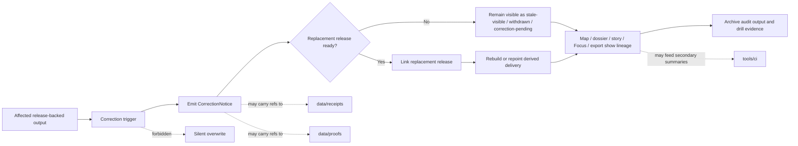

<!-- [KFM_META_BLOCK_V2]
doc_id: kfm://doc/NEEDS_VERIFICATION
title: correction
type: standard
version: v1
status: draft
owners: @bartytime4life
created: YYYY-MM-DD
updated: 2026-04-16
policy_label: NEEDS_VERIFICATION
related: [
  ../README.md,
  ../../README.md,
  ../../contracts/README.md,
  ../../policy/README.md,
  ../../validators/README.md,
  ../../ci/README.md,
  ../../catalog/README.md,
  ../../integration/README.md,
  ../../reproducibility/README.md,
  ../../accessibility/README.md,
  ../runtime_proof/README.md,
  ../release_assembly/README.md,
  ../../../README.md,
  ../../../.github/README.md,
  ../../../.github/CODEOWNERS,
  ../../../.github/workflows/README.md,
  ../../../.github/watchers/README.md,
  ../../../contracts/README.md,
  ../../../policy/README.md,
  ../../../schemas/README.md,
  ../../../schemas/contracts/v1/correction/README.md,
  ../../../docs/README.md,
  ../../../data/receipts/README.md,
  ../../../data/proofs/README.md
]
tags: [kfm, tests, e2e, correction, supersession, withdrawal, stale-visible, receipts, proofs]
notes: [
  doc_id, created, updated, and policy_label still need verification against repo history or governance records.
  Updated to align the correction leaf with the fuller tests lattice, receipt/proof separation, validator and attestation adjacency, watcher/process-memory doctrine, and whole-path trust-surface guidance.
  Current public-main evidence still proves this leaf mainly as a visible README-bearing family; executable suite depth, runner/toolchain, screenshot baselines, and merge-blocking automation remain bounded until checked directly on the working branch.
]
[/KFM_META_BLOCK_V2] -->

<a id="top"></a>

# `correction`

End-to-end correction proof surface for KFM **correction lineage**, **visible supersession**, **stale-visible behavior**, **withdrawal / replacement safety**, and **post-publication trust continuity**.

> **Status:** experimental  
> **Owners:** `@bartytime4life`  
> **Path:** `tests/e2e/correction/README.md`  
> **Repo fit:** leaf family under [`../README.md`](../README.md); downstream of [`../../README.md`](../../README.md), [`../../contracts/README.md`](../../contracts/README.md), [`../../policy/README.md`](../../policy/README.md), [`../../validators/README.md`](../../validators/README.md), [`../../ci/README.md`](../../ci/README.md), [`../../catalog/README.md`](../../catalog/README.md), [`../../integration/README.md`](../../integration/README.md), [`../../reproducibility/README.md`](../../reproducibility/README.md), [`../../accessibility/README.md`](../../accessibility/README.md), [`../../../README.md`](../../../README.md), [`../../../.github/README.md`](../../../.github/README.md), [`../../../.github/CODEOWNERS`](../../../.github/CODEOWNERS), [`../../../.github/workflows/README.md`](../../../.github/workflows/README.md), [`../../../.github/watchers/README.md`](../../../.github/watchers/README.md), [`../../../contracts/README.md`](../../../contracts/README.md), [`../../../policy/README.md`](../../../policy/README.md), [`../../../schemas/README.md`](../../../schemas/README.md), [`../../../schemas/contracts/v1/correction/README.md`](../../../schemas/contracts/v1/correction/README.md), [`../../../docs/README.md`](../../../docs/README.md), [`../../../data/receipts/README.md`](../../../data/receipts/README.md), and [`../../../data/proofs/README.md`](../../../data/proofs/README.md)  
> **Quick jump:** [Scope](#scope) · [Repo fit](#repo-fit) · [Accepted inputs](#accepted-inputs) · [Exclusions](#exclusions) · [Current verified snapshot](#current-verified-snapshot) · [Directory tree](#directory-tree) · [Quickstart](#quickstart) · [Usage](#usage) · [Diagram](#diagram) · [Tables](#tables) · [Task list / definition of done](#task-list--definition-of-done) · [FAQ](#faq) · [Appendix](#appendix)  
>        

> [!NOTE]
> The meta block above keeps `doc_id`, `created`, `updated`, and `policy_label` as reviewable placeholders until document-record metadata is reverified from repo history or governance records. The impact block below describes the current maturity of the `correction/` leaf itself.

> [!IMPORTANT]
> Current public `main` inspection confirms that `tests/e2e/correction/` exists and currently exposes `README.md` only. That proves the leaf boundary and its documented burden, but it does **not** prove checked-in executable correction cases, runner/toolchain, proof-pack emitters, screenshot baselines, or automatically exercised correction drills.

> [!TIP]
> Keep the KFM trust split visible here:
>
> **correction proof ≠ contract proof ≠ policy proof ≠ validator proof ≠ renderer proof ≠ receipt authority ≠ proof authority**
>
> - `tests/e2e/correction/` proves correction lineage across a whole path  
> - `tests/contracts/` proves correction-object shape and valid/invalid examples  
> - `tests/policy/` proves correction-related decision behavior  
> - `tests/validators/` proves validator and gate behavior  
> - `tests/ci/` proves downstream rendering and handoff behavior  
> - `data/receipts/` remains process memory  
> - `data/proofs/` remains higher-order trust storage

| At a glance | Working rule |
|---|---|
| Leaf burden | Prove correction lineage end to end |
| Current local inventory | `README.md` only under `tests/e2e/correction/` |
| Current schema-side correction contract body | `schemas/contracts/v1/correction/correction_notice.schema.json` is placeholder-only `{}` on current public `main` |
| Must stay visible | `superseded`, `withdrawn`, `stale-visible`, `correction-pending`, or equivalent trust cue |
| Must never happen | Silent overwrite of release-backed trust surfaces |
| Minimum lineage anchors | `CorrectionNotice` + affected release ref + replacement ref or explicit absence |
| Best first executable case | One synthetic, public-safe correction drill |

---

## Scope

`tests/e2e/correction/` exists to prove that KFM can correct a release-backed or outward trust-bearing result **without hiding the change**.

Good correction cases are **thin but whole**: one mistaken, narrowed, withdrawn, or superseded outward artifact; one governed correction path; and one visible lineage trail across the affected surfaces. This leaf is for correction-specific end-to-end proof such as supersession, withdrawal, replacement, stale-visible behavior, correction-pending cues, or precision narrowing that must remain inspectable in maps, dossiers, stories, Focus, exports, or adjacent trust surfaces when those surfaces are in scope.

This is not a generic regression bucket. If a case is really about release assembly, request-time runtime outcome proof, policy grammar, schema shape, accessibility-only behavior, or deterministic replay, it should live in its more honest home.

### What this leaf should prove

- a correction changes outward trust state **without silent overwrite**
- affected and replacement release lineage stays reconstructable
- withdrawn or superseded state remains visible where user meaning changes
- stale-derived surfaces stay visibly stale until rebuild or repoint completes
- correction-related machine objects, receipts, proofs, and rendered summaries remain distinguishable
- fail-closed behavior remains visible when correction cannot complete cleanly
- audit continuity survives the correction path

### What this leaf should not absorb

- release assembly as the primary burden
- request-time runtime proof as the primary burden
- schema-validity proof by itself
- policy grammar by itself
- validator-only behavior by itself
- renderer-only behavior by itself
- receipt or proof storage
- secret-bearing trace dumps or unrestricted sensitive fixtures

### Status markers used here

| Marker | Meaning in this README |
|---|---|
| **CONFIRMED** | Visible on the current public branch or directly grounded in stable adjacent repo documentation |
| **INFERRED** | Strongly supported by repo doctrine and neighboring docs, but not re-proven from executable branch evidence in this revision |
| **PROPOSED** | Buildable guidance that fits KFM doctrine without claiming current implementation |
| **UNKNOWN** | Not verified strongly enough to describe as current repo reality |
| **NEEDS VERIFICATION** | A path, command, workflow, or implementation detail that should be checked against the checked-out branch before merge |

### Evidence boundary used here

| Evidence layer | What this README treats as settled |
|---|---|
| **CONFIRMED — current public repo** | `tests/e2e/correction/` exists; the current public tree shows `README.md` only in this leaf; no checked-in executable correction cases are visible from the public tree alone |
| **CONFIRMED — parent e2e family contract** | [`../README.md`](../README.md) defines `correction/` as the leaf for correction, supersession, replacement, and stale-visible proof |
| **CONFIRMED — tests family contract** | [`../../README.md`](../../README.md) treats verification as a governed trust surface, not a generic QA bucket |
| **CONFIRMED — contract-facing validation lane** | [`../../contracts/README.md`](../../contracts/README.md) exists as the stronger repo-facing home for valid/invalid contract examples and fail-closed object validation |
| **CONFIRMED — policy-behavior lane** | [`../../policy/README.md`](../../policy/README.md) exists as the stronger repo-facing home for correction reason/obligation behavior |
| **CONFIRMED — validator and renderer neighbors** | [`../../validators/README.md`](../../validators/README.md) and [`../../ci/README.md`](../../ci/README.md) exist as stronger homes for validator-only and renderer-only proof |
| **CONFIRMED — workflow adjacency** | [`../../../.github/workflows/README.md`](../../../.github/workflows/README.md) exists, and current public `main` shows `.github/workflows/` as `README.md` only |
| **CONFIRMED — watcher/process-memory adjacency** | [`../../../.github/watchers/README.md`](../../../.github/watchers/README.md) now exists and sharpens how receipt-bearing automation should be described |
| **CONFIRMED — ownership** | [`../../../.github/CODEOWNERS`](../../../.github/CODEOWNERS) currently assigns `/tests/` to `@bartytime4life` |
| **CONFIRMED — schema-side correction lane** | [`../../../schemas/contracts/v1/correction/README.md`](../../../schemas/contracts/v1/correction/README.md) exists, and current public `correction_notice.schema.json` is placeholder-only `{}` |
| **CONFIRMED — trust-surface adjacency** | [`../../../data/receipts/README.md`](../../../data/receipts/README.md) and [`../../../data/proofs/README.md`](../../../data/proofs/README.md) materially affect how correction lineage should be described |
| **NEEDS VERIFICATION** | Real runner/toolchain, checked-in executable cases, required checks, screenshot baselines, proof-pack emitters, whether correction drills are exercised automatically, and final schema-home authority between `schemas/` and `contracts/` |

[Back to top](#top)

---

## Repo fit

**Path:** `tests/e2e/correction/README.md`  
**Role:** leaf README for correction-specific whole-path proof under `tests/e2e/`.

### Upstream anchors

| Relation | Path | Why it matters | Status |
|---|---|---|---|
| Parent family map | [`../README.md`](../README.md) | Defines `e2e/` as the whole-path proof family and assigns this leaf its burden | **CONFIRMED** |
| Wider tests lattice | [`../../README.md`](../../README.md) | Keeps this leaf aligned with the repo’s governed verification model | **CONFIRMED** |
| Contract-facing test lane | [`../../contracts/README.md`](../../contracts/README.md) | Stronger repo-facing home for contract-shape checks, valid/invalid examples, and fail-closed object validation | **CONFIRMED** |
| Policy-behavior test lane | [`../../policy/README.md`](../../policy/README.md) | Stronger repo-facing home for correction-related reason/obligation behavior under pressure | **CONFIRMED** |
| Validator-proof lane | [`../../validators/README.md`](../../validators/README.md) | Stronger repo-facing home for validator-only correction gating or machine checks | **CONFIRMED** |
| Renderer-proof lane | [`../../ci/README.md`](../../ci/README.md) | Stronger repo-facing home for correction-summary or handoff rendering behavior | **CONFIRMED** |
| Catalog-helper lane | [`../../catalog/README.md`](../../catalog/README.md) | Keep metadata-closure-only correction work out of this leaf when the burden is narrower | **CONFIRMED** |
| Integration lane | [`../../integration/README.md`](../../integration/README.md) | Real-boundary but smaller-than-e2e correction slices may belong there | **CONFIRMED** |
| Reproducibility lane | [`../../reproducibility/README.md`](../../reproducibility/README.md) | Deterministic replay or rebuild sameness should stay distinct from correction lineage | **CONFIRMED** |
| Accessibility lane | [`../../accessibility/README.md`](../../accessibility/README.md) | Accessibility-only correction cues should stay first-class when they are the primary burden | **CONFIRMED** |
| Repo root posture | [`../../../README.md`](../../../README.md) | Keeps correction proof tied to the governed, evidence-first repo identity | **CONFIRMED** |
| Workflow adjacency | [`../../../.github/workflows/README.md`](../../../.github/workflows/README.md) | Shows the current public automation boundary and its limits | **CONFIRMED** |
| Watcher adjacency | [`../../../.github/watchers/README.md`](../../../.github/watchers/README.md) | Keeps watcher-produced process memory and watcher orchestration outside this leaf | **CONFIRMED** |
| Ownership boundary | [`../../../.github/CODEOWNERS`](../../../.github/CODEOWNERS) | Establishes review ownership for `/tests/` | **CONFIRMED** |
| Contract source | [`../../../contracts/README.md`](../../../contracts/README.md) | Correction cases should consume authoritative object families, not redefine them | **CONFIRMED** |
| Policy source | [`../../../policy/README.md`](../../../policy/README.md) | Correction can involve deny-by-default decisions, rights narrowing, or review-bearing outcomes | **CONFIRMED** |
| Schema boundary | [`../../../schemas/README.md`](../../../schemas/README.md) | Prevents schema-law drift while schema-home authority remains a live repo concern | **CONFIRMED** |
| Correction contract lane | [`../../../schemas/contracts/v1/correction/README.md`](../../../schemas/contracts/v1/correction/README.md) | Names the live schema-side correction lane and keeps the placeholder `CorrectionNotice` schema body visible instead of overclaimed | **CONFIRMED** current path / **NEEDS VERIFICATION** authoritative machine home |
| Runbooks and human-readable guidance | [`../../../docs/README.md`](../../../docs/README.md) | Correction procedures and operator guidance should stay synchronized with executable proof | **CONFIRMED** |
| Receipt boundary | [`../../../data/receipts/README.md`](../../../data/receipts/README.md) | Correction may depend on process memory, but this leaf does not own receipt storage | **CONFIRMED** |
| Proof boundary | [`../../../data/proofs/README.md`](../../../data/proofs/README.md) | Correction may depend on release or proof lineage, but this leaf does not own proof storage | **CONFIRMED** |
| Release-bearing sibling | [`../release_assembly/README.md`](../release_assembly/README.md) | Use that leaf when the core burden is release/proof-pack assembly rather than correction lineage | **CONFIRMED** as sibling path / **NEEDS VERIFICATION** as executable depth |
| Runtime-bearing sibling | [`../runtime_proof/README.md`](../runtime_proof/README.md) | Use that leaf when the core burden is runtime outcome proof rather than correction propagation | **CONFIRMED** as sibling path / **NEEDS VERIFICATION** as executable depth |

### Local rule

Keep this leaf **correction-led**.

If a case cannot point to a correction-specific end-to-end burden, it probably belongs somewhere else.

[Back to top](#top)

---

## Accepted inputs

Accepted inputs for this directory are the **smallest artifacts needed to prove correction honestly**.

| Accepted input | What belongs here | Notes |
|---|---|---|
| Whole-path correction scenarios | One narrow but complete scenario that crosses real correction boundaries | Prefer one accountable drill over a wide decorative suite |
| Affected and replacement release refs | The old scope, the replacement scope, or an explicit absence of replacement | Avoid correction prose with no release lineage |
| `CorrectionNotice`-bearing examples | Emitted or asserted correction objects tied to the scenario | The schema or contract authority stays upstream |
| Surface-state evidence | Screenshots, snapshots, diffs, or other cues showing the outward correction state | **PROPOSED / NEEDS VERIFICATION** until the real runner is known |
| Derived rebuild or stale-visible evidence | Proof that projections rebuild, repoint, or remain visibly stale instead of silently drifting | Especially important for map-facing or export-facing cases |
| Audit and comparison output | Reports that show what changed, why, and how the system stayed trustworthy | Keep output reviewable and burden-led |
| Reused authoritative fixtures | Contract, policy, validator, release, receipt, and proof examples imported from their owning homes | Reuse; do not fork authority locally |
| Public-safe correction drills | Synthetic or non-sensitive cases that can be exercised without rights leakage | Strong first executable candidate |
| Trust-chain refs | `receipt_ref`, `proof_ref`, replacement release refs, rollback anchors, or attestation-visible state when the correction burden truly depends on them | Keep them explicit and separate, not flattened into one generic fixture |

> [!NOTE]
> Current public `schemas/contracts/v1/correction/correction_notice.schema.json` is placeholder-only `{}`. Until that schema body becomes substantive, whole-path correction proof should treat the schema-side lane as a boundary/reference signal rather than as proof of finished machine-contract coverage.

## Exclusions

What does **not** belong here, and where it should go instead:

| Exclusion | Keep it out of `tests/e2e/correction/` | Put it here instead |
|---|---|---|
| Release assembly with no correction burden | That is broader release proof, not correction proof | [`../release_assembly/README.md`](../release_assembly/README.md) |
| Runtime `ANSWER` / `ABSTAIN` / `DENY` / `ERROR` proof with no correction propagation | That is runtime proof first | [`../runtime_proof/README.md`](../runtime_proof/README.md) |
| Schema-shape-only validation for `CorrectionNotice` or related objects | This leaf proves behavior, not contract shape alone | [`../../contracts/README.md`](../../contracts/README.md), [`../../../schemas/contracts/v1/correction/README.md`](../../../schemas/contracts/v1/correction/README.md), and [`../../../contracts/README.md`](../../../contracts/README.md) |
| Policy grammar or reason/obligation logic by itself | Decision grammar should stay isolated when possible | [`../../policy/README.md`](../../policy/README.md) and [`../../../policy/README.md`](../../../policy/README.md) |
| Validator-only correction gating | Machine gate proof without the broader outward correction chain | [`../../validators/README.md`](../../validators/README.md) |
| Renderer-only correction-state formatting | Summary or handoff rendering without the broader outward correction chain | [`../../ci/README.md`](../../ci/README.md) |
| Accessibility-only correction cues | If the burden is readability/keyboard/motion only, keep it first-class | [`../../accessibility/README.md`](../../accessibility/README.md) |
| Deterministic replay without correction lineage | Repeatability is important, but not this leaf’s core job | [`../../reproducibility/README.md`](../../reproducibility/README.md) |
| Human-readable correction playbooks | Documentation is not executable proof | [`../../../docs/README.md`](../../../docs/README.md) |
| Canonical contracts, policy bundles, receipts, proofs, or emitted release artifacts as authority | This leaf should consume authority, not replace it | their owning contract, policy, receipt, proof, release, or docs surfaces |

[Back to top](#top)

---

## Current verified snapshot

The current public `main` branch proves the following:

- `tests/e2e/` exists and currently contains `correction/`, `release_assembly/`, `runtime_proof/`, and `README.md`
- the parent [`../README.md`](../README.md) already assigns this leaf the burden of correction, supersession, replacement, and stale-visible proof
- `tests/e2e/correction/` currently contains `README.md` only
- `tests/contracts/README.md` and `tests/policy/README.md` are visible and now provide stronger adjacent proof homes for contract shape and policy behavior
- `tests/validators/README.md` and `tests/ci/README.md` are visible and now provide stronger adjacent proof homes for validator-only and renderer-only burdens
- `schemas/contracts/v1/correction/` currently contains `README.md` and `correction_notice.schema.json`
- the current public `correction_notice.schema.json` body is `{}`  
- `.github/watchers/README.md` now exists publicly, which materially affects how process-memory-aware correction flows should be described
- the checked-in leaf currently publishes boundary, placement, and inspection guidance, but the public tree does not prove executable correction cases under this leaf
- public `.github/workflows/` currently exposes `README.md` only; checked-in workflow YAML is not proven from visible repo files alone
- `/tests/` currently resolves to `@bartytime4life` in repo ownership

> [!CAUTION]
> Directory presence is **not** executable coverage. This leaf should stay explicit about what is currently visible, what is still merely doctrinal, and what still needs a checked-out branch to confirm.

> [!NOTE]
> The correction schema lane is real on current public `main`, but the visible schema body is still placeholder-only `{}`. That means the public tree currently proves **boundary**, not finished contract completeness.

[Back to top](#top)

---

## Directory tree

### Current confirmed snapshot

```text
tests/
└── e2e/
    └── correction/
        └── README.md
```

### Proposed maturity shape — NEEDS VERIFICATION

```text
tests/
└── e2e/
    └── correction/
        ├── README.md
        ├── supersession/
        ├── withdrawal/
        ├── replacement_lineage/
        ├── stale_visible/
        ├── correction_pending/
        └── shared/
            ├── fixtures/
            └── cues/
```

> [!TIP]
> Keep this leaf **case-led**. Add real subtrees only when a real correction burden exists to justify them.

[Back to top](#top)

---

## Quickstart

### Safe inspection commands

These commands are safe because they inspect the current branch shape and adjacent documentation without assuming Playwright, Cypress, pytest, Vitest, Jest, or any other unverified runner.

```bash
# inspect the current local correction leaf
find tests/e2e/correction -maxdepth 4 -type d 2>/dev/null | sort
find tests/e2e/correction -maxdepth 4 -type f 2>/dev/null | sort

# re-read the parent family map and sibling leaves
sed -n '1,260p' tests/e2e/README.md 2>/dev/null || true
sed -n '1,220p' tests/e2e/runtime_proof/README.md 2>/dev/null || true
sed -n '1,220p' tests/e2e/release_assembly/README.md 2>/dev/null || true
sed -n '1,220p' tests/e2e/correction/README.md 2>/dev/null || true

# inspect the stronger adjacent correction-proof homes
sed -n '1,220p' tests/contracts/README.md 2>/dev/null || true
sed -n '1,220p' tests/policy/README.md 2>/dev/null || true
sed -n '1,220p' tests/validators/README.md 2>/dev/null || true
sed -n '1,220p' tests/ci/README.md 2>/dev/null || true
sed -n '1,220p' schemas/contracts/v1/correction/README.md 2>/dev/null || true
cat schemas/contracts/v1/correction/correction_notice.schema.json 2>/dev/null || true

# inspect ownership and current public workflow/watcher documentation
sed -n '1,220p' .github/CODEOWNERS 2>/dev/null || true
find .github/workflows -maxdepth 2 -type f 2>/dev/null | sort
sed -n '1,220p' .github/workflows/README.md 2>/dev/null || true
sed -n '1,220p' .github/watchers/README.md 2>/dev/null || true

# inspect adjacent authority and trust surfaces before adding correction cases
sed -n '1,220p' tests/README.md 2>/dev/null || true
sed -n '1,220p' contracts/README.md 2>/dev/null || true
sed -n '1,220p' policy/README.md 2>/dev/null || true
sed -n '1,220p' schemas/README.md 2>/dev/null || true
sed -n '1,220p' docs/README.md 2>/dev/null || true
sed -n '1,220p' data/receipts/README.md 2>/dev/null || true
sed -n '1,220p' data/proofs/README.md 2>/dev/null || true

# check whether doctrine-proposed correction docs already exist locally
sed -n '1,220p' docs/runbooks/correction.md 2>/dev/null || true
sed -n '1,220p' docs/runbooks/rollback.md 2>/dev/null || true
sed -n '1,220p' docs/runbooks/stale_projection.md 2>/dev/null || true

# search for correction vocabulary before inventing new names
grep -RIn \
  -e 'CorrectionNotice' \
  -e 'ReleaseManifest' \
  -e 'ReleaseProofPack' \
  -e 'ProjectionBuildReceipt' \
  -e 'EvidenceBundle' \
  -e 'RuntimeResponseEnvelope' \
  -e 'receipt_ref' \
  -e 'proof_ref' \
  -e 'run_receipt' \
  -e 'ai_receipt' \
  -e 'superseded' \
  -e 'withdrawn' \
  -e 'stale-visible' \
  -e 'CORRECTION-PENDING' \
  -e 'replacement' \
  tests contracts policy schemas docs .github data tools 2>/dev/null || true
```

### First local review pass

1. Confirm whether the checked-out branch still matches the current public `tests/e2e/correction/` shape.
2. Confirm whether this leaf is still README-only or already contains executable cases.
3. Confirm the actual runner/toolchain before documenting any command beyond safe inspection.
4. Confirm whether a proposed case is honestly correction-led, not release-assembly-led or runtime-led.
5. Confirm which visible cues the case must preserve (`superseded`, `withdrawn`, `stale-visible`, `correction-pending`, or precision narrowing).
6. Confirm which proof objects the case should consume rather than redefine.
7. Confirm whether the active branch still leaves `schemas/contracts/v1/correction/correction_notice.schema.json` as placeholder `{}` or has introduced a substantive body.
8. Confirm whether any ADR or other repo decision has settled schema-home authority between `schemas/` and `contracts/`.
9. Confirm whether receipt/proof or attestation-visible state materially affects the correction path on the checked-out branch before documenting it as active burden.

[Back to top](#top)

---

## Usage

### When a case belongs here

Use `tests/e2e/correction/` when the smallest honest proof has to show that a correction stays visible and reconstructable across a whole path.

Typical cases include:

- a release-backed outward result becomes `superseded` and must link cleanly to a replacement release
- a published output is `withdrawn` or narrowed and the user-facing state must stay visible
- a corrected authoritative scope exists but derived delivery is still `stale-visible` until rebuild finishes
- a correction must propagate into outward trust surfaces such as map, dossier, story, Focus, or export
- a correction changes precision or access and the generalization/redaction has to stay inspectable
- an audit trail must prove that no silent overwrite occurred
- a correction path depends on explicit release refs, receipt/proof visibility, or attestation-visible state and must keep those roles distinct

### Naming guidance

Prefer burden-led names over generic test buckets.

| Better | Avoid |
|---|---|
| `supersession/` | `misc/` |
| `withdrawal/` | `correction_v2/` |
| `replacement_lineage/` | `ui_cases/` |
| `stale_visible/` | `edge_cases/` |
| `correction_pending/` | `helpers_everything/` |

Suggested test-file naming pattern:

```text
<subject>.<correction-burden>.<expected-visible-state>.test.*
```

Examples:

```text
release.supersession.visible_state.test.*
correction_notice.replacement_lineage.test.*
export.withdrawal.visible_denial.test.*
projection.stale_visible.after_correction.test.*
focus.corrected_claim.lineage_visible.test.*
```

### Placement rule

Choose the smallest honest proof home.

- If the case is about runtime outcome selection with no correction lineage, move it to [`../runtime_proof/README.md`](../runtime_proof/README.md).
- If the case is about publish/promotion/release evidence with no outward correction burden, move it to [`../release_assembly/README.md`](../release_assembly/README.md).
- If the case is only about schema validity, use the contracts/schema surfaces instead of widening this leaf.
- If the case is only about policy grammar, reason codes, or obligations, keep it in policy-oriented tests.
- If the case is only about validator behavior, use `tests/validators/`.
- If the case is only about renderer behavior, use `tests/ci/`.
- If the case is only about accessibility presentation, keep it in the accessibility family.

### Escalation rule

A correction case stays here when **correction lineage is the main question**.

Escalate only when the proof stops being leaf-specific and becomes a broader e2e family concern, such as:

- a single run that must prove release assembly **and** runtime proof **and** correction together
- a steward or review workflow that spans multiple independent boundaries
- a repo-level orchestration flow that would make this leaf only one step in a larger governed drill

### Trust-chain rule

Where a correction case includes release objects, process memory, higher-order proofs, validator outputs, or rendered summaries:

- keep receipts as **process memory**
- keep proofs as **higher-order trust objects**
- keep validator outputs as **machine decisions or records**
- keep rendered summaries as **secondary review aids**
- do not flatten all of them into one generic “correction artifact passed” story

[Back to top](#top)

---

## Diagram



[Back to top](#top)

---

## Tables

### Correction proof matrix

| Case | Must show end to end | Minimum proof objects | Minimum outward cues |
|---|---|---|---|
| Supersession with replacement | Old output is no longer primary, replacement is linked, and lineage is reconstructable | `CorrectionNotice` + affected release ref + replacement release ref | visible `superseded` cue plus replacement linkage |
| Withdrawal without replacement | Output is no longer valid or no longer publishable, and the system does not bluff around it | `CorrectionNotice` + review/policy linkage where relevant | visible `withdrawn` or equivalent unavailable state |
| Stale-visible before rebuild | Corrected authoritative scope exists, but derived delivery has not finished rebuilding | `CorrectionNotice` + release linkage + projection/rebuild context | visible `stale-visible` or `correction-pending` cue |
| Runtime correction propagation | A corrected claim no longer resolves as if the old state were still valid | `CorrectionNotice` + `EvidenceBundle` + `RuntimeResponseEnvelope` where runtime is in scope | visible corrected lineage or fail-closed runtime outcome |
| Generalized replacement | Precision narrows after correction and the system stays explicit about the downgrade | `CorrectionNotice` + policy/review linkage + affected release ref | visible generalization / reduced-precision cue |
| Trust-chain-visible correction | A correction path depends on explicit receipt/proof or attestation-visible state and keeps those roles distinct | `CorrectionNotice` + affected/replacement refs + `receipt_ref` / `proof_ref` / visible trust cues where relevant | visible lineage plus explicit non-flattened trust state |

### Placement matrix

| If you need to prove... | Best home | Why |
|---|---|---|
| Full correction lineage and visible user-facing state change | `tests/e2e/correction/` | That is this leaf’s core burden |
| Release assembly, proof-pack completeness, or promotion readiness without correction | `tests/e2e/release_assembly/` | That leaf owns release-bearing proof first |
| Runtime `ANSWER` / `ABSTAIN` / `DENY` / `ERROR` behavior without correction propagation | `tests/e2e/runtime_proof/` | Keep runtime outcome proof honest and smaller |
| `CorrectionNotice` schema shape, valid/invalid fixtures, or contract grammar | `tests/contracts/`, `schemas/contracts/v1/correction/`, plus authoritative contract homes | Behavior proof should not replace contract authority |
| Reason/obligation logic or deny-by-default decision grammar for correction | `tests/policy/` plus authoritative policy homes | Keep policy law isolated when possible |
| Validator-only correction gating | `tests/validators/` | Keep gate proof bounded when whole-path correction is not needed |
| Renderer-only correction-state presentation | `tests/ci/` | Keep rendering proof explicit |
| Accessibility-only correction cues | `tests/accessibility/` | Interaction/readability proof should stay first-class |
| Deterministic rerun or replay sameness | `tests/reproducibility/` | Repeatability is not the same as correction lineage |

[Back to top](#top)

---

## Task list / definition of done

### First executable suite bootstrap

- [ ] Confirm whether a repo-wide runner, fixture convention, or workflow already governs this leaf.
- [ ] Add one synthetic, public-safe correction scenario before widening the tree.
- [ ] Reuse authoritative contract and policy language instead of cloning it locally.
- [ ] Assert **no silent overwrite** as part of the case, not as an afterthought.
- [ ] Assert at least one outward trust cue when the correction changes user-visible meaning.
- [ ] Capture affected and replacement release refs, or explicitly record that no replacement exists.
- [ ] Capture audit output and any screenshots/snapshots/diffs needed to review the correction path.
- [ ] Update adjacent docs if the leaf stops being README-only or if a stable local invocation path is introduced.
- [ ] Revisit this README if `correction_notice.schema.json` stops being `{}` or if schema-home authority is formally resolved.
- [ ] Add receipt/proof-aware or attestation-visible assertions only when the checked-out branch truly makes them part of the correction burden.

### Definition of done

1. The case is correction-led and whole-path, not merely a runtime or release test in disguise.
2. Affected and replacement scopes are explicit, or the absence of replacement is explicit.
3. `CorrectionNotice` or equivalent correction lineage is emitted, asserted, or otherwise made reconstructable.
4. At least one outward trust surface shows a visible correction consequence when user meaning changes.
5. Derived delivery either rebuilds/repoints or remains visibly stale instead of drifting silently.
6. Evidence linkage remains one hop away from the corrected claim where evidence resolution is in scope.
7. The case proves fail-closed behavior when correction cannot complete cleanly.
8. Local and/or CI invocation is documented, or explicitly marked **NEEDS VERIFICATION**.
9. Contract-shape assumptions do not outrun the current public schema-side reality.
10. Receipts, proofs, validator outputs, and rendered summaries remain distinct when they participate in the correction path.

[Back to top](#top)

---

## FAQ

### Why is `correction/` a separate e2e leaf instead of living inside `release_assembly/`?

Because correction is not just a release concern. It is a lineage and visibility concern. This leaf exists to prove that change stays inspectable after publication, not merely that a release artifact was assembled correctly.

### Does the current public repo prove executable correction drills?

No. The public branch currently proves the leaf exists, is README-only, and documents its correction burden. It does not prove a runner, case depth, required checks, or exercised drills.

### Can this leaf own the authoritative `CorrectionNotice` schema?

No. This leaf should consume correction contracts and policy outputs from their authoritative homes. It should prove how they behave together, not redefine them here.

### Does current public `main` prove a finished `CorrectionNotice` schema?

No. Current public `main` proves a live schema-side correction lane exists and that `schemas/contracts/v1/correction/correction_notice.schema.json` is present, but the visible schema body is still `{}`. That is boundary evidence, not finished contract coverage.

### Why mention receipts and proofs here?

Because some correction paths may depend on visible trust-chain state. Mentioning them keeps the boundary explicit; it does not move their ownership or storage into this leaf.

### What is the best first executable case?

One synthetic, public-safe correction drill that proves:
1. an outward result changes,
2. the correction becomes visible,
3. lineage survives,
4. no silent overwrite occurs.

[Back to top](#top)

---

## Appendix

<details>
<summary><strong>Correction-specific object families, adjacent surfaces, and visible states</strong></summary>

### Object families this leaf is likely to touch

| Object family | Why this leaf may need it |
|---|---|
| `CorrectionNotice` | Primary correction-lineage object |
| `ReleaseManifest` / `ReleaseProofPack` | Anchors affected and replacement release scope |
| `ProjectionBuildReceipt` | Useful when corrected delivery must rebuild or repoint |
| `EvidenceBundle` | Keeps corrected support inspectable one hop away |
| `RuntimeResponseEnvelope` | Useful when correction changes runtime-visible behavior |
| `DecisionEnvelope` / `ReviewRecord` | Useful when correction involves review, denial, narrowing, or rights changes |
| `run_receipt` / `ai_receipt` | Useful when process-memory or model-mediated continuity matters to the correction path |
| `proof_ref` / attestation-visible state | Useful when a correction must preserve visible higher-order trust linkage |

### Adjacent correction surfaces visible on current public `main`

| Surface | Current visible state | Why it matters |
|---|---|---|
| `tests/e2e/correction/` | `README.md` only | Whole-path correction burden is visible, but executable depth is unproven |
| `tests/contracts/` | `README.md` plus documented proposed case lanes including `correction-notice/` | Stronger home for contract-shape validation and valid/invalid example packs |
| `tests/policy/` | `README.md` with explicit correction/supersession outcome pressure | Stronger home for reason/obligation and policy-behavior proof |
| `tests/validators/` | `README.md` with validator/gate proof posture | Stronger home for narrower validator-only correction gating |
| `tests/ci/` | `README.md` with renderer-proof posture | Stronger home for correction-summary or handoff rendering proof |
| `schemas/contracts/v1/correction/` | `README.md` + `correction_notice.schema.json` | Live schema-side correction lane is visible on public `main` |
| `schemas/contracts/v1/correction/correction_notice.schema.json` | `{}` | Prevents claiming finished contract coverage where the public tree only proves placeholder body |
| `data/receipts/` | visible governed process-memory lane | Keeps process memory distinct from correction proof |
| `data/proofs/` | visible governed proof lane | Keeps higher-order proofs distinct from correction proof |

### Visible trust states to keep explicit when relevant

| Visible state | Why it matters |
|---|---|
| `superseded` | Signals that the older result is no longer primary |
| `withdrawn` | Signals that the prior result should not be used |
| `stale-visible` | Signals that the surface is intentionally visible but not yet refreshed |
| `correction-pending` | Signals that a correction exists but full replacement is not yet complete |
| `generalized` | Signals that a corrected replacement is deliberately less precise |
| replacement linked | Signals where the user should go next instead of leaving the correction as a dead end |

</details>

[Back to top](#top)
