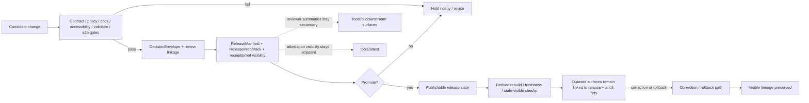

<!-- [KFM_META_BLOCK_V2]
doc_id: kfm://doc/NEEDS-VERIFICATION
title: tests/e2e/release_assembly
type: standard
version: v1
status: draft
owners: @bartytime4life
created: NEEDS_VERIFICATION
updated: 2026-04-16
policy_label: public
related: [
  ../README.md,
  ../../README.md,
  ../../contracts/README.md,
  ../../policy/README.md,
  ../../schemas/README.md,
  ../../docs/README.md,
  ../../data/receipts/README.md,
  ../../data/proofs/README.md,
  ../../data/published/README.md,
  ../../tools/validators/README.md,
  ../../tools/validators/promotion_gate/README.md,
  ../../tools/attest/README.md,
  ../../tools/ci/README.md,
  ../../tools/diff/README.md,
  ../../.github/README.md,
  ../../.github/workflows/README.md,
  ../../.github/watchers/README.md,
  ../../.github/CODEOWNERS,
  ../../CONTRIBUTING.md,
  ../runtime_proof/README.md,
  ../correction/README.md
]
tags: [kfm, tests, e2e, release-assembly, manifest, proof-pack, promotion, receipts, proofs]
notes: [
  Reconciled against the parent e2e lane and the thin-slice floodplain release artifacts.
  Updated to align this leaf with explicit receipt/proof separation, validator and attestation boundaries, watcher/process-memory doctrine, diff and review-handoff downstream surfaces, and the fuller tests lattice.
  doc_id, created date, and any future local executable test inventory remain NEEDS VERIFICATION until the checked-out branch proves them directly.
]
[/KFM_META_BLOCK_V2] -->

<a id="top"></a>

# `tests/e2e/release_assembly/`

Governed end-to-end proof surface for **promotion**, **release evidence**, **publish-path integrity**, **rollback readiness**, and **post-promotion lineage** in Kansas Frontier Matrix.

> [!NOTE]
> The meta block above keeps reviewable placeholders for `doc_id`, `created`, and any still-unverified document-record metadata until git history and governance records are rechecked.

> **Status:** experimental  
> **Owners:** `@bartytime4life`  
> **Path:** `tests/e2e/release_assembly/README.md`  
> **Quick jump:** [Scope](#scope) · [Repo fit](#repo-fit) · [Accepted inputs](#accepted-inputs) · [Exclusions](#exclusions) · [Current verified snapshot](#current-verified-snapshot) · [Directory tree](#directory-tree) · [Quickstart](#quickstart) · [Usage](#usage) · [Diagram](#diagram) · [Reference tables](#reference-tables) · [Task list / definition of done](#task-list--definition-of-done) · [FAQ](#faq)  
>
> 
> 
> 
> 
> 
> 
> 
> 

> [!IMPORTANT]
> In KFM, a successful build or deploy is still weaker than a governed release.
>
> This leaf exists to prove that a candidate became **publishable with lineage intact**, with receipts, proofs, policy/review linkage, and downstream trust cues still reconstructable.

> [!TIP]
> Keep the release grammar explicit:
>
> - `decision.json` → finite promotion outcome
> - `promotion-record.json` → review-facing release linkage
> - `release-manifest.json` → release inventory and closure anchor
> - `release-proof-pack.json` → compact proof-bearing bundle
>
> Missing proof is a release failure, not a formatting inconvenience.

> [!TIP]
> Keep the KFM trust split visible here:
>
> **receipt ≠ proof ≠ release object ≠ rendered summary ≠ publication**
>
> - receipts remain process memory  
> - proofs remain higher-order trust objects  
> - validator outputs remain machine decisions and records  
> - renderer outputs remain secondary review aids  
> - publication remains a later governed state transition

> [!WARNING]
> Current public `main` proves this directory exists, but does **not** by itself prove executable suite depth, checked-in workflow gates, proof-pack emitters, required checks, or mounted receipt/proof-aware release fixtures.
>
> Keep runner, workflow, and artifact-emission claims explicitly bounded until the checked-out branch is inspected.

---

## Scope

`release_assembly/` is the end-to-end verification family for the moment where a candidate stops being “a successful build” and becomes “a governable, publishable release.”

This directory exists to answer questions like:

- Can a candidate move into release-bearing state without losing manifest lineage, policy/review context, or correction posture?
- Does publish-path proof remain inspectable after promotion?
- Do docs, accessibility, and trust-visible release cues stay attached to the release rather than drifting into after-the-fact cleanup?
- Can derived delivery and outward-facing surfaces still point back to a known release scope?
- Do receipts, proofs, attestation-visible state, prior/current diff output, and reviewer handoff artifacts remain connected without being flattened into one generic “release artifact”?

In KFM terms, this family protects the seam where:

> **deployment success is still weaker than publication safety**

### What this family should prove

- promotion outcome is finite and reviewable
- release inventory is complete enough to inspect
- proof-pack completeness survives promotion
- receipt / audit linkage remains visible
- rollback or correction posture remains explicit
- downstream derived delivery still joins back to a known release scope
- review-facing summaries and handoffs remain secondary to the underlying machine objects
- fail-closed behavior stays visible when release evidence is incomplete, malformed, stale, or untrusted

### What this family should not absorb

- request-time citation or runtime-answer proof as the primary burden
- correction propagation as the primary burden
- contract-shape authority
- policy authorship
- validator implementation ownership
- attestation implementation ownership
- reviewer-render formatting contracts
- receipt/proof storage

### Status markers used here

| Marker | Meaning in this README |
|---|---|
| **CONFIRMED** | Visible in the current public repo or already stabilized in supplied KFM doctrine |
| **INFERRED** | Strongly implied by the repo/doc set, but not directly proven as mounted implementation |
| **PROPOSED** | Recommended release-assembly shape or behavior for this directory |
| **UNKNOWN** | Not verified from the current public tree or attached implementation evidence |
| **NEEDS VERIFICATION** | Review step required before treating a claim as current repo fact |

### Evidence boundary for this directory

| Area | Current posture |
|---|---|
| Directory existence | **CONFIRMED** |
| Parent `tests/e2e/` family placement | **CONFIRMED** |
| Sibling `e2e` leaf family structure | **CONFIRMED** |
| Thin-slice floodplain release artifacts under `data/proofs/releases/floodplain-kansas-v1/` | **CONFIRMED in current working slice** |
| Checked-in workflow YAML for merge-blocking release gates on public `main` | **NEEDS VERIFICATION** |
| Exact test runner, fixture layout, and harness depth | **NEEDS VERIFICATION** |
| Dedicated local executable release-assembly test file in this leaf | **NOT YET PRESENT / PROPOSED** |
| Release-proof, receipt/proof separation, correction-aware posture, and fail-closed burden language | **CONFIRMED** in current doctrine and adjacent docs |

[Back to top](#top)

---

## Repo fit

### Path and role

This file documents the responsibility of:

```text
tests/e2e/release_assembly/
```

Within the broader repo, that family sits inside the `tests/e2e/` verification lane and is the natural home for:

- promotion proof
- release completeness
- publish-path integrity
- rollback-ready lineage
- release-facing receipt/proof visibility
- downstream review-state continuity

### Upstream anchors

| Upstream file | Why it matters here |
|---|---|
| [`../README.md`](../README.md) | Defines `e2e/` as the whole-path proof umbrella and places `release_assembly/` beside `runtime_proof/` and `correction/` |
| [`../../README.md`](../../README.md) | Defines the broader `tests/` tree and names `e2e/release_assembly/` as the release / promotion / publish-path proof family |
| [`../../README.md`](../../README.md) | Establishes repo-wide evidence-first posture |
| [`../../.github/README.md`](../../.github/README.md) | Frames `.github/` as the repository gatehouse for governance, review, CI/CD, and delivery evidence |
| [`../../.github/workflows/README.md`](../../.github/workflows/README.md) | Documents current workflow-lane reality and keeps CI claims bounded |
| [`../../.github/watchers/README.md`](../../.github/watchers/README.md) | Keeps watcher-produced process memory and receipt-bearing automation outside this leaf |
| [`../../.github/CODEOWNERS`](../../.github/CODEOWNERS) | Current ownership signal for `/tests/` |
| [`../../contracts/README.md`](../../contracts/README.md) | Keeps release/testing language aligned with contract-backed objects |
| [`../../policy/README.md`](../../policy/README.md) | Keeps release checks aligned with fail-closed policy posture |
| [`../../schemas/README.md`](../../schemas/README.md) | Prevents release-proof drift into schema-authority claims |
| [`../../docs/README.md`](../../docs/README.md) | Reminds maintainers that docs are part of the trust surface, not a post-release extra |
| [`../../data/proofs/README.md`](../../data/proofs/README.md) | Release proof objects remain authoritative outside this leaf |
| [`../../data/receipts/README.md`](../../data/receipts/README.md) | Process memory and audit continuity stay adjacent |
| [`../../data/published/README.md`](../../data/published/README.md) | Outward materialization should remain linked to release truth |
| [`../../tools/validators/README.md`](../../tools/validators/README.md) | Keeps release-assembly proof distinct from validator-only proof |
| [`../../tools/validators/promotion_gate/README.md`](../../tools/validators/promotion_gate/README.md) | Current promotion thin slice is the strongest adjacent machine chain for this leaf |
| [`../../tools/attest/README.md`](../../tools/attest/README.md) | Attestation remains an adjacent trust surface rather than a responsibility of this leaf |
| [`../../tools/ci/README.md`](../../tools/ci/README.md) | Reviewer-facing summaries and handoff docs remain secondary downstream surfaces |
| [`../../tools/diff/README.md`](../../tools/diff/README.md) | Prior/current comparison remains a separate comparison lane even when release assembly consumes its outputs |

### Adjacent `e2e` families

| Adjacent path | Boundary |
|---|---|
| [`../runtime_proof/README.md`](../runtime_proof/README.md) | request-time runtime outcomes, citation checks, and bounded answer behavior |
| [`../correction/README.md`](../correction/README.md) | post-release correction, rollback, supersession, withdrawal, and visible lineage changes |

### Thin-slice adjacent release artifacts

| Artifact | Role |
|---|---|
| [`../../data/proofs/releases/floodplain-kansas-v1/decision.json`](../../data/proofs/releases/floodplain-kansas-v1/decision.json) | finite promotion decision |
| [`../../data/proofs/releases/floodplain-kansas-v1/promotion-record.json`](../../data/proofs/releases/floodplain-kansas-v1/promotion-record.json) | release-facing review linkage |
| [`../../data/proofs/releases/floodplain-kansas-v1/release-manifest.json`](../../data/proofs/releases/floodplain-kansas-v1/release-manifest.json) | release inventory + closure anchor |
| [`../../data/proofs/releases/floodplain-kansas-v1/release-proof-pack.json`](../../data/proofs/releases/floodplain-kansas-v1/release-proof-pack.json) | compact proof-bearing bundle |

### Current public footprint

As of the current public branch view, the only confirmed file in this directory itself is:

```text
tests/e2e/release_assembly/
└── README.md
```

Anything deeper than that inside this leaf belongs in `PROPOSED`, `INFERRED`, or `NEEDS VERIFICATION` territory until a checked-out branch proves it.

[Back to top](#top)

---

## Accepted inputs

Use this directory for artifacts that prove a release candidate is **publishable with lineage intact**, not merely executable.

Typical accepted inputs include:

- e2e cases that exercise candidate → release → publish-path transitions
- fixtures that validate manifest completeness, proof-pack completeness, and release linkage
- validator outputs that show why promotion was allowed, denied, abstained, or errored
- receipt / proof / attestation refs when release readiness depends on visible trust-chain state
- checks that docs/accessibility gates remain attached to release-bearing state
- cases that prove policy/review references survive release assembly
- prior/current bundle or manifest comparisons when release review depends on visible change
- cases that prove derived rebuild or stale-visible behavior still points to a known release
- checks that audit joins stay reconstructable across release objects
- negative cases where release should hold, deny, abstain, or remain candidate rather than promote
- runner-local notes or helpers **only when** they are specific to release assembly and not generic test infrastructure

> [!NOTE]
> KFM doctrine names release-bearing object families such as `ReleaseManifest`, `ReleaseProofPack`, `DecisionEnvelope`, `ReviewRecord`, `ProjectionBuildReceipt`, and `CorrectionNotice`.
> Treat those as doctrinal vocabulary, not as a claim that this directory already contains those exact checked-in local files on public `main`.

### Minimum bar

A credible release-assembly case should make all of the following reviewable:

- release identity
- promotion outcome
- proof-bearing inventory
- receipt / audit linkage
- rollback or correction posture
- trust-chain visibility when receipt/proof state is relevant
- the distinction between machine objects and rendered summaries

[Back to top](#top)

---

## Exclusions

Do **not** use this directory for everything that merely touches release-like language.

Keep the following elsewhere:

| Does **not** belong here | Put it here instead |
|---|---|
| Schema-authoring source of truth | `contracts/`, `schemas/`, contract-specific test lanes |
| Request-time answer/citation proof | [`../runtime_proof/`](../runtime_proof/) |
| Correction propagation and visible lineage under change | [`../correction/`](../correction/) |
| Validator-only gate behavior | [`../../tests/validators/README.md`](../../tests/validators/README.md) |
| Reviewer-render formatting or handoff composition | [`../../tests/ci/README.md`](../../tests/ci/README.md) |
| Catalog-helper-only closure proof | [`../../tests/catalog/README.md`](../../tests/catalog/README.md) |
| Long-form operations manuals or release runbooks | `docs/` or `docs/runbooks/` |
| Runtime service code or release builders themselves | app/package/runtime locations, not `tests/e2e/` |
| Scratch logs, ad hoc screenshots, manual exports | ephemeral local artifacts, not committed test surfaces |
| Historical workflow names without current-branch proof | `.github/workflows/README.md` or review notes as signal, not release proof |
| Canonical proof objects as primary records | `data/proofs/` |
| Receipt archives or proof-pack archives | `data/receipts/`, `data/proofs/` |
| Signature generation or verification | `tools/attest/` |

[Back to top](#top)

---

## Current verified snapshot

The following is safe to say from current public + thin-slice repo evidence:

- `tests/e2e/release_assembly/` exists
- the current public tree shows this directory as `README.md` only
- `tests/e2e/` also contains `runtime_proof/` and `correction/`
- `tests/e2e/README.md` and `tests/README.md` both assign `release_assembly/` the release / promotion / publish-path proof role
- `/.github/workflows/` is documented, but current public `main` does not show checked-in workflow YAML there
- `.github/workflows/README.md` explicitly records historical deleted workflow names such as `release-evidence.yml` and `promote-and-reconcile.yml`
- `.github/watchers/README.md` now exists as a watcher-boundary doc, which materially affects how receipt-bearing and process-memory-aware release paths should be described
- `/tests/` ownership is currently assigned to `@bartytime4life`
- the thin-slice floodplain release under `data/proofs/releases/floodplain-kansas-v1/` now contains:
  - `decision.json`
  - `promotion-record.json`
  - `release-manifest.json`
  - `release-proof-pack.json`
- adjacent docs now explicitly distinguish receipts from proofs, validators from attestation helpers, and machine release objects from reviewer-facing summaries

### What is **not** yet proven from current evidence

- actual local executable release-assembly cases in this leaf
- runner choice
- fixture inventory
- proof-pack emitters
- required checks
- branch protection / merge-blocking settings
- archived release receipts or drill evidence
- current branch-local replacements, if any, for the deleted historical workflow names
- mounted receipt/proof-aware release scenarios under this leaf

> [!NOTE]
> Historical workflow names are useful branch-review clues, but they do **not** prove current checked-in YAML, current enforcement, or current merge blocking.

> [!WARNING]
> A placeholder directory can still carry a very real architectural burden.
>
> Do not mistake “thin tree” for “low importance.”

[Back to top](#top)

---

## Directory tree

### Confirmed public leaf snapshot

```text
tests/
├── README.md
└── e2e/
    ├── README.md
    ├── correction/
    │   └── README.md
    ├── release_assembly/
    │   └── README.md
    └── runtime_proof/
        └── README.md
```

### Thin-slice adjacent release artifacts

```text
data/proofs/releases/floodplain-kansas-v1/
├── decision.json
├── promotion-record.json
├── release-manifest.json
└── release-proof-pack.json
```

### Smallest useful near-term growth shape (`PROPOSED`)

```text
tests/e2e/release_assembly/
├── README.md
├── fixtures/
│   ├── release-assembly-complete.json
│   └── release-assembly-incomplete.json
└── test_release_assembly_is_complete.py
```

### Growth rule for this directory

Prefer the **smallest real proving surface** over a decorative sublayout.

When this directory grows, keep that growth:

1. release-oriented
2. fixture-backed
3. negative-path aware
4. obviously distinct from `runtime_proof/` and `correction/`
5. explicit about receipts, proofs, validator outputs, and rendered summaries being different things
6. honest about what is still `UNKNOWN`

[Back to top](#top)

---

## Quickstart

### Branch-safe inspection commands

These commands assume nothing about the eventual test runner and are safe as a first review pass.

```bash
find tests/e2e/release_assembly -maxdepth 4 -type f | sort

sed -n '1,260p' tests/README.md
sed -n '1,240p' tests/e2e/README.md
sed -n '1,240p' tests/e2e/release_assembly/README.md
sed -n '1,240p' tests/e2e/runtime_proof/README.md
sed -n '1,240p' tests/e2e/correction/README.md

sed -n '1,220p' .github/README.md
sed -n '1,260p' .github/workflows/README.md
sed -n '1,260p' .github/watchers/README.md
sed -n '1,200p' .github/CODEOWNERS

find .github/workflows -maxdepth 2 -type f | sort

find data/proofs/releases/floodplain-kansas-v1 -maxdepth 3 -type f | sort

sed -n '1,220p' data/receipts/README.md
sed -n '1,220p' data/proofs/README.md
sed -n '1,220p' tools/validators/README.md
sed -n '1,260p' tools/validators/promotion_gate/README.md
sed -n '1,220p' tools/attest/README.md
sed -n '1,220p' tools/ci/README.md
sed -n '1,220p' tools/diff/README.md

grep -RIn \
  -e 'ReleaseManifest' \
  -e 'ReleaseProofPack' \
  -e 'DecisionEnvelope' \
  -e 'ReviewRecord' \
  -e 'ProjectionBuildReceipt' \
  -e 'RuntimeResponseEnvelope' \
  -e 'EvidenceBundle' \
  -e 'CorrectionNotice' \
  -e 'receipt_ref' \
  -e 'proof_ref' \
  -e 'run_receipt' \
  -e 'ai_receipt' \
  -e 'release-evidence.yml' \
  -e 'promote-and-reconcile.yml' \
  -e 'audit_ref' \
  -e 'docs_gate' \
  -e 'projection.stale' \
  tests contracts policy docs schemas .github data tools 2>/dev/null || true
```

### First local review pass

1. Confirm the directory still matches the public snapshot or explicitly record the branch delta.
2. Read [`../README.md`](../README.md) and [`../../README.md`](../../README.md) first so family boundaries stay stable.
3. Inspect [`../../.github/README.md`](../../.github/README.md), [`../../.github/workflows/README.md`](../../.github/workflows/README.md), and [`../../.github/watchers/README.md`](../../.github/watchers/README.md) before claiming any CI or promotion gate behavior.
4. Treat historical workflow names as archaeology, not proof, unless the checked-out branch now contains their successors.
5. Check whether this branch introduces actual release fixtures, proof objects, or archived negative-path examples.
6. Refuse to call a case “release assembly” unless it proves something about promotion, publishability, release evidence, or post-promotion lineage.
7. Confirm whether release-facing receipt/proof visibility is part of the checked-out branch burden before documenting it as mounted coverage.

### Safe first executable target

If this family is still scaffold-only, the safest first real addition is:

- one **candidate remains blocked** case
- one **candidate becomes publishable** case with inspectable release evidence and policy/review linkage
- one **post-promotion stale or correction-linked** case
- one **trust-chain visibility** case only if the checked-out branch truly requires receipts/proofs or attestation-visible state to claim release readiness

That gives you positive proof, negative proof, and lineage pressure without assuming a large harness.

[Back to top](#top)

---

## Usage

### What this family is for

Use `release_assembly/` when the question is:

> “Can KFM prove that a candidate became a release in a way that stayed inspectable, policy-aware, review-aware, rollback-aware, and correctable?”

That means this family should stay centered on:

- release manifests or equivalent release inventory proof
- proof-pack completeness
- docs/accessibility gate linkage
- review/policy linkage
- audit continuity
- post-promotion derived rebuild linkage
- visible stale / hold / deny / correction consequences where applicable
- trust-chain visibility when receipts, proofs, or attestation-visible state are relevant to publishability

### Family-boundary guide

| If the question is… | Belongs here? | Better home when not |
|---|---:|---|
| Is a candidate publishable? | **Yes** | — |
| Did release refs, policy refs, review refs, and proof-bearing inventory stay joined? | **Yes** | — |
| Did receipts/proofs or attestation-visible state remain reconstructable across release evidence? | **Yes, when publishability depends on them** | validator or attest lanes when the burden is narrower |
| Does request-time Focus answer cite or abstain? | No | `../runtime_proof/` |
| Does a correction propagate visibly after release? | Sometimes adjacent | usually `../correction/` |
| Is the contract shape valid in isolation? | Sometimes supporting | usually contract/schema-focused test lanes |
| Did the system merely deploy? | No, not enough | not a release-assembly success unless promotion proof also exists |
| Is this only a visual regression of the shell? | No | UI/surface-specific lanes |

### Operating principle

Release assembly should be the place where the repo proves this distinction clearly:

| Term | Meaning |
|---|---|
| **Build** | artifact creation or packaging |
| **Deploy** | runtime placement |
| **Promote / release** | governed trust-state transition with evidence, policy, review, and correction posture |
| **Publish-path proof** | demonstration that outward use remains explainable after promotion |

### Trust-chain rule

Where a release-assembly case includes machine decisions, process memory, higher-order proofs, attestation visibility, and reviewer-facing artifacts:

- keep receipts as **process memory**
- keep proofs as **higher-order trust objects**
- keep validator outputs as **machine decisions or records**
- keep rendered summaries as **secondary review aids**
- do not flatten all of them into one generic “release artifact passed” story

> [!NOTE]
> In KFM, “the build passed” is never enough.
>
> This family exists so that “safe to show” must be proven separately.

[Back to top](#top)

---

## Diagram



[Back to top](#top)

---

## Reference tables

### Release-assembly obligations

| Release seam | This family should prove | Why it matters |
|---|---|---|
| Candidate → release inventory | release-bearing object is complete enough to review and compare | prevents “successful deploy” from masquerading as release truth |
| Policy / review linkage | release still points to the decisions that allowed or constrained it | keeps publishability machine-explainable |
| Docs / accessibility gate | trust-facing documentation and basic public-surface obligations were not dropped | KFM treats docs as part of honesty, not decoration |
| Proof-pack completeness | promotion carries enough evidence to reconstruct what changed and why | prevents narrative-only release claims |
| Receipt / proof visibility | process memory and higher-order trust objects remain distinguishable and reconstructable | prevents trust-chain flattening |
| Derived rebuild linkage | tiles, exports, or other downstream outputs remain tied to known release scope | protects authoritative-vs-derived separation |
| Audit continuity | request/release/bundle/decision refs can still join after promotion | makes disputes and failures explainable |
| Rollback / correction posture | release can narrow, withdraw, supersede, or correct without losing lineage | makes correction part of release engineering |

### Negative paths worth proving early

| Negative path | Expected outcome |
|---|---|
| Missing manifest references | candidate remains blocked or incomplete |
| Missing policy/review linkage where required | no promotion |
| Docs or accessibility gate failed | release is not publishable yet |
| Derived output older than declared freshness basis | stale-visible, rebuild-required, or blocked |
| Audit refs do not join cleanly | release proof is incomplete |
| Rollback/correction posture missing | candidate cannot claim governed release readiness |
| Required receipt/proof or attestation-visible linkage unresolved | release remains untrusted, blocked, or incomplete |

### Current public evidence vs burden

| Topic | Current public proof | Posture |
|---|---|---|
| Directory exists | Yes | **CONFIRMED** |
| Parent `e2e` family names this burden | Yes | **CONFIRMED** |
| `tests/README.md` names this burden | Yes | **CONFIRMED** |
| Historical release-related workflow names surface in public workflow docs | `release-evidence.yml` and `promote-and-reconcile.yml` are named as removed lanes | **CONFIRMED historical signal** |
| Thin-slice release proof objects exist under `data/proofs/releases/floodplain-kansas-v1/` | Yes | **CONFIRMED in current slice** |
| Watcher/process-memory boundary is documented publicly | yes, via `.github/watchers/README.md` | **CONFIRMED** |
| Checked-in executable release-assembly suite in this leaf | Not shown | **UNKNOWN** |
| Checked-in workflow YAML for release gating | Not shown on public `main` | **NEEDS VERIFICATION** |
| Proof-pack examples committed in this leaf | Not shown | **UNKNOWN** |
| Branch protection / required status checks | Not visible from repo files alone | **NEEDS VERIFICATION** |
| Mounted receipt/proof-aware release scenarios in this leaf | Not shown | **UNKNOWN / NEEDS VERIFICATION** |

[Back to top](#top)

---

## Task list / definition of done

- [ ] Keep this README synchronized with the actual checked-out directory, not just the public scaffold.
- [ ] Do not imply executable suite depth that the current branch cannot prove.
- [ ] Distinguish **build**, **deploy**, **promote**, and **publishable** in every new case.
- [ ] Keep docs/accessibility expectations attached to release assembly, not deferred elsewhere.
- [ ] Add negative-path fixtures as early as positive-path fixtures.
- [ ] Make audit and release references visible enough to inspect during review.
- [ ] Keep runtime-answer concerns in `runtime_proof/` unless they are specifically release-coupled.
- [ ] Keep correction-propagation concerns in `correction/` unless they are specifically release-assembly prerequisites.
- [ ] Keep validator-only burden in `tests/validators/` unless the whole publish-path chain is truly under test.
- [ ] Keep renderer-only burden in `tests/ci/` unless outward summaries are only secondary evidence inside a whole-path release case.
- [ ] Keep historical workflow archaeology visibly separate from claims about current enforcement.
- [ ] Keep quickstart commands runner-safe until the active harness is verified.
- [ ] Leave `UNKNOWN` items visible when branch evidence is missing.

### Definition of done for the first real suite

A credible first implementation of this directory should prove at least:

1. one blocked candidate
2. one publishable candidate
3. one stale / rebuild / correction-linked post-promotion case
4. one branch-visible explanation of how release evidence is inspected
5. one trust-chain-aware case only when the checked-out branch truly requires receipt/proof or attestation-visible state to claim release readiness

[Back to top](#top)

---

## FAQ

### Why is this separate from `runtime_proof/`?

Because a request-time proof and a release-assembly proof answer different questions. `runtime_proof/` is about outcome behavior at request time. `release_assembly/` is about whether promotion and publish-path evidence stayed joined in the first place.

### Why is this separate from `correction/`?

Correction is its own lifecycle burden. This directory may prove that a release *contains* rollback/correction posture, but the actual propagation and visible supersession behavior belongs in the correction family.

### Does a successful deploy count as success here?

No. A deploy can succeed while promotion, publishability, documentation, policy linkage, proof-pack completeness, receipt/proof visibility, or correction posture is still incomplete.

### Do deleted workflow names prove current release gating?

No. They are useful historical or platform signals only. Current checked-in YAML, rulesets, required checks, and branch-local wiring still need direct verification on the branch under review.

### What should the very first committed test here prove?

Start with the smallest case that distinguishes **candidate** from **publishable release**. If a test cannot show that difference, it is probably in the wrong family.

### Why mention receipts and proofs here?

Because some release-readiness claims may depend on visible trust-chain state. Mentioning them keeps the boundary explicit; it does not move their ownership or storage into this leaf.

### Why keep this README burden-first while the directory is still thin?

Because this directory’s risk is overclaiming. A release-assembly lane that sounds mature before it emits proof objects is worse than a thin directory that says exactly what still needs verification.

[Back to top](#top)

---

## Appendix

<details>
<summary><strong>Evidence basis used for this README revision</strong></summary>

This README was revised against three evidence layers:

1. the current public repo shape and adjacent README conventions
2. the current public workflow-lane documentation and visible delete-run history signals, treated as historical/platform clues rather than present-tree proof
3. the thin-slice floodplain release artifacts and KFM doctrinal manuals that give this directory its release-proof, fail-closed, receipt/proof-aware, and correction-aware burden

</details>

<details>
<summary><strong>Direct verification still needed before stronger claims</strong></summary>

Before upgrading this README from burden-first scaffold to implementation-reporting README, inspect:

- the checked-out branch’s actual workflow YAML inventory
- whether any required status checks exist outside repo files
- the real test runner and invocation path
- whether release-proof objects or fixtures are already committed elsewhere
- whether archived release, rollback, or correction drills exist
- whether this branch introduces deeper subpaths under `tests/e2e/release_assembly/`
- whether the historical release-related workflow names now map to current equivalents elsewhere in the checked-out branch
- whether receipt/proof or attestation-visible state is currently required for release readiness on the checked-out branch

</details>

<details>
<summary><strong>Reconciliation rule if the checked-out branch differs</strong></summary>

If the checked-out branch contains more than the public scaffold:

1. keep the family boundary and burden language
2. update the tree and quickstart first
3. replace any `UNKNOWN` item with direct evidence
4. keep historical workflow signal clearly labeled as historical unless the branch proves current files
5. do **not** force code or files to mimic placeholder documentation paths

</details>

<details>
<summary><strong>Maintenance note</strong></summary>

This file should remain smaller than the doctrine it points to.

Its job is to keep the directory honest, navigable, and reviewable in Git — not to become the only place where release law is described.

</details>

[Back to top](#top)
