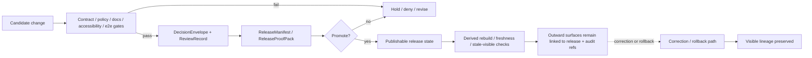

<!-- [KFM_META_BLOCK_V2]
doc_id: kfm://doc/REVIEW-NEEDED-UUID
title: release assembly
type: standard
version: v1
status: draft
owners: @bartytime4life
created: YYYY-MM-DD
updated: YYYY-MM-DD
policy_label: REVIEW-NEEDED
related: [../README.md, ../../README.md, ../../../README.md, ../../../.github/README.md, ../../../.github/workflows/README.md, ../../../.github/CODEOWNERS, ../../../contracts/README.md, ../../../policy/README.md, ../../../docs/README.md, ../runtime_proof/README.md, ../correction/README.md]
tags: [kfm, tests, e2e, release-assembly]
notes: [doc_id placeholder pending document-record verification, created/updated placeholders pending git-history verification, policy_label placeholder pending governance classification verification]
[/KFM_META_BLOCK_V2] -->

> [!NOTE]
> The meta block above keeps reviewable placeholders for `doc_id`, `created`, `updated`, and `policy_label` until git history and document-record metadata are reverified from a checked-out branch or governance record.

# release assembly

_Governed end-to-end proof surface for promotion, release evidence, publish-path integrity, and post-promotion lineage in Kansas Frontier Matrix._

> **Status:** experimental  
> **Owners:** `@bartytime4life`  
> **Path:** `tests/e2e/release_assembly/README.md`  
> **Repo fit:** leaf release / promotion / publish-path proof family under [`../README.md`](../README.md); downstream of [`../../README.md`](../../README.md), [`../../../README.md`](../../../README.md), [`../../../.github/README.md`](../../../.github/README.md), [`../../../.github/workflows/README.md`](../../../.github/workflows/README.md), [`../../../.github/CODEOWNERS`](../../../.github/CODEOWNERS), [`../../../contracts/README.md`](../../../contracts/README.md), [`../../../policy/README.md`](../../../policy/README.md), and [`../../../docs/README.md`](../../../docs/README.md); adjacent to [`../runtime_proof/README.md`](../runtime_proof/README.md) and [`../correction/README.md`](../correction/README.md)  
> **Quick jump:** [Scope](#scope) · [Repo fit](#repo-fit) · [Accepted inputs](#accepted-inputs) · [Exclusions](#exclusions) · [Current verified snapshot](#current-verified-snapshot) · [Directory tree](#directory-tree) · [Quickstart](#quickstart) · [Usage](#usage) · [Diagram](#diagram) · [Operating tables](#operating-tables) · [Task list / definition of done](#task-list--definition-of-done) · [FAQ](#faq) · [Appendix](#appendix)
>
> 
> 
> 
> 
> 
>
> [!IMPORTANT]
> Current public `main` proves this directory exists, but it does **not** prove executable suite depth, checked-in workflow gates, proof-pack emitters, or branch protection details.

Keep runner, workflow, and artifact-emission claims explicitly bounded until the checked-out branch is inspected.

---

## Scope

`release_assembly/` is the end-to-end verification family for the moment where a candidate stops being “a successful build” and becomes “a governable, publishable release.”

This directory exists to answer questions like:

- Can a candidate move into release-bearing state without losing manifest lineage, policy/review context, or correction posture?
- Does publish-path proof remain inspectable after promotion?
- Do docs, accessibility, and trust-visible release cues stay attached to the release rather than drifting into after-the-fact cleanup?
- Can derived delivery and outward-facing surfaces still point back to a known release scope?

In KFM terms, this family should protect the seam where **deployment success is still weaker than publication safety**.

### Status markers used here

| Marker | Meaning in this README |
|---|---|
| **CONFIRMED** | Visible in the current public repo or already stabilized in supplied KFM doctrine |
| **INFERRED** | Strongly implied by the repo/doc set, but not directly proven as mounted implementation |
| **PROPOSED** | Recommended release-assembly shape or behavior for this directory |
| **UNKNOWN** | Not verified from the current public tree or attached implementation evidence |
| **NEEDS VERIFICATION** | Review step required before treating a claim as current repo fact |

### Evidence boundary for this directory

| Area | Current posture |
|---|---|
| Directory existence | **CONFIRMED** |
| Directory contents beyond `README.md` on public `main` | **UNKNOWN** |
| Parent `tests/e2e/` family placement | **CONFIRMED** |
| Sibling `e2e` leaf family structure | **CONFIRMED** |
| Checked-in workflow YAML for merge-blocking release gates on public `main` | **NEEDS VERIFICATION** |
| Exact test runner, fixture layout, and harness depth | **NEEDS VERIFICATION** |
| Release-proof, correction, and fail-closed burden language | **CONFIRMED** in supplied March 2026 KFM manuals |

[Back to top](#release-assembly)

## Repo fit

### Path and role

This file documents the responsibility of:

```text
tests/e2e/release_assembly/
```

Within the broader repo, that family sits inside the `tests/e2e/` verification lane and is the natural home for **promotion / release / publish-path proof**.

### Upstream anchors

| Upstream file | Why it matters here |
|---|---|
| [`../README.md`](../README.md) | Defines `e2e/` as the whole-path proof umbrella and places `release_assembly/` beside `runtime_proof/` and `correction/` |
| [`../../README.md`](../../README.md) | Defines the broader `tests/` tree and names `e2e/release_assembly/` as the release / promotion / publish-path proof family |
| [`../../../README.md`](../../../README.md) | Establishes repo-wide verification-first posture |
| [`../../../.github/README.md`](../../../.github/README.md) | Frames `.github/` as the repository gatehouse for governance, review, CI/CD, and delivery evidence |
| [`../../../.github/workflows/README.md`](../../../.github/workflows/README.md) | Documents current workflow-lane reality and keeps CI claims bounded |
| [`../../../.github/CODEOWNERS`](../../../.github/CODEOWNERS) | Current ownership signal for `/tests/` |
| [`../../../contracts/README.md`](../../../contracts/README.md) | Keeps contract/testing language aligned with machine-readable backbone expectations |
| [`../../../policy/README.md`](../../../policy/README.md) | Keeps release checks aligned with default-deny / fail-closed policy posture |
| [`../../../docs/README.md`](../../../docs/README.md) | Reminds maintainers that docs are part of the trust surface, not a post-release extra |

### Adjacent e2e families

| Adjacent path | Boundary |
|---|---|
| [`../runtime_proof/README.md`](../runtime_proof/README.md) | Request-time runtime outcomes, citation checks, and bounded answer behavior |
| [`../correction/README.md`](../correction/README.md) | Post-release correction, rollback, supersession, withdrawal, and visible lineage changes |

### Downstream expectations

Future executable cases, proof objects, archived drill evidence, and runner-local helpers that are specific to release proof belong under this directory **only when** the checked-out branch proves they exist.

### Current public footprint

As of the current public branch view, the only confirmed file in this directory is:

```text
tests/e2e/release_assembly/
└── README.md
```

Anything deeper than that belongs in `PROPOSED`, `INFERRED`, or `NEEDS VERIFICATION` territory until a checked-out branch proves it.

[Back to top](#release-assembly)

## Accepted inputs

Use this directory for artifacts that prove a release candidate is **publishable with lineage intact**, not merely executable.

Typical accepted inputs include:

- e2e cases that exercise candidate → release → publish-path transitions
- fixtures that validate manifest completeness, proof-pack completeness, and release linkage
- checks that docs/accessibility gates remain attached to release-bearing state
- cases that prove policy/review references survive release assembly
- cases that prove derived rebuild or stale-visible behavior still points to a known release
- checks that audit joins stay reconstructable across release objects
- negative cases where release should hold, deny, or remain candidate rather than promote
- runner-local notes or helpers **only when** they are specific to release assembly and not generic test infrastructure

> [!NOTE]
> March 2026 doctrine names release-bearing object families such as `ReleaseManifest`, `ReleaseProofPack`, `DecisionEnvelope`, `ReviewRecord`, `ProjectionBuildReceipt`, and `CorrectionNotice`. Treat those as doctrinal vocabulary, not as a claim that this directory already contains those exact checked-in files on public `main`.

## Exclusions

Do **not** use this directory for everything that merely touches release-like language.

Keep the following elsewhere:

| Does **not** belong here | Put it here instead |
|---|---|
| Schema-authoring source of truth | `contracts/`, `schemas/`, contract-specific test lanes |
| Request-time answer/citation proof | `../runtime_proof/` |
| Correction propagation and visible lineage under change | `../correction/` |
| Long-form operations manuals or release runbooks | `docs/` or `docs/runbooks/` once verified |
| Runtime service code or release builders themselves | app/package/runtime locations, not `tests/e2e/` |
| Scratch logs, ad hoc screenshots, manual exports | ephemeral local artifacts, not committed test surfaces |
| Historical workflow names without current-branch proof | `.github/workflows/README.md` or review notes as signal, not release proof |

[Back to top](#release-assembly)

## Current verified snapshot

The following is safe to say from current public repo evidence:

- `tests/e2e/release_assembly/` exists.
- The current public tree shows this directory as README-only.
- `tests/e2e/` also contains `runtime_proof/` and `correction/`.
- `tests/e2e/README.md` and `tests/README.md` both assign `release_assembly/` the release / promotion / publish-path proof role.
- `/.github/workflows/` is documented, but current public `main` does not show checked-in workflow YAML there.
- `.github/workflows/README.md` explicitly records historical delete-run workflow names such as `release-evidence.yml` and `promote-and-reconcile.yml`.
- `/tests/` ownership is currently assigned to `@bartytime4life`.

The following are **not** yet proven from current public evidence:

- actual release-assembly cases
- runner choice
- fixture inventory
- proof-pack emitters
- required checks
- branch protection / merge-blocking settings
- archived release receipts or drill evidence
- current branch-local replacements, if any, for the deleted historical workflow names

> [!NOTE]
> Historical workflow names are useful branch-review clues, but they do **not** prove current checked-in YAML, current enforcement, or current merge blocking.

> [!WARNING]
> A placeholder directory can still carry a very real architectural burden.

Do not mistake “thin tree” for “low importance.”

[Back to top](#release-assembly)

## Directory tree

### Confirmed public snapshot

```text
tests/
├── README.md
└── e2e/
    ├── README.md
    ├── correction/
    │   └── README.md
    ├── release_assembly/
    │   └── README.md
    └── runtime_proof/
        └── README.md
```

### Growth rule for this directory

Prefer the **smallest real proving surface** over a decorative sublayout.

When this directory grows, keep that growth:

1. release-oriented,
2. fixture-backed,
3. negative-path aware,
4. obviously distinct from `runtime_proof/` and `correction/`,
5. honest about what is still `UNKNOWN`.

A future sublayout is acceptable only once it is backed by executable cases. Until then, avoid inventing busy folder structures for their own sake.

[Back to top](#release-assembly)

## Quickstart

### Branch-safe inspection commands

These commands assume nothing about the eventual test runner and are safe as a first review pass.

```bash
find tests/e2e/release_assembly -maxdepth 4 -type f | sort

sed -n '1,260p' tests/README.md
sed -n '1,240p' tests/e2e/README.md
sed -n '1,240p' tests/e2e/release_assembly/README.md

sed -n '1,220p' .github/README.md
sed -n '1,260p' .github/workflows/README.md
sed -n '1,200p' .github/CODEOWNERS

find .github/workflows -maxdepth 2 -type f | sort

grep -RIn \
  -e 'ReleaseManifest' \
  -e 'ReleaseProofPack' \
  -e 'DecisionEnvelope' \
  -e 'ReviewRecord' \
  -e 'ProjectionBuildReceipt' \
  -e 'RuntimeResponseEnvelope' \
  -e 'EvidenceBundle' \
  -e 'CorrectionNotice' \
  -e 'release-evidence.yml' \
  -e 'promote-and-reconcile.yml' \
  -e 'audit_ref' \
  -e 'docs_gate' \
  -e 'projection.stale' \
  tests contracts policy docs schemas .github . 2>/dev/null || true
```

### First local review pass

1. Confirm the directory still matches the public snapshot or explicitly record the branch delta.
2. Read [`../README.md`](../README.md) and [`../../README.md`](../../README.md) first so family boundaries stay stable.
3. Inspect [`../../../.github/README.md`](../../../.github/README.md) and [`../../../.github/workflows/README.md`](../../../.github/workflows/README.md) before claiming any CI or promotion gate behavior.
4. Treat historical workflow names as archaeology, not proof, unless the checked-out branch now contains their successors.
5. Check whether this branch introduces actual release fixtures, proof objects, or archived negative-path examples.
6. Refuse to call a case “release assembly” unless it proves something about promotion, publishability, release evidence, or post-promotion lineage.

### Safe first executable target

If this family is still scaffold-only, the safest first real addition is:

- one **candidate remains blocked** case
- one **candidate becomes publishable** case with inspectable release evidence and policy/review linkage
- one **post-promotion stale or correction-linked** case

That gives you positive proof, negative proof, and lineage pressure without assuming a large harness.

[Back to top](#release-assembly)

## Usage

### What this family is for

Use `release_assembly/` when the question is:

> “Can KFM prove that a candidate became a release in a way that stayed inspectable, policy-aware, review-aware, and correctable?”

That means this family should stay centered on:

- release manifests or equivalent release inventory proof
- proof-pack completeness
- docs/accessibility gate linkage
- review/policy linkage
- audit continuity
- post-promotion derived rebuild linkage
- visible stale / hold / deny / correction consequences where applicable

### Family-boundary guide

| If the question is… | Belongs here? | Better home when not |
|---|---:|---|
| Is a candidate publishable? | **Yes** | — |
| Did release refs, policy refs, and review refs stay joined? | **Yes** | — |
| Does request-time Focus answer cite or abstain? | No | `../runtime_proof/` |
| Does a correction propagate visibly after release? | Sometimes adjacent | usually `../correction/` |
| Is the contract shape valid in isolation? | Sometimes supporting | usually contract/schema-focused test lanes |
| Did the system merely deploy? | No, not enough | not a release-assembly success unless promotion proof also exists |
| Is this only a visual regression of the shell? | No | UI/surface-specific lanes |

### Operating principle

Release assembly should be the place where the repo proves this distinction clearly:

| Term | Meaning |
|---|---|
| **Build** | Artifact creation or packaging |
| **Deploy** | Runtime placement |
| **Promote / release** | Governed trust-state transition with evidence, policy, review, and correction posture |
| **Publish-path proof** | Demonstration that outward use remains explainable after promotion |

> [!NOTE]
> In KFM, “the build passed” is never enough.

This family exists so that “safe to show” must be proven separately.

[Back to top](#release-assembly)

## Diagram



[Back to top](#release-assembly)

## Operating tables

### Release-assembly obligations

| Release seam | This family should prove | Why it matters |
|---|---|---|
| Candidate → release inventory | Release-bearing object is complete enough to review and compare | Prevents “successful deploy” from masquerading as release truth |
| Policy / review linkage | Release still points to the decisions that allowed or constrained it | Keeps publishability machine-explainable |
| Docs / accessibility gate | Trust-facing documentation and basic public-surface obligations were not dropped | KFM treats docs as part of honesty, not decoration |
| Proof-pack completeness | Promotion carries enough evidence to reconstruct what changed and why | Prevents narrative-only release claims |
| Derived rebuild linkage | Tiles, exports, or other downstream outputs remain tied to known release scope | Protects authoritative-vs-derived separation |
| Audit continuity | Request/release/bundle/decision refs can still join after promotion | Makes disputes and failures explainable |
| Rollback / correction posture | Release can narrow, withdraw, supersede, or correct without losing lineage | Makes correction part of release engineering |

### Negative paths worth proving early

| Negative path | Expected outcome |
|---|---|
| Missing manifest references | Candidate remains blocked or incomplete |
| Missing policy/review linkage where required | No promotion |
| Docs or accessibility gate failed | Release is not publishable yet |
| Derived output older than declared freshness basis | Stale-visible, rebuild-required, or blocked |
| Audit refs do not join cleanly | Release proof is incomplete |
| Rollback/correction posture missing | Candidate cannot claim governed release readiness |

### Current public evidence vs burden

| Topic | Current public proof | Posture |
|---|---|---|
| Directory exists | Yes | **CONFIRMED** |
| Parent `e2e` family names this burden | Yes | **CONFIRMED** |
| `tests/README.md` names this burden | Yes | **CONFIRMED** |
| Historical release-related workflow names surface in public workflow docs | `release-evidence.yml` and `promote-and-reconcile.yml` are named as removed lanes | **CONFIRMED historical signal** |
| Checked-in executable release-assembly suite | Not shown on public `main` | **UNKNOWN** |
| Checked-in workflow YAML for release gating | Not shown on public `main` | **NEEDS VERIFICATION** |
| Proof-pack examples committed in this directory | Not shown on public `main` | **UNKNOWN** |
| Branch protection / required status checks | Not visible from repo files alone | **NEEDS VERIFICATION** |

[Back to top](#release-assembly)

## Task list / definition of done

- [ ] Keep this README synchronized with the actual checked-out directory, not just the public scaffold.
- [ ] Do not imply executable suite depth that the current branch cannot prove.
- [ ] Distinguish **build**, **deploy**, **promote**, and **publishable** in every new case.
- [ ] Keep docs/accessibility expectations attached to release assembly, not deferred elsewhere.
- [ ] Add negative-path fixtures as early as positive-path fixtures.
- [ ] Make audit and release references visible enough to inspect during review.
- [ ] Keep runtime-answer concerns in `runtime_proof/` unless they are specifically release-coupled.
- [ ] Keep correction-propagation concerns in `correction/` unless they are specifically release-assembly prerequisites.
- [ ] Keep historical workflow archaeology visibly separate from claims about current enforcement.
- [ ] Keep quickstart commands runner-safe until the active harness is verified.
- [ ] Leave `UNKNOWN` items visible when branch evidence is missing.

### Definition of done for the first real suite

A credible first implementation of this directory should prove at least:

1. one blocked candidate,
2. one publishable candidate,
3. one stale / rebuild / correction-linked post-promotion case,
4. one branch-visible explanation of how release evidence is inspected.

[Back to top](#release-assembly)

## FAQ

### Why is this separate from `runtime_proof/`?

Because a request-time proof and a release-assembly proof answer different questions. `runtime_proof/` is about outcome behavior at request time. `release_assembly/` is about whether promotion and publish-path evidence stayed joined in the first place.

### Why is this separate from `correction/`?

Correction is its own lifecycle burden. This directory may prove that a release *contains* rollback/correction posture, but the actual propagation and visible supersession behavior belongs in the correction family.

### Does a successful deploy count as success here?

No. A deploy can succeed while promotion, publishability, documentation, policy linkage, or correction posture is still incomplete.

### Do deleted workflow names prove current release gating?

No. They are useful historical or platform signals only. Current checked-in YAML, rulesets, required checks, and branch-local wiring still need direct verification on the branch under review.

### What should the very first committed test here prove?

Start with the smallest case that distinguishes **candidate** from **publishable release**. If a test cannot show that difference, it is probably in the wrong family.

### Why keep this README burden-first while the directory is still thin?

Because this directory’s risk is overclaiming. A release-assembly lane that sounds mature before it emits proof objects is worse than a thin directory that says exactly what still needs verification.

[Back to top](#release-assembly)

## Appendix

### Evidence basis used for this README revision

This README was revised against three evidence layers:

1. the current public repo shape and adjacent README conventions,
2. the current public workflow-lane documentation and visible delete-run history signals, treated as historical/platform clues rather than present-tree proof, and
3. the supplied March 2026 KFM doctrinal manuals that give this directory its release-proof, fail-closed, and correction-aware burden.

### Direct verification still needed before stronger claims

Before upgrading this README from burden-first scaffold to implementation-reporting README, inspect:

- the checked-out branch’s actual workflow YAML inventory
- whether any required status checks exist outside repo files
- the real test runner and invocation path
- whether release-proof objects or fixtures are already committed elsewhere
- whether archived release, rollback, or correction drills exist
- whether this branch introduces deeper subpaths under `tests/e2e/release_assembly/`
- whether the historical release-related workflow names now map to current equivalents elsewhere in the checked-out branch

### Reconciliation rule if the checked-out branch differs

If the checked-out branch contains more than the public scaffold:

1. keep the family boundary and burden language,
2. update the tree and quickstart first,
3. replace any `UNKNOWN` item with direct evidence,
4. keep historical workflow signal clearly labeled as historical unless the branch proves current files,
5. do **not** force code or files to mimic placeholder documentation paths.

### Maintenance note

This file should remain smaller than the doctrine it points to. Its job is to keep the directory honest, navigable, and reviewable in Git — not to become the only place where release law is described.
