<!-- [KFM_META_BLOCK_V2]
doc_id: kfm://doc/NEEDS-VERIFICATION
title: runtime_proof
type: standard
version: v1
status: draft
owners: @bartytime4life
created: NEEDS-VERIFICATION
updated: 2026-04-28
policy_label: public
related: [../README.md, ../../README.md, ../../contracts/README.md, ../../policy/README.md, ../../validators/README.md, ../../ci/README.md, ../release_assembly/README.md, ../correction/README.md, ../../../contracts/README.md, ../../../policy/README.md, ../../../schemas/README.md, ../../../docs/README.md, ../../../data/receipts/README.md, ../../../data/proofs/README.md, ../../../tools/validators/README.md, ../../../tools/ci/README.md, ../../../.github/CODEOWNERS, ../../../.github/workflows/README.md, ../../../.github/watchers/README.md, ../../../CONTRIBUTING.md]
tags: [kfm, tests, e2e, runtime-proof, runtime, evidence, citations, finite-outcomes, receipts, proofs, governed-api]
notes: [doc_id and created remain placeholders pending registry or git-history verification, updated is the current drafting date, owner follows visible tests-surface convention and should be rechecked in CODEOWNERS on the mounted branch, runner/toolchain/suite-depth/merge-gate status remain NEEDS VERIFICATION]
[/KFM_META_BLOCK_V2] -->

<a id="top"></a>

# `runtime_proof`

End-to-end request-time proof surface for KFM evidence resolution, citations, finite outward outcomes, trust-chain visibility, and fail-closed governed runtime behavior.

> [!NOTE]
> **Status:** `experimental`  
> **Owners:** `@bartytime4life`  
> **Path:** `tests/e2e/runtime_proof/README.md`  
> **Repo fit:** leaf end-to-end proof family under [`../README.md`](../README.md), subordinate to the broader [`../../README.md`](../../README.md) verification surface, and adjacent to [`../release_assembly/`](../release_assembly/) and [`../correction/`](../correction/).  
> **Quick jump:** [Scope](#scope) · [Repo fit](#repo-fit) · [Accepted inputs](#accepted-inputs) · [Exclusions](#exclusions) · [Directory tree](#directory-tree) · [Quickstart](#quickstart) · [Usage](#usage) · [Runtime proof model](#runtime-proof-model) · [Operating tables](#operating-tables) · [Task list](#task-list--definition-of-done) · [FAQ](#faq) · [Appendix](#appendix)


> [!IMPORTANT]
> `runtime_proof/` is not a generic smoke-test folder. A passing case here must prove a governed request-time path: scoped request, evidence resolution, policy checks, citation support, finite outward response, visible trust state, and audit/receipt linkage.

> [!WARNING]
> Do not upgrade this directory into a claim of mature executable coverage, required CI checks, or runtime readiness unless the mounted branch proves the runner, fixtures, emitted artifacts, and workflow enforcement directly.

---

## Scope

`tests/e2e/runtime_proof/` is the end-to-end proof family for runtime behavior that reaches outward-facing KFM surfaces.

It answers one question:

> Can a KFM request produce a trustworthy outward runtime result **without bypassing evidence, policy, citations, review posture, or the governed API boundary**?

Runtime proof cases should exercise the request-time trust path, not merely assert that a handler returns data. A valid case should show why an outward result is allowed, why it abstains, why it is denied, or why it errors.

This family is responsible for:

- request-time `EvidenceRef` → `EvidenceBundle` resolution;
- finite runtime outcomes: `ANSWER`, `ABSTAIN`, `DENY`, `ERROR`;
- outward `RuntimeResponseEnvelope` shape and trust-state visibility;
- citation linkage for consequential claims;
- fail-closed handling when evidence, policy, citation, source authority, or runtime dependencies are missing;
- separation between runtime receipts, release proofs, and publication artifacts;
- generated actual-response artifacts when they help reviewer reconstruction.

[Back to top](#top)

---

## Repo fit

### Where this sits

| Layer | Path | Relationship |
|---|---|---|
| Parent E2E family | [`../README.md`](../README.md) | Defines end-to-end proof families and keeps `runtime_proof/`, `release_assembly/`, and `correction/` separate. |
| Repo verification surface | [`../../README.md`](../../README.md) | Owns broad test-family meaning, accepted proof boundaries, and suite-level expectations. |
| Runtime proof leaf | `./README.md` | Defines request-time proof expectations for this directory. |
| Release assembly sibling | [`../release_assembly/`](../release_assembly/) | Publication and proof-pack completeness live there, not here. |
| Correction sibling | [`../correction/`](../correction/) | Supersession, withdrawal, rollback, and correction-lineage drills live there, not here. |
| Contract / policy / schema adjacency | [`../../../contracts/`](../../../contracts/), [`../../../policy/`](../../../policy/), [`../../../schemas/`](../../../schemas/) | Machine authority should be defined there; runtime proof should consume those shapes, not redefine them. |
| Receipt / proof adjacency | [`../../../data/receipts/`](../../../data/receipts/), [`../../../data/proofs/`](../../../data/proofs/) | Receipts record what happened; proofs support release-grade claims. Keep them distinct. |
| CI / workflow adjacency | [`../../../tools/ci/`](../../../tools/ci/), [`../../../.github/workflows/`](../../../.github/workflows/) | Workflow and renderer helpers may invoke runtime proof, but this README should not claim merge-gate enforcement without branch evidence. |

### Upstream / downstream

**Upstream inputs** normally come from contracts, schemas, policy decisions, source descriptors, evidence bundles, and governed API route fixtures.

**Downstream consumers** may include CI summaries, reviewer artifacts, Evidence Drawer payloads, Focus Mode fixtures, and release-readiness discussions. They do not become publication proof unless release assembly validates and promotes them.

[Back to top](#top)

---

## Accepted inputs

Runtime proof cases belong here when they exercise the whole request-time path.

| Input | Status | Belongs here when… |
|---|---:|---|
| `request.json` | expected | It represents the public or governed request shape under test. |
| `expected.decision.json` | optional / recommended | The case needs explicit policy or decision-envelope comparison. |
| `expected.envelope.json` | expected | The outward runtime envelope is the main assertion target. |
| `expected.drawer.json` | optional | The case proves shell-visible Evidence Drawer payload semantics. |
| `actual.response.json` | generated | It is emitted for reviewer comparison and is not silently promoted into truth. |
| `run_receipt.json` | optional generated | It records process memory for the run, not release proof. |
| `ai_receipt.json` | optional generated | It records model-adapter metadata when a governed model adapter participates. |
| `README.md` leaf notes | expected for domain leaves | A domain-specific runtime-proof leaf needs scope, fixtures, exclusions, and open verification items. |
| test modules | branch-verified only | Use the repo-native runner only after the mounted branch proves it. |

> [!TIP]
> Keep runtime fixtures small and reason-named. A narrow `deny_sensitive_exact_location/` case is more useful than a broad “full runtime happy path” that hides policy and evidence obligations.

[Back to top](#top)

---

## Exclusions

This directory is not the right home for every runtime-adjacent concern.

| Exclusion | Why it stays out | Put it here instead |
|---|---|---|
| Contract shape only | No whole request-time runtime burden. | [`../../../contracts/`](../../../contracts/) or [`../../../schemas/`](../../../schemas/) |
| Policy grammar only | Rule semantics without outward runtime behavior. | [`../../../policy/`](../../../policy/) or [`../../policy/`](../../policy/) |
| Source fetching / watcher behavior | Intake and watcher receipts are not outward runtime proof by themselves. | `pipelines/`, `tools/`, `data/receipts/`, or watcher docs |
| Release / promotion proof | Publish-path integrity is a different end-to-end burden. | [`../release_assembly/`](../release_assembly/) |
| Correction / rollback propagation | Correction lineage should stay distinct from request-time proof. | [`../correction/`](../correction/) |
| Accessibility-only checks | Keyboard, contrast, motion, or screen-reader behavior without runtime trust burden. | [`../../accessibility/`](../../accessibility/) |
| Reproducibility-only checks | Stable rerun hashes/counts without request-time trust semantics. | [`../../reproducibility/`](../../reproducibility/) |
| App, resolver, adapter, or provider implementation code | This is a test documentation and fixture surface, not runtime implementation. | `apps/`, `packages/`, or `infra/` |
| Raw model-provider smoke tests | KFM runtime proof must stay behind governed adapters and envelopes. | Provider-specific adapter tests or ops docs |

[Back to top](#top)

---

## Directory tree

### Current safe baseline

This README should not imply more mounted implementation depth than the active branch proves. Use local inspection before changing this tree.

```text
tests/
└── e2e/
    └── runtime_proof/
        └── README.md
```

### `PROPOSED` maturity direction

Use this as a growth model, not as a current-branch inventory claim.

```text
tests/e2e/runtime_proof/
├── README.md
├── cases/
│   ├── answer_public_safe/
│   ├── abstain_missing_evidence/
│   ├── deny_policy_blocked/
│   └── error_runtime_dependency_unavailable/
├── fixtures/
│   ├── evidence_bundles/
│   ├── requests/
│   ├── expected_envelopes/
│   └── expected_decisions/
└── snapshots/
    └── actual_response_examples/
```

### Domain leaf pattern

Add domain leaves only when executable or fixture-backed cases justify them.

```text
tests/e2e/runtime_proof/
└── <domain_or_feature>/
    ├── README.md
    ├── fixtures/
    │   └── <outcome_reason_name>/
    │       ├── request.json
    │       ├── expected.decision.json
    │       ├── expected.envelope.json
    │       └── expected.drawer.json
    └── test_<domain_or_feature>_runtime_proof.<ext>
```

[Back to top](#top)

---

## Quickstart

### 1) Inspect the active branch first

```bash
# inspect the current local runtime-proof surface
find tests/e2e/runtime_proof -maxdepth 5 -type d 2>/dev/null | sort
find tests/e2e/runtime_proof -maxdepth 5 -type f 2>/dev/null | sort

# inspect parent and sibling E2E docs
sed -n '1,260p' tests/e2e/README.md 2>/dev/null || true
sed -n '1,220p' tests/e2e/release_assembly/README.md 2>/dev/null || true
sed -n '1,220p' tests/e2e/correction/README.md 2>/dev/null || true

# inspect repo-level test family docs
sed -n '1,280p' tests/README.md 2>/dev/null || true
sed -n '1,220p' tests/contracts/README.md 2>/dev/null || true
sed -n '1,220p' tests/policy/README.md 2>/dev/null || true
sed -n '1,220p' tests/validators/README.md 2>/dev/null || true
sed -n '1,220p' tests/ci/README.md 2>/dev/null || true
```

### 2) Reconfirm governing vocabulary before inventing names

```bash
grep -RIn \
  -e 'EvidenceRef' \
  -e 'EvidenceBundle' \
  -e 'RuntimeResponseEnvelope' \
  -e 'DecisionEnvelope' \
  -e 'ANSWER' \
  -e 'ABSTAIN' \
  -e 'DENY' \
  -e 'ERROR' \
  -e 'RunReceipt' \
  -e 'AIReceipt' \
  -e 'ProofPack' \
  -e 'ReleaseManifest' \
  -e 'audit_ref' \
  -e 'citation' \
  tests contracts schemas policy docs apps packages tools data .github 2>/dev/null || true
```

### 3) Reconfirm ownership and workflow adjacency

```bash
sed -n '1,260p' .github/README.md 2>/dev/null || true
sed -n '1,220p' .github/CODEOWNERS 2>/dev/null || true
find .github/workflows -maxdepth 2 -type f 2>/dev/null | sort
sed -n '1,260p' .github/workflows/README.md 2>/dev/null || true
sed -n '1,260p' .github/watchers/README.md 2>/dev/null || true
```

### 4) Run only branch-verified commands

Do not add `npm test`, `pytest`, `cargo test`, Playwright, Cypress, Vitest, Jest, or workflow-required-check claims here until package files, runner config, and the active branch prove them.

```bash
# illustrative only; replace with repo-native command after verification
# pytest tests/e2e/runtime_proof -q
```

[Back to top](#top)

---

## Usage

### What counts as runtime proof

A runtime-proof case should show the outward behavior and the trust path that produced it.

```text
request
  -> governed API or runtime service
  -> EvidenceRef resolution
  -> EvidenceBundle
  -> policy precheck
  -> runtime resolver / bounded adapter
  -> citation validation
  -> policy postcheck
  -> RuntimeResponseEnvelope
  -> visible trust state and audit/receipt linkage
```

### What does not count

A case is not runtime proof if it only shows that:

- a route returns HTTP 200;
- a fixture matches a schema without request-time behavior;
- a model or adapter can produce text;
- a UI component can render a card;
- a policy rule parses;
- a generated artifact exists without evidence, citation, policy, and trust-state context.

### Case naming

Use names that expose the reason and outcome.

Good examples:

```text
answer_public_safe_released_evidence/
abstain_missing_evidence_bundle/
abstain_conflicting_source_authority/
deny_unpublished_or_sensitive_context/
deny_raw_work_quarantine_context/
error_policy_engine_unavailable/
error_malformed_runtime_envelope/
```

Avoid vague names:

```text
happy_path/
test1/
full_stack/
runtime_smoke/
model_response/
```

[Back to top](#top)

---

## Runtime proof model

```mermaid
flowchart LR
    A["request.json<br/>scoped user/runtime request"] --> B["Governed runtime boundary"]
    B --> C["EvidenceRef resolution"]
    C --> D["EvidenceBundle<br/>published / policy-safe context"]
    D --> E["Policy precheck"]
    E --> F{"Allowed to continue?"}
    F -- "no" --> G["RuntimeResponseEnvelope<br/>DENY or ABSTAIN"]
    F -- "yes" --> H["Runtime resolver / bounded adapter"]
    H --> I["Citation validation"]
    I --> J["Policy postcheck"]
    J --> K{"Release outward response?"}
    K -- "yes" --> L["RuntimeResponseEnvelope<br/>ANSWER"]
    K -- "no" --> M["RuntimeResponseEnvelope<br/>ABSTAIN / DENY / ERROR"]
    L --> N["actual.response.json<br/>review artifact"]
    M --> N
    L --> O["RunReceipt / AIReceipt<br/>process memory"]
    M --> O
    L --> P["Evidence Drawer payload<br/>optional shell-visible fixture"]
    M --> P
    O -. "not release proof" .-> Q["data/receipts/"]
    R["release_assembly/"] -. "separate publication burden" .-> S["ProofPack / ReleaseManifest"]
```



> [!IMPORTANT]
> Runtime proof can inform release readiness, but it is not itself a release proof. Publication still needs release assembly, catalog closure, review state, and rollback/correction surfaces.

[Back to top](#top)

---

## Operating tables

### Outcome semantics

| Outcome | Runtime meaning | Minimum proof expectation |
|---|---|---|
| `ANSWER` | Evidence exists, is in scope, policy-safe, citation-supported, and outward response is allowed. | Envelope contains supported claim/citation linkage, evidence bundle reference, policy decision reference, trust state, and audit reference. |
| `ABSTAIN` | KFM should not answer because support is missing, stale, conflicted, too broad, or unresolved. | Envelope explains insufficiency safely and does not invent evidence or hide uncertainty. |
| `DENY` | KFM must not answer because policy, rights, sensitivity, source authority, release state, or boundary rules block it. | Envelope preserves denial reason and obligations without leaking restricted detail. |
| `ERROR` | The request or runtime path failed unexpectedly or a required dependency was unavailable/malformed. | Envelope reports failure without converting it into fake abstention, denial, or answer content. |

### Runtime proof artifacts

| Artifact | Role | Commit posture |
|---|---|---|
| `request.json` | Stable request fixture. | Commit when the case is accepted. |
| `expected.decision.json` | Expected policy or decision object. | Commit when branch has the contract. |
| `expected.envelope.json` | Expected outward `RuntimeResponseEnvelope`. | Commit when branch has the contract. |
| `expected.drawer.json` | Optional shell-facing Evidence Drawer expectation. | Commit only when drawer contract exists or is clearly proposed. |
| `actual.response.json` | Generated review comparison artifact. | Commit rarely; prefer CI upload or local review output unless intentionally blessed. |
| `run_receipt.json` | Process memory for what happened. | Keep separate from proof; storage path must match repo convention. |
| `ai_receipt.json` | Model-adapter invocation metadata. | Include only for governed adapter paths; do not store hidden chain-of-thought. |

### Boundary checks

| Check | Required posture |
|---|---|
| Evidence resolution | Server-side or governed runtime-side; no public shortcut to canonical/raw stores. |
| RAW / WORK / QUARANTINE | Must not be used as public runtime context. |
| Policy engine unavailable | Fail closed as `DENY` or `ERROR`, never silently allow. |
| Citation validation failure | Prevent unsupported `ANSWER`; usually `ABSTAIN` or `ERROR` depending on cause. |
| Model runtime | Must be behind a provider-neutral governed adapter; no browser-to-model-runtime path. |
| Receipts | Process memory only; do not treat receipts as release proof. |
| Proof packs | Release-grade proof belongs to release assembly. |
| Negative states | `ABSTAIN`, `DENY`, and `ERROR` are first-class outcomes, not UX defects to smooth away. |

[Back to top](#top)

---

## Task list / definition of done

A runtime-proof case is ready for review when:

- [ ] The active branch inventory was inspected before adding or renaming paths.
- [ ] The case belongs in `runtime_proof/`, not in contracts, policy, integration, accessibility, reproducibility, release assembly, or correction.
- [ ] The request fixture is small, scoped, and reason-named.
- [ ] Evidence refs resolve to an evidence bundle or the missing/conflicted support is intentionally tested.
- [ ] Policy precheck and postcheck expectations are visible.
- [ ] The outward response uses only `ANSWER`, `ABSTAIN`, `DENY`, or `ERROR`.
- [ ] Consequential `ANSWER` claims have citation support.
- [ ] Negative outcomes are asserted directly.
- [ ] No fixture or helper reads RAW, WORK, QUARANTINE, or private source context as a public runtime path.
- [ ] Receipts, proofs, release manifests, and review artifacts are not collapsed into one object.
- [ ] Generated actual responses do not silently overwrite checked-in expected truth.
- [ ] Runner/toolchain commands are documented only after branch verification.
- [ ] Documentation and open verification notes were updated with the case.

[Back to top](#top)

---

## FAQ

### Is `runtime_proof/` a browser E2E folder?

No. It may include shell-visible expectations, but its primary burden is request-time governed runtime behavior. Browser-only assertions belong elsewhere unless they prove the trust path around the runtime response.

### Can a runtime-proof case call a model provider?

Only through the governed adapter boundary, and only when the branch already proves the provider-neutral path. Deterministic mock or null adapters are preferred for first-slice tests.

### Can an `actual.response.json` file be committed?

Yes, but sparingly. Prefer generated artifacts for review unless the file is intentionally blessed as a stable snapshot.

### What is the difference between runtime proof and release assembly?

Runtime proof asks whether a request-time outcome is trustworthy. Release assembly asks whether a publication bundle is complete, reviewed, cataloged, rollback-ready, and eligible for release.

### What is the difference between a receipt and a proof?

A receipt records what happened during a run. A proof supports a release-grade claim. Runtime proof may emit receipts, but release proof remains a separate publication burden.

[Back to top](#top)

---

## Appendix

<details>
<summary>Appendix A — Minimal fixture family template</summary>

```text
tests/e2e/runtime_proof/<domain_or_feature>/fixtures/
├── answer_public_safe_released_evidence/
│   ├── request.json
│   ├── expected.decision.json
│   ├── expected.envelope.json
│   └── expected.drawer.json
├── abstain_missing_evidence_bundle/
│   ├── request.json
│   ├── expected.decision.json
│   └── expected.envelope.json
├── deny_policy_blocked/
│   ├── request.json
│   ├── expected.decision.json
│   └── expected.envelope.json
└── error_runtime_dependency_unavailable/
    ├── request.json
    ├── expected.decision.json
    └── expected.envelope.json
```

</details>

<details>
<summary>Appendix B — Illustrative RuntimeResponseEnvelope checklist</summary>

This is illustrative. Use the branch’s canonical schema when available.

```json
{
  "outcome": "ANSWER | ABSTAIN | DENY | ERROR",
  "answer": "string or null",
  "claims": [],
  "citations": [],
  "evidence_bundle_ref": "kfm://evidence-bundle/...",
  "citation_validation_ref": "kfm://citation-validation/...",
  "policy_decision_ref": "kfm://policy-decision/...",
  "obligations": [],
  "audit_ref": "kfm://audit/...",
  "trust_state": {}
}
```

</details>

<details>
<summary>Appendix C — Glossary</summary>

| Term | Meaning in this directory |
|---|---|
| `EvidenceRef` | Reference that must resolve before runtime claims can be trusted. |
| `EvidenceBundle` | Bounded support package for request-time claims or abstentions. |
| `RuntimeResponseEnvelope` | Outward response wrapper that carries finite outcome, support, policy/citation links, and trust state. |
| `DecisionEnvelope` | Policy or decision object that explains allow/abstain/deny/error posture. |
| `RunReceipt` | Process-memory record of a run. |
| `AIReceipt` | Model-adapter metadata when governed AI participates. |
| `ProofPack` | Release-grade verification object; not the same as a runtime receipt. |
| `ReleaseManifest` | Publication bundle manifest used by release assembly. |
| `Evidence Drawer` | Shell-visible trust object that keeps evidence one hop away from consequential claims. |
| `Focus Mode` | Governed AI/user-assistance surface that consumes envelopes and evidence, not raw model output. |

</details>

<details>
<summary>Appendix D — Maintainer pre-publish checklist</summary>

- [ ] Badges, status, owners, quick jumps, accepted inputs, exclusions, and repo fit are present.
- [ ] Relative links are valid from `tests/e2e/runtime_proof/README.md`.
- [ ] Mermaid diagram reflects the governed request-time path.
- [ ] No mature runner, workflow, or branch-protection claim appears without branch evidence.
- [ ] Negative outcomes are visible in tables and definition of done.
- [ ] Receipts and proofs remain separated.
- [ ] Proposed growth paths are labeled as proposed, not current inventory.
- [ ] KFM meta block placeholders remain reviewable.
- [ ] Documentation changes preserve stable `#top`, `#scope`, `#repo-fit`, `#accepted-inputs`, `#exclusions`, `#directory-tree`, `#quickstart`, `#usage`, and `#task-list--definition-of-done` anchors.

</details>

[Back to top](#top)
