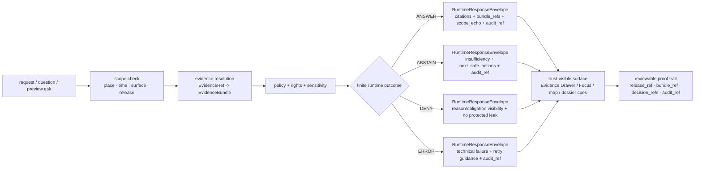

<!-- [KFM_META_BLOCK_V2]
doc_id: kfm://doc/NEEDS_VERIFICATION_UUID
title: runtime_proof
type: standard
version: v1
status: draft
owners: @bartytime4life
created: YYYY-MM-DD
updated: YYYY-MM-DD
policy_label: NEEDS_VERIFICATION
related: [README.md, CONTRIBUTING.md, tests/README.md, tests/e2e/README.md, contracts/README.md, policy/README.md, schemas/README.md, docs/README.md, .github/CODEOWNERS, .github/workflows/README.md]
tags: [kfm, tests, e2e, runtime-proof]
notes: [doc_id, created, updated, and policy_label need verification; owner is derived from the current public-main /tests/ CODEOWNERS mapping]
[/KFM_META_BLOCK_V2] -->

# runtime_proof

_End-to-end runtime proof surface for KFM request-time evidence resolution, citations, finite answer outcomes, and fail-closed trust behavior._

> [!NOTE]
> The meta block remains `status: draft` and keeps reviewable placeholders for `doc_id`, `created`, `updated`, and `policy_label` until document-record metadata is reverified from repo history or governance records.
> The impact block below describes the current maturity of the `runtime_proof/` surface itself.

> **Status:** experimental  
> **Owners:** `@bartytime4life`  
> **Path:** `tests/e2e/runtime_proof/README.md`  
> **Repo fit:** leaf end-to-end proof family under [`../README.md`](../README.md) for request-time governed outcomes; downstream of [`../../README.md`](../../README.md), [`../../../README.md`](../../../README.md), [`../../../contracts/README.md`](../../../contracts/README.md), [`../../../policy/README.md`](../../../policy/README.md), [`../../../schemas/README.md`](../../../schemas/README.md), [`../../../docs/README.md`](../../../docs/README.md), [`../../../.github/CODEOWNERS`](../../../.github/CODEOWNERS), [`../../../.github/workflows/README.md`](../../../.github/workflows/README.md), and [`../../../CONTRIBUTING.md`](../../../CONTRIBUTING.md)  
> **Quick jump:** [Scope](#scope) · [Repo fit](#repo-fit) · [Accepted inputs](#accepted-inputs) · [Exclusions](#exclusions) · [Current verified snapshot](#current-verified-snapshot) · [Directory tree](#directory-tree) · [Quickstart](#quickstart) · [Usage](#usage) · [Diagram](#diagram) · [Tables](#tables) · [Task list / definition of done](#task-list--definition-of-done) · [FAQ](#faq) · [Appendix](#appendix)  
>      
>
> [!IMPORTANT]
> Use this family when the main question is **what the governed system emits at request time** — especially evidence resolution, citation behavior, scope echo, and the finite outcomes `ANSWER`, `ABSTAIN`, `DENY`, and `ERROR`.
>
> [!WARNING]
> Current public repo evidence confirms the directory and its place in the test-family lattice, but it does **not** yet prove executable suite depth, a mounted runner, checked-in workflow YAML, or exercised runtime traces.
> Keep commands and case inventories evidence-bounded until the checked-out branch is verified.

---

## Scope

`tests/e2e/runtime_proof/` exists to prove one narrow but consequential thing well:

**When KFM receives a claim-bearing request, does it resolve admissible evidence, apply policy, emit a finite accountable outcome, and keep that outcome inspectable at the point of use?**

That burden is stricter than `tests/integration/`, narrower than generic end-to-end smoke testing, and different from `tests/e2e/release_assembly/` or `tests/e2e/correction/`. This family should exercise **request-time trust behavior**, not just page loading or API reachability.

### What counts as runtime proof here

- evidence resolution from `EvidenceRef`-like inputs to inspectable support
- citation-positive and citation-negative behavior
- bounded request-time outcomes: `ANSWER`, `ABSTAIN`, `DENY`, `ERROR`
- scope echo and evidence sufficiency signaling
- outward trust cues such as `bundle_ref`, `release_ref`, freshness basis, reason/obligation visibility, and `audit_ref`
- fail-closed behavior when evidence, rights, sensitivity, or resolver health cannot safely support completion

### Status vocabulary used in this README

| Marker | Meaning in this README |
|---|---|
| **CONFIRMED** | Visible on the current public branch or directly grounded in stable KFM doctrine |
| **INFERRED** | Strongly supported by adjacent repo docs and March 2026 doctrine, but not re-proven from a mounted checkout in this revision |
| **PROPOSED** | Repo-native build direction that fits KFM doctrine without claiming current implementation |
| **UNKNOWN** | Not verified strongly enough to describe as current repo reality |
| **NEEDS VERIFICATION** | A command, runner, case layout, workflow, or runtime detail that should be checked on the checked-out branch before merge |

[Back to top](#runtime_proof)

## Repo fit

**Path:** `tests/e2e/runtime_proof/README.md`  
**Role:** leaf README for request-time runtime and trust-surface proof under `tests/e2e/`.

### Upstream and adjacent anchors

| Relation | Path | Why it matters | Status |
|---|---|---|---|
| Parent e2e family | [`../README.md`](../README.md) | defines the whole-path proof family and names `runtime_proof/` as one of three visible leaves | **CONFIRMED** |
| Parent test lattice | [`../../README.md`](../../README.md) | assigns `runtime_proof/` to request-time evidence, citations, and finite answer outcomes | **CONFIRMED** |
| Repo root posture | [`../../../README.md`](../../../README.md) | keeps this family aligned with the repo’s governed, evidence-first, map-first posture | **CONFIRMED** |
| Contribution contract | [`../../../CONTRIBUTING.md`](../../../CONTRIBUTING.md) | keeps claims, commands, and workflow references evidence-bounded | **CONFIRMED** |
| Ownership boundary | [`../../../.github/CODEOWNERS`](../../../.github/CODEOWNERS) | establishes review ownership for `/tests/` | **CONFIRMED** |
| Workflow adjacency | [`../../../.github/workflows/README.md`](../../../.github/workflows/README.md) | current public automation visibility and its limits live here | **CONFIRMED** |
| Contract source | [`../../../contracts/README.md`](../../../contracts/README.md) | runtime proof should consume authoritative contracts, not restate them | **CONFIRMED** |
| Schema boundary | [`../../../schemas/README.md`](../../../schemas/README.md) | avoid creating a second schema home inside tests | **CONFIRMED** |
| Policy boundary | [`../../../policy/README.md`](../../../policy/README.md) | reason/obligation logic and deny-by-default behavior belong there when policy is the main unit of work | **CONFIRMED** |
| Human-readable runbooks | [`../../../docs/README.md`](../../../docs/README.md) | runtime proof should stay synchronized with runbooks and operator guidance | **CONFIRMED** |
| Neighbor leaf | [`../release_assembly/README.md`](../release_assembly/README.md) | use that leaf when publish-path proof is the main question | **CONFIRMED** |
| Neighbor leaf | [`../correction/README.md`](../correction/README.md) | use that leaf when rollback, supersession, or correction propagation is the main question | **CONFIRMED** |

### Working rule

Keep this directory **burden-led**. If a case can be proved more honestly as contract validation, policy validation, accessibility verification, or smaller integration work, move it there first. Use `runtime_proof/` only when the trust-bearing question is truly request-time and whole-path.

[Back to top](#runtime_proof)

## Accepted inputs

Accepted inputs for this family are the **smallest artifacts needed to prove a request-time trust outcome honestly**.

| Accepted input | What belongs here | Status posture |
|---|---|---|
| Thin whole-path scenarios | one narrow request, one bounded scope, one visible runtime outcome | **CONFIRMED** as burden / exact file layout **NEEDS VERIFICATION** |
| Reused authoritative fixtures | contract examples, policy fixtures, bundle examples, or public-safe release-backed samples reused from their owning homes | **CONFIRMED** as direction |
| Evidence-resolution traces | positive or negative traces that prove how support was resolved or why resolution failed closed | **CONFIRMED** as burden / mounted inventory **NEEDS VERIFICATION** |
| Runtime envelope examples | `RuntimeResponseEnvelope`-shaped examples or equivalent emitted metadata for `ANSWER`, `ABSTAIN`, `DENY`, and `ERROR` | **CONFIRMED** as burden / exact local storage **NEEDS VERIFICATION** |
| Citation-negative cases | uncited, empty-scope, stale-scope, or mismatched-scope requests that must not leak fluent confidence | **CONFIRMED** |
| Surface-state evidence | snapshots, logs, or outward cues proving that abstained, denied, stale-visible, or errored states remain legible | **INFERRED / PROPOSED** |
| Audit and comparison output | reports or traces that make the outcome reconstructable after the run | **INFERRED / PROPOSED** |

## Exclusions

This directory is **not** the place for every runtime-adjacent concern.

| Exclusion | Why it stays out | Put it here instead |
|---|---|---|
| Pure contract-shape validation | schema or example drift without whole-path runtime burden | [`../../../contracts/`](../../../contracts/) and [`../../../contracts/README.md`](../../../contracts/README.md) |
| Policy grammar by itself | rule semantics without a broader request-time slice | [`../../../policy/`](../../../policy/) and [`../../../policy/README.md`](../../../policy/README.md) |
| Release or promotion proof | publish-path integrity is a different end-to-end burden | [`../release_assembly/`](../release_assembly/) |
| Rollback, supersession, withdrawal, or correction propagation as the main topic | belongs in the correction leaf, not mixed into every runtime case | [`../correction/`](../correction/) |
| Accessibility-only checks | keyboard, motion, contrast, or non-color-only cues without broader runtime behavior | [`../../accessibility/README.md`](../../accessibility/README.md) |
| Reproducibility-only checks | stable digests, counts, or rerun sameness without a request-time trust question | [`../../reproducibility/README.md`](../../reproducibility/README.md) |
| Runtime implementation code | app, resolver, or adapter code is not test documentation | `apps/`, `packages/`, or `infra/` |
| Runbooks and operator prose | documentation is not executable proof | `docs/` and runbook-owning surfaces |

[Back to top](#runtime_proof)

## Current verified snapshot

The current public-branch evidence used for this revision supports the following:

- `tests/e2e/runtime_proof/` exists as a visible leaf under `tests/e2e/`.
- `tests/README.md` assigns this leaf to **request-time evidence, citations, and finite answer outcomes**.
- `tests/e2e/README.md` places `runtime_proof/` beside `release_assembly/` and `correction/` as one of the three current end-to-end proof leaves.
- `/tests/` ownership currently resolves to `@bartytime4life`.
- Public `.github/workflows/` currently exposes `README.md` only; checked-in workflow YAML and merge-blocking automation are **not** proven from the visible public tree alone.
- `.github/workflows/README.md` also records prior workflow activity and deleted workflow filenames as historical reconstruction clues, but that history is **signal**, not proof of current checked-in YAML.
- Root `README.md` and `CONTRIBUTING.md` both treat public `main` as a useful baseline rather than final branch truth; the checked-out branch under review should outrank it when available.
- Exact runner/toolchain, executable suite depth, fixture density, emitted proof objects, screenshot baseline inventory, and required checks remain **NEEDS VERIFICATION**.

> [!IMPORTANT]
> Public `main` is a useful baseline, not the final merge authority. Reconcile this README against the checked-out branch, local inventory, and real runner surface before treating any path, command, or workflow claim as settled.

> [!NOTE]
> This README intentionally does **not** claim that `runtime_proof/` already contains mature executable coverage. It documents the family boundary honestly so executable proof can grow into it without overclaiming.

## Directory tree

### Current confirmed snapshot

```text
tests/
└── e2e/
    └── runtime_proof/
        └── README.md
```

### Reading rule

Treat the tree above as **current visible branch truth** for this family. Do **not** silently turn directory presence into claims of harness maturity, required checks, or exercised runtime evidence.

[Back to top](#runtime_proof)

## Quickstart

### Safe inspection commands

These commands are safe because they inspect the current branch shape and vocabulary without assuming Playwright, Cypress, Vitest, Jest, pytest, or any other unverified runner.

```bash
# inspect the current local runtime-proof surface
find tests/e2e/runtime_proof -maxdepth 4 -type d 2>/dev/null | sort
find tests/e2e/runtime_proof -maxdepth 4 -type f 2>/dev/null | sort

# re-read the governing repo and test-family map before adding cases
sed -n '1,220p' README.md 2>/dev/null || true
sed -n '1,260p' CONTRIBUTING.md 2>/dev/null || true
sed -n '1,260p' tests/README.md 2>/dev/null || true
sed -n '1,260p' tests/e2e/README.md 2>/dev/null || true
sed -n '1,220p' contracts/README.md 2>/dev/null || true
sed -n '1,220p' policy/README.md 2>/dev/null || true
sed -n '1,220p' schemas/README.md 2>/dev/null || true
sed -n '1,220p' docs/README.md 2>/dev/null || true
sed -n '1,220p' .github/workflows/README.md 2>/dev/null || true

# inspect ownership and visible workflow adjacency
sed -n '1,220p' .github/CODEOWNERS 2>/dev/null || true
find .github/workflows -maxdepth 2 -type f 2>/dev/null | sort

# search for the runtime-proof vocabulary before inventing names
grep -RIn \
  -e 'EvidenceRef' \
  -e 'EvidenceBundle' \
  -e 'RuntimeResponseEnvelope' \
  -e 'ANSWER' \
  -e 'ABSTAIN' \
  -e 'DENY' \
  -e 'ERROR' \
  -e 'audit_ref' \
  -e 'bundle_ref' \
  -e 'release_ref' \
  -e 'citation' \
  tests contracts policy schemas docs .github 2>/dev/null || true
```

### First local review pass

1. Confirm whether the checked-out branch intentionally differs from public `main`, and update this README if it does.
2. Confirm whether the checked-out branch still matches the public `tests/e2e/runtime_proof/` shape.
3. Confirm whether this family contains executable cases or only documentation scaffolding.
4. Confirm the actual runner/toolchain before documenting any execution command.
5. Confirm whether the case is honestly request-time proof or belongs in `contracts/`, `policy/`, `integration/`, `reproducibility/`, or `accessibility/`.
6. Confirm whether negative paths exist, not only happy-path success.
7. Confirm whether emitted traces preserve scope, citations, decision linkage, and `audit_ref`.
8. Confirm whether runtime proof stays inside the governed API path and does not bypass release, policy, or evidence resolution.

> [!TIP]
> Inspection-first is safer than guessing a toolchain. Do not document `npm`, `pnpm`, `pytest`, browser harness, or GitHub required-check commands here until the checked-out branch proves them directly.

[Back to top](#runtime_proof)

## Usage

### What `runtime_proof/` is

`runtime_proof/` is:
- the leaf family for **request-time** governed proof
- the place where KFM demonstrates that evidence resolution, citation behavior, policy shaping, and finite runtime outcomes stay honest under pressure
- the family that should make **negative outcomes** as visible and reviewable as positive ones
- the end-to-end lane that proves no polished, uncited “fifth outcome” slips through

### What `runtime_proof/` is not

`runtime_proof/` is **not**:
- a generic UI smoke-test area
- a substitute for contract authority or schema-home decisions
- a duplicate home for policy bundles or reason/obligation registries
- a place to hide unverified runner guesses behind broad “coverage” language
- a scratch pad for local experiments that cannot reconstruct evidence and decision linkage

### Choose the smallest honest boundary first

| Put the work here when… | Better home |
|---|---|
| the main risk is local deterministic behavior | `tests/unit/` |
| the main risk is schema or example drift | `tests/contracts/` |
| the main risk is policy logic or reason-code tables | `tests/policy/` |
| a real boundary matters but the slice is smaller than full request-time proof | `tests/integration/` |
| the main burden is release / publish-path integrity | `tests/e2e/release_assembly/` |
| the main burden is correction / supersession / stale-visible propagation | `tests/e2e/correction/` |
| the question is what a governed request emits at runtime | `tests/e2e/runtime_proof/` |

## Diagram



## Tables

### Outcome burden matrix

_KFM-shaped minimums: **CONFIRMED** as burden; exact field set remains **NEEDS VERIFICATION** until mounted contracts and examples are inspected._

| Outcome | What must be proven | Typical trigger | Minimum outward cues |
|---|---|---|---|
| `ANSWER` | support is sufficient, admissible, and policy-safe | released evidence resolves cleanly and citations are available | citations, `bundle_ref` or `bundle_refs`, `scope_echo`, `audit_ref` |
| `ABSTAIN` | evidence is insufficient, partial, stale, conflicting, or unresolved | ambiguous causal question, empty scope, or evidence-resolution insufficiency | insufficiency signal, next safe action, `audit_ref` |
| `DENY` | request is blocked by rights, sensitivity, actor role, or publication state | steward-only or prepublication ask, exact-location restriction, release state block | visible deny state, reason/obligation visibility, no protected leak, `audit_ref` |
| `ERROR` | reliable execution failed technically | resolver failure, missing proof objects, broken upstream dependency | explicit error state, retry or fallback guidance, `audit_ref` |

### Proof objects and where they should come from

| Object or cue | Why runtime proof cares | Authoritative home |
|---|---|---|
| `EvidenceBundle` | proves inspectable support for a runtime answer or visible claim | contracts / runtime docs and resolver implementation |
| `RuntimeResponseEnvelope` | makes outcomes finite, accountable, and reviewable | contracts / runtime docs |
| reason and obligation vocabularies | keep negative outcomes explicit instead of prose drift | policy |
| `release_ref` and freshness basis | keep answers bounded to promoted scope | release / catalog / docs |
| `audit_ref` | reconstructs what happened after the request | runtime / observability / policy surfaces |
| outward trust cues | make abstained, denied, stale-visible, or errored states legible | UI / docs / accessibility surfaces |

## Task list / definition of done

- [ ] At least one thin runtime-proof scenario exists for each finite outcome the checked-out branch actually supports.
- [ ] Each scenario reuses authoritative contract and policy inputs instead of inventing a parallel schema or rules home.
- [ ] A citation-negative case proves that uncited or empty-scope answers fail closed.
- [ ] A policy-shaped negative case proves that rights, sensitivity, or publication state can deny without leaking protected detail.
- [ ] A technical failure case proves that resolver or proof-object failure emits `ERROR`, not polished bluffing.
- [ ] Each case preserves visible request-time linkage such as `bundle_ref`, `release_ref`, decision linkage, or `audit_ref`, where the current runtime contract expects them.
- [ ] The checked-out branch proves the actual runner/toolchain before this README names any execution command.
- [ ] The checked-out branch has been reconciled against the public-main baseline, and any local deltas are explicit in this README or the corresponding PR.
- [ ] If UI or screenshot evidence is used, outward trust cues remain legible without relying on color alone.
- [ ] Parent docs stay synchronized when this leaf’s meaning or local structure changes.
- [ ] No scenario bypasses the governed API or promoted scope.

> [!IMPORTANT]
> A green end-to-end result is not enough. This family is complete only when a reviewer can still explain **why** the outcome was safe, bounded, and truthful.

[Back to top](#runtime_proof)

## FAQ

### Is this the place to prove that a schema parses?
Not by itself. If the main risk is schema shape or example validity, use `tests/contracts/`. Escalate here only when the question becomes request-time and whole-path.

### Is this the place to prove policy grammar or reason-code tables?
Not by themselves. Keep policy logic authoritative in `policy/` and `tests/policy/`. Use `runtime_proof/` when policy must be exercised together with scope, evidence resolution, and outward runtime behavior.

### Can this directory hold happy-path-only demos?
It should not. KFM doctrine treats negative outcomes as first-class trust-preserving states. A runtime-proof family without `ABSTAIN`, `DENY`, or `ERROR` coverage is incomplete.

### Should this README document concrete runner commands?
Only after the checked-out branch proves them. This document stays inspection-first until a mounted checkout, workflow catalog, and local runner surface are directly verified.

### Does public `main` settle the final runtime-proof inventory?
No. Use public `main` as a baseline when a local checkout is unavailable, but the checked-out branch under review is the stronger source of truth for merge decisions.

### Does every runtime-proof case need UI screenshots?
No. Use the smallest honest proof surface. But when a trust cue is user-visible — especially for abstained, denied, stale-visible, or errored states — outward evidence should remain reviewable.

## Appendix

<details>
<summary>Candidate scenario pack (<strong>PROPOSED</strong> / <strong>NEEDS VERIFICATION</strong>)</summary>

These are candidate scenario names and burdens, not asserted current inventory.

| Candidate case | What it would prove | Why it belongs here |
|---|---|---|
| `answer_release_backed_scope` | `ANSWER` with resolvable evidence and bounded scope echo | positive runtime proof |
| `abstain_partial_evidence` | `ABSTAIN` when support is partial or conflicting | insufficiency stays honest |
| `deny_sensitive_or_unreleased_scope` | `DENY` without leaking restricted detail | fail-closed rights / sensitivity behavior |
| `error_resolver_unavailable` | `ERROR` with retry-safe outward behavior | technical failure stays explicit |
| `citation_negative_blocks_answer` | no uncited convenience fallback | core KFM cite-or-abstain rule |
| `stale_visible_runtime_state` | stale or degraded support remains visible, not silently polished away | trust cue remains legible |
| `focus_scope_echo_and_next_safe_action` | runtime response echoes bounded scope and safe follow-up | Focus-style governed assistance stays bounded |

</details>

<details>
<summary>Suggested review questions</summary>

- Does this case prove a **request-time** question, or is it really contract, policy, integration, or release work?
- What evidence object or outward cue makes the result reconstructable?
- What negative outcome should appear if evidence, rights, or resolver health fails?
- Does the case stay inside promoted scope and the governed API path?
- If a reviewer disputes the result, can they follow the same lineage without leaving the trust path?

</details>
