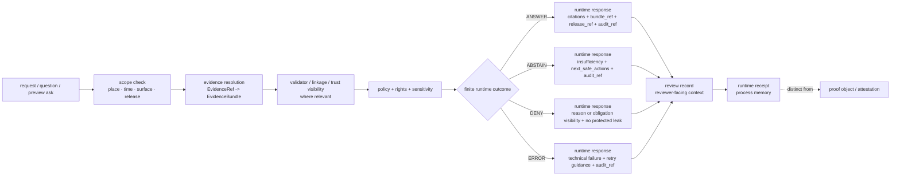

<!-- [KFM_META_BLOCK_V2]
doc_id: kfm://doc/tests-e2e-runtime-proof-readme
title: runtime_proof
type: standard
version: v1
status: draft
owners: [@bartytime4life]
created: NEEDS_VERIFICATION__YYYY-MM-DD
updated: 2026-04-18
policy_label: public
related: [../README.md, ../../README.md, ../../contracts/README.md, ../../policy/README.md, ../../schemas/README.md, ../../docs/README.md, ../../data/receipts/README.md, ../../data/proofs/README.md, ../../tools/validators/README.md, ../../tools/attest/README.md, ../../tools/ci/README.md, ../../.github/CODEOWNERS, ../../.github/workflows/README.md, ../../.github/watchers/README.md, ../../CONTRIBUTING.md, ../release_assembly/README.md, ../correction/README.md, ./hydrology/README.md, ./hydrology/streamflow/README.md, ./air/pm25/README.md]
tags: [kfm, tests, e2e, runtime-proof, runtime, evidence, citations, receipts, proofs]
notes: [doc_id and created remain placeholders pending git-history or governance-record verification. Updated to align the runtime_proof family with hydrology and PM2.5 child leaves, clearer separation among runtime responses, review records, receipts, proofs, validators, and attestation helpers, and the finite-outcome runtime contract. Current public evidence still proves this family mainly as a visible README-bearing leaf; executable suite depth, runner/toolchain, and merge-blocking automation remain bounded until checked directly on the working branch.]
[/KFM_META_BLOCK_V2] -->

<a id="top"></a>

# `runtime_proof`

End-to-end runtime proof surface for **KFM request-time evidence resolution**, **citations**, **finite outward outcomes**, **trust-chain visibility**, and **fail-closed governed behavior**.

<div align="left">


</div>

| Field | Value |
|---|---|
| **Status** | draft |
| **Owners** | `@bartytime4life` |
| **Path** | `tests/e2e/runtime_proof/README.md` |
| **Repo fit** | request-time runtime proof family under [`../README.md`](../README.md), with domain leaves such as [`./hydrology/README.md`](./hydrology/README.md) and [`./air/pm25/README.md`](./air/pm25/README.md) |
| **Runtime posture** | finite outward outcomes only: `ANSWER` · `ABSTAIN` · `DENY` · `ERROR` |
| **Evidence posture** | public-main family shape is visible; runner/toolchain, executable depth, and required checks remain bounded until branch verification |
| **Quick jump** | [Scope](#scope) · [Repo fit](#repo-fit) · [Accepted inputs](#accepted-inputs) · [Exclusions](#exclusions) · [Current verified snapshot](#current-verified-snapshot) · [Directory tree](#directory-tree) · [Quickstart](#quickstart) · [Usage](#usage) · [Runtime outcomes](#runtime-outcomes) · [Artifact split](#artifact-split) · [Diagram](#diagram) · [Tables](#tables) · [Task list / definition of done](#task-list--definition-of-done) · [FAQ](#faq) · [Appendix](#appendix) |

> [!IMPORTANT]
> Use this family when the main question is **what the governed system emits at request time** — especially evidence resolution, citation behavior, scope echo, trust cues, and the finite outcomes `ANSWER`, `ABSTAIN`, `DENY`, and `ERROR`.

> [!TIP]
> Keep the KFM trust split visible here:
>
> **runtime proof ≠ validator proof ≠ renderer proof ≠ review record authority ≠ receipt authority ≠ proof authority**
>
> - `tests/e2e/runtime_proof/` proves request-time whole-path behavior
> - `tests/validators/` proves validator and gate behavior
> - `tests/ci/` proves reviewer rendering behavior
> - `data/receipts/` remains process memory
> - `data/proofs/` remains higher-order trust storage
> - `tools/attest/` remains the sign/verify helper lane

> [!WARNING]
> Current public repo evidence confirms the directory and its place in the test-family lattice, but it does **not** yet prove executable suite depth, a mounted runner, checked-in workflow YAML, exercised runtime traces, or receipt/proof-aware scenario packs on the active branch.
>
> Keep commands, runner claims, and case inventories evidence-bounded until the checked-out branch is verified directly.

---

## Scope

`tests/e2e/runtime_proof/` exists to prove one narrow but consequential thing well:

**When KFM receives a claim-bearing request, does it resolve admissible evidence, apply policy, emit a finite accountable outcome, and keep that outcome inspectable at the point of use?**

That burden is stricter than `tests/integration/`, narrower than generic end-to-end smoke testing, and different from `tests/e2e/release_assembly/` or `tests/e2e/correction/`. This family should exercise **request-time trust behavior**, not just page loading or API reachability.

### What counts as runtime proof here

- evidence resolution from request inputs to inspectable support
- citation-positive and citation-negative behavior
- bounded request-time outcomes: `ANSWER`, `ABSTAIN`, `DENY`, `ERROR`
- scope echo and evidence sufficiency signaling
- outward trust cues such as `bundle_ref`, `release_ref`, freshness basis, reason or obligation visibility, and `audit_ref`
- fail-closed behavior when evidence, rights, sensitivity, receipt/proof linkage, or resolver health cannot safely support completion
- visible distinction between **runtime response**, **review record**, **receipt**, and **proof** when multiple trust objects participate in one request path

### What does **not** belong here

- contract-validity proof by itself
- policy grammar proof by itself
- validator-only behavior without the request-time outward chain
- renderer-only behavior without the request-time outward chain
- release-assembly or correction-lineage proof as the primary burden
- receipt or proof storage semantics as the main burden
- secret-bearing trace dumps masquerading as fixtures

### Status vocabulary used in this README

| Marker | Meaning in this README |
|---|---|
| **CONFIRMED** | Visible on the current public branch or directly grounded in stable KFM doctrine |
| **INFERRED** | Strongly supported by adjacent repo docs and current doctrine, but not re-proven from a mounted checkout in this revision |
| **PROPOSED** | Repo-native build direction that fits KFM doctrine without claiming current implementation |
| **UNKNOWN** | Not verified strongly enough to describe as current repo reality |
| **NEEDS VERIFICATION** | A command, runner, case layout, workflow, or runtime detail that should be checked on the checked-out branch before merge |

[Back to top](#top)

---

## Repo fit

**Path:** `tests/e2e/runtime_proof/README.md`  
**Role:** family README for request-time runtime and trust-surface proof under `tests/e2e/`.

### Upstream and adjacent anchors

| Relation | Path | Why it matters | Status |
|---|---|---|---|
| Parent e2e family | [`../README.md`](../README.md) | defines the whole-path proof family and names `runtime_proof/` as one of the visible leaves | **CONFIRMED** |
| Parent test lattice | [`../../README.md`](../../README.md) | assigns `runtime_proof/` to request-time evidence, citations, and finite answer outcomes | **CONFIRMED** |
| Repo root posture | [`../../README.md`](../../README.md) | keeps this family aligned with the repo’s governed, evidence-first posture | **CONFIRMED** |
| Contribution contract | [`../../CONTRIBUTING.md`](../../CONTRIBUTING.md) | keeps claims, commands, and workflow references evidence-bounded | **CONFIRMED** |
| Ownership boundary | [`../../.github/CODEOWNERS`](../../.github/CODEOWNERS) | establishes review ownership for `/tests/` | **CONFIRMED** |
| Workflow adjacency | [`../../.github/workflows/README.md`](../../.github/workflows/README.md) | current public automation visibility and its limits live here | **CONFIRMED** |
| Watcher adjacency | [`../../.github/watchers/README.md`](../../.github/watchers/README.md) | watcher-produced process memory and watcher orchestration boundaries should remain explicit | **CONFIRMED** |
| Contract source | [`../../contracts/README.md`](../../contracts/README.md) | runtime proof should consume authoritative contracts, not restate them | **CONFIRMED** |
| Schema boundary | [`../../schemas/README.md`](../../schemas/README.md) | avoid creating a second schema home inside tests | **CONFIRMED** |
| Policy boundary | [`../../policy/README.md`](../../policy/README.md) | reason and obligation logic belong there when policy is the main unit of work | **CONFIRMED** |
| Receipt boundary | [`../../data/receipts/README.md`](../../data/receipts/README.md) | request-time cases may depend on receipts or refs, but receipts remain process memory | **CONFIRMED** |
| Proof boundary | [`../../data/proofs/README.md`](../../data/proofs/README.md) | higher-order proof objects remain distinct from receipts and from outward runtime cues | **CONFIRMED** |
| Validator boundary | [`../../tools/validators/README.md`](../../tools/validators/README.md) | request-time cases may consume validator outputs without becoming validator-only proof | **CONFIRMED** |
| Attestation boundary | [`../../tools/attest/README.md`](../../tools/attest/README.md) | runtime proof may observe trust visibility without owning sign/verify logic | **CONFIRMED** |
| Reviewer-render boundary | [`../../tools/ci/README.md`](../../tools/ci/README.md) | reviewer summaries may be downstream cues, but formatter proof belongs elsewhere | **CONFIRMED** |
| Human-readable runbooks | [`../../docs/README.md`](../../docs/README.md) | runtime proof should stay synchronized with runbooks and operator guidance | **CONFIRMED** |
| Neighbor leaf | [`../release_assembly/README.md`](../release_assembly/README.md) | use that leaf when publish-path proof is the main question | **CONFIRMED** |
| Neighbor leaf | [`../correction/README.md`](../correction/README.md) | use that leaf when rollback, supersession, or correction propagation is the main question | **CONFIRMED** |
| Domain leaf | [`./hydrology/README.md`](./hydrology/README.md) | hydrology domain index under runtime proof | **CONFIRMED** |
| Child domain leaf | [`./hydrology/streamflow/README.md`](./hydrology/streamflow/README.md) | streamflow finite-outcome proof with baseline and evidence pressure | **CONFIRMED** |
| Example domain leaf | [`./air/pm25/README.md`](./air/pm25/README.md) | demonstrates another domain-specific runtime-proof leaf | **PROPOSED / branch verification needed** |

### Working rule

Keep this directory **burden-led**. If a case can be proved more honestly as contract validation, policy validation, validator proof, accessibility verification, or smaller integration work, move it there first. Use `runtime_proof/` only when the trust-bearing question is truly request-time and whole-path.

[Back to top](#top)

---

## Accepted inputs

Accepted inputs for this family are the **smallest artifacts needed to prove a request-time trust outcome honestly**.

| Accepted input | What belongs here | Status posture |
|---|---|---|
| Thin whole-path scenarios | one narrow request, one bounded scope, one visible runtime outcome | **CONFIRMED** as burden / exact file layout **NEEDS VERIFICATION** |
| Reused authoritative fixtures | contract examples, policy fixtures, validator outputs, bundle examples, public-safe release-backed samples, and runtime-safe review artifacts reused from their owning homes | **CONFIRMED** as direction |
| Evidence-resolution traces | positive or negative traces that prove how support was resolved or why resolution failed closed | **CONFIRMED** as burden / mounted inventory **NEEDS VERIFICATION** |
| Runtime envelope examples | `RuntimeResponseEnvelope`-shaped examples or equivalent emitted metadata for `ANSWER`, `ABSTAIN`, `DENY`, and `ERROR` | **CONFIRMED** as burden / exact local storage **NEEDS VERIFICATION** |
| Review record examples | reviewer-facing runtime audit objects with reasons, obligations, and evidence refs when the trust path expects them | **PROPOSED / aligned with current domain-leaf direction** |
| Runtime receipt examples | request-time process-memory artifacts pairing outward runtime outcome with review context | **PROPOSED / aligned with current domain-leaf direction** |
| Citation-negative cases | uncited, empty-scope, stale-scope, or mismatched-scope requests that must not leak fluent confidence | **CONFIRMED** |
| Trust-chain refs | `release_ref`, `bundle_ref`, `receipt_ref`, `proof_ref`, `run_receipt`, `ai_receipt`, or attestation-visible state when the runtime contract depends on them | **INFERRED / PROPOSED** |
| Surface-state evidence | snapshots, logs, or outward cues proving that abstained, denied, stale-visible, or errored states remain legible | **INFERRED / PROPOSED** |
| Audit and comparison output | reports or traces that make the outcome reconstructable after the run | **INFERRED / PROPOSED** |

### Input rules

1. Prefer one narrow request-time scenario over a sprawling pseudo-platform test.
2. Reuse authoritative fixtures from their owning lanes instead of cloning truth into `runtime_proof/`.
3. Keep runtime outcomes and policy outcomes visibly distinct even when they are linked.
4. Keep receipts as **process memory** and proofs as **higher-order trust objects** even when both are present in the same case.
5. Keep rendered outward cues secondary to the primary machine object or emitted runtime envelope.
6. Preserve explicit scope, citation, decision linkage, and `audit_ref` visibility where the runtime contract expects them.

[Back to top](#top)

---

## Exclusions

This directory is **not** the place for every runtime-adjacent concern.

| Exclusion | Why it stays out | Put it here instead |
|---|---|---|
| Pure contract-shape validation | schema or example drift without whole-path runtime burden | [`../../tests/contracts/README.md`](../../tests/contracts/README.md) |
| Policy grammar by itself | rule semantics without a broader request-time slice | [`../../tests/policy/README.md`](../../tests/policy/README.md) |
| Validator-only gate behavior | machine gate proof without the outward runtime chain | [`../../tests/validators/README.md`](../../tests/validators/README.md) |
| Renderer-only behavior | formatting, section order, or review-doc composition without whole-path runtime burden | [`../../tests/ci/README.md`](../../tests/ci/README.md) |
| Release or promotion proof | publish-path integrity is a different end-to-end burden | [`../release_assembly/`](../release_assembly/) |
| Rollback, supersession, withdrawal, or correction propagation as the main topic | belongs in the correction leaf, not mixed into every runtime case | [`../correction/`](../correction/) |
| Catalog-helper-only checks | closure or cross-link behavior without broader runtime emission burden | [`../../tests/catalog/README.md`](../../tests/catalog/README.md) |
| Accessibility-only checks | keyboard, motion, contrast, or non-color-only cues without broader runtime behavior | [`../../tests/accessibility/README.md`](../../tests/accessibility/README.md) |
| Reproducibility-only checks | stable digests, counts, or rerun sameness without a request-time trust question | [`../../tests/reproducibility/README.md`](../../tests/reproducibility/README.md) |
| Runtime implementation code | app, resolver, or adapter code is not test documentation | `apps/`, `packages/`, or `infra/` |
| Runbooks and operator prose | documentation is not executable proof | `docs/` and runbook-owning surfaces |
| Receipt or proof storage ownership | this lane proves behavior over trust surfaces; it does not own them | [`../../data/receipts/README.md`](../../data/receipts/README.md), [`../../data/proofs/README.md`](../../data/proofs/README.md) |

[Back to top](#top)

---

## Current verified snapshot

The current public-branch evidence used for this revision supports the following:

- `tests/e2e/runtime_proof/` exists as a visible leaf under `tests/e2e/`
- `tests/README.md` assigns this family to **request-time evidence, citations, and finite answer outcomes**
- `tests/e2e/README.md` places `runtime_proof/` beside `release_assembly/` and `correction/` as an end-to-end proof leaf
- `/tests/` ownership currently resolves to `@bartytime4life`
- public `.github/workflows/` currently exposes `README.md` only; checked-in workflow YAML and merge-blocking automation are **not** proven from the visible public tree alone
- `.github/workflows/README.md` records prior workflow activity and deleted workflow filenames as reconstruction clues, but that history is **signal**, not proof of current checked-in YAML
- `.github/watchers/README.md` now exists as a watcher-boundary doc, which materially affects how request-time process memory and watcher orchestration should be described
- root `README.md` and `CONTRIBUTING.md` both treat public `main` as a useful baseline rather than final branch truth; the checked-out branch under review should outrank it when available
- adjacent docs explicitly distinguish receipts from proofs, validators from attestation helpers, and renderer proof from runtime proof
- exact runner/toolchain, executable suite depth, fixture density, emitted review records, emitted runtime receipts, and required checks remain **NEEDS VERIFICATION**

> [!IMPORTANT]
> Public `main` is a useful baseline, not the final merge authority. Reconcile this README against the checked-out branch, local inventory, and real runner surface before treating any path, command, or workflow claim as settled.

> [!NOTE]
> This README intentionally does **not** claim that `runtime_proof/` already contains mature executable coverage. It documents the family boundary honestly so executable proof can grow into it without overclaiming.

[Back to top](#top)

---

## Directory tree

### Current confirmed snapshot

```text
tests/
└── e2e/
    └── runtime_proof/
        ├── README.md
        └── hydrology/
            ├── README.md
            └── streamflow/
                └── README.md
```

### Reading rule

Treat the tree above as **current visible branch truth** for this family. Do **not** silently turn directory presence into claims of harness maturity, required checks, or exercised runtime evidence.

### `PROPOSED` maturity direction

```text
tests/e2e/runtime_proof/
├── README.md
├── air/
│   └── pm25/
│       ├── README.md
│       ├── fixtures/
│       └── test_pm25_runtime_proof.py
├── hydrology/
│   ├── README.md
│   └── streamflow/
│       ├── README.md
│       ├── fixtures/
│       ├── test_streamflow_runtime_proof.py
│       └── test_streamflow_stats_baseline.py
├── cases/
├── fixtures/
└── snapshots/
```

Use that as a **growth direction**, not as a claim about the current branch.

[Back to top](#top)

---

## Quickstart

### Safe inspection commands

These commands are safe because they inspect the current branch shape and vocabulary without assuming Playwright, Cypress, Vitest, Jest, pytest, or any other unverified runner.

```bash
# inspect the current local runtime-proof surface
find tests/e2e/runtime_proof -maxdepth 5 -type d 2>/dev/null | sort
find tests/e2e/runtime_proof -maxdepth 5 -type f 2>/dev/null | sort

# re-read the governing repo and test-family map before adding cases
sed -n '1,220p' README.md 2>/dev/null || true
sed -n '1,260p' CONTRIBUTING.md 2>/dev/null || true
sed -n '1,260p' tests/README.md 2>/dev/null || true
sed -n '1,260p' tests/e2e/README.md 2>/dev/null || true
sed -n '1,220p' tests/contracts/README.md 2>/dev/null || true
sed -n '1,220p' tests/policy/README.md 2>/dev/null || true
sed -n '1,220p' tests/validators/README.md 2>/dev/null || true
sed -n '1,220p' tests/ci/README.md 2>/dev/null || true
sed -n '1,220p' tests/catalog/README.md 2>/dev/null || true
sed -n '1,220p' contracts/README.md 2>/dev/null || true
sed -n '1,220p' policy/README.md 2>/dev/null || true
sed -n '1,220p' schemas/README.md 2>/dev/null || true
sed -n '1,220p' docs/README.md 2>/dev/null || true
sed -n '1,220p' data/receipts/README.md 2>/dev/null || true
sed -n '1,220p' data/proofs/README.md 2>/dev/null || true
sed -n '1,220p' tools/validators/README.md 2>/dev/null || true
sed -n '1,220p' tools/attest/README.md 2>/dev/null || true
sed -n '1,220p' tools/ci/README.md 2>/dev/null || true
sed -n '1,220p' .github/workflows/README.md 2>/dev/null || true
sed -n '1,220p' .github/watchers/README.md 2>/dev/null || true

# inspect ownership and visible workflow adjacency
sed -n '1,220p' .github/CODEOWNERS 2>/dev/null || true
find .github/workflows -maxdepth 2 -type f 2>/dev/null | sort

# search for runtime-proof vocabulary before inventing names
grep -RIn \
  -e 'EvidenceRef' \
  -e 'EvidenceBundle' \
  -e 'RuntimeResponseEnvelope' \
  -e 'ReviewRecord' \
  -e 'runtime_receipt' \
  -e 'ANSWER' \
  -e 'ABSTAIN' \
  -e 'DENY' \
  -e 'ERROR' \
  -e 'audit_ref' \
  -e 'bundle_ref' \
  -e 'release_ref' \
  -e 'receipt_ref' \
  -e 'proof_ref' \
  -e 'run_receipt' \
  -e 'ai_receipt' \
  -e 'citation' \
  tests contracts policy schemas docs .github data tools scripts 2>/dev/null || true
```

### First local review pass

1. Confirm whether the checked-out branch intentionally differs from public `main`, and update this README if it does.
2. Confirm whether the checked-out branch still matches the public `tests/e2e/runtime_proof/` shape.
3. Confirm whether this family contains executable cases or only documentation scaffolding.
4. Confirm the actual runner/toolchain before documenting any execution command.
5. Confirm whether the case is honestly request-time proof or belongs in `contracts/`, `policy/`, `validators/`, `integration/`, `reproducibility/`, `catalog/`, or `accessibility/`.
6. Confirm whether negative paths exist, not only happy-path success.
7. Confirm whether emitted traces preserve scope, citations, decision linkage, `audit_ref`, and trust-chain visibility where relevant.
8. Confirm whether runtime proof stays inside the governed API path and does not bypass release, policy, validator, or evidence-resolution boundaries.

> [!TIP]
> Inspection-first is safer than guessing a toolchain. Do not document `npm`, `pnpm`, `pytest`, browser harness, or GitHub required-check commands here until the checked-out branch proves them directly.

[Back to top](#top)

---

## Usage

### What `runtime_proof/` is

`runtime_proof/` is:

- the leaf family for **request-time** governed proof
- the place where KFM demonstrates that evidence resolution, citation behavior, policy shaping, validator influence, review-record visibility, and finite runtime outcomes stay honest under pressure
- the family that should make **negative outcomes** as visible and reviewable as positive ones
- the end-to-end lane that proves no polished, uncited “fifth outcome” slips through
- the place where outward trust cues should remain reconstructable after the request

### What `runtime_proof/` is not

`runtime_proof/` is **not**:

- a generic UI smoke-test area
- a substitute for contract authority or schema-home decisions
- a duplicate home for policy bundles or reason or obligation registries
- a substitute for validator-only proof
- a substitute for renderer-only proof
- a place to hide unverified runner guesses behind broad “coverage” language
- a scratch pad for local experiments that cannot reconstruct evidence and decision linkage

### Choose the smallest honest boundary first

| Put the work here when… | Better home |
|---|---|
| the main risk is local deterministic behavior | `tests/unit/` |
| the main risk is schema or example drift | `tests/contracts/` |
| the main risk is policy logic or reason-code tables | `tests/policy/` |
| the main risk is validator or gate behavior without the full outward runtime chain | `tests/validators/` |
| the main risk is renderer formatting or review-doc composition | `tests/ci/` |
| the main risk is catalog closure helper behavior | `tests/catalog/` |
| a real boundary matters but the slice is smaller than full request-time proof | `tests/integration/` |
| the main burden is release / publish-path integrity | `tests/e2e/release_assembly/` |
| the main burden is correction / supersession / stale-visible propagation | `tests/e2e/correction/` |
| the question is what a governed request emits at runtime | `tests/e2e/runtime_proof/` |

### Trust-chain rule

Where a request-time case includes receipts, proofs, validator outputs, review records, or reviewer-facing cues:

- keep receipts as **process memory**
- keep proofs as **higher-order trust objects**
- keep validator outputs as **machine decisions or reports**
- keep review records as **reviewer-facing runtime audit context**
- keep rendered outward cues as **secondary**
- do not flatten all of them into one generic “artifact passed” story

### Good runtime-proof scenario traits

- one bounded request
- one declared scope
- one finite outward outcome
- one explicit support or insufficiency path
- one outward trust cue such as citations, `bundle_ref`, `release_ref`, `audit_ref`, or safe next action
- one clearly reviewable negative state when the case is not `ANSWER`

[Back to top](#top)

---

## Runtime outcomes

This family should use a **finite runtime grammar**.

| Outcome | Meaning here |
|---|---|
| `ANSWER` | Enough qualified support exists to emit a governed outward result with visible trust cues |
| `ABSTAIN` | Support is insufficient, stale, unresolved, or too weak for a trustworthy outward answer |
| `DENY` | Runtime detects a policy or trust-breaking condition and refuses the operation |
| `ERROR` | Malformed request, malformed runtime artifact, broken contract, or non-policy technical failure |

> [!NOTE]
> `ABSTAIN`, `DENY`, and `ERROR` can all be successful expected outcomes for this family when the system reaches them correctly and visibly.

### Stable interpretation rule

Until a mounted runtime contract says otherwise, keep the split simple and stable:

- use **`ABSTAIN`** for insufficiency, stale support, unresolved linkage, or non-consensus support
- use **`DENY`** for explicit policy or trust violations
- use **`ERROR`** for malformed inputs or broken runtime shape

[Back to top](#top)

---

## Artifact split

Runtime proof should make the request-time trust path legible without collapsing its distinct artifacts.

| Object | What it is | Why runtime proof cares | Authority home |
|---|---|---|---|
| runtime response / `RuntimeResponseEnvelope` | outward finite runtime outcome | this is the primary request-time object under proof | contracts / runtime surfaces |
| review record | reviewer-facing runtime explanation with reasons, obligations, and evidence refs | proves reconstructability and review readability | runtime helper surfaces / receipts adjacency |
| runtime receipt | request-time process-memory object pairing outward outcome with review context | proves replay, audit, and process memory linkage | `data/receipts/` |
| proof object / attestation | higher-order trust object beyond request-time process memory | proves release-significant or signed trust state when relevant | `data/proofs/`, `tools/attest/` |
| validator output | deterministic machine decision or gate result | may shape runtime behavior without replacing it | `tools/validators/` |

### Boundary rule

> **runtime response ≠ review record ≠ receipt ≠ proof**

This family may prove that those objects are emitted, linked, and shaped correctly. It should not recast them as the same thing.

[Back to top](#top)

---

## Diagram



[Back to top](#top)

---

## Tables

### Outcome burden matrix

_KFM-shaped minimums: **CONFIRMED** as burden; exact field set remains **NEEDS VERIFICATION** until mounted contracts and examples are inspected._

| Outcome | What must be proven | Typical trigger | Minimum outward cues |
|---|---|---|---|
| `ANSWER` | support is sufficient, admissible, and policy-safe | released evidence resolves cleanly and citations are available | citations, `bundle_ref` or `bundle_refs`, `release_ref` when relevant, `scope_echo`, `audit_ref` |
| `ABSTAIN` | evidence is insufficient, partial, stale, conflicting, or unresolved | ambiguous causal question, empty scope, stale support, unresolved trust chain, or evidence-resolution insufficiency | insufficiency signal, next safe action, visible boundedness, `audit_ref` |
| `DENY` | request is blocked by rights, sensitivity, actor role, or publication state | steward-only or prepublication ask, exact-location restriction, release state block, explicit trust violation | visible deny state, reason or obligation visibility, no protected leak, `audit_ref` |
| `ERROR` | reliable execution failed technically | resolver failure, malformed request, broken runtime artifact, missing required trust objects | explicit error state, retry or fallback guidance, `audit_ref` |

### Proof objects and where they should come from

| Object or cue | Why runtime proof cares | Authoritative home |
|---|---|---|
| `EvidenceBundle` | proves inspectable support for a runtime answer or visible claim | contracts / runtime docs and resolver implementation |
| runtime response envelope | makes outcomes finite, accountable, and reviewable | contracts / runtime docs |
| review record | keeps reviewer-readable reasons, obligations, and evidence refs explicit | runtime helper surfaces / receipt-oriented lanes |
| reason and obligation vocabularies | keep negative outcomes explicit instead of prose drift | policy |
| `release_ref` and freshness basis | keep answers bounded to promoted scope | release / catalog / docs |
| `run_receipt` / `ai_receipt` | keep process-memory and model-mediated visibility explicit when relevant | receipts / governed process-memory surfaces |
| `proof_ref` / attestation visibility | keep higher-order trust cues explicit when relevant | proofs / attestation surfaces |
| `audit_ref` | reconstructs what happened after the request | runtime / observability / policy surfaces |
| outward trust cues | make abstained, denied, stale-visible, or errored states legible | UI / docs / accessibility surfaces |

### Runtime-proof boundary matrix

| If the main burden is… | Best home |
|---|---|
| request-time outward truth | `tests/e2e/runtime_proof/` |
| release or publish-path proof | `tests/e2e/release_assembly/` |
| correction lineage | `tests/e2e/correction/` |
| validator behavior | `tests/validators/` |
| renderer behavior | `tests/ci/` |
| metadata closure | `tests/catalog/` |
| contract shape | `tests/contracts/` |
| policy grammar | `tests/policy/` |

### Domain-leaf map

| Leaf | Current status | Primary burden |
|---|---|---|
| `hydrology/` | **CONFIRMED** | water-related runtime proof index |
| `hydrology/streamflow/` | **CONFIRMED** | streamflow evidence, baseline support, freshness, and finite outcomes |
| `air/pm25/` | **PROPOSED / NEEDS VERIFICATION** | PM2.5 domain runtime proof and trust-path behavior |

[Back to top](#top)

---

## Task list / definition of done

- [ ] At least one thin runtime-proof scenario exists for each finite outcome the checked-out branch actually supports.
- [ ] Each scenario reuses authoritative contract, policy, validator, receipt, and proof inputs instead of inventing a parallel truth home.
- [ ] A citation-negative case proves that uncited or empty-scope answers fail closed.
- [ ] A policy-shaped negative case proves that rights, sensitivity, or publication state can deny without leaking protected detail.
- [ ] A technical failure case proves that resolver or trust-object failure emits `ERROR`, not polished bluffing.
- [ ] A review-record-aware case exists when the runtime contract exposes reviewer-facing request-time context.
- [ ] A receipt-aware case exists only when the runtime contract truly depends on request-time process-memory linkage.
- [ ] Each case preserves visible request-time linkage such as `bundle_ref`, `release_ref`, decision linkage, or `audit_ref`, where the current runtime contract expects them.
- [ ] The checked-out branch proves the actual runner/toolchain before this README names any execution command.
- [ ] The checked-out branch has been reconciled against the public-main baseline, and any local deltas are explicit in this README or the corresponding PR.
- [ ] If UI or screenshot evidence is used, outward trust cues remain legible without relying on color alone.
- [ ] Parent docs stay synchronized when this family’s meaning or local structure changes.
- [ ] No scenario bypasses the governed API, promoted scope, or declared trust boundary.
- [ ] Domain leaves such as `hydrology/` remain indexed here without overstating fixture or runner maturity.

> [!IMPORTANT]
> A green end-to-end result is not enough. This family is complete only when a reviewer can still explain **why** the outcome was safe, bounded, truthful, and reconstructable.

[Back to top](#top)

---

## FAQ

### Is this the place to prove that a schema parses?

Not by itself. If the main risk is schema shape or example validity, use `tests/contracts/`. Escalate here only when the question becomes request-time and whole-path.

### Is this the place to prove policy grammar or reason-code tables?

Not by themselves. Keep policy logic authoritative in `policy/` and `tests/policy/`. Use `runtime_proof/` when policy must be exercised together with scope, evidence resolution, validator or trust visibility, and outward runtime behavior.

### Can this directory hold happy-path-only demos?

It should not. KFM doctrine treats negative outcomes as first-class trust-preserving states. A runtime-proof family without `ABSTAIN`, `DENY`, or `ERROR` coverage is incomplete.

### Should this README document concrete runner commands?

Only after the checked-out branch proves them. This document stays inspection-first until a mounted checkout, workflow catalog, watcher boundary, and local runner surface are directly verified.

### Does public `main` settle the final runtime-proof inventory?

No. Use public `main` as a baseline when a local checkout is unavailable, but the checked-out branch under review is the stronger source of truth for merge decisions.

### Does every runtime-proof case need UI screenshots?

No. Use the smallest honest proof surface. But when a trust cue is user-visible — especially for abstained, denied, stale-visible, or errored states — outward evidence should remain reviewable.

### Why mention receipts, review records, and proofs here?

Because some request-time outcomes may depend on visible trust-chain state. Mentioning them keeps the boundary explicit; it does not move their ownership or storage into this lane.

### What is the most important runtime-proof rule?

> No fluent fifth outcome.  
> The system must emit finite, accountable, reviewable states: `ANSWER`, `ABSTAIN`, `DENY`, or `ERROR`.

[Back to top](#top)

---

## Appendix

<details>
<summary>Candidate scenario pack (<strong>PROPOSED</strong> / <strong>NEEDS VERIFICATION</strong>)</summary>

These are candidate scenario names and burdens, not asserted current inventory.

| Candidate case | What it would prove | Why it belongs here |
|---|---|---|
| `answer_release_backed_scope` | `ANSWER` with resolvable evidence and bounded scope echo | positive runtime proof |
| `abstain_partial_evidence` | `ABSTAIN` when support is partial or conflicting | insufficiency stays honest |
| `deny_sensitive_or_unreleased_scope` | `DENY` without leaking restricted detail | fail-closed rights / sensitivity behavior |
| `error_resolver_unavailable` | `ERROR` with retry-safe outward behavior | technical failure stays explicit |
| `citation_negative_blocks_answer` | no uncited convenience fallback | core KFM cite-or-abstain rule |
| `stale_visible_runtime_state` | stale or degraded support remains visible, not silently polished away | trust cue remains legible |
| `review_record_visibility` | reviewer-facing runtime context is linked without replacing the outward response | trust split remains explicit |
| `receipt_or_proof_visibility_required` | trust-chain visibility affects outward boundedness without collapsing receipts and proofs together | trust split remains explicit |

</details>

<details>
<summary>Suggested review questions</summary>

- Does this case prove a **request-time** question, or is it really contract, policy, validator, integration, renderer, catalog, or release work?
- What evidence object or outward cue makes the result reconstructable?
- What negative outcome should appear if evidence, rights, validator state, receipt/proof visibility, or resolver health fails?
- Does the case stay inside promoted scope and the governed API path?
- If a reviewer disputes the result, can they follow the same lineage without leaving the trust path?

</details>

[Back to top](#top)
