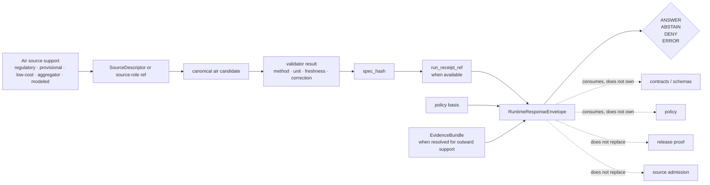

<!-- [KFM_META_BLOCK_V2]
doc_id: kfm://doc/NEEDS_VERIFICATION__runtime_proof_air_readme
title: Runtime Proof — Air
type: standard
version: v1
status: draft
owners: @bartytime4life
created: NEEDS_VERIFICATION__YYYY-MM-DD
updated: NEEDS_VERIFICATION__YYYY-MM-DD
policy_label: NEEDS_VERIFICATION__public_or_internal
related: [
  ../README.md,
  ../../README.md,
  ../../../README.md,
  ../../../../contracts/README.md,
  ../../../../policy/README.md,
  ../../../../schemas/README.md,
  ../../../../schemas/contracts/v1/runtime/README.md,
  ../../../../schemas/contracts/v1/runtime/runtime_response_envelope.schema.json,
  ../../../contracts/test_runtime_response_schema.py,
  ../../../../.github/workflows/README.md
]
tags: [kfm, tests, e2e, runtime-proof, air, source-roles, runtime-response-envelope, fail-closed]
notes: [
  Parent README for air-domain runtime-proof leaves.
  @bartytime4life ownership is grounded at tests-family scope in surfaced materials; air-leaf ownership still NEEDS VERIFICATION.
  Exact child inventory, fixture names, runtime modules, route names, workflow YAML, artifact upload behavior, policy label, and created/updated dates still NEED branch verification.
  This parent intentionally keeps regulatory, preliminary, low-cost, aggregator, and modeled/fused air sources distinct.
]
[/KFM_META_BLOCK_V2] -->

<a id="top"></a>

# Runtime Proof — Air

Request-time proof family for air-quality and atmospheric-context outcomes where source role, quantity semantics, freshness, evidence support, and fail-closed behavior must stay visible.

> [!NOTE]
> **Status:** `experimental`  
> **Owners:** `@bartytime4life` *(tests-family scope confirmed in surfaced materials; this air parent still needs branch verification)*  
> **Path:** `tests/e2e/runtime_proof/air/README.md`  
>        
> **Quick jump:** [Scope](#scope) · [Evidence posture](#current-evidence-posture) · [Repo fit](#repo-fit) · [Inputs](#accepted-inputs) · [Exclusions](#exclusions) · [Directory tree](#directory-tree) · [Quickstart](#quickstart) · [Usage](#usage) · [Runtime outcomes](#runtime-outcomes) · [Diagram](#diagram) · [Operating tables](#operating-tables) · [Task list](#task-list--definition-of-done) · [FAQ](#faq) · [Appendix](#appendix)

> [!IMPORTANT]
> This directory should prove **runtime behavior** for air-domain requests. It must not become a shadow home for source admission, policy authority, release proof, provider scraping, or workflow mythology.

> [!CAUTION]
> **Air evidence is not one semantic class.**  
> Keep **EPA AQS**, **AirNow / NowCast**, **PurpleAir**, **OpenAQ**, smoke or aerosol products, and modeled/fused surfaces visibly distinct. A regulatory observation, a preliminary current-condition feed, a corrected low-cost sensor estimate, an aggregator measurement, and a modeled surface do not carry the same publication burden.

---

## Scope

This directory is the **air-domain parent** inside the `runtime_proof` family.

It is for child leaves that prove whether a governed runtime can emit a qualified outward response when air support is:

- present and sufficiently qualified,
- present but stale, mixed, provisional, or too weak,
- semantically invalid or trust-breaking,
- malformed at the request, fixture, or envelope level.

A good air runtime-proof case makes it harder for KFM to answer an air-quality question with an unqualified, source-flattened, stale, provenance-mixed, or semantically ambiguous response.

### What this parent owns

This parent owns:

- family placement and naming rules for air runtime-proof leaves,
- shared source-role and quantity-seam guidance,
- finite runtime outcome expectations,
- reviewer-facing guardrails for air fixtures,
- links to upstream contract, policy, schema, and workflow surfaces.

It does **not** own pollutant-specific truth. Child leaves should carry pollutant- or product-specific fixture details.

[Back to top](#top)

---

## Current evidence posture

| Marker | Meaning in this README |
| --- | --- |
| **CONFIRMED** | Grounded in surfaced KFM doctrine or repo-style Markdown from this session |
| **INFERRED** | Conservative repo-fit interpretation from adjacent surfaced docs |
| **PROPOSED** | Repo-native pattern that fits KFM doctrine but is not proven as checked-in behavior |
| **UNKNOWN** | Not verified strongly enough to present as current branch or runtime reality |
| **NEEDS VERIFICATION** | Must be checked against the mounted repo, Git history, CI settings, or emitted artifacts before merge |

### What is safe to say now

| Claim | Posture | Why it matters |
| --- | --- | --- |
| `tests/e2e/` is the right broad family for whole-path proof burdens | **CONFIRMED / INFERRED** | This README should read like an e2e child, not a generic domain note |
| `runtime_proof/` is the right family when the primary burden is request-time outward behavior | **CONFIRMED / INFERRED** | Air cases belong here only when the outcome envelope is the thing under test |
| Runtime outcomes should use `ANSWER`, `ABSTAIN`, `DENY`, and `ERROR` | **CONFIRMED doctrine** | This parent should not invent a fifth runtime state |
| Air source roles must remain distinct across regulatory, provisional, low-cost, aggregator, and modeled surfaces | **CONFIRMED doctrine + domain evidence** | The family exists to prevent source-role flattening |
| `pm25/` is the strongest first child candidate visible in-session | **PROPOSED / NEEDS VERIFICATION** | A PM2.5 leaf is well motivated, but mounted path state still needs checking |
| Exact air runtime modules, route names, fixtures, workflow YAML, artifact upload, retention, and branch protection | **UNKNOWN** | This README must not imply automation maturity that the branch does not prove |

> [!NOTE]
> A strong README can clarify burden and placement. It does **not** prove workflow enforcement, signed outputs, branch protection, or live runtime coverage.

[Back to top](#top)

---

## Repo fit

**Path:** `tests/e2e/runtime_proof/air/README.md`  
**Role:** parent index and guardrail for air-domain runtime-proof leaves.

### Upstream anchors

| Direction | Surface | Why it matters | Posture |
| --- | --- | --- | --- |
| Parent runtime-proof family | [../README.md][runtime-proof-root] | Keeps air cases in the request-time runtime-proof lane | **NEEDS VERIFICATION** |
| Parent e2e family | [../../README.md][e2e-root] | Keeps this under whole-path proof, not unit or contract testing | **NEEDS VERIFICATION** |
| Tests root | [../../../README.md][tests-root] | Keeps family placement aligned with the broader test lattice | **NEEDS VERIFICATION** |
| Contract authority | [../../../../contracts/README.md][contracts-root] | Runtime-proof cases consume contract truth; they do not define it | **NEEDS VERIFICATION** |
| Policy authority | [../../../../policy/README.md][policy-root] | Deny-by-default and review policy remain policy-owned | **NEEDS VERIFICATION** |
| Schema authority | [../../../../schemas/README.md][schemas-root] | Shape authority should remain singular and explicit | **NEEDS VERIFICATION** |
| Runtime schema lane | [../../../../schemas/contracts/v1/runtime/README.md][runtime-schema-readme] | Runtime envelopes should stay downstream of the contract lane | **NEEDS VERIFICATION** |
| Runtime envelope schema | [../../../../schemas/contracts/v1/runtime/runtime_response_envelope.schema.json][runtime-envelope-schema] | Expected and actual responses should validate against the machine contract when mounted | **NEEDS VERIFICATION** |
| Runtime schema test | [../../../contracts/test_runtime_response_schema.py][runtime-schema-test] | Contract verification should run before runtime proof is trusted | **NEEDS VERIFICATION** |
| Workflow inventory | [../../../../.github/workflows/README.md][workflows-readme] | Workflow claims belong in the workflow surface, not inferred here | **NEEDS VERIFICATION** |

### Downstream partitions

| Child partition | Use when | Status |
| --- | --- | --- |
| [`pm25/`](./pm25/) | The burden is PM2.5-specific source role, quantity kind, correction, NowCast, or regulatory-vs-provisional behavior | **PROPOSED / NEEDS VERIFICATION** |
| `ozone/` | The burden is ozone-specific unit, averaging, AQI, or regulatory/current-context behavior | **PROPOSED only** |
| `smoke_context/` | The burden is smoke plume, aerosol, or modeled-context support that must not masquerade as direct observation | **PROPOSED only** |
| Additional leaves | Only after a runtime burden, contract seam, and source-role distinction are clear | **PROPOSED only** |

> [!WARNING]
> Do not add decorative child folders. Each air child should carry a distinct runtime-proof burden.

[Back to top](#top)

---

## Accepted inputs

Use this directory, or a child leaf beneath it, for small, reviewable runtime-proof material such as:

- `request.json` fixtures that represent a governed air-domain runtime request,
- `expected.response.json` fixtures using the finite runtime grammar,
- generated `actual.response.json` artifacts when the branch has an explicit emission policy,
- compact source-role references such as `SourceDescriptor` IDs,
- validator-result references or minimal validator summaries,
- deterministic identity cues such as `spec_hash`,
- `run_receipt_ref` or `audit_ref` when the outward trust story depends on them,
- small illustrative payload slices that make method, provider, unit, window, and freshness visible.

Good air fixtures are intentionally small. A reviewer should be able to read one case without opening a full provider export.

[Back to top](#top)

---

## Exclusions

Do not put these here:

| Excluded material | Put it here instead | Why |
| --- | --- | --- |
| Raw provider dumps from AQS, AirNow, PurpleAir, OpenAQ, or modeled products | Source intake, fixture, or evidence storage lane | This directory proves runtime behavior, not bulk intake |
| Source admission rules | `contracts/`, `schemas/`, `policy/`, or source-specific docs | Admission is upstream of runtime proof |
| Provider scraper or watcher code | `apps/`, `connectors/`, `pipelines/`, or watcher-owned surfaces | Runtime-proof should consume emitted support, not own ingestion |
| Policy decisions and policy vocabularies | `policy/` and governed API policy surfaces | Avoid a shadow policy engine |
| Release manifests, proof packs, signatures, or publication claims | `tests/e2e/release_assembly/`, `data/proofs/`, `tools/attest/`, or release docs | Release proof is broader than runtime response |
| Correction and rollback lineage | `tests/e2e/correction/` or correction-specific contracts | Corrections have their own proof burden |
| Long provider tutorials or external API docs | Domain docs or source onboarding docs | Keep this README reviewer-focused |

[Back to top](#top)

---

## Directory tree

Current target and preferred growth shape:

```text
tests/e2e/runtime_proof/air/
├── README.md                         # this parent file
├── pm25/                             # PROPOSED first child; mounted status NEEDS VERIFICATION
│   ├── README.md                     # pollutant-specific runtime-proof guidance
│   └── fixtures/                     # request / expected / actual runtime response cases
└── <future-air-leaf>/                # only after a distinct runtime burden is verified
```

> [!NOTE]
> The tree above is a placement guide, not a claim that every child exists on the active branch.

[Back to top](#top)

---

## Quickstart

Use these non-destructive checks before adding or reviewing an air runtime-proof case.

### 1) Re-read the family map

```bash
sed -n '1,260p' tests/README.md 2>/dev/null || true
sed -n '1,240p' tests/e2e/README.md 2>/dev/null || true
sed -n '1,240p' tests/e2e/runtime_proof/README.md 2>/dev/null || true
sed -n '1,260p' .github/workflows/README.md 2>/dev/null || true
```

### 2) Inspect mounted air proof inventory

```bash
find tests/e2e/runtime_proof/air -maxdepth 4 -type f 2>/dev/null | sort || true
```

### 3) Reconfirm air vocabulary before inventing payloads

```bash
grep -RIn \
  -e 'AQS' \
  -e 'AirNow' \
  -e 'NowCast' \
  -e 'PurpleAir' \
  -e 'OpenAQ' \
  -e 'PM2.5' \
  -e 'AQI' \
  -e 'spec_hash' \
  -e 'run_receipt' \
  -e 'SourceDescriptor' \
  -e 'ABSTAIN' \
  -e 'DENY' \
  -e 'ERROR' \
  tests contracts policy schemas docs tools apps 2>/dev/null || true
```

### 4) Reconfirm runtime contract surfaces

```bash
sed -n '1,220p' schemas/contracts/v1/runtime/README.md 2>/dev/null || true
sed -n '1,220p' schemas/contracts/v1/runtime/runtime_response_envelope.schema.json 2>/dev/null || true
sed -n '1,220p' tests/contracts/test_runtime_response_schema.py 2>/dev/null || true
sed -n '1,220p' contracts/README.md 2>/dev/null || true
sed -n '1,220p' policy/README.md 2>/dev/null || true
```

### 5) Run mounted air runtime-proof tests only after confirming they exist

```bash
test -d tests/e2e/runtime_proof/air && \
pytest -q tests/e2e/runtime_proof/air
```

> [!TIP]
> Start with one case per finite outcome in the first concrete child leaf: one `ANSWER`, one `ABSTAIN`, one `DENY`, and one `ERROR`.

[Back to top](#top)

---

## Usage

### Add an air runtime-proof child

1. Name the child after the **runtime burden**, not the data provider.
2. Confirm the burden is really runtime-proof. If the main question is source admission, release proof, catalog closure, or policy ownership, move it out of this family.
3. Add a child `README.md` with a KFM meta block and child-specific source-role rules.
4. Create the smallest useful fixture set.
5. Keep source role explicit.
6. Keep quantity kind explicit.
7. Keep unit explicit.
8. Keep method, monitor, correction, provider, and freshness visible where applicable.
9. Keep `spec_hash`, validator visibility, and `run_receipt_ref` explicit when outward trust depends on them.
10. Keep **runtime response ≠ receipt ≠ proof ≠ catalog** visible in examples and prose.

### Add or change a case

A case should make it obvious whether the runtime is being asked about:

- a **regulatory observation**,
- a **preliminary current condition**,
- a **corrected low-cost sensor estimate**,
- an **aggregated network measurement**,
- a **modeled / fused / contextual surface**,
- or a malformed / underqualified runtime request.

If the case hides that distinction, it is probably the wrong shape.

[Back to top](#top)

---

## Runtime outcomes

This family uses the standard runtime grammar.

| Outcome | Meaning in air runtime proof | Reviewer reading rule |
| --- | --- | --- |
| `ANSWER` | Enough qualified support exists to emit a bounded air-domain result | Check source role, quantity kind, unit, method or correction, window, freshness, and `audit_ref` |
| `ABSTAIN` | Support exists but is too weak, stale, incomplete, mixed, or semantically underqualified | Treat this as successful fail-closed proof when the abstention is explicit and well reasoned |
| `DENY` | A disallowed or trust-breaking condition is detected on a required path | Treat this as successful fail-closed proof when the denial category is clear |
| `ERROR` | Malformed request, malformed fixture, broken contract, or non-policy runtime fault | Treat this as error-handling proof only when the category and runtime state remain intelligible |

### Local interpretation rule

Until a mounted air runtime contract says otherwise:

- use **`ABSTAIN`** for insufficient, stale, or underqualified support,
- use **`DENY`** for explicit trust, rights, policy, or semantic violations,
- use **`ERROR`** for malformed inputs or broken runtime shape.

### Runtime trust-visible fields

A strong air runtime envelope should make these visible when applicable:

- `outcome`
- `reason.code`
- `reason.message`
- `source_ref`
- `source_role`
- `pollutant`
- `quantity_kind`
- `unit`
- `site_id`, `sensor_id`, `grid_ref`, or `coverage_ref`
- `observed_window`, `forecast_window`, or validity window
- `method`, `monitor`, and `poc` for EPA AQS-style regulatory observations when relevant
- `provider` or `network`
- sensor variant and correction model where low-cost sensors are involved
- `correction_applied`
- `provisional_status` or `regulatory_grade`
- `freshness`
- `spec_hash`
- `validator_result_ref` or equivalent validator visibility
- `run_receipt_ref` when available
- `audit_ref`
- `obligations`

[Back to top](#top)

---

## Diagram



Reading rule: this family makes **runtime behavior** reviewable without collapsing source admission, policy, proof, catalog, or publication into the same folder.

[Back to top](#top)

---

## Operating tables

### Source-role pressure points

| Source or carrier | Role to keep visible | Good use in this family | Do **not** flatten into |
| --- | --- | --- | --- |
| **EPA AQS** | regulatory or archival observation anchor with method metadata | Qualified concentration cases where method, monitor, POC, and QA posture are explicit | Preliminary current-condition feed |
| **AirNow / NowCast** | operational current-condition context | Current-condition or abstain cases where preliminary public AQI semantics matter | Certified archival or regulatory truth |
| **PurpleAir raw** | low-cost observation requiring explicit correction posture | Deny or correction-required cases; dense local support with strong caveats | FRM/FEM-equivalent answer by default |
| **PurpleAir corrected** | derived estimate over low-cost sensor data | Bounded best-estimate support when correction model and uncertainty stay visible | Automatic regulatory-grade truth |
| **OpenAQ** | aggregator / discovery / routing layer with mixed provenance | Provider-aware breadth and provenance cases | Automatic authority |
| **Smoke, AOD, forecast, or fused products** | modeled, satellite-derived, or assimilated context | Context, priors, or modeled-surface support when method lineage stays explicit | Direct observed monitor value |

### Quantity seams

| Quantity kind | What it means | Common failure to avoid |
| --- | --- | --- |
| `concentration` | Pollutant concentration, such as `µg/m³` for PM2.5 or ppm/ppb for some gases | Presenting AQI or NowCast as if it were a raw concentration |
| `AQI` | Public-facing index or category | Treating an index as a direct observation field |
| `NowCast` | Near-real-time weighted interpretation for current conditions | Silently upgrading preliminary current conditions into regulatory-grade data |
| `lowcost_corrected` | Corrected low-cost sensor estimate | Dropping the variant, correction model, or uncertainty |
| `modeled_or_fused` | Derived surface or best-estimate layer | Forgetting that the product is derived rather than direct observation |

### Seams that should usually trigger `ABSTAIN`, `DENY`, or `ERROR`

| Seam | Likely outcome | Why |
| --- | --- | --- |
| Freshness required but support is stale | `ABSTAIN` | The runtime lacks current-enough support |
| Provider or source role missing where authority is claimed | `DENY` | The runtime cannot safely upgrade unknown provenance into authority |
| Raw low-cost sensor asserted as regulatory-grade | `DENY` | The requested semantic violates source-role constraints |
| Quantity kind is missing or mixed | `ABSTAIN` or `DENY` | Depends whether this is weak support or a trust-breaking assertion |
| Required correction model missing | `ABSTAIN` | Support may exist, but the transformation basis is underqualified |
| Malformed request or fixture | `ERROR` | Runtime shape failed before policy or evidence reasoning can proceed |

[Back to top](#top)

---

## Artifact policy for generated actuals

Generated `actual.response.json` files are useful when they are clearly governed.

**PROPOSED local rule until branch policy is verified:**

- `expected.response.json` fixtures may be committed when reviewed.
- `actual.response.json` should be generated by a named test/helper or CI step.
- If committed, actuals must be intentionally reviewed and deterministic.
- If uploaded, artifact retention and naming belong in workflow docs.
- Actuals must not be treated as release proof, signature proof, or catalog closure.

> [!NOTE]
> This section is intentionally **PROPOSED**. The session did not surface an active air-family artifact-emission helper or workflow path.

[Back to top](#top)

---

## Task list & definition of done

### Parent README definition of done

- [ ] Meta block placeholders are replaced with repo-backed values.
- [ ] Owner and policy label are verified for this exact path.
- [ ] Upstream links resolve from `tests/e2e/runtime_proof/air/README.md`.
- [ ] Downstream child leaves are either linked because they exist or listed as unlinked `PROPOSED` paths.
- [ ] This parent does not duplicate child-specific fixture documentation.
- [ ] Source-role distinctions remain visible.
- [ ] The finite runtime grammar stays limited to `ANSWER`, `ABSTAIN`, `DENY`, and `ERROR`.
- [ ] Runtime response, receipt, proof, policy, and catalog objects remain distinct.
- [ ] The README does not imply workflow, signing, branch-protection, or deployment maturity that the branch does not prove.

### First child-leaf definition of done

- [ ] One `ANSWER`, one `ABSTAIN`, one `DENY`, and one `ERROR` case exist.
- [ ] Every case keeps source role explicit.
- [ ] Every quantity-sensitive case keeps quantity kind and unit explicit.
- [ ] At least one case exercises freshness behavior.
- [ ] At least one case points cleanly to an `audit_ref`.
- [ ] At least one case keeps `spec_hash` and validator-result visibility explicit where trust depends on them.
- [ ] Any `run_receipt` example stays downstream of runtime response.
- [ ] Any generated `actual.response.json` policy is explicit and honest.
- [ ] Child README states what it does not own.

### Verification before moving this file from `draft` to `review`

- [ ] Confirm actual mounted inventory under `tests/e2e/runtime_proof/air/`.
- [ ] Confirm whether `pm25/README.md` exists and should be linked directly.
- [ ] Confirm whether air-specific `SourceDescriptor`, validator, route, or runtime module files exist.
- [ ] Confirm active workflow YAML, if any, for air runtime proof.
- [ ] Confirm whether workflow artifacts include actual runtime responses or only summaries.
- [ ] Confirm whether `ABSTAIN` vs `DENY` handling for stale preliminary support is normalized elsewhere.
- [ ] Confirm `CODEOWNERS` coverage and required checks in the active branch settings.

[Back to top](#top)

---

## FAQ

### Why is this a parent README instead of a PM2.5 README?

Because `air/` is the family boundary. PM2.5 is a strong first child, but this parent keeps shared rules stable for later air leaves without duplicating pollutant-specific details.

### Why keep AQS, AirNow, PurpleAir, and OpenAQ separate?

Because this family is about **runtime trust**, not generic data availability. Those sources carry different roles, QA postures, semantics, timeliness, and publication burdens.

### Can OpenAQ alone justify a regulatory-grade runtime answer?

Not by default. OpenAQ can be useful for discovery and breadth, but its provider provenance can be mixed. Runtime proof should not silently upgrade aggregator output into authority.

### Why not collapse concentration, AQI, and NowCast into one outward field?

Because they mean different things. A concentration, an index, and a near-real-time weighted interpretation are not interchangeable.

### Do `ABSTAIN` and `DENY` count as passing tests?

Yes. In KFM, fail-closed behavior is part of the trust contract. If a case should abstain or deny and does so clearly, that is a successful proof result.

### Does this README prove live air automation exists?

No. It documents the burden and preferred repo-native shape. Exact fixtures, runtime modules, workflow YAML, artifact upload, signing, retention, and branch protection still need direct branch verification.

### Why not let this family decide policy outcomes directly?

Because policy authority belongs in policy and governed API surfaces. Runtime proof should show boundary behavior, not become a shadow policy engine.

[Back to top](#top)

---

## Appendix

<details>
<summary><strong>Appendix A — Minimal child leaf starter set</strong></summary>

For a first PM2.5 child, starter case names could be:

```text
answer_aqs_hourly_regulatory_public_safe
abstain_airnow_nowcast_stale_or_thin
deny_purpleair_raw_as_regulatory_grade
deny_openaq_measurement_as_authoritative_without_source
error_malformed_pm25_request
```

These names are intentionally semantics-first and review-readable.

</details>

<details>
<summary><strong>Appendix B — Current evidence this parent is built to respect</strong></summary>

1. This session did not expose a mounted active-branch repo tree for this exact target.
2. KFM runtime proof belongs under `tests/e2e/` when the main burden is outward runtime behavior.
3. KFM’s finite runtime grammar is `ANSWER`, `ABSTAIN`, `DENY`, `ERROR`.
4. Source roles are not interchangeable; direct observations, operational context feeds, aggregators, and modeled/fused surfaces carry different burdens.
5. Air-specific runtime proof must keep regulatory, provisional, low-cost, aggregator, and modeled/fused support distinct.
6. Runtime response, receipt, proof, policy, catalog, and publication objects should remain distinct.
7. Any workflow or artifact claim must be verified from branch evidence before becoming visible as fact.

</details>

[Back to top](#top)

---

[runtime-proof-root]: ../README.md
[e2e-root]: ../../README.md
[tests-root]: ../../../README.md
[contracts-root]: ../../../../contracts/README.md
[policy-root]: ../../../../policy/README.md
[schemas-root]: ../../../../schemas/README.md
[runtime-schema-readme]: ../../../../schemas/contracts/v1/runtime/README.md
[runtime-envelope-schema]: ../../../../schemas/contracts/v1/runtime/runtime_response_envelope.schema.json
[runtime-schema-test]: ../../../contracts/test_runtime_response_schema.py
[workflows-readme]: ../../../../.github/workflows/README.md
