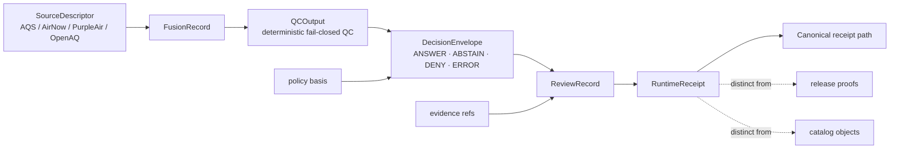

<!-- [KFM_META_BLOCK_V2]
doc_id: kfm://doc/tests-e2e-runtime-proof-air-pm25-readme
title: Runtime Proof — PM2.5
type: standard
version: v1
status: draft
owners: @bartytime4life
created: 2026-04-17
updated: 2026-04-17
policy_label: public
related: [
  ../../README.md,
  ../../../README.md,
  ../../../../../contracts/README.md,
  ../../../../../policy/README.md,
  ../../../../../schemas/README.md,
  ../../../../../schemas/pm25/fusion-record.schema.json,
  ../../../../../schemas/pm25/qc-output.schema.json,
  ../../../../../schemas/pm25/review-record.schema.json,
  ../../../../../schemas/pm25/runtime-receipt.schema.json,
  ../../../../../tools/validators/README.md,
  ../../../../../tools/validators/pm25_fusion/README.md,
  ../../../../../tools/validators/pm25_fusion/validator.py,
  ../../../../../tools/validators/pm25_fusion/runtime_mapper.py,
  ../../../../../tools/validators/pm25_fusion/review_record.py,
  ../../../../../tools/validators/pm25_fusion/receipt_builder.py,
  ../../../../../tools/validators/pm25_fusion/receipt_writer.py,
  ../../../../../scripts/README.md,
  ../../../../../scripts/pm25_runtime_receipt.py,
  ../../../../../data/receipts/README.md,
  ../../../../../data/receipts/runtime/pm25/README.md,
  ../../../../../tests/contracts/test_runtime_response_schema.py,
  ../../../../../.github/CODEOWNERS,
  ../../../../../.github/workflows/README.md
]
tags: [kfm, tests, e2e, runtime-proof, air, pm25, aqs, airnow, purpleair, openaq, runtime-receipt, review-record]
notes: [
  This leaf documents request-time PM2.5 proof posture and expected artifact relationships.
  Exact mounted subtree contents, parent air README existence, and workflow wiring still require branch verification.
  Runtime response, review record, receipt, and release proof remain distinct trust objects.
]
-->

<a id="top"></a>

# Runtime Proof — PM2.5

> Request-time proof lane for PM2.5 outcomes, source-role visibility, validator behavior, finite runtime decisions, and fail-closed receipt-bearing auditability.

> [!NOTE]
> **Status:** `draft`  
> **Owners:** `@bartytime4life` *(grounded at `/tests/` scope; exact leaf assignment still requires branch verification)*  
> **Path:** `tests/e2e/runtime_proof/air/pm25/README.md`  
>         
> **Quick jump:** [Scope](#scope) · [Current evidence posture](#current-evidence-posture) · [Repo fit](#repo-fit) · [Accepted inputs](#accepted-inputs) · [Exclusions](#exclusions) · [Directory tree](#directory-tree) · [Quickstart](#quickstart) · [Usage](#usage) · [Runtime outcomes](#runtime-outcomes) · [Proof matrix](#proof-matrix) · [Artifacts](#artifact-chain) · [Diagram](#diagram) · [Operating tables](#operating-tables) · [Task list](#task-list--definition-of-done) · [FAQ](#faq) · [Appendix](#appendix)

> [!IMPORTANT]
> This leaf should prove **runtime behavior**, not quietly become the home of source custody, policy authority, release proof, or workflow mythology.

> [!CAUTION]
> **PM2.5 is not one source, one method, or one semantic.**  
> Keep **EPA AQS**, **AirNow**, **PurpleAir**, **OpenAQ**, correction state, quantity kind (`µg/m³`, `AQI`, `NowCast`), and freshness visible instead of flattening them into one generic “air reading.”

---

## Scope

This directory is for **whole-path runtime proof** of PM2.5 behavior in a KFM air lane.

It should prove whether a runtime-facing request can or cannot produce a qualified outward result when PM2.5 support is:

- present and sufficiently qualified,
- present but stale, mixed, or too weak,
- semantically invalid or trust-breaking,
- malformed at the request or envelope level.

A good PM2.5 runtime-proof leaf should make it harder to answer an air-quality question with an unqualified, source-flattened, stale, provenance-mixed, or semantically ambiguous response.

### Why this leaf exists

A PM2.5 leaf is a useful runtime-proof stress test because it pressures all of the following at once:

- **regulatory vs preliminary** distinctions,
- **direct observation vs aggregator vs modeled/fused surface** distinctions,
- **method / monitor / POC** identity for **EPA AQS**,
- **raw vs corrected** low-cost sensor handling for **PurpleAir**,
- **quantity-kind** clarity across concentration, AQI, and NowCast,
- **freshness** and fail-closed fallback posture,
- **validator → decision envelope → review record → runtime receipt** thinking,
- finite runtime outcomes without pretending release proof already exists.

[Back to top](#top)

---

## Current evidence posture

| Marker | Meaning here |
| --- | --- |
| **CONFIRMED** | Grounded in attached KFM doctrine or directly surfaced repo-style Markdown |
| **INFERRED** | Conservative interpretation connecting direct evidence to adjacent repo doctrine |
| **PROPOSED** | Repo-native pattern that fits KFM doctrine but is not yet proven as current checked-in PM2.5 leaf behavior |
| **UNKNOWN** | Not verified strongly enough to present as current branch, settings, or implementation reality |
| **NEEDS VERIFICATION** | Placeholder detail that should be checked against a mounted checkout, Git history, or repo settings before merge |

### What is directly safe to say

| Claim | Posture | Why it matters |
| --- | --- | --- |
| `tests/e2e/` is treated as a whole-path proof family rather than generic QA | **CONFIRMED** | This leaf should read like an e2e child, not a standalone note |
| `runtime_proof/` is the request-time outcome burden inside `tests/e2e/` | **CONFIRMED** | PM2.5 runtime cases belong here when the main question is outward runtime behavior |
| KFM finite runtime grammar is `ANSWER`, `ABSTAIN`, `DENY`, `ERROR` | **CONFIRMED doctrine** | This leaf should not invent a fifth runtime outcome |
| PM2.5 source-role burdens differ materially across AQS, AirNow, PurpleAir, OpenAQ, and modeled or fused surfaces | **CONFIRMED doctrine** | Runtime proof here must preserve those distinctions |
| PM2.5 runtime artifacts should keep response, review record, receipt, and release proof distinct | **CONFIRMED doctrine / current design direction** | Prevents trust-state flattening |
| Exact mounted contents of `tests/e2e/runtime_proof/air/pm25/` | **NEEDS VERIFICATION** | Do not claim fixture inventory or runner wiring without a mounted checkout |
| Exact workflow YAML, artifact upload, retention behavior, or required checks | **UNKNOWN / NEEDS VERIFICATION** | This README must not imply automation maturity the session did not prove |

> [!NOTE]
> In KFM, a strong README can clarify burden and placement. It does **not** by itself prove workflow enforcement, signed outputs, or merge-gate status.

[Back to top](#top)

---

## Repo fit

**Path:** `tests/e2e/runtime_proof/air/pm25/README.md`  
**Role:** whole-path proof leaf for request-time PM2.5 outcomes inside the broader `runtime_proof` family.

### Upstream and adjacent anchors

| Direction | Surface | Why it matters | Posture |
| --- | --- | --- | --- |
| Parent runtime-proof family | [`../../README.md`][runtime-proof-root] | Preserves the distinction between request-time runtime proof and other e2e burdens | **INFERRED** |
| Parent e2e family | [`../../../README.md`][e2e-root] | Keeps this leaf inside the broader e2e lattice instead of creating a parallel taxonomy | **INFERRED** |
| Root contract authority | [`../../../../../contracts/README.md`][contracts-root] | Runtime-proof cases should consume contract truth rather than improvising it | **CONFIRMED adjacent root surface** |
| Root policy authority | [`../../../../../policy/README.md`][policy-root] | Deny-by-default, reasons, and obligations originate there, not here | **CONFIRMED adjacent root surface** |
| Root schema authority | [`../../../../../schemas/README.md`][schemas-root] | Shape authority should remain singular and explicit | **CONFIRMED adjacent root surface** |
| PM2.5 schema surface | [`../../../../../schemas/pm25/runtime-receipt.schema.json`][pm25-runtime-receipt-schema] | Runtime receipts should validate against a canonical schema | **PROPOSED / aligned with current PM2.5 path** |
| PM2.5 validator lane | [`../../../../../tools/validators/pm25_fusion/README.md`][pm25-validator-readme] | Runtime-proof cases should stay downstream of deterministic validation helpers | **PROPOSED / aligned with current PM2.5 path** |
| Receipt storage lane | [`../../../../../data/receipts/runtime/pm25/README.md`][pm25-receipts-readme] | Request-time process memory should land in a canonical receipt path | **PROPOSED / aligned with current PM2.5 path** |
| Thin orchestration surface | [`../../../../../scripts/pm25_runtime_receipt.py`][pm25-script] | CI or local proof should use orchestration rather than embed authority in tests | **PROPOSED / aligned with current PM2.5 path** |
| Contract verification surface | [`../../../../../tests/contracts/test_runtime_response_schema.py`][runtime-schema-test] | Runtime-proof should stay downstream of contract validation, not replace it | **CONFIRMED adjacent verifier** |
| Workflow inventory surface | [`../../../../../.github/workflows/README.md`][workflows-readme] | Workflow claims must stay subordinate to documented inventory and verification posture | **CONFIRMED adjacent README** |
| Review ownership | [`../../../../../.github/CODEOWNERS`][codeowners] | Owner claims should stay bounded by actual review surfaces | **CONFIRMED adjacent root surface** |

[Back to top](#top)

---

## Accepted inputs

This leaf should accept only **small, reviewable, semantics-bearing** inputs.

### What belongs here

- tiny `request.json` / `expected.response.json` pairs,
- minimal PM2.5 candidate fragments,
- freshness and degraded-state cases,
- **EPA AQS** cases where site, parameter, monitor, method, and POC matter,
- **AirNow** cases where preliminary current conditions or NowCast behavior matter,
- **PurpleAir** cases where raw vs corrected values, variant choice, and correction provenance matter,
- **OpenAQ** cases where aggregator provenance and provider identity matter,
- PM2.5 runtime receipt fixtures when outward trust depends on `audit_ref`, `bundle_ref`, `freshness`, or obligations,
- explicit validator or review-record seams when runtime outcome depends on fail-closed evidence handling.

### Good first-case subjects

| Case family | Why it belongs |
| --- | --- |
| released AQS hourly concentration | strongest candidate for a qualified outward answer |
| stale or insufficient current-support case | pressures `ABSTAIN` without forcing a deny |
| raw PurpleAir passed off as regulatory-grade | pressures explicit trust failure |
| OpenAQ measurement treated as automatically authoritative | pressures provenance-aware denial or abstention |
| malformed runtime request or malformed runtime receipt | pressures explicit `ERROR` |

[Back to top](#top)

---

## Exclusions

| Does **not** belong here | Put it here instead | Why |
| --- | --- | --- |
| Canonical source-admission law | root contracts and schema surfaces | This leaf should prove runtime behavior, not become source-admission authority |
| Full connector, watcher, scheduler, or backoff logic | pipeline / watcher / tool lanes | Runtime-proof README prose is not ingestion proof |
| Large raw AQS, AirNow, PurpleAir, or OpenAQ pulls | governed data zones or local ignored paths | This leaf should stay reviewable in Git |
| Release manifests, attestation bundles, signed proof packs, or published artifacts as primary records | release / proof lanes | Runtime proof is not the same as release proof |
| Policy bundle ownership or reason-code registries | root policy surfaces | Policy remains authoritative for allow / deny / review behavior |
| Canonical receipt writing logic | `tools/validators/pm25_fusion/` and `scripts/` | This leaf should exercise the path, not own it |
| Guessed route names, workflow YAML, required checks, or retention claims | active branch verification first | This README must not outrun mounted evidence |

> [!WARNING]
> Do not use this directory to smuggle in unconstrained provider data just because it is convenient to fetch. Runtime proof should stay small, reviewable, and policy-conscious.

[Back to top](#top)

---

## Directory tree

### Current safe claim

This session did **not** surface the active branch contents for this exact target leaf.

The only safe leaf-level claim this README can make without overreach is the target document itself plus the expected runtime-proof burden.

```text
tests/e2e/runtime_proof/
└── air/
    └── pm25/
        └── README.md
```

### Preferred growth shape (`PROPOSED` / `NEEDS VERIFICATION`)

```text
tests/e2e/runtime_proof/
└── air/
    └── pm25/
        ├── README.md
        ├── fixtures/
        │   ├── answer_aqs_hourly_regulatory_public_safe/
        │   │   ├── request.json
        │   │   ├── expected.response.json
        │   │   └── runtime_receipt.json
        │   ├── abstain_airnow_nowcast_stale_or_thin/
        │   │   ├── request.json
        │   │   ├── expected.response.json
        │   │   └── runtime_receipt.json
        │   ├── deny_purpleair_raw_as_regulatory_grade/
        │   │   ├── request.json
        │   │   ├── expected.response.json
        │   │   └── runtime_receipt.json
        │   ├── deny_openaq_measurement_as_authoritative_without_source/
        │   │   ├── request.json
        │   │   ├── expected.response.json
        │   │   └── runtime_receipt.json
        │   └── error_malformed_pm25_request/
        │       ├── request.json
        │       └── expected.response.json
        └── test_pm25_runtime_proof.py
```

> [!TIP]
> Add only the smallest subtree the active branch can actually support. A narrow truthful leaf is better than a broad speculative one.

[Back to top](#top)

---

## Quickstart

Use inspection-first commands so this README stays honest as the branch evolves.

### 1) Confirm what is actually mounted

```bash
find tests/e2e -maxdepth 6 -print 2>/dev/null | sort
find tests/e2e/runtime_proof -maxdepth 6 -print 2>/dev/null | sort
find tests/e2e/runtime_proof/air -maxdepth 6 -print 2>/dev/null | sort
find tests/e2e/runtime_proof/air/pm25 -maxdepth 6 -print 2>/dev/null | sort
```

### 2) Re-read the family map before adding cases

```bash
sed -n '1,260p' tests/README.md 2>/dev/null || true
sed -n '1,240p' tests/e2e/README.md 2>/dev/null || true
sed -n '1,240p' tests/e2e/runtime_proof/README.md 2>/dev/null || true
sed -n '1,260p' .github/workflows/README.md 2>/dev/null || true
```

### 3) Reconfirm PM2.5 vocabulary before inventing payloads

```bash
grep -RIn \
  -e 'AQS' \
  -e 'AirNow' \
  -e 'PurpleAir' \
  -e 'OpenAQ' \
  -e 'PM2.5' \
  -e 'NowCast' \
  -e 'runtime_receipt' \
  -e 'review_record' \
  -e 'audit_ref' \
  -e 'ABSTAIN' \
  -e 'DENY' \
  -e 'ERROR' \
  tests contracts policy schemas tools scripts data 2>/dev/null || true
```

### 4) Reconfirm PM2.5 contract and receipt surfaces

```bash
sed -n '1,220p' schemas/pm25/fusion-record.schema.json 2>/dev/null || true
sed -n '1,220p' schemas/pm25/qc-output.schema.json 2>/dev/null || true
sed -n '1,220p' schemas/pm25/review-record.schema.json 2>/dev/null || true
sed -n '1,220p' schemas/pm25/runtime-receipt.schema.json 2>/dev/null || true
sed -n '1,220p' tools/validators/pm25_fusion/README.md 2>/dev/null || true
sed -n '1,220p' data/receipts/runtime/pm25/README.md 2>/dev/null || true
```

### 5) Start with one case per finite outcome

A good first pass is:

1. one `ANSWER`,
2. one `ABSTAIN`,
3. one `DENY`,
4. one `ERROR`.

Keep them small enough to review without opening giant provider payloads.

[Back to top](#top)

---

## Usage

### Add or change a PM2.5 runtime-proof case

1. Start with the seam, not the filename: **regulatory anchor**, **preliminary current feed**, **low-cost sensor correction**, **mixed-provenance aggregator**, or **malformed request**.
2. Decide whether the burden is really runtime-proof. If it is mainly source admission, policy ownership, release proof, or catalog closure, move it out of this leaf.
3. Create the smallest possible `request.json` and `expected.response.json` pair.
4. Keep **source role** explicit.
5. Keep **quantity kind** explicit: concentration, AQI, or NowCast.
6. Keep **unit** explicit.
7. Keep **method / monitor / POC** explicit when the candidate depends on **EPA AQS** semantics.
8. Keep **variant** and **correction model** explicit when the candidate depends on **PurpleAir**.
9. Keep **provider / provenance** explicit when the candidate depends on **OpenAQ**.
10. Keep `audit_ref`, `bundle_ref`, `release_ref`, and `freshness` explicit when outward trust depends on them.
11. Keep **runtime response ≠ review record ≠ receipt ≠ proof ≠ catalog** visible even in examples.

### Reading rule for PM2.5 cases

A case should make it obvious whether the runtime is being asked to answer about:

- a **regulatory observation**,
- a **preliminary public-facing current condition**,
- a **corrected low-cost sensor estimate**,
- an **aggregated network measurement**,
- or a **modeled / fused / contextual surface**.

If the case hides that distinction, it is probably the wrong shape for this leaf.

[Back to top](#top)

---

## Runtime outcomes

This leaf should use a **finite runtime grammar**.

| Outcome | Meaning in this leaf |
| --- | --- |
| `ANSWER` | Enough qualified support exists to emit a PM2.5 runtime result with source role, quantity kind, method or variant provenance, window, unit, freshness, and trust cues visible |
| `ABSTAIN` | Support is missing, stale, mixed, or too weak for a trustworthy outward answer, or deterministic PM2.5 evidence is insufficient to trigger action |
| `DENY` | Runtime detects a policy or trust-breaking condition on a required path and refuses the operation |
| `ERROR` | Malformed request, malformed fixture, broken contract, or non-policy runtime fault |

> [!NOTE]
> `ABSTAIN`, `DENY`, and `ERROR` can all be **successful expected outcomes** for this suite when the system reaches them correctly and visibly.

### Local interpretation rule

Until a mounted PM2.5 runtime contract says otherwise, keep the split simple and stable:

- use **`ABSTAIN`** for insufficient, stale, or non-consensus support,
- use **`DENY`** for explicit policy or trust violations,
- use **`ERROR`** for malformed inputs or broken runtime shape.

### Runtime trust-visible fields

A good outward PM2.5 runtime envelope should make the following visible when applicable:

- `outcome`
- `reason`
- `obligations`
- `scope`
- `bundle_ref`
- `release_ref`
- `audit_ref`
- `freshness`

A good reviewer-facing PM2.5 runtime record should additionally make visible when applicable:

- `review_status`
- `decision_outcome`
- `qc_flag`
- `summary`
- `reasons`
- `evidence_refs`
- `policy_state`
- `policy_reason`

[Back to top](#top)

---

## Proof matrix

| Case | Source role visible | QC / trust cues visible | Receipt-bearing | Freshness posture | Expected outcome | Why |
| --- | ---: | ---: | ---: | ---: | --- | --- |
| `answer_aqs_hourly_regulatory_public_safe` | yes | yes | yes | acceptable | `ANSWER` | Qualified regulatory support exists for a narrow outward answer |
| `abstain_airnow_nowcast_stale_or_thin` | yes | yes | yes | stale or weak | `ABSTAIN` | Preliminary current-context feed is not strong enough for a trustworthy answer in this case |
| `deny_purpleair_raw_as_regulatory_grade` | yes | yes | yes | any | `DENY` | Raw PurpleAir cannot silently masquerade as a regulatory-grade PM2.5 answer |
| `deny_openaq_measurement_as_authoritative_without_source` | yes | yes | yes | any | `DENY` | Aggregator provenance cannot be hidden when authority is being claimed |
| `error_malformed_pm25_request` | n/a | yes | optional | n/a | `ERROR` | Runtime must fail visibly on malformed input instead of drifting into a false answer |

> [!TIP]
> A strong first leaf does **not** need dozens of cases. One clean case per runtime outcome beats a decorative scaffold.

[Back to top](#top)

---

## Artifact chain

This leaf should prove the request-time trust path without collapsing its distinct artifacts.

### PM2.5 runtime chain

| Stage | Artifact | Home | Role |
| --- | --- | --- | --- |
| normalized input | `FusionRecord` | `schemas/pm25/fusion-record.schema.json` | minimal hour-aligned PM2.5 record |
| deterministic QC | `QCOutput` | `schemas/pm25/qc-output.schema.json` | fail-closed validation result |
| runtime projection | `DecisionEnvelope`-style object | runtime mapper output | outward finite runtime outcome |
| reviewer view | `ReviewRecord` | `schemas/pm25/review-record.schema.json` | reviewer-readable explanation and obligations |
| process memory | `RuntimeReceipt` | `schemas/pm25/runtime-receipt.schema.json` | request-time receipt pairing decision + review |
| storage | canonical PM2.5 receipt path | `data/receipts/runtime/pm25/` | replay, audit, correction-ready process memory |

### Boundary rule

> **Runtime response ≠ review record ≠ receipt ≠ release proof**

This leaf may prove that those objects are emitted, linked, and shaped correctly. It should not recast them as the same thing.

[Back to top](#top)

---

## Diagram



Above: this leaf should make **runtime behavior** reviewable without collapsing source admission, policy authority, receipt storage, and release proof into one folder.

[Back to top](#top)

---

## Operating tables

### Source-role pressure points for PM2.5

| Source or carrier | Role to keep visible | Good use in this leaf | Do **not** flatten into |
| --- | --- | --- | --- |
| **EPA AQS** | direct observation / regulatory anchor | qualified concentration answers when method, monitor, POC, and QA posture are explicit | preliminary public current-condition feed |
| **AirNow / NowCast** | operational context feed | current-condition or abstain cases where preliminary AQI semantics matter | certified archival or regulatory truth |
| **PurpleAir raw** | low-cost observation requiring explicit correction posture | deny cases, correction-required cases, dense-neighborhood support with strong caveats | FRM/FEM-equivalent answer by default |
| **PurpleAir corrected** | derived transformation over low-cost sensor data | bounded best-estimate support when correction model and uncertainty stay visible | automatic regulatory-grade truth |
| **OpenAQ v3** | aggregator / routing layer with mixed provenance | provenance-aware breadth and discovery cases | automatic authority or regulatory anchor |
| **modeled / fused analyses** | derived or contextual surface | context, priors, or fused-surface support when method lineage stays explicit | direct observed monitor value |

### Quantity seams that should stay explicit

| Quantity kind | What it means | Common failure to avoid |
| --- | --- | --- |
| `pm25_concentration` | concentration, usually `µg/m³` | silently presenting AQI or NowCast as if it were concentration |
| `AQI` | categorical public-facing index | treating AQI as though it were a raw observation field |
| `NowCast` | near-real-time weighted interpretation for public current conditions | silently upgrading preliminary current conditions into regulatory-grade data |
| `pm25_lowcost_corrected` | corrected sensor estimate | dropping the correction model, variant, or uncertainty |
| `pm25_fused_best` | blended or assimilated best estimate | forgetting that the product is derived, not direct observation |

### Seams that should usually trigger `ABSTAIN`, `DENY`, or `ERROR`

| Seam | Safer result | Why |
| --- | --- | --- |
| support present but stale, too thin, or lacking cluster consensus | `ABSTAIN` | weak support is not the same as a trust violation |
| raw PurpleAir presented as final regulatory answer | `DENY` | this is a trust-breaking semantic violation |
| OpenAQ measurement labeled authoritative while source/provider stays hidden | `DENY` | provenance flattening is a trust violation |
| deterministic QC returns `LOW_CONFIDENCE`, `SUPPRESSED`, or `STALE` | `ABSTAIN` | fail closed to stronger evidence or abstention |
| malformed request, malformed receipt, broken runtime shape | `ERROR` | technical faults must stay explicit |

[Back to top](#top)

---

## Quick commands

### Run PM2.5 runtime-proof tests

```bash
pytest tests/e2e/runtime_proof/pm25 -q
```

### Validate and summarize a PM2.5 runtime receipt

```bash
python scripts/pm25_runtime_receipt.py \
  --receipt tests/e2e/runtime_proof/pm25/fixtures/runtime_receipt_answer.json \
  --base-dir data/receipts \
  --summary-only
```

### Validate and write a PM2.5 runtime receipt

```bash
python scripts/pm25_runtime_receipt.py \
  --receipt tests/e2e/runtime_proof/pm25/fixtures/runtime_receipt_answer.json \
  --base-dir data/receipts
```

> [!NOTE]
> Fixture paths above reflect the current PM2.5 runtime-receipt design direction. Confirm exact mounted locations before treating them as branch facts.

[Back to top](#top)

---

## Task list & definition of done

### Thin-slice definition of done

- [ ] this target leaf exists on the active branch
- [ ] one `ANSWER`, one `ABSTAIN`, one `DENY`, and one `ERROR` case exist
- [ ] every case keeps source role explicit
- [ ] at least one case keeps **EPA AQS** method / monitor / POC explicit
- [ ] at least one case keeps **AirNow** preliminary / NowCast semantics explicit
- [ ] at least one case keeps **PurpleAir** variant and correction state explicit
- [ ] at least one case keeps **OpenAQ** provider / provenance posture explicit
- [ ] `µg/m³` vs `AQI` vs `NowCast` stays explicit in every outward-facing case
- [ ] freshness posture is visible where the response depends on freshness
- [ ] at least one outward response example points cleanly to an `audit_ref`
- [ ] at least one case exercises receipt-bearing runtime output
- [ ] any generated runtime receipt validates against canonical PM2.5 receipt schema
- [ ] any receipt write example stays visibly downstream of runtime response, not merged into it
- [ ] placeholders in the meta block are replaced with repo-backed values
- [ ] this README no longer implies runner, workflow, signing, or branch-protection maturity that the branch does not prove

### What should be verified before moving from `draft` toward `review`

- actual mounted path inventory for `tests/e2e/runtime_proof/air/pm25/`
- whether a parent `air/README.md` leaf exists and should be linked directly
- whether PM2.5 runtime receipt fixtures already exist on the active branch
- whether runtime receipt writing belongs under `tests/e2e/runtime_proof/air/pm25/` or a sibling PM2.5 proof leaf
- whether `ABSTAIN` vs `DENY` for stale preliminary support is already normalized elsewhere
- whether PM2.5 canonical row or source-descriptor contracts are already mounted
- whether workflow artifact upload and retention behavior is visible on the active branch

[Back to top](#top)

---

## FAQ

### Why keep **EPA AQS**, **AirNow**, **PurpleAir**, and **OpenAQ** separate instead of just saying “PM2.5 sources”?

Because this leaf is about **runtime trust**, not generic data availability. Those sources carry different roles, QA posture, semantics, and publication burdens.

### Does this leaf make **AQS** or **PurpleAir** the publication surface?

No. It makes them **visible source roles** in runtime proof. Publication, proof closure, and release state stay downstream.

### Can **OpenAQ** alone justify a regulatory-grade runtime answer?

Not by default. OpenAQ is useful, but its measurements can reflect mixed provider classes and mixed provenance. Runtime proof should not silently upgrade that into authority.

### Why not collapse `µg/m³`, `AQI`, and `NowCast` into one outward field?

Because they mean different things. A concentration, an index, and a near-real-time weighted interpretation are not interchangeable.

### Do `ABSTAIN` and `DENY` count as successful tests?

Yes. In KFM, fail-closed behavior is part of the trust contract. If a case should abstain or deny and it does so clearly, that is a successful proof result.

### Does this README prove live PM2.5 automation already exists?

No. It documents the burden and the preferred repo-native shape of this leaf. Exact runner wiring, workflow YAML, required checks, and signed publication behavior still need direct branch verification.

[Back to top](#top)

---

## Appendix

<details>
<summary><strong>Appendix A — Minimal PM2.5 case naming starters</strong></summary>

```text
answer_aqs_hourly_regulatory_public_safe
abstain_airnow_nowcast_stale_or_thin
deny_purpleair_raw_as_regulatory_grade
deny_openaq_measurement_as_authoritative_without_source
error_malformed_pm25_request
```

These names are intentionally small, semantics-first, and review-readable.

</details>

<details>
<summary><strong>Appendix B — Canonical PM2.5 runtime receipt path</strong></summary>

```text
data/receipts/runtime/pm25/YYYY/MM/DD/pm25-runtime-receipt-<outcome>-<audit-token>.json
```

Expected posture:

- validate before write,
- deterministic filename,
- overwrite off by default,
- process memory, not release proof.

</details>

<details>
<summary><strong>Appendix C — PM2.5 runtime artifact split</strong></summary>

| Object | Purpose | Should this leaf prove it? |
| --- | --- | --- |
| runtime response / decision envelope | outward finite runtime outcome | yes |
| review record | reviewer-readable reasoning and obligations | yes |
| runtime receipt | request-time process memory | yes |
| release proof | release-significant publication evidence | no |
| catalog closure artifact | publication/catalog integrity | no |

</details>

[Back to top](#top)

[contracts-root]: ../../../../../contracts/README.md
[policy-root]: ../../../../../policy/README.md
[schemas-root]: ../../../../../schemas/README.md
[runtime-proof-root]: ../../README.md
[e2e-root]: ../../../README.md
[pm25-runtime-receipt-schema]: ../../../../../schemas/pm25/runtime-receipt.schema.json
[pm25-validator-readme]: ../../../../../tools/validators/pm25_fusion/README.md
[pm25-receipts-readme]: ../../../../../data/receipts/runtime/pm25/README.md
[pm25-script]: ../../../../../scripts/pm25_runtime_receipt.py
[runtime-schema-test]: ../../../../../tests/contracts/test_runtime_response_schema.py
[workflows-readme]: ../../../../../.github/workflows/README.md
[codeowners]: ../../../../../.github/CODEOWNERS
