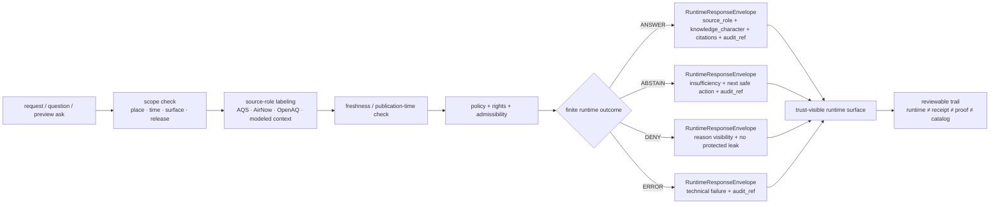

<!-- [KFM_META_BLOCK_V2]
doc_id: kfm://doc/NEEDS_VERIFICATION__air_quality_runtime_proof_readme
title: Runtime Proof — Air Quality
type: standard
version: v1
status: draft
owners: @bartytime4life
created: NEEDS_VERIFICATION__YYYY-MM-DD
updated: NEEDS_VERIFICATION__YYYY-MM-DD
policy_label: NEEDS_VERIFICATION__public_or_internal
related: [
  ../README.md,
  ../../README.md,
  ../../release_assembly/README.md,
  ../../correction/README.md,
  ../../../README.md,
  ../../../contracts/README.md,
  ../../../policy/README.md,
  ../../../integration/README.md,
  ../../../reproducibility/README.md,
  ../../../unit/README.md,
  ../../../accessibility/README.md,
  ../../../../README.md,
  ../../../../CONTRIBUTING.md,
  ../../../../contracts/README.md,
  ../../../../policy/README.md,
  ../../../../schemas/README.md,
  ../../../../docs/README.md,
  ../../../../.github/CODEOWNERS,
  ../../../../.github/workflows/README.md
]
tags: [kfm, tests, e2e, runtime-proof, air-quality, aqs, airnow, openaq]
notes: [
  Air-quality and atmospheric context are strongly supported in KFM doctrine, but exact mounted leaf inventory, runner wiring, workflow callers, and any executable air-quality thin slice remain NEEDS VERIFICATION.
  This revision follows the repo-visible runtime-proof leaf pattern while keeping AQS, AirNow, and OpenAQ source-role distinctions explicit.
  doc_id, created date, updated date, policy_label, and any leaf-local executable inventory need repo-backed verification before merge.
]
[/KFM_META_BLOCK_V2] -->

<a id="top"></a>

# Runtime Proof — Air Quality

Request-time proof lane for explicit air-quality source roles, freshness handling, citation visibility, and fail-closed runtime behavior in KFM.

> [!NOTE]
> **Status:** `experimental`  
> **Owners:** `@bartytime4life` *(confirmed at `/tests/` scope; leaf-level assignment still needs branch verification)*  
> **Path:** `tests/e2e/runtime_proof/air_quality/README.md`  
> **Repo fit:** child whole-path proof leaf under [`../README.md`](../README.md), inside the broader [`../../README.md`](../../README.md) `e2e/` family; bounded by authoritative contract, policy, schema, and workflow documentation surfaces rather than replacing them  
> **Accepted inputs:** small request/response fixtures, source-role-explicit air-quality candidates, freshness/degraded-state cases, provenance or rights insufficiency cases, and minimal expected handoff fragments  
> **Exclusions:** policy authorship, canonical source-admission law, release-proof artifacts, provider mirroring, and guessed workflow claims  
>         
> **Quick jumps:** [Scope](#scope) · [Current evidence posture](#current-evidence-posture) · [Repo fit](#repo-fit) · [Accepted inputs](#accepted-inputs) · [Exclusions](#exclusions) · [Directory tree](#directory-tree) · [Quickstart](#quickstart) · [Usage](#usage) · [Runtime outcomes](#runtime-outcomes) · [Proof matrix](#proof-matrix) · [Diagram](#diagram) · [Operating tables](#operating-tables) · [Task list](#task-list--definition-of-done) · [FAQ](#faq) · [Appendix](#appendix)

> [!IMPORTANT]
> This leaf should prove **runtime behavior**, not quietly become the home of source custody, policy authority, release proof, or workflow mythology.

> [!CAUTION]
> **Air quality is not one flat source class.**  
> Keep **AQS**, **AirNow**, **OpenAQ**, and any modeled or anomaly context visibly distinct instead of flattening them into a generic “air data” story.

---

## Scope

This directory is for **whole-path runtime proof** of air-quality behavior in the KFM request-time surface.

It should prove whether a runtime-facing request can or cannot produce a qualified outward result when air-quality support is:

- present and well-formed
- source-explicit
- fresh enough for the requested use
- public-safe at the requested scope
- provenance-complete enough to cite
- visibly limited when support is weak, mixed, stale, or policy-constrained

This leaf should **not** decide final publication policy, sign release artifacts, or imply a mounted scheduler, watcher, or fusion pipeline.

### What this leaf is proving

- request-time outcome behavior
- fail-closed handling of weak or malformed support
- visible distinction between **regulatory archival**, **current public reporting**, **discovery-layer aggregation**, and **modeled or anomaly** context
- source-role clarity for **AQS**, **AirNow**, and **OpenAQ**
- explicit separation of **runtime response**, **receipt**, **proof**, and **catalog** functions
- visibility of `source_ref`, `source_role`, `knowledge_character`, freshness basis, and `audit_ref` where outward trust depends on them
- finite runtime outcomes without a hidden fifth “soft success” state

### What this leaf is not proving

- branch-protected release automation
- cryptographic publication success
- final schema-home authority
- full provider-ingestion law
- live connector depth on the checked-out branch
- correctness of smoke models, anomaly models, or EO change pipelines as such

[Back to top](#top)

---

## Current evidence posture

| Surface or claim | Status | Why it matters here |
| --- | --- | --- |
| `tests/e2e/` is a real visible family with `correction/`, `release_assembly/`, and `runtime_proof/` | **CONFIRMED** | This leaf should read like a child of an already differentiated e2e family, not like a generic test note |
| `runtime_proof/` is the request-time evidence / citations / finite-outcome burden inside `tests/e2e/` | **CONFIRMED** | Air-quality whole-path cases belong here when the main question is outward runtime behavior |
| `/tests/` ownership currently resolves to `@bartytime4life` | **CONFIRMED** | Grounds the visible owners line at the family scope |
| Air / climate / EO context is valuable but requires strict knowledge-character labeling | **CONFIRMED doctrine / EXTERNALLY CONFIRMED** | This leaf should not flatten observed, reported, modeled, or anomaly-derived material into one answer class |
| `AQS`, `AirNow`, and `OpenAQ` carry materially different source roles | **CONFIRMED doctrine / EXTERNALLY CONFIRMED** | The leaf must keep regulatory archival context, current public AQI reporting, and discovery/aggregation distinct |
| Exact mounted contents of `tests/e2e/runtime_proof/air_quality/` on the active branch | **UNKNOWN** | This README must not overclaim leaf-local fixtures, suite depth, or runner commands |
| Checked-in workflow YAML or merge-blocking enforcement for this leaf | **NEEDS VERIFICATION** | The visible workflow lane remains documentation-led in the surfaced evidence; no YAML should be invented here |

[Back to top](#top)

---

## Repo fit

### Path and neighboring surfaces

| Direction | Surface | Why it matters |
| --- | --- | --- |
| Upstream | [`../README.md`](../README.md) | defines the broader `runtime_proof/` burden: request-time outcomes stay finite and inspectable |
| Upstream | [`../../README.md`](../../README.md) | defines the three current `e2e/` leaves and their different burdens |
| Upstream | [`../../../README.md`](../../../README.md) | keeps this leaf aligned with the broader `tests/` family lattice |
| Upstream | [`../../../../README.md`](../../../../README.md) | keeps the leaf aligned with the repo’s governed, evidence-first posture |
| Upstream | [`../../../../CONTRIBUTING.md`](../../../../CONTRIBUTING.md) | keeps claims, commands, and repo-fit assertions evidence-bounded |
| Authority | [`../../../../contracts/README.md`](../../../../contracts/README.md) | runtime proof should consume authoritative contracts, not restate them |
| Authority | [`../../../../policy/README.md`](../../../../policy/README.md) | deny-by-default, reason/obligation logic, and review posture originate there |
| Authority | [`../../../../schemas/README.md`](../../../../schemas/README.md) | shape authority should remain singular even when runtime fixtures pressure it |
| Workflow boundary | [`../../../../.github/workflows/README.md`](../../../../.github/workflows/README.md) | workflow references remain proof burden, not evidence of checked-in merge gates |
| Ownership boundary | [`../../../../.github/CODEOWNERS`](../../../../.github/CODEOWNERS) | establishes the visible review owner fallback for `/tests/` |
| Better home | [`../../../policy/README.md`](../../../policy/README.md) | use that family when the main question is policy grammar rather than runtime consequence |
| Better home | [`../../../contracts/README.md`](../../../contracts/README.md) | use that family when the main risk is contract or schema drift |
| Neighbor leaf | [`../../release_assembly/README.md`](../../release_assembly/README.md) | use that leaf when publish-path proof is the main question |
| Neighbor leaf | [`../../correction/README.md`](../../correction/README.md) | use that leaf when withdrawal, supersession, or stale-visible lineage is the main question |

### Working path note

This file uses the requested path name `air_quality/`, but the stronger doctrinal vocabulary around it remains:

- air quality
- atmospheric context
- smoke context
- climate anomalies
- EO-derived context

Treat `air_quality/` as a local leaf name, not a permission to collapse those distinctions.

[Back to top](#top)

---

## Accepted inputs

This lane should accept **small, explicit, reviewable** materials that prove runtime behavior without turning the directory into a provider mirror or release lane.

### Typical accepted inputs

| Input class | Examples | Why it belongs here |
| --- | --- | --- |
| Request / response fixture pairs | `request.json` + `expected.response.json` by case | lets the leaf prove finite outcomes clearly |
| Source-role-explicit context candidates | one `AQS` historical PM2.5 case, one `AirNow` current AQI case, one `OpenAQ` discovery-layer case with preserved provider metadata | lets the leaf prove that source roles stay visible at runtime |
| Freshness or degraded-state cases | stale public-reporting ask, lag-aware historical ask, missing update window | lets the leaf prove that time semantics are outward-facing, not hidden |
| Provenance or rights insufficiency cases | missing provider identity, missing license posture, unresolved upstream network | lets the leaf prove clean `ABSTAIN` rather than overclaim |
| Policy-blocked outward requests | non-public or restricted provider detail, unsupported outward use, blocked disclosure request | lets the leaf prove explicit `DENY` |
| Malformed request fixtures | bad query shape, unsupported quantity kind, invalid window | lets the leaf prove explicit `ERROR` |

### Good first thin-slice cases

A minimal honest starter set is:

1. one `ANSWER` for labeled **AirNow** public AQI context
2. one `ANSWER` for labeled **AQS** regulatory or historical PM2.5 context
3. one `ABSTAIN` for missing provider, provenance, or rights posture
4. one `ABSTAIN` for unresolved source-role mix
5. one `DENY` for a blocked disclosure or restricted outward-use request
6. one `ERROR` for malformed input

### Operating rules for fixture design

1. Keep source identity explicit.
2. Keep source role explicit.
3. Keep knowledge-character explicit.
4. Keep freshness basis explicit.
5. Keep request scope explicit.
6. Keep fixtures small enough to review in Git.
7. Label modeled, smoke, or anomaly context as modeled/context rather than direct observation.
8. Keep **runtime response ≠ receipt ≠ proof ≠ catalog** visible even in examples.
9. Do not upgrade discovery-layer aggregation into regulatory truth by omission.

> [!NOTE]
> If a shared air-quality fixture lane becomes mounted later, prefer consuming its tiny reusable slices instead of duplicating larger source-shaped files inside this e2e leaf.

[Back to top](#top)

---

## Exclusions

| Does **not** belong here | Put it here instead | Why |
| --- | --- | --- |
| Canonical source-admission law | root contract / schema surfaces | this leaf should prove runtime behavior, not become the source-admission authority |
| Policy bundle source files or reviewer-role registries | root policy surfaces | policy remains the source of truth for allow / deny / review behavior |
| Release manifests, attestation bundles, signed proof packs, or published artifacts as primary records | [`../../release_assembly/README.md`](../../release_assembly/README.md) and release / proof lanes | runtime proof is not the same as release proof |
| Withdrawal, supersession, or stale-visible lineage as the main topic | [`../../correction/README.md`](../../correction/README.md) | correction deserves its own leaf |
| Large raw pulls from **AQS**, **AirNow**, **OpenAQ**, or other providers | governed data zones or local ignored paths | this leaf should not become a provider mirror |
| Live watcher code, scheduler wiring, connector helpers, fusion code, or smoke-model logic | pipeline / tool / workflow lanes | README prose is not implementation proof |
| Calibration notebooks, exploratory fusion experiments, or atmospheric-science heuristics | subject pipeline / validator lanes | runtime proof should consume reviewed results, not become the science lab |
| Contract-vs-schema authority settlement by prose alone | repo-wide contract / schema decision | this leaf should stay truthful about unresolved authority seams |

> [!WARNING]
> Do not use this directory to smuggle in unconstrained provider data just because it is convenient to fetch.  
> Runtime proof should stay reviewable, bounded, and policy-conscious.

[Back to top](#top)

---

## Directory tree

### Current safe claim

This session did **not** surface the active branch contents for this exact target leaf.

The only safe branch-backed claim this README can make without overreach is the target document itself.

```text
tests/e2e/runtime_proof/
└── air_quality/
    └── README.md
```

### Preferred growth shape (`PROPOSED` / `NEEDS VERIFICATION`)

```text
tests/e2e/runtime_proof/
└── air_quality/
    ├── README.md
    ├── fixtures/
    │   ├── answer_airnow_public_aqi_context_labeled/
    │   │   ├── request.json
    │   │   └── expected.response.json
    │   ├── answer_aqs_regulatory_pm25_context_labeled/
    │   │   ├── request.json
    │   │   └── expected.response.json
    │   ├── abstain_missing_provider_or_license/
    │   │   ├── request.json
    │   │   └── expected.response.json
    │   ├── abstain_unresolved_source_role_mix/
    │   │   ├── request.json
    │   │   └── expected.response.json
    │   ├── deny_prohibited_source_disclosure/
    │   │   ├── request.json
    │   │   └── expected.response.json
    │   └── error_malformed_request/
    │       ├── request.json
    │       └── expected.response.json
    └── examples/
        └── verify-air-quality-runtime.<ext>
```

> [!TIP]
> Add only the smallest leaf shape the active branch can actually support. A narrow truthful subtree is better than a broad speculative one.

[Back to top](#top)

---

## Quickstart

Use inspection-first commands so this README stays honest as the branch evolves.

### 1) Confirm what is actually mounted

```bash
find tests/e2e -maxdepth 4 -print 2>/dev/null | sort
find tests/e2e/runtime_proof -maxdepth 4 -print 2>/dev/null | sort
find tests/e2e/runtime_proof/air_quality -maxdepth 4 -print 2>/dev/null | sort
```

### 2) Re-read the family map before adding cases

```bash
sed -n '1,260p' tests/README.md 2>/dev/null || true
sed -n '1,240p' tests/e2e/README.md 2>/dev/null || true
sed -n '1,220p' tests/e2e/runtime_proof/README.md 2>/dev/null || true
sed -n '1,220p' tests/e2e/release_assembly/README.md 2>/dev/null || true
sed -n '1,220p' tests/e2e/correction/README.md 2>/dev/null || true
sed -n '1,220p' tests/policy/README.md 2>/dev/null || true
sed -n '1,220p' tests/contracts/README.md 2>/dev/null || true
sed -n '1,220p' .github/workflows/README.md 2>/dev/null || true
```

### 3) Reconfirm air-quality vocabulary before inventing payloads

```bash
grep -RIn \
  -e 'air quality' \
  -e 'AQS' \
  -e 'AirNow' \
  -e 'OpenAQ' \
  -e 'PM2.5' \
  -e 'AQI' \
  -e 'spec_hash' \
  -e 'run_receipt' \
  -e 'SourceDescriptor' \
  -e 'RuntimeResponseEnvelope' \
  -e 'knowledge_character' \
  -e 'ABSTAIN' \
  -e 'DENY' \
  -e 'ERROR' \
  tests contracts policy schemas docs tools pipelines apps 2>/dev/null || true
```

### 4) Start with one case per outcome

A good first pass is:

1. one `ANSWER` for labeled public-reporting context
2. one `ANSWER` for labeled regulatory or historical context
3. one `ABSTAIN` for provenance or rights insufficiency
4. one `DENY` for blocked outward use
5. one `ERROR` for malformed request

### 5) Document the real runner only after it exists

If this leaf later gains an executable invocation surface, document the **actual** local and CI command path used on the active branch. Do not leave guessed `pytest`, `node`, shell, or workflow commands behind.

### First local review pass

1. Confirm whether the checked-out branch intentionally differs from public `main`, and update this README if it does.
2. Confirm whether the checked-out branch still matches the visible `tests/e2e/runtime_proof/` shape.
3. Confirm whether this leaf contains executable cases or only scaffolding.
4. Confirm the actual runner or toolchain before documenting any execution command.
5. Confirm whether negative paths exist, not only happy-path success.
6. Confirm whether emitted traces preserve source role, citation posture, and `audit_ref`.
7. Confirm whether the leaf stays inside the governed runtime path and does not bypass release, policy, or evidence resolution.

> [!TIP]
> Inspection-first is safer than guessing a toolchain. Do not document `npm`, `pnpm`, `pytest`, browser harness, or GitHub required-check commands here until the checked-out branch proves them directly.

[Back to top](#top)

---

## Usage

### What belongs here conceptually

Use this leaf when the main question is:

> “Does the request-time KFM runtime respond correctly and visibly when air-quality support is sufficient, stale, provenance-thin, source-role-confused, policy-constrained, or malformed?”

### What belongs elsewhere

| If the main question is… | Best home | Why |
| --- | --- | --- |
| “Is the source admitted safely and explicitly?” | contract / source-descriptor surfaces | admission law belongs there |
| “Are the tiny source slices reusable and stable?” | shared fixture lane | that is fixture custody, not whole-path runtime proof |
| “Did subject-level validation pass or fail?” | subject validator lane | validator burden is narrower than outward runtime behavior |
| “Does policy allow, deny, or route review?” | policy lanes | policy is the authority there |
| “Did publication / promotion / signing close correctly?” | release-assembly lanes | that is release proof, not runtime proof |
| “Did correction, supersession, or stale-visible lineage stay coherent?” | correction lanes | correction lineage is the primary burden there |
| “Is this mainly a smoke, anomaly, or EO model-quality question?” | model / pipeline / validator lanes | source-science burden is different from runtime outcome burden |

### Why this leaf exists at all

KFM treats **runtime proof** as the request-time lane where evidence resolution, citation behavior, policy shaping, and finite outcomes must stay honest under pressure.

Air quality belongs here when the main burden is outward runtime behavior, especially because the lane is easy to misread if:

- regulatory archives are presented as live public conditions
- current public AQI reporting is silently treated as regulatory truth
- discovery-layer aggregation is treated as homogeneous provenance
- modeled or anomaly context is surfaced without visible classification

[Back to top](#top)

---

## Runtime outcomes

This leaf should use a **finite runtime grammar**.

| Outcome | What it means here | Typical trigger | Minimum outward cues |
| --- | --- | --- | --- |
| `ANSWER` | support is sufficient, admissible, and source-explicit | labeled public-reporting or regulatory context resolves cleanly | source role, knowledge character, freshness basis, reviewable reason, `audit_ref` |
| `ABSTAIN` | evidence is insufficient, stale, rights-thin, or source-role ambiguous | missing provider metadata, unresolved upstream network, role confusion | visible insufficiency signal, next safe action, `audit_ref` |
| `DENY` | request is blocked by policy, rights, sensitivity, or publication state | blocked outward use or prohibited disclosure request | visible deny state, reason visibility, no protected leak, `audit_ref` |
| `ERROR` | runtime cannot safely interpret or fulfill the request | malformed request or missing required runtime input | explicit technical failure, no masquerade as `ABSTAIN` or `DENY`, `audit_ref` |

> [!IMPORTANT]
> A polite but uncited “best effort” answer is **not** a fifth outcome.

[Back to top](#top)

---

## Proof matrix

### Thin-slice starter matrix (`PROPOSED`)

| Fixture | Primary burden | Expected outcome |
| --- | --- | --- |
| `answer_airnow_public_aqi_context_labeled/` | public-safe current reporting with explicit source role | `ANSWER` |
| `answer_aqs_regulatory_pm25_context_labeled/` | regulatory or archival context without “right now” overclaim | `ANSWER` |
| `abstain_missing_provider_or_license/` | insufficient provenance or rights posture | `ABSTAIN` |
| `abstain_unresolved_source_role_mix/` | unresolved blend of incompatible source roles | `ABSTAIN` |
| `deny_prohibited_source_disclosure/` | blocked outward-use or provider-disclosure request | `DENY` |
| `error_malformed_request/` | malformed or structurally invalid input | `ERROR` |

### Review rule

The leaf should make it obvious whether the problem was:

- not enough support,
- a policy block,
- or a technical failure.

Those are different outcomes and should remain different.

[Back to top](#top)

---

## Diagram



[Back to top](#top)

---

## Operating tables

### Source-role table

| Source family | Treat as | Why runtime must care | Good first outward use |
| --- | --- | --- | --- |
| `AQS` | regulatory archival / historical observation | authoritative but not the “right now” surface | qualified historical or regulatory context |
| `AirNow` | current public-facing reporting | freshness first, not archival regulatory record | public AQI or current-condition context |
| `OpenAQ` | discovery / aggregation surface | provider, provenance, and license can vary by upstream network | discovery-rich context only when provider semantics stay visible |
| modeled smoke, anomaly, or EO layers | modeled or image-derived context | analytically useful, but not the same epistemic class as direct observation | labeled context overlays, not flattened truth |

### Minimal response obligations by question type

| Question shape | Safe first answer posture |
| --- | --- |
| “What is the current AQI here?” | prefer labeled current public reporting |
| “What does the regulatory archive say?” | prefer labeled regulatory or historical context |
| “Can you blend or reinterpret mixed sources for me?” | abstain unless the source-role and method burden is explicit |
| “Can you expose blocked or restricted provider detail?” | deny |
| “Can you answer from malformed or incomplete request input?” | error |

[Back to top](#top)

---

## Task list / definition of done

- [ ] one thin-slice case exists for each of `ANSWER`, `ABSTAIN`, `DENY`, and `ERROR`
- [ ] `AQS`, `AirNow`, and `OpenAQ` remain visibly distinct in fixture naming and outward reasoning
- [ ] no fixture silently upgrades discovery-layer material into regulatory truth
- [ ] freshness basis is visible when time sensitivity matters
- [ ] policy-only logic stays upstream of this leaf
- [ ] request and expected files stay small enough to review in Git
- [ ] no guessed runner or workflow command is documented here
- [ ] `audit_ref` or equivalent decision linkage stays visible in outward examples
- [ ] if this leaf later emits reviewer artifacts, that artifact policy is made explicit rather than implied

[Back to top](#top)

---

## FAQ

### Why not just say “air quality” and stop there?

Because KFM treats source roles as admission and publication burdens, not decorative labels. An **AQS** record, an **AirNow** current AQI surface, an **OpenAQ** aggregation result, and a modeled smoke or anomaly layer do not mean the same thing.

### Does this leaf prove smoke or anomaly model correctness?

No. It proves governed runtime behavior under declared support and policy conditions. Model-quality, fusion quality, or atmospheric-science claims belong in subject validators or pipeline lanes.

### Does this README prove checked-in workflow YAML or required checks already exist?

No. This leaf is intentionally bounded. Until the checked-out branch proves those surfaces directly, this README should not imply them.

[Back to top](#top)

---

## Appendix

<details>
<summary><strong>Illustrative example envelopes</strong> (<strong>illustrative only</strong>)</summary>

These examples are here to make the leaf concrete without pretending the final request or response contract is already mounted and canonical.

### Example `ANSWER`

```json
{
  "outcome": "ANSWER",
  "reason": {
    "code": "air_quality_context_supported",
    "message": "Qualified public-safe air-quality context was available for the requested window."
  },
  "source_ref": "kfm://source/airnow",
  "source_role": "current_public_reporting",
  "knowledge_character": "observed_public_reporting",
  "observed_window": {
    "start": "2026-04-01T18:00:00Z",
    "end": "2026-04-01T19:00:00Z"
  },
  "quantity_kind": "AQI",
  "freshness": {
    "status": "acceptable"
  },
  "audit_ref": "kfm://receipt/runtime/air-quality-001"
}
```

### Example `ABSTAIN`

```json
{
  "outcome": "ABSTAIN",
  "reason": {
    "code": "missing_provider_or_license",
    "message": "Air-quality support was present, but provider or rights posture was not explicit enough for a trustworthy outward answer."
  },
  "source_role": "discovery_or_aggregation",
  "knowledge_character": "provider_unresolved",
  "audit_ref": "kfm://receipt/runtime/air-quality-002"
}
```

### Example `DENY`

```json
{
  "outcome": "DENY",
  "reason": {
    "code": "prohibited_source_disclosure",
    "message": "The requested outward action would disclose blocked or non-public provider detail."
  },
  "audit_ref": "kfm://receipt/runtime/air-quality-003"
}
```

### Example `ERROR`

```json
{
  "outcome": "ERROR",
  "reason": {
    "code": "malformed_request",
    "message": "The runtime request payload was malformed or incomplete."
  },
  "audit_ref": "kfm://receipt/runtime/air-quality-004"
}
```

> [!NOTE]
> The field names above are illustrative. Keep them synchronized with mounted contracts and runtime code before treating them as canonical.

</details>

[Back to top](#top)
