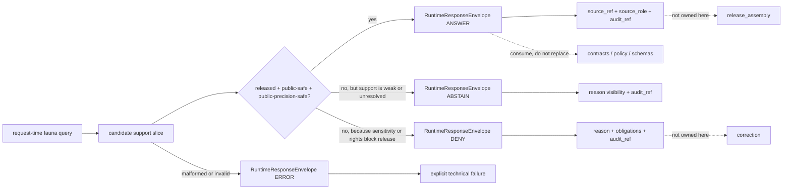

<!-- [KFM_META_BLOCK_V2]
doc_id: kfm://doc/NEEDS_VERIFICATION__runtime_proof_fauna_readme
title: Runtime Proof — Fauna
type: standard
version: v1
status: draft
owners: @bartytime4life
created: NEEDS_VERIFICATION__YYYY-MM-DD
updated: NEEDS_VERIFICATION__YYYY-MM-DD
policy_label: NEEDS_VERIFICATION__public_or_restricted
related: [
  ../README.md,
  ../../README.md,
  ../../release_assembly/README.md,
  ../../correction/README.md,
  ../../../README.md,
  ../../../../README.md,
  ../../../../CONTRIBUTING.md,
  ../../../../contracts/README.md,
  ../../../../policy/README.md,
  ../../../../schemas/README.md,
  ../../../../.github/workflows/README.md
]
tags: [kfm, tests, e2e, runtime-proof, fauna, biodiversity, wildlife, habitat, geoprivacy]
notes: [
  Target leaf path was requested directly, but exact mounted fauna subtree was not surfaced in current-session evidence.
  KFM doctrine more often speaks in terms of biodiversity, wildlife, habitat, and rare-species lanes; this README keeps those distinctions visible instead of flattening them into a generic fauna bucket.
  Owners are grounded at `/tests/` scope; leaf-level ownership, final policy label, and current branch inventory still need direct verification.
]
[/KFM_META_BLOCK_V2] -->

<a id="top"></a>

# Runtime Proof — Fauna

Request-time proof lane for wildlife, habitat, and species-facing outcomes where source role, geoprivacy, release state, and fail-closed behavior must remain visible.

> [!NOTE]
> **Status:** `experimental`  
> **Owners:** `@bartytime4life` *(CONFIRMED at `/tests/` scope; leaf-level assignment still needs branch verification)*  
> **Path:** `tests/e2e/runtime_proof/fauna/README.md`  
>         
> **Quick jump:** [Scope](#scope) · [Current evidence posture](#current-evidence-posture) · [Repo fit](#repo-fit) · [Inputs](#inputs) · [Exclusions](#exclusions) · [Directory tree](#directory-tree) · [Quickstart](#quickstart) · [Usage](#usage) · [Runtime outcomes](#runtime-outcomes) · [Diagram](#diagram) · [Operating tables](#operating-tables) · [Task list](#task-list--definition-of-done) · [FAQ](#faq) · [Appendix](#appendix)

> [!IMPORTANT]
> This leaf should prove **runtime behavior**, not quietly become the home of source custody, policy authority, release proof, or workflow mythology.

> [!CAUTION]
> The requested path name is `fauna/`, but KFM doctrine is more precise than that.  
> Keep **wildlife observations**, **habitat context**, **modeled range products**, and **regulatory layers** visibly distinct. A KDWP range-context product, a USFWS critical-habitat polygon, a USGS GAP modeled range, and a GBIF occurrence extract do **not** enter under the same trust conditions.

## Scope

This directory is for **whole-path runtime proof** of fauna-facing behavior in KFM.

It should prove whether a runtime-facing request can or cannot produce a qualified outward result when wildlife support is:

- public-safe and generalized enough to answer
- present but evidence-thin enough to abstain
- sensitive or rights-restricted enough to deny
- malformed enough to return explicit error

This leaf is about **outward governed behavior**, not biological truth by itself. It should prove that the system stays honest when a user asks for species-presence, habitat, or wildlife-context information and the answer depends on source role, release state, rights, precision, and sensitivity.

## Current evidence posture

| Marker | Meaning in this README |
|---|---|
| **CONFIRMED** | Directly supported by attached KFM doctrine or adjacent repo-facing drafts surfaced in this session |
| **INFERRED** | Strongly implied by combined doctrine and repo-facing materials, but not directly re-proven from a mounted checkout |
| **PROPOSED** | Repo-native structure that fits KFM doctrine without claiming current checked-in reality |
| **UNKNOWN** | Not supported strongly enough to describe as current branch or runtime fact |
| **NEEDS VERIFICATION** | Placeholder or branch-specific detail that still needs direct recheck before merge |

### Working rule

Use the strongest surfaced evidence first:

1. runtime-proof family doctrine
2. biodiversity / wildlife / habitat lane doctrine
3. fauna-adjacent thin slices and policy examples
4. only then a proposed local growth shape for this leaf

## Repo fit

**Path:** `tests/e2e/runtime_proof/fauna/README.md`  
**Role:** leaf README for request-time wildlife and habitat proof under `tests/e2e/runtime_proof/`.

### Upstream and adjacent anchors

| Relation | Path | Why it matters |
|---|---|---|
| Parent runtime-proof family | [`../README.md`](../README.md) | defines the request-time outcome burden for this leaf family |
| Parent e2e family | [`../../README.md`](../../README.md) | defines the whole-path proof umbrella and sibling leaf boundaries |
| Parent tests lattice | [`../../../README.md`](../../../README.md) | keeps placement aligned with the broader verification family map |
| Repo root posture | [`../../../../README.md`](../../../../README.md) | keeps the file aligned with KFM’s evidence-first posture |
| Contribution contract | [`../../../../CONTRIBUTING.md`](../../../../CONTRIBUTING.md) | keeps claims and commands evidence-bounded |
| Workflow boundary | [`../../../../.github/workflows/README.md`](../../../../.github/workflows/README.md) | current workflow visibility and its limits live there |
| Contract source | [`../../../../contracts/README.md`](../../../../contracts/README.md) | runtime proof should consume authority, not restate it |
| Policy source | [`../../../../policy/README.md`](../../../../policy/README.md) | allow/deny/review behavior belongs there when policy is the main unit of work |
| Schema source | [`../../../../schemas/README.md`](../../../../schemas/README.md) | prevents a second schema home from forming inside `tests/` |
| Neighbor leaf | [`../../release_assembly/README.md`](../../release_assembly/README.md) | use that leaf when publish-path proof is the main question |
| Neighbor leaf | [`../../correction/README.md`](../../correction/README.md) | use that leaf when withdrawal, supersession, or stale-visible lineage is the main question |

### Working path note

This file uses the requested path name `fauna/`, but the stronger doctrinal vocabulary around it remains:

- biodiversity / rare species
- wildlife
- habitat
- regulatory context
- modeled range
- occurrence evidence

Treat `fauna/` as a local leaf name, not a permission to collapse those distinctions.

## Inputs

Content that belongs here includes small, reviewable request-time proof cases such as:

| Input class | Why it belongs here |
|---|---|
| Generalized regulatory or range-context request fixtures | lets the leaf prove a safe `ANSWER` without leaking exact sites |
| Modeled range overlays clearly labeled as modeled | proves runtime can keep “modeled” distinct from “observed” |
| Evidence-thin or provenance-incomplete request fixtures | lets the leaf prove `ABSTAIN` cleanly |
| Sensitive exact-location request fixtures | lets the leaf prove `DENY` without bluffing |
| Restricted-license or non-redistributable request fixtures | lets the leaf prove rights-aware `DENY` |
| Malformed request fixtures | lets the leaf prove explicit `ERROR` rather than soft failure |

### Good first thin-slice cases

A minimal honest starter set is:

1. one `ANSWER` for generalized public-safe fauna context
2. one `ABSTAIN` for missing evidence or unresolved provenance
3. one `DENY` for exact sensitive location or restricted reuse
4. one `ERROR` for malformed request or invalid fixture shape

## Exclusions

This directory is **not** the authoritative home for every fauna-adjacent concern.

| Does **not** belong here | Put it here instead | Why |
|---|---|---|
| Canonical source-admission law | root contract / schema surfaces | admission law should stay upstream |
| Policy bundle source files | root policy surfaces | this leaf proves runtime behavior, not policy authorship |
| Release manifests, proof packs, and signed publication artifacts | [`../../release_assembly/README.md`](../../release_assembly/README.md) and release-bearing surfaces | release proof is a different end-to-end burden |
| Withdrawal, supersession, or stale-visible lineage as the main topic | [`../../correction/README.md`](../../correction/README.md) | correction deserves its own leaf |
| Large raw provider pulls or scrape caches | governed data zones or ignored local paths | runtime proof should stay compact and reviewable |
| Live watcher code, scheduler wiring, and connector helpers | pipeline, tool, or workflow lanes | README prose is not implementation proof |
| Canonical wildlife/habitat metadata sidecars, schemas, or reusable validators | owning contract / schema / validator surfaces | this leaf should consume them, not replace them |
| Sensitive coordinates, direct identifiers, or non-public occurrence detail | quarantined or steward-only surfaces | exact disclosure is often the thing this leaf must deny |

[Back to top](#top)

## Directory tree

### Current safe claim

This session did **not** surface the active branch contents for this exact target leaf.

The only safe branch-backed claim this README can make without overreach is the target document itself.

```text
tests/e2e/runtime_proof/
└── fauna/
    └── README.md
```

### Preferred growth shape (`PROPOSED` / `NEEDS VERIFICATION`)

```text
tests/e2e/runtime_proof/
└── fauna/
    ├── README.md
    ├── fixtures/
    │   ├── answer_generalized_regulatory_context_public_safe/
    │   │   ├── request.json
    │   │   └── expected.response.json
    │   ├── answer_modeled_range_labeled_modeled/
    │   │   ├── request.json
    │   │   └── expected.response.json
    │   ├── abstain_missing_provenance_or_license/
    │   │   ├── request.json
    │   │   └── expected.response.json
    │   ├── abstain_review_pending_sensitive_occurrence/
    │   │   ├── request.json
    │   │   └── expected.response.json
    │   ├── deny_sensitive_exact_occurrence/
    │   │   ├── request.json
    │   │   └── expected.response.json
    │   ├── deny_restricted_license_or_natureserve/
    │   │   ├── request.json
    │   │   └── expected.response.json
    │   └── error_malformed_request/
    │       ├── request.json
    │       └── expected.response.json
    └── examples/
        └── fauna.overlay.min.public-safe.json
```

> [!TIP]
> Add only the smallest leaf shape the active branch can actually support. A narrow truthful subtree is better than a broad speculative one.

## Quickstart

Use inspection-first commands so this README stays honest as the branch evolves.

### 1) Confirm what is actually mounted

```bash
find tests/e2e -maxdepth 4 -print 2>/dev/null | sort
find tests/e2e/runtime_proof -maxdepth 4 -print 2>/dev/null | sort
find tests/e2e/runtime_proof/fauna -maxdepth 4 -print 2>/dev/null | sort
```

### 2) Re-read the family map before adding cases

```bash
sed -n '1,260p' tests/README.md 2>/dev/null || true
sed -n '1,240p' tests/e2e/README.md 2>/dev/null || true
sed -n '1,220p' tests/e2e/runtime_proof/README.md 2>/dev/null || true
sed -n '1,220p' tests/e2e/release_assembly/README.md 2>/dev/null || true
sed -n '1,220p' tests/e2e/correction/README.md 2>/dev/null || true
sed -n '1,220p' policy/README.md 2>/dev/null || true
sed -n '1,220p' contracts/README.md 2>/dev/null || true
sed -n '1,220p' schemas/README.md 2>/dev/null || true
sed -n '1,220p' .github/workflows/README.md 2>/dev/null || true
```

### 3) Reconfirm fauna vocabulary before inventing payloads

```bash
grep -RIn \
  -e 'biodiversity' \
  -e 'wildlife' \
  -e 'habitat' \
  -e 'KDWP' \
  -e 'USFWS' \
  -e 'ECOS' \
  -e 'NatureServe' \
  -e 'GBIF' \
  -e 'generalization' \
  -e 'sensitive' \
  -e 'spec_hash' \
  -e 'run_receipt' \
  -e 'ANSWER' \
  -e 'ABSTAIN' \
  -e 'DENY' \
  -e 'ERROR' \
  tests contracts policy schemas docs tools 2>/dev/null || true
```

### 4) Start with one case per outcome

A good first pass is:

1. one `ANSWER` using generalized public-safe context
2. one `ABSTAIN` using missing provenance or review-pending support
3. one `DENY` using exact-location or restricted-license pressure
4. one `ERROR` using malformed request or invalid fixture shape

### 5) Document the real runner only after it exists

Do not leave guessed `pytest`, browser, or workflow commands here until the checked-out branch proves them.

[Back to top](#top)

## Usage

### What belongs here conceptually

Use this leaf when the main question is:

> “Does the request-time KFM runtime respond correctly and visibly when fauna support is generalized, weak, sensitive, rights-restricted, or malformed?”

### What belongs elsewhere

| If the main question is… | Best home | Why |
|---|---|---|
| “Is the source admitted safely and explicitly?” | contract / source-descriptor surfaces | source admission is upstream law |
| “Is the habitat metadata sidecar valid?” | contract / schema / validator surfaces | shape and governance checks belong there first |
| “Does policy emit the right allow / deny grammar by itself?” | policy surfaces | keep policy grammar isolated when possible |
| “Is publication complete and reviewable?” | [`../../release_assembly/README.md`](../../release_assembly/README.md) | publish-path completeness is a different burden |
| “Does withdrawal or supersession remain visible?” | [`../../correction/README.md`](../../correction/README.md) | correction lineage deserves its own leaf |
| “Is the result stable across reruns?” | reproducibility surfaces | determinism is not the same as request-time proof |

### What this leaf should prove well

- a runtime `ANSWER` does not pretend modeled, regulatory, and observed wildlife support are interchangeable
- an `ABSTAIN` stays explicit when evidence or provenance is too weak
- a `DENY` stays explicit when exact location or rights posture make publication unsafe
- an `ERROR` stays explicit when the request or candidate payload is malformed
- runtime responses do **not** leak proof bundles, catalogs, or publication artifacts into outward envelopes

## Runtime outcomes

KFM’s runtime/public grammar should remain finite here:

| Outcome | When it fits this leaf | What must stay visible |
|---|---|---|
| `ANSWER` | released public-safe fauna context is strong enough to answer | source identity, source role, audit linkage, and any required generalization or modeled/regulatory qualifier |
| `ABSTAIN` | support is missing, provenance is incomplete, or review state is unresolved | explicit insufficiency reason, no fake precision, audit linkage |
| `DENY` | sensitivity, rights, or exact-location exposure blocks the request | explicit deny reason, any obligations such as generalize/withhold/review, audit linkage |
| `ERROR` | request shape, fixture shape, or runtime handling is broken | explicit technical failure outcome, not a disguised abstention or denial |

> [!IMPORTANT]
> These are **runtime/public** outcomes.  
> Gate evaluation and release-state receipts may use different verbs elsewhere in KFM.

## Diagram



## Operating tables

### Source-role pressure that makes fauna different

| Source family | Typical role in this leaf | Public-safe caution |
|---|---|---|
| **KDWP** regulatory lists and range/context products | regulated or stewarded wildlife context | exact occurrence precision may need generalization or withholding |
| **USFWS / ECOS** critical habitat and related regulatory layers | primary regulatory context | keep legal / regulatory posture and provenance visible |
| **USGS GAP** species range or habitat models | modeled contextual overlay | label as modeled; do not present as observation |
| **GBIF**, **iNaturalist**, **eBird** occurrence feeds | corroborative occurrence signals | public point exposure often needs geoprivacy treatment |
| **NatureServe** products | often rights-sensitive or restricted | deny or withhold unless explicit open redistribution posture exists |

### Precision and rights matrix

| Situation | Safer runtime behavior | Why |
|---|---|---|
| generalized county/range or coarse grid context | `ANSWER` if release-safe and well supported | public-safe outward use is plausible |
| missing provenance, source URI, or license posture | `ABSTAIN` | no reconstructible trust path |
| exact rare-species location | `DENY` or withhold from this surface | precision risk is first-class |
| restricted or NatureServe-style license | `DENY` | redistribution posture blocks release |
| malformed request or invalid candidate payload | `ERROR` | technical failure must remain visible |

### Candidate thin-slice fixture matrix

| Fixture idea | Outcome | Why it matters |
|---|---|---|
| `answer_generalized_regulatory_context_public_safe/` | `ANSWER` | proves a safe positive path exists |
| `answer_modeled_range_labeled_modeled/` | `ANSWER` | proves modeled support is visibly qualified |
| `abstain_missing_provenance_or_license/` | `ABSTAIN` | proves weak trust path does not bluff |
| `abstain_review_pending_sensitive_occurrence/` | `ABSTAIN` | proves unresolved review state stays visible |
| `deny_sensitive_exact_occurrence/` | `DENY` | proves exact-location sensitivity fails closed |
| `deny_restricted_license_or_natureserve/` | `DENY` | proves rights restrictions fail closed |
| `error_malformed_request/` | `ERROR` | proves technical failure is explicit |

[Back to top](#top)

## Task list & definition of done

### Thin-slice definition of done

- [ ] this target leaf exists on the active branch
- [ ] one `ANSWER`, one `ABSTAIN`, one `DENY`, and one `ERROR` case exist
- [ ] at least one `ANSWER` case uses generalized public-safe fauna context
- [ ] at least one case keeps **source role** explicit
- [ ] at least one case distinguishes **modeled** from **regulatory** or **observed**
- [ ] at least one `DENY` case proves exact sensitive location does not leak
- [ ] at least one `DENY` case proves restricted-license pressure stays explicit
- [ ] at least one outward response points cleanly to an `audit_ref`
- [ ] `spec_hash` stays visible where the trust story depends on deterministic identity
- [ ] any `run_receipt` example stays visibly downstream of runtime response, not merged into it
- [ ] `actual.response.json` policy is documented honestly if this leaf emits it
- [ ] placeholders in the meta block are replaced with repo-backed values
- [ ] this README does not imply runner, workflow, signing, or branch-protection maturity the branch does not prove

### What should be verified before moving from `draft` toward `review`

- actual mounted `tests/e2e/runtime_proof/fauna/` inventory
- actual runner / toolchain
- whether fauna cases should consume a shared wildlife / habitat fixture lane
- whether any current branch contract or schema surface already defines fauna runtime envelopes
- whether artifact policy for emitted `actual.response.json` is CI-only, checked-in, or hybrid
- whether modeled-range cases and regulatory-context cases already have separate fixture vocabularies
- whether workflow artifact upload and retention behavior is visible on the active branch

## FAQ

### Why `fauna/` when the doctrine talks more about biodiversity, wildlife, habitat, and rare species?

Because the requested path uses `fauna/`, but the doctrinal burden is broader and more precise than one label. This README therefore keeps the stronger distinctions visible instead of treating `fauna` as a license to flatten every wildlife-adjacent source into one bucket.

### Can this leaf ever prove exact rare-species coordinates are safe to answer publicly?

That should be treated as an exceptional claim, not a default. The stronger doctrinal posture is that public point exposure usually needs generalization or withholding.

### Does a generalized `ANSWER` make the source unrestricted?

No. A public-safe answer proves only that the **runtime response** is safe for the intended surface under the declared evidence and policy conditions. It does not rewrite source rights, sensitivity, or publication burden.

### Do `ABSTAIN` and `DENY` count as passing tests?

Yes. In KFM, fail-closed behavior is part of the trust contract. A clearly justified `ABSTAIN` or `DENY` is a successful proof result.

### Does this leaf prove live automation already exists?

No. It documents the burden and a repo-native growth shape. Runner wiring, checked-in workflow YAML, required checks, and exercised runtime traces still need direct branch verification.

### Why not let this leaf decide publication policy directly?

Because KFM keeps policy and release authority upstream. This leaf should prove **request-time behavior** against those authorities, not become a shadow policy engine.

[Back to top](#top)

## Appendix

<details>
<summary><strong>Illustrative example envelopes</strong> (<strong>illustrative only</strong>)</summary>

These examples are here to make the leaf concrete without pretending the final fauna request or runtime contract is already mounted and canonical.

### Example `ANSWER`

```json
{
  "outcome": "ANSWER",
  "reason": {
    "code": "PUBLIC_SAFE",
    "message": "Generalized wildlife context was available for the requested place and time window."
  },
  "source_ref": "kfm://source/usfws_critical_habitat",
  "source_role": "regulatory_context",
  "precision": "generalized_polygon",
  "audit_ref": "kfm://audit/fauna/answer-001"
}
```

### Example `ABSTAIN`

```json
{
  "outcome": "ABSTAIN",
  "reason": {
    "code": "runtime.evidence_missing",
    "message": "The requested fauna claim did not retain enough reconstructible provenance for a trustworthy answer."
  },
  "source_ref": "kfm://source/gbif_occurrence",
  "source_role": "corroborative_occurrence",
  "audit_ref": "kfm://audit/fauna/abstain-001"
}
```

### Example `DENY`

```json
{
  "outcome": "DENY",
  "reason": {
    "code": "sensitive_without_generalization",
    "message": "The candidate support exposed sensitive location detail without an allowed generalization step."
  },
  "obligations": [
    "generalize",
    "withhold",
    "review_required"
  ],
  "audit_ref": "kfm://audit/fauna/deny-001"
}
```

### Example `ERROR`

```json
{
  "outcome": "ERROR",
  "reason": {
    "code": "validation.schema_failed",
    "message": "The fauna runtime fixture was malformed or incomplete."
  },
  "audit_ref": "kfm://audit/fauna/error-001"
}
```

### Example tiny first fixture pack (`PROPOSED`)

```text
tests/e2e/runtime_proof/fauna/
├── README.md
└── fixtures/
    ├── answer_generalized_regulatory_context_public_safe/
    │   ├── request.json
    │   └── expected.response.json
    ├── abstain_missing_provenance_or_license/
    │   ├── request.json
    │   └── expected.response.json
    ├── deny_sensitive_exact_occurrence/
    │   ├── request.json
    │   └── expected.response.json
    └── error_malformed_request/
        ├── request.json
        └── expected.response.json
```

</details>

[Back to top](#top)
