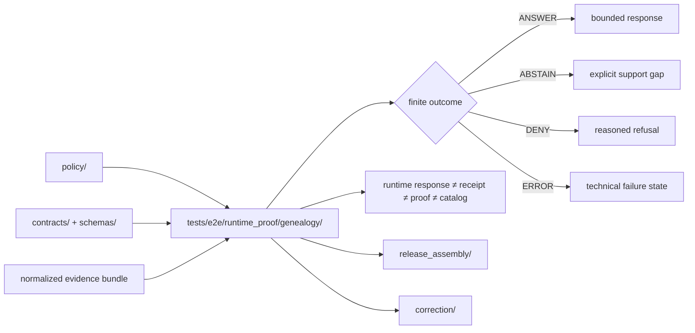

<!-- [KFM_META_BLOCK_V2]
doc_id: kfm://doc/tests/e2e/runtime_proof/genealogy/readme
title: tests/e2e/runtime_proof/genealogy
type: standard
version: v1
status: draft
owners: @bartytime4life
created: 2026-04-15
updated: 2026-04-15
policy_label: restricted
related: [
  ../../../README.md,
  ../../README.md,
  ../README.md,
  ../../correction/README.md,
  ../../release_assembly/README.md,
  ../../../../policy/README.md,
  ../../../../contracts/README.md,
  ../../../../schemas/README.md,
  ../../../../contracts/genealogy/segments.schema.json
]
tags: [kfm, tests, e2e, runtime-proof, genealogy, consent, evidence, abstain, deny]
notes: [
  Thin-slice request-time proof lane for governed genealogy runtime outcomes.
  This README is intentionally narrower than policy, release proof, and correction lineage surfaces.
]
[/KFM_META_BLOCK_V2] -->

<a id="top"></a>

# `tests/e2e/runtime_proof/genealogy/`

Request-time proof lane for governed genealogy runtime behavior: finite outcomes, evidence sufficiency, consent-sensitive denial, and fail-closed handling.

> [!NOTE]
> **Status:** `experimental`  
> **Owners:** `@bartytime4life`  
> **Path:** `tests/e2e/runtime_proof/genealogy/README.md`  
> **Posture:** request-time proof · finite outcomes · fail-closed · restricted sensitivity  
> 
> 
> 
> 
> 
> 
>
> **Quick jumps:** [Scope](#scope) · [Evidence posture](#evidence-posture) · [Repo fit](#repo-fit) · [Accepted inputs](#accepted-inputs) · [Exclusions](#exclusions) · [Directory tree](#directory-tree) · [Quickstart](#quickstart) · [Usage](#usage) · [Finite outcomes](#finite-outcomes) · [Proof matrix](#proof-matrix) · [Diagram](#diagram) · [Operating tables](#operating-tables) · [Task list](#task-list--definition-of-done) · [FAQ](#faq)

> [!IMPORTANT]
> This leaf proves **runtime behavior under evidence and policy pressure**. It is not the authority for genealogy policy law, canonical schema design, release proof packs, or post-release correction lineage.

> [!CAUTION]
> Genealogy and DNA-related material are high-sensitivity surfaces. Keep identifiers pseudonymized, disclosure bounded, and raw genotype handling outside public-safe runtime examples.

---

## Scope

Use this leaf when the main question is:

> “Does the runtime return the correct governed outcome for a genealogy request, given the available evidence and the active policy posture?”

This lane exists to keep four burdens inspectable at request time:

1. **finite runtime outcomes**
2. **evidence sufficiency vs. insufficiency**
3. **consent-sensitive denial behavior**
4. **fail-closed handling for malformed or unsupported requests**

This leaf is intentionally narrower than:

- **policy authorship** (`policy/`)
- **release assembly / publication proof** (`tests/e2e/release_assembly/`)
- **correction / revocation lineage after release** (`tests/e2e/correction/`)

[Back to top](#top)

---

## Evidence posture

| Surface or claim | Status | Notes |
|---|---|---|
| `tests/e2e/` and `tests/e2e/runtime_proof/` are real repo-facing verification families | **CONFIRMED doctrine** | This leaf belongs in a real request-time proof family |
| Runtime outcomes should remain finite (`ANSWER`, `ABSTAIN`, `DENY`, `ERROR`) | **CONFIRMED doctrine** | Matches established KFM runtime-proof posture |
| Genealogy is a restricted-sensitivity lane | **CONFIRMED / PROPOSED LOCALIZATION** | Consistent with consent, privacy, and family-data burden |
| Runtime proof should consume policy and contracts rather than redefine them | **CONFIRMED doctrine** | Keep authority in `policy/`, `contracts/`, and `schemas/` |
| Exact mounted leaf inventory beyond this README | **NEEDS VERIFICATION** | Keep directory claims conservative unless branch-visible |
| Checked-in CI/workflow wiring for this leaf | **NEEDS VERIFICATION** | Do not overclaim enforcement unless visible on branch |

[Back to top](#top)

---

## Repo fit

### Path and neighboring surfaces

| Direction | Surface | Why it matters |
|---|---|---|
| Upstream | [`../README.md`](../README.md) | broader runtime-proof lane doctrine |
| Upstream | [`../../README.md`](../../README.md) | end-to-end testing family context |
| Upstream | [`../../../README.md`](../../../README.md) | top-level tests lane context |
| Adjacent | [`../../correction/README.md`](../../correction/README.md) | owns correction, supersession, and stale-visible lineage burdens |
| Adjacent | [`../../release_assembly/README.md`](../../release_assembly/README.md) | owns promotion, manifest, and release-proof burdens |
| Authority | [`../../../../policy/README.md`](../../../../policy/README.md) | deny-by-default, reasons, obligations, and sensitivity logic belong there |
| Authority | [`../../../../contracts/README.md`](../../../../contracts/README.md) | trust-object and machine-contract authority stays there |
| Authority | [`../../../../schemas/README.md`](../../../../schemas/README.md) | canonical schema-home boundary remains there |
| Local contract | [`../../../../contracts/genealogy/segments.schema.json`](../../../../contracts/genealogy/segments.schema.json) | normalized shared-segment record contract consumed by this lane |

### Placement rule

Put a change here when it primarily proves:

- request-time evidence sufficiency
- runtime outcome correctness
- policy-visible denial or abstention behavior
- fail-closed runtime handling

Move it elsewhere when it primarily defines:

- **policy law**
- **canonical machine shape**
- **release proof**
- **correction lineage**

[Back to top](#top)

---

## Accepted inputs

| Input class | What belongs here | Notes |
|---|---|---|
| Runtime request fixtures | small request payloads for genealogy claim types | keep synthetic and reviewable |
| Evidence bundles | minimal segment sets needed to prove an outcome | use normalized, pseudonymized records |
| Expected decision outputs | expected `outcome`, `reason`, and `obligations` | keep finite and explicit |
| Consent-state examples | present / absent / unresolved consent signals | especially important for blocked export cases |
| Negative-path malformed cases | structurally broken or unsupported runtime inputs | `ERROR` is a first-class outcome |
| Public-safe examples | pseudonymized IDs and non-identifying disclosure only | do not normalize unsafe disclosure into examples |

### Input rules

1. Keep examples **synthetic or safely derived**.
2. Keep identifiers **hashed, tokenized, or pseudonymized**.
3. Keep runtime-visible reasoning explicit through:
   - `outcome`
   - `reason`
   - `obligations`
4. Keep `runtime response ≠ receipt ≠ proof ≠ catalog` visible.
5. Prefer normalized evidence objects over raw vendor exports.
6. Do not place raw genotypes in public-safe test fixtures.

[Back to top](#top)

---

## Exclusions

| Does **not** belong here | Put it here instead | Why |
|---|---|---|
| Canonical genealogy policy law | `policy/` | policy remains the authority |
| Trust-object definitions and envelope contracts | `contracts/` | contracts should stay singular |
| Schema-home ownership | `schemas/` | avoid parallel schema authority |
| Release manifests or proof packs | `tests/e2e/release_assembly/` | runtime proof is not release proof |
| Revocation or supersession lineage after release | `tests/e2e/correction/` | correction owns that burden |
| Raw genotype payloads | restricted/private governed data surfaces only | too sensitive for this lane |
| Cleartext personal identifiers | nowhere in public-safe runtime fixtures | use pseudonymized keys only |
| Exact coordinates or precise sensitive place disclosure | nowhere in public-safe runtime fixtures | keep disclosure bounded |
| Provider mirrors or bulk vendor dumps | governed data lanes | this is a proof lane, not a storage lane |

> [!WARNING]
> Do not let this directory become an accidental repository for unconstrained family-history or DNA material. This lane proves governed runtime behavior; it does not justify broad retention.

[Back to top](#top)

---

## Directory tree

### Conservative current claim

Only this README is confirmed by the provided source artifact.

```text
tests/e2e/runtime_proof/
└── genealogy/
    └── README.md
```

### Intended thin-slice shape (`PROPOSED`)

```text
tests/e2e/runtime_proof/
└── genealogy/
    ├── README.md
    ├── fixtures/
    │   ├── answer.sufficient_segments.json
    │   ├── abstain.insufficient_segments.json
    │   ├── deny.no_consent.json
    │   └── error.malformed_request.json
    └── test_genealogy_runtime_proof.py
```

This shape supports the smallest useful runtime-proof slice:

- one `ANSWER`
- one `ABSTAIN`
- one `DENY`
- one `ERROR`

[Back to top](#top)

---

## Quickstart

Use inspection-first commands before expanding this leaf.

### 1) Confirm branch-visible inventory

```bash
find tests/e2e/runtime_proof/genealogy -maxdepth 4 -print 2>/dev/null | sort
```

### 2) Re-read neighboring doctrine before adding cases

```bash
sed -n '1,220p' tests/README.md 2>/dev/null || true
sed -n '1,220p' tests/e2e/README.md 2>/dev/null || true
sed -n '1,220p' tests/e2e/runtime_proof/README.md 2>/dev/null || true
sed -n '1,220p' policy/README.md 2>/dev/null || true
sed -n '1,220p' contracts/README.md 2>/dev/null || true
sed -n '1,220p' schemas/README.md 2>/dev/null || true
```

### 3) Reconfirm runtime vocabulary

```bash
grep -RIn \
  -e 'ANSWER' \
  -e 'ABSTAIN' \
  -e 'DENY' \
  -e 'ERROR' \
  -e 'DecisionEnvelope' \
  -e 'RuntimeResponseEnvelope' \
  -e 'consent' \
  -e 'genealogy' \
  -e 'spec_hash' \
  tests policy contracts schemas 2>/dev/null || true
```

### 4) Start with one proof per outcome

A healthy first slice is:

1. `ANSWER` — sufficient evidence, policy-safe
2. `ABSTAIN` — insufficient evidence
3. `DENY` — consent missing for blocked act
4. `ERROR` — malformed or unhandled request

### 5) Document only real invocation surfaces

If the leaf gains executable tests, record only the runner and CI invocation that actually exist on the active branch.

[Back to top](#top)

---

## Usage

### What belongs here conceptually

Use this leaf when the main question is:

> “Given this genealogy request and this evidence bundle, did the runtime return the right governed result?”

Examples:

- a shared-segment summary supported by sufficient normalized evidence
- a cousin-likelihood claim that should abstain because evidence is weak
- a raw genotype export request that must deny without explicit consent
- a malformed request that must error visibly rather than invent success

### What belongs elsewhere

| If the main question is… | Best home | Why |
|---|---|---|
| “Should this source be admitted at all?” | policy / registry / contracts | admission law is upstream |
| “What is the canonical shape of this object?” | contracts / schemas | machine shape stays singular |
| “Did release closure succeed?” | release assembly | publish-path proof belongs there |
| “Did a released artifact get revoked or superseded correctly?” | correction | post-release lineage belongs there |

### Working pattern

1. Start from the **runtime claim type**.
2. Attach the **smallest sufficient evidence bundle**.
3. Evaluate under **active policy burden**.
4. Produce a **finite outcome** with visible reason and obligations.
5. Fail closed if support is weak, blocked, or malformed.

[Back to top](#top)

---

## Finite outcomes

| Outcome | Meaning here | Minimum visible consequence |
|---|---|---|
| `ANSWER` | evidence is sufficient and policy permits the bounded response | answer includes explicit reason and obligations |
| `ABSTAIN` | evidence is insufficient or unresolved for the requested claim | support gap remains visible; no bluffing |
| `DENY` | policy blocks the requested act | refusal is explicit and reasoned |
| `ERROR` | runtime handling failed or request shape is broken | failure is visible; no fake governed success |

### Genealogy-specific pressure points

| Runtime seam | Smallest thing worth proving |
|---|---|
| sufficient shared-segment evidence | request can return `ANSWER` without exposing direct identifiers |
| weak cousin-likelihood evidence | runtime returns `ABSTAIN` rather than overclaiming |
| raw genotype export without consent | runtime returns `DENY` |
| malformed runtime request | runtime returns `ERROR` |

[Back to top](#top)

---

## Proof matrix

| Seam under pressure | Minimum thing to show | Best owner |
|---|---|---|
| request-time genealogy answerability | finite runtime outcome + explicit reason | this leaf |
| sensitivity and consent law | deny / allow / obligations semantics | `policy/` |
| normalized segment shape | schema-backed record contract | `contracts/` + `schemas/` |
| release-bearing evidence packaging | manifests / proof packs / attestations | `tests/e2e/release_assembly/` |
| post-release correction consequence | correction object / supersession chain | `tests/e2e/correction/` |

[Back to top](#top)

---

## Diagram



[Back to top](#top)

---

## Operating tables

### Suggested starter fixtures

| Fixture | What it proves | Expected outcome |
|---|---|---|
| `answer.sufficient_segments.json` | sufficient normalized shared-segment support | `ANSWER` |
| `abstain.insufficient_segments.json` | weak support stays weak at runtime | `ABSTAIN` |
| `deny.no_consent.json` | consent-sensitive blocked act denies | `DENY` |
| `error.malformed_request.json` | malformed request fails clearly | `ERROR` |

### Public-safe content rules

| Rule | Keep | Reject |
|---|---|---|
| Identifier posture | pseudonymized `person_key` | direct identifiers or raw match IDs in outward examples |
| Evidence posture | explicit bundle or explicit lack | implied support with no trace |
| Consent posture | visible and explicit when required | silent assumption |
| Runtime posture | finite outcome with reason | fallback ambiguity |
| DNA sensitivity | segment-level minimal examples | raw genotype payloads |

[Back to top](#top)

---

## Task list / Definition of done

- [ ] Active branch inventory was inspected and this README matches what is actually mounted.
- [ ] `doc_id`, dates, and `policy_label` are real values and no longer placeholders.
- [ ] Relative links resolve in GitHub.
- [ ] This README does not imply CI enforcement or runner choice that the branch does not prove.
- [ ] At least one fixture exists for each claimed outcome, or unsupported outcomes are clearly marked `PROPOSED`.
- [ ] Runtime examples keep identifiers pseudonymized and disclosure bounded.
- [ ] Raw genotype handling remains outside public-safe runtime fixtures.
- [ ] Authority remains upstream in policy, contracts, and schemas.
- [ ] Cases that become release-bearing or correction-bearing are moved to the stronger neighboring lane.

[Back to top](#top)

---

## FAQ

### Why is this separate from genealogy policy tests?

Because the questions differ.

- **Policy tests** ask whether the rules are authored and evaluated correctly.
- **Runtime proof** asks whether request-time outward behavior stays finite, governed, and honest under those rules.

### Does this README prove checked-in workflow automation already exists?

No.

It defines the runtime-proof burden and intended usage. Workflow enforcement should only be documented here when the branch visibly contains it.

### What makes a genealogy example safe enough for this lane?

Pseudonymized identifiers, minimal evidence shape, no raw genotype disclosure, and explicit runtime reasons and obligations.

### Should this file define canonical response envelopes?

Only if those envelopes are already anchored in visible contracts or schemas. Otherwise this README should describe burden and placement, not invent authority.

### When should a case move out of this leaf?

Move it when the main burden becomes policy authorship, release proof, or post-release correction lineage rather than request-time runtime behavior.

[Back to top](#top)
