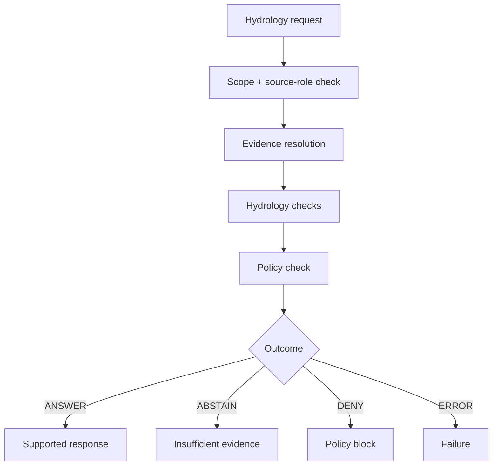

<!-- [KFM_META_BLOCK_V2]
doc_id: kfm://doc/NEEDS-VERIFICATION
title: Hydrology Runtime Proofs
type: standard
version: v1
status: draft
owners: [@bartytime4life]
created: NEEDS-VERIFICATION
updated: NEEDS-VERIFICATION
policy_label: NEEDS-VERIFICATION
related: [../README.md, ../../README.md, ../../../README.md, ../../../../docs/domains/hydrology/README.md, ./streamflow/README.md, ../../../../tools/probes/README.md, ../../../../tools/probes/hydro-watcher/README.md, ../../../../data/receipts/README.md, ../../../../data/proofs/README.md, ../../../../policy/README.md, ../../../../schemas/README.md]
tags: [kfm, tests, e2e, runtime-proof, hydrology]
notes: [doc_id, created, updated, and policy_label require steward verification before publication. Revised to align runtime-proof hydrology index with streamflow child leaf, probe-first watcher direction, and receipt/proof separation without claiming implementation status.]
[/KFM_META_BLOCK_V2] -->

<a id="top"></a>

# Hydrology Runtime Proofs

Request-time proof index for KFM hydrology outcomes that must stay evidence-bounded, source-role explicit, policy-visible, auditable, and finite-state.

<div align="left">


</div>

| Field | Value |
|---|---|
| **Status** | experimental |
| **Owners** | `@bartytime4life` *(inherits `/tests/` coverage; narrower leaf ownership NEEDS VERIFICATION)* |
| **Path** | `tests/e2e/runtime_proof/hydrology/README.md` |
| **Repo fit** | domain index under [`../README.md`](../README.md) with active child leaf [`./streamflow/README.md`](./streamflow/README.md) |
| **Runtime posture** | finite outward outcomes only: `ANSWER` · `ABSTAIN` · `DENY` · `ERROR` |
| **Network posture** | fixture-first; no live fetches |
| **Quick jumps** | [Scope](#scope) · [Evidence posture](#current-evidence-posture) · [Repo fit](#repo-fit) · [Accepted inputs](#accepted-inputs) · [Exclusions](#exclusions) · [Directory tree](#directory-tree) · [Quickstart](#quickstart) · [Usage](#usage) · [Runtime outcomes](#runtime-outcomes) · [Proof matrix](#hydrology-proof-matrix) · [Diagram](#diagram) · [Artifact boundaries](#artifact-boundaries) · [Task list](#task-list--definition-of-done) · [FAQ](#faq) |

> [!IMPORTANT]
> This directory proves **request-time hydrology behavior only**.
>
> It does **not** own:
>
> - source ingestion
> - canonical schemas
> - policy bodies
> - receipts
> - proofs
> - publication or promotion

> [!TIP]
> Keep the trust split visible:
>
> **fixture ≠ runtime response ≠ receipt ≠ proof ≠ policy ≠ publication**

---

## Scope

This directory answers one question:

> Can KFM produce a **finite, governed hydrology response** without inventing certainty?

Hydrology here includes:

- surface water (streamflow, discharge, stage)
- groundwater context when supported
- watershed/boundary joins
- flood-risk context
- seasonal baseline comparisons

### What this directory proves

| Claim | Status | Proof expectation |
|---|---:|---|
| Finite outcomes only | **CONFIRMED doctrine** | `ANSWER`, `ABSTAIN`, `DENY`, `ERROR` only |
| Evidence-bounded answers | **CONFIRMED doctrine** | `ANSWER` requires visible support + audit reference |
| Weak support fails closed | **CONFIRMED doctrine** | `ABSTAIN` for missing, stale, or weak data |
| Policy remains visible | **CONFIRMED doctrine** | `DENY` includes reason + obligations |
| Technical failure explicit | **CONFIRMED doctrine** | `ERROR` is not disguised |
| Source roles preserved | **CONFIRMED doctrine** | observed vs baseline vs contextual remain distinct |
| Baseline support strength matters | **PROPOSED** | weak or low-sample baseline yields `ABSTAIN` |

### What this directory does not prove

- live USGS / Mesonet connectivity  
- pipeline execution  
- catalog publication  
- release proof or signing  
- UI rendering  

Those belong in probe, pipeline, or proof lanes.

[Back to top](#top)

---

## Current evidence posture

| Surface | Status | Meaning |
|---|---|---|
| `tests/e2e/runtime_proof/` exists | **CONFIRMED** | Runtime proof is a real lane |
| `hydrology/` index exists | **CONFIRMED** | This file is grounded |
| `streamflow/` child leaf exists | **CONFIRMED** | First active hydrology proof slice |
| Hydrology domain docs exist | **CONFIRMED** | Source-role and baseline doctrine upstream |
| Probe + hydro-watcher docs exist | **CONFIRMED / PROPOSED linkage** | Inputs may originate from probe outputs |
| Fixture inventory completeness | **NEEDS VERIFICATION** | Do not claim coverage depth |
| CI enforcement | **UNKNOWN** | Workflow evidence not present |

[Back to top](#top)

---

## Repo fit

This file is the **domain index** for hydrology runtime proof.

### Upstream and adjacent surfaces

| Surface | Role |
|---|---|
| [`../README.md`](../README.md) | runtime-proof family contract |
| [`../../README.md`](../../README.md) | e2e test positioning |
| [`docs/domains/hydrology/README.md`](../../../../docs/domains/hydrology/README.md) | hydrology doctrine |
| [`docs/domains/hydrology/usgs-tail-alerts-schema.md`](../../../../docs/domains/hydrology/usgs-tail-alerts-schema.md) | seasonal baseline rules |
| [`tools/probes/README.md`](../../../../tools/probes/README.md) | observation helpers |
| [`tools/probes/hydro-watcher/README.md`](../../../../tools/probes/hydro-watcher/README.md) | proposed streamflow probe |
| [`data/receipts/README.md`](../../../../data/receipts/README.md) | process memory |
| [`data/proofs/README.md`](../../../../data/proofs/README.md) | release-grade proof |
| [`policy/README.md`](../../../../policy/README.md) | decision authority |
| [`schemas/README.md`](../../../../schemas/README.md) | contract authority |

### Child leaves

| Leaf | Status | Purpose |
|---|---|---|
| `streamflow/` | **CONFIRMED** | streamflow + seasonal baseline proof |
| groundwater | **PROPOSED** | well / aquifer context |
| watershed_boundaries | **PROPOSED** | HUC / boundary joins |
| flood_context | **PROPOSED** | regulatory + flood interpretation |
| water_quality | **PROPOSED** | quality signals |

[Back to top](#top)

---

## Accepted inputs

Runtime-proof inputs must be **small, deterministic, and reviewable**.

| Input | Role |
|---|---|
| request fixtures | define scope + expected outcome |
| runtime responses | object under test |
| evidence bundles | prove support or insufficiency |
| probe outputs | bounded upstream observation artifacts |
| receipts (refs only) | process-memory linkage |
| failure fixtures | prove fail-closed behavior |

### Rules

- no live network calls  
- no large datasets  
- no mutation  
- no hidden enrichment  

[Back to top](#top)

---

## Exclusions

| Do not include | Reason |
|---|---|
| live fetch code | belongs in probes/pipelines |
| schema definitions | belong in `schemas/` |
| policy rules | belong in `policy/` |
| proof artifacts | belong in `data/proofs/` |
| receipts storage | belong in `data/receipts/` |
| UI validation | belongs in UI/CI lanes |

[Back to top](#top)

---

## Directory tree

### Confirmed

```text
tests/e2e/runtime_proof/hydrology/
├── README.md
└── streamflow/
    └── README.md
```

### Proposed

```text
tests/e2e/runtime_proof/hydrology/
├── streamflow/
├── groundwater/
├── watershed_boundaries/
├── flood_context/
└── shared/
```

[Back to top](#top)

---

## Quickstart

```bash
# inspect current structure
find tests/e2e/runtime_proof/hydrology -maxdepth 5 -type f | sort

# read doctrine
sed -n '1,200p' docs/domains/hydrology/README.md

# run tests (only if verified)
pytest -q tests/e2e/runtime_proof/hydrology
```

> [!WARNING]
> Do not assume pytest is wired until verified.

[Back to top](#top)

---

## Usage

### Use this lane when:

- proving streamflow answers are correct  
- proving abstention behavior  
- proving deny paths  
- proving error paths  

### Do not use when:

- fetching data  
- computing baselines  
- publishing results  
- defining schema  

[Back to top](#top)

---

## Runtime outcomes

| Outcome | Meaning |
|---|---|
| `ANSWER` | supported, safe, bounded |
| `ABSTAIN` | insufficient or weak evidence |
| `DENY` | blocked by policy |
| `ERROR` | technical failure |

[Back to top](#top)

---

## Hydrology proof matrix

| Case | Expected outcome |
|---|---|
| valid streamflow support | `ANSWER` |
| missing baseline | `ABSTAIN` |
| weak baseline support | `ABSTAIN` |
| stale observation | `ABSTAIN` |
| unreleased data | `DENY` |
| malformed support | `ERROR` |

[Back to top](#top)

---

## Diagram



[Back to top](#top)

---

## Artifact boundaries

| Object | Role |
|---|---|
| runtime response | primary test object |
| evidence bundle | support validation |
| probe output | optional upstream input |
| receipt (ref) | process memory |
| proof object | downstream |
| policy decision | external |

[Back to top](#top)

---

## Task list / definition of done

- [ ] metadata verified  
- [ ] streamflow leaf aligned  
- [ ] all 4 outcomes covered  
- [ ] no live calls  
- [ ] fixtures deterministic  
- [ ] policy effects visible  
- [ ] evidence traceable  
- [ ] doc links valid  

[Back to top](#top)

---

## FAQ

**Is this for ingestion?**  
No.

**Can abstain pass?**  
Yes — it is often the correct outcome.

**Does this define schema?**  
No.

**Does this publish results?**  
No.

**Most important rule?**  
Finite, honest, evidence-bounded outcomes.

[Back to top](#top)
