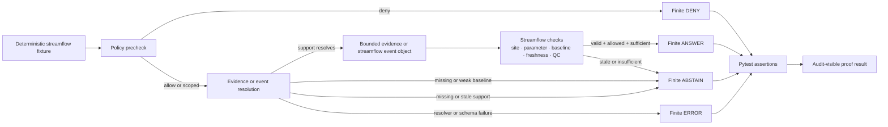

<!-- [KFM_META_BLOCK_V2]
doc_id: kfm://doc/NEEDS-VERIFICATION
title: Hydrology Streamflow Runtime Proofs
type: standard
version: v1
status: draft
owners: [@bartytime4life]
created: 2026-04-18
updated: 2026-04-18
policy_label: public-safe
related: [../README.md, ../../README.md, ../../../README.md, ../../../../README.md, ../../../../../docs/domains/hydrology/README.md, ../../../../../docs/domains/hydrology/usgs-tail-alerts-schema.md, ../../../../../tools/probes/README.md, ../../../../../tools/probes/hydro-watcher/README.md, ../../../../../schemas/README.md, ../../../../../schemas/hydrology/streamflow-event.schema.json, ../../../../../policy/README.md, ../../../../../data/receipts/README.md]
tags: [kfm, tests, e2e, runtime-proof, hydrology, streamflow, usgs, percentiles]
notes: [README-like directory doc for a proposed runtime-proof leaf. Owners, exact related paths, and mounted fixture/test inventory still need branch verification. Revised to align with hydrology seasonal-tail doctrine, finite runtime outcomes, explicit receipt-versus-proof separation, and the probe-first streamflow watcher direction.]
[/KFM_META_BLOCK_V2] -->

<a id="top"></a>

# Hydrology Streamflow Runtime Proofs

Request-time proof lane for KFM streamflow answers that must remain evidence-bounded, policy-visible, auditable, and finite-state before any outward response is treated as trustworthy.

<div align="left">


</div>

| Field | Value |
|---|---|
| **Status** | draft |
| **Owners** | `@bartytime4life` *(owner coverage aligned to current visible `/tools/` and child-lane work; narrower proof-leaf ownership still **NEEDS VERIFICATION**)* |
| **Path** | `tests/e2e/runtime_proof/hydrology/streamflow/README.md` |
| **Repo fit** | child proof leaf under the runtime-proof family; consumes hydrology doctrine and bounded probe outputs but does not own schema, policy, receipt, or publication authority |
| **Runtime posture** | finite outward outcomes only: `ANSWER` · `ABSTAIN` · `DENY` · `ERROR` |
| **Network posture** | fixture-first by default; live upstream fetches do not belong in this proof directory |
| **Quick jumps** | [Scope](#scope) · [Repo fit](#repo-fit) · [Accepted inputs](#accepted-inputs) · [Exclusions](#exclusions) · [Expected directory tree](#expected-directory-tree) · [Proof flow](#proof-flow) · [Runtime contract](#runtime-contract) · [Outcome matrix](#outcome-matrix) · [Streamflow checks](#streamflow-checks) · [Quickstart](#quickstart) · [Review checklist](#review-checklist) · [Definition of done](#definition-of-done) · [Verification gaps](#verification-gaps) |

> [!IMPORTANT]
> This README is a **PROPOSED runtime-proof leaf contract** for the target path. The checked-in doctrine supports hydrology-first runtime proof and finite outcome behavior, but the mounted repository tree, exact fixture names, and landed test files still require direct branch verification.

> [!TIP]
> This leaf is intentionally downstream of `tools/probes/`. A probe may emit a bounded observational result, receipt, or event-like object, but the proof burden for outward finite runtime behavior belongs here, not in `tools/probes/`.

> [!NOTE]
> Keep the trust split visible here too:
>
> **fixture ≠ receipt ≠ proof ≠ policy ≠ publication**
>
> - fixtures simulate governed situations
> - receipts remain process memory
> - this directory proves runtime behavior
> - policy still decides
> - publication still happens elsewhere

---

## Scope

This directory is for **thin-slice runtime proof tests** that exercise one public-safe KFM hydrology lane: **streamflow**.

A passing proof should show that a streamflow response can move through the governed runtime boundary without hiding uncertainty, bypassing evidence, or collapsing policy into prose.

### What this directory proves

| Claim | Status | Proof expectation |
|---|---:|---|
| Streamflow answers use finite runtime outcomes. | **CONFIRMED doctrine / PROPOSED tests** | Response fixture returns only `ANSWER`, `ABSTAIN`, `DENY`, or `ERROR`. |
| `ANSWER` requires visible supporting evidence. | **CONFIRMED doctrine / PROPOSED tests** | Evidence reference resolves or equivalent bounded event support is present; audit reference exists. |
| `ABSTAIN` is valid when evidence or approved baseline support is stale, missing, or insufficient. | **CONFIRMED doctrine / PROPOSED tests** | No invented support; reason code explains evidence or baseline failure. |
| `DENY` is valid when release, rights, sensitivity, or policy blocks the request. | **CONFIRMED doctrine / PROPOSED tests** | Denial carries reason code and obligation visibility. |
| `ERROR` is explicit when the resolver, schema, or fixture path fails. | **CONFIRMED doctrine / PROPOSED tests** | Runtime failure is not disguised as denial or abstention. |
| Streamflow-specific facts remain inspectable. | **PROPOSED** | Fixtures include site, parameter, comparison basis, freshness, QC, and provenance-facing cues. |
| Seasonal-tail logic remains visible when used. | **CONFIRMED doctrine / PROPOSED tests** | Outward object includes approved day-of-year percentile basis or explicitly abstains when unresolved. |
| Authoritative baseline weakness fails closed. | **PROPOSED** | Low-support or missing USGS baseline fixtures yield `ABSTAIN`, not fabricated confidence. |

### What this directory does **not** prove

This directory does not prove live USGS connectivity, production scheduler behavior, signed artifact verification, catalog publication, or deployed UI rendering. Those belong in connector, probe, promotion, catalog, proof-pack, or UI test lanes.

[:arrow_up: Back to top](#top)

---

## Repo fit

### Path

```text
tests/e2e/runtime_proof/hydrology/streamflow/README.md
```

### Position in the KFM truth path

```text
source edge
  -> RAW
  -> WORK / QUARANTINE
  -> PROCESSED
  -> CATALOG / TRIPLET
  -> PUBLISHED
  -> governed runtime response
  -> runtime proof assertion
```

This directory sits at the **runtime proof assertion** end of the path. It should consume small, deterministic fixtures that represent already-governed evidence objects or bounded observational event shapes. It should not fetch, transform, publish, or silently promote upstream data.

### Upstream and downstream links

| Direction | Path | Status | Role |
|---|---|---:|---|
| Parent proof family | [`../README.md`](../README.md) | **NEEDS VERIFICATION** | Hydrology runtime-proof overview or sibling leaf context |
| Runtime-proof root | [`../../README.md`](../../README.md) | **NEEDS VERIFICATION** | Shared runtime-proof conventions |
| E2E test root | [`../../../README.md`](../../../README.md) | **NEEDS VERIFICATION** | E2E execution conventions |
| Test root | [`../../../../README.md`](../../../../README.md) | **NEEDS VERIFICATION** | Repository-wide test guidance |
| Hydrology doctrine | [`../../../../../docs/domains/hydrology/README.md`](../../../../../docs/domains/hydrology/README.md) | **CONFIRMED adjacent authority** | Domain boundary and hydrology-first posture |
| Seasonal tail doctrine | [`../../../../../docs/domains/hydrology/usgs-tail-alerts-schema.md`](../../../../../docs/domains/hydrology/usgs-tail-alerts-schema.md) | **CONFIRMED adjacent authority** | Approved day-of-year percentile logic and abstention posture |
| Probe lane parent | [`../../../../../tools/probes/README.md`](../../../../../tools/probes/README.md) | **CONFIRMED adjacent authority** | Defines bounded probe behavior and handoff expectations |
| Proposed streamflow probe lane | [`../../../../../tools/probes/hydro-watcher/README.md`](../../../../../tools/probes/hydro-watcher/README.md) | **PROPOSED / NEEDS VERIFICATION** | Candidate producer of bounded streamflow event objects |
| Schema home | [`../../../../../schemas/README.md`](../../../../../schemas/README.md) | **CONFIRMED adjacent authority** | Schema-home authority remains outside tests |
| Proposed streamflow event schema | [`../../../../../schemas/hydrology/streamflow-event.schema.json`](../../../../../schemas/hydrology/streamflow-event.schema.json) | **PROPOSED / NEEDS VERIFICATION** | Candidate machine contract for thin-slice streamflow events |
| Policy lane | [`../../../../../policy/README.md`](../../../../../policy/README.md) | **CONFIRMED adjacent authority** | Deny-by-default and obligation logic belong there |
| Receipts lane | [`../../../../../data/receipts/README.md`](../../../../../data/receipts/README.md) | **CONFIRMED adjacent authority** | Process memory remains separate from tests and proofs |

> [!TIP]
> Keep this leaf narrow: it should prove outward runtime behavior, not become a second schema home, a policy bundle, or a hidden probe lane.

[:arrow_up: Back to top](#top)

---

## Accepted inputs

Only small, deterministic, reviewable inputs belong here.

| Input | Required shape | Why it belongs |
|---|---|---|
| Runtime response fixtures | finite result/outcome, reason codes, obligation visibility, audit reference, correction state | Proves governed runtime behavior without invoking live services |
| Streamflow event fixtures | site, parameter, day-of-year basis or direct threshold, persistence, join-resolution cue, content hash | Proves thin-slice streamflow behavior in a reviewable object |
| Evidence-oriented fixtures | evidence refs, release state, freshness, QC state, scope echo | Proves cite-or-abstain or event-support behavior |
| Run receipt fixtures | `run_id`, `spec_hash`, inputs, produced artifacts, validation notes | Preserves replayable process memory references without making receipts sovereign here |
| Stats receipt fixtures | baseline request params, `sample_count`, baseline kind, fetch timing | Makes authoritative-baseline support visible without live API calls |
| Policy decision fixtures | allow, deny, abstain, and error cases with obligation visibility | Keeps policy effects visible and finite |
| Resolver failure fixtures | missing event, malformed event, stale evidence, schema mismatch | Ensures failure is explicit rather than silently answered |

### Streamflow-specific fields to preserve

| Field | Example | Status |
|---|---:|---|
| `site_no` or `site_id` | `06887500` | **PROPOSED fixture field; exact contract NEEDS VERIFICATION** |
| `parameter_code` | `00060` for discharge | **PROPOSED fixture field** |
| `observed_property` | `discharge` | **PROPOSED fixture field** |
| `unit` | `ft3 s-1` or equivalent | **NEEDS VERIFICATION against schema** |
| `doy` | `93` | **PROPOSED fixture field** |
| `baseline_kind` | `day_of_year_percentile` or `day_of_year_normal` | **PROPOSED fixture field aligned to doctrine** |
| `baseline_sample_count` | `27` | **PROPOSED fixture field** |
| `freshness_state` | `fresh`, `stale`, `unknown` | **PROPOSED fixture field** |
| `qc_state` | `pass`, `warn`, `fail`, `unknown` | **PROPOSED fixture field** |
| `release_state` | `released`, `candidate`, `unreleased` | **PROPOSED fixture field** |
| `join_resolution_reason` | `permanent_id`, `fallback_comid` | **PROPOSED fixture field** |

### Thin-slice seasonal-tail expectation

For the current streamflow thin slice, the strongest doctrinal fit is:

- approved USGS seasonal baseline
- visible persistence gate
- visible comparison basis
- visible abstention when the approved baseline is missing, weakly supported, stale, or unresolved

[:arrow_up: Back to top](#top)

---

## Exclusions

| Do not place here | Put it here instead | Reason |
|---|---|---|
| Live USGS/NWIS fetch code | `tools/probes/hydro-watcher/` or another producer lane **NEEDS VERIFICATION** | Runtime proof tests should be deterministic and offline |
| Large raw API payloads | `data/raw/` or minimized fixture samples **NEEDS VERIFICATION** | E2E proof fixtures should stay reviewable in Git |
| Production receipts | `data/receipts/` | Receipts are process memory, not test source code |
| Signed release proofs | `data/proofs/` **NEEDS VERIFICATION** | Proofs belong with release-grade artifacts, not this test leaf |
| Catalog publishing scripts | `tools/`, `scripts/`, or pipeline lanes | This directory verifies runtime behavior; it does not publish |
| UI screenshots or drawer rendering tests | UI/evidence-drawer test lane **NEEDS VERIFICATION** | This directory validates response payloads, not visual rendering |
| Emergency alert logic | Separate operational warning system | KFM streamflow context must not become an emergency alert surface by accident |
| Regulatory flood determinations | Domain-specific flood/floodplain lane | Streamflow proof fixtures are not legal flood determinations |
| Schema-home contracts | `schemas/` | Tests consume shape authority; they do not own it |
| Policy rules | `policy/` | This leaf proves policy effects, not policy authorship |

[:arrow_up: Back to top](#top)

---

## Expected directory tree

**PROPOSED.** Use this as the target layout unless the mounted repository already has a stronger local convention.

```text
tests/e2e/runtime_proof/hydrology/streamflow/
├── README.md
├── fixtures/
│   ├── cases/
│   │   ├── answer_seasonal_low_tail_released.json
│   │   ├── abstain_approved_baseline_missing.json
│   │   ├── abstain_insufficient_baseline_support.json
│   │   ├── abstain_stale_evidence.json
│   │   ├── deny_unreleased_streamflow_artifact.json
│   │   └── error_streamflow_resolver_failure.json
│   ├── evidence_bundle/
│   │   ├── streamflow_current.bundle.json
│   │   └── streamflow_stale.bundle.json
│   ├── events/
│   │   └── seasonal_low_tail_answer_event.json
│   ├── receipts/
│   │   ├── streamflow_run_receipt.json
│   │   └── streamflow_stats_receipt.json
│   └── support/
│       └── stats_payload.json
├── test_streamflow_runtime_proof.py
└── test_streamflow_stats_baseline.py
```

### Alternative simpler landing

```text
tests/e2e/runtime_proof/hydrology/streamflow/
├── README.md
├── fixtures/
│   ├── seasonal_low_tail_answer/
│   │   └── event.json
│   ├── abstain_missing_baseline.json
│   ├── abstain_insufficient_baseline_support.json
│   ├── abstain_stale_evidence.json
│   ├── deny_unreleased_streamflow_artifact.json
│   └── error_streamflow_resolver_failure.json
└── test_streamflow_runtime_proof.py
```

> [!TIP]
> Keep fixtures intentionally small. A maintainer should be able to review the complete proof case in a PR without opening a large binary or following a live network dependency.

[:arrow_up: Back to top](#top)

---

## Proof flow



The test lane should prove both **positive** and **negative** behavior. A runtime system that can only answer is not yet KFM-governed.

[:arrow_up: Back to top](#top)

---

## Runtime contract

### Boundary posture

**CONFIRMED doctrine:** generated or synthesized runtime output is subordinate to evidence, policy, review state, and release state.

**PROPOSED for this directory:** each test case should assert that the runtime response includes enough structure to reconstruct why the answer was allowed, abstained, denied, or errored.

### Minimum assertion set

| Assertion | `ANSWER` | `ABSTAIN` | `DENY` | `ERROR` |
|---|---:|---:|---:|---:|
| finite outward outcome present | Required | Required | Required | Required |
| reason code or equivalent reason field | Required | Required | Required | Required |
| obligation visibility | Required | Required | Required | Required |
| `audit_ref` or equivalent audit-visible reference | Required | Required | Required | Required |
| correction state visible | Required | Required | Required | Required |
| streamflow scope echoed | Required | Required when available | Required when relevant | Required when available |
| evidence or event support visible | Required | Optional depending on failure mode | Optional | Optional |
| baseline or threshold basis visible when used | Required | Required when abstaining because basis is missing, weak, or stale | Optional | Optional |
| citations or support refs | Required when the response is evidence-backed | Empty or explicit none | Empty or explicit none | Empty or explicit none |

> [!NOTE]
> Field names remain **NEEDS VERIFICATION** against the mounted schema and runtime leaf conventions. This README preserves finite-outcome doctrine without silently forcing one exact envelope vocabulary where branch evidence has not yet been checked.

### Illustrative response fixture

This is an example shape, not a confirmed schema.

```json
{
  "response_type": "RuntimeResponseEnvelope",
  "result": "ANSWER",
  "reason_codes": ["STREAMFLOW_PUBLIC_SAFE"],
  "obligation_codes": ["REQUIRE_CITATION", "RECORD_AUDIT"],
  "audit_ref": "audit:hydrology_streamflow_public_answer_allowed",
  "scope": {
    "domain": "hydrology",
    "subdomain": "streamflow",
    "region": "Kansas",
    "site_no": "06887500",
    "parameter_code": "00060"
  },
  "support": {
    "event_ref": "kfm://event/hydrology/streamflow/NEEDS-VERIFICATION",
    "release_state": "released",
    "freshness_state": "fresh",
    "qc_state": "pass",
    "baseline_kind": "day_of_year_percentile",
    "baseline_sample_count": 27
  },
  "citations": ["citation:streamflow-fixture"],
  "correction_state": null
}
```

[:arrow_up: Back to top](#top)

---

## Outcome matrix

| Case | Fixture intent | Required result | Required proof behavior |
|---|---|---:|---|
| Seasonal low-tail support present | Approved baseline exists, persistence met, support is sufficient | `ANSWER` | Streamflow scope is echoed; baseline kind is visible; audit ref exists |
| Released but stale support | Support exists but freshness gate fails | `ABSTAIN` | No invented support; reason names stale evidence or stale support |
| Missing approved baseline | Seasonal-tail comparison basis cannot resolve | `ABSTAIN` | No confident answer is emitted; reason names missing approved baseline |
| Insufficient approved baseline support | Baseline exists but `sample_count` or equivalent support is too weak | `ABSTAIN` | Reason names insufficient baseline support; no answer is smuggled through |
| Unreleased candidate data | Fixture points to candidate or unpublished streamflow artifact | `DENY` | Policy state blocks release; obligation visibility is present |
| Restricted/local-sensitive context | Fixture marks policy restriction or generalized geometry requirement | `DENY` or `ABSTAIN` | Obligations are explicit; no precise unsupported location leakage |
| Malformed event or malformed support | Support artifact cannot validate | `ERROR` | Runtime failure is explicit; not disguised as denial |
| Resolver exception | Event/evidence resolver fails | `ERROR` | Reason identifies runtime resolution failure |

### Suggested reason code vocabulary

**PROPOSED.** Confirm against the policy and schema registry before locking tests.

| Reason code | Use when |
|---|---|
| `STREAMFLOW_PUBLIC_SAFE` | Released streamflow support justifies a public-safe answer |
| `INSUFFICIENT_EVIDENCE` | Support is missing or not enough to answer |
| `STALE_STREAMFLOW_EVIDENCE` | Streamflow support exists but freshness gate fails |
| `APPROVED_BASELINE_MISSING` | Seasonal-tail comparison cannot resolve the approved baseline |
| `INSUFFICIENT_BASELINE_SUPPORT` | Baseline exists but too few approved observations support it |
| `STREAMFLOW_POLICY_DENIED` | Policy blocks the requested release or scope |
| `UNRELEASED_STREAMFLOW_ARTIFACT` | The fixture references data not in released scope |
| `STREAMFLOW_QC_FAILED` | QC fixture fails a hard check |
| `RUNTIME_RESOLUTION_FAILED` | Resolver/schema/runtime error prevents a governed decision |

[:arrow_up: Back to top](#top)

---

## Streamflow checks

The streamflow proof cases should preserve hydrology specificity without turning this directory into the probe or the pipeline.

| Check | Assertion target | Notes |
|---|---|---|
| Non-negative discharge | `parameter_code == "00060"` fixtures | Negative values should not produce a clean `ANSWER` unless explicitly marked invalid |
| Monotonic timestamps | time-window or support fixture | Ordered timestamps should remain reconstructable where present |
| Freshness | runtime support state | Current-value style support and daily-statistics support may have different allowed staleness |
| Baseline visibility | seasonal-tail cases | Approved percentile basis should be visible enough to review or explicitly absent enough to justify `ABSTAIN` |
| Baseline support visibility | baseline-backed cases | `sample_count` or equivalent support should remain inspectable when support strength matters |
| Persistence visibility | low/high tail cases | Repeated breach logic should be visible when it matters |
| QC state | support fixture | A warning may still allow answer if policy permits; a hard failure should not |
| Unit visibility | runtime scope/support | Units must remain visible enough for downstream review and UI evidence rendering |
| Join-resolution visibility | event-support fixture | `permanent_id` vs `fallback_comid` should remain inspectable when hydro joins matter |

[:arrow_up: Back to top](#top)

---

## Quickstart

**NEEDS VERIFICATION** until test files and CI commands are confirmed in the mounted repository.

```bash
pytest -q tests/e2e/runtime_proof/hydrology/streamflow
```

Run one finite outcome family:

```bash
pytest -q tests/e2e/runtime_proof/hydrology/streamflow -k "answer"
pytest -q tests/e2e/runtime_proof/hydrology/streamflow -k "abstain"
pytest -q tests/e2e/runtime_proof/hydrology/streamflow -k "deny"
pytest -q tests/e2e/runtime_proof/hydrology/streamflow -k "error"
pytest -q tests/e2e/runtime_proof/hydrology/streamflow -k "baseline"
```

Expected local behavior:

```text
no network calls
no production writes
no mutation outside temporary test output
no live credential requirement
no promotion or publish side effect
```

[:arrow_up: Back to top](#top)

---

## Review checklist

Use this checklist when adding or changing a streamflow runtime proof.

- [ ] The fixture is deterministic and small enough to review in Git.
- [ ] The test does not call live USGS, catalog, policy, or model endpoints.
- [ ] The test covers one finite runtime outcome: `ANSWER`, `ABSTAIN`, `DENY`, or `ERROR`.
- [ ] `ANSWER` cases include visible support and audit visibility.
- [ ] `ABSTAIN`, `DENY`, and `ERROR` cases do not smuggle unsupported answer text through the response.
- [ ] Streamflow scope is explicit enough to review: site, parameter, baseline or threshold basis, freshness, and QC.
- [ ] Weak or missing approved baseline support is asserted explicitly where relevant.
- [ ] Policy obligations are asserted, not just reason codes.
- [ ] `audit_ref` or equivalent audit-visible reference is present and stable enough for reconstruction.
- [ ] Receipts remain separate from release-grade proofs and from this test leaf.
- [ ] Relative links in this README still resolve after the final repo paths are confirmed.

[:arrow_up: Back to top](#top)

---

## Definition of done

This directory is ready for active CI when all items below are true.

| Gate | Done when |
|---|---|
| Fixture gate | All four finite outcomes have representative fixtures |
| Schema gate | Runtime envelope and streamflow event/support fixtures validate against mounted schemas where those schemas exist |
| Policy gate | Deny/abstain cases are driven by policy fixtures or policy-visible decisions, not hard-coded prose only |
| Evidence gate | Every `ANSWER` support path resolves to a local fixture |
| Hydrology gate | Streamflow-specific checks cover discharge, comparison basis, freshness, baseline support, and QC |
| Runtime gate | Tests prove explicit `ERROR` behavior for resolver/schema failure |
| CI gate | The test command runs offline and fails closed on malformed fixtures |
| Documentation gate | Owners, policy label, related paths, and adjacent README links are verified |

[:arrow_up: Back to top](#top)

---

## Verification gaps

| Gap | Label | Why it remains open |
|---|---:|---|
| `doc_id` | **NEEDS VERIFICATION** | No mounted document registry was available |
| Owners | **PARTIALLY VERIFIED / NEEDS VERIFICATION** | Current visible ownership work points at `@bartytime4life`, but narrower proof-leaf ownership was not directly checked from branch files here |
| Related links | **NEEDS VERIFICATION** | Adjacent README files and schema paths still need direct branch confirmation |
| Test file names | **PROPOSED** | Names are aligned to current KFM runtime-proof patterns but should be synced to local convention |
| Fixture schema | **PROPOSED** | Field names must be checked against mounted schemas before locking tests |
| CI workflow name | **UNKNOWN** | Workflow inventory was not available |
| Exact runtime envelope vocabulary | **NEEDS VERIFICATION** | Current doctrine confirms finite outcomes, but exact field names need schema inspection |
| Hydrology stats fixture shape | **PROPOSED** | Baseline-support fixtures were added as a design-aligned expansion but still need branch-level schema confirmation |
| Live streamflow source behavior | **OUT OF SCOPE** | Runtime-proof tests should not depend on live endpoint behavior |

[:arrow_up: Back to top](#top)

---

## Appendix

<details>
<summary>Suggested fixture naming pattern</summary>

Use names that reveal the finite outcome and the streamflow condition being tested.

```text
answer_seasonal_low_tail_released.json
answer_seasonal_high_tail_released.json
abstain_streamflow_evidence_stale.json
abstain_approved_baseline_missing.json
abstain_insufficient_baseline_support.json
deny_streamflow_unreleased_artifact.json
deny_streamflow_policy_restricted_scope.json
error_streamflow_resolver_failure.json
error_streamflow_malformed_support.json
```

</details>

<details>
<summary>Suggested minimal fixture bundle</summary>

```text
fixtures/
├── cases/
│   ├── answer_seasonal_low_tail_released.json
│   ├── abstain_approved_baseline_missing.json
│   ├── abstain_insufficient_baseline_support.json
│   ├── deny_streamflow_unreleased_artifact.json
│   └── error_streamflow_resolver_failure.json
├── receipts/
│   ├── streamflow_run_receipt.json
│   └── streamflow_stats_receipt.json
└── support/
    └── stats_payload.json
```

</details>

<details>
<summary>Maintainer notes for future expansion</summary>

Keep this directory narrow. Good expansions include:

- one additional public-safe station fixture,
- one additional stale-support fixture,
- one additional policy-denied fixture,
- one additional resolver-error fixture,
- one additional insufficient-baseline-support fixture,
- one additional high-tail case if the low-tail path lands first.

Avoid expansions that introduce:

- live network calls,
- broad hydrology ETL behavior,
- UI rendering checks,
- model-generated summaries without local fixtures,
- release promotion behavior better covered by promotion-gate tests.

</details>

[:arrow_up: Back to top](#top)
