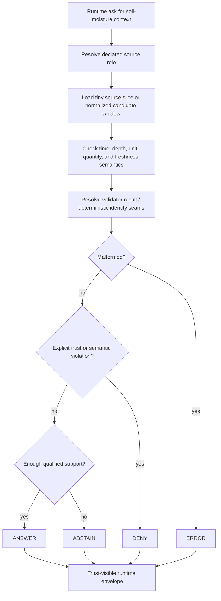

<!-- [KFM_META_BLOCK_V2]
doc_id: kfm://doc/NEEDS_VERIFICATION__soil_moisture_runtime_proof_readme
title: Runtime Proof — Soil Moisture
type: standard
version: v1
status: draft
owners: @bartytime4life
created: NEEDS_VERIFICATION__YYYY-MM-DD
updated: 2026-04-15
policy_label: NEEDS_VERIFICATION__public_or_internal
related: [
  ../README.md,
  ../../README.md,
  ../../release_assembly/README.md,
  ../../correction/README.md,
  ../../../fixtures/soil_moisture/README.md,
  ../../../../contracts/README.md,
  ../../../../contracts/source/kansas_mesonet_source_descriptor.md,
  ../../../../contracts/soil_moisture/reading.schema.json,
  ../../../../policy/README.md,
  ../../../../schemas/README.md,
  ../../../../schemas/soil_moisture/README.md,
  ../../../../schemas/contracts/README.md,
  ../../../../schemas/contracts/v1/README.md,
  ../../../../tools/validators/soil_moisture/README.md,
  ../../../../tools/validators/promotion_gate/README.md,
  ../../../../.github/CODEOWNERS,
  ../../../../.github/workflows/README.md
]
tags: [kfm, tests, e2e, runtime-proof, soil-moisture, hydrology, mesonet, spec_hash, run_receipt]
notes: [
  Hydrology-first and Kansas Mesonet source-role constraints are strongly supported in the supplied corpus.
  This revision preserves the stronger existing runtime-proof doctrine while aligning the leaf with the newer Mesonet-first watcher, validator, fixture, source-descriptor, schema, and promotion-gate surfaces.
  Exact mounted leaf inventory, runner wiring, created date, policy label, and leaf-level ownership still need direct branch verification.
]
[/KFM_META_BLOCK_V2] -->

<a id="top"></a>

# Runtime Proof — Soil Moisture

Request-time proof lane for qualified soil-moisture outcomes, source-role visibility, freshness handling, deterministic identity cues, and fail-closed hydrology behavior in KFM.

> [!NOTE]
> **Status:** `experimental`  
> **Owners:** `@bartytime4life` *(confirmed at `/tests/` scope; leaf-level assignment still needs branch verification)*  
> **Path:** `tests/e2e/runtime_proof/soil_moisture/README.md`  
>         
> **Quick jump:** [Scope](#scope) · [Current evidence posture](#current-evidence-posture) · [Repo fit](#repo-fit) · [Accepted inputs](#accepted-inputs) · [Exclusions](#exclusions) · [Directory tree](#directory-tree) · [Quickstart](#quickstart) · [Usage](#usage) · [Runtime outcomes](#runtime-outcomes) · [Proof matrix](#proof-matrix) · [Diagram](#diagram) · [Operating tables](#operating-tables) · [Task list](#task-list--definition-of-done) · [FAQ](#faq) · [Appendix](#appendix)

> [!IMPORTANT]
> This leaf should prove **runtime behavior**, not quietly become the home of source custody, policy authority, release proof, or workflow mythology.

> [!CAUTION]
> **Kansas Mesonet is valuable, but not a free-for-all ingestion surface.**  
> Keep source role, citation posture, automation limits, preliminary-data semantics, and deterministic identity seams visible instead of flattening them behind a generic “sensor data” story.

---

## Scope

This directory is for **whole-path runtime proof** of soil-moisture behavior in the hydrology-first KFM slice.

It should prove whether a runtime-facing request can or cannot produce a qualified outward result when soil-moisture support is:

- present and well-formed
- semantically qualified
- fresh enough for the requested use
- source-explicit
- public-safe or visibly non-public-safe
- receipt-aware without collapsing runtime response into machine memory
- denied, abstained, or errored in a reviewable way when support is weak

This leaf should **not** decide final publication policy, sign release artifacts, or imply a mounted scheduler.

### What this leaf is proving

- request-time outcome behavior
- fail-closed handling of weak or malformed support
- visible distinction between observed and derived soil-moisture signals
- source-role clarity for **Kansas Mesonet** versus neighboring hydrology / context surfaces
- explicit separation of **runtime response**, **receipt**, **proof**, and **catalog** functions
- visibility of `SourceDescriptor`, `spec_hash`, validator result, and `run_receipt` seams where the outward trust story depends on them

### What this leaf is not proving

- branch-protected release automation
- cryptographic publication success
- final schema-home authority
- broad data-custody policy
- live connector depth on the checked-out branch

[Back to top](#top)

---

## Current evidence posture

| Surface or claim | Status | Why it matters here |
| --- | --- | --- |
| `tests/e2e/` is a real visible family with `correction/`, `release_assembly/`, and `runtime_proof/` | **CONFIRMED** | This leaf should read like a child of an already differentiated e2e family, not like a generic test note |
| `runtime_proof/` is the request-time outcome burden inside `tests/e2e/` | **CONFIRMED** | Soil-moisture whole-path cases belong here when the main question is outward runtime behavior |
| `/tests/` ownership currently resolves to `@bartytime4life` | **CONFIRMED** | Grounds the visible owners line at the family scope |
| Hydrology remains a strongest first proof lane in KFM | **CONFIRMED** | Soil-moisture runtime proof should align with hydrology-first sequencing rather than jumping ahead to broader domain expansion |
| **Kansas Mesonet** is a direct observation / measurement source with explicit usage and automation constraints | **CONFIRMED** | The leaf must preserve source-role and automation-limit consequences instead of flattening Mesonet into generic hydrology truth |
| `SourceDescriptor`, canonical rows, `spec_hash`, validator result, and `run_receipt` are now central proof-object vocabulary | **CONFIRMED doctrine / INFERRED local pressure** | Runtime-proof cases should point at these seams even when exact mounted schemas remain unverified |
| This exact leaf already exists on the active branch with executable fixtures | **NEEDS VERIFICATION** | Do not claim mounted case inventory or runner wiring without direct branch evidence |
| Exact runtime request / response schema for soil-moisture proof | **UNKNOWN / NEEDS VERIFICATION** | This README can define the burden cleanly without pretending the machine contract is already landed |
| Required checks, workflow YAML, protected-branch gates, and screenshot baselines | **NEEDS VERIFICATION** | The doc must not imply CI maturity the session did not surface |

> [!NOTE]
> In KFM, a good README can clarify burden and placement. It does **not** by itself prove automation, signatures, or merge-gate enforcement.

[Back to top](#top)

---

## Repo fit

**Path:** `tests/e2e/runtime_proof/soil_moisture/README.md`  
**Role:** whole-path proof leaf for request-time soil-moisture outcomes inside the broader `runtime_proof` family.

| Direction | Surface | Why it matters |
| --- | --- | --- |
| Parent leaf family | [`../README.md`](../README.md) | Keeps this README subordinate to the request-time runtime-proof family instead of inventing a new taxonomy |
| Parent e2e family | [`../../README.md`](../../README.md) | Preserves the distinction between runtime proof, release assembly, and correction lineage |
| Sibling whole-path leaf | [`../../release_assembly/README.md`](../../release_assembly/README.md) | Release-bearing proof stays there when the burden becomes publication or promotion completeness |
| Sibling whole-path leaf | [`../../correction/README.md`](../../correction/README.md) | Correction, supersession, and stale-visible state belong there when lineage is the main question |
| Shared fixture lane | [`../../../fixtures/soil_moisture/README.md`](../../../fixtures/soil_moisture/README.md) | Tiny reusable source and canonical examples should come from there when mounted |
| Root contract authority | [`../../../../contracts/README.md`](../../../../contracts/README.md) | Runtime-proof cases should consume authoritative contracts rather than improvising them |
| Source admission | [`../../../../contracts/source/kansas_mesonet_source_descriptor.md`](../../../../contracts/source/kansas_mesonet_source_descriptor.md) | Source role, cadence, rights, and automation posture should remain explicit at runtime |
| Canonical row contract | [`../../../../contracts/soil_moisture/reading.schema.json`](../../../../contracts/soil_moisture/reading.schema.json) | Supports deterministic candidate and fixture pressure |
| Root policy authority | [`../../../../policy/README.md`](../../../../policy/README.md) | Deny-by-default and review obligations originate there, not here |
| Root schema authority | [`../../../../schemas/README.md`](../../../../schemas/README.md) | Shape authority should remain visible and singular even if runtime fixtures pressure it |
| Soil-moisture schema lane | [`../../../../schemas/soil_moisture/README.md`](../../../../schemas/soil_moisture/README.md) | Keeps observation / health / anomaly / validator-result shapes explicit |
| Adjacent schema-side contract lane | [`../../../../schemas/contracts/README.md`](../../../../schemas/contracts/README.md) | Current repo-facing documentation already exposes schema-side contract scaffolds that this leaf should acknowledge honestly |
| First-wave schema families | [`../../../../schemas/contracts/v1/README.md`](../../../../schemas/contracts/v1/README.md) | Useful when soil-moisture proof starts pointing at source, runtime, or evidence object families |
| Validator lane | [`../../../../tools/validators/soil_moisture/README.md`](../../../../tools/validators/soil_moisture/README.md) | Runtime claims should remain visibly downstream of subject-level validation |
| Promotion lane | [`../../../../tools/validators/promotion_gate/README.md`](../../../../tools/validators/promotion_gate/README.md) | Keeps runtime proof distinct from promotion readiness and release proof |
| Ownership boundary | [`../../../../.github/CODEOWNERS`](../../../../.github/CODEOWNERS) | Final ownership should be rechecked here before merge if the leaf becomes mounted |
| Workflow boundary | [`../../../../.github/workflows/README.md`](../../../../.github/workflows/README.md) | Workflow references remain proof burden, not evidence of checked-in merge gates |

> [!TIP]
> Keep the split visible: **fixtures support behavior**, **runtime proof proves outward results**, **contracts name machine authority**, **policy decides governance**, **release assembly proves publication**.

[Back to top](#top)

---

## Accepted inputs

This lane should accept **small, explicit, reviewable** materials that help prove runtime behavior without turning the directory into a source mirror or release lane.

### Typical accepted inputs

| Input class | Examples | Why it belongs here | Status |
| --- | --- | --- | --- |
| Request / response fixture pairs | `request.json` + `expected.response.json` by case | Lets the leaf prove finite outcomes clearly | **PROPOSED local file form** |
| Tiny normalized candidate windows | one station, one interval, one short observed window | Keeps semantics reviewable in pull requests | **INFERRED / PROPOSED** |
| Freshness or degraded-state cases | stale context, missing latest sample, explicit degraded-mode expectation | Supports fail-closed handling of weak support | **PROPOSED, strongly source-grounded** |
| Quantity / depth semantic cases | explicit `VWC` vs percent saturation, depth-required versus depth-missing cases | Prevents soil-moisture flattening into one unqualified value class | **CONFIRMED burden / PROPOSED local expression** |
| Minimal handoff fragments | tiny `run_receipt`, validator-result, or outward envelope examples | Useful when runtime behavior must point at downstream machine memory without pretending to be release proof | **INFERRED / PROPOSED** |
| Source-role comparison context | compact references to **USGS Water Data**, **WBD HUC12**, or **FEMA NFHL** roles when needed | Keeps Mesonet from silently becoming the whole hydrology lane | **INFERRED / PROPOSED** |
| Replay / no-op visibility cases | support unchanged `spec_hash` or unchanged candidate identity | Helps runtime stay honest about “no meaningful change” versus current support state | **PROPOSED** |

### Operating rules for accepted inputs

1. Keep source identity explicit.
2. Keep time windows explicit.
3. Keep depth basis explicit.
4. Keep quantity kind explicit.
5. Keep fixtures small enough to review in Git.
6. Label derived examples as derived.
7. Keep **runtime response ≠ receipt ≠ proof ≠ catalog** visible even in examples.
8. Keep `spec_hash`, validator result, and `run_receipt_ref` explicit when outward trust depends on them.

> [!NOTE]
> If a shared soil-moisture fixture lane becomes mounted later, prefer consuming its tiny reusable slices instead of duplicating larger source-shaped files inside this e2e leaf.

[Back to top](#top)

---

## Exclusions

| Does **not** belong here | Put it here instead | Why |
| --- | --- | --- |
| Canonical source-admission law | root contract / schema surfaces | This leaf should prove runtime behavior, not become the source-admission authority |
| Policy bundle source files or reviewer-role registries | root policy surfaces | Policy remains the source of truth for allow / deny / review behavior |
| Release manifests, attestation bundles, signed proof packs, or published artifacts as primary records | [`../../release_assembly/README.md`](../../release_assembly/README.md) and release / proof lanes | Runtime proof is not the same as release proof |
| Large raw **Kansas Mesonet** pulls or scrape caches | governed data zones or local ignored paths | This leaf should not become a provider mirror |
| Live watcher code, scheduler wiring, connector helpers, or signing logic | pipeline / tool / workflow lanes | README prose is not implementation proof |
| Secrets, API credentials, or consent-sensitive automation helpers | secret manager / host configuration | Sensitive operational material must not land in test lanes |
| Contract-vs-schema authority settlement by prose alone | repo-wide contract / schema decision | This leaf should stay truthful about unresolved authority seams |

> [!WARNING]
> Do not use this directory to smuggle in unconstrained provider data just because it is convenient to fetch.  
> Runtime proof should stay reviewable, bounded, and policy-conscious.

[Back to top](#top)

---

## Directory tree

### Current safe claim

This session did **not** surface the active branch contents for this exact target leaf.

The only safe claim this README can make without overreach is the target document itself.

```text
tests/e2e/runtime_proof/
└── soil_moisture/
    └── README.md
```

### Preferred growth shape (`PROPOSED` / `NEEDS VERIFICATION`)

```text
tests/e2e/runtime_proof/
└── soil_moisture/
    ├── README.md
    ├── fixtures/
    │   ├── answer_mesonet_hourly_public_safe/
    │   │   ├── request.json
    │   │   └── expected.response.json
    │   ├── abstain_missing_depth_basis/
    │   │   ├── request.json
    │   │   └── expected.response.json
    │   ├── abstain_stale_required_freshness/
    │   │   ├── request.json
    │   │   └── expected.response.json
    │   ├── deny_quantity_mix_or_invalid_value/
    │   │   ├── request.json
    │   │   └── expected.response.json
    │   └── error_malformed_request/
    │       ├── request.json
    │       └── expected.response.json
    └── examples/
        └── verify-soil-moisture-runtime.<ext>
```

> [!TIP]
> Add only the smallest leaf shape the active branch can actually support. A narrow truthful subtree is better than a broad speculative one.

[Back to top](#top)

---

## Quickstart

Use inspection-first commands so this README stays honest as the branch evolves.

### 1) Confirm what is actually mounted

```bash
find tests/e2e -maxdepth 4 -print 2>/dev/null | sort
find tests/e2e/runtime_proof -maxdepth 4 -print 2>/dev/null | sort
find tests/e2e/runtime_proof/soil_moisture -maxdepth 4 -print 2>/dev/null | sort
```

### 2) Re-read the family map before adding cases

```bash
sed -n '1,260p' tests/README.md 2>/dev/null || true
sed -n '1,240p' tests/e2e/README.md 2>/dev/null || true
sed -n '1,220p' tests/e2e/runtime_proof/README.md 2>/dev/null || true
sed -n '1,220p' tests/e2e/release_assembly/README.md 2>/dev/null || true
sed -n '1,220p' tests/e2e/correction/README.md 2>/dev/null || true
sed -n '1,220p' tests/fixtures/soil_moisture/README.md 2>/dev/null || true
sed -n '1,220p' tools/validators/soil_moisture/README.md 2>/dev/null || true
sed -n '1,220p' tools/validators/promotion_gate/README.md 2>/dev/null || true
```

### 3) Reconfirm soil-moisture vocabulary before inventing payloads

```bash
grep -RIn \
  -e 'Kansas Mesonet' \
  -e 'soil moisture' \
  -e 'VWC' \
  -e 'percent saturation' \
  -e 'spec_hash' \
  -e 'run_receipt' \
  -e 'SourceDescriptor' \
  -e 'validator result' \
  -e 'ABSTAIN' \
  -e 'DENY' \
  -e 'ERROR' \
  tests contracts policy schemas docs tools pipelines 2>/dev/null || true
```

### 4) Start with one case per outcome

A good first pass is:

1. one `ANSWER`
2. one `ABSTAIN`
3. one `DENY`
4. one `ERROR`

Do not widen into more scenarios until the first four stay reviewable and consistent.

### 5) Document the real runner only after it exists

If this leaf later gains executable cases, document the **actual** local and CI invocation surface used on the active branch. Do not leave guessed `pytest`, `node`, shell, or workflow commands behind.

[Back to top](#top)

---

## Usage

### What belongs here conceptually

Use this leaf when the main question is:

> “Does the request-time KFM runtime respond correctly and visibly when soil-moisture support is present, weak, stale, malformed, semantically unsafe, or trust-incomplete?”

### What belongs elsewhere

| If the main question is… | Best home | Why |
| --- | --- | --- |
| “Is the source admitted safely and explicitly?” | contract / source-descriptor surfaces | Admission law belongs there |
| “Are the tiny source slices reusable and stable?” | shared fixture lane | That is fixture custody, not whole-path runtime proof |
| “Did subject-level validation pass or fail?” | soil-moisture validator lane | Validator burden is narrower than outward runtime behavior |
| “Does policy allow, deny, or route review?” | policy lanes | Policy is the authority there |
| “Did publication / promotion / signing close correctly?” | release-assembly lanes | That is release proof, not runtime proof |
| “Did correction, supersession, or stale-visible lineage stay coherent?” | correction lanes | Correction lineage is the primary burden there |

### Why this leaf exists at all

KFM repeatedly treats **hydrology** as a strongest first proof lane. Soil-moisture runtime proof is a good thin-slice child of that doctrine because it can pressure:

- source-role visibility
- explicit time semantics
- explicit depth and unit semantics
- public-safe versus overreaching response behavior
- `SourceDescriptor` → canonical candidate → validator result → `spec_hash` → `run_receipt` thinking
- finite runtime outcomes without pretending release proof already exists

> [!IMPORTANT]
> This leaf should make it harder to answer a soil-moisture question with an unqualified, source-flattened, stale, or semantically ambiguous response.

[Back to top](#top)

---

## Runtime outcomes

This leaf should use a **finite runtime grammar**.

| Outcome | Meaning in this leaf |
| --- | --- |
| `ANSWER` | Enough qualified support exists to emit a soil-moisture runtime result with source role, window, depth basis, unit, freshness, and trust cues visible |
| `ABSTAIN` | Support is missing or too weak for a trustworthy answer, but no explicit runtime trust violation has been detected |
| `DENY` | Runtime detects a disallowed or trust-breaking condition on a required path and refuses the operation |
| `ERROR` | Malformed request, malformed fixture, broken contract, or non-policy runtime fault |

> [!NOTE]
> `ABSTAIN`, `DENY`, and `ERROR` can all be **successful expected outcomes** for this suite when the system reaches them correctly and visibly.

### Local interpretation rule

Until a mounted soil-moisture runtime contract says otherwise, keep the distinction simple and stable:

- use **`ABSTAIN`** for insufficient support
- use **`DENY`** for explicit trust or semantic violations
- use **`ERROR`** for malformed inputs or broken runtime shape

If a later machine contract chooses a different split, update this README and the fixtures together.

### Runtime trust-visible fields (`PROPOSED` local expression)

A good outward soil-moisture runtime envelope should make the following visible when applicable:

- `outcome`
- `reason.code`
- `reason.message`
- `source_ref`
- `source_role`
- `spec_hash`
- `validator_result_ref` or equivalent validator visibility
- `run_receipt_ref` when available
- `station_id` or `coverage_ref`
- `observed_window`
- `interval`
- `quantity_kind`
- `depth_cm` or `depth_basis`
- `unit`
- `freshness`
- `audit_ref`
- `obligations` when the response is constrained but still outward-facing

[Back to top](#top)

---

## Proof matrix

| Case | Source role visible | Depth/unit semantics | Freshness posture | Trust cues visible | Expected outcome | Why |
| --- | ---: | ---: | ---: | ---: | --- | --- |
| `answer_mesonet_hourly_public_safe` | yes | explicit | acceptable | yes | `ANSWER` | Qualified support exists for a small, public-safe response |
| `abstain_missing_depth_basis` | yes | no | acceptable | yes | `ABSTAIN` | Soil-moisture values without depth basis are too weak for a trustworthy answer |
| `abstain_stale_required_freshness` | yes | explicit | stale | yes | `ABSTAIN` | Required support is no longer fresh enough for the asked runtime burden |
| `deny_quantity_mix_or_invalid_value` | yes | violated | any | yes | `DENY` | Mixed `VWC` / percent saturation or impossible value handling breaks required trust posture |
| `error_malformed_request` | unknown | unknown | unknown | minimal | `ERROR` | The request or fixture is malformed before a governed runtime decision can be made |

> [!CAUTION]
> Keep these cases **small and named by reason**. The goal is not to build a giant scenario zoo; it is to make the runtime boundary inspectable.

[Back to top](#top)

---

## Diagram



[Back to top](#top)

---

## Operating tables

### Soil-moisture semantics that should stay visible

| Semantic item | Treatment in this leaf | Status |
| --- | --- | --- |
| Standard depths | Keep `5`, `10`, `20`, `50` cm explicit when the response depends on depth | **CONFIRMED burden** |
| Volumetric water content (`VWC`) | Preserve as the observed quantity; do not silently rename it into something else | **CONFIRMED burden** |
| `VWC` normalized unit | Treat as `m3/m3` in explanatory or outward response surfaces | **CONFIRMED burden** |
| Percent saturation | Treat as a derived or alternate station-side signal, not interchangeable with `VWC` | **CONFIRMED burden** |
| Frozen-soil behavior | Do not treat missing or non-calculated frozen-soil values as zero | **CONFIRMED burden** |
| Time semantics | Keep observation time, fetch time, normalization time, and promotion time distinct | **CONFIRMED burden** |
| Preliminary / QC-change posture | Avoid language that implies immutable final truth | **CONFIRMED burden** |

### Neighboring hydrology / context roles that must not be flattened

| Source | First-wave role | What must stay visible |
| --- | --- | --- |
| **USGS Water Data** | primary watched hydrology observation family | federal hydrology observation role |
| **Kansas Mesonet** | complementary Kansas station / soil-moisture context | Kansas-first station context with usage constraints |
| **WBD HUC12** | hydrologic grouping and basin context | boundary / grouping context, not observation |
| **FEMA NFHL** | regulatory flood context | regulatory status, not live inundation |

### Trust-visible outward fields (`PROPOSED` local expression)

| Field | Purpose | Notes |
| --- | --- | --- |
| `outcome` | finite runtime result | `ANSWER` / `ABSTAIN` / `DENY` / `ERROR` |
| `reason.code` | stable machine-readable cause | keep concise and reviewable |
| `reason.message` | human-readable explanation | explain the visible cause calmly |
| `source_ref` | declared source identity | preserve citation-ready source identity |
| `source_role` | observation / context class | do not flatten source class |
| `spec_hash` | deterministic identity cue | present when runtime support depends on a bounded candidate |
| `validator_result_ref` | subject-level validation seam | present when runtime support relies on validator output |
| `station_id` or `coverage_ref` | support traceability | may be station-local or window-local |
| `observed_window` | explicit support window | start / end should stay visible |
| `interval` | cadence semantics | e.g. `5min`, `hour`, `day` |
| `quantity_kind` | `VWC` vs percent saturation | never collapse these silently |
| `depth_cm` or `depth_basis` | soil-depth meaning | required when depth-sensitive |
| `unit` | value semantics | keep explicit |
| `freshness` | support sufficiency | stale state should be visible |
| `audit_ref` | reviewer or runtime trace hook | trust-visible boundary evidence |
| `run_receipt_ref` | optional machine-memory link | present only if actually emitted by the lane |
| `obligations` | review-visible follow-up burden | useful when the result remains outward-facing but constrained |

> [!TIP]
> A runtime response is **not** the same thing as a `run_receipt`.  
> The runtime response is outward trust state; the receipt is machine-readable process memory.

[Back to top](#top)

---

## Task list & definition of done

### Thin-slice definition of done

- [ ] this target leaf exists on the active branch
- [ ] one `ANSWER`, one `ABSTAIN`, one `DENY`, and one `ERROR` case exist
- [ ] every case keeps source role explicit
- [ ] every depth-sensitive case keeps depth basis explicit
- [ ] every quantity-sensitive case keeps `VWC` versus percent saturation explicit
- [ ] freshness posture is visible where the response depends on freshness
- [ ] at least one outward response example points cleanly to an `audit_ref`
- [ ] at least one case keeps `spec_hash` and validator-result visibility explicit where the trust story depends on them
- [ ] any `run_receipt` example stays visibly downstream of runtime response, not merged into it
- [ ] placeholders in the meta block are replaced with repo-backed values
- [ ] the README no longer implies runner, workflow, signing, or branch-protection maturity that the branch does not prove

### What should be verified before moving from `draft` toward `review`

- actual mounted path inventory
- actual runner / toolchain
- whether a shared soil-moisture fixture lane exists and should be consumed here
- whether a machine contract for soil-moisture runtime envelopes already exists
- whether `ABSTAIN` versus `DENY` for stale support is already settled elsewhere
- whether the leaf needs a companion test file or schema note
- whether runtime envelopes already expose `spec_hash`, validator result, or `run_receipt` references on the active branch

[Back to top](#top)

---

## FAQ

### Why is this under `runtime_proof/` instead of a fixture lane?

Because the primary burden here is **outward runtime behavior**, not source-slice custody. Tiny source slices may feed the cases, but the point of this leaf is the result the runtime shows when support is strong, weak, stale, malformed, or trust-incomplete.

### Why keep mentioning **Kansas Mesonet** instead of just saying “soil sensors”?

Because KFM doctrine treats source roles as admission contracts, not decorative labels. A **Kansas Mesonet** REST endpoint, **USGS Water Data** series, **WBD HUC12** boundary, and **FEMA NFHL** regulatory layer do not enter under the same trust conditions.

### Does this leaf make **Kansas Mesonet** the publication surface?

No. It makes Mesonet a **visible source role** in runtime proof. Publication, proof, and catalog closure stay downstream.

### Do `ABSTAIN` and `DENY` count as passing tests?

Yes. In KFM, fail-closed behavior is part of the trust contract. If a case should abstain or deny and it does so clearly, that is a successful proof result.

### Does this README prove live automation already exists?

No. It documents the burden and the preferred shape of the leaf. Runner wiring, workflow YAML, required checks, and signed publication behavior still need direct branch verification.

### Why not let this leaf decide policy outcomes directly?

Because KFM keeps **policy authority** in policy / governed API surfaces. Runtime proof should show boundary behavior, not become a shadow policy engine.

[Back to top](#top)

---

## Appendix

<details>
<summary><strong>Illustrative example envelopes</strong> (<strong>illustrative only</strong>)</summary>

These examples are here to make the leaf concrete without pretending the final request or response contract is already mounted and canonical.

### Example `ANSWER`

```json
{
  "outcome": "ANSWER",
  "reason": {
    "code": "soil_moisture_supported",
    "message": "Qualified soil-moisture support was available for the requested window."
  },
  "source_ref": "kfm://source/kansas-mesonet",
  "source_role": "direct_observation_measurement",
  "spec_hash": "sha256:example-answer",
  "validator_result_ref": "kfm://validator/soil-moisture/result-001",
  "station_id": "MANH",
  "observed_window": {
    "start": "2026-04-01T00:00:00Z",
    "end": "2026-04-01T01:00:00Z"
  },
  "interval": "hour",
  "quantity_kind": "VWC",
  "depth_cm": 5,
  "unit": "m3/m3",
  "freshness": {
    "status": "acceptable"
  },
  "audit_ref": "kfm://receipt/runtime/soil-moisture-001",
  "run_receipt_ref": "kfm://receipt/soil-moisture/example-pass"
}
```

### Example `ABSTAIN`

```json
{
  "outcome": "ABSTAIN",
  "reason": {
    "code": "missing_depth_basis",
    "message": "Soil-moisture values were present but the depth basis required for a trustworthy answer was missing."
  },
  "source_ref": "kfm://source/kansas-mesonet",
  "source_role": "direct_observation_measurement",
  "spec_hash": "sha256:example-abstain",
  "validator_result_ref": "kfm://validator/soil-moisture/result-002",
  "quantity_kind": "VWC",
  "unit": "m3/m3",
  "audit_ref": "kfm://receipt/runtime/soil-moisture-002"
}
```

### Example `DENY`

```json
{
  "outcome": "DENY",
  "reason": {
    "code": "mixed_quantity_kinds",
    "message": "The candidate window mixed VWC and percent-saturation values without a visible qualifier."
  },
  "source_ref": "kfm://source/kansas-mesonet",
  "source_role": "direct_observation_measurement",
  "spec_hash": "sha256:example-deny",
  "validator_result_ref": "kfm://validator/soil-moisture/result-003",
  "audit_ref": "kfm://receipt/runtime/soil-moisture-003"
}
```

### Example `ERROR`

```json
{
  "outcome": "ERROR",
  "reason": {
    "code": "invalid_request",
    "message": "Required soil-moisture request fields were missing or malformed."
  }
}
```

### Review prompt before merge

- Is the case still the smallest meaningful whole-path proof?
- Is the source role explicit?
- Are time, depth, quantity kind, freshness, and validator seams explicit where needed?
- Did we preserve **runtime response ≠ receipt ≠ proof ≠ catalog**?
- Did we avoid claiming runner or workflow maturity the branch does not prove?

</details>

[Back to top](#top)
