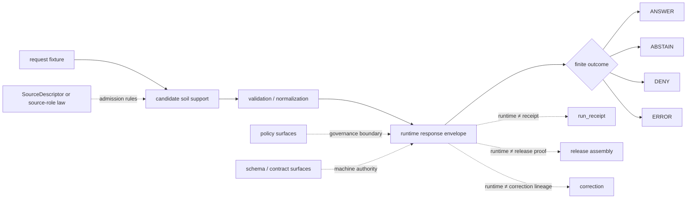

<!-- [KFM_META_BLOCK_V2]
doc_id: kfm://doc/NEEDS_VERIFICATION__soils_runtime_proof_readme
title: Runtime Proof — Soils
type: standard
version: v1
status: draft
owners: @bartytime4life
created: NEEDS_VERIFICATION__YYYY-MM-DD
updated: 2026-04-17
policy_label: NEEDS_VERIFICATION__public_or_internal
related: [
  ../README.md,
  ../../README.md,
  ../../../README.md,
  ../../release_assembly/README.md,
  ../../correction/README.md,
  ../../../../contracts/README.md,
  ../../../../policy/README.md,
  ../../../../schemas/README.md,
  ../../../../docs/README.md,
  ../../../../.github/CODEOWNERS,
  ../../../../.github/workflows/README.md
]
tags: [kfm, tests, e2e, runtime-proof, soils, agriculture, ssurgo, sda, spec_hash, run_receipt]
notes: [
  Soil-lane doctrine is strong in the attached KFM corpus, but the exact mounted contents of tests/e2e/runtime_proof/soils were not directly surfaced in this session.
  Owners are grounded at /tests/ scope; exact leaf-level assignment still needs branch verification.
  This README intentionally preserves a narrow current-safe claim and a clearly marked proposed growth shape so it can be merged without overstating active branch contents.
  Subject-specific contract, schema, validator, and runner paths for soils remain NEEDS VERIFICATION until directly surfaced from the checked-out branch.
]
[/KFM_META_BLOCK_V2] -->

<a id="top"></a>

# Runtime Proof — Soils

Request-time proof lane for qualified soils outcomes, visible source-role and scale semantics, component-weighting discipline, and fail-closed authoritative-versus-derived behavior in KFM.


> [!NOTE]
> **Status:** `experimental`  
> **Owners:** `@bartytime4life` *(confirmed at `/tests/` scope; exact leaf-level assignment still needs branch verification)*  
> **Path:** `tests/e2e/runtime_proof/soils/README.md`  
> **Repo fit:** child whole-path proof leaf under [`../README.md`](../README.md), inside the broader [`../../README.md`](../../README.md) `e2e/` family; bounded by authoritative contract, policy, schema, release-assembly, and correction surfaces rather than replacing them  
> **Accepted inputs:** small request/response fixtures, tiny normalized soil candidates, weighting and resolution cases, source-role qualifiers, and minimal expected outward-response fragments  
> **Exclusions:** policy bundle authorship, canonical soil schemas, release-proof artifacts, raw SSURGO mirrors, live watcher code, and guessed workflow claims  
> **Quick jump:** [Scope](#scope) · [Current evidence posture](#current-evidence-posture) · [Repo fit](#repo-fit) · [Accepted inputs](#accepted-inputs) · [Exclusions](#exclusions) · [Directory tree](#directory-tree) · [Quickstart](#quickstart) · [Usage](#usage) · [Runtime outcomes](#runtime-outcomes) · [Proof matrix](#proof-matrix) · [Diagram](#diagram) · [Operating tables](#operating-tables) · [Task list](#task-list) · [FAQ](#faq) · [Appendix](#appendix)

> [!IMPORTANT]
> This leaf should prove **runtime behavior**, not quietly become the home of source custody, policy authority, release proof, or workflow mythology.

> [!CAUTION]
> **Soils look stable, but they are not interpretation-free.**  
> Runtime proof in this lane should make it harder to flatten **SSURGO**, **Soil Data Access (SDA)**, **gSSURGO**, and **gNATSGO** into one unqualified “soil layer,” or to hide component weighting, resolution choice, refresh cadence, and derived status behind generic prose.

---

## Scope

This directory is for **whole-path runtime proof** of soils behavior in a KFM slice where soil baselines, joins, and derived summaries must stay inspectable.

It should prove whether a runtime-facing request can or cannot produce a qualified outward result when soils support is:

- present and well-formed
- source-explicit
- semantically qualified
- map-unit versus gridded support visible
- weighting or aggregation basis visible where required
- refresh or release posture visible where the wording depends on “current” or “latest”
- public-safe or visibly constrained
- denied, abstained, or errored in a reviewable way when support is weak

This leaf should **not** decide final publication policy, sign release artifacts, or imply a mounted scheduler.

### What this leaf is proving

- request-time outcome behavior
- fail-closed handling of weak or malformed soils support
- visible distinction between authoritative and derived soil surfaces
- source-role clarity for **SSURGO / SDA** versus **gSSURGO / gNATSGO** and contextual companions
- explicit separation of **runtime response**, **receipt**, **proof**, and **catalog** functions
- visibility of `spec_hash`, validator-result seams, and source vintage when the trust story depends on them
- bounded outward handling of weighting, aggregation, and resolution choices
- finite runtime outcomes without pretending release proof already exists

### What this leaf is not proving

- branch-protected release automation
- cryptographic publication success
- final schema-home authority for soil objects
- full watcher or ETL implementation depth
- live connector maturity on the checked-out branch beyond what is directly surfaced

[Back to top](#top)

---

## Current evidence posture

| Surface or claim | Status | Why it matters here |
| --- | --- | --- |
| `tests/e2e/` is a real visible family with `runtime_proof/`, `release_assembly/`, and `correction/` | **CONFIRMED** | This leaf belongs in an end-to-end proof family, not a release or correction lane |
| `runtime_proof/` is the request-time outcome-focused proof family | **CONFIRMED** | The soils leaf should stay centered on outward runtime behavior |
| `/tests/` ownership resolves to `@bartytime4life` | **CONFIRMED at parent scope** | Grounds the visible owner cue while keeping exact leaf assignment reviewable |
| Exact mounted contents of `tests/e2e/runtime_proof/soils/` on the active branch | **NEEDS VERIFICATION** | This README should stay truthful even if the leaf is currently README-only |
| Public `.github/workflows/` inventory beyond documentation surfaces | **NEEDS VERIFICATION** | Do not silently imply checked-in merge gates or runner wiring |
| Soils / agriculture are strong watcher territory after hydrology | **CONFIRMED doctrine** | Justifies a subject-specific soils runtime-proof leaf |
| Resolution choice, component weighting, refresh cadence, and authoritative-versus-derived status are load-bearing in soils answers | **CONFIRMED caution** | These are the first things the fixtures should pressure |

> [!TIP]
> Treat public `main` as a useful baseline, not the final merge authority. The checked-out branch under review should outrank it when directly available.

[Back to top](#top)

---

## Repo fit

**Path:** `tests/e2e/runtime_proof/soils/README.md`  
**Role:** whole-path proof leaf for outward soils runtime behavior  
**Primary consumers:** maintainers, reviewers, contract/schema editors, and anyone tightening request-time soil semantics

### Upstream

- [`../../../README.md`](../../../README.md)
- [`../../README.md`](../../README.md)
- [`../README.md`](../README.md)
- [`../../release_assembly/README.md`](../../release_assembly/README.md)
- [`../../correction/README.md`](../../correction/README.md)
- [`../../../../contracts/README.md`](../../../../contracts/README.md)
- [`../../../../policy/README.md`](../../../../policy/README.md)
- [`../../../../schemas/README.md`](../../../../schemas/README.md)
- [`../../../../docs/README.md`](../../../../docs/README.md)
- [`../../../../.github/workflows/README.md`](../../../../.github/workflows/README.md)
- [`../../../../.github/CODEOWNERS`](../../../../.github/CODEOWNERS)

### Adjacent

- future shared soil fixture custody, if mounted later
- future soil validator lanes, if mounted later
- future source-descriptor or schema surfaces for soil map units, components, horizons, or gridded soil products
- future governed API runtime surfaces that emit outward soils envelopes

### Downstream

- reviewer-local runtime proof summaries
- PR evidence blocks, when a real runner exists
- subject-specific runtime tightening work

> [!NOTE]
> This leaf is downstream of contract and policy authority. It should consume those surfaces, not replace them.

[Back to top](#top)

---

## Accepted inputs

This lane should accept **small, explicit, reviewable** materials that help prove runtime behavior without turning the directory into a source mirror or release lane.

| Input class | Examples | Why it belongs here | Status |
| --- | --- | --- | --- |
| Request / response fixture pairs | `request.json` + `expected.response.json` by case | Keeps finite outcomes compact and reviewable | **PROPOSED leaf growth** |
| Tiny normalized soil candidates | one map unit, one component slice, one gridded cell summary, one AOI-local support window | Lets the leaf prove whole-path runtime behavior without shipping bulk datasets | **PROPOSED** |
| Weighting / aggregation qualifiers | dominant-component flag, `comppct_r` basis, horizon-range basis, explicit aggregation note | Prevents silent interpretive drift | **PROPOSED** |
| Resolution / authority qualifiers | `source_ref`, `source_role`, `resolution_choice`, `derived_from`, `coverage_ref` | Keeps SSURGO, gSSURGO, and gNATSGO visibly distinct | **PROPOSED** |
| Refresh / release qualifiers | source vintage, annual refresh anchor, stale-or-unknown version case | Stops old baselines from sounding “current” by accident | **PROPOSED** |
| Minimal outward-response fragments | `audit_ref`, `spec_hash`, `validator_result_ref`, `reason.code` | Pressures trust-visible runtime envelopes without dragging in release proof | **PROPOSED** |

### Operating rules

1. Keep every case **small enough to read in one diff**.
2. Prefer **one interpretive pressure per case** before composing larger scenarios.
3. Keep **authoritative** versus **derived** support visible in the case itself, not only in prose.
4. Do not let a fixture silently erase **map-unit**, **component**, **horizon**, or **grid** distinctions.
5. If a value depends on aggregation, make the **weighting basis** visible.
6. If a value depends on scale, make the **resolution choice** visible.
7. If the answer sounds time-sensitive, keep the **source vintage** or refresh posture visible.
8. Use **minimal expected outward fragments** rather than pseudo-release artifacts.
9. If a local runner later emits `actual.response.json`, document its artifact policy explicitly instead of treating generated actuals as default checked-in truth.
10. Prefer a narrow truthful subtree over a broad speculative one.

[Back to top](#top)

---

## Exclusions

This directory is **not** the authoritative home for every soils-adjacent concern.

| Does **not** belong here | Put it here instead | Why |
| --- | --- | --- |
| Canonical source-admission law | contract / source-descriptor surfaces | Admission law belongs upstream |
| Canonical soil schemas or reusable table contracts | contract / schema surfaces | Runtime proof should consume machine authority, not invent it |
| Subject-level validation as the main topic | soil validator lanes | Validator burden is narrower than outward runtime proof |
| Release manifests, proof packs, signatures, or publish-path artifacts | [`../../release_assembly/README.md`](../../release_assembly/README.md) | Release proof is a different end-to-end burden |
| Withdrawal, correction, or supersession lineage as the main topic | [`../../correction/README.md`](../../correction/README.md) | Correction deserves its own leaf |
| Full SSURGO zips, statewide GeoPackages, large raster tiles, or scrape caches | governed data zones or ignored local paths | Runtime proof should stay compact and reviewable |
| Live watcher code, scheduler wiring, ETL orchestration, or bulk transforms | pipeline, tool, or workflow lanes | README prose is not implementation proof |
| Soil-moisture time-series behavior as the main topic | sibling `soil_moisture/` leaf if present | Time-varying observation proof is a different burden from soil-baseline proof |
| Quiet replacement of authoritative support with coarser companions | nowhere | that is exactly the behavior this leaf should catch and refuse |

[Back to top](#top)

---

## Directory tree

### Current safe claim

This session did **not** directly surface the active branch contents for this exact target leaf.

The only safe branch-backed claim this README can make without overreach is the target document itself.

```text
tests/e2e/runtime_proof/
└── soils/
    └── README.md
```

### Preferred growth shape (`PROPOSED` / `NEEDS VERIFICATION`)

```text
tests/e2e/runtime_proof/
└── soils/
    ├── README.md
    ├── fixtures/
    │   ├── answer_ssurgo_mapunit_public_safe/
    │   │   ├── request.json
    │   │   └── expected.response.json
    │   ├── answer_gssurgo_weighted_summary_labeled_derived/
    │   │   ├── request.json
    │   │   └── expected.response.json
    │   ├── abstain_missing_weighting_basis/
    │   │   ├── request.json
    │   │   └── expected.response.json
    │   ├── abstain_unknown_release_or_refresh_basis/
    │   │   ├── request.json
    │   │   └── expected.response.json
    │   ├── deny_mixed_authority_or_resolution_flattening/
    │   │   ├── request.json
    │   │   └── expected.response.json
    │   └── error_malformed_request/
    │       ├── request.json
    │       └── expected.response.json
    └── examples/
        └── verify-soils-runtime.<ext>
```

> [!TIP]
> Add only the smallest leaf shape the active branch can actually support. A narrow truthful subtree is better than a broad speculative one.

[Back to top](#top)

---

## Quickstart

Use inspection-first commands so this README stays honest as the branch evolves.

### 1) Confirm what is actually mounted

```bash
find tests/e2e -maxdepth 4 -print 2>/dev/null | sort
find tests/e2e/runtime_proof -maxdepth 4 -print 2>/dev/null | sort
find tests/e2e/runtime_proof/soils -maxdepth 4 -print 2>/dev/null | sort
```

### 2) Re-read the family map before adding cases

```bash
sed -n '1,260p' tests/README.md 2>/dev/null || true
sed -n '1,240p' tests/e2e/README.md 2>/dev/null || true
sed -n '1,220p' tests/e2e/runtime_proof/README.md 2>/dev/null || true
sed -n '1,220p' tests/e2e/release_assembly/README.md 2>/dev/null || true
sed -n '1,220p' tests/e2e/correction/README.md 2>/dev/null || true
sed -n '1,220p' contracts/README.md 2>/dev/null || true
sed -n '1,220p' policy/README.md 2>/dev/null || true
sed -n '1,220p' schemas/README.md 2>/dev/null || true
sed -n '1,220p' docs/README.md 2>/dev/null || true
sed -n '1,220p' .github/workflows/README.md 2>/dev/null || true
```

### 3) Reconfirm soils vocabulary before inventing payloads

```bash
grep -RIn \
  -e 'SSURGO' \
  -e 'Soil Data Access' \
  -e 'SDA' \
  -e 'gSSURGO' \
  -e 'gNATSGO' \
  -e 'MUKEY' \
  -e 'COKEY' \
  -e 'component weighting' \
  -e 'resolution choice' \
  -e 'authoritative' \
  -e 'derived' \
  -e 'spec_hash' \
  -e 'run_receipt' \
  -e 'SourceDescriptor' \
  -e 'ABSTAIN' \
  -e 'DENY' \
  -e 'ERROR' \
  tests contracts policy schemas docs tools pipelines apps 2>/dev/null || true
```

### 4) Start with one case per outcome

A good first pass is:

1. one `ANSWER` using authoritative map-unit support
2. one `ANSWER` using visibly derived gridded support
3. one `ABSTAIN` for missing weighting or release basis
4. one `DENY` for mixed authority or resolution flattening
5. one `ERROR` for malformed request shape

Do not widen into more scenarios until those stay reviewable and consistent.

### 5) Document the real runner only after it exists

If this leaf later gains executable cases, document the **actual** local and CI invocation surface used on the active branch. Do not leave guessed `pytest`, `node`, shell, or workflow commands behind.

### 6) Keep `soils/` and `soil_moisture/` distinct

Do not inherit sensor-specific field names, freshness rules, or runner language into this leaf by accident.  
`soils/` is about **soil baselines, joins, weighting, and scale discipline**.  
`soil_moisture/`, if mounted, is about **time-varying observation context**.

[Back to top](#top)

---

## Usage

### What belongs here conceptually

Use this leaf when the main question is:

> “Does the request-time KFM runtime respond correctly and visibly when soils support is authoritative, derived, stale, underqualified, mixed-scale, or malformed?”

### What belongs elsewhere

| If the main question is… | Best home | Why |
| --- | --- | --- |
| “Is the source admitted safely and explicitly?” | contract / source-descriptor surfaces | Admission law belongs there |
| “Are the tiny source slices reusable and stable?” | shared fixture lane | That is fixture custody, not whole-path runtime proof |
| “Did subject-level validation pass or fail?” | subject-specific validator lanes | Validator burden is narrower than outward runtime behavior |
| “Does policy allow, deny, or route review?” | policy lanes | Policy is the authority there |
| “Did publication / promotion / signing close correctly?” | release-assembly lanes | That is release proof, not runtime proof |
| “Did correction, supersession, or stale-visible lineage stay coherent?” | correction lanes | Correction lineage is the primary burden there |
| “Is this about live soil-moisture station behavior?” | soil-moisture runtime-proof or hydrology observation lanes | That is a different subject and time model |

### Why this leaf exists at all

KFM treats **hydrology** as the strongest first proof lane, and the attached corpus repeatedly identifies **soils / agriculture** as the next strong watcher territory.

A soils runtime-proof leaf is useful because it can pressure:

- source-role visibility
- explicit resolution choice
- explicit component-weighting and aggregation semantics
- authoritative-versus-derived distinction
- release-vintage and refresh-cadence visibility
- `SourceDescriptor` → canonical candidate → validator result → `spec_hash` → `run_receipt` thinking
- finite runtime outcomes without pretending release proof already exists
- explicit refusal when the support is underqualified or semantically unsafe

> [!IMPORTANT]
> This leaf should make it harder to answer a soils question with an unqualified, source-flattened, stale, or semantically ambiguous response.

[Back to top](#top)

---

## Runtime outcomes

This leaf should use a **finite runtime grammar**.

| Outcome | Meaning in this leaf |
| --- | --- |
| `ANSWER` | Enough qualified support exists to emit a soils runtime result with source role, scale, attribute target, and trust cues visible |
| `ABSTAIN` | Support is missing or too weak for a trustworthy answer, but no explicit runtime trust violation has been detected |
| `DENY` | Runtime detects a disallowed or trust-breaking condition on a required path and refuses the operation |
| `ERROR` | Malformed request, malformed fixture, broken contract, or non-policy runtime fault |

> [!NOTE]
> `ABSTAIN`, `DENY`, and `ERROR` can all be **successful expected outcomes** for this suite when the system reaches them correctly and visibly.

### Local interpretation rule

Until a mounted soils runtime contract says otherwise, keep the distinction simple and stable:

- use **`ANSWER`** only when source role, scale, and semantic basis are visible enough to trust
- use **`ABSTAIN`** for insufficient support, missing weighting basis, or missing release basis
- use **`DENY`** for explicit trust or semantic violations, such as hidden source flattening
- use **`ERROR`** for malformed inputs or broken runtime shape

If a later machine contract chooses a different split, update this README and the fixtures together.

### Trust-visible outward fields (`PROPOSED` local expression)

| Field | Purpose | Notes |
| --- | --- | --- |
| `outcome` | finite runtime result | `ANSWER` / `ABSTAIN` / `DENY` / `ERROR` |
| `reason.code` | stable machine-readable cause | keep concise and reviewable |
| `reason.message` | human-readable explanation | explain the visible cause calmly |
| `source_ref` | declared source identity | preserve citation-ready source identity |
| `source_role` | authoritative / derived / context class | do not flatten source class |
| `mukey` or `coverage_ref` | support traceability | keep map-unit or AOI basis visible |
| `attribute_name` | semantic target | e.g. `hydgrp`, `hydric_flag`, `awc_r` |
| `resolution_choice` | scale semantics | map-unit, polygon aggregate, grid, or fallback should stay visible |
| `weighting_basis` | aggregation discipline | e.g. dominant component, `comppct_r`, or depth-weighted basis |
| `source_vintage` | release semantics | annual refresh, extract date, or survey version |
| `spec_hash` | deterministic identity seam | visible when runtime depends on versioned support |
| `validator_result_ref` | subject-level validation visibility | optional but valuable |
| `run_receipt_ref` | optional machine-memory link | present only if actually emitted by the lane |
| `freshness` or `refresh_anchor` | support sufficiency | especially when outward wording implies currentness |
| `audit_ref` | reviewer or runtime trace hook | trust-visible boundary evidence |
| `obligations` | constrained answer cues | required when the response is narrowed but still outward-facing |

> [!TIP]
> A runtime response is **not** the same thing as a `run_receipt`.  
> The runtime response is outward trust state; the receipt is machine-readable process memory.

[Back to top](#top)

---

## Proof matrix

| Case family | What it pressures | Expected outcome | Minimum visible cues |
| --- | --- | --- | --- |
| Authoritative map-unit answer | SSURGO / SDA source role with explicit map-unit support | `ANSWER` | `source_ref`, `source_role`, `mukey`, `attribute_name`, `source_vintage` |
| Derived statewide grid answer | gSSURGO or gNATSGO answer that stays visibly derived | `ANSWER` | `source_role`, `resolution_choice`, `derived_from` or equivalent cue |
| Missing weighting basis | map-unit aggregate without visible component or horizon basis | `ABSTAIN` | `reason.code`, `attribute_name`, missing `weighting_basis` explanation |
| Unknown release or refresh basis | outward “current” answer without visible soil release basis | `ABSTAIN` | `reason.code`, stale or unknown `source_vintage` posture |
| Mixed authority or scale flattening | SSURGO and gNATSGO silently collapsed into one answer | `DENY` | explicit source-role conflict and visible refusal |
| Malformed request | broken or incomplete runtime input | `ERROR` | visible technical fault, not policy theater |

[Back to top](#top)

---

## Diagram



[Back to top](#top)

---

## Operating tables

### Soil source-role cues

| Surface | Role at runtime | What must stay visible |
| --- | --- | --- |
| **SSURGO / SDA** | authoritative vector / tabular soil support | map-unit or component basis, extract/query vintage, join-key logic |
| **gSSURGO** | derived gridded companion | derivative status, grid resolution, lag relative to direct SSURGO/SDA support |
| **gNATSGO** | broader gridded companion / fallback | fallback status and coarser-scale implications |
| Kansas GeoPortal or other mirrors | convenience derivative / mirror | mirror identity should not outrank the authoritative source |
| USDA Quick Stats or crop-condition context | production / context signal | not a soil-property source and not a substitute for soil-support truth |
| Kansas Mesonet / SCAN / SMAP | time-varying moisture context | useful neighbor lane, not a replacement for soil map-unit truth |

### Common failure conditions this leaf should catch

| Failure | Why it matters | Better outcome than bluffing |
| --- | --- | --- |
| Missing `mukey` or coverage basis | answer cannot be traced to support | `ABSTAIN` or `ERROR` |
| Hidden dominant-component assumption | silently biases output | `ABSTAIN` |
| Mixed map-unit and grid sources without qualifier | source-role flattening | `DENY` |
| Unknown release or refresh basis | old soil baseline sounds current | `ABSTAIN` |
| Malformed attribute request | broken runtime shape | `ERROR` |
| Derived grid presented as authoritative | false trust posture | `DENY` |

[Back to top](#top)

---

## Task list

### Thin-slice definition of done

- [ ] this target leaf exists on the active branch
- [ ] one `ANSWER`, one `ABSTAIN`, one `DENY`, and one `ERROR` case exist
- [ ] every case keeps source role explicit
- [ ] every authoritative answer keeps map-unit or coverage basis explicit
- [ ] every derived answer keeps resolution choice explicit
- [ ] every aggregate answer keeps weighting basis explicit
- [ ] every time-sensitive answer keeps source vintage or refresh posture visible
- [ ] at least one outward response example points cleanly to an `audit_ref`
- [ ] at least one case keeps `spec_hash` and validator-result visibility explicit where the trust story depends on them
- [ ] any `run_receipt` example stays visibly downstream of runtime response, not merged into it
- [ ] if this leaf later emits `actual.response.json`, its artifact policy is documented explicitly
- [ ] placeholders in the meta block are replaced with repo-backed values
- [ ] the README no longer implies runner, workflow, signing, or branch-protection maturity that the branch does not prove

### What should be verified before moving from `draft` toward `review`

- actual mounted path inventory
- actual runner / toolchain
- whether a shared soils fixture lane exists and should be consumed here
- whether machine contracts for soil runtime envelopes already exist
- whether subject-specific contract surfaces for SoilMapUnit / Component / Horizon are already mounted
- whether `ABSTAIN` versus `DENY` for stale or mixed-resolution soil support is already settled elsewhere
- whether runtime envelopes already expose `spec_hash`, validator result, or `run_receipt` references on the active branch
- whether this leaf is intentionally separate from any mounted `soil_moisture/` lane
- whether workflow artifact upload and retention behavior is visible on the active branch

[Back to top](#top)

---

## FAQ

### Why is this under `runtime_proof/` instead of a fixture lane?

Because the primary burden here is **outward runtime behavior**, not source-slice custody. Tiny source slices may feed the cases, but the point of this leaf is the result the runtime shows when soils support is strong, weak, stale, mixed-scale, or malformed.

### Why separate `soils/` from `soil_moisture/`?

Because the burden is different.  
`soils/` is about **soil baselines, joins, weighting, source vintage, and scale discipline**.  
`soil_moisture/` is about **time-varying observation context**.  
Collapsing those subjects would make both leaves less truthful.

### Why keep mentioning **SSURGO / SDA** instead of just saying “soil data”?

Because KFM treats source roles as admission contracts, not decorative labels. An answer backed by **SSURGO / SDA** does not carry the same role, scale, or caveats as one backed by **gSSURGO**, **gNATSGO**, or a mirror.

### Does this leaf make **gSSURGO** or **gNATSGO** authoritative?

No. They can still be useful outward support, but only when their **derived** and **scale** posture stays visible. This leaf should make silent replacement harder, not easier.

### Do `ABSTAIN` and `DENY` count as passing tests?

Yes. In KFM, fail-closed behavior is part of the trust contract. If a case should abstain or deny and it does so clearly, that is a successful proof result.

### Does this README prove live automation already exists?

No. It documents the burden and the preferred shape of the leaf. Runner wiring, workflow YAML, required checks, and signed publication behavior still need direct branch verification.

### Why not let this leaf decide publication or policy outcomes directly?

Because KFM keeps **policy authority** in policy and governed runtime surfaces, and keeps **publication proof** in release-assembly surfaces. Runtime proof should show boundary behavior, not become a shadow policy or release engine.

[Back to top](#top)

---

## Appendix

<details>
<summary><strong>Illustrative example envelopes</strong> (<strong>illustrative only</strong>)</summary>

These examples are here to make the leaf concrete without pretending the final request or response contract is already mounted and canonical.

### Example `ANSWER`

```json
{
  "outcome": "ANSWER",
  "reason": {
    "code": "soil_support_qualified",
    "message": "Qualified soil support was available for the requested map-unit attribute."
  },
  "source_ref": "kfm://source/ssurgo-sda",
  "source_role": "authoritative_vector_tabular",
  "mukey": "123456",
  "attribute_name": "hydgrp",
  "resolution_choice": "mapunit",
  "source_vintage": "SSURGO-2026",
  "audit_ref": "kfm://receipt/runtime/soils-001"
}
```

### Example `ABSTAIN`

```json
{
  "outcome": "ABSTAIN",
  "reason": {
    "code": "missing_weighting_basis",
    "message": "A soil aggregate was available, but the component-weighting or horizon basis required for a trustworthy answer was missing."
  },
  "source_ref": "kfm://source/ssurgo-sda",
  "source_role": "authoritative_vector_tabular",
  "attribute_name": "om_pct",
  "audit_ref": "kfm://receipt/runtime/soils-002"
}
```

### Example `DENY`

```json
{
  "outcome": "DENY",
  "reason": {
    "code": "mixed_authority_unqualified",
    "message": "The candidate support silently mixed authoritative and derived soil layers without a visible qualifier."
  },
  "source_ref": "kfm://source/gnatsgo",
  "source_role": "derived_grid",
  "obligations": [
    "label_derived_status",
    "label_resolution_choice"
  ],
  "audit_ref": "kfm://receipt/runtime/soils-003"
}
```

### Example `ERROR`

```json
{
  "outcome": "ERROR",
  "reason": {
    "code": "invalid_request",
    "message": "Required soils request fields were missing or malformed."
  }
}
```

### Review prompt before merge

- Is the case still the smallest meaningful whole-path proof?
- Is the source role explicit?
- Are authority, scale, weighting, and vintage explicit where needed?
- Did we preserve **runtime response ≠ receipt ≠ proof ≠ catalog**?
- Did we avoid claiming runner or workflow maturity the branch does not prove?

</details>

[Back to top](#top)
