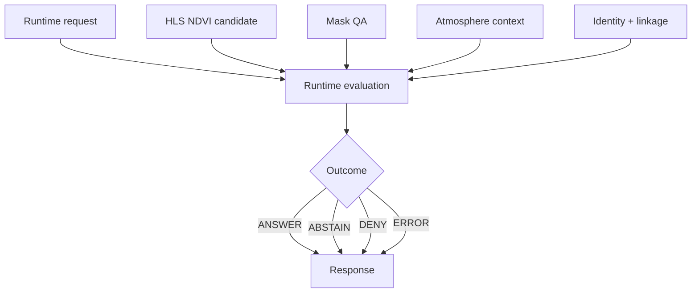

<!-- [KFM_META_BLOCK_V2]
doc_id: kfm://doc/NEEDS_VERIFICATION__runtime_proof_vegetation_change_readme
title: tests/e2e/runtime_proof/vegetation_change
type: standard
version: v1
status: draft
owners: @bartytime4life
created: NEEDS_VERIFICATION__YYYY-MM-DD
updated: 2026-04-16
policy_label: NEEDS_VERIFICATION__public_or_internal
related: [
  ../README.md,
  ../../README.md,
  ../../../README.md,
  ../../release_assembly/README.md,
  ../../correction/README.md,
  ../../../../CONTRIBUTING.md,
  ../../../../contracts/README.md,
  ../../../../policy/README.md,
  ../../../../schemas/README.md,
  ../../../../schemas/contracts/README.md,
  ../../../../schemas/contracts/v1/runtime/README.md,
  ../../../../schemas/vegetation_change/README.md,
  ../../../../tools/validators/vegetation_change/README.md,
  ../../../../pipelines/hls-ndvi/README.md,
  ../../../../tools/air_quality/smoke_gate/README.md,
  ../../../../data/receipts/README.md,
  ../../../../data/proofs/README.md,
  ../../../../data/catalog/stac/README.md,
  ../../../../data/catalog/dcat/README.md,
  ../../../../data/catalog/prov/README.md,
  ../../../../.github/CODEOWNERS,
  ../../../../.github/workflows/README.md
]
tags: [kfm, tests, e2e, runtime-proof, vegetation-change, ndvi, hls, spec_hash, run_receipt]
notes: [
  Revised from the provided baseline runtime-proof vegetation-change README.
  Preserves doctrine: runtime ≠ receipt ≠ proof ≠ catalog, fail-closed posture, and aggregation-first design.
  Exact mounted subtree, fixtures, runtime wiring, CI callers, and policy label remain NEEDS VERIFICATION.
]
[/KFM_META_BLOCK_V2] -->

<a id="top"></a>

# `tests/e2e/runtime_proof/vegetation_change/`

Request-time proof lane for vegetation-change outcomes, enforcing fail-closed behavior, public-safe aggregation, and explicit QA + atmospheric qualifiers.

> [!NOTE]
> **Status:** `experimental`  
> **Owners:** `@bartytime4life` *(confirmed at `/tests/` scope; leaf-level ownership NEEDS VERIFICATION)*  
> **Path:** `tests/e2e/runtime_proof/vegetation_change/README.md`  
> 
> 
> 
> 
> 
>   
> **Quick jumps:** [Scope](#scope) · [Repo fit](#repo-fit) · [Accepted inputs](#accepted-inputs) · [Exclusions](#exclusions) · [Directory tree](#directory-tree) · [Quickstart](#quickstart) · [Usage](#usage) · [Runtime outcomes](#runtime-outcomes) · [Diagram](#diagram) · [Tables](#tables) · [Task list](#task-list--definition-of-done) · [FAQ](#faq) · [Appendix](#appendix)

> [!IMPORTANT]
> This leaf proves **runtime behavior**, not preparation, validation, policy, or publication.

> [!WARNING]
> Vegetation change is not a single threshold. Runtime must preserve:
> - mask burden  
> - atmospheric contradiction  
> - time basis  
> - spatial support  
> - identity + linkage  

> [!CAUTION]
> This document is contract-first. Do not assume fixtures, workflows, or runtime wiring exist unless verified on the active branch.

---

## Scope

This lane proves **request-time outcomes** for vegetation-change queries.

It answers:

> Can the runtime produce a governed outward result given available support?

### Proven behaviors

- outward runtime outcomes (`ANSWER`, `ABSTAIN`, `DENY`, `ERROR`)
- fail-closed handling of weak or incomplete support
- explicit QA + mask visibility
- explicit atmospheric contradiction handling
- public-safe aggregation (county / HUC12)
- deterministic identity compatibility (`spec_hash`)
- trust linkage (audit, receipt, validator)

### Not proven here

- HLS ingest or NDVI derivation
- atmospheric modeling
- validation logic ownership
- policy thresholds or decision law
- release proof or catalog publication

---

## Repo fit

This is a **leaf in the runtime-proof family**:

```
tests/e2e/
├── runtime_proof/
├── release_assembly/
└── correction/
```

### Key relationships

| Surface | Role |
|---|---|
| `runtime_proof/` | request-time outcome verification |
| `release_assembly/` | release completeness |
| `correction/` | rollback / supersession |
| `schemas/vegetation_change/` | object shape authority |
| `tools/validators/vegetation_change/` | review readiness |
| `policy/` | decision law |

### Boundary rule

This leaf:

- **consumes** schema + validator outputs  
- **proves** runtime behavior  
- **does not own** policy, validation, or release

---

## Accepted inputs

This lane operates on **small, runtime-facing inputs**:

| Input | Purpose | Status |
|---|---|---|
| request/response fixture pairs | smallest runtime proof unit | PROPOSED |
| county / HUC12 identifiers | public-safe aggregation | INFERRED |
| observed + baseline windows | time clarity | INFERRED |
| mask summaries | QA visibility | INFERRED |
| atmospheric context | contradiction visibility | INFERRED |
| `spec_hash` | deterministic identity | INFERRED |
| trust refs (`run_receipt_ref`, `audit_ref`) | linkage | INFERRED |

### Good fixture shape

- one request  
- one expected outcome  
- one bounded AOI  
- one explicit support profile  

---

## Exclusions

This lane does NOT include:

- raw EO ingestion
- NDVI computation
- smoke / AOD modeling
- validator logic
- policy rules
- release artifacts
- exact-point geometry
- workflow definitions

---

## Directory tree

### Current safe claim

```text
tests/e2e/runtime_proof/
└── vegetation_change/
    └── README.md
```

### Proposed shape

```text
tests/e2e/runtime_proof/
└── vegetation_change/
    ├── fixtures/
    │   ├── answer_case/
    │   ├── abstain_case/
    │   ├── deny_case/
    │   └── error_case/
    └── tests/
```

---

## Quickstart

```bash
# Inspect actual tree
find tests/e2e/runtime_proof/vegetation_change -maxdepth 3

# Search vocabulary
grep -RIn "NDVI\|vegetation\|spec_hash" tests schemas tools
```

---

## Usage

### Use when

- validating runtime behavior
- proving outward outcomes
- checking fail-closed semantics

### Do not use when

- building pipelines
- writing validators
- defining schemas
- publishing outputs

---

## Runtime outcomes

| Outcome | Meaning |
|---|---|
| `ANSWER` | sufficient, qualified support |
| `ABSTAIN` | insufficient support |
| `DENY` | disallowed request |
| `ERROR` | malformed or failed execution |

---

## Diagram



---

## Tables

### Boundary matrix

| Layer | Responsibility |
|---|---|
| Schema | shape |
| Validator | readiness |
| Runtime | outcome |
| Receipt | process memory |
| Proof | trust artifact |
| Catalog | discovery |

---

## Task list — definition of done

- [ ] verify subtree exists
- [ ] add minimal fixtures
- [ ] add pass / abstain / deny / error cases
- [ ] confirm runtime wiring
- [ ] validate deterministic replay

---

## FAQ

**Why runtime proof separate from validator?**  
Validator = readiness. Runtime = outward decision.

**Why aggregation first?**  
Safer, more governable surface.

---

## Appendix

<details>
<summary>Illustrative outputs</summary>

```json
{ "outcome": "ANSWER" }
```

</details>

[Back to top](#top)
