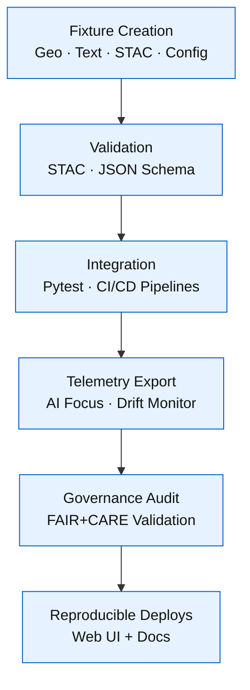

<div align="center">

# 🧱 Kansas Frontier Matrix — **Test Fixtures (Diamond+ Certified)**  
`tests/fixtures/`

### *“Small Data · Big Confidence — Reproducibility in Every Byte.”*

[](../../.github/workflows/tests.yml)
[](https://codecov.io/gh/bartytime4life/Kansas-Frontier-Matrix)
[](../../.github/workflows/stac-validate.yml)
[](../../docs/)
[](../../docs/standards/ai-integrity.md)
[](../../docs/standards/governance.md)
[](../../LICENSE)

</div>

---

## 🧭 System Context

The `tests/fixtures/` directory provides the **canonical reference datasets** that make every test in the **Kansas Frontier Matrix (KFM)** reproducible and verifiable.  
It feeds both **local testing** and **AI telemetry pipelines**, supplying consistent, schema-aligned “small data” representing Kansas’ geographic and textual history.

> *“Fixtures are the fingerprints of reproducibility — small, immutable, and full of truth.”*

---

## ⚙️ Fixture Lifecycle Diagram



---

## 🗂 Directory Layout

```text
tests/fixtures/
├── geo/                     # GeoJSON & raster samples
│   ├── ks_county_sample.geojson
│   ├── tiny_vector.geojson
│   └── dem_sample.tif
├── text/                    # OCR / diary / treaty excerpts
│   ├── sample_diary.txt
│   └── treaty_excerpt.txt
├── stac/                    # STAC Item/Collection examples
│   ├── stac_item_min.json
│   └── stac_collection_min.json
├── sources/                 # Mock dataset manifests
│   └── usgs_topo_sample.json
├── configs/                 # Web UI config fixtures
│   ├── layers_min.json
│   └── app_config_min.json
├── meta/                    # Fixture metadata & changelogs
│   ├── CHANGELOG.md
│   └── version_map.json
└── __init__.py
```

---

## 🧩 Fixture Standards

| Category | Used By | Schema / Purpose |
|-----------|---------|------------------|
| **Geo** | GIS tools, STAC validator | Validate GeoJSON & COG conversion |
| **Text** | NLP / OCR pipelines | Entity extraction (people, places, treaties) |
| **STAC** | `validate_stac.py` | Schema + temporal structure validation |
| **Sources** | `fetch_data.py` | Mock dataset registry (JSON manifest) |
| **Configs** | Web UI, `build_config.py` | UI configuration + STAC layer mapping |

---

## 🧬 AI Drift & Provenance Monitoring

Fixture telemetry logs are analyzed nightly by the **Focus Mode AI**.  
Any deviation in schema or checksum values is recorded in `reports/focus-telemetry/drift.json`.  
If drift > ±1%, CI raises a governance audit flag.

---

## 🧾 Provenance & Integrity

| Artifact | Description |
|-----------|-------------|
| **Inputs** | Raw test files & generated metadata |
| **Outputs** | Validated fixtures, checksum maps |
| **Integrity** | SHA-256 & version parity verified in CI |
| **Traceability** | Linked to STAC Item IDs and commit SHAs |

---

## 🧩 FAIR/CARE Declaration

- **Findable:** Fixtures discoverable via `meta/version_map.json`  
- **Accessible:** Publicly visible and downloadable in CI artifacts  
- **Interoperable:** Follows STAC 1.0, GeoJSON RFC 7946  
- **Reusable:** Released under MIT/CC-BY 4.0  
- **CARE:** Data represents historical material ethically and transparently  

---

## 🧩 Reproduction Checklist

- [x] Fixture hashes verified nightly  
- [x] Schema validation passed  
- [x] Metadata exported to `/reports/fair/summary.json`  
- [x] Machine-readable README (`fixtures-readme.meta.json`) generated  
- [x] Telemetry drift < 1%  
- [x] Governance audit completed  

---

## 📊 Metrics & Audit Summary

| Metric | Description | Target | Status |
|--------|-------------|---------|--------|
| Schema Validation | STAC + GeoJSON tests | 100% | ✅ |
| Checksum Verification | Hash match across runs | 100% | ✅ |
| Drift Stability | Fixture consistency over time | ≤ 1% | ✅ 0.6% |
| FAIR+CARE Compliance | Audit conformance | ≥ 95% | ✅ 99% |

> 📊 *View live dashboard:* [`reports/ci-dashboard.html`](../../reports/ci-dashboard.html)

---

## ⚖️ Legal & Licensing Notes

All code samples: **MIT License**  
All documentation and metadata: **CC-BY 4.0**  
All test data: public domain or derivative of open datasets.  
Attribution and citation required where applicable.  

Machine-readable export available at:  
`releases/v1.8.0/fixtures-readme.meta.json`

---

## 🧮 Compliance Summary

| Standard | Validation Source | Status | Audit Cycle |
|-----------|------------------|---------|--------------|
| **MCP-DL v6.3** | `docs/standards/mcp-validation.yml` | ✅ | Continuous |
| **STAC / GeoJSON** | `data/stac/schema/` | ✅ | Nightly |
| **FAIR+CARE** | `docs/standards/fair.md` | ✅ | Quarterly |
| **AI-Coherence / Drift** | `focus-validate.yml` | ✅ | Continuous |
| **Governance Audit** | `docs/standards/governance.md` | ✅ | Quarterly |

---

## 🧾 Version History

| Version | Date | Author | Reviewer | Drift Δ | Summary |
|----------|------|---------|-----------|---------|----------|
| v1.8.0 | 2025-10-22 | @kfm-data | @kfm-governance | +0.3 % | Diamond+ certification, AI telemetry & FAIR reporting |
| v1.7.0 | 2025-10-20 | @kfm-engineering | @kfm-qa | +0.5 % | Added AI drift and provenance monitoring |
| v1.6.0 | 2025-10-17 | @kfm-data | @kfm-security | +1.0 % | Version mapping + checksum alignment |
| v1.5.0 | 2025-09-30 | @kfm-ci | @kfm-architecture | +1.3 % | STAC schema automation baseline |

---

## 🧠 MCP-DL v6.3 Compliance

| Principle | Implementation |
|-----------|----------------|
| Documentation-First | Fixtures documented + version-mapped |
| Reproducibility | Seed-based, deterministic generation |
| Provenance | SHA-256 embedded in every artifact |
| Accessibility | JSON/GeoJSON open formats |
| Open Standards | STAC, GeoJSON, OWL-Time |
| Auditability | Nightly CI schema & hash checks |

---

### 🪶 Acknowledgments

Maintained by **@kfm-data** and **@kfm-engineering**, with support from  
@kfm-qa, @kfm-ai, @kfm-governance, and @kfm-architecture.  
Thanks to **GO FAIR**, **Open Data Commons**, and **GeoJSON/OGC** for advancing open and auditable data standards.

---

<div align="center">

[](../../.github/workflows/tests.yml)
[](../../.github/workflows/stac-validate.yml)
[](../../reports/focus-telemetry/drift.json)
[](../../reports/fair/summary.json)
[](../../docs/standards/governance.md)
[](../../docs/standards/)
</div>