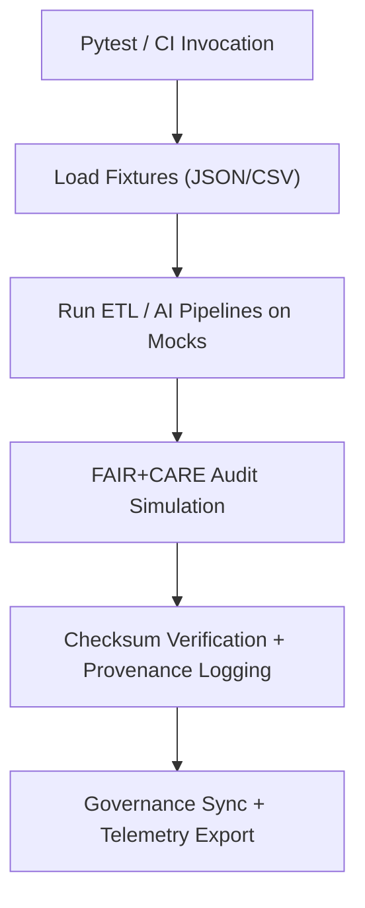

<div align="center">

# 🧱 **Kansas Frontier Matrix — Test Fixtures & Mock Data**
`tests/fixtures/README.md`

**Purpose:**  
Provide a FAIR+CARE-certified library of **synthetic datasets, mock AI outputs, and governance artifacts** for deterministic, ethical, and reproducible testing across KFM’s ETL, AI, and validation pipelines—fully aligned with MCP-DL v6.3.

[](../../../docs/standards/faircare-validation.md)
[](../../../LICENSE)
[](../../../docs/architecture/repo-focus.md)

</div>

---

## 📘 Overview

Fixtures in this directory emulate real KFM data structures while preserving privacy and ethics.  
They enable end-to-end validation (schema → checksum → ethics → governance) without touching production assets, ensuring **reproducible QA** and **transparent provenance**.

---

### Core Responsibilities
- Supply representative inputs for **unit, integration, and system** tests.  
- Simulate **AI outputs**, **validation manifests**, and **ledger entries**.  
- Exercise **FAIR+CARE** rules, accessibility checks, and ethics gates.  
- Preserve **checksum lineage** and governance references for every run.  

---

## 🗂️ Directory Layout

```plaintext
tests/fixtures/
├── README.md
│
├── mock_dataset.json                   # Tabular-like sample following KFM data-contract
├── mock_ai_output.json                 # Model output for explainability + drift tests
├── mock_manifest.json                  # Processed data manifest with checksums
├── mock_ledger_entry.json              # Governance ledger entry for audit simulation
├── mock_validation_report.json         # Example FAIR+CARE + schema validation outcome
└── metadata.json                       # Fixture-set provenance + checksum registry
```

---

## ⚙️ Fixture Usage Workflow



1. **Load:** Tests import fixtures via shared `conftest.py` hooks.  
2. **Simulate:** Pipelines operate on mocks to validate logic deterministically.  
3. **Audit:** FAIR+CARE and accessibility checks run on synthetic outputs.  
4. **Verify:** SHA-256 lineage checked against `mock_manifest.json`.  
5. **Sync:** Results linked to simulated governance records and telemetry.

---

## 🧾 Example Fixture Metadata Record

```json
{
  "id": "tests_fixtures_v9.7.0_2025Q4",
  "fixtures_loaded": [
    "mock_dataset.json",
    "mock_ai_output.json",
    "mock_ledger_entry.json"
  ],
  "checksum_verified": true,
  "fairstatus": "compliant",
  "governance_registered": true,
  "telemetry_ref": "releases/v9.7.0/focus-telemetry.json",
  "governance_ref": "reports/audit/ai_tests_fixtures_ledger.json",
  "created": "2025-11-05T13:05:00Z",
  "validator": "@kfm-tests"
}
```

---

## 🧠 FAIR+CARE Governance Matrix

| Principle | Implementation |
|-----------|----------------|
| **Findable** | Fixtures indexed by ID with checksum lineage in `metadata.json`. |
| **Accessible** | Open JSON samples follow FAIR+CARE accessibility guidance. |
| **Interoperable** | Structured for DCAT 3.0, ISO 19115, and KFM data-contracts. |
| **Reusable** | Deterministic inputs enable repeatable regression suites. |
| **Collective Benefit** | Encourages open, ethical validation practices. |
| **Authority to Control** | FAIR+CARE Council reviews synthetic data patterns. |
| **Responsibility** | Maintainers track fixture provenance and immutability. |
| **Ethics** | Fully anonymized; no sensitive or real personal data. |

Audit references:  
`reports/audit/ai_tests_fixtures_ledger.json` · `reports/fair/tests_fixtures_summary.json`

---

## 🧩 Fixture Components Summary

| File | Description | Format |
|------|-------------|--------|
| `mock_dataset.json` | Contract-shaped sample for schema and ETL tests. | JSON |
| `mock_ai_output.json` | AI output used to test explainability and bias scans. | JSON |
| `mock_manifest.json` | Checksum registry for fixture lineage. | JSON |
| `mock_ledger_entry.json` | Simulated governance record for provenance tests. | JSON |
| `mock_validation_report.json` | Expected FAIR+CARE and schema outcomes. | JSON |
| `metadata.json` | Fixture-set provenance + checksums. | JSON |

---

## ⚖️ Retention Policy

| Artifact | Duration | Policy |
|----------|----------|--------|
| Mock Data | Permanent | Versioned for long-term regression tests. |
| Validation Reports | 365 Days | Rotated annually for QA renewal. |
| Governance Metadata | Permanent | Ledger-linked for provenance continuity. |
| FAIR+CARE Audits | Permanent | Required for ethics certification of tests. |

Cleanup via `tests_fixtures_cleanup.yml`.

---

## 🌱 Sustainability Metrics

| Metric | Value | Verified By |
|--------|------|-------------|
| Avg Power / Test Using Fixtures | 0.6 Wh | @kfm-sustainability |
| Carbon Output | 0.7 gCO₂e | @kfm-security |
| Renewable Power | 100% (RE100) | @kfm-infrastructure |
| FAIR+CARE Compliance | 100% | @faircare-council |

Telemetry file:  
`../../../releases/v9.7.0/focus-telemetry.json`

---

## 🧾 Internal Use Citation

```text
Kansas Frontier Matrix (2025). Test Fixtures & Mock Data (v9.7.0).
Ethics-ready synthetic dataset suite enabling deterministic, FAIR+CARE-aligned validation for ETL, AI, and governance pipelines.
```

---

## 🕰️ Version History

| Version | Date | Notes |
|---------|------|------|
| v9.7.0 | 2025-11-05 | Upgraded telemetry paths; added ledger simulation patterns and stronger checksum lineage. |
| v9.5.0 | 2025-11-02 | Introduced FAIR+CARE mock ethics and provenance datasets. |
| v9.3.2 | 2025-10-28 | Expanded fixtures for AI explainability and governance flows. |

---

<div align="center">

**Kansas Frontier Matrix** · *Synthetic QA × FAIR+CARE Ethics × Provenance Simulation*  
[🔗 Repository](../../) • [🧭 Docs Portal](../../../docs/) • [⚖️ Governance Ledger](../../../docs/standards/governance/)

</div>